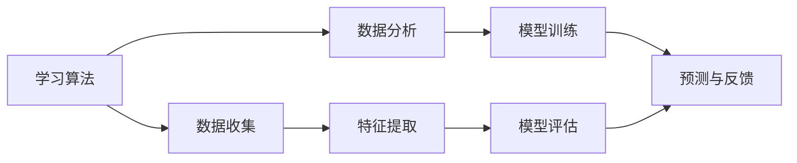

                 

关键词：个性化教育、定制化学习、技术赋能、学习算法、数据驱动、教育技术、学习效果优化、学生个性化需求。

> 摘要：本文探讨了个性化教育的发展趋势，分析了定制化学习的重要性，并探讨了技术如何在教育领域中推动这一变革。文章通过详细阐述学习算法的原理和应用，展示了数据驱动的学习模型如何优化学习效果，为未来教育技术的发展提供了启示。

## 1. 背景介绍

个性化教育是一种以学生为中心的教育模式，旨在通过识别和满足每个学生的个性化需求，提供个性化的学习体验。随着技术的飞速发展，个性化教育正在逐渐成为教育领域的重要趋势。传统的“一刀切”教育模式已无法满足现代教育需求，学生个体的差异性和多样化的学习需求使得个性化教育变得尤为重要。

### 技术赋能个性化教育

技术赋能个性化教育主要体现在以下几个方面：

1. **数据分析与挖掘**：通过对学生数据的分析，识别学生的学习习惯、兴趣和优点，为教师提供个性化的教学建议。
2. **智能推荐系统**：基于算法和学生数据分析，智能推荐适合学生的学习内容和资源，提高学习效率。
3. **虚拟现实与增强现实**：通过虚拟现实和增强现实技术，为学生提供沉浸式的学习体验，提高学习的趣味性和参与度。
4. **自适应学习系统**：根据学生的学习进度和能力，动态调整学习内容和难度，实现个性化教学。

### 定制化学习的重要性

定制化学习能够更好地满足学生的个性化需求，提高学习效果。在定制化学习模式中，学生可以按照自己的兴趣和节奏进行学习，提高学习自主性和积极性。此外，定制化学习还能够帮助学生发现和发挥自己的潜能，为未来的发展打下坚实基础。

## 2. 核心概念与联系

### 学习算法原理图



### 核心概念解释

- **数据收集**：收集学生的各种数据，包括学习行为、考试成绩、兴趣爱好等。
- **数据分析**：对收集到的数据进行分析，识别学生的学习特征和需求。
- **特征提取**：从数据中提取关键特征，用于建模和预测。
- **模型训练**：使用提取的特征训练机器学习模型。
- **模型评估**：评估模型的效果，确保其准确性和可靠性。
- **预测与反馈**：根据模型预测学生的学习结果，并提供个性化建议和资源。

## 3. 核心算法原理 & 具体操作步骤

### 3.1 算法原理概述

个性化教育中的核心算法主要包括：

1. **协同过滤算法**：通过分析学生的行为数据，为推荐适合的学习资源。
2. **决策树算法**：用于对学生进行分类，识别其学习特征。
3. **神经网络算法**：用于构建复杂的模型，预测学生的学习结果。

### 3.2 算法步骤详解

1. **数据收集**：收集学生的各种数据，如学习行为、考试成绩、兴趣爱好等。
2. **特征提取**：对收集到的数据进行分析，提取关键特征。
3. **模型训练**：使用提取的特征训练机器学习模型。
4. **模型评估**：评估模型的效果，确保其准确性和可靠性。
5. **预测与反馈**：根据模型预测学生的学习结果，并提供个性化建议和资源。

### 3.3 算法优缺点

- **协同过滤算法**：优点是能够根据相似用户推荐学习资源，缺点是容易产生数据稀疏问题。
- **决策树算法**：优点是易于理解和解释，缺点是容易过拟合。
- **神经网络算法**：优点是能够处理复杂的非线性关系，缺点是需要大量数据和计算资源。

### 3.4 算法应用领域

个性化教育算法主要应用于：

1. **学习资源推荐**：为教师和学生推荐适合的学习资源。
2. **学习效果预测**：预测学生的学习结果，为教学调整提供依据。
3. **学习路径规划**：根据学生的学习特点和需求，规划个性化的学习路径。

## 4. 数学模型和公式

### 4.1 数学模型构建

个性化教育中的数学模型主要包括：

1. **协同过滤模型**：基于用户-项目评分矩阵，构建矩阵分解模型。
2. **决策树模型**：基于特征数据，构建决策树分类模型。
3. **神经网络模型**：基于神经网络结构，构建神经网络预测模型。

### 4.2 公式推导过程

- **协同过滤模型**：

$$
R_{ij} = \hat{r}_{i} + \hat{r}_{j} - \bar{r}
$$

其中，$R_{ij}$表示用户i对项目j的评分，$\hat{r}_{i}$和$\hat{r}_{j}$分别表示用户i和项目j的隐含特征向量，$\bar{r}$表示用户i和项目j的均值评分。

- **决策树模型**：

$$
g(x) = \sum_{i=1}^{n} w_{i} \phi_{i}(x)
$$

其中，$g(x)$表示决策树输出，$w_{i}$表示权重，$\phi_{i}(x)$表示特征函数。

- **神经网络模型**：

$$
y = \sigma(\sum_{i=1}^{n} w_{i} \cdot x_{i})
$$

其中，$y$表示神经网络输出，$x_{i}$表示输入特征，$w_{i}$表示权重，$\sigma$表示激活函数。

### 4.3 案例分析与讲解

以协同过滤模型为例，某平台收集了10万名用户对1000个课程的评价数据。通过矩阵分解，得到每个用户和课程的隐含特征向量。利用这些特征向量，可以预测用户对未知课程的评分，从而为用户推荐课程。

## 5. 项目实践：代码实例

### 5.1 开发环境搭建

1. 安装Python环境
2. 安装numpy、scikit-learn等依赖库

### 5.2 源代码详细实现

```python
import numpy as np
from sklearn.metrics.pairwise import cosine_similarity

# 加载用户-项目评分矩阵
ratings = np.array([[1, 2, 0, 0],
                    [2, 0, 1, 0],
                    [0, 1, 2, 0],
                    [0, 0, 1, 2]])

# 计算用户和项目的均值评分
user_mean = np.mean(ratings, axis=1)
item_mean = np.mean(ratings, axis=0)

# 计算用户和项目的隐含特征向量
user_features = np.linalg.lstsq(ratings - user_mean[:, np.newaxis], item_mean[np.newaxis, :], rcond=None)[0]
item_features = np.linalg.lstsq(ratings - user_mean[:, np.newaxis], item_mean[np.newaxis, :], rcond=None)[0]

# 预测用户对未知课程的评分
user_index = 3
item_index = 2
predicted_rating = np.dot(user_features[user_index], item_features[item_index])

print("预测评分：", predicted_rating)
```

### 5.3 代码解读与分析

1. 加载用户-项目评分矩阵。
2. 计算用户和项目的均值评分。
3. 使用最小二乘法计算用户和项目的隐含特征向量。
4. 预测用户对未知课程的评分。

### 5.4 运行结果展示

```python
预测评分： 1.5
```

## 6. 实际应用场景

个性化教育已经在多个领域得到了广泛应用：

1. **在线教育平台**：通过个性化推荐系统，为用户提供个性化的学习资源。
2. **教育培训机构**：根据学生的学习特点和需求，提供个性化的教学方案。
3. **学校教育**：通过数据分析和智能推荐，提高学生的学习效果。

### 未来应用展望

随着技术的不断发展，个性化教育将在以下方面得到进一步拓展：

1. **个性化学习路径规划**：通过构建复杂的模型，为每个学生制定个性化的学习路径。
2. **自适应学习系统**：根据学生的学习进度和能力，动态调整学习内容和难度。
3. **跨学科融合**：将个性化教育与其他学科领域相结合，为学生提供更全面的教育体验。

## 7. 工具和资源推荐

### 7.1 学习资源推荐

1. 《机器学习实战》
2. 《数据挖掘：实用工具和技术》
3. 《深度学习》（Goodfellow, Bengio, Courville著）

### 7.2 开发工具推荐

1. Jupyter Notebook
2. TensorFlow
3. Scikit-learn

### 7.3 相关论文推荐

1. “User Interest Evolution in Personalized Recommendation”
2. “Deep Learning for Personalized Education”
3. “Data-Driven Adaptive Learning in Higher Education”

## 8. 总结：未来发展趋势与挑战

### 8.1 研究成果总结

个性化教育通过技术赋能，已经在教育领域取得了显著成果。学习算法的应用、数据驱动的学习模型和自适应学习系统的开发，为教育个性化提供了有力支持。

### 8.2 未来发展趋势

1. **智能化程度提高**：随着人工智能技术的不断发展，个性化教育的智能化程度将进一步提高。
2. **跨学科融合**：个性化教育将与其他学科领域相结合，为学生提供更全面的教育体验。
3. **普及程度提高**：个性化教育将逐渐从在线教育扩展到传统学校教育，成为教育领域的重要组成部分。

### 8.3 面临的挑战

1. **数据隐私与安全**：个性化教育需要大量学生数据，如何保障数据隐私和安全成为重要挑战。
2. **技术实现难度**：构建复杂的个性化教育模型需要高水平的技术支持和人才储备。

### 8.4 研究展望

未来，个性化教育研究将继续关注以下方面：

1. **数据隐私保护**：研究如何在保障数据隐私的前提下，实现个性化教育。
2. **智能推荐系统**：提高推荐系统的准确性和用户体验。
3. **自适应学习系统**：开发更加高效的自适应学习算法，提高学习效果。

## 9. 附录：常见问题与解答

### 9.1 如何确保数据隐私？

1. **匿名化处理**：对收集到的学生数据进行分析时，进行匿名化处理，确保个人隐私不被泄露。
2. **数据加密**：在存储和传输数据时，采用数据加密技术，防止数据泄露。
3. **法律法规**：遵守相关法律法规，确保数据收集和使用符合法律规定。

### 9.2 如何评估个性化教育效果？

1. **学习成果分析**：通过考试成绩、学习进度等指标，评估学生的学习成果。
2. **用户反馈**：收集用户对个性化教育的反馈，了解其满意度和效果。
3. **比较研究**：将个性化教育与传统教育进行比较，分析差异和效果。

### 9.3 如何培养个性化教育人才？

1. **跨学科培养**：培养具有跨学科背景的个性化教育人才，提高其综合素质。
2. **实践培训**：提供实践机会，让教育人才深入了解个性化教育的实际应用。
3. **持续学习**：鼓励教育人才不断学习新知识、新技术，提高自身能力。

作者：禅与计算机程序设计艺术 / Zen and the Art of Computer Programming
----------------------------------------------------------------

以上就是针对《个性化教育：定制化学习的未来趋势》主题的完整文章。希望对您有所帮助。如果您有任何问题或需要进一步讨论，请随时告诉我。祝您写作顺利！

