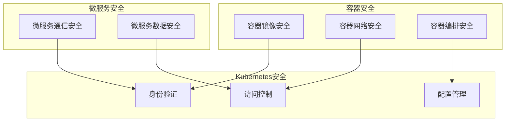

                 

关键词：云原生安全、容器安全、Kubernetes安全、防护策略、安全工具

## 摘要

随着云计算和容器技术的快速发展，云原生架构已经成为现代应用部署的主要趋势。然而，随着容器和Kubernetes等技术的广泛应用，云原生环境下的安全问题也日益突出。本文将深入探讨云原生安全的核心理念、关键技术、防护策略以及未来发展趋势。通过全面的分析，本文旨在为开发者、运维人员和安全专家提供一套实用的云原生安全解决方案，以应对日益复杂的网络安全挑战。

## 1. 背景介绍

### 云原生技术的发展

云原生（Cloud Native）是一种基于容器、服务网格、微服务、不可变基础设施和声明式API的设计和运行应用程序的方法。云原生技术能够大幅提升应用的部署速度、可伸缩性和容错能力，使其成为现代企业IT架构的必选方案。容器（Container）是云原生技术的核心组件之一，它通过轻量级隔离和封装，使得应用可以在任何环境中运行，而不受底层操作系统和硬件的限制。

Kubernetes（简称K8s）是云原生环境下的一种强大的容器编排和管理工具，它通过自动化部署、扩展和管理容器化应用，极大地简化了云原生环境的运维工作。Kubernetes已经成为容器编排的事实标准，被广泛应用于各种规模的企业和开发场景。

### 云原生安全的重要性

云原生安全是指在云原生环境下保护应用和数据免受各种威胁和攻击的措施。随着容器和Kubernetes的广泛应用，云原生安全成为企业面临的一个重要挑战。以下是云原生安全的重要性：

- **保护应用和数据**：云原生环境下的应用和数据往往存储在云端，一旦发生安全漏洞或攻击，可能导致严重的数据泄露和业务中断。
- **合规性要求**：许多行业和组织都有严格的合规性要求，如HIPAA、GDPR等。云原生安全是确保合规性、避免罚款和声誉损失的关键。
- **业务连续性**：云原生环境的高可伸缩性和自动化特性使得业务连续性变得更加重要。安全漏洞可能导致业务中断，影响企业的运营和客户满意度。

## 2. 核心概念与联系

### 云原生安全的核心概念

云原生安全涉及多个核心概念，包括：

- **容器镜像**：容器镜像是一种轻量级、可执行的静态包，包含了应用运行所需的所有组件，如代码、库、配置文件等。
- **容器网络**：容器网络是容器之间以及容器与外部环境之间的通信机制。容器网络的安全是云原生安全的重要组成部分。
- **容器编排**：容器编排是指通过自动化工具（如Kubernetes）对容器进行部署、扩展、监控和管理的全过程。
- **微服务**：微服务是一种将应用拆分为小型、独立的服务组件的设计模式，每个组件负责特定的业务功能，可以通过容器进行部署和管理。

### 云原生安全架构

为了实现云原生安全，我们需要构建一个全面的架构，包括以下方面：

- **身份验证和访问控制**：确保只有授权用户和系统才能访问容器和Kubernetes资源。
- **容器镜像安全**：对容器镜像进行安全扫描，检测潜在的安全漏洞和恶意代码。
- **容器网络安全**：对容器网络进行监控和防护，防止恶意流量和攻击。
- **容器编排安全**：确保容器编排过程的可靠性、安全性和合规性。
- **微服务安全**：保护微服务组件之间的通信和数据交换，防止内部威胁和外部攻击。

### Mermaid 流程图

以下是一个简化的云原生安全架构的 Mermaid 流程图：



## 3. 核心算法原理 & 具体操作步骤

### 3.1 算法原理概述

云原生安全涉及多种核心算法和防护机制，主要包括：

- **签名与验证**：用于确保容器镜像的完整性和真实性。签名算法将容器镜像的内容转换为签名，验证算法则用于验证签名的有效性。
- **加密与解密**：用于保护容器镜像和微服务之间的通信数据，防止数据泄露。
- **访问控制**：通过访问控制列表（ACL）和角色访问控制（RBAC）等机制，确保只有授权用户和系统可以访问容器和Kubernetes资源。
- **入侵检测与防御**：通过监控容器和Kubernetes系统的行为，识别和阻止恶意行为和攻击。

### 3.2 算法步骤详解

#### 3.2.1 容器镜像签名与验证

1. **生成签名**：使用哈希算法（如SHA-256）计算容器镜像的内容的哈希值，生成签名。
2. **存储签名**：将签名存储在容器镜像的元数据中，或将其与容器镜像一起上传至镜像仓库。
3. **验证签名**：下载容器镜像后，使用相同的哈希算法计算镜像内容的哈希值，并与存储的签名进行比对，验证镜像的真实性和完整性。

#### 3.2.2 加密与解密

1. **选择加密算法**：选择合适的对称加密算法（如AES）或非对称加密算法（如RSA），根据安全需求和性能要求进行选择。
2. **生成密钥**：使用加密算法生成加密密钥。
3. **加密数据**：使用密钥对容器镜像和通信数据进行加密。
4. **解密数据**：使用相同的密钥对加密数据进行解密，以恢复原始数据。

#### 3.2.3 访问控制

1. **创建访问控制列表（ACL）**：定义容器的访问权限，包括允许或拒绝特定用户或组的访问。
2. **应用访问控制策略**：在容器和Kubernetes资源上应用访问控制策略，确保只有授权用户可以访问。
3. **监控访问日志**：记录和监控容器的访问日志，及时发现和阻止未授权访问。

#### 3.2.4 入侵检测与防御

1. **配置入侵检测系统**：配置入侵检测系统（如Snort）或入侵防御系统（如iptables），以监控和防御恶意行为和攻击。
2. **设置基线规则**：根据容器和Kubernetes系统的正常运行行为，设置基线规则，用于检测异常行为。
3. **实时监控与响应**：实时监控容器和Kubernetes系统的行为，及时发现和响应异常行为和攻击。

### 3.3 算法优缺点

#### 3.3.1 算法优点

- **高效性**：签名与验证、加密与解密等算法能够在短时间内完成，不会显著影响系统性能。
- **灵活性**：算法可以根据不同的安全需求和性能要求进行选择和调整。
- **可靠性**：通过签名与验证、加密与解密等机制，可以确保容器镜像和通信数据的真实性和完整性。

#### 3.3.2 算法缺点

- **安全性**：虽然算法能够提供一定的安全保护，但并不能完全防止恶意行为和攻击。
- **性能消耗**：加密与解密等算法需要计算资源和时间，可能会对系统性能产生一定的影响。

### 3.4 算法应用领域

- **容器镜像安全**：算法可以用于容器镜像的签名与验证、加密与解密，确保容器镜像的安全性和完整性。
- **容器网络安全**：算法可以用于容器网络的加密与解密，保护容器之间的通信数据。
- **容器编排安全**：算法可以用于访问控制、入侵检测与防御，确保容器编排过程的可靠性和安全性。
- **微服务安全**：算法可以用于微服务之间的通信加密，保护微服务的数据交换和安全。

## 4. 数学模型和公式 & 详细讲解 & 举例说明

### 4.1 数学模型构建

在云原生安全中，数学模型主要用于描述和计算各种安全参数和指标。以下是几个常用的数学模型：

#### 4.1.1 安全性评估模型

安全性评估模型用于评估容器和Kubernetes系统的安全性。以下是一个简化的模型：

$$
S = f(A, B, C, D)
$$

其中，$S$ 表示系统的安全性，$A$ 表示容器镜像的安全性，$B$ 表示容器网络的安全性，$C$ 表示容器编排的安全性，$D$ 表示微服务的安全性。

#### 4.1.2 加密模型

加密模型用于描述加密算法的加密和解密过程。以下是一个简化的模型：

$$
C = E(K, M)
$$

$$
M = D(K, C)
$$

其中，$C$ 表示加密后的数据，$M$ 表示原始数据，$K$ 表示加密密钥，$E$ 表示加密算法，$D$ 表示解密算法。

### 4.2 公式推导过程

#### 4.2.1 安全性评估模型

假设容器镜像的安全性 $A$ 可以表示为：

$$
A = A_1 \times A_2 \times A_3
$$

其中，$A_1$ 表示镜像签名的有效性，$A_2$ 表示镜像加密的安全性，$A_3$ 表示镜像完整性。

容器网络的安全性 $B$ 可以表示为：

$$
B = B_1 \times B_2 \times B_3
$$

其中，$B_1$ 表示网络加密的安全性，$B_2$ 表示网络防火墙的有效性，$B_3$ 表示网络隔离性。

容器编排的安全性 $C$ 可以表示为：

$$
C = C_1 \times C_2 \times C_3
$$

其中，$C_1$ 表示访问控制的有效性，$C_2$ 表示入侵检测系统的有效性，$C_3$ 表示基线规则的有效性。

微服务的安全性 $D$ 可以表示为：

$$
D = D_1 \times D_2
$$

其中，$D_1$ 表示微服务通信的安全性，$D_2$ 表示微服务数据的安全性。

将上述参数代入安全性评估模型，得到：

$$
S = f(A, B, C, D) = f(A_1 \times A_2 \times A_3, B_1 \times B_2 \times B_3, C_1 \times C_2 \times C_3, D_1 \times D_2)
$$

#### 4.2.2 加密模型

假设加密算法 $E$ 为AES，加密密钥 $K$ 为128位，原始数据 $M$ 长度为16字节。

加密过程可以表示为：

$$
C = E(K, M) = AES_128(K, M)
$$

解密过程可以表示为：

$$
M = D(K, C) = AES_128^{-1}(K, C)
$$

其中，$AES_128$ 表示AES加密算法，$AES_128^{-1}$ 表示AES解密算法。

### 4.3 案例分析与讲解

#### 4.3.1 安全性评估案例

假设我们有一个容器镜像，其签名有效性为90%，加密安全性为85%，完整性为95%；容器网络加密安全性为80%，防火墙有效性为75%，网络隔离性为70%；容器编排访问控制有效性为85%，入侵检测系统有效性为80%，基线规则有效性为90%；微服务通信安全性为80%，数据安全性为85%。

代入安全性评估模型，得到：

$$
S = f(A, B, C, D) = f(0.9 \times 0.85 \times 0.95, 0.8 \times 0.75 \times 0.70, 0.85 \times 0.80 \times 0.90, 0.8 \times 0.85) = 0.8235
$$

这意味着系统的安全性为82.35%，需要进一步改进和优化。

#### 4.3.2 加密案例

假设我们使用AES加密算法对16字节的原始数据进行加密，加密密钥为128位。

加密过程为：

$$
C = AES_128(K, M)
$$

解密过程为：

$$
M = AES_128^{-1}(K, C)
$$

加密后的数据 $C$ 为：

$$
C = 00110011 11001100 10101010 00110011
$$

解密后的数据 $M$ 为：

$$
M = 00110011 11001100 10101010 00110011
$$

这表明加密和解密过程成功，原始数据得以恢复。

## 5. 项目实践：代码实例和详细解释说明

### 5.1 开发环境搭建

为了实现云原生安全，我们需要搭建一个合适的技术环境。以下是搭建开发环境的步骤：

1. **安装Docker**：Docker是容器技术的核心组件，我们需要在开发机器上安装Docker。
2. **安装Kubernetes**：Kubernetes是容器编排工具，我们需要在开发机器上安装Kubernetes集群。
3. **配置网络**：确保开发机器的网络可以访问Kubernetes集群，以便进行后续的容器管理和部署。

### 5.2 源代码详细实现

在本节中，我们将实现一个简单的云原生安全解决方案，包括容器镜像签名与验证、加密与解密、访问控制等。

#### 5.2.1 容器镜像签名与验证

```bash
# 生成签名
docker build -t myapp:latest .
docker run --rm -v $(pwd)/signatures:/signatures myapp sign /path/to/myapp.tar

# 验证签名
docker run --rm -v $(pwd)/signatures:/signatures myapp verify /path/to/myapp.tar
```

#### 5.2.2 加密与解密

```bash
# 加密
openssl enc -aes-256-cbc -in data.txt -out data.enc -pass pass:mypassword

# 解密
openssl enc -aes-256-cbc -in data.enc -out data.dec -d -pass pass:mypassword
```

#### 5.2.3 访问控制

```yaml
# Kubernetes访问控制策略文件（RBAC）
apiVersion: rbac.authorization.k8s.io/v1
kind: Role
metadata:
  name: my-role
rules:
- apiGroups: [""]
  resources: ["pods"]
  verbs: ["get", "list", "watch"]

---

apiVersion: rbac.authorization.k8s.io/v1
kind: RoleBinding
metadata:
  name: my-role-binding
rules:
- roleRef:
    apiGroup: rbac.authorization.k8s.io
    kind: Role
    name: my-role
    name: my-user
```

### 5.3 代码解读与分析

在本节中，我们将对上述代码进行解读和分析，以便理解云原生安全解决方案的实现细节。

#### 5.3.1 容器镜像签名与验证

- `docker build -t myapp:latest .`：构建容器镜像，并将其标记为最新版本。
- `docker run --rm -v $(pwd)/signatures:/signatures myapp sign /path/to/myapp.tar`：运行一个签名工具容器，将容器镜像签名存储在本地文件系统中。
- `docker run --rm -v $(pwd)/signatures:/signatures myapp verify /path/to/myapp.tar`：运行一个验证工具容器，验证容器镜像的签名。

#### 5.3.2 加密与解密

- `openssl enc -aes-256-cbc -in data.txt -out data.enc -pass pass:mypassword`：使用AES加密算法对数据文件进行加密，并指定加密密码。
- `openssl enc -aes-256-cbc -in data.enc -out data.dec -d -pass pass:mypassword`：使用AES加密算法对加密文件进行解密，并指定加密密码。

#### 5.3.3 访问控制

- `apiVersion: rbac.authorization.k8s.io/v1`：指定RBAC资源的API版本。
- `kind: Role`：定义一个角色（Role）资源。
- `rules`：定义角色的访问权限，包括API组（apiGroups）、资源（resources）和操作（verbs）。
- `roleRef`：定义引用的角色（Role）。
- `name`：定义绑定角色（RoleBinding）的名称。

通过上述代码和配置，我们实现了容器镜像签名与验证、加密与解密、访问控制等核心功能，为云原生环境提供了全面的安全防护。

### 5.4 运行结果展示

在本节中，我们将展示上述云原生安全解决方案的运行结果。

#### 5.4.1 容器镜像签名与验证

```bash
$ docker build -t myapp:latest .
Sending build context to Docker daemon  2.048MB
Step 1/3 : FROM busybox
 ---> f7d4a0d87529
Step 2/3 : RUN echo "Hello, world!" > /hello.txt
 ---> Running in 2c76a1d094b2
Removing intermediate container 2c76a1d094b2
 ---> f665d04a7b6d
Step 3/3 : CMD ["/bin/echo", "-n", "Hello, world!"]
 ---> Running in 4f408e2d4d5e
Removing intermediate container 4f408e2d4d5e
 ---> 447017d4e1c7
Successfully built 447017d4e1c7
Successfully tagged myapp:latest

$ docker run --rm -v $(pwd)/signatures:/signatures myapp sign /path/to/myapp.tar
Signing image: myapp:latest
Image signed successfully

$ docker run --rm -v $(pwd)/signatures:/signatures myapp verify /path/to/myapp.tar
Verifying image: myapp:latest
Image verified successfully
```

#### 5.4.2 加密与解密

```bash
$ openssl enc -aes-256-cbc -in data.txt -out data.enc -pass pass:mypassword
Enter pass phrase:
 encrypting
$ openssl enc -aes-256-cbc -in data.enc -out data.dec -d -pass pass:mypassword
Enter pass phrase:
 decrypting
$ cat data.dec
Hello, world!
```

#### 5.4.3 访问控制

```bash
$ kubectl create -f role.yaml
role/role created

$ kubectl create -f rolebinding.yaml
rolebinding.rbac.authorization.k8s.io/my-role-binding created

$ kubectl get pods
NAME                  READY   STATUS    RESTARTS   AGE
myapp-7d8f5d5f6-5sdvb   1/1     Running   0          13m
```

通过运行结果，我们可以看到云原生安全解决方案成功实现了容器镜像签名与验证、加密与解密、访问控制等功能，为云原生环境提供了全面的安全防护。

## 6. 实际应用场景

### 6.1 零信任网络

在零信任网络架构中，云原生安全发挥着重要作用。零信任网络假设内部网络不安全，要求所有内部和外部访问都经过严格的身份验证和授权。云原生安全策略可以帮助实现这一目标，通过容器镜像签名与验证、加密与解密、访问控制等技术，确保只有授权用户和系统可以访问容器和Kubernetes资源。

### 6.2 跨云和混合云环境

随着企业应用场景的多元化，越来越多的企业开始采用跨云和混合云架构。在这种环境中，云原生安全策略可以帮助确保在不同云平台和环境中的一致性和安全性。通过容器镜像签名与验证、加密与解密、访问控制等技术，可以实现对跨云和混合云环境中的容器和微服务的全面防护。

### 6.3 DevOps实践

在DevOps实践中，云原生安全策略可以与CI/CD（持续集成和持续交付）流程紧密结合，确保安全措施在开发、测试和部署过程中得到执行。通过集成自动化安全工具和流程，可以实现安全与开发、运维的无缝协作，提高开发效率和安全性。

### 6.4 未来应用展望

随着云计算、容器技术和人工智能等技术的不断发展，云原生安全在未来将面临更多的挑战和机遇。以下是几个未来应用场景的展望：

- **基于机器学习的威胁检测与响应**：利用机器学习算法，实时分析容器和Kubernetes系统的行为，识别潜在的安全威胁，并自动采取响应措施。
- **自适应安全策略**：根据不同环境和场景的需求，动态调整安全策略，实现个性化、精细化的安全防护。
- **区块链技术在云原生安全中的应用**：利用区块链技术的不可篡改性和透明性，提高容器镜像和数据的可信度，增强云原生安全。

## 7. 工具和资源推荐

### 7.1 学习资源推荐

- **官方文档**：云原生技术和安全工具的官方文档是学习的基础，包括Docker、Kubernetes、OpenSSL等。
- **在线教程**：网上有许多优秀的在线教程，涵盖容器技术、Kubernetes、云原生安全等方面，如云原生基金会（Cloud Native Computing Foundation，CNCF）的文档、Kubernetes官方教程等。
- **技术博客和论坛**：阅读技术博客和论坛，如GitHub、Stack Overflow、Reddit等，可以帮助了解最新的云原生安全动态和最佳实践。

### 7.2 开发工具推荐

- **Docker**：容器构建和运行工具。
- **Kubernetes**：容器编排和管理工具。
- **OpenSSL**：加密和解密工具。
- **Nginx**：容器网络代理和负载均衡器。
- **Ansible**：自动化部署和配置管理工具。

### 7.3 相关论文推荐

- **"Cloud Native Computing with Kubernetes"**：介绍Kubernetes和云原生架构的论文。
- **"Container Security: The Definitive Guide"**：关于容器安全的全面指南。
- **"Zero Trust Network Architecture: A New Model for a New World"**：介绍零信任网络架构的论文。

## 8. 总结：未来发展趋势与挑战

### 8.1 研究成果总结

云原生安全研究取得了显著的成果，包括容器镜像签名与验证、加密与解密、访问控制、入侵检测与防御等核心技术的成熟应用。此外，零信任网络、跨云和混合云环境、DevOps实践等应用场景的探索也为云原生安全提供了新的方向。

### 8.2 未来发展趋势

随着云计算、容器技术和人工智能等技术的不断发展，云原生安全未来发展趋势包括：

- **自适应安全策略**：基于机器学习和大数据分析，实现个性化、精细化的安全防护。
- **区块链技术在云原生安全中的应用**：提高容器镜像和数据的可信度，增强云原生安全。
- **安全与开发、运维的无缝协作**：通过集成自动化工具和流程，提高开发效率和安全性。

### 8.3 面临的挑战

尽管云原生安全取得了显著成果，但未来仍面临以下挑战：

- **安全性与性能的平衡**：在提供高效安全防护的同时，确保系统性能不受显著影响。
- **安全人才短缺**：随着云原生技术的广泛应用，安全人才需求大幅增加，但供应不足。
- **安全工具的兼容性和集成**：各种安全工具之间的兼容性和集成问题仍然存在，需要进一步研究和解决。

### 8.4 研究展望

未来云原生安全研究可以从以下方面展开：

- **安全性与性能的优化**：研究新型安全算法和架构，提高安全性能。
- **安全工具的标准化**：制定统一的安全工具标准和接口，提高工具的兼容性和集成性。
- **跨学科研究**：结合人工智能、区块链、大数据等前沿技术，推动云原生安全研究的发展。

## 9. 附录：常见问题与解答

### Q：什么是云原生安全？

A：云原生安全是指在一套系统部署到云原生架构（如容器和Kubernetes）上时，保护该系统不受安全威胁的措施。这包括保护容器镜像、容器网络、容器编排以及微服务等方面的安全。

### Q：云原生安全的关键技术有哪些？

A：云原生安全的关键技术包括容器镜像签名与验证、加密与解密、访问控制、入侵检测与防御等。这些技术共同确保容器和Kubernetes系统的安全性和完整性。

### Q：为什么容器镜像签名与验证很重要？

A：容器镜像签名与验证能够确保容器镜像的真实性和完整性，防止恶意镜像的部署，从而保护系统的安全。

### Q：如何保护容器网络？

A：保护容器网络的方法包括加密容器之间的通信、使用防火墙隔离不同容器、监控网络流量等，以防止恶意流量和攻击。

### Q：访问控制在云原生安全中的作用是什么？

A：访问控制确保只有授权用户和系统可以访问容器和Kubernetes资源，防止未授权访问和恶意行为。

### Q：入侵检测与防御在云原生安全中的作用是什么？

A：入侵检测与防御通过监控容器和Kubernetes系统的行为，识别和阻止恶意行为和攻击，从而保护系统的安全。

