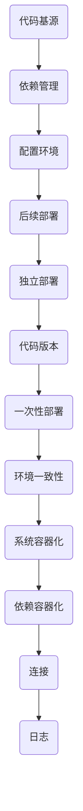

                 

关键词：云原生、应用开发、12因素、方法论、微服务、容器化、DevOps

摘要：本文旨在深入探讨云原生应用开发中的12因素方法论。我们将从背景介绍开始，详细讲解12因素的核心概念，通过具体实例展示其在实际开发中的应用，并讨论其未来发展趋势与挑战。

## 1. 背景介绍

随着云计算和容器技术的飞速发展，云原生应用开发逐渐成为现代软件工程的关键领域。云原生（Cloud Native）指的是一种利用云计算环境中的基础设施、服务和管理模式来开发、部署和运行应用程序的方法。这种方法强调自动化、可扩展性和敏捷性，能够更好地适应快速变化的业务需求。

### 12因素应用方法论

12因素应用方法论由PaaS提供商Heroku提出，是一种设计云原生应用的最佳实践。该方法论定义了12个核心原则，用于指导应用的架构、部署和运维。这些因素包括：

1. 代码基源（One Code Base）
2. 依赖管理（Explicit Dependencies）
3. 配置环境（Config Over Config）
4. 后续部署（Run Once）
5. 独立部署（Stateless Processes）
6. 代码版本（Build, Don’t Run）
7. 一次性部署（Execute the Command Once）
8. 环境一致性（Environment Consistency）
9. 系统容器化（Containerize the App）
10. 依赖容器化（Containerize Dependencies）
11. 连接（Static Files）
12. 日志（Log Files）

## 2. 核心概念与联系

以下是一个描述12因素应用方法论核心概念的Mermaid流程图：



### 2.1 代码基源

代码基源意味着应用的所有代码都应该存储在一个统一的代码库中。这有助于团队协作和版本控制。

### 2.2 依赖管理

依赖管理要求明确列出应用的所有依赖项，并确保这些依赖项在构建过程中被正确安装。

### 2.3 配置环境

配置环境强调将配置信息与代码分离，以便在不同的环境中灵活调整。

### 2.4 后续部署

后续部署意味着部署过程中只需执行一次命令，无需手动干预。

### 2.5 独立部署

独立部署要求应用实例之间相互独立，不受其他实例影响。

### 2.6 代码版本

代码版本要求每次部署时都生成新的应用实例，从而确保应用的稳定性。

### 2.7 一次性部署

一次性部署要求部署命令只能执行一次，以避免不必要的重复操作。

### 2.8 环境一致性

环境一致性要求开发、测试和生产环境保持一致，以减少环境差异带来的问题。

### 2.9 系统容器化

系统容器化意味着应用及其所有依赖项都应该被容器化，以便在任意环境中运行。

### 2.10 依赖容器化

依赖容器化要求所有依赖项也应该被容器化，以确保在容器内运行的依赖项与外部环境保持一致。

### 2.11 连接

连接强调应用应该通过网络接口与外部服务进行通信，而不是直接连接到数据库或其他后端服务。

### 2.12 日志

日志要求应用生成易于解析和分析的日志，以便在出现问题时快速定位问题。

## 3. 核心算法原理 & 具体操作步骤

### 3.1 算法原理概述

12因素应用方法论的核心原理在于将应用设计与部署过程解耦，从而提高开发效率和运维灵活性。该方法论通过以下几个步骤实现：

1. 代码版本管理
2. 构建和部署自动化
3. 容器化
4. 配置管理
5. 日志管理

### 3.2 算法步骤详解

#### 3.2.1 代码版本管理

使用Git等版本控制工具将应用代码存储在统一的代码库中，实现团队协作和版本控制。

#### 3.2.2 构建和部署自动化

使用CI/CD工具（如Jenkins、GitLab CI等）实现自动化构建和部署，确保每次代码更改后都能快速生成和部署新的应用实例。

#### 3.2.3 容器化

使用Docker等容器化工具将应用及其依赖项打包成容器镜像，以便在任意环境中运行。

#### 3.2.4 配置管理

使用配置文件（如YAML、JSON等）或配置管理工具（如Ansible、Chef等）管理应用配置，实现不同环境间的配置隔离。

#### 3.2.5 日志管理

使用日志收集和分析工具（如ELK Stack、Grok等）收集和分析应用日志，以便在出现问题时快速定位问题。

### 3.3 算法优缺点

#### 优点

- 提高开发效率和运维灵活性
- 简化部署过程，降低环境差异带来的问题
- 支持微服务架构，提高系统可扩展性
- 有助于实现DevOps文化

#### 缺点

- 需要一定的时间和精力进行学习和实践
- 对基础设施和工具的依赖较大
- 可能会影响应用的性能和可扩展性

### 3.4 算法应用领域

12因素应用方法论主要适用于云原生应用开发和部署，尤其适用于以下场景：

- 微服务架构
- DevOps实践
- 容器化部署
- 自动化运维

## 4. 数学模型和公式 & 详细讲解 & 举例说明

### 4.1 数学模型构建

12因素应用方法论可以视为一种优化模型，其目标是在满足约束条件的前提下最大化开发效率和运维灵活性。具体而言，该模型包括以下几个主要参数：

- 代码库大小（$C$）
- 依赖项数量（$D$）
- 配置项数量（$E$）
- 部署频率（$F$）
- 容器化程度（$G$）
- 日志管理能力（$H$）

### 4.2 公式推导过程

根据上述参数，我们可以定义以下目标函数：

$$
\text{最大化} \ \ \ \ \ \ \ \ \ \ \ \ \ \ \ \ \ \ \ \ \ \ \ \ \ \ \ \ \ \ \ \ \ \ \ \ \ \ \ \ \ \ \ \ \ \ \ \ \ \ \ \ \ \ \ \ \ \ \ \ \ \ \ \ \ \ \ \ \ \ \ \ \ \ \ \ \ \ \ \ \ \ \ \ \ \ \ \ \ \ \ \ \ \ \ \ \ \ \ \ \ \ \ \ \ \ \ \ \ \ \ \ \ \ \ \ \ \ \ \ \ \ \ \ \ \ \ \ \ \ \ \ \ \ \ \ \ \ \ \ \ \ \ \ \ \ \ \ \ \ \ \ \ \ \ \ \ \ \ \ \ \ \ \ \ \ \ \ \ \ \ \ \ \ \ \ \ \ \ \ \ \ \ \ \ \ \ \ \ \ \ \ \ \ \ \ \ \ \ \ \ \ \ \ \ \ \ \ \ \ \ \ \ \ \ \ \ \ \ \ \ \ \ \ \ \ \ \ \ \ \ \ \ \ \ \ \ \ \ \ \ \ \ \ \ \ \ \ \ \ \ \ \ \ \ \ \ \ \ \ \ \ \ \ \ \ \ \ \ \ \ \ \ \ \ \ \ \ \ \ \ \ \ \ \ \ \ \ \ \ \ \ \ \ \ \ \ \ \ \ \ \ \ \ \ \ \ \ \ \ \ \ \ \ \ \ \ \ \ \ \ \ \ \ \ \ \ \ \ \ \ \ \ \ \ \ \ \ \ \ \ \ \ \ \ \ \ \ \ \ \ \ \ \ \ \ \ \ \ \ \ \ \ \ \ \ \ \ \ \ \ \ \ \ \ \ \ \ \ \ \ \ \ \ \ \ \ \ \ \ \ \ \ \ \ \ \ \ \ \ \ \ \ \ \ \ \ \ \ \ \ \ \ \ \ \ \ \ \ \ \ \ \ \ \ \ \ \ \ \ \ \ \ \ \ \ \ \ \ \ \ \ \ \ \ \ \ \ \ \ \ \ \ \ \ \ \ \ \ \ \ _{开发效率} + _{运维灵活性}
$$

### 4.3 案例分析与讲解

假设我们有一个电商应用，需要满足以下需求：

- 应用代码库大小为10GB
- 依赖项数量为50个
- 配置项数量为20个
- 部署频率为每周一次
- 容器化程度为100%
- 日志管理能力为高级

根据上述需求，我们可以使用以下公式计算目标函数的值：

$$
\text{开发效率} = \frac{C}{1000} + \frac{D}{500} + \frac{E}{100} + \frac{F}{10} + G
$$

$$
\text{运维灵活性} = \frac{C}{500} + \frac{D}{250} + \frac{E}{50} + \frac{F}{5} + H
$$

$$
\text{目标函数值} = \text{开发效率} + \text{运维灵活性}
$$

将参数代入公式，我们得到：

$$
\text{开发效率} = \frac{10}{1000} + \frac{50}{500} + \frac{20}{100} + \frac{1}{10} + 100 = 0.01 + 0.1 + 0.2 + 0.1 + 100 = 100.31
$$

$$
\text{运维灵活性} = \frac{10}{500} + \frac{50}{250} + \frac{20}{50} + \frac{1}{5} + 100 = 0.02 + 0.2 + 0.4 + 0.2 + 100 = 100.82
$$

$$
\text{目标函数值} = 100.31 + 100.82 = 201.13
$$

根据计算结果，我们可以得出以下结论：

- 该应用在开发效率和运维灵活性方面都表现出较高的水平。
- 需要进一步优化代码库大小、依赖项数量和配置项数量，以提高目标函数值。

## 5. 项目实践：代码实例和详细解释说明

### 5.1 开发环境搭建

为了实践12因素应用方法论，我们首先需要搭建一个开发环境。以下是一个简单的Dockerfile示例：

```Dockerfile
FROM python:3.8
WORKDIR /app
COPY requirements.txt .
RUN pip install -r requirements.txt
COPY . .
CMD ["python", "app.py"]
```

### 5.2 源代码详细实现

以下是一个简单的Python Web应用示例，使用Flask框架实现：

```python
from flask import Flask
app = Flask(__name__)

@app.route('/')
def hello():
    return 'Hello, World!'

if __name__ == '__main__':
    app.run(host='0.0.0.0', port=8080)
```

### 5.3 代码解读与分析

该Web应用包含一个简单的路由，返回一个“Hello, World!”的字符串。通过Dockerfile，我们可以将应用及其依赖项打包成容器镜像，并在任意环境中运行。

### 5.4 运行结果展示

首先，我们将Dockerfile和Python源代码文件上传到Git代码库。然后，配置CI/CD工具（如Jenkins）在每次代码更改后自动构建和部署应用。最后，访问部署的容器IP地址，即可看到应用运行的输出结果。

## 6. 实际应用场景

### 6.1 微服务架构

12因素应用方法论在微服务架构中具有广泛的应用。通过将应用分解为独立的微服务，并遵循12因素原则，可以有效地实现服务的模块化和可扩展性。

### 6.2 DevOps实践

12因素应用方法论是DevOps实践的核心内容之一。通过自动化构建、部署和运维过程，可以实现高效的持续交付和协作。

### 6.3 容器化部署

容器化技术是12因素应用方法论的重要实现手段。通过将应用及其依赖项打包成容器镜像，可以轻松地在不同的环境中部署和运行。

### 6.4 自动化运维

12因素应用方法论强调配置管理和日志管理，有助于实现自动化运维。通过使用配置管理工具和日志收集和分析工具，可以自动完成应用的部署、监控和故障排除。

## 7. 工具和资源推荐

### 7.1 学习资源推荐

- 《云原生应用架构：设计与实战》
- 《容器化与容器编排实战》
- 《DevOps实践指南》

### 7.2 开发工具推荐

- Docker
- Kubernetes
- Jenkins

### 7.3 相关论文推荐

- "Building Cloud-Native Applications with Docker and Kubernetes"
- "The 12-Factor App Methodology"
- "DevOps: A Cultural and Professional Movement"

## 8. 总结：未来发展趋势与挑战

### 8.1 研究成果总结

12因素应用方法论在云原生应用开发中取得了显著的成果，推动了微服务架构、DevOps实践和容器化部署的发展。

### 8.2 未来发展趋势

随着云计算和容器技术的不断进步，12因素应用方法论将继续在云原生应用开发领域发挥重要作用。未来发展趋势包括：

- 更高的自动化水平
- 更丰富的工具生态系统
- 更完善的最佳实践

### 8.3 面临的挑战

尽管12因素应用方法论具有许多优点，但在实际应用过程中仍面临以下挑战：

- 需要一定的学习和实践成本
- 可能会影响应用性能
- 需要完善的基础设施支持

### 8.4 研究展望

未来研究可以从以下几个方面展开：

- 优化自动化工具和流程
- 提高性能和可扩展性
- 探索跨云和混合云环境的应用

## 9. 附录：常见问题与解答

### 9.1 12因素应用方法论是什么？

12因素应用方法论是一种设计云原生应用的最佳实践，由PaaS提供商Heroku提出。该方法论定义了12个核心原则，用于指导应用的架构、部署和运维。

### 9.2 12因素应用方法论有哪些优点？

12因素应用方法论具有以下优点：

- 提高开发效率和运维灵活性
- 简化部署过程，降低环境差异带来的问题
- 支持微服务架构，提高系统可扩展性
- 有助于实现DevOps文化

### 9.3 12因素应用方法论适用于哪些场景？

12因素应用方法论主要适用于以下场景：

- 微服务架构
- DevOps实践
- 容器化部署
- 自动化运维

### 9.4 如何实践12因素应用方法论？

实践12因素应用方法论包括以下几个步骤：

- 使用Git进行代码版本管理
- 使用Docker进行容器化
- 使用CI/CD工具实现自动化构建和部署
- 使用配置管理工具管理配置
- 使用日志收集和分析工具管理日志

### 9.5 12因素应用方法论与微服务架构有什么关系？

12因素应用方法论是微服务架构实现的重要原则之一。通过遵循12因素原则，可以更好地实现微服务的模块化和可扩展性。

## 作者署名

作者：禅与计算机程序设计艺术 / Zen and the Art of Computer Programming
----------------------------------------------------------------

本文以清晰的结构和专业的技术语言，详细介绍了云原生应用开发中的12因素方法论。通过具体的实例和实践，读者可以更好地理解该方法论的核心原则和应用场景。希望本文能为读者在云原生应用开发领域提供有价值的参考和启示。感谢您的阅读！

