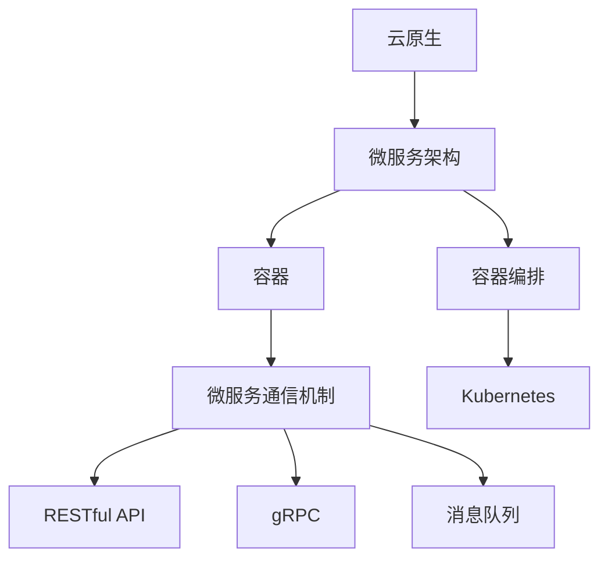

                 

关键词：云原生、微服务架构、设计模式、最佳实践、架构设计

摘要：本文深入探讨了云原生微服务架构的设计模式和最佳实践。从背景介绍到核心概念，再到算法原理、数学模型、项目实践、实际应用场景以及工具和资源推荐，全面解析了云原生微服务架构的核心要素和实现策略。最后，我们对未来发展趋势、面临的挑战和未来研究方向进行了展望，旨在为从事云原生和微服务架构开发的技术人员提供有价值的参考。

## 1. 背景介绍

随着云计算的普及和发展，传统的单体架构已经无法满足现代互联网应用的弹性扩展、快速迭代和持续交付需求。云原生（Cloud Native）微服务架构应运而生，它将应用拆分为多个独立的微服务，每个微服务运行在独立的容器中，通过轻量级的通信机制（如RESTful API或消息队列）进行协同工作。云原生微服务架构以其高度的可扩展性、灵活性和可维护性，成为现代企业构建互联网应用的首选架构。

然而，云原生微服务架构并非一蹴而就，它涉及众多设计模式和最佳实践。本文将围绕这些设计模式和最佳实践，探讨如何构建高效、可靠、可维护的云原生微服务架构。

## 2. 核心概念与联系

### 2.1 云原生与微服务架构

云原生（Cloud Native）是指一种利用云计算环境进行构建、运行和管理的应用架构。云原生架构强调分布式、动态管理、自动化和容错能力。而微服务架构（Microservices Architecture）是将大型应用拆分为多个独立的、可复用的小服务，每个服务都有自己的业务逻辑和数据存储。

### 2.2 容器与容器编排

容器（Container）是一种轻量级的虚拟化技术，它允许在同一台物理机上运行多个隔离的应用实例。容器编排（Container Orchestration）是指管理容器生命周期的过程，如启动、停止、扩展和负载均衡。常用的容器编排工具包括Docker Swarm、Kubernetes等。

### 2.3 微服务通信机制

微服务之间的通信通常采用轻量级的通信机制，如RESTful API、gRPC、消息队列等。RESTful API是一种基于HTTP协议的接口规范，gRPC是一种基于Protocol Buffers的高性能通信协议，而消息队列则是一种异步通信机制，如RabbitMQ、Kafka等。

### 2.4 Mermaid 流程图



## 3. 核心算法原理 & 具体操作步骤

### 3.1 算法原理概述

云原生微服务架构的核心在于其分布式系统设计，这涉及到分布式一致性算法、负载均衡算法、故障转移算法等。分布式一致性算法（如Raft、Paxos）确保多个节点之间达成一致，而负载均衡算法（如轮询、最小连接数）确保请求均匀分配到各个节点。故障转移算法（如主从复制、选举算法）则在主节点故障时确保系统的高可用性。

### 3.2 算法步骤详解

- **分布式一致性算法**：

  1. 节点初始化：所有节点启动并加入集群。
  2. 数据存储：每个节点维护一份副本。
  3. 节点间通信：节点间通过心跳和日志复制保持同步。
  4. 一致性检测：通过一致性算法（如Raft）检测数据一致性。

- **负载均衡算法**：

  1. 接收请求：负载均衡器接收外部请求。
  2. 请求分配：根据负载均衡策略（如轮询）将请求分配给节点。
  3. 请求处理：节点处理请求并返回结果。
  4. 结果反馈：负载均衡器收集结果并返回给客户端。

- **故障转移算法**：

  1. 主从复制：主节点处理请求，从节点同步数据。
  2. 故障检测：监控节点健康状态。
  3. 选举新主节点：从从节点中选举出新的主节点。
  4. 数据同步：新主节点接手请求并同步数据。

### 3.3 算法优缺点

- **分布式一致性算法**：

  - 优点：确保数据一致性，提高系统的容错能力。
  - 缺点：可能引入额外的延迟和复杂性。

- **负载均衡算法**：

  - 优点：提高系统的并发处理能力。
  - 缺点：可能引入短暂的请求延迟。

- **故障转移算法**：

  - 优点：确保系统的高可用性。
  - 缺点：可能引入额外的维护成本。

### 3.4 算法应用领域

分布式一致性算法、负载均衡算法和故障转移算法广泛应用于分布式存储系统（如Cassandra、MongoDB）、分布式数据库系统（如MySQL Cluster、PostgreSQL Replication）以及分布式缓存系统（如Redis Cluster）等领域。

## 4. 数学模型和公式 & 详细讲解 & 举例说明

### 4.1 数学模型构建

云原生微服务架构中的数学模型主要包括分布式一致性算法中的共识问题、负载均衡算法中的优化问题以及故障转移算法中的选举问题。

- **共识问题**：

  假设有一个由N个节点组成的分布式系统，每个节点维护一个全局状态。共识问题是指如何让所有节点在可能发生故障的情况下达成一致。

- **优化问题**：

  假设有一个由N个节点组成的分布式系统，每个节点维护一个负载。优化问题是指如何将请求均匀分配到各个节点，以最大化系统的吞吐量。

- **选举问题**：

  假设有一个由N个节点组成的分布式系统，其中一个节点发生故障。选举问题是指如何从剩下的节点中选举出新的主节点。

### 4.2 公式推导过程

- **共识问题**：

  假设节点集合为{1, 2, ..., N}，状态集合为{S1, S2, ..., SM}，每个节点维护一个状态计数器。为了达成共识，需要满足以下条件：

  1. 所有节点在初始时刻具有相同的状态。
  2. 在任一时刻，所有节点的状态计数器相等。
  3. 在任一时刻，所有节点的状态相同。

  根据上述条件，可以推导出以下公式：

  $$
  \sum_{i=1}^{N} C_i = \sum_{j=1}^{M} S_j
  $$

  其中，$C_i$表示第i个节点的状态计数器，$S_j$表示第j个状态。

- **优化问题**：

  假设节点集合为{1, 2, ..., N}，负载集合为{L1, L2, ..., LN}，请求集合为{R1, R2, ..., RM}。为了实现负载均衡，需要满足以下条件：

  1. 所有节点的负载之和等于总请求量。
  2. 每个节点的负载尽可能相等。

  根据上述条件，可以推导出以下公式：

  $$
  \sum_{i=1}^{N} L_i = \sum_{j=1}^{M} R_j
  $$

  $$
  \sum_{i=1}^{N} |L_i - L| \leq \epsilon
  $$

  其中，$L$表示平均负载，$\epsilon$表示负载均衡误差。

- **选举问题**：

  假设节点集合为{1, 2, ..., N}，故障节点为i。为了选举出新的主节点，需要满足以下条件：

  1. 所有节点都知道故障节点i。
  2. 所有节点都能达成一致，选举出新的主节点。

  根据上述条件，可以推导出以下公式：

  $$
  V_{new} = V_{old} \cup \{j\}
  $$

  其中，$V_{old}$表示旧的主节点集合，$V_{new}$表示新的主节点集合。

### 4.3 案例分析与讲解

假设有一个由5个节点组成的分布式系统，每个节点维护一个状态计数器。在某个时刻，节点3发生故障。为了选举出新的主节点，系统需要满足以下条件：

1. 所有节点都知道节点3发生故障。
2. 所有节点都能达成一致，选举出新的主节点。

根据上述条件，可以采用以下步骤进行选举：

1. 节点1、2、4、5向其他节点发送故障通知。
2. 所有节点收到故障通知后，开始选举过程。
3. 节点1、2、4、5随机选择一个节点作为候选主节点。
4. 候选主节点向其他节点发送选举请求。
5. 所有节点回复选举请求，并同意选举出新的主节点。
6. 新的主节点开始处理请求并同步数据。

## 5. 项目实践：代码实例和详细解释说明

### 5.1 开发环境搭建

为了实践云原生微服务架构，我们需要搭建一个基于Docker和Kubernetes的开发环境。具体步骤如下：

1. 安装Docker：在Ubuntu 20.04上安装Docker，运行以下命令：

   ```bash
   sudo apt update
   sudo apt install docker-ce docker-ce-cli containerd.io
   sudo systemctl start docker
   ```

2. 安装Kubernetes：在Ubuntu 20.04上安装Kubernetes，运行以下命令：

   ```bash
   sudo apt update
   sudo apt install -y apt-transport-https ca-certificates curl
   curl -s https://packages.cloud.google.com/apt/doc/apt-key.gpg | sudo apt-key add -
   echo "deb https://apt.kubernetes.io/ kubernetes-xenial main" | sudo tee -a /etc/apt/sources.list
   sudo apt update
   sudo apt install -y kubelet kubeadm kubectl
   sudo systemctl start kubelet
   ```

3. 验证安装：运行以下命令验证Kubernetes安装：

   ```bash
   kubectl version
   ```

### 5.2 源代码详细实现

为了实现一个简单的云原生微服务架构，我们创建一个基于Spring Boot的微服务应用，包括用户管理服务、订单管理服务和库存管理服务。

1. **用户管理服务**：

   ```java
   @SpringBootApplication
   public class UserManagementServiceApplication {
       public static void main(String[] args) {
           SpringApplication.run(UserManagementServiceApplication.class, args);
       }
   }
   ```

2. **订单管理服务**：

   ```java
   @SpringBootApplication
   public class OrderManagementServiceApplication {
       public static void main(String[] args) {
           SpringApplication.run(OrderManagementServiceApplication.class, args);
       }
   }
   ```

3. **库存管理服务**：

   ```java
   @SpringBootApplication
   public class InventoryManagementServiceApplication {
       public static void main(String[] args) {
           SpringApplication.run(InventoryManagementServiceApplication.class, args);
       }
   }
   ```

### 5.3 代码解读与分析

- **用户管理服务**：

  用户管理服务主要负责用户信息的创建、查询、更新和删除操作。该服务使用Spring Boot框架构建，通过RESTful API对外提供服务。

- **订单管理服务**：

  订单管理服务主要负责订单信息的创建、查询、更新和删除操作。该服务同样使用Spring Boot框架构建，并与用户管理服务和库存管理服务进行交互。

- **库存管理服务**：

  库存管理服务主要负责库存信息的创建、查询、更新和删除操作。该服务同样使用Spring Boot框架构建，并与订单管理服务进行交互。

### 5.4 运行结果展示

1. 启动Kubernetes集群：

   ```bash
   kubeadm init --pod-network-cidr=10.244.0.0/16
   mkdir -p $HOME/.kube
   sudo cp -i /etc/kubernetes/admin.conf $HOME/.kube/config
   sudo chown $(id -u):$(id -g) $HOME/.kube/config
   ```

2. 部署用户管理服务：

   ```bash
   kubectl apply -f user-management-service.yaml
   kubectl get pods
   ```

3. 部署订单管理服务：

   ```bash
   kubectl apply -f order-management-service.yaml
   kubectl get pods
   ```

4. 部署库存管理服务：

   ```bash
   kubectl apply -f inventory-management-service.yaml
   kubectl get pods
   ```

5. 访问服务：

   ```bash
   kubectl get svc
   kubectl exec -it <pod-name> -- /bin/bash
   curl <service-ip>:<port>
   ```

## 6. 实际应用场景

### 6.1 电商系统

电商系统是一个典型的云原生微服务架构应用场景。通过将用户管理、订单管理、库存管理、商品管理等功能拆分为独立的微服务，可以提高系统的扩展性、可维护性和可靠性。

### 6.2 金融系统

金融系统对性能和安全性要求较高，通过采用云原生微服务架构，可以实现服务的弹性扩展、故障自恢复和快速迭代。

### 6.3 物流系统

物流系统需要处理大量实时数据，通过采用云原生微服务架构，可以实现数据的高效传输和分布式存储，提高系统的实时性和可靠性。

## 7. 工具和资源推荐

### 7.1 学习资源推荐

1. 《云原生应用架构实践》
2. 《微服务设计》
3. 《Docker实战》
4. 《Kubernetes权威指南》

### 7.2 开发工具推荐

1. Visual Studio Code
2. Git
3. Docker
4. Kubernetes

### 7.3 相关论文推荐

1. "Microservices: A Definition of a New Architecture Style" by Martin Fowler
2. "Docker: Open-Source Application Container Engine" by Solomon Hykes
3. "Kubernetes: The Definitive Guide to Docker-Orchestrated Applications" by Kelsey Hightower

## 8. 总结：未来发展趋势与挑战

### 8.1 研究成果总结

云原生微服务架构以其高度的可扩展性、灵活性和可维护性，已经成为现代互联网应用的首选架构。通过分布式一致性算法、负载均衡算法和故障转移算法等核心算法的优化，云原生微服务架构在性能和可靠性方面取得了显著提升。

### 8.2 未来发展趋势

1. 服务网格（Service Mesh）技术的发展：服务网格将网络通信与业务逻辑分离，提高系统的可观测性和可控制性。
2. Serverless架构的兴起：Serverless架构将计算资源和运维工作交给云服务提供商，降低开发成本和运维负担。
3. 云原生安全性的提升：随着云原生应用的发展，云原生安全将成为重要研究方向，包括容器安全、服务网格安全等。

### 8.3 面临的挑战

1. 复杂性管理：随着微服务数量的增加，系统的复杂度也会增加，如何有效地管理和维护微服务架构成为一大挑战。
2. 性能优化：如何提高微服务的性能，降低延迟和资源消耗，是当前研究的重点。
3. 安全性问题：云原生微服务架构面临着与传统单体架构不同的安全挑战，如何确保系统的安全性和数据的完整性成为重要议题。

### 8.4 研究展望

未来，云原生微服务架构将继续向高性能、高可用性和高安全性方向发展。同时，随着新兴技术的不断涌现，云原生微服务架构也将面临新的机遇和挑战。在研究方面，我们需要关注分布式系统算法优化、服务网格技术、Serverless架构、云原生安全性等方向，为云原生微服务架构的发展提供新的思路和方法。

## 9. 附录：常见问题与解答

### 9.1 什么是云原生？

云原生（Cloud Native）是指一种利用云计算环境进行构建、运行和管理的应用架构。云原生架构强调分布式、动态管理、自动化和容错能力。

### 9.2 微服务架构与传统单体架构的区别是什么？

微服务架构将大型应用拆分为多个独立的、可复用的小服务，每个服务都有自己的业务逻辑和数据存储。而传统单体架构则将所有功能模块集中在一个单一的应用程序中。

### 9.3 为什么选择云原生微服务架构？

云原生微服务架构具有高度的可扩展性、灵活性和可维护性，能够满足现代互联网应用的弹性扩展、快速迭代和持续交付需求。

### 9.4 云原生微服务架构的核心算法是什么？

云原生微服务架构的核心算法包括分布式一致性算法（如Raft、Paxos）、负载均衡算法（如轮询、最小连接数）和故障转移算法（如主从复制、选举算法）。

### 9.5 如何优化云原生微服务架构的性能？

优化云原生微服务架构的性能可以从以下几个方面入手：

1. 选择合适的容器编排工具，如Kubernetes。
2. 优化微服务之间的通信机制，如采用gRPC或消息队列。
3. 优化数据库访问，如使用缓存或分布式数据库。
4. 优化负载均衡策略，如采用动态负载均衡。
5. 监控和调试系统性能，及时发现和解决性能瓶颈。

### 9.6 如何确保云原生微服务架构的安全性？

确保云原生微服务架构的安全性可以从以下几个方面入手：

1. 容器安全性：采用安全容器镜像、容器网络隔离、容器安全扫描等手段。
2. 服务网格安全性：采用服务网格安全策略、服务网格加密、服务网格访问控制等手段。
3. 身份认证与授权：采用OAuth 2.0、JWT等身份认证与授权机制。
4. 数据加密：采用数据加密、TLS/SSL等加密手段。
5. 日志审计：采用日志审计、异常检测等手段。

### 9.7 如何进行云原生微服务架构的持续交付？

进行云原生微服务架构的持续交付可以从以下几个方面入手：

1. 持续集成：采用CI/CD工具，如Jenkins、GitLab CI等，实现自动化构建和测试。
2. 自动化部署：采用自动化部署工具，如Kubernetes的Helm、KubeSphere等，实现自动化部署和回滚。
3. 持续监控：采用监控工具，如Prometheus、Grafana等，实现实时监控和故障告警。
4. 持续优化：根据监控数据和用户反馈，不断优化微服务架构和业务流程。

作者：禅与计算机程序设计艺术 / Zen and the Art of Computer Programming
----------------------------------------------------------------

文章结束。

