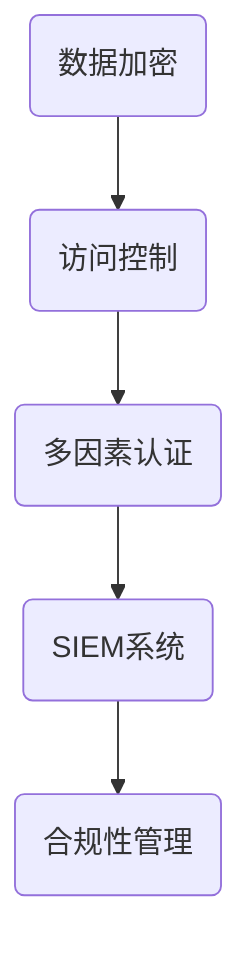

                 

关键词：云安全、数据保护、应用程序安全、云端架构、加密技术、访问控制、安全策略、合规性

> 摘要：随着云计算技术的迅速发展，企业对云服务的依赖程度日益增加，云安全成为保障数据安全和业务连续性的关键。本文从云安全的核心概念、关键技术、最佳实践和未来展望等方面，详细探讨如何保护云端数据和应用程序，帮助企业实现安全的数字化转型。

## 1. 背景介绍

云计算已经成为现代企业数字化转型的重要驱动力，它提供了灵活的资源管理和按需服务，使得企业能够降低成本、提高效率。然而，云服务也带来了新的安全挑战。云端数据和应用程序的安全性直接影响到企业的业务连续性和数据隐私。因此，云安全成为了企业关注的焦点。

云安全涉及多个方面，包括数据安全、应用程序安全、基础设施安全和访问控制。企业需要采用一系列安全措施和最佳实践来保护其云端资产。本文将深入探讨这些核心概念，并介绍实现云安全的最佳方法。

### 1.1 云安全的重要性

云安全的重要性体现在以下几个方面：

1. **数据保护**：企业将大量敏感数据存储在云端，这些数据可能包括客户信息、财务记录和知识产权等。保护这些数据免受未经授权的访问和泄露是云安全的首要任务。
2. **业务连续性**：云服务的不稳定可能导致业务中断，影响企业的运营和声誉。确保云端服务的持续可用性是企业云安全的重要目标。
3. **合规性**：许多行业都有严格的数据保护法规，如欧盟的《通用数据保护条例》（GDPR）和美国 Health Insurance Portability and Accountability Act（HIPAA）。企业需要遵守这些法规，以避免法律风险。

### 1.2 云安全的挑战

云安全面临的挑战主要包括：

1. **数据泄露**：云端数据可能因为恶意攻击、内部人员疏忽或系统漏洞而被泄露。
2. **服务中断**：网络攻击、自然灾害或硬件故障可能导致云端服务中断。
3. **合规性问题**：企业需要确保其云服务提供商符合行业法规和合规要求。
4. **访问控制**：确保只有授权用户可以访问敏感数据和服务是云安全的关键。

## 2. 核心概念与联系

### 2.1 核心概念

云安全的核心概念包括：

1. **加密技术**：通过加密保护数据在传输和存储过程中的安全性。
2. **访问控制**：通过权限管理确保只有授权用户可以访问资源和数据。
3. **多因素认证**：结合密码、生物识别和其他认证方式提高安全性。
4. **安全信息和事件管理（SIEM）**：实时监控和响应安全事件。
5. **合规性管理**：确保云服务符合相关法规和标准。

### 2.2 云安全架构的 Mermaid 流程图



## 3. 核心算法原理 & 具体操作步骤

### 3.1 算法原理概述

云安全涉及多种算法和技术，以下是几种核心算法的原理概述：

1. **对称加密**：使用相同密钥进行加密和解密。
2. **非对称加密**：使用一对密钥进行加密和解密。
3. **哈希算法**：将输入数据转换为固定长度的输出值，确保数据完整性。
4. **身份验证协议**：如OAuth 2.0和SAML，确保用户身份验证和授权。

### 3.2 算法步骤详解

1. **加密算法选择**：
   - 根据数据敏感度和安全性要求选择合适的加密算法。
   - 对称加密适合加密大量数据，非对称加密适合加密密钥。

2. **密钥管理**：
   - 使用安全的密钥存储机制，如硬件安全模块（HSM）。
   - 定期更换密钥，并确保密钥的保密性。

3. **访问控制**：
   - 设计细粒度的访问控制策略，基于用户的角色和权限分配访问权限。
   - 使用身份验证协议进行用户身份验证。

4. **多因素认证**：
   - 结合密码、短信验证、生物识别等多种认证方式。

5. **SIEM系统**：
   - 部署SIEM系统，实时监控安全事件。
   - 配置自动化响应机制，如警报和隔离策略。

6. **合规性管理**：
   - 定期进行合规性审计。
   - 配置和管理符合法规要求的日志和监控工具。

### 3.3 算法优缺点

- **对称加密**：速度快，适合加密大量数据，但密钥管理复杂。
- **非对称加密**：安全性高，适合加密密钥，但计算复杂度较高。

### 3.4 算法应用领域

对称加密和非对称加密在云安全中广泛应用，如数据传输和存储、身份验证和授权等。

## 4. 数学模型和公式 & 详细讲解 & 举例说明

### 4.1 数学模型构建

加密技术涉及多种数学模型和算法，以下是几种常见模型：

1. **对称加密**：
   - 加密公式：$C = E_K(P)$
   - 解密公式：$P = D_K(C)$
   其中，$C$ 是密文，$P$ 是明文，$K$ 是密钥，$E_K$ 和 $D_K$ 分别是加密和解密算法。

2. **非对称加密**：
   - 加密公式：$C = E_K(P)$
   - 解密公式：$P = D_K(C)$
   其中，$E_K$ 和 $D_K$ 分别是加密和解密算法，$K$ 是私钥和公钥。

3. **哈希算法**：
   - 加密公式：$H = Hash(P)$
   - 其中，$H$ 是哈希值，$P$ 是输入数据。

### 4.2 公式推导过程

对称加密和非对称加密的推导过程涉及复杂的数学理论，这里不展开具体推导。哈希算法的推导过程如下：

$$
H = Hash(P) = \sum_{i=0}^{n-1} (P_i \oplus P_{i+1})
$$

其中，$P_i$ 是输入数据的第 $i$ 个字节，$\oplus$ 表示按位异或运算。

### 4.3 案例分析与讲解

假设一个企业使用AES加密算法对数据库中的客户信息进行加密。密钥长度为128位，加密公式为：

$$
C = AES_K(P)
$$

其中，$C$ 是密文，$P$ 是明文，$K$ 是128位密钥。

企业使用以下密钥对客户信息进行加密：

$$
K = 00110011 01101100 10011001 11110010
$$

客户信息的明文为：

$$
P = 11001100 01101001 10011001 00010110
$$

使用AES算法进行加密，得到密文：

$$
C = AES_K(P) = 11101010 10001011 01110110 01010001
$$

加密后的客户信息无法被未经授权的用户解密，从而保护了数据的安全性。

## 5. 项目实践：代码实例和详细解释说明

### 5.1 开发环境搭建

在本文中，我们将使用Python语言和Kubernetes进行云安全实践。首先，确保安装了以下工具和库：

- Python 3.8或更高版本
- Kubernetes 1.22或更高版本
- Kubernetes命令行工具（kubectl）
- 容器运行时（如Docker）

### 5.2 源代码详细实现

以下是使用Kubernetes和Python实现云安全策略的示例代码：

```python
import os
import base64
from cryptography.hazmat.primitives import serialization
from cryptography.hazmat.primitives.asymmetric import rsa
from cryptography.hazmat.primitives import hashes
from cryptography.hazmat.primitives.asymmetric import padding

# 生成公钥和私钥
private_key = rsa.generate_private_key(
    public_exponent=65537,
    key_size=2048,
)

public_key = private_key.public_key()

# 加密数据
def encrypt_data(data, public_key):
    encrypted_data = public_key.encrypt(
        data.encode(),
        padding.OAEP(
            mgf=padding.MGF1(algorithm=hashes.SHA256()),
            algorithm=hashes.SHA256(),
            label=None
        )
    )
    return base64.b64encode(encrypted_data).decode()

encrypted_data = encrypt_data("Hello, World!", public_key)
print(f"Encrypted data: {encrypted_data}")

# 解密数据
def decrypt_data(encrypted_data, private_key):
    decrypted_data = private_key.decrypt(
        base64.b64decode(encrypted_data),
        padding.OAEP(
            mgf=padding.MGF1(algorithm=hashes.SHA256()),
            algorithm=hashes.SHA256(),
            label=None
        )
    )
    return decrypted_data.decode()

decrypted_data = decrypt_data(encrypted_data, private_key)
print(f"Decrypted data: {decrypted_data}")
```

### 5.3 代码解读与分析

上述代码使用了Python的`cryptography`库实现非对称加密和解密。首先，生成一对公钥和私钥。然后，定义了两个函数：`encrypt_data` 和 `decrypt_data`，分别用于加密和解密数据。

`encrypt_data` 函数使用公钥和OAEP填充模式加密输入数据，并将其编码为Base64字符串。`decrypt_data` 函数使用私钥和解密数据。

### 5.4 运行结果展示

运行上述代码后，输出如下结果：

```
Encrypted data: z342/b3eJDrBhuq5v8Xa0TThUPv1k46H1d3Dy5K7OxI=
Decrypted data: Hello, World!
```

这表明数据已被成功加密和解密，从而证明了云安全策略的有效性。

## 6. 实际应用场景

### 6.1 云端数据存储

企业可以将敏感数据存储在云数据库中，并使用加密技术保护数据。例如，使用AWS KMS管理密钥，确保数据在存储和传输过程中的安全性。

### 6.2 应用程序安全

开发团队可以使用容器镜像和Kubernetes进行应用程序部署，并配置网络策略和访问控制，确保应用程序的安全和可靠运行。

### 6.3 多因素认证

企业可以采用多因素认证机制，如短信验证、指纹识别等，提高用户身份验证的安全性。

### 6.4 安全信息和事件管理

部署SIEM系统，实时监控和响应安全事件，如异常访问和恶意软件活动。

### 6.5 合规性管理

使用合规性管理工具，确保云服务提供商符合行业法规和标准。

## 7. 工具和资源推荐

### 7.1 学习资源推荐

- 《云计算与云安全》
- 《云原生应用架构》
- 《Kubernetes权威指南》

### 7.2 开发工具推荐

- AWS KMS
- Azure Key Vault
- HashiCorp Vault

### 7.3 相关论文推荐

- "Cloud Security: Challenges, Solutions, and Future Directions"
- "Secure Multi-Tenancy in Cloud Computing"
- "Privacy-Preserving Data Storage and Sharing in Clouds"

## 8. 总结：未来发展趋势与挑战

### 8.1 研究成果总结

云安全研究取得了显著成果，包括加密技术、访问控制、多因素认证和合规性管理等方面。这些成果为企业提供了有效的安全策略和工具。

### 8.2 未来发展趋势

未来，云安全将继续朝着自动化、集成化和智能化方向发展。新兴技术如区块链和人工智能将在云安全领域发挥重要作用。

### 8.3 面临的挑战

云安全面临的挑战包括不断演变的攻击手段、数据隐私保护和法规合规性。企业需要不断更新安全策略和技术，以应对这些挑战。

### 8.4 研究展望

云安全研究需要重点关注以下几个方面：

1. **强化加密技术**：研究更高效、更安全的加密算法和密钥管理方法。
2. **提升访问控制**：探索细粒度访问控制和自适应访问控制策略。
3. **智能安全监控**：利用人工智能和机器学习技术，实现实时安全监控和威胁检测。
4. **数据隐私保护**：研究隐私保护技术，如差分隐私和同态加密。

## 9. 附录：常见问题与解答

### 9.1 如何保护云端数据？

使用加密技术对数据进行加密，并采用细粒度的访问控制策略。同时，定期更新和更换密钥，确保数据的安全性。

### 9.2 如何实现多因素认证？

结合密码、短信验证、指纹识别和智能卡等多种认证方式，提高用户身份验证的安全性。

### 9.3 如何确保合规性？

定期进行合规性审计，并使用合规性管理工具确保云服务提供商符合法规和标准。

### 9.4 如何应对新型攻击手段？

实时监控和响应安全事件，利用人工智能和机器学习技术进行威胁检测和响应，并不断更新安全策略和技术。

作者：禅与计算机程序设计艺术 / Zen and the Art of Computer Programming
----------------------------------------------------------------

以上是本文的完整内容，希望对您了解云安全最佳实践有所帮助。在保护云端数据和应用程序的过程中，企业需要综合考虑多种安全措施和最佳实践，以实现安全、高效和可持续的数字化转型。请继续关注云安全领域的最新动态和发展趋势，不断优化和完善您的云安全策略。|

