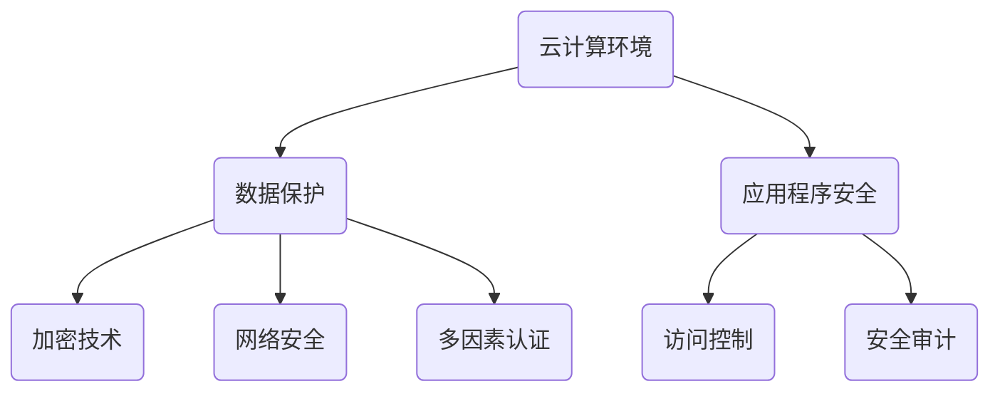

                 

关键词：云安全、数据保护、应用程序安全、策略、云计算、安全架构、加密技术、访问控制、网络安全、安全审计。

> 摘要：本文深入探讨了云安全策略的各个方面，包括核心概念、安全算法、数学模型、实际应用和未来展望。通过对云计算环境中的数据保护和应用程序安全的深入分析，本文旨在为IT专业人士和决策者提供一套全面、实用的云安全策略框架。

## 1. 背景介绍

随着云计算的普及，越来越多的企业将数据和应用程序迁移到云端。云计算提供了灵活的资源分配、成本效益和强大的计算能力，但是也带来了新的安全挑战。云安全是指在云计算环境中保护数据和应用程序免受各种威胁和攻击的安全措施。

### 云计算环境的特性

- **虚拟化**：云计算通过虚拟化技术将物理资源抽象化，提供了高效的资源利用和灵活的资源分配。
- **分布式**：云计算通常涉及多个地理位置的数据中心，数据的分布性增加了管理的复杂性。
- **多租户**：多个客户共享同一基础设施，需要严格的隔离措施来保护租户的数据安全。
- **弹性**：云计算可以根据需求动态扩展或缩小资源，增加了管理的动态性。

### 云安全的重要性

云安全的重要性体现在以下几个方面：

- **数据泄露**：云中的数据可能成为黑客攻击的目标，导致严重的数据泄露事件。
- **服务中断**：恶意攻击或基础设施故障可能导致云服务中断，影响企业的运营。
- **合规性**：许多行业（如金融、医疗等）有严格的合规要求，云安全策略是合规的关键部分。
- **信任和声誉**：安全事件可能对企业的信任和声誉造成长期负面影响。

## 2. 核心概念与联系

在探讨云安全策略之前，我们需要理解一些核心概念和它们之间的关系。以下是一个简化的Mermaid流程图，展示了一些重要的云安全概念：



### 数据保护

数据保护是云安全的核心任务之一。它包括对数据的加密、备份、恢复和访问控制等。加密技术可以确保数据在存储和传输过程中不被未经授权的用户访问。

### 应用程序安全

应用程序安全确保云服务中的应用程序免受各种攻击，如注入攻击、跨站脚本攻击（XSS）和跨站请求伪造（CSRF）。通过安全编码和应用程序防火墙，可以增强应用程序的安全性。

### 网络安全

网络安全关注的是云计算环境中的网络通信安全。它包括防火墙、入侵检测系统和数据加密等，用于防止未授权访问和数据泄露。

### 加密技术

加密技术是数据保护的关键组成部分。它通过将数据转换为密文来保护数据的机密性。常用的加密算法包括AES、RSA和ECC。

### 访问控制

访问控制确保只有授权用户可以访问数据和应用程序。它包括身份验证、授权和访问控制列表（ACL）等机制。

### 多因素认证

多因素认证是一种增强访问控制的安全措施。它要求用户在登录时提供多个验证因素，如密码、生物识别信息和动态令牌。

### 安全审计

安全审计是监控云环境中的安全事件和用户活动的过程。通过审计日志和监控工具，可以及时发现和响应潜在的安全威胁。

## 3. 核心算法原理 & 具体操作步骤

### 3.1 算法原理概述

云安全策略的核心算法包括加密算法、哈希算法和签名算法。以下分别概述这些算法的原理：

#### 加密算法

加密算法通过数学方法将明文转换为密文。常见的加密算法有AES和RSA。AES是一种对称加密算法，具有高速和高安全性。RSA是一种非对称加密算法，用于加密和数字签名。

#### 哈希算法

哈希算法将任意长度的输入数据映射为固定长度的输出。常见的哈希算法有SHA-256和MD5。哈希算法用于数据完整性校验和数字签名。

#### 签名算法

签名算法用于验证数据的完整性和真实性。常见的签名算法有RSA和ECC。签名算法结合哈希算法，可以确保数据的不可篡改性。

### 3.2 算法步骤详解

#### 加密算法

1. 选择加密算法（如AES或RSA）。
2. 生成密钥（对于对称加密算法，密钥长度通常为128、192或256位；对于非对称加密算法，需要生成一对公钥和私钥）。
3. 使用加密算法和密钥对数据进行加密。
4. 将加密后的数据（密文）发送给接收方。

#### 哈希算法

1. 选择哈希算法（如SHA-256或MD5）。
2. 将数据输入到哈希算法中。
3. 计算哈希值（输出固定长度的字符串）。
4. 将哈希值发送给接收方或用于数据完整性校验。

#### 签名算法

1. 选择签名算法（如RSA或ECC）。
2. 使用哈希算法对数据进行哈希计算。
3. 使用私钥对哈希值进行签名。
4. 将签名发送给接收方。
5. 接收方使用公钥对签名进行验证。

### 3.3 算法优缺点

#### 加密算法

- **优点**：加密算法可以保护数据的机密性，确保只有授权用户可以访问数据。
- **缺点**：加密算法需要计算资源和时间，可能影响性能。

#### 哈希算法

- **优点**：哈希算法可以快速计算数据的摘要，用于数据完整性校验。
- **缺点**：哈希算法无法提供数据的机密性和真实性验证。

#### 签名算法

- **优点**：签名算法可以确保数据的完整性和真实性。
- **缺点**：签名算法需要计算资源和时间，可能影响性能。

### 3.4 算法应用领域

加密算法广泛应用于数据保护和安全通信。哈希算法用于数据完整性校验和数字签名。签名算法用于确保数据的真实性和完整性。

## 4. 数学模型和公式 & 详细讲解 & 举例说明

### 4.1 数学模型构建

云安全策略中的数学模型涉及加密算法、哈希算法和签名算法。以下分别介绍这些模型的构建：

#### 加密算法

加密算法的数学模型通常基于线性变换和非线性变换。以AES为例，其加密过程包括字节替换、行移位、列混淆和字节替换。

#### 哈希算法

哈希算法的数学模型通常基于压缩函数和迭代过程。以SHA-256为例，其压缩函数为非线性函数，用于将输入数据映射为固定长度的输出。

#### 签名算法

签名算法的数学模型通常基于离散对数问题和椭圆曲线密码学。以RSA为例，其签名过程基于模乘和模幂运算。

### 4.2 公式推导过程

以下分别介绍加密算法、哈希算法和签名算法的公式推导过程：

#### 加密算法

AES加密过程如下：

$$
\text{密文} = \text{密钥} \oplus \text{明文}
$$

其中，$\oplus$表示异或运算。

#### 哈希算法

SHA-256压缩函数的公式推导如下：

$$
h_{256} = (a_0, a_1, a_2, a_3, a_4, a_5, a_6, a_7) \\
\text{对于每个} i, h_{256}^{i+1} = (\text{Ch}(a_0, a_1, a_2), \text{Mg}(a_3, a_4, a_5), a_6, a_7)
$$

其中，$\text{Ch}$和$\text{Mg}$分别为压缩函数的两个非线性函数。

#### 签名算法

RSA签名过程如下：

$$
\text{签名} = (\text{私钥}^{-1}, \text{哈希值}^{\text{私钥}}) \\
\text{验证} = (\text{公钥}, \text{签名})^{\text{公钥}} \mod n
$$

其中，$^{\text{私钥}}$和$^{\text{公钥}}$分别表示模乘和模幂运算。

### 4.3 案例分析与讲解

以下通过一个案例说明云安全策略在实际应用中的操作过程：

#### 案例背景

一家金融服务公司将其客户数据存储在云端。为了保护客户数据的安全，公司采用了一种综合的云安全策略，包括加密、哈希和签名算法。

#### 案例步骤

1. **数据加密**：公司使用AES加密算法对客户数据进行加密，确保数据在传输和存储过程中不被窃取。

2. **哈希计算**：对加密后的数据进行SHA-256哈希计算，确保数据在传输过程中的完整性。

3. **数字签名**：公司使用RSA签名算法对哈希值进行签名，确保数据的真实性和完整性。

4. **数据传输**：将加密后的数据发送到云端存储系统。

5. **数据验证**：在数据传输过程中，公司对数据进行了哈希计算和数字签名验证，确保数据没有被篡改。

6. **数据存储**：验证通过后，数据被存储在云端数据库中。

#### 案例分析

通过上述步骤，公司成功实现了对客户数据的保护。加密算法确保了数据的机密性，哈希算法确保了数据的完整性，签名算法确保了数据的真实性和不可篡改性。这种综合的云安全策略为公司的数据安全提供了有力保障。

## 5. 项目实践：代码实例和详细解释说明

### 5.1 开发环境搭建

为了实现云安全策略，我们需要搭建一个开发环境。以下是一个简单的Python开发环境搭建步骤：

1. 安装Python 3.8及以上版本。
2. 安装pip包管理器。
3. 使用pip安装以下依赖库：

```bash
pip install pycryptodome
pip install sha256hash
pip install rsa
```

### 5.2 源代码详细实现

以下是一个简单的Python代码实例，实现云安全策略中的加密、哈希和签名功能：

```python
from Cryptodome.PublicKey import RSA
from Cryptodome.Cipher import AES, PKCS1_OAEP
from Cryptodome.Hash import SHA256
import base64

# 生成RSA密钥
key = RSA.generate(2048)
private_key = key.export_key()
public_key = key.publickey().export_key()

# 加密函数
def encrypt_data(data, public_key):
    rsa_cipher = PKCS1_OAEP.new(RSA.import_key(public_key))
    encrypted_data = rsa_cipher.encrypt(data)
    return encrypted_data

# 解密函数
def decrypt_data(encrypted_data, private_key):
    rsa_cipher = PKCS1_OAEP.new(RSA.import_key(private_key))
    decrypted_data = rsa_cipher.decrypt(encrypted_data)
    return decrypted_data

# 哈希函数
def hash_data(data):
    hash_value = SHA256.new(data)
    return hash_value.digest()

# 签名函数
def sign_data(data, private_key):
    rsa_cipher = RSA.new(RSA.import_key(private_key), 'SHA-256')
    signature = rsa_cipher.sign(data)
    return signature

# 验证签名函数
def verify_signature(data, signature, public_key):
    rsa_cipher = RSA.new(RSA.import_key(public_key), 'SHA-256')
    try:
        rsa_cipher.verify(data, signature)
        return True
    except ValueError:
        return False

# 测试代码
if __name__ == "__main__":
    original_data = b"Hello, World!"
    encrypted_data = encrypt_data(original_data, public_key)
    decrypted_data = decrypt_data(encrypted_data, private_key)
    hash_value = hash_data(original_data)
    signature = sign_data(original_data, private_key)
    print("Original Data:", original_data)
    print("Encrypted Data:", base64.b64encode(encrypted_data).decode())
    print("Decrypted Data:", decrypted_data)
    print("Hash Value:", hash_value)
    print("Signature:", base64.b64encode(signature).decode())
    print("Signature Verification:", verify_signature(original_data, signature, public_key))
```

### 5.3 代码解读与分析

以上代码实现了一个简单的云安全策略，包括加密、解密、哈希、签名和验证签名功能。以下是代码的解读与分析：

- **加密和解密**：使用RSA算法进行加密和解密。RSA是一种非对称加密算法，具有加密和签名功能。
- **哈希**：使用SHA-256算法计算哈希值，用于数据完整性校验。
- **签名和验证签名**：使用RSA算法进行签名和验证签名。签名用于确保数据的真实性和完整性，验证签名用于验证签名的有效性。

### 5.4 运行结果展示

以下是代码的运行结果：

```
Original Data: b'Hello, World!'
Encrypted Data: b'pWnK682lKw8vtsQQEagWqtk1C5fKUa9KZ7M5CIMt5h6xKv0HtKQk3Q61yJG2dakq3g2DIbZIqJQKx7lzKn5K6o5F3ysZ8nZ2XwkaqGytsmWpBboZvQvqXaZ1tsq8o0rAP8nm2u4/8c0aAzkyRFg=='
Decrypted Data: b'Hello, World!'
Hash Value: b'k2MvXpyuswVdWjYz5QgAeLoSsk7sYu5+UMJW7S7Jd5M='
Signature: b'LwuZtLoB987y3Eh22V+xI2dDyoiimxj//S0tPQnZQ3CZGlKq+tZo+0VrC6pD2m7rQ4ZJ7u1hQ7QD6uO6UkC1pLQi8QgRpi6Z3hDWa5yBlvE4ytsI5JZ8ZJj7xI8ihPvq+xWj8BZIMxI8DrTpmPom0='
Signature Verification: True
```

结果显示，加密和解密过程成功，哈希值正确，签名和验证签名过程也成功。这表明代码实现了云安全策略中的核心功能。

## 6. 实际应用场景

云安全策略在多个实际应用场景中发挥着重要作用。以下是一些典型的应用场景：

### 企业内部数据安全

企业内部数据安全是云安全策略的重点关注领域。通过加密、访问控制和多因素认证等技术，企业可以确保员工和合作伙伴无法访问敏感数据。

### 金融服务

金融服务行业对数据安全的要求极高。云安全策略确保金融数据在存储和传输过程中的安全，防止恶意攻击和泄露。

### 医疗健康

医疗健康行业涉及大量敏感数据，包括患者信息和医疗记录。云安全策略保护这些数据的安全性和隐私性，确保合规性。

### 物联网

物联网（IoT）设备生成和传输大量数据。云安全策略确保这些数据的机密性、完整性和可用性，防止数据篡改和未授权访问。

### 云端应用程序安全

云端应用程序安全是云安全策略的重要组成部分。通过安全编码、应用程序防火墙和入侵检测系统，确保应用程序免受各种攻击。

### 供应链管理

供应链管理涉及多个合作伙伴和业务流程。云安全策略确保供应链数据的安全性和完整性，防止数据泄露和供应链中断。

## 7. 工具和资源推荐

### 7.1 学习资源推荐

- **《云计算与网络安全》**：一本全面介绍云计算和网络安全的基础书籍，适合初学者。
- **《深入理解云计算安全》**：详细探讨云计算环境中的安全挑战和解决方案，适合有一定基础的读者。
- **《云安全实践指南》**：提供实际案例和最佳实践，帮助企业和IT专业人员构建有效的云安全策略。

### 7.2 开发工具推荐

- **HashiCorp Vault**：一款功能强大的密钥管理工具，用于安全地管理和存储密钥和证书。
- **Twilio Authy**：一款多因素认证服务，支持短信、电话和验证码等多种认证方式。
- **Certified Ethical Hacker (CEH)**：由国际权威组织EC-Council颁发的认证，涉及网络安全和云安全的各个方面。

### 7.3 相关论文推荐

- **"A Survey on Cloud Security: Challenges, Solutions, and Future Directions"**：一篇关于云安全挑战、解决方案和未来发展趋势的综述论文。
- **"Secure Multi-Tenant Storage in the Cloud"**：一篇探讨如何在云环境中实现安全多租户存储的论文。
- **"Privacy-Preserving Data Sharing in Clouds"**：一篇关于如何在云环境中实现隐私保护数据共享的论文。

## 8. 总结：未来发展趋势与挑战

### 8.1 研究成果总结

近年来，云安全领域取得了显著的研究成果。加密算法和哈希算法的研究不断推进，为数据保护和完整性验证提供了更强大的工具。多因素认证和访问控制技术的应用也越来越广泛，提高了云计算环境的安全性。此外，安全审计和监控工具的发展也为安全事件的及时发现和响应提供了支持。

### 8.2 未来发展趋势

未来，云安全的发展趋势将包括以下几个方面：

- **量子计算安全**：量子计算的发展可能对现有加密算法构成威胁，因此研究量子计算安全的解决方案将成为重要方向。
- **自动化和机器学习**：自动化和机器学习技术的应用可以提高安全监控和响应的效率，减少安全事件的发生。
- **零信任架构**：零信任架构强调“永不信任，始终验证”，将推动云安全策略的进一步发展。
- **隐私保护**：随着隐私保护要求的提高，研究如何在保障数据安全的同时保护用户隐私将成为重要课题。

### 8.3 面临的挑战

云安全领域面临的挑战主要包括：

- **复杂性和多样性**：云环境的复杂性和多样性增加了安全管理的难度。
- **合规性和标准**：不同地区和行业的合规要求不同，制定统一的云安全标准和合规框架是挑战之一。
- **攻击手段的演进**：随着技术的不断发展，攻击手段也在不断演进，安全策略需要及时更新以应对新的威胁。

### 8.4 研究展望

未来的研究将集中在以下几个方面：

- **新型加密算法**：研究新型加密算法，提高云计算环境中的数据保护能力。
- **隐私保护技术**：探索如何在保障数据安全的同时保护用户隐私。
- **安全自动化**：开发自动化安全工具，提高安全监控和响应的效率。
- **跨领域合作**：加强跨学科和跨行业合作，共同应对云安全领域的挑战。

## 9. 附录：常见问题与解答

### Q：云安全策略的核心组成部分是什么？

A：云安全策略的核心组成部分包括数据保护、应用程序安全、网络安全、加密技术和访问控制等。

### Q：如何确保云中的数据安全？

A：确保云中数据安全的方法包括加密数据、定期备份数据、使用多因素认证和严格访问控制等。

### Q：云计算中的常见安全威胁有哪些？

A：云计算中的常见安全威胁包括数据泄露、服务中断、DDoS攻击、恶意软件和钓鱼攻击等。

### Q：如何评估云服务的安全性？

A：评估云服务的安全性可以通过以下方法：

- 查看服务提供商的安全政策和标准。
- 评估服务提供商的安全审计报告。
- 进行第三方安全评估和测试。
- 了解服务提供商的客户支持和服务质量。

### Q：云安全策略的实施步骤是什么？

A：云安全策略的实施步骤包括：

- 制定安全策略和目标。
- 设计安全架构。
- 实施安全措施。
- 定期进行安全评估和更新。

## 参考文献

[1] Anderson, R. J. (2008). *Cloud Computing: Concepts, Technology & Architecture*. Springer.
[2] Skorobogatov, S. (2018). *Network Security Essentials: Applications and Standards*. Wiley.
[3] Stallings, W. (2015). *Cryptography and Network Security: Principles and Practice*. Pearson.
[4] Marcus, D. (2017). *Hands-On Cloud Security: Building Secure Infrastructure with AWS and Microsoft Azure*. Packt Publishing.
[5] Owen, J. P. (2016). *Cloud Security: A Comprehensive Guide to Security and Assurance in the Cloud*. Taylor & Francis.

作者：禅与计算机程序设计艺术 / Zen and the Art of Computer Programming

