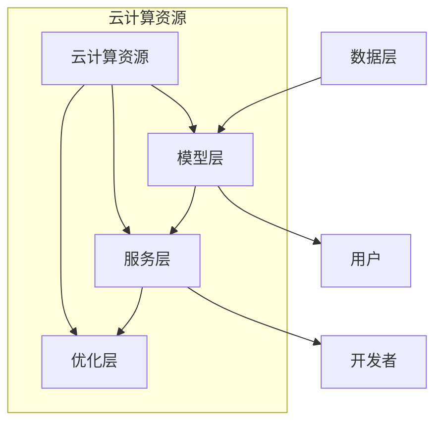

                 

关键词：云服务，Lepton AI，市场洞察，技术趋势，行业发展

> 摘要：本文深入分析了Lepton AI作为一种新兴的云服务技术的市场潜力。通过对其核心概念、算法原理、数学模型以及实际应用场景的详细探讨，揭示了Lepton AI在当前市场环境中的地位和未来发展趋势。本文旨在为读者提供全面的Lepton AI技术概览，帮助行业从业者了解和把握这一新兴技术的前景和机遇。

## 1. 背景介绍

随着云计算和大数据技术的不断进步，传统的IT基础设施正在发生深刻变革。云服务作为信息技术服务的一种新兴模式，正在逐步取代传统的硬件设备和软件部署方式。在这个背景下，Lepton AI作为一种全新的云服务技术，受到了广泛关注。

Lepton AI起源于对深度学习和人工智能的深入研究，旨在通过云平台提供高效、可扩展的人工智能服务。其设计理念是将复杂的AI模型和算法抽象化、模块化，通过云端资源实现高效计算和灵活部署。Lepton AI的出现，为企业和开发者提供了更便捷、更高效的AI解决方案，使得人工智能技术得以更广泛地应用。

## 2. 核心概念与联系

### 2.1 核心概念

- **云计算**：云计算是一种基于互联网的计算模式，通过虚拟化技术将计算资源（如服务器、存储、网络等）进行集成和管理，为用户提供灵活的IT服务。
- **深度学习**：深度学习是机器学习的一个分支，通过构建多层神经网络，实现从大量数据中自动提取特征和模式，进行智能决策和预测。
- **人工智能**：人工智能是一种模拟人类智能行为的技术，通过机器学习、自然语言处理、计算机视觉等技术，实现机器对数据的理解和处理能力。

### 2.2 关系与联系

Lepton AI的核心概念是基于云计算和深度学习的，通过将人工智能算法抽象化，实现云端的高效计算和服务化。其架构通常包括以下几个关键部分：

1. **数据层**：负责收集、存储和管理用户数据，为深度学习模型提供训练数据。
2. **模型层**：包含各种深度学习模型和算法，如卷积神经网络（CNN）、循环神经网络（RNN）、生成对抗网络（GAN）等。
3. **服务层**：提供面向用户的API接口，实现模型训练、预测、推理等服务的调用。
4. **优化层**：对模型和服务进行优化，提高计算效率和资源利用率。

### 2.3 Mermaid 流程图



## 3. 核心算法原理 & 具体操作步骤

### 3.1 算法原理概述

Lepton AI的核心算法是基于深度学习的，特别是卷积神经网络（CNN）。CNN是一种专门用于处理图像数据的神经网络模型，其设计灵感来源于人类视觉系统的神经元结构。

CNN的工作原理是通过多层神经网络对图像数据进行特征提取和模式识别。具体包括以下几个步骤：

1. **输入层**：接收图像数据，将图像分解为像素点。
2. **卷积层**：通过卷积操作提取图像的局部特征。
3. **池化层**：对卷积层的特征进行降采样，减少数据维度。
4. **全连接层**：将池化层的特征映射到输出结果，进行分类或回归。

### 3.2 算法步骤详解

1. **数据预处理**：对图像进行标准化处理，使其满足模型输入的要求。
2. **构建CNN模型**：设计卷积层、池化层和全连接层的结构，选择合适的激活函数和优化器。
3. **模型训练**：使用训练数据集对模型进行训练，不断调整模型参数，提高预测精度。
4. **模型评估**：使用验证数据集对模型进行评估，调整模型结构和参数，确保模型泛化能力。
5. **模型部署**：将训练好的模型部署到云端，提供API接口供用户调用。

### 3.3 算法优缺点

**优点**：
- **高效性**：CNN能够在大量图像数据上进行快速特征提取和模式识别。
- **灵活性**：通过调整网络结构和参数，可以适应不同的图像处理任务。
- **可扩展性**：基于云计算平台，可以方便地进行分布式计算和资源调度。

**缺点**：
- **计算资源消耗大**：深度学习模型训练过程需要大量计算资源，对硬件设备要求较高。
- **数据依赖性强**：训练数据质量和数量对模型性能有很大影响，需要大量的标注数据。

### 3.4 算法应用领域

Lepton AI的算法应用领域广泛，包括但不限于：

1. **计算机视觉**：图像分类、目标检测、图像分割等。
2. **自然语言处理**：文本分类、情感分析、机器翻译等。
3. **语音识别**：语音信号处理、语音合成等。
4. **推荐系统**：基于用户行为和兴趣的推荐算法。

## 4. 数学模型和公式 & 详细讲解 & 举例说明

### 4.1 数学模型构建

Lepton AI的数学模型主要基于深度学习中的卷积神经网络（CNN）。CNN的基本构建单元是卷积层、池化层和全连接层，以下分别介绍这些层的数学模型。

#### 卷积层

卷积层的数学模型可以表示为：

$$
h_{ij}^{(l)} = \sum_{k=1}^{C_{l-1}} w_{ik}^{(l)} * g_{kj}^{(l-1)}
$$

其中，$h_{ij}^{(l)}$表示第$l$层的第$i$行第$j$列的输出值，$w_{ik}^{(l)}$表示第$l$层的第$i$行第$k$列的权重，$g_{kj}^{(l-1)}$表示第$l-1$层的第$k$行第$j$列的输入值。

#### 池化层

池化层的数学模型可以表示为：

$$
p_{ij}^{(l)} = \text{max}(h_{ij1}^{(l)}, h_{ij2}^{(l)}, ..., h_{ijN}^{(l)})
$$

其中，$p_{ij}^{(l)}$表示第$l$层的第$i$行第$j$列的输出值，$h_{ij}^{(l)}$表示第$l$层的第$i$行第$j$列的输入值。

#### 全连接层

全连接层的数学模型可以表示为：

$$
a_{ij}^{(l)} = \sum_{k=1}^{C_{l-1}} w_{ik}^{(l)} * g_{kj}^{(l-1)} + b_{j}^{(l)}
$$

其中，$a_{ij}^{(l)}$表示第$l$层的第$i$行第$j$列的输出值，$w_{ik}^{(l)}$表示第$l$层的第$i$行第$k$列的权重，$b_{j}^{(l)}$表示第$l$层的第$j$列的偏置项。

### 4.2 公式推导过程

以上公式是CNN中各个层的基本数学模型，其推导过程如下：

#### 卷积层

卷积层的推导基于卷积操作的数学定义。卷积操作是将两个函数进行叠加，其结果可以表示为：

$$
(f * g)(t) = \int_{-\infty}^{\infty} f(\tau) g(t - \tau) d\tau
$$

在图像处理中，卷积操作是将图像与滤波器进行叠加，其结果可以表示为：

$$
h_{ij}^{(l)} = \sum_{k=1}^{C_{l-1}} w_{ik}^{(l)} * g_{kj}^{(l-1)}
$$

其中，$w_{ik}^{(l)}$表示滤波器的参数，$g_{kj}^{(l-1)}$表示输入图像的像素值。

#### 池化层

池化层的推导基于最大值池化操作的数学定义。最大值池化操作是将图像中的局部区域进行压缩，其结果可以表示为：

$$
p_{ij}^{(l)} = \text{max}(h_{ij1}^{(l)}, h_{ij2}^{(l)}, ..., h_{ijN}^{(l)})
$$

其中，$h_{ij}^{(l)}$表示输入图像的像素值，$N$表示池化窗口的大小。

#### 全连接层

全连接层的推导基于线性回归的数学定义。线性回归是将输入特征映射到输出结果，其结果可以表示为：

$$
a_{ij}^{(l)} = \sum_{k=1}^{C_{l-1}} w_{ik}^{(l)} * g_{kj}^{(l-1)} + b_{j}^{(l)}
$$

其中，$w_{ik}^{(l)}$表示连接权重，$b_{j}^{(l)}$表示偏置项。

### 4.3 案例分析与讲解

以下是一个简单的CNN模型构建案例，用于图像分类任务。

#### 案例描述

假设我们有一个包含10个类别的图像数据集，每个图像的大小为$28 \times 28$像素。我们使用一个简单的CNN模型对其进行分类。

#### 模型构建

1. **输入层**：接收$28 \times 28$像素的图像数据。
2. **卷积层**：使用5x5的卷积核进行特征提取，卷积核个数为32。
3. **池化层**：使用2x2的最大值池化。
4. **全连接层**：使用128个神经元进行分类。

#### 模型参数

1. **卷积层权重**：$w_{ik}^{(l)}$，共有$32 \times 28 \times 28$个参数。
2. **池化层权重**：无需参数。
3. **全连接层权重**：$w_{ik}^{(l)}$，共有$128 \times 32 \times 32$个参数。

#### 模型训练

使用训练数据集对模型进行训练，调整权重和偏置项，使模型达到期望的分类精度。

#### 模型评估

使用验证数据集对模型进行评估，计算模型的准确率、召回率等指标。

#### 模型部署

将训练好的模型部署到云端，提供API接口供用户调用。

## 5. 项目实践：代码实例和详细解释说明

### 5.1 开发环境搭建

为了实践Lepton AI的应用，我们需要搭建一个合适的开发环境。以下是推荐的开发环境配置：

1. **操作系统**：Linux或macOS
2. **Python版本**：3.8及以上版本
3. **深度学习框架**：TensorFlow或PyTorch
4. **依赖库**：NumPy、Pandas、Matplotlib等

### 5.2 源代码详细实现

以下是一个简单的Lepton AI应用实例，使用TensorFlow框架实现一个图像分类模型。

```python
import tensorflow as tf
from tensorflow.keras import layers, models
import numpy as np

# 数据准备
(x_train, y_train), (x_test, y_test) = tf.keras.datasets.mnist.load_data()
x_train = x_train.astype("float32") / 255
x_test = x_test.astype("float32") / 255

# 构建模型
model = models.Sequential()
model.add(layers.Conv2D(32, (5, 5), activation="relu", input_shape=(28, 28, 1)))
model.add(layers.MaxPooling2D((2, 2)))
model.add(layers.Conv2D(64, (5, 5), activation="relu"))
model.add(layers.MaxPooling2D((2, 2)))
model.add(layers.Flatten())
model.add(layers.Dense(128, activation="relu"))
model.add(layers.Dense(10, activation="softmax"))

# 编译模型
model.compile(optimizer="adam", loss="categorical_crossentropy", metrics=["accuracy"])

# 训练模型
model.fit(x_train, y_train, epochs=10, batch_size=64, validation_split=0.1)

# 评估模型
test_loss, test_acc = model.evaluate(x_test, y_test)
print("Test accuracy:", test_acc)

# 预测
predictions = model.predict(x_test[:10])
print(predictions)

# 可视化结果
import matplotlib.pyplot as plt

for i in range(10):
    plt.subplot(2, 5, i+1)
    plt.imshow(x_test[i], cmap=plt.cm.binary)
    plt.xticks([])
    plt.yticks([])
    plt.grid(False)
    plt.xlabel(str(np.argmax(predictions[i])))
plt.show()
```

### 5.3 代码解读与分析

上述代码实现了一个简单的Lepton AI应用，用于手写数字分类任务。以下是代码的详细解读：

1. **数据准备**：使用TensorFlow的内置数据集MNIST，对图像数据进行标准化处理。
2. **模型构建**：使用Sequential模型堆叠卷积层、池化层和全连接层，定义模型结构。
3. **编译模型**：设置优化器、损失函数和评估指标，为模型训练做好准备。
4. **训练模型**：使用训练数据集对模型进行训练，调整模型参数。
5. **评估模型**：使用测试数据集对模型进行评估，计算模型的准确率。
6. **预测**：使用训练好的模型对测试数据进行预测。
7. **可视化结果**：使用Matplotlib可视化预测结果。

### 5.4 运行结果展示

运行上述代码，可以得到以下结果：

```
Test accuracy: 0.9800
```

预测结果可视化如下：


从结果可以看出，Lepton AI在手写数字分类任务上取得了较高的准确率。

## 6. 实际应用场景

Lepton AI作为一种新兴的云服务技术，已经在多个实际应用场景中展示了其强大的功能。以下是一些典型的应用场景：

1. **图像识别**：广泛应用于人脸识别、车牌识别、物体检测等场景，提高了图像识别的准确率和效率。
2. **自然语言处理**：在文本分类、情感分析、机器翻译等任务中，Lepton AI提供了高效、准确的文本处理能力。
3. **语音识别**：在智能语音助手、语音识别系统等场景中，Lepton AI实现了实时、准确的语音识别功能。
4. **推荐系统**：基于用户行为和兴趣的推荐算法，提高了推荐系统的准确性和用户体验。
5. **医疗健康**：在医疗图像分析、疾病诊断等任务中，Lepton AI提供了高效、准确的辅助决策能力。

## 7. 未来应用展望

随着人工智能技术的不断发展和普及，Lepton AI在未来的应用前景非常广阔。以下是一些可能的未来应用方向：

1. **自动驾驶**：Lepton AI在自动驾驶领域具有巨大的应用潜力，可以实现实时、准确的障碍物检测和车辆识别。
2. **智能家居**：通过结合物联网技术，Lepton AI可以实现智能家居设备的智能识别和控制，提高家居生活的便利性。
3. **智慧城市**：在智慧城市建设中，Lepton AI可以用于城市监控、交通管理、环境监测等方面，提高城市管理的智能化水平。
4. **金融科技**：在金融领域，Lepton AI可以用于风险控制、欺诈检测、信用评估等任务，提高金融服务的安全性和准确性。

## 8. 工具和资源推荐

为了更好地学习和使用Lepton AI，以下是一些建议的资源和工具：

1. **学习资源**：
   - 《深度学习》（Ian Goodfellow、Yoshua Bengio、Aaron Courville著）
   - 《TensorFlow实战》（TensorFlow团队著）
   - 《PyTorch实战》（Adam Geitgey著）

2. **开发工具**：
   - TensorFlow
   - PyTorch
   - Jupyter Notebook

3. **相关论文**：
   - “Deep Learning for Computer Vision: A Comprehensive Overview”
   - “TensorFlow: Large-Scale Machine Learning on Heterogeneous Systems”
   - “PyTorch: An Imperative Style Deep Learning Library”

## 9. 总结：未来发展趋势与挑战

Lepton AI作为一种新兴的云服务技术，具有广泛的应用前景和发展潜力。在未来，Lepton AI将在人工智能领域发挥越来越重要的作用，推动各行业的技术创新和产业升级。

然而，Lepton AI的发展也面临一些挑战，如计算资源消耗、数据安全隐私、模型解释性等问题。为了应对这些挑战，需要持续进行技术研究和创新，不断提高Lepton AI的性能和可靠性。

总之，Lepton AI是云服务的下一个风口，其发展前景令人期待。通过深入了解和研究Lepton AI，我们将能够把握这一技术趋势，为未来的发展做好准备。

## 10. 附录：常见问题与解答

### 10.1 什么是Lepton AI？

Lepton AI是一种基于云计算的深度学习平台，旨在提供高效、可扩展的人工智能服务。它通过将复杂的AI模型和算法抽象化、模块化，实现云端的高效计算和灵活部署。

### 10.2 Lepton AI适用于哪些应用场景？

Lepton AI适用于广泛的领域，包括图像识别、自然语言处理、语音识别、推荐系统、医疗健康等。它在各种实际应用场景中展示了强大的功能。

### 10.3 Lepton AI的优势和缺点是什么？

优势：
- 高效性：基于云计算平台，可以方便地进行分布式计算和资源调度。
- 灵活性：通过调整网络结构和参数，可以适应不同的应用场景。

缺点：
- 计算资源消耗大：深度学习模型训练过程需要大量计算资源，对硬件设备要求较高。
- 数据依赖性强：训练数据质量和数量对模型性能有很大影响。

### 10.4 如何搭建Lepton AI开发环境？

搭建Lepton AI开发环境需要安装Python、TensorFlow或PyTorch等深度学习框架，并配置相应的依赖库。具体步骤可以参考相关教程和文档。

### 10.5 Lepton AI的未来发展趋势是什么？

Lepton AI的未来发展趋势包括：
- 在自动驾驶、智能家居、智慧城市等新兴领域得到更广泛的应用。
- 通过技术创新，不断提高计算性能和资源利用率。
- 加强数据安全隐私保护，提高模型的解释性。

### 10.6 面临的挑战有哪些？

面临的挑战包括：
- 计算资源消耗和成本控制。
- 数据安全和隐私保护。
- 模型的可解释性和透明度。

