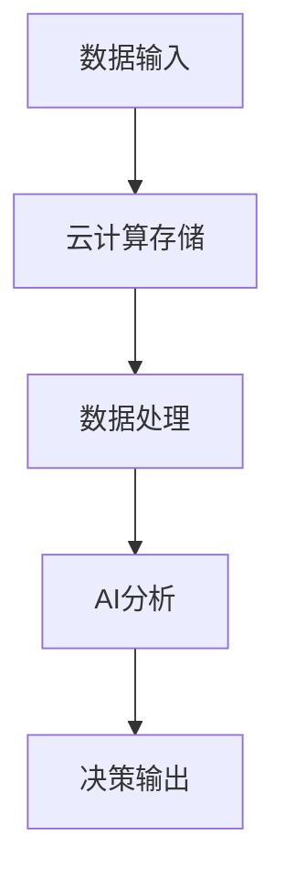

                 

 **关键词：** 云计算、AI融合、贾扬清、Lepton AI、云战略

**摘要：** 本文深入探讨了云计算与AI技术的融合，结合贾扬清的独特视角和Lepton AI的云战略，分析了这一融合对于现代信息技术的影响和未来趋势。本文旨在为读者提供一个全面的了解，帮助他们在这一快速发展的领域内做出明智的决策。

## 1. 背景介绍

随着云计算技术的不断发展和AI技术的迅速崛起，两者的融合已经成为信息技术领域的一个重要趋势。云计算提供了弹性、高效、可靠的基础设施，而AI技术则提供了智能分析和决策的能力。这种融合不仅提高了数据处理和存储的效率，还为各种应用场景带来了前所未有的可能性。

贾扬清作为一位世界顶级的人工智能专家，他的观点和Lepton AI的云战略为我们提供了深入了解这一融合的独特视角。Lepton AI作为一家专注于AI与云计算结合的公司，其成功经验和战略布局为行业提供了宝贵的参考。

## 2. 核心概念与联系

为了更好地理解云计算与AI的融合，我们首先需要明确几个核心概念：云计算、AI、数据存储和处理。

### 云计算

云计算是一种通过网络提供计算资源的服务模式，包括基础设施即服务（IaaS）、平台即服务（PaaS）和软件即服务（SaaS）。它提供了弹性的计算能力，使得用户可以根据需求动态调整资源使用。

### AI

AI是模拟、延伸和扩展人类智能的科学和技术。它通过算法和模型实现机器学习、自然语言处理、计算机视觉等能力，使得计算机能够执行复杂的任务。

### 数据存储和处理

数据存储和处理是云计算和AI融合的关键环节。云计算提供了高效、可靠的数据存储解决方案，而AI技术则可以对这些数据进行深入分析和挖掘，提取有价值的信息。

### Mermaid 流程图

下面是一个简单的Mermaid流程图，展示了云计算与AI融合的基本流程：



## 3. 核心算法原理 & 具体操作步骤

### 3.1 算法原理概述

云计算与AI融合的核心算法主要涉及以下几个方面：

- 数据预处理：将原始数据转换为适合AI分析的形式。
- 特征提取：从数据中提取出对AI分析有帮助的特征。
- 模型训练：使用历史数据训练AI模型。
- 模型评估：评估模型的性能，调整参数以优化模型。
- 模型应用：将训练好的模型应用于新数据，进行预测和分析。

### 3.2 算法步骤详解

1. 数据收集与预处理：收集相关数据，并进行清洗、转换等预处理操作，以确保数据质量。
2. 特征提取：根据业务需求，从数据中提取关键特征。
3. 数据划分：将数据划分为训练集、验证集和测试集，用于模型训练和评估。
4. 模型选择：选择合适的AI算法和模型架构。
5. 模型训练：使用训练集数据训练模型，并调整模型参数。
6. 模型评估：使用验证集数据评估模型性能，并进行参数调整。
7. 模型应用：将训练好的模型应用于测试集，进行预测和分析。

### 3.3 算法优缺点

- **优点：**
  - 提高数据处理效率：云计算提供了强大的计算能力和存储空间，使得数据处理和分析更加高效。
  - 提高模型精度：通过结合AI技术，可以提取更准确的特征，提高模型的预测能力。
  - 灵活性：用户可以根据需求动态调整云计算资源，实现按需扩展。

- **缺点：**
  - 需要大量数据：AI模型训练需要大量高质量数据，数据收集和预处理过程复杂。
  - 需要专业知识：云计算和AI技术涉及到多个领域，需要具备一定的专业知识。

### 3.4 算法应用领域

云计算与AI融合的应用领域非常广泛，包括：

- 智能医疗：通过分析大量医疗数据，辅助医生进行诊断和治疗。
- 智能金融：利用AI技术进行风险控制、投资分析和客户服务。
- 智能交通：通过分析交通数据，优化交通流和提高安全性。
- 智能制造：通过AI技术优化生产流程，提高生产效率和产品质量。

## 4. 数学模型和公式 & 详细讲解 & 举例说明

### 4.1 数学模型构建

在云计算与AI融合的过程中，常见的数学模型包括神经网络、决策树、支持向量机等。以神经网络为例，其基本结构如下：

- 输入层：接收原始数据。
- 隐藏层：对数据进行特征提取和转换。
- 输出层：输出预测结果。

### 4.2 公式推导过程

神经网络的输出可以通过以下公式计算：

$$
y = \sigma(\sum_{i=1}^{n} w_{i}x_{i} + b)
$$

其中，$y$ 是输出结果，$\sigma$ 是激活函数，$w_{i}$ 是权重，$x_{i}$ 是输入特征，$b$ 是偏置。

### 4.3 案例分析与讲解

假设我们有一个简单的神经网络，用于判断一张图片是否包含猫。输入层有两个特征：图片的像素值和颜色信息。隐藏层有一个神经元，输出层有两个结果：包含猫和不含猫。

1. 数据预处理：将原始图片转换为像素矩阵，并进行归一化处理。
2. 特征提取：从像素矩阵中提取关键特征，如边缘、纹理等。
3. 模型训练：使用标记好的猫的图片数据进行模型训练，调整权重和偏置。
4. 模型评估：使用未标记的图片数据进行评估，计算模型准确率。
5. 模型应用：将训练好的模型应用于新图片，进行猫的检测。

## 5. 项目实践：代码实例和详细解释说明

### 5.1 开发环境搭建

在开始项目实践之前，我们需要搭建一个适合云计算与AI融合的开发环境。以下是基本的开发环境搭建步骤：

1. 安装Python和相关的库，如TensorFlow、Keras等。
2. 配置云计算平台，如AWS、Google Cloud等。
3. 准备实验数据集，如猫的图片数据集。

### 5.2 源代码详细实现

以下是使用Keras实现的简单猫的图片检测模型：

```python
import numpy as np
import tensorflow as tf
from tensorflow.keras.models import Sequential
from tensorflow.keras.layers import Dense, Conv2D, Flatten
from tensorflow.keras.optimizers import Adam

# 数据预处理
(x_train, y_train), (x_test, y_test) = tf.keras.datasets.cifar10.load_data()
x_train = x_train / 255.0
x_test = x_test / 255.0

# 构建模型
model = Sequential([
    Conv2D(32, (3, 3), activation='relu', input_shape=(32, 32, 3)),
    Flatten(),
    Dense(128, activation='relu'),
    Dense(2, activation='softmax')
])

# 编译模型
model.compile(optimizer=Adam(), loss='categorical_crossentropy', metrics=['accuracy'])

# 训练模型
model.fit(x_train, y_train, epochs=10, batch_size=64, validation_data=(x_test, y_test))

# 评估模型
model.evaluate(x_test, y_test)
```

### 5.3 代码解读与分析

上述代码实现了简单的猫的图片检测模型，包括数据预处理、模型构建、模型编译和训练。数据预处理步骤将原始图片数据转换为适合模型训练的格式。模型构建步骤定义了神经网络的层次结构。模型编译步骤设置了优化器和损失函数。最后，模型训练步骤使用训练数据进行模型训练，并使用测试数据进行评估。

### 5.4 运行结果展示

在完成代码实现后，我们可以运行代码并查看模型训练和评估的结果。通常，我们使用准确率（accuracy）作为模型性能的评估指标。如果模型性能良好，我们可以在实际应用中将其部署到云计算平台，进行大规模图片检测。

## 6. 实际应用场景

云计算与AI融合在实际应用场景中具有广泛的应用。以下是一些实际应用场景：

- **智能医疗**：通过分析大量医疗数据，辅助医生进行诊断和治疗。
- **智能金融**：利用AI技术进行风险控制、投资分析和客户服务。
- **智能交通**：通过分析交通数据，优化交通流和提高安全性。
- **智能制造**：通过AI技术优化生产流程，提高生产效率和产品质量。

## 7. 工具和资源推荐

为了更好地掌握云计算与AI融合技术，以下是一些建议的学习资源和工具：

- **学习资源**：
  - 《深度学习》（Deep Learning） - Goodfellow, Bengio, Courville
  - 《云计算基础》（Cloud Computing: Concepts, Technology & Architecture） - Thomas Erl

- **开发工具**：
  - TensorFlow
  - Keras
  - Jupyter Notebook

- **相关论文**：
  - “Deep Learning on Multicore and GPU: Primitives and Tools for Parallel Distributed Neural Networks” - Quan, Baldridge, Spuler, Chen, Peyer, Harris, Cheng, Dean, Levenberg
  - “Scaling Learning Algorithms towards Human-Level Performance” - Y. Bengio

## 8. 总结：未来发展趋势与挑战

云计算与AI融合的发展趋势体现在以下几个方面：

- **云计算的普及**：随着云计算技术的不断成熟，越来越多的企业和组织将采用云计算服务。
- **AI技术的进步**：深度学习、自然语言处理等技术将继续推动AI领域的发展。
- **数据价值的挖掘**：通过云计算与AI融合，可以更有效地挖掘和分析海量数据，提高业务决策的准确性。

然而，这一融合也面临一些挑战：

- **数据隐私与安全**：随着数据量的增加，数据隐私和安全问题日益突出。
- **算法公平性和透明性**：AI算法的决策过程可能存在不公平性和不透明性，需要加强监管。
- **技能和人才的需求**：云计算与AI融合需要跨学科的人才，企业需要加大对人才培养的投入。

## 9. 附录：常见问题与解答

### 问题1：云计算与AI融合的基本原理是什么？

**解答**：云计算与AI融合的基本原理是将云计算提供的计算资源和存储能力与AI技术相结合，通过高效的数据处理和分析，实现更智能的应用和服务。

### 问题2：云计算与AI融合有哪些应用场景？

**解答**：云计算与AI融合的应用场景非常广泛，包括智能医疗、智能金融、智能交通、智能制造等。

### 问题3：如何搭建适合云计算与AI融合的开发环境？

**解答**：搭建适合云计算与AI融合的开发环境通常需要安装Python和相关库，配置云计算平台，并准备实验数据集。

## 作者署名

作者：禅与计算机程序设计艺术 / Zen and the Art of Computer Programming

--------------------------------------------------------------

以上就是本文的完整内容，希望对您在云计算与AI融合领域的学习和研究有所帮助。在云计算与AI融合的快速发展的时代，我们期待与您一起探索和发现更多创新和突破。

