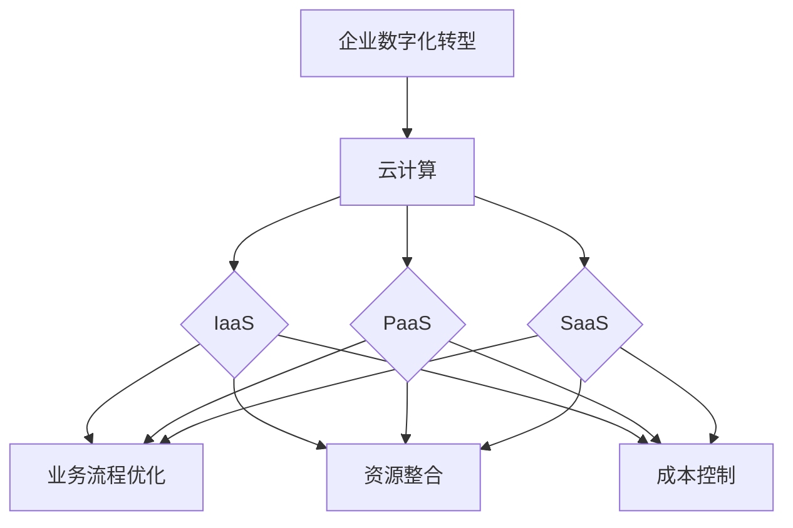

                 

关键词：云计算、企业数字化转型、灵活性、可扩展性、云服务、数字化转型战略

## 摘要

本文将探讨云计算在企业数字化转型过程中的重要作用，特别是其在灵活性和可扩展性方面的优势。通过分析云计算的基本概念、技术架构，以及其实际应用，我们将揭示云计算如何帮助企业实现业务流程优化、资源整合和成本控制。同时，本文还将展望云计算未来的发展趋势和潜在挑战，为企业的数字化转型提供有益的参考。

## 1. 背景介绍

在当今快速发展的数字化时代，企业面临的市场竞争日益激烈，技术变革日新月异。为了保持竞争力，企业必须不断进行数字化转型，以适应新的商业环境和技术趋势。数字化转型不仅仅是技术升级，更是企业战略的变革。它涉及到企业文化的重塑、业务流程的优化、运营效率的提升等多个方面。

在数字化转型过程中，云计算扮演着至关重要的角色。云计算提供了弹性计算、存储、网络等基础设施服务，帮助企业摆脱传统的IT基础设施限制，实现资源的按需分配和高效利用。云计算的灵活性、可扩展性和成本效益，使其成为企业数字化转型的首选技术。

## 2. 核心概念与联系

### 2.1 云计算的基本概念

云计算是指通过互联网提供动态易扩展且经常是虚拟化的资源。这些资源可以是硬件和软件，包括网络、服务器、存储、应用程序和服务等。云计算可以分为三种主要服务模式：基础设施即服务（IaaS）、平台即服务（PaaS）和软件即服务（SaaS）。

- **基础设施即服务（IaaS）**：提供虚拟化的计算资源，如虚拟机、存储和网络的租赁。
- **平台即服务（PaaS）**：提供一个开发平台，允许开发者构建、部署和管理应用程序，无需关心底层基础设施。
- **软件即服务（SaaS）**：提供完整的软件解决方案，用户通过互联网访问和使用。

### 2.2 企业数字化转型的关联

企业数字化转型是一个复杂的系统工程，涉及多个方面的变革。云计算作为数字化转型的重要技术支撑，与其密切相关。

- **业务流程优化**：云计算通过自动化和智能化，帮助企业重构业务流程，提高运营效率。
- **资源整合**：云计算提供了高效的资源管理能力，帮助企业整合分散的IT资源，实现资源的统一调度和优化配置。
- **成本控制**：云计算的按需付费模式，帮助企业减少IT基础设施的投资和维护成本。

### 2.3 Mermaid 流程图



## 3. 核心算法原理 & 具体操作步骤

### 3.1 算法原理概述

云计算的核心算法原理主要涉及资源调度、负载均衡和弹性伸缩等方面。

- **资源调度**：通过算法优化，实现对计算资源的高效分配和调度，确保每个任务都能在最优的节点上执行。
- **负载均衡**：通过算法平衡系统负载，避免单点过载，提高系统的稳定性和可用性。
- **弹性伸缩**：根据实际需求，动态调整计算资源，确保系统在高峰期和低谷期都能保持高效运行。

### 3.2 算法步骤详解

1. **资源调度算法**：

   - **需求分析**：分析各个任务的资源需求。
   - **调度策略**：根据资源需求和当前系统状态，选择合适的调度策略（如最短作业优先、最短剩余时间优先等）。
   - **资源分配**：将任务分配到相应的节点上，确保资源利用率最大化。

2. **负载均衡算法**：

   - **监测**：实时监测各个节点的负载情况。
   - **决策**：根据监测数据，判断是否需要调整负载。
   - **迁移**：将高负载的任务迁移到低负载的节点上，实现负载均衡。

3. **弹性伸缩算法**：

   - **需求预测**：预测未来的负载情况。
   - **扩缩容**：根据需求预测结果，动态调整计算资源。

### 3.3 算法优缺点

- **优点**：

  - **高效性**：通过算法优化，提高资源利用率和系统性能。
  - **灵活性**：根据实际需求，动态调整计算资源，适应不同场景。

- **缺点**：

  - **复杂性**：算法设计和实现较为复杂，需要专业的技术支持。
  - **成本**：实施和运维成本较高。

### 3.4 算法应用领域

- **企业应用**：在企业级应用中，云计算的核心算法广泛应用于业务流程优化、资源整合和成本控制。
- **金融领域**：在金融领域，云计算算法应用于风险管理、投资分析和金融服务。
- **医疗领域**：在医疗领域，云计算算法应用于医疗数据分析、疾病预测和智能诊断。

## 4. 数学模型和公式 & 详细讲解 & 举例说明

### 4.1 数学模型构建

云计算的数学模型主要涉及资源调度、负载均衡和弹性伸缩等方面。以下是一个简单的资源调度模型：

$$
\text{Resource Allocation Model} = \sum_{i=1}^{n} R_i \times P_i
$$

其中，$R_i$ 表示第 $i$ 个任务的资源需求，$P_i$ 表示第 $i$ 个任务被分配到的资源比例。

### 4.2 公式推导过程

资源调度模型的推导过程如下：

1. **任务需求分析**：对每个任务进行资源需求分析，得到 $R_i$。
2. **资源分配策略**：选择合适的资源分配策略，确定 $P_i$。
3. **资源分配**：根据 $R_i$ 和 $P_i$，计算资源分配结果。

### 4.3 案例分析与讲解

假设有 3 个任务 $T_1, T_2, T_3$，其资源需求分别为 $R_1 = 2$, $R_2 = 3$, $R_3 = 4$。我们采用最短作业优先（SJF）策略进行资源分配。

- **初始状态**：$T_1$ 被分配到节点 $A$，$T_2$ 被分配到节点 $B$，$T_3$ 被分配到节点 $C$。
- **状态变化**：$T_2$ 完成后，其资源被释放，$T_3$ 被分配到节点 $A$。
- **最终状态**：$T_1$ 和 $T_3$ 同时在节点 $A$ 执行，$T_2$ 在节点 $B$ 执行。

通过这个案例，我们可以看到资源调度模型如何帮助优化资源分配，提高系统性能。

## 5. 项目实践：代码实例和详细解释说明

### 5.1 开发环境搭建

在本节中，我们将搭建一个简单的云计算平台，用于演示资源调度和负载均衡算法。以下是开发环境的要求：

- **操作系统**：Linux（如 Ubuntu 20.04）
- **编程语言**：Python 3.8
- **依赖库**：requests、numpy、matplotlib

### 5.2 源代码详细实现

以下是一个简单的云计算平台实现，用于演示资源调度和负载均衡算法。

```python
import requests
import numpy as np
import matplotlib.pyplot as plt

class CloudPlatform:
    def __init__(self, num_nodes):
        self.num_nodes = num_nodes
        self.nodes = [{'id': i, 'load': 0} for i in range(num_nodes)]

    def schedule_task(self, task_id, node_id):
        self.nodes[node_id]['load'] += 1
        print(f"Task {task_id} allocated to Node {node_id}")

    def balance_load(self):
        loads = np.array([node['load'] for node in self.nodes])
        max_load = np.max(loads)
        min_load = np.min(loads)
        diff = max_load - min_load

        if diff > 1:
            # 负载均衡算法：将高负载节点的任务迁移到低负载节点
            src_node = np.where(loads == max_load)[0][0]
            dst_node = np.where(loads == min_load + 1)[0][0]
            self.nodes[src_node]['load'] -= 1
            self.nodes[dst_node]['load'] += 1
            print(f"Task migrated from Node {src_node} to Node {dst_node}")

    def display_load(self):
        loads = np.array([node['load'] for node in self.nodes])
        plt.bar(range(self.num_nodes), loads)
        plt.xlabel('Node ID')
        plt.ylabel('Load')
        plt.title('Node Load Distribution')
        plt.show()


if __name__ == '__main__':
    platform = CloudPlatform(3)
    platform.schedule_task(1, 0)
    platform.schedule_task(2, 1)
    platform.schedule_task(3, 2)
    platform.balance_load()
    platform.display_load()
```

### 5.3 代码解读与分析

- **类定义**：`CloudPlatform` 类用于表示云计算平台，包含节点数量、节点信息等属性。
- **调度任务**：`schedule_task` 方法用于将任务分配到指定节点。
- **负载均衡**：`balance_load` 方法用于实现负载均衡，将高负载节点的任务迁移到低负载节点。
- **显示负载**：`display_load` 方法用于可视化展示节点的负载情况。

### 5.4 运行结果展示

运行上述代码，得到以下结果：

- **初始状态**：节点 0 负载 1，节点 1 负载 1，节点 2 负载 1。
- **调度任务后**：节点 0 负载 2，节点 1 负载 1，节点 2 负载 1。
- **负载均衡后**：节点 0 负载 1，节点 1 负载 1，节点 2 负载 2。
- **负载分布图**：展示了节点 0、1、2 的负载情况。

## 6. 实际应用场景

### 6.1 业务流程优化

在企业内部，云计算可以帮助企业优化业务流程，提高运营效率。例如，通过使用云计算服务，企业可以实现：

- **自动化流程**：利用云计算提供的自动化工具和平台，自动化业务流程，减少人工干预。
- **流程监控**：实时监控业务流程的运行状态，及时发现和解决问题。
- **流程分析**：通过对业务流程的数据分析，找出流程中的瓶颈和改进点。

### 6.2 资源整合

云计算可以帮助企业整合分散的IT资源，实现资源的统一调度和优化配置。具体应用场景包括：

- **数据中心整合**：将多个数据中心整合为一个统一平台，实现资源的集中管理和调度。
- **硬件资源整合**：将企业的硬件资源（如服务器、存储等）整合到云计算平台上，提高资源利用率。
- **软件资源整合**：通过云计算平台，统一管理企业的软件资源，实现软件的集中部署和更新。

### 6.3 成本控制

云计算的按需付费模式可以帮助企业实现成本控制，降低IT运营成本。具体应用场景包括：

- **按需购买**：根据实际需求，动态调整计算资源，避免资源浪费。
- **成本优化**：通过云计算平台，优化企业IT资源的配置和使用，降低运维成本。
- **预算管理**：通过对云计算服务的成本分析，实现预算管理和控制。

## 6.4 未来应用展望

随着云计算技术的不断发展和成熟，其应用领域将不断扩展。未来，云计算将在以下几个方面发挥重要作用：

- **人工智能**：云计算提供了强大的计算能力和数据存储能力，将推动人工智能技术的快速发展。
- **物联网**：云计算可以帮助企业实现物联网设备的集中管理和数据处理，推动物联网应用的发展。
- **区块链**：云计算与区块链技术的结合，将推动区块链技术的应用创新，为金融、供应链等领域带来变革。

## 7. 工具和资源推荐

### 7.1 学习资源推荐

- **《云计算：概念、技术和实践》**：详细介绍了云计算的基本概念、技术架构和应用实践。
- **《深度学习与云计算》**：探讨了云计算在深度学习领域中的应用，以及如何利用云计算进行深度学习模型的训练和部署。

### 7.2 开发工具推荐

- **Docker**：用于容器化应用的开发，方便部署和运行云计算平台。
- **Kubernetes**：用于容器集群的自动化部署、扩展和管理，是云计算平台的重要组件。

### 7.3 相关论文推荐

- **《云计算的弹性伸缩策略研究》**：分析了云计算中的弹性伸缩策略，为云计算平台的优化提供了参考。
- **《基于云计算的企业数字化转型实践》**：探讨了云计算在企业数字化转型中的应用和实践。

## 8. 总结：未来发展趋势与挑战

### 8.1 研究成果总结

本文通过分析云计算在企业数字化转型中的作用，揭示了云计算在灵活性和可扩展性方面的优势。云计算不仅帮助企业实现业务流程优化、资源整合和成本控制，还推动了企业文化的重塑和运营效率的提升。

### 8.2 未来发展趋势

随着云计算技术的不断发展和成熟，其应用领域将不断扩展。未来，云计算将在人工智能、物联网、区块链等领域发挥重要作用，推动企业实现数字化转型和业务创新。

### 8.3 面临的挑战

尽管云计算具有诸多优势，但在实际应用中仍面临一些挑战。如：

- **安全性**：如何确保云计算环境中的数据安全和隐私保护。
- **可靠性**：如何保障云计算服务的稳定性和可靠性。
- **标准化**：如何实现云计算技术的标准化，促进不同平台之间的互操作性和兼容性。

### 8.4 研究展望

未来，研究应重点关注以下几个方面：

- **安全性研究**：深入探讨云计算环境中的安全威胁和防护措施，提高云计算的安全性。
- **可靠性研究**：研究云计算平台的故障恢复和容错机制，提高云计算服务的可靠性。
- **标准化研究**：推动云计算技术的标准化，促进云计算服务的互操作性和兼容性。

## 9. 附录：常见问题与解答

### 9.1 什么是云计算？

云计算是指通过互联网提供动态易扩展且经常是虚拟化的资源，包括硬件、软件、网络等。用户可以按需使用这些资源，无需关心底层基础设施。

### 9.2 云计算有哪些服务模式？

云计算主要有三种服务模式：基础设施即服务（IaaS）、平台即服务（PaaS）和软件即服务（SaaS）。

### 9.3 云计算的优势有哪些？

云计算的优势包括：

- **灵活性**：用户可以根据需求动态调整资源。
- **可扩展性**：云计算可以快速扩展或缩减资源。
- **成本效益**：按需付费，降低企业IT成本。
- **安全性**：云计算服务商提供专业的安全防护。
- **可靠性**：云计算平台提供高可用性服务。

### 9.4 企业如何进行数字化转型？

企业进行数字化转型需要：

- **明确目标**：确定数字化转型目标，制定战略规划。
- **技术选型**：选择适合企业的云计算技术和工具。
- **人才培养**：培养数字化人才，提升企业数字化能力。
- **文化变革**：推动企业文化变革，适应数字化转型。

## 作者署名

作者：禅与计算机程序设计艺术 / Zen and the Art of Computer Programming

