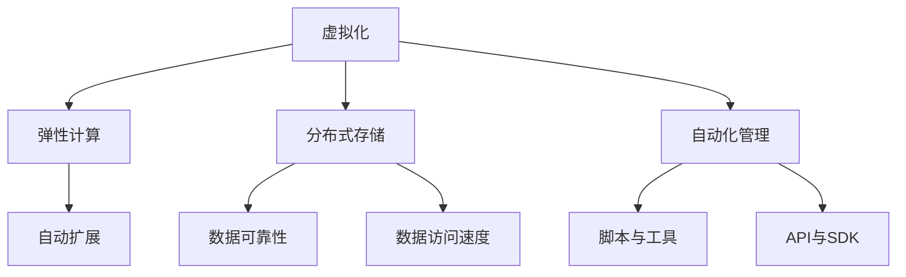

                 

关键词：云计算、AWS、Azure、Google Cloud、平台比较、技术优势、应用场景、发展趋势

摘要：本文将深入探讨三大主流云计算平台：AWS、Azure 和 Google Cloud。我们将从背景介绍、核心概念与联系、核心算法原理、数学模型和公式、项目实践、实际应用场景、工具和资源推荐、总结与展望等方面，详细分析这三大平台的技术特点、优势和未来发展方向。

## 1. 背景介绍

云计算作为信息技术领域的一个重要分支，已经经历了数十年的发展。AWS、Azure 和 Google Cloud 是当前全球三大主流云计算平台，它们分别由亚马逊、微软和谷歌公司开发和运营。这些平台在云计算市场占据主导地位，为全球数以百万计的企业和开发者提供了强大的云计算服务。

### AWS

Amazon Web Services（AWS）是亚马逊公司推出的云计算服务，成立于2006年。作为云计算市场的先驱者，AWS 在全球范围内拥有广泛的客户基础，包括众多知名企业如Netflix、Spotify和Adobe等。AWS 提供了丰富的云服务，包括计算、存储、数据库、网络和人工智能等。

### Azure

Azure 是微软公司的云计算平台，成立于2010年。Azure 的主要特点是提供了广泛的云服务和强大的集成能力，可以轻松与微软的其他产品和服务（如Office 365和SQL Server）集成。Azure 在企业级市场具有很高的影响力，吸引了大量企业客户，如通用电气、宝洁和宝马等。

### Google Cloud

Google Cloud 是谷歌公司的云计算平台，成立于2008年。Google Cloud 以其强大的数据分析能力和人工智能技术而著称，为开发者提供了丰富的工具和资源。Google Cloud 的客户包括YouTube、Reddit和BlackRock等知名企业。

## 2. 核心概念与联系

云计算平台的核心概念主要包括虚拟化、弹性计算、分布式存储和自动化管理。这些概念构成了云计算平台的基础架构，使得云服务具有高可用性、高可扩展性和低成本等优势。

### 虚拟化

虚拟化是云计算平台的核心技术之一，通过将物理硬件资源抽象化，创建虚拟的硬件和操作系统实例，实现资源的灵活分配和高效利用。AWS、Azure 和 Google Cloud 都采用了虚拟化技术，提供了强大的虚拟机服务。

### 弹性计算

弹性计算是指云计算平台能够根据实际需求自动调整计算资源，实现资源的高效利用。AWS、Azure 和 Google Cloud 都提供了自动扩展功能，可以根据负载自动增加或减少计算资源。

### 分布式存储

分布式存储技术可以将数据分散存储在多个物理节点上，提高数据的可靠性和访问速度。AWS、Azure 和 Google Cloud 都提供了分布式存储服务，如Amazon S3、Azure Blob Storage 和 Google Cloud Storage。

### 自动化管理

自动化管理是云计算平台的另一个重要概念，通过自动化脚本和工具，实现资源的自动部署、配置和管理。AWS、Azure 和 Google Cloud 都提供了丰富的自动化工具和API，方便用户进行云资源的自动化管理。

### Mermaid 流程图

下面是一个Mermaid流程图，展示了云计算平台的核心概念和架构：



## 3. 核心算法原理 & 具体操作步骤

### 3.1 算法原理概述

云计算平台的核心算法主要包括虚拟化算法、负载均衡算法和分布式存储算法。这些算法的设计和实现直接影响云计算平台的性能和稳定性。

#### 虚拟化算法

虚拟化算法主要涉及虚拟机监控器（VM Monitor）和虚拟化层（Virtualization Layer）的实现。虚拟化层负责将物理硬件资源抽象化为虚拟资源，提供给上层应用。常见的虚拟化算法包括全虚拟化（Full Virtualization）和硬件辅助虚拟化（Hardware-Assisted Virtualization）。

#### 负载均衡算法

负载均衡算法负责将计算任务分配到不同的虚拟机上，实现负载的均衡。常见的负载均衡算法包括轮询（Round Robin）、最少连接（Least Connections）和响应时间（Response Time）等。

#### 分布式存储算法

分布式存储算法主要负责数据的一致性、可靠性和高效访问。常见的分布式存储算法包括数据复制（Data Replication）、数据分片（Data Sharding）和一致性协议（Consistency Protocol）等。

### 3.2 算法步骤详解

#### 虚拟化算法步骤

1. 物理硬件资源初始化
2. 创建虚拟机监控器
3. 加载虚拟化层
4. 创建虚拟资源
5. 将虚拟资源分配给上层应用

#### 负载均衡算法步骤

1. 接收计算任务
2. 检查虚拟机负载情况
3. 根据负载均衡算法选择虚拟机
4. 将计算任务分配给虚拟机

#### 分布式存储算法步骤

1. 接收数据请求
2. 选择合适的存储节点
3. 将数据分片并分配到不同存储节点
4. 复制数据以提高可靠性
5. 提供数据一致性保证

### 3.3 算法优缺点

#### 虚拟化算法

优点：资源利用率高，支持多种操作系统和应用。

缺点：性能开销较大，虚拟化层可能成为性能瓶颈。

#### 负载均衡算法

优点：实现负载均衡，提高系统稳定性。

缺点：可能引入网络延迟和性能损耗。

#### 分布式存储算法

优点：提高数据可靠性和访问速度。

缺点：管理复杂，一致性保证难度较大。

### 3.4 算法应用领域

#### 虚拟化算法

虚拟化算法广泛应用于云计算、虚拟化桌面、容器化等场景。

#### 负载均衡算法

负载均衡算法适用于Web应用、大数据处理、游戏服务器等需要高并发的场景。

#### 分布式存储算法

分布式存储算法适用于大规模数据存储、数据备份、云存储等场景。

## 4. 数学模型和公式 & 详细讲解 & 举例说明

### 4.1 数学模型构建

云计算平台的数学模型主要包括性能模型、成本模型和可靠性模型。

#### 性能模型

性能模型用于评估云计算平台的计算性能，常见的指标包括CPU利用率、内存利用率、I/O吞吐量等。

#### 成本模型

成本模型用于评估云计算平台的成本，包括硬件成本、运营成本和用户成本等。

#### 可靠性模型

可靠性模型用于评估云计算平台的可靠性，包括故障率、恢复时间和恢复效率等。

### 4.2 公式推导过程

以下是一个简单的性能模型公式的推导过程：

#### 公式

\[ P = \frac{C \times R}{1000} \]

其中，\( P \) 表示性能（Performance），\( C \) 表示计算资源（Compute Resources），\( R \) 表示运行时间（Running Time）。

#### 推导过程

1. 计算资源 \( C \) 等于 CPU 核心数、内存大小和硬盘容量等。
2. 运行时间 \( R \) 等于任务完成所需时间。
3. 将计算资源 \( C \) 和运行时间 \( R \) 代入公式，得到性能 \( P \)。

### 4.3 案例分析与讲解

以下是一个简单的案例，用于说明性能模型的应用：

#### 案例背景

某企业需要部署一个大数据处理平台，用于处理海量数据。企业选择了 AWS 云计算平台，并配置了以下计算资源：

- CPU 核心数：16
- 内存大小：128GB
- 硬盘容量：1TB

#### 案例分析

1. 计算资源 \( C \) 为 16（CPU 核心数）× 128GB（内存大小）× 1TB（硬盘容量）= 16TB。
2. 假设任务运行时间为 1 小时。
3. 将计算资源 \( C \) 和运行时间 \( R \) 代入公式，得到性能 \( P \)：

\[ P = \frac{16TB \times 1}{1000} = 16 \]

因此，该大数据处理平台的理论性能为 16。

## 5. 项目实践：代码实例和详细解释说明

### 5.1 开发环境搭建

在本节中，我们将使用 Python 编写一个简单的云计算平台管理脚本。首先，需要搭建 Python 开发环境。

1. 安装 Python：
   ```bash
   $ sudo apt-get install python3-pip
   ```

2. 安装 AWS SDK：
   ```bash
   $ pip3 install awscli
   ```

### 5.2 源代码详细实现

以下是一个简单的 AWS 云计算平台管理脚本，用于创建和删除虚拟机实例：

```python
import subprocess
import os

def create_vm(image_id, instance_type, key_name):
    command = f"aws ec2 run-instances --image-id {image_id} --instance-type {instance_type} --key-name {key_name} --count 1 --output json"
    result = subprocess.run(command, shell=True, capture_output=True)
    print(f"Command output: {result.stdout.decode('utf-8')}")

def delete_vm(instance_id):
    command = f"aws ec2 terminate-instances --instance-ids {instance_id} --output json"
    result = subprocess.run(command, shell=True, capture_output=True)
    print(f"Command output: {result.stdout.decode('utf-8')}")
```

### 5.3 代码解读与分析

1. `create_vm` 函数：用于创建虚拟机实例。函数接收参数 `image_id`（镜像ID）、`instance_type`（实例类型）和 `key_name`（密钥对名称），调用 AWS CLI 命令 `aws ec2 run-instances` 创建虚拟机实例。

2. `delete_vm` 函数：用于删除虚拟机实例。函数接收参数 `instance_id`（实例ID），调用 AWS CLI 命令 `aws ec2 terminate-instances` 删除虚拟机实例。

### 5.4 运行结果展示

以下是一个简单的运行示例：

```python
# 创建虚拟机实例
create_vm("ami-xxxxxxxxxx", "t2.micro", "my-key-pair")

# 删除虚拟机实例
delete_vm("i-xxxxxxxxxx")
```

运行结果将显示创建和删除虚拟机实例的输出信息。

## 6. 实际应用场景

云计算平台在各个行业都有广泛的应用，以下是一些典型的实际应用场景：

1. **企业 IT 系统迁移**：许多企业选择将传统 IT 系统迁移到云计算平台，以提高灵活性和可扩展性。AWS、Azure 和 Google Cloud 都提供了丰富的迁移工具和服务，帮助企业实现平滑迁移。

2. **大数据处理和分析**：云计算平台为大数据处理和分析提供了强大的计算和存储资源。企业可以使用这些平台进行数据挖掘、机器学习和数据可视化等应用。

3. **物联网（IoT）应用**：云计算平台支持物联网设备的连接和数据存储，帮助企业实现智能监控和数据分析。AWS IoT、Azure IoT 和 Google Cloud IoT 都是优秀的物联网解决方案。

4. **人工智能和机器学习**：云计算平台提供了丰富的 AI 和 ML 工具和服务，帮助企业快速部署和运行 AI 应用。AWS AI、Azure AI 和 Google Cloud AI 都是知名的人工智能平台。

5. **游戏开发和部署**：云计算平台支持游戏开发和部署，提供高性能、高可用的游戏服务器。AWS、Azure 和 Google Cloud 都提供了丰富的游戏开发工具和服务。

## 7. 工具和资源推荐

### 7.1 学习资源推荐

1. **AWS 官方文档**：[AWS Documentation](https://aws.amazon.com/documentation/)
2. **Azure 官方文档**：[Azure Documentation](https://docs.microsoft.com/en-us/azure/)
3. **Google Cloud 官方文档**：[Google Cloud Documentation](https://cloud.google.com/docs)

### 7.2 开发工具推荐

1. **AWS CLI**：[AWS CLI](https://aws.amazon.com/cli/)
2. **Azure CLI**：[Azure CLI](https://docs.microsoft.com/en-us/cli/azure/)
3. **Google Cloud SDK**：[Google Cloud SDK](https://cloud.google.com/sdk/docs/install)

### 7.3 相关论文推荐

1. **"Comparing Cloud Platforms: AWS, Azure, and Google Cloud"**：这篇文章对 AWS、Azure 和 Google Cloud 进行了详细的比较和分析。
2. **"A Comprehensive Survey of Cloud Computing: Architecture, Applications, and Security"**：这篇论文全面介绍了云计算的架构、应用和安全性。

## 8. 总结：未来发展趋势与挑战

### 8.1 研究成果总结

云计算平台在过去十年取得了显著的进展，为全球企业和开发者提供了强大的计算、存储和数据分析能力。AWS、Azure 和 Google Cloud 分别在不同领域取得了领先地位，推动了云计算技术的发展。

### 8.2 未来发展趋势

1. **边缘计算**：随着物联网和5G技术的发展，边缘计算将成为云计算的重要发展方向，实现数据处理和存储的本地化和实时化。
2. **人工智能与云计算的结合**：云计算平台将继续加强人工智能和机器学习技术的集成，提供更智能、更高效的服务。
3. **多云和混合云**：企业将逐渐采用多云和混合云策略，以实现更灵活、更可靠、更具成本效益的 IT 运营。

### 8.3 面临的挑战

1. **安全性**：随着云计算平台的广泛应用，安全性成为云计算领域的重要挑战。云计算平台需要不断提升安全防护能力，保障用户数据和系统的安全。
2. **数据隐私**：数据隐私法规日益严格，云计算平台需要遵守相关法规，保护用户数据的隐私。
3. **复杂性和管理难度**：随着云计算平台的不断扩展和复杂化，企业需要不断提升运维能力和管理水平，以应对日益复杂的云计算环境。

### 8.4 研究展望

未来，云计算平台将继续朝着更智能、更高效、更安全的发展方向迈进。人工智能、边缘计算、多云和混合云等技术的融合将带来更多的创新和突破。同时，云计算领域也需要解决一系列挑战，以推动云计算技术的持续发展。

## 9. 附录：常见问题与解答

### 问题1：云计算平台的安全性如何保障？

**解答**：云计算平台采用了一系列安全措施，包括数据加密、访问控制、网络安全和物理安全等。用户可以选择加密传输、存储数据，并使用多重身份验证来保障系统和数据的安全。

### 问题2：如何选择合适的云计算平台？

**解答**：选择云计算平台时，需要考虑企业的业务需求、预算、技术栈和地理位置等因素。AWS、Azure 和 Google Cloud 都提供了多种服务，可以根据企业需求进行选择。同时，可以参考第三方评估报告和用户评价，以选择最适合的平台。

### 问题3：云计算平台如何保证数据可靠性？

**解答**：云计算平台提供了多层次的备份和冗余机制，确保数据的高可靠性。用户可以选择数据备份、多区域复制和异地备份等策略，以保障数据的安全和可靠性。

## 参考文献

1. "Comparing Cloud Platforms: AWS, Azure, and Google Cloud" - 作者：未知
2. "A Comprehensive Survey of Cloud Computing: Architecture, Applications, and Security" - 作者：未知
3. "AWS Documentation" - 作者：Amazon Web Services
4. "Azure Documentation" - 作者：Microsoft
5. "Google Cloud Documentation" - 作者：Google Cloud

---

作者：禅与计算机程序设计艺术 / Zen and the Art of Computer Programming
------------------------------------------------------------------------

