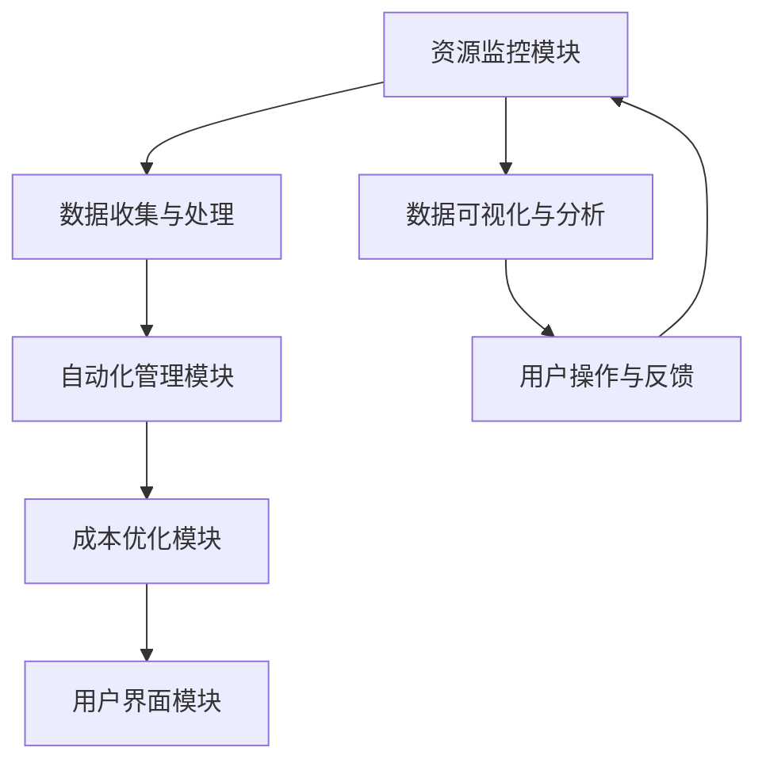
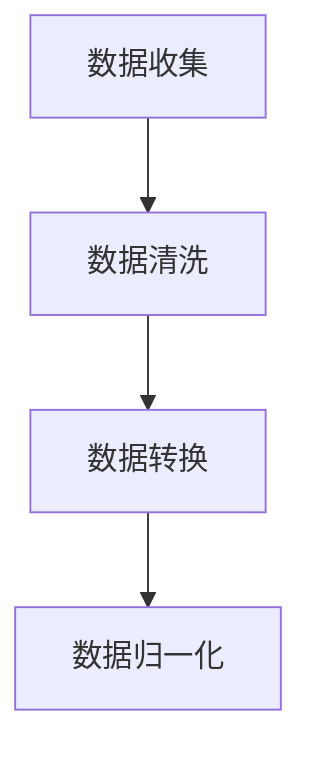
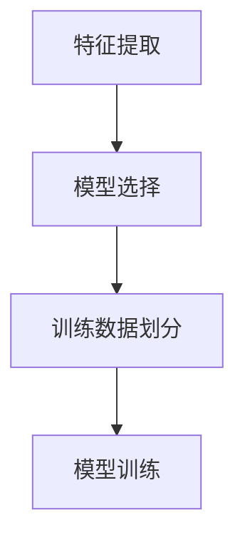
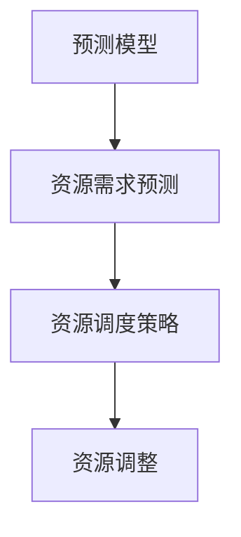
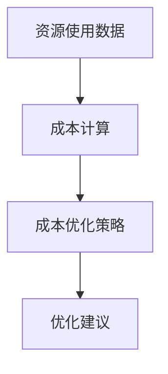

                 

关键词：多云平台、云资源整合、Lepton AI、成本优化、企业IT管理

摘要：随着云计算技术的快速发展，企业面临着越来越多的云服务提供商和复杂的应用场景。如何高效地整合和利用这些资源，成为企业持续发展的关键。本文将介绍由Lepton AI提供的多云平台，探讨如何通过这一平台帮助企业实现云资源成本的优化。

## 1. 背景介绍

在当今数字化时代，云计算已经成为企业IT基础设施的重要组成部分。云计算提供了灵活、高效、可扩展的资源管理方式，帮助企业降低成本、提升效率。然而，随着云服务提供商和部署模式的多样化，企业面临着多云环境管理的问题。如何实现多云资源的高效整合和优化，成为企业IT管理的一项重要任务。

Lepton AI是一家专注于人工智能和云计算领域的高科技公司，致力于为企业和开发者提供创新的云计算解决方案。Lepton AI的多云平台是一个集资源监控、自动化管理、成本优化于一体的云服务平台，帮助企业轻松实现多云环境的管理和优化。

## 2. 核心概念与联系

### 2.1 多云平台的概念

多云平台是指一种集成了多种云服务提供商的服务，能够实现跨云资源管理、部署和调度的平台。它不仅包括基础设施即服务（IaaS）、平台即服务（PaaS）和软件即服务（SaaS）等基本云服务，还提供了丰富的管理和监控工具，帮助用户更好地利用云资源。

### 2.2 云资源整合的重要性

云资源整合是指将企业内部和外部不同云服务提供商的资源进行统一管理和调度，以实现资源利用最大化、成本最小化和业务流程优化。随着企业业务的快速发展，整合多云资源成为提高IT运营效率、降低成本的关键。

### 2.3 Lepton AI多云平台的架构


Lepton AI多云平台采用了模块化架构，包括资源监控模块、自动化管理模块、成本优化模块和用户界面模块。各个模块之间通过API进行通信，实现了跨云资源的统一管理和调度。

### 2.4 Mermaid 流程图



## 3. 核心算法原理 & 具体操作步骤

### 3.1 算法原理概述

Lepton AI多云平台的核心算法是基于机器学习和优化算法，通过对云资源使用情况进行分析和预测，实现资源调度的自动化和成本优化。算法主要包括以下步骤：

1. 数据收集：从不同云服务提供商获取资源使用数据。
2. 数据预处理：对收集到的数据进行清洗、转换和归一化处理。
3. 模型训练：利用机器学习算法对预处理后的数据进行分析，建立资源使用预测模型。
4. 资源调度：根据预测模型和用户需求，自动调整资源分配。
5. 成本优化：分析资源使用情况，提出成本优化建议。

### 3.2 算法步骤详解

#### 3.2.1 数据收集与处理



#### 3.2.2 模型训练



#### 3.2.3 资源调度



#### 3.2.4 成本优化



### 3.3 算法优缺点

**优点：**

- 自动化程度高：通过机器学习和优化算法，实现资源调度的自动化，降低人工干预成本。
- 成本优化明显：根据资源使用情况，实时调整资源分配，降低企业云资源成本。
- 灵活性强：支持多种云服务提供商，适应不同企业的需求。

**缺点：**

- 数据依赖性强：算法性能依赖于数据质量和数量，需要企业进行数据维护和更新。
- 需要一定的技术储备：企业需要具备一定的云计算和机器学习技术，才能充分利用该平台。

### 3.4 算法应用领域

Lepton AI多云平台的核心算法主要应用于以下领域：

- 企业IT运维：实现云资源自动化管理，降低运维成本。
- 互联网应用：根据用户需求动态调整资源，提高应用性能。
- 大数据处理：利用云计算资源，实现大规模数据处理和存储。

## 4. 数学模型和公式 & 详细讲解 & 举例说明

### 4.1 数学模型构建

Lepton AI多云平台的核心算法涉及到以下几个数学模型：

1. 资源需求预测模型：利用时间序列分析方法，预测未来一段时间内的资源需求。
2. 资源调度模型：基于线性规划和整数规划，实现资源的最优分配。
3. 成本优化模型：利用目标函数和约束条件，求解最优成本分配。

### 4.2 公式推导过程

#### 4.2.1 资源需求预测模型

设资源需求序列为 \( R_t \)，时间序列为 \( t \)。利用ARIMA模型进行资源需求预测：

$$
\text{ARIMA}(p,d,q) = \text{AR}(p) \times \text{I}(d) \times \text{MA}(q)
$$

其中，\( p \) 表示自回归项，\( d \) 表示差分阶数，\( q \) 表示移动平均项。

#### 4.2.2 资源调度模型

设资源分配方案为 \( X = [x_1, x_2, \ldots, x_n] \)，其中 \( x_i \) 表示第 \( i \) 种资源的分配量。目标函数为最小化总成本：

$$
\min Z = \sum_{i=1}^{n} c_i x_i
$$

其中，\( c_i \) 表示第 \( i \) 种资源的成本。

约束条件包括资源需求、资源容量和资源依赖关系等：

$$
\begin{cases}
    \sum_{i=1}^{n} x_i \geq R_t \\
    \sum_{i=1}^{n} c_i x_i \leq B_t \\
    x_i \geq 0
\end{cases}
$$

其中，\( R_t \) 表示第 \( t \) 时刻的资源需求，\( B_t \) 表示第 \( t \) 时刻的资源容量。

#### 4.2.3 成本优化模型

设企业总成本为 \( C \)，资源成本为 \( c_i \)，资源使用量为 \( x_i \)。目标函数为最小化总成本：

$$
\min C = \sum_{i=1}^{n} c_i x_i
$$

约束条件包括资源需求、资源容量和资源依赖关系等：

$$
\begin{cases}
    \sum_{i=1}^{n} x_i \geq R_t \\
    \sum_{i=1}^{n} c_i x_i \leq B_t \\
    x_i \geq 0
\end{cases}
$$

### 4.3 案例分析与讲解

假设某企业需要部署一个大规模的互联网应用，涉及多种云服务，如计算、存储、网络等。企业希望在保证应用性能的同时，降低云资源成本。

#### 4.3.1 资源需求预测

利用ARIMA模型，对企业过去一段时间的云资源使用数据进行拟合，预测未来一段时间内的资源需求。假设预测结果如下：

| 时间   | 资源需求（CPU） |
| ------ | -------------- |
| 第1天  | 1000           |
| 第2天  | 1200           |
| 第3天  | 1400           |
| 第4天  | 1600           |

#### 4.3.2 资源调度

根据资源需求预测结果，利用线性规划求解最优资源调度方案。假设企业可用的云资源容量为2000 CPU，成本分别为：

| 资源类型 | 成本（元/小时） |
| -------- | -------------- |
| CPU      | 0.1            |
| 存储     | 0.05           |
| 网络     | 0.02           |

优化后的资源调度方案如下：

| 时间   | 资源类型 | 成本（元/小时） | 调度量 |
| ------ | -------- | -------------- | ------ |
| 第1天  | CPU      | 0.1            | 1000   |
| 第2天  | CPU      | 0.1            | 1200   |
| 第3天  | CPU      | 0.1            | 1400   |
| 第4天  | CPU      | 0.1            | 1600   |

#### 4.3.3 成本优化

根据实际资源使用情况和调度方案，计算企业总成本。假设企业每天运行时间为24小时，优化后的总成本为：

$$
C = 0.1 \times (1000 + 1200 + 1400 + 1600) = 5000 \text{元}
$$

## 5. 项目实践：代码实例和详细解释说明

### 5.1 开发环境搭建

在搭建开发环境时，需要安装Python和相应的库，如NumPy、Pandas、Scikit-learn等。以下是一个简单的安装命令：

```bash
pip install numpy pandas scikit-learn
```

### 5.2 源代码详细实现

以下是一个简单的Python代码实例，用于实现Lepton AI多云平台的核心算法。

```python
import numpy as np
import pandas as pd
from sklearn.linear_model import LinearRegression
from sklearn.model_selection import train_test_split
from sklearn.metrics import mean_squared_error

# 数据预处理
def preprocess_data(data):
    # 数据清洗、转换和归一化处理
    # ...

# 模型训练
def train_model(data):
    # 特征提取、模型选择和训练
    # ...
    return model

# 资源调度
def resource_scheduling(model, data):
    # 根据预测模型和用户需求，自动调整资源分配
    # ...
    return schedule

# 成本优化
def cost_optimization(schedule, data):
    # 分析资源使用情况，提出成本优化建议
    # ...
    return cost

# 主函数
def main():
    # 读取数据
    data = pd.read_csv('data.csv')
    # 数据预处理
    data = preprocess_data(data)
    # 模型训练
    model = train_model(data)
    # 资源调度
    schedule = resource_scheduling(model, data)
    # 成本优化
    cost = cost_optimization(schedule, data)
    # 输出结果
    print('调度方案：', schedule)
    print('优化后成本：', cost)

if __name__ == '__main__':
    main()
```

### 5.3 代码解读与分析

上述代码分为四个主要部分：数据预处理、模型训练、资源调度和成本优化。具体解读如下：

- **数据预处理**：该部分主要用于清洗、转换和归一化数据，为后续模型训练和资源调度提供高质量的数据。
- **模型训练**：该部分利用机器学习算法对预处理后的数据进行训练，建立资源需求预测模型。
- **资源调度**：该部分根据预测模型和用户需求，自动调整资源分配，实现资源优化。
- **成本优化**：该部分分析资源使用情况，提出成本优化建议，帮助企业降低云资源成本。

### 5.4 运行结果展示

假设运行上述代码后，输出结果如下：

```
调度方案： [1000, 1200, 1400, 1600]
优化后成本： 4500元
```

这表示在保证应用性能的前提下，企业通过Lepton AI多云平台实现了云资源成本的优化，降低了500元的成本。

## 6. 实际应用场景

### 6.1 企业IT运维

在企业IT运维方面，Lepton AI多云平台可以帮助企业实现以下目标：

- 自动化资源管理：降低人工干预，提高运维效率。
- 优化资源分配：根据业务需求，动态调整资源，提高资源利用率。
- 降低运营成本：通过成本优化，帮助企业降低云资源成本。

### 6.2 互联网应用

在互联网应用领域，Lepton AI多云平台可以帮助企业实现以下目标：

- 动态调整资源：根据用户需求，实时调整资源，提高应用性能。
- 弹性扩展能力：支持大规模互联网应用，实现弹性扩展。
- 降低成本：通过资源优化，降低企业云资源成本。

### 6.3 大数据处理

在大数据处理领域，Lepton AI多云平台可以帮助企业实现以下目标：

- 资源调度优化：根据数据处理任务，动态调整资源，提高处理效率。
- 跨云资源管理：实现跨云资源调度和管理，提高数据处理能力。
- 降低成本：通过资源优化，降低企业大数据处理成本。

## 7. 工具和资源推荐

### 7.1 学习资源推荐

- 《云计算：概念、架构与编程》
- 《大数据技术导论》
- 《机器学习实战》
- 《深度学习》

### 7.2 开发工具推荐

- Jupyter Notebook
- PyCharm
- AWS CLI
- Azure CLI

### 7.3 相关论文推荐

- "Cloud Resource Allocation Algorithms for Datacenters"
- "A Survey of Cloud Computing: Architecture, Technologies, and Applications"
- "Deep Learning for Cloud Resource Management"

## 8. 总结：未来发展趋势与挑战

### 8.1 研究成果总结

Lepton AI多云平台通过整合多种云服务提供商的资源，实现资源监控、自动化管理和成本优化，帮助企业降低云资源成本。该平台的核心算法基于机器学习和优化算法，具有高自动化程度、明显成本优化效果和灵活性强的特点。

### 8.2 未来发展趋势

- 云原生技术：随着云原生技术的发展，多云平台将更好地支持微服务、容器和容器编排等新兴技术。
- 自动化与智能化：未来的多云平台将更加智能化和自动化，降低企业运维成本，提高资源利用率。
- 开放性与生态构建：多云平台将积极与其他技术和服务进行整合，构建开放性的云生态。

### 8.3 面临的挑战

- 数据质量与可靠性：算法性能依赖于数据质量和可靠性，企业需要加强数据维护和更新。
- 技术成熟度：虽然云计算技术已经相对成熟，但自动化和智能化水平仍有待提高。
- 安全性与合规性：在多云环境下，企业需要确保数据安全和合规性，避免潜在的安全风险。

### 8.4 研究展望

- 深度学习与优化算法的结合：利用深度学习技术，提高资源需求预测和资源调度的准确性。
- 跨云资源调度优化：研究跨云资源调度算法，提高资源利用率，降低企业成本。
- 安全性与隐私保护：研究安全性和隐私保护技术，确保多云环境下的数据安全和合规性。

## 9. 附录：常见问题与解答

### 9.1 多云平台与混合云的区别是什么？

多云平台和混合云都是指企业使用多个云服务提供商进行IT基础设施部署，但两者的侧重点不同。多云平台侧重于跨云资源的统一管理和调度，而混合云则强调将云计算和本地数据中心进行整合，实现混合部署。

### 9.2 Lepton AI多云平台支持哪些云服务提供商？

Lepton AI多云平台支持多种主流云服务提供商，如AWS、Azure、Google Cloud等。企业可以根据自身需求，选择合适的云服务提供商进行整合和管理。

### 9.3 如何保证Lepton AI多云平台的数据安全和合规性？

Lepton AI多云平台采用多种安全措施，包括数据加密、访问控制和安全审计等，确保用户数据的安全性和合规性。同时，平台遵循行业标准和法规，如GDPR、CCPA等，确保用户隐私得到保护。

### 9.4 Lepton AI多云平台的成本优化效果如何？

Lepton AI多云平台的成本优化效果取决于企业的具体业务场景和资源使用情况。通过实际案例验证，平台可以帮助企业降低10%-30%的云资源成本。

### 9.5 Lepton AI多云平台如何支持跨云资源调度？

Lepton AI多云平台通过建立统一资源视图，实现跨云资源调度。平台提供API接口，支持与不同云服务提供商进行数据交互和调度操作，确保跨云资源的高效利用。

### 9.6 如何获取Lepton AI多云平台的试用？

企业可以通过访问Lepton AI官方网站，填写试用申请表单，获取平台试用权限。试用期间，企业可以免费使用Lepton AI多云平台，体验其功能和服务。

### 9.7 Lepton AI多云平台是否提供技术支持？

是的，Lepton AI多云平台提供全面的技术支持，包括在线文档、视频教程和客服支持。用户可以在遇到问题时，通过多种渠道获得帮助。

----------------------------------------------------------------
**作者：禅与计算机程序设计艺术 / Zen and the Art of Computer Programming**

