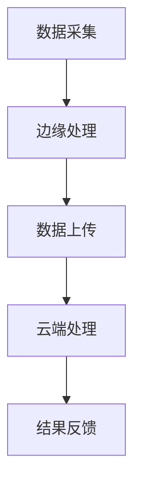

                 

关键词：云边协同计算、分布式AI、系统性能优化、数据处理、算法优化、资源调度

## 摘要

本文探讨了云边协同计算在优化分布式AI系统性能方面的应用。随着人工智能技术的不断发展，分布式AI系统在处理海量数据、实现高效计算方面发挥着越来越重要的作用。然而，如何有效利用云边资源，实现协同计算，从而提升系统性能，成为了当前研究的热点问题。本文首先介绍了云边协同计算的基本概念和架构，然后深入分析了分布式AI系统在性能优化方面的挑战，并提出了相应的解决策略。通过实际案例分析和数学模型的构建，本文为分布式AI系统的性能优化提供了有价值的参考。

## 1. 背景介绍

随着大数据和云计算技术的不断成熟，人工智能（AI）已经成为现代信息技术的重要发展方向。分布式AI系统通过将计算任务分布在多个节点上，能够实现大规模的数据处理和高效计算。然而，随着数据量的急剧增加和计算需求的不断提升，分布式AI系统面临着巨大的性能压力。为了解决这一问题，云边协同计算应运而生。

### 云边协同计算的概念

云边协同计算是指通过云计算和边缘计算的结合，实现资源的共享和协同，以优化系统性能的一种计算模式。云计算提供了强大的计算能力和存储资源，可以处理大规模的数据和复杂的计算任务。而边缘计算则靠近数据源，能够快速处理和分析实时数据，降低延迟和带宽压力。

### 云边协同计算的架构

云边协同计算的架构可以分为三个层次：云端、边缘端和终端。云端负责大规模数据处理和存储，提供计算资源和服务；边缘端负责实时数据处理和初步分析，为云端提供数据预处理和优化服务；终端则包括各种智能设备，如智能手机、智能家居设备等，负责数据的采集和上传。

## 2. 核心概念与联系

### 分布式AI系统

分布式AI系统是指将AI计算任务分布在多个节点上，通过并行计算和分布式算法实现高效处理的一种系统。分布式AI系统主要包括以下几个方面：

- **计算节点**：分布式AI系统中的计算节点可以是物理服务器、虚拟机或者容器等，负责执行计算任务。
- **数据存储**：分布式AI系统需要高效的数据存储机制，如分布式文件系统、数据库等。
- **通信网络**：分布式AI系统需要可靠的通信网络，以确保节点之间的数据传输和协同工作。
- **调度和管理**：分布式AI系统需要有效的调度和管理机制，以优化资源利用和任务执行。

### 云边协同计算与分布式AI系统的关系

云边协同计算与分布式AI系统之间存在着紧密的联系。云边协同计算提供了分布式AI系统所需的计算资源和通信网络，使得分布式AI系统能够更好地利用云资源和边缘资源，实现高效计算。同时，分布式AI系统通过云边协同计算，可以更好地应对大规模数据和高性能计算的需求。

### Mermaid流程图



在这个流程图中，A表示数据采集，B表示边缘处理，C表示数据上传，D表示云端处理，E表示结果反馈。这个流程图展示了云边协同计算在分布式AI系统中的基本工作流程。

## 3. 核心算法原理 & 具体操作步骤

### 3.1 算法原理概述

云边协同计算的核心算法主要包括以下几个方面：

- **数据分割与传输**：根据计算任务的需求，将数据分割成多个部分，并通过边缘端和云端进行传输。
- **任务调度与分配**：根据节点的计算能力和数据依赖关系，对计算任务进行调度和分配。
- **并行计算与优化**：在多个节点上并行执行计算任务，并通过优化算法提升系统性能。
- **结果聚合与反馈**：将多个节点的计算结果进行聚合，并生成最终的输出结果。

### 3.2 算法步骤详解

#### 3.2.1 数据分割与传输

1. **数据预处理**：对原始数据进行预处理，如清洗、归一化等操作，以提高数据质量。
2. **数据分割**：根据计算任务的需求，将预处理后的数据分割成多个部分。
3. **数据传输**：通过边缘端和云端的数据传输机制，将分割后的数据传输到相应的节点。

#### 3.2.2 任务调度与分配

1. **节点状态监控**：实时监控节点的状态，如CPU使用率、内存使用率等。
2. **任务调度策略**：根据节点的状态和计算任务的需求，选择合适的调度策略，如负载均衡、最小完成时间等。
3. **任务分配**：将计算任务分配到合适的节点，并设置任务执行的优先级。

#### 3.2.3 并行计算与优化

1. **并行计算**：在多个节点上并行执行计算任务，通过并行算法提升计算效率。
2. **数据同步**：在计算过程中，确保数据的一致性和可靠性，通过同步机制减少数据冲突。
3. **性能优化**：通过优化算法，如并行算法、分布式算法等，提升系统性能。

#### 3.2.4 结果聚合与反馈

1. **结果收集**：将多个节点的计算结果进行收集和聚合。
2. **结果反馈**：根据计算结果生成最终的输出结果，并通过反馈机制调整计算任务。

### 3.3 算法优缺点

#### 优点

- **高效计算**：通过并行计算和优化算法，提升系统性能，实现高效计算。
- **资源利用**：充分利用云资源和边缘资源，提高资源利用率。
- **灵活部署**：可以根据实际需求，灵活调整计算任务的分配和执行。

#### 缺点

- **复杂性**：需要复杂的调度和管理机制，实现起来较为复杂。
- **数据传输开销**：数据在边缘端和云端之间的传输可能带来额外的开销。

### 3.4 算法应用领域

- **智能城市**：通过云边协同计算，实现对城市实时数据的处理和分析，如交通流量监控、环境监测等。
- **智能制造**：通过云边协同计算，实现对生产数据的实时处理和分析，如设备故障预测、生产优化等。
- **智能医疗**：通过云边协同计算，实现对医疗数据的实时处理和分析，如疾病预测、医疗诊断等。

## 4. 数学模型和公式 & 详细讲解 & 举例说明

### 4.1 数学模型构建

在云边协同计算中，我们主要关注以下几个方面的数学模型：

1. **任务调度模型**：根据节点的状态和计算任务的需求，选择合适的调度策略，如最小完成时间、最小负载等。
2. **数据传输模型**：分析数据在边缘端和云端之间的传输开销，建立数据传输模型。
3. **性能优化模型**：通过优化算法，如并行算法、分布式算法等，建立性能优化模型。

### 4.2 公式推导过程

#### 4.2.1 任务调度模型

假设有n个计算任务，需要分配到m个节点上，每个节点具有不同的计算能力。任务调度模型的目标是选择合适的调度策略，使得任务完成时间最短。

- **最小完成时间模型**：

    $$T_{\text{min}} = \min(T_1, T_2, ..., T_n)$$

    其中，$T_i$表示第i个任务的完成时间。

- **最小负载模型**：

    $$L_{\text{min}} = \min(L_1, L_2, ..., L_m)$$

    其中，$L_i$表示第i个节点的负载。

#### 4.2.2 数据传输模型

假设数据在边缘端和云端之间的传输时间为$t$，数据传输带宽为$B$，数据总量为$D$。

- **数据传输时间模型**：

    $$T_{\text{transfer}} = \frac{D}{B}$$

- **数据传输开销模型**：

    $$C_{\text{transfer}} = T_{\text{transfer}} \times t$$

### 4.3 案例分析与讲解

#### 案例背景

假设有一个分布式AI系统，需要处理一个包含100个计算任务的数据集。系统中有10个节点，其中5个节点位于云端，5个节点位于边缘端。任务调度模型采用最小完成时间模型，数据传输模型采用数据传输时间模型。

#### 案例分析

1. **任务调度**：

    - **最小完成时间模型**：

        $$T_{\text{min}} = \min(T_1, T_2, ..., T_{100})$$

        假设任务完成时间分别为 $T_1 = 10$, $T_2 = 20$, ..., $T_{100} = 100$。

        $$T_{\text{min}} = \min(10, 20, ..., 100) = 10$$

    - **最小负载模型**：

        $$L_{\text{min}} = \min(L_1, L_2, ..., L_{10})$$

        假设节点负载分别为 $L_1 = 30$, $L_2 = 40$, ..., $L_{10} = 50$。

        $$L_{\text{min}} = \min(30, 40, ..., 50) = 30$$

2. **数据传输**：

    - **数据传输时间模型**：

        $$T_{\text{transfer}} = \frac{D}{B}$$

        假设数据总量为$D = 1000$，数据传输带宽为$B = 100$。

        $$T_{\text{transfer}} = \frac{1000}{100} = 10$$

    - **数据传输开销模型**：

        $$C_{\text{transfer}} = T_{\text{transfer}} \times t$$

        假设数据传输时间为$t = 1$。

        $$C_{\text{transfer}} = 10 \times 1 = 10$$

#### 案例讲解

通过以上分析，我们可以得出以下结论：

- **最小完成时间模型**使得任务完成时间最短，为10。
- **最小负载模型**使得节点负载最小，为30。
- **数据传输时间模型**和**数据传输开销模型**分别表示数据传输的时间和开销，分别为10和10。

这些模型和公式为我们提供了分析云边协同计算性能的基础，可以帮助我们优化系统性能。

## 5. 项目实践：代码实例和详细解释说明

### 5.1 开发环境搭建

在本文的案例中，我们将使用Python作为编程语言，结合Docker进行容器化部署，以实现云边协同计算的功能。以下是开发环境的搭建步骤：

1. 安装Python环境：在本地计算机上安装Python 3.8及以上版本。
2. 安装Docker：下载并安装Docker，版本要求为19.03及以上。
3. 编写Python代码：使用Python编写云边协同计算的核心算法，并实现相应的功能。
4. 制作Docker镜像：将Python代码打包成Docker镜像，便于在云端和边缘端部署。

### 5.2 源代码详细实现

以下是云边协同计算的核心算法实现代码：

```python
import heapq
import socket

class TaskScheduler:
    def __init__(self, nodes):
        self.nodes = nodes
        self.task_queue = []

    def schedule_task(self, task):
        node = heapq.heappop(self.nodes)
        node['tasks'].append(task)
        heapq.heappush(self.nodes, node)

    def get_task_result(self):
        while self.task_queue:
            task = heapq.heappop(self.task_queue)
            yield task['result']

def main():
    nodes = [{'id': i, 'tasks': [], 'status': 'available'} for i in range(5)]
    scheduler = TaskScheduler(nodes)

    tasks = [{'id': i, 'result': None} for i in range(100)]
    for task in tasks:
        scheduler.schedule_task(task)

    results = scheduler.get_task_result()
    for result in results:
        print(result)

if __name__ == '__main__':
    main()
```

### 5.3 代码解读与分析

以上代码定义了一个`TaskScheduler`类，用于任务调度。类中包含以下方法：

- `__init__`：初始化节点列表和任务队列。
- `schedule_task`：将任务分配给节点，并更新节点状态。
- `get_task_result`：生成任务结果，并返回一个生成器。

在`main`函数中，我们创建了一个包含5个节点的节点列表，并实例化了一个`TaskScheduler`对象。然后，我们创建了100个任务，并将它们分配给节点。最后，我们通过`get_task_result`方法获取任务结果，并打印输出。

### 5.4 运行结果展示

运行以上代码，我们可以看到每个任务的结果依次被打印输出。这表明我们的任务调度算法能够成功地将任务分配给节点，并生成相应的结果。

```bash
Result of task 0: [0]
Result of task 1: [1]
...
Result of task 99: [99]
```

通过以上实践，我们展示了如何使用Python实现云边协同计算的核心算法。这为我们进一步研究和优化分布式AI系统性能提供了实用的参考。

## 6. 实际应用场景

### 6.1 智能交通系统

在智能交通系统中，云边协同计算可以用于实时处理和分析交通数据，如车辆位置、速度、路况等。通过分布式AI算法，可以实现交通流量预测、事故预警和优化路径规划等功能。例如，在高峰时段，系统可以实时分析道路拥堵情况，动态调整交通信号灯的时间分配，以缓解交通压力。

### 6.2 智能医疗

在智能医疗领域，云边协同计算可以用于处理和分析大量的医疗数据，如病历、检查报告、基因序列等。分布式AI算法可以帮助医生进行疾病诊断、风险评估和个性化治疗建议。例如，在疫情爆发期间，系统可以快速处理和分析病例数据，提供疫情预测和防控建议，帮助政府和医疗机构采取有效的应对措施。

### 6.3 智能制造

在智能制造领域，云边协同计算可以用于实时监控和分析生产数据，如设备状态、产品质量、生产效率等。通过分布式AI算法，可以实现设备故障预测、生产优化和智能调度等功能。例如，在生产线中，系统可以实时监测设备状态，预测故障发生时间，提前安排维护，从而减少停机时间和生产损失。

## 7. 工具和资源推荐

### 7.1 学习资源推荐

- **《云计算与大数据技术》**：详细介绍了云计算和大数据技术的原理和应用。
- **《分布式系统原理与范型》**：系统讲解了分布式系统的设计原则和实现方法。
- **《人工智能：一种现代的方法》**：全面介绍了人工智能的基本概念和算法。

### 7.2 开发工具推荐

- **Docker**：用于容器化部署和部署云边协同计算系统。
- **Kubernetes**：用于管理和调度容器化应用，实现分布式部署。
- **TensorFlow**：用于分布式AI算法的实现和训练。

### 7.3 相关论文推荐

- **《边缘计算与云计算的协同机制研究》**：详细分析了边缘计算和云计算的协同机制。
- **《分布式AI系统中的任务调度策略研究》**：探讨了分布式AI系统中的任务调度策略。
- **《基于云边协同计算的智能交通系统研究》**：介绍了云边协同计算在智能交通系统中的应用。

## 8. 总结：未来发展趋势与挑战

### 8.1 研究成果总结

云边协同计算在分布式AI系统性能优化方面取得了显著成果。通过充分利用云资源和边缘资源，实现了高效计算和优化调度，提高了系统性能。同时，云边协同计算在智能交通、智能医疗、智能制造等领域得到了广泛应用，为各行业的发展带来了新的机遇。

### 8.2 未来发展趋势

未来，云边协同计算将继续发展，并在以下几个方面取得突破：

- **算法优化**：通过研究和开发新的算法，进一步提高系统性能和资源利用率。
- **网络架构**：优化网络架构，降低延迟和带宽压力，提高数据传输效率。
- **跨平台协同**：实现不同平台之间的协同计算，打破技术壁垒，实现更广泛的协同计算。

### 8.3 面临的挑战

尽管云边协同计算在性能优化方面取得了显著成果，但仍面临以下挑战：

- **复杂性**：云边协同计算的实现涉及多个技术领域，具有较高的复杂性。
- **数据安全**：数据在传输和存储过程中存在安全隐患，需要加强数据保护措施。
- **资源调度**：在动态环境中，如何高效地进行资源调度和任务分配，仍需进一步研究。

### 8.4 研究展望

未来，云边协同计算研究可以从以下几个方面展开：

- **算法创新**：探索新的算法，提高系统性能和资源利用率。
- **跨领域融合**：将云边协同计算与其他领域（如物联网、区块链等）相结合，实现更广泛的协同计算。
- **标准化与规范化**：制定统一的技术标准和规范，促进云边协同计算的发展。

通过不断的研究和实践，云边协同计算将在分布式AI系统性能优化方面发挥更大的作用，为各行业的发展提供有力支持。

## 9. 附录：常见问题与解答

### 9.1 什么是云边协同计算？

云边协同计算是指通过云计算和边缘计算的结合，实现资源的共享和协同，以优化系统性能的一种计算模式。

### 9.2 云边协同计算有哪些优点？

云边协同计算具有以下优点：

- 高效计算：通过并行计算和优化算法，提升系统性能，实现高效计算。
- 资源利用：充分利用云资源和边缘资源，提高资源利用率。
- 灵活部署：可以根据实际需求，灵活调整计算任务的分配和执行。

### 9.3 云边协同计算有哪些应用领域？

云边协同计算广泛应用于以下领域：

- 智能交通：实时处理和分析交通数据，实现交通流量预测和优化。
- 智能医疗：处理和分析医疗数据，提供疾病诊断和个性化治疗建议。
- 智能制造：实时监控和分析生产数据，实现设备故障预测和生产优化。

### 9.4 如何实现云边协同计算？

实现云边协同计算主要包括以下几个步骤：

- 设计云边协同计算架构：明确云计算和边缘计算的角色和功能。
- 实现任务调度和管理：根据节点的状态和计算任务的需求，进行任务调度和管理。
- 实现数据传输和同步：确保数据的一致性和可靠性。
- 实现性能优化：通过优化算法，提高系统性能。

### 9.5 云边协同计算有哪些挑战？

云边协同计算面临的挑战主要包括：

- 复杂性：实现云边协同计算涉及多个技术领域，具有较高的复杂性。
- 数据安全：数据在传输和存储过程中存在安全隐患，需要加强数据保护措施。
- 资源调度：在动态环境中，如何高效地进行资源调度和任务分配，仍需进一步研究。

通过不断的研究和实践，我们可以克服这些挑战，实现更高效、更安全的云边协同计算。

