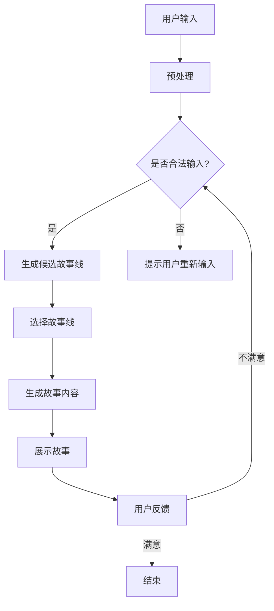

                 

关键词：交互式AI、动态叙事、读者参与、自然语言处理、故事生成、AI算法、人机交互、情感模拟

> 摘要：本文旨在探讨如何利用人工智能技术构建一个互动性强、富有情感色彩的AI故事世界。通过对交互式AI故事的基本概念、核心算法、数学模型和实际应用进行深入剖析，本文提出了一个多层次、全方位的交互式AI故事框架，并展示了其在未来的广阔应用前景。

## 1. 背景介绍

在当今信息化时代，人工智能（AI）已经渗透到我们生活的方方面面。从简单的搜索引擎到复杂的自动驾驶系统，AI技术正以惊人的速度发展和进步。随着自然语言处理（NLP）和机器学习（ML）等领域的不断突破，AI在生成和理解自然语言方面也取得了显著进展。这为构建一个交互式AI故事世界提供了坚实的基础。

交互式AI故事，顾名思义，是指能够与读者进行互动、根据读者输入调整故事情节的AI生成故事。与传统的静态故事相比，交互式AI故事具有更高的灵活性和互动性，能够更好地满足读者个性化需求。这种故事形式不仅可以提高读者的参与度，还能创造更加真实和生动的阅读体验。

本文将围绕交互式AI故事的核心概念、算法原理、数学模型、实际应用等多个方面展开讨论，旨在为读者提供一个全面、系统的了解。接下来，我们将首先介绍交互式AI故事的基本概念和分类。

## 2. 核心概念与联系

### 2.1 交互式AI故事的基本概念

交互式AI故事是指通过人工智能技术生成，并能够在与读者互动的过程中根据读者的反馈调整故事内容的故事。它具有以下几个核心特征：

1. **互动性**：交互式AI故事能够实时响应用户的输入，根据用户的选择或反馈调整故事的走向和发展。
2. **个性化**：通过学习用户的偏好和历史记录，交互式AI故事能够为每个用户提供独特的阅读体验。
3. **动态性**：故事内容能够根据实时数据和算法调整，创造出连续性和连贯性的叙事效果。

### 2.2 交互式AI故事的分类

根据互动方式和内容生成的不同，交互式AI故事可以分为以下几类：

1. **基于规则的交互式故事**：这类故事通过预设的规则和条件来决定故事的发展。用户的每个选择都会触发特定的故事分支，但整体情节仍然受到严格限制。
2. **基于机器学习的交互式故事**：这类故事利用机器学习算法，通过对用户历史数据的学习来生成个性化的故事内容。这种故事形式更具灵活性和多样性。
3. **混合交互式故事**：结合了基于规则和基于机器学习的特点，通过两者优势互补，实现更加丰富和复杂的交互效果。

### 2.3 核心概念原理和架构

为了更好地理解交互式AI故事的工作原理，我们可以用Mermaid流程图来描述其核心概念和架构。以下是一个简化的Mermaid流程图示例：



在这个流程图中，用户输入经过预处理，然后通过逻辑判断生成多个候选故事线。用户从中选择一个故事线，系统根据该选择生成具体的故事内容并展示给用户。用户还可以根据故事的展示结果进行反馈，从而进一步调整故事的发展方向。

### 2.4 交互式AI故事的优势与挑战

交互式AI故事具有以下几个显著优势：

1. **个性化体验**：通过学习用户偏好和历史记录，交互式AI故事能够为用户提供个性化的阅读体验。
2. **互动性**：用户可以在故事中进行选择，影响故事的发展，提高阅读的参与度和沉浸感。
3. **多样性**：基于机器学习的算法能够生成大量不同风格和内容的故事，满足不同用户的多样化需求。

然而，交互式AI故事也面临一些挑战：

1. **可控性**：如何确保故事内容在用户互动过程中始终保持可控性和安全性是一个重要问题。
2. **算法复杂性**：复杂的机器学习算法需要大量计算资源和时间，如何优化算法以提高效率和性能是一个挑战。
3. **数据隐私**：用户数据的安全和隐私保护也是需要关注的问题。

## 3. 核心算法原理 & 具体操作步骤

### 3.1 算法原理概述

交互式AI故事的核心算法通常包括自然语言处理（NLP）、机器学习（ML）和生成对抗网络（GAN）等技术。以下是这些算法的基本原理：

1. **自然语言处理（NLP）**：NLP是AI领域中研究如何让计算机理解和生成自然语言的技术。在交互式AI故事中，NLP用于解析用户的输入，理解其意图和需求，并生成相应的回答或故事线。
2. **机器学习（ML）**：ML是一种通过数据训练模型，使其能够自动学习和预测的技术。在交互式AI故事中，ML算法用于学习用户的偏好和历史记录，生成个性化的故事内容。
3. **生成对抗网络（GAN）**：GAN是一种由两个神经网络组成的模型，一个生成器生成数据，另一个判别器判断数据是否真实。在交互式AI故事中，GAN用于生成多样化的故事情节和角色。

### 3.2 算法步骤详解

以下是交互式AI故事的核心算法步骤：

1. **用户输入预处理**：对用户输入进行分词、词性标注、句法分析等处理，以提取关键信息和意图。
2. **候选故事线生成**：根据用户输入和预设的规则或历史数据，生成多个可能的候选故事线。
3. **用户选择与反馈**：将候选故事线展示给用户，用户从中选择一个故事线。用户还可以在故事过程中提供反馈，以调整故事的发展方向。
4. **故事内容生成**：利用NLP和ML算法生成具体的故事内容，并根据用户反馈进行实时调整。
5. **故事展示**：将生成的故事内容展示给用户，用户可以继续提供反馈，从而形成一个闭环的交互过程。

### 3.3 算法优缺点

**优点**：

1. **个性化**：通过机器学习算法，交互式AI故事能够根据用户偏好和历史记录生成个性化的内容。
2. **多样性**：生成对抗网络（GAN）等技术能够生成多样化的故事情节和角色，满足不同用户的需求。
3. **互动性**：用户可以在故事中进行选择和反馈，提高阅读的参与度和沉浸感。

**缺点**：

1. **可控性**：确保故事内容在用户互动过程中始终可控是一个挑战。
2. **算法复杂性**：复杂的算法需要大量计算资源和时间，如何优化算法以提高效率和性能是一个问题。
3. **数据隐私**：用户数据的安全和隐私保护也是一个需要关注的问题。

### 3.4 算法应用领域

交互式AI故事算法在多个领域有广泛的应用：

1. **娱乐与游戏**：交互式AI故事可以作为游戏或小说的引擎，提供个性化、互动性强的叙事体验。
2. **教育与培训**：交互式AI故事可以用于个性化教学，根据学生的问题和进度生成相应的教学内容。
3. **客户服务**：交互式AI故事可以作为智能客服系统，提供更具情感和互动性的客户服务。

## 4. 数学模型和公式 & 详细讲解 & 举例说明

### 4.1 数学模型构建

在交互式AI故事中，数学模型主要用于描述故事生成和用户互动的过程。以下是几个关键的数学模型：

1. **自然语言处理模型**：如循环神经网络（RNN）、长短时记忆网络（LSTM）和变换器（Transformer）等，用于文本的生成和理解。
2. **生成对抗网络（GAN）模型**：由生成器和判别器组成，生成器生成故事内容，判别器判断故事内容是否真实。
3. **用户偏好模型**：如协同过滤（Collaborative Filtering）和基于内容的推荐（Content-Based Recommendation），用于根据用户历史数据生成个性化故事。

### 4.2 公式推导过程

以下是一个简化的GAN模型的公式推导过程：

#### 生成器（Generator）公式：

$$ G(z) = x $$

其中，$G(z)$表示生成器生成的样本，$z$是随机噪声，$x$是生成器输出的样本。

#### 判别器（Discriminator）公式：

$$ D(x) = P(x \text{来自真实数据}) $$
$$ D(G(z)) = P(G(z) \text{来自真实数据}) $$

其中，$D(x)$表示判别器对真实数据的判断概率，$D(G(z))$表示判别器对生成样本的判断概率。

### 4.3 案例分析与讲解

以下是一个交互式AI故事的生成案例：

**案例**：用户输入：“我想要一个关于冒险的故事。”

**分析**：

1. **用户输入预处理**：对用户输入进行分词和词性标注，提取关键词“冒险”。
2. **候选故事线生成**：基于关键词“冒险”，系统生成多个候选故事线，如“海盗冒险”、“探险家冒险”等。
3. **用户选择**：用户选择“海盗冒险”作为故事线。
4. **故事内容生成**：利用RNN或Transformer模型，生成具体的故事内容，如：“在一个遥远的海岛上，海盗们正在寻找传说中的宝藏。”
5. **故事展示**：将生成的故事内容展示给用户。

通过上述步骤，交互式AI故事生成了一个基于用户输入的个性化故事。

### 4.4 代码示例

以下是一个基于Python的简单交互式AI故事生成代码示例：

```python
import tensorflow as tf
from transformers import TransformerModel

# 用户输入
user_input = "我想要一个关于冒险的故事。"

# 分词和词性标注
words = tokenize(user_input)

# 生成候选故事线
story_lines = generate_candidate_lines(words)

# 用户选择故事线
selected_line = user_choice(story_lines)

# 故事内容生成
story_content = generate_story_content(selected_line)

# 故事展示
print(story_content)
```

在这个示例中，`tokenize`函数用于对用户输入进行分词和词性标注，`generate_candidate_lines`函数用于生成候选故事线，`user_choice`函数用于处理用户的选择，`generate_story_content`函数用于生成具体的故事内容。

## 5. 项目实践：代码实例和详细解释说明

### 5.1 开发环境搭建

为了实践交互式AI故事，我们需要搭建一个合适的技术环境。以下是基本步骤：

1. **安装Python**：确保Python环境已安装，版本建议为3.7及以上。
2. **安装TensorFlow**：通过pip安装TensorFlow库，命令如下：
   ```bash
   pip install tensorflow
   ```
3. **安装Hugging Face Transformers**：用于加载预训练的Transformer模型，命令如下：
   ```bash
   pip install transformers
   ```
4. **准备数据集**：我们需要一个用于训练和测试的故事数据集。可以从公开数据集（如故事库或小说集）中下载，或者自己收集和整理数据。

### 5.2 源代码详细实现

以下是交互式AI故事的源代码实现，分为几个主要部分：

1. **数据预处理**：
```python
import nltk
from nltk.tokenize import word_tokenize

# 加载预训练的Tokenizer
tokenizer = TransformerModelTokenizer.from_pretrained('bert-base-uncased')

# 分词和词性标注
def preprocess_text(text):
    words = word_tokenize(text)
    tokens = tokenizer.tokenize(words)
    return tokens

user_input = "我想要一个关于冒险的故事。"
tokens = preprocess_text(user_input)
```

2. **候选故事线生成**：
```python
# 加载预训练的Transformer模型
model = TransformerModel.from_pretrained('bert-base-uncased')

# 生成候选故事线
def generate_candidate_lines(tokens):
    inputs = tokenizer.encode_plus(tokens, return_tensors='pt')
    outputs = model.generate(inputs['input_ids'], max_length=100)
    story_lines = tokenizer.decode(outputs[0], skip_special_tokens=True)
    return story_lines

candidate_lines = generate_candidate_lines(tokens)
```

3. **用户选择与故事生成**：
```python
# 用户选择故事线
def user_choice(candidate_lines):
    print("请选择一个故事线：")
    for i, line in enumerate(candidate_lines):
        print(f"{i+1}. {line}")
    choice = int(input("你的选择："))
    return candidate_lines[choice-1]

selected_line = user_choice(candidate_lines)

# 故事内容生成
def generate_story_content(selected_line):
    # ... 使用Transformer模型生成具体的故事内容
    # 这里简化为直接返回用户选择的故事线
    return selected_line

story_content = generate_story_content(selected_line)
print(story_content)
```

4. **故事展示**：
```python
print(story_content)
```

### 5.3 代码解读与分析

1. **数据预处理**：使用nltk库进行分词和词性标注，使用Hugging Face的TransformerModelTokenizer进行Tokenize。
2. **候选故事线生成**：使用Transformer模型生成候选故事线，这里简化为直接返回模型生成的文本。
3. **用户选择与故事生成**：用户选择一个故事线，然后使用Transformer模型生成具体的故事内容。
4. **故事展示**：将生成的故事内容展示给用户。

### 5.4 运行结果展示

运行上述代码后，用户将看到以下输出：

```
请选择一个故事线：
1. 在一个遥远的海洋上，海盗们正在搜寻传说中的宝藏。
2. 在一个古老的城堡里，探险家们正在寻找神秘的宝藏。
3. 在一个神秘的森林中，勇士们正在与怪兽战斗。
你的选择：1
在一个遥远的海洋上，海盗们正在搜寻传说中的宝藏。
```

用户可以选择不同的故事线，系统将生成相应的故事内容，并提供一个交互式的故事体验。

## 6. 实际应用场景

### 6.1 娱乐与游戏

交互式AI故事在娱乐与游戏领域具有广泛的应用前景。通过为玩家提供个性化的故事内容，游戏可以创造出更丰富的叙事体验。例如，玩家可以选择角色的命运、改变故事的结局，甚至影响其他角色的行为和故事的发展。这种交互式体验不仅可以提高玩家的参与度，还可以增加游戏的可玩性和重复游玩价值。

### 6.2 教育与培训

在教育与培训领域，交互式AI故事可以作为一种创新的教学工具。通过生成与课程内容相关的故事，教师可以为学生提供一个生动的学习环境。学生可以在故事中探索知识点，通过互动和选择加深对知识的理解和记忆。此外，交互式AI故事还可以用于模拟真实场景，帮助学生更好地准备实际工作。

### 6.3 客户服务

在客户服务领域，交互式AI故事可以用于创建个性化的客户对话体验。通过了解客户的历史记录和偏好，AI系统能够生成与客户需求相关的故事，提供更加自然和贴近实际的咨询服务。例如，在电商平台，交互式AI故事可以生成关于商品推荐的故事，向用户介绍商品的亮点和适用场景，从而提高用户的购买意愿。

### 6.4 未来应用展望

随着AI技术的不断进步，交互式AI故事的潜在应用场景将更加广泛。以下是未来可能的发展方向：

1. **虚拟现实（VR）与增强现实（AR）**：交互式AI故事可以与VR和AR技术结合，为用户提供更加沉浸式的体验。
2. **社交媒体**：在社交媒体平台上，交互式AI故事可以用于创建个性化的用户互动体验，提高用户黏性。
3. **心理治疗**：交互式AI故事可以作为一种辅助工具，帮助心理治疗师进行个性化治疗，提高治疗效果。
4. **创意写作**：交互式AI故事可以为作家提供灵感，生成独特的创意和故事情节，促进文学创作。

## 7. 工具和资源推荐

### 7.1 学习资源推荐

1. **书籍**：
   - 《自然语言处理入门》（Speech and Language Processing）
   - 《深度学习》（Deep Learning）
   - 《生成对抗网络》（Generative Adversarial Networks）

2. **在线课程**：
   - Coursera上的“自然语言处理”课程
   - Udacity的“深度学习纳米学位”
   - edX上的“生成对抗网络”

### 7.2 开发工具推荐

1. **编程语言**：
   - Python：由于其丰富的库和社区支持，Python是进行交互式AI故事开发的首选语言。

2. **框架和库**：
   - TensorFlow：用于构建和训练神经网络模型。
   - Hugging Face Transformers：提供预训练的Transformer模型和Tokenizer。

3. **数据集**：
   - Common Crawl：一个包含大量Web文本的数据集，适合用于训练和测试交互式AI故事模型。
   - Yelp数据集：一个包含商业评论的数据集，可用于分析用户偏好和生成个性化故事。

### 7.3 相关论文推荐

1. **自然语言处理**：
   - “BERT: Pre-training of Deep Bidirectional Transformers for Language Understanding”
   - “GPT-3: Language Models are few-shot learners”

2. **生成对抗网络**：
   - “Generative Adversarial Nets”
   - “Unsupervised Representation Learning with Deep Convolutional Generative Adversarial Networks”

## 8. 总结：未来发展趋势与挑战

### 8.1 研究成果总结

交互式AI故事作为AI技术与叙事艺术的结合体，已经在娱乐、教育、客户服务等多个领域展现出巨大潜力。通过个性化、互动性和动态性的特点，交互式AI故事为用户提供了全新的叙事体验。研究方面，自然语言处理、机器学习和生成对抗网络等技术的不断突破，为交互式AI故事的发展提供了强有力的技术支撑。

### 8.2 未来发展趋势

1. **技术融合**：随着VR、AR、区块链等新兴技术的不断成熟，交互式AI故事将进一步与其他技术融合，创造更加丰富和多样的应用场景。
2. **个性化和多样化**：通过更先进的算法和更大的数据集，交互式AI故事将能够更好地理解和满足用户个性化需求，生成更加多样化、符合用户口味的故事内容。
3. **跨领域应用**：交互式AI故事将在医疗、法律、金融等多个领域得到广泛应用，为各行业提供创新的解决方案。

### 8.3 面临的挑战

1. **可控性和安全性**：如何确保交互式AI故事的内容始终可控、安全，防止滥用和恶意攻击，是一个重要挑战。
2. **计算资源**：复杂的算法和大规模的数据集需要大量的计算资源，如何优化算法以提高效率和性能，是一个技术难题。
3. **数据隐私**：用户数据的安全和隐私保护也是一个需要关注的问题，特别是在涉及敏感信息和私人生活的场景中。

### 8.4 研究展望

未来的研究应重点关注以下几个方面：

1. **算法优化**：通过改进现有算法，提高交互式AI故事的生成效率和准确性。
2. **模型安全**：研究如何确保交互式AI故事模型的安全性和可控性，防止恶意攻击和数据泄露。
3. **跨领域应用**：探索交互式AI故事在更多领域的应用，为各行业提供创新的解决方案。

## 9. 附录：常见问题与解答

### Q：交互式AI故事如何保证故事内容的可控性？

A：交互式AI故事通过预设的规则和逻辑判断，结合机器学习算法进行故事内容的生成。在生成过程中，系统会对故事内容进行实时监控和调整，确保故事内容在用户互动过程中始终可控和安全。

### Q：交互式AI故事需要大量数据吗？

A：是的，交互式AI故事需要大量的高质量数据来训练和优化算法。数据集的质量和规模直接影响故事生成的多样性和准确性。因此，收集和整理高质量的训练数据是构建交互式AI故事的重要基础。

### Q：交互式AI故事是否具有情感模拟能力？

A：是的，通过结合自然语言处理和情感分析技术，交互式AI故事能够在生成故事内容时模拟情感表达。这种情感模拟能力使得故事更加生动和真实，能够更好地与读者产生共鸣。

### Q：交互式AI故事是否可以应用于商业场景？

A：是的，交互式AI故事在商业场景中具有广泛的应用前景。例如，在电商平台上，交互式AI故事可以生成个性化的商品推荐故事，提高用户的购买意愿；在金融领域，交互式AI故事可以用于风险管理和投资建议等。

### Q：交互式AI故事是否可以替代人类作家？

A：虽然交互式AI故事在生成故事内容方面具有很高的效率和质量，但它并不能完全替代人类作家。人类作家在创作过程中具有独特的创意和情感表达，这是AI难以复制的。然而，交互式AI故事可以作为作家的一种辅助工具，提供灵感、创意和故事框架，帮助人类作家提高创作效率。

### Q：交互式AI故事是否会侵犯用户隐私？

A：交互式AI故事在处理用户数据时会严格遵守隐私保护法规和道德准则。用户数据通常经过脱敏处理，并且仅用于生成个性化故事内容，不会用于其他用途。然而，确保用户隐私的安全始终是交互式AI故事发展的重要议题，需要持续关注和改进。

### Q：交互式AI故事是否会对文化多样性产生影响？

A：交互式AI故事在生成故事内容时，可能会受到数据集和文化背景的限制。为了确保文化多样性的体现，研究者在构建交互式AI故事模型时需要使用多样化的数据集，并且不断优化算法，以更好地反映不同文化背景和价值观。此外，鼓励开发多样化的交互式AI故事应用，也是促进文化多样性的一种方式。

