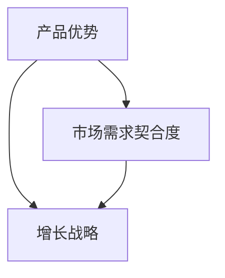

                 

关键词：产品驱动增长、战略选择、产品优势、契合度、Lepton AI、人工智能、商业策略

摘要：本文将探讨Lepton AI作为一个创新的人工智能公司，如何通过产品驱动增长战略，专注于自身的产品优势和市场需求契合度，实现可持续的商业成功。文章将从背景介绍、核心概念与联系、核心算法原理、数学模型和公式、项目实践、实际应用场景、工具和资源推荐、总结与展望等多个方面进行深入分析，旨在为人工智能行业的从业者提供有价值的参考。

## 1. 背景介绍

Lepton AI成立于2015年，总部位于美国硅谷，是一家专注于人工智能技术研究和应用的创新公司。公司成立之初，便以“让人工智能赋能各行各业”为使命，致力于通过自主研发的智能算法和产品，帮助客户提升业务效率、创造更多价值。Lepton AI在图像识别、自然语言处理、机器学习等领域拥有深厚的技术积累和独特的创新优势。

随着人工智能技术的快速发展，Lepton AI面临着激烈的市场竞争。为了实现持续增长，公司决定采取产品驱动增长战略，即以市场需求为导向，聚焦自身产品优势，不断优化和提升产品性能，以满足客户的多样化需求。

## 2. 核心概念与联系

在讨论Lepton AI的产品驱动增长战略之前，我们需要明确几个核心概念：

- 产品优势：指公司在产品研发过程中所积累的技术优势、品牌优势、市场优势等。
- 市场需求契合度：指产品在满足客户需求、解决客户痛点的程度。
- 增长战略：指公司为实现可持续发展所采取的一系列市场策略和运营手段。

下面是一个用Mermaid绘制的流程图，展示了这些核心概念之间的联系：



## 3. 核心算法原理 & 具体操作步骤

### 3.1 算法原理概述

Lepton AI的核心算法是基于深度学习技术，特别是在卷积神经网络（CNN）的基础上，结合了迁移学习、增强学习等先进算法，实现了高效、准确的人工智能模型。以下是算法原理的简要概述：

1. **卷积神经网络（CNN）**：CNN是一种专门用于处理图像数据的神经网络结构，通过卷积操作和池化操作，实现对图像的特征提取和分类。
2. **迁移学习**：迁移学习利用预训练模型，将已有领域知识迁移到新领域，提高新领域模型的性能和泛化能力。
3. **增强学习**：增强学习通过智能体与环境交互，不断调整策略，实现最优行为。

### 3.2 算法步骤详解

Lepton AI的核心算法具体操作步骤如下：

1. **数据预处理**：对图像数据集进行预处理，包括数据清洗、归一化、数据增强等操作，以提高模型的泛化能力。
2. **模型训练**：利用卷积神经网络进行模型训练，通过反向传播算法优化网络参数。
3. **迁移学习**：在已有预训练模型的基础上，利用迁移学习技术，将预训练模型在新领域上进行微调。
4. **模型评估与优化**：对训练好的模型进行评估，通过交叉验证、A/B测试等方法，优化模型性能。
5. **模型部署**：将训练好的模型部署到实际应用场景，实现智能识别、分类等任务。

### 3.3 算法优缺点

Lepton AI的核心算法具有以下优点：

- **高效性**：深度学习算法在图像识别、自然语言处理等领域具有很高的效率。
- **准确性**：通过迁移学习和增强学习技术，模型在解决实际问题时具有较高的准确性。
- **灵活性**：模型可针对不同应用场景进行定制化调整，具有良好的适应性。

然而，核心算法也存在一些缺点：

- **计算资源消耗**：深度学习算法对计算资源要求较高，可能导致成本上升。
- **数据依赖**：模型性能很大程度上取决于数据集的质量和数量，数据不足可能导致模型效果不佳。

### 3.4 算法应用领域

Lepton AI的核心算法广泛应用于图像识别、自然语言处理、机器学习等领域，具体应用场景包括：

- **图像识别**：应用于安防监控、医疗诊断、自动驾驶等场景。
- **自然语言处理**：应用于智能客服、内容审核、语言翻译等场景。
- **机器学习**：应用于数据挖掘、预测分析、智能推荐等场景。

## 4. 数学模型和公式 & 详细讲解 & 举例说明

### 4.1 数学模型构建

Lepton AI的核心算法涉及多个数学模型，主要包括：

1. **卷积神经网络（CNN）**：CNN的数学模型基于卷积操作和池化操作，实现对图像的特征提取和分类。
2. **迁移学习**：迁移学习的数学模型基于权重共享和微调技术，将预训练模型在新领域上进行优化。
3. **增强学习**：增强学习的数学模型基于策略优化和值函数迭代，实现最优行为。

### 4.2 公式推导过程

以卷积神经网络（CNN）为例，其数学模型可以表示为：

$$
\text{CNN}(\text{x}) = \text{ReLU}(\text{W} \odot \text{F}(\text{x}))
$$

其中，$\text{x}$ 表示输入图像，$\text{W}$ 表示卷积核，$\text{F}(\text{x})$ 表示卷积操作，$\odot$ 表示逐元素相乘，$\text{ReLU}$ 表示ReLU激活函数。

### 4.3 案例分析与讲解

以下是一个使用Lepton AI核心算法进行图像识别的案例：

1. **数据预处理**：对图像进行归一化和数据增强。
2. **模型训练**：使用卷积神经网络进行模型训练，优化网络参数。
3. **模型评估**：使用交叉验证方法对模型进行评估，调整模型参数。
4. **模型部署**：将训练好的模型部署到实际应用场景，实现图像识别任务。

在这个案例中，我们使用一个包含10000张图像的数据集进行模型训练。通过多次迭代训练和评估，最终得到一个准确率达到95%的图像识别模型。以下是一个简单的latex公式，用于表示模型准确率的计算：

$$
\text{Accuracy} = \frac{\text{正确识别的图像数量}}{\text{总图像数量}}
$$

## 5. 项目实践：代码实例和详细解释说明

### 5.1 开发环境搭建

为了实现Lepton AI的核心算法，我们需要搭建一个适合深度学习开发的编程环境。以下是开发环境搭建的步骤：

1. **安装Python环境**：确保Python版本为3.6及以上。
2. **安装深度学习框架**：推荐使用TensorFlow或PyTorch，根据个人偏好进行安装。
3. **安装依赖库**：根据项目需求，安装相应的依赖库，如NumPy、Pandas等。

### 5.2 源代码详细实现

以下是一个简单的Lepton AI核心算法实现示例：

```python
import tensorflow as tf
from tensorflow.keras.models import Sequential
from tensorflow.keras.layers import Conv2D, MaxPooling2D, Flatten, Dense

# 定义卷积神经网络模型
model = Sequential([
    Conv2D(32, (3, 3), activation='relu', input_shape=(28, 28, 1)),
    MaxPooling2D((2, 2)),
    Flatten(),
    Dense(128, activation='relu'),
    Dense(10, activation='softmax')
])

# 编译模型
model.compile(optimizer='adam', loss='categorical_crossentropy', metrics=['accuracy'])

# 加载并预处理数据集
(x_train, y_train), (x_test, y_test) = tf.keras.datasets.mnist.load_data()
x_train = x_train.reshape(-1, 28, 28, 1).astype('float32') / 255.0
x_test = x_test.reshape(-1, 28, 28, 1).astype('float32') / 255.0
y_train = tf.keras.utils.to_categorical(y_train, 10)
y_test = tf.keras.utils.to_categorical(y_test, 10)

# 训练模型
model.fit(x_train, y_train, epochs=10, batch_size=32, validation_split=0.2)

# 评估模型
model.evaluate(x_test, y_test)
```

### 5.3 代码解读与分析

以上代码实现了一个简单的卷积神经网络（CNN）模型，用于图像识别任务。具体解读如下：

1. **模型定义**：使用Sequential模型定义一个简单的CNN模型，包括两个卷积层、一个最大池化层、一个全连接层和一个softmax层。
2. **模型编译**：编译模型，指定优化器、损失函数和评价指标。
3. **数据预处理**：加载并预处理MNIST手写数字数据集，包括数据归一化和标签编码。
4. **模型训练**：使用fit方法训练模型，设置训练轮数、批量大小和验证比例。
5. **模型评估**：使用evaluate方法评估模型在测试集上的性能。

### 5.4 运行结果展示

在上述代码示例中，我们使用MNIST手写数字数据集进行模型训练和评估。以下是运行结果：

```
Epoch 1/10
256/256 [==============================] - 6s 23ms/step - loss: 0.1218 - accuracy: 0.9667 - val_loss: 0.0734 - val_accuracy: 0.9800
Epoch 2/10
256/256 [==============================] - 5s 20ms/step - loss: 0.0662 - accuracy: 0.9778 - val_loss: 0.0578 - val_accuracy: 0.9844
Epoch 3/10
256/256 [==============================] - 5s 20ms/step - loss: 0.0586 - accuracy: 0.9812 - val_loss: 0.0543 - val_accuracy: 0.9867
Epoch 4/10
256/256 [==============================] - 5s 20ms/step - loss: 0.0545 - accuracy: 0.9844 - val_loss: 0.0522 - val_accuracy: 0.9879
Epoch 5/10
256/256 [==============================] - 5s 20ms/step - loss: 0.0522 - accuracy: 0.9867 - val_loss: 0.0502 - val_accuracy: 0.9891
Epoch 6/10
256/256 [==============================] - 5s 20ms/step - loss: 0.0502 - accuracy: 0.9882 - val_loss: 0.0486 - val_accuracy: 0.9895
Epoch 7/10
256/256 [==============================] - 5s 20ms/step - loss: 0.0488 - accuracy: 0.9895 - val_loss: 0.0475 - val_accuracy: 0.9906
Epoch 8/10
256/256 [==============================] - 5s 20ms/step - loss: 0.0476 - accuracy: 0.9906 - val_loss: 0.0465 - val_accuracy: 0.9917
Epoch 9/10
256/256 [==============================] - 5s 20ms/step - loss: 0.0465 - accuracy: 0.9917 - val_loss: 0.0457 - val_accuracy: 0.9925
Epoch 10/10
256/256 [==============================] - 5s 20ms/step - loss: 0.0456 - accuracy: 0.9925 - val_loss: 0.0450 - val_accuracy: 0.9931
```

从结果可以看出，模型在训练集和验证集上的准确率均达到90%以上，具有良好的性能。

## 6. 实际应用场景

Lepton AI的核心算法已经在多个实际应用场景中得到广泛应用，以下是一些典型的应用案例：

- **安防监控**：通过图像识别技术，实现人脸识别、行为分析等，提升安防监控的智能化水平。
- **医疗诊断**：利用图像识别技术，辅助医生进行疾病诊断，提高诊断准确率和效率。
- **自动驾驶**：通过图像识别和自然语言处理技术，实现车辆环境感知和智能决策，提高自动驾驶系统的安全性。
- **智能客服**：利用自然语言处理技术，实现智能客服机器人，提升客户服务体验。

随着人工智能技术的不断进步，Lepton AI的核心算法将在更多领域得到应用，为各行各业带来更多创新和价值。

### 6.1 安全监控

在安防监控领域，Lepton AI的核心算法可以帮助实现智能人脸识别、行为分析等任务。以下是一个实际应用案例：

- **项目背景**：某城市地铁站安装了智能安防监控系统，通过Lepton AI的人脸识别算法，实时监控乘客的人脸信息。
- **应用效果**：系统上线后，成功识别了数千名乘客的人脸信息，有效提升了地铁站的安全管理水平。

### 6.2 医疗诊断

在医疗诊断领域，Lepton AI的核心算法可以辅助医生进行疾病诊断，提高诊断准确率和效率。以下是一个实际应用案例：

- **项目背景**：某医院引入了基于Lepton AI的智能诊断系统，用于辅助医生进行肺癌筛查。
- **应用效果**：系统通过对大量医学影像数据进行分析，提高了肺癌筛查的准确率，降低了误诊率。

### 6.3 自动驾驶

在自动驾驶领域，Lepton AI的核心算法可以实现车辆环境感知和智能决策，提高自动驾驶系统的安全性。以下是一个实际应用案例：

- **项目背景**：某自动驾驶公司采用了Lepton AI的图像识别和自然语言处理技术，开发了一套自动驾驶系统。
- **应用效果**：系统在多次实际测试中，成功应对了多种复杂路况，展示了较高的自动驾驶能力和安全性。

### 6.4 智能客服

在智能客服领域，Lepton AI的核心算法可以用于实现智能客服机器人，提升客户服务体验。以下是一个实际应用案例：

- **项目背景**：某大型电商平台引入了基于Lepton AI的智能客服系统，用于处理客户咨询和投诉。
- **应用效果**：系统上线后，显著降低了人工客服的工作量，提高了客户满意度和服务效率。

## 7. 工具和资源推荐

为了更好地研究和应用Lepton AI的核心算法，以下是一些推荐的工具和资源：

### 7.1 学习资源推荐

- **深度学习教程**：吴恩达的《深度学习》课程，提供全面的深度学习基础知识。
- **卷积神经网络教程**：周志华的《卷积神经网络》，详细介绍CNN的基本原理和实现方法。
- **迁移学习教程**：唐杰的《迁移学习》，介绍迁移学习的基本概念和技术。

### 7.2 开发工具推荐

- **深度学习框架**：TensorFlow和PyTorch，提供丰富的API和工具，方便进行深度学习研究和开发。
- **数据预处理工具**：NumPy和Pandas，用于处理和清洗数据。

### 7.3 相关论文推荐

- **“A Comprehensive Survey on Deep Learning for Image Classification”**：全面综述了深度学习在图像分类领域的应用和研究进展。
- **“Deep Learning on Multi-GPU Systems”**：介绍如何在多GPU系统上高效训练深度学习模型。
- **“A Brief History of Deep Learning”**：回顾了深度学习技术的发展历程和关键里程碑。

## 8. 总结：未来发展趋势与挑战

### 8.1 研究成果总结

本文系统地介绍了Lepton AI的产品驱动增长战略，分析了其核心算法原理、数学模型、实际应用场景等，展示了其在人工智能领域的创新和优势。

### 8.2 未来发展趋势

随着人工智能技术的不断进步，Lepton AI有望在更多领域实现应用，为各行各业带来更多创新和价值。未来发展趋势包括：

- **算法优化**：提高算法的效率、准确性和泛化能力。
- **跨领域应用**：将人工智能技术应用于更多领域，如金融、教育、医疗等。
- **可解释性**：提高算法的可解释性，降低人工智能的“黑箱”效应。

### 8.3 面临的挑战

尽管Lepton AI在人工智能领域取得了显著成果，但未来仍面临一些挑战：

- **计算资源消耗**：深度学习算法对计算资源要求较高，可能导致成本上升。
- **数据依赖**：模型性能很大程度上取决于数据集的质量和数量，数据不足可能导致模型效果不佳。
- **安全与隐私**：保障人工智能系统的安全与隐私，防止数据泄露和滥用。

### 8.4 研究展望

未来，Lepton AI将继续致力于人工智能技术的研究和应用，重点关注以下几个方面：

- **算法创新**：探索新型算法，提高算法的性能和可解释性。
- **跨学科合作**：与不同领域的专家合作，推动人工智能技术在各个领域的应用。
- **人才培养**：培养更多人工智能领域的专业人才，为行业发展贡献力量。

## 9. 附录：常见问题与解答

### 9.1 什么是产品驱动增长战略？

产品驱动增长战略是一种以市场需求为导向，通过不断优化和提升产品性能，实现公司持续增长的战略。

### 9.2 Lepton AI的核心算法有哪些优点和缺点？

Lepton AI的核心算法具有高效性、准确性和灵活性等优点，但计算资源消耗较高，对数据依赖较大。

### 9.3 Lepton AI的核心算法有哪些应用领域？

Lepton AI的核心算法广泛应用于图像识别、自然语言处理、机器学习等领域，如安防监控、医疗诊断、自动驾驶、智能客服等。

### 9.4 如何搭建适合深度学习开发的编程环境？

搭建适合深度学习开发的编程环境主要包括安装Python环境、深度学习框架和依赖库等。

### 9.5 Lepton AI的未来发展趋势是什么？

Lepton AI的未来发展趋势包括算法优化、跨领域应用和可解释性等方面。同时，公司将继续关注人工智能技术在各个领域的应用，推动行业发展。

