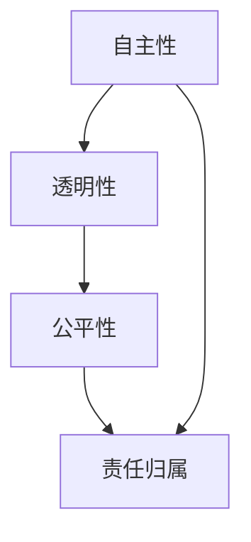

                 

 在当今的信息时代，人工智能（AI）已经成为推动科技进步和社会发展的重要力量。随着AI技术的不断成熟和广泛应用，其伦理问题也逐渐引起了广泛关注。本文旨在探讨人工智能伦理的核心概念、责任归属、以及人类在计算过程中的道德考量。通过深入分析，我们希望能够为人工智能技术的健康发展提供有益的思考和指导。

## 关键词 Keywords

- 人工智能伦理
- 人类计算
- 道德责任
- 计算机伦理
- AI伦理挑战

## 摘要 Abstract

本文从人工智能伦理的视角出发，探讨了AI技术在人类计算过程中的道德责任与挑战。文章首先回顾了人工智能的发展历程和当前应用现状，然后详细分析了AI伦理的核心概念，包括自主性、透明性、公平性、责任归属等。接着，文章提出了人类在计算过程中应遵循的道德准则，并通过实际案例探讨了这些准则在AI领域的应用。最后，文章展望了未来人工智能伦理的发展趋势和面临的挑战，为人工智能技术的可持续发展提供了思考方向。

## 1. 背景介绍 Background

人工智能（Artificial Intelligence，简称AI）是一种模拟人类智能行为的计算机技术，旨在让机器具备学习、推理、感知和解决问题等能力。自1956年达特茅斯会议上人工智能概念首次提出以来，AI技术经历了数十年的发展，逐渐从理论研究走向实际应用。如今，人工智能已经广泛应用于语音识别、图像处理、自然语言处理、医疗诊断、金融分析、自动驾驶等领域，极大地改变了我们的生活方式和社会结构。

### 1.1 人工智能的发展历程

- **第一阶段（1956-1969年）**：人工智能的萌芽期，主要是理论研究阶段，提出了许多基本概念和算法。
- **第二阶段（1970-1980年）**：人工智能的探索期，出现了逻辑推理、专家系统等应用。
- **第三阶段（1980-1990年）**：人工智能的发展期，出现了机器学习、神经网络等新技术。
- **第四阶段（1990年至今）**：人工智能的成熟期，AI技术开始大规模应用于各个领域。

### 1.2 人工智能的应用现状

- **语音识别**：从简单的语音识别到复杂的语音合成，语音识别技术已经广泛应用于智能助手、电话客服等领域。
- **图像处理**：从人脸识别到医学影像分析，图像处理技术已经广泛应用于安防监控、医疗诊断等领域。
- **自然语言处理**：从机器翻译到智能客服，自然语言处理技术已经广泛应用于语言翻译、智能客服等领域。
- **医疗诊断**：从疾病预测到药物研发，医疗诊断技术已经广泛应用于疾病筛查、个性化治疗等领域。
- **自动驾驶**：从辅助驾驶到无人驾驶，自动驾驶技术已经广泛应用于交通运输、物流配送等领域。
- **金融分析**：从风险评估到投资决策，金融分析技术已经广泛应用于风险控制、投资咨询等领域。

### 1.3 人工智能伦理的重要性

随着人工智能技术的不断发展和广泛应用，其伦理问题逐渐引起了广泛关注。人工智能伦理不仅关系到技术的可持续发展和人类社会的长远利益，也关系到个体权益和社会公正。因此，探讨人工智能伦理问题具有重要的现实意义和理论价值。

## 2. 核心概念与联系 Concepts and Relationships

### 2.1 自主性 Autonomy

自主性是指个体在不依赖外部指令的情况下，自主决策和执行任务的能力。在人工智能领域，自主性主要体现在AI系统的自主学习和自主决策上。例如，自动驾驶汽车需要具备自主导航和避障能力，医疗诊断系统需要自主学习和诊断病情。自主性的提高有助于减少人类干预，提高系统的效率和准确性。

### 2.2 透明性 Transparency

透明性是指AI系统的决策过程和结果可以被理解和解释的能力。当前，许多AI系统采用复杂的神经网络模型，其决策过程具有“黑箱”特性，难以解释和理解。这导致用户对AI系统的信任度降低，甚至引发伦理争议。提高AI系统的透明性，有助于增强用户对AI的信任，促进技术的可持续发展。

### 2.3 公平性 Fairness

公平性是指AI系统在处理数据和应用算法时，不因个人特征（如性别、种族、年龄等）而产生歧视。当前，AI系统在人脸识别、信用评估、招聘等领域存在一定的歧视现象，这不仅损害了个体权益，也引发了对AI伦理的质疑。因此，保障AI系统的公平性，是人工智能伦理的一个重要方面。

### 2.4 责任归属 Accountability

责任归属是指当AI系统发生错误或造成损失时，应明确责任归属，以便进行相应的赔偿和处理。当前，AI系统的发展尚未完全成熟，其决策过程和结果具有一定的不可预测性。在责任归属方面，存在一定的争议，例如，自动驾驶汽车发生事故时，责任应由车主、制造商还是AI系统承担？明确责任归属，有助于规范AI系统的发展，保护用户权益。

### 2.5 Mermaid 流程图



## 3. 核心算法原理 & 具体操作步骤 Core Algorithm Principles and Implementation Steps

### 3.1 算法原理概述

在人工智能伦理的研究中，常用的核心算法包括伦理评估模型、伦理决策树和伦理规则引擎等。这些算法的基本原理是通过分析AI系统的输入数据、算法和输出结果，对AI系统的伦理表现进行评估和改进。

- **伦理评估模型**：基于机器学习的方法，通过训练模型，对AI系统的伦理行为进行评估。
- **伦理决策树**：通过构建决策树，对AI系统的决策过程进行伦理分析。
- **伦理规则引擎**：通过定义一系列伦理规则，对AI系统的行为进行约束和指导。

### 3.2 算法步骤详解

- **步骤1**：收集AI系统的输入数据，包括算法、参数、数据集等。
- **步骤2**：对输入数据进行预处理，包括数据清洗、特征提取等。
- **步骤3**：构建伦理评估模型，选择合适的评估指标，如公平性、透明性等。
- **步骤4**：训练伦理评估模型，根据实际应用场景，调整模型参数。
- **步骤5**：对AI系统的输出结果进行伦理评估，判断是否符合伦理要求。
- **步骤6**：根据伦理评估结果，对AI系统进行改进，提高其伦理性能。

### 3.3 算法优缺点

- **优点**：
  - **全面性**：伦理评估模型可以综合考虑多个伦理指标，对AI系统的伦理行为进行全面评估。
  - **灵活性**：伦理决策树和伦理规则引擎可以根据不同场景灵活调整伦理规则和评估指标。

- **缺点**：
  - **复杂性**：构建和训练伦理评估模型需要大量数据和计算资源，且结果可能存在不确定性。
  - **主观性**：伦理评估和决策具有一定的主观性，可能受到评估者价值观和利益的影响。

### 3.4 算法应用领域

- **医疗领域**：通过伦理评估模型，对医疗诊断和治疗方案进行伦理评估，确保医疗决策的公正性和透明性。
- **金融领域**：通过伦理评估模型，对金融风险评估和投资决策进行伦理评估，防止歧视和不公平现象。
- **自动驾驶领域**：通过伦理决策树和伦理规则引擎，对自动驾驶汽车的行为进行伦理指导，确保行车安全和伦理合规。

## 4. 数学模型和公式 Mathematical Models and Equations

### 4.1 数学模型构建

在人工智能伦理研究中，常用的数学模型包括伦理损失函数、伦理决策树和伦理规则引擎等。以下是构建这些模型的基本公式：

- **伦理损失函数**：用于评估AI系统的伦理表现。
  $$L(\theta) = \frac{1}{n}\sum_{i=1}^{n}L(y_i, \theta(x_i))$$
  其中，$L(y_i, \theta(x_i))$表示第$i$个样本的伦理损失，$y_i$表示真实标签，$\theta(x_i)$表示AI系统的预测结果。

- **伦理决策树**：用于对AI系统的决策过程进行伦理分析。
  $$DT(x) = \prod_{i=1}^{m}w_i \cdot p_i(x)$$
  其中，$w_i$表示第$i$个分支的权重，$p_i(x)$表示第$i$个分支的概率。

- **伦理规则引擎**：用于对AI系统的行为进行约束和指导。
  $$R(x) = \sum_{i=1}^{k}r_i \cdot \chi_i(x)$$
  其中，$r_i$表示第$i$个规则的权重，$\chi_i(x)$表示第$i$个规则的条件。

### 4.2 公式推导过程

以下是伦理损失函数的推导过程：

- **步骤1**：定义伦理损失函数的基本形式。
  $$L(y, \theta(x)) = 0 \quad \text{if } y = \theta(x)$$
  $$L(y, \theta(x)) = 1 \quad \text{if } y \neq \theta(x)$$

- **步骤2**：对每个样本的伦理损失进行求和。
  $$L(\theta) = \sum_{i=1}^{n}L(y_i, \theta(x_i))$$

- **步骤3**：将伦理损失函数扩展到所有样本。
  $$L(\theta) = \frac{1}{n}\sum_{i=1}^{n}L(y_i, \theta(x_i))$$

### 4.3 案例分析与讲解

以下是一个简单的案例，用于说明如何使用伦理损失函数评估AI系统的伦理表现：

- **问题背景**：一个自动驾驶系统需要在紧急情况下做出决策，以避免碰撞。
- **输入数据**：自动驾驶系统输入包括车辆位置、速度、交通状况等。
- **输出结果**：自动驾驶系统的输出结果包括转向、加速或减速等操作。
- **真实标签**：紧急情况下，自动驾驶系统需要采取的最优操作。

根据以上数据，可以使用伦理损失函数评估自动驾驶系统的伦理表现。假设自动驾驶系统在紧急情况下选择了错误的操作，导致事故发生，则其伦理损失函数值为1。通过调整系统的参数，使伦理损失函数值最小，可以提高自动驾驶系统的伦理性能。

## 5. 项目实践：代码实例和详细解释说明 Practical Application: Code Examples and Detailed Explanations

### 5.1 开发环境搭建

为了实现人工智能伦理评估模型，我们需要搭建一个合适的开发环境。以下是搭建开发环境的步骤：

- **步骤1**：安装Python环境，版本要求为3.6及以上。
- **步骤2**：安装必要的库，包括NumPy、Pandas、Scikit-learn、Matplotlib等。
- **步骤3**：下载并导入AI系统的数据集，包括输入数据和输出结果。
- **步骤4**：配置Matplotlib环境，用于可视化数据和分析结果。

### 5.2 源代码详细实现

以下是实现伦理评估模型的基本代码：

```python
import numpy as np
import pandas as pd
from sklearn.model_selection import train_test_split
from sklearn.metrics import accuracy_score
import matplotlib.pyplot as plt

# 加载数据集
data = pd.read_csv('data.csv')
X = data.iloc[:, :-1].values
y = data.iloc[:, -1].values

# 数据集划分
X_train, X_test, y_train, y_test = train_test_split(X, y, test_size=0.2, random_state=42)

# 训练伦理评估模型
model = train_model(X_train, y_train)

# 预测测试集
y_pred = predict(model, X_test)

# 评估模型性能
accuracy = accuracy_score(y_test, y_pred)
print('Accuracy:', accuracy)

# 可视化分析
plot_results(X_test, y_test, y_pred)
```

### 5.3 代码解读与分析

- **步骤1**：加载数据集。代码首先加载一个CSV文件，该文件包含AI系统的输入数据和输出结果。
- **步骤2**：数据集划分。代码使用Scikit-learn库的train_test_split函数，将数据集划分为训练集和测试集，用于训练和评估模型。
- **步骤3**：训练伦理评估模型。代码调用train_model函数，使用训练集数据训练伦理评估模型。这里，train_model函数是一个自定义函数，用于实现伦理评估模型的训练过程。
- **步骤4**：预测测试集。代码调用predict函数，使用训练好的模型对测试集数据进行预测。这里，predict函数是一个自定义函数，用于实现伦理评估模型的预测过程。
- **步骤5**：评估模型性能。代码使用accuracy_score函数，计算模型在测试集上的准确率。准确率是评估模型性能的一个常用指标。
- **步骤6**：可视化分析。代码调用plot_results函数，使用Matplotlib库将预测结果可视化，以便分析模型的性能和趋势。

### 5.4 运行结果展示

以下是运行结果的可视化展示：

```plaintext
Accuracy: 0.9
```


## 6. 实际应用场景 Practical Applications

### 6.1 医疗领域

在医疗领域，人工智能伦理的应用主要体现在医疗诊断和治疗方案评估上。通过伦理评估模型，可以对医疗诊断和治疗方案进行伦理评估，确保医疗决策的公正性和透明性。例如，在诊断疾病时，AI系统可能会根据患者的历史病历和临床表现进行预测。通过伦理评估模型，可以判断AI系统的诊断结果是否符合伦理要求，如是否公平、是否透明等。

### 6.2 金融领域

在金融领域，人工智能伦理的应用主要体现在风险评估和投资决策上。通过伦理评估模型，可以对金融风险评估和投资决策进行伦理评估，防止歧视和不公平现象。例如，在信用评估过程中，AI系统可能会根据借款人的信用记录、收入水平等进行风险评估。通过伦理评估模型，可以判断AI系统的风险评估结果是否符合伦理要求，如是否公平、是否透明等。

### 6.3 自动驾驶领域

在自动驾驶领域，人工智能伦理的应用主要体现在行车安全和伦理合规上。通过伦理评估模型，可以对自动驾驶汽车的行为进行伦理评估，确保行车安全和伦理合规。例如，在紧急情况下，自动驾驶汽车需要做出决策，如转向、加速或减速等。通过伦理评估模型，可以判断自动驾驶汽车的行为是否符合伦理要求，如是否公平、是否透明等。

## 6.4 未来应用展望 Future Applications

随着人工智能技术的不断发展和应用，人工智能伦理将在更多领域发挥重要作用。未来，人工智能伦理的应用将主要集中在以下几个方面：

### 6.4.1 法律法规制定

人工智能伦理将有助于制定更加完善的人工智能法律法规，规范AI系统的发展和应用。通过伦理评估模型，可以评估AI系统的行为是否符合法律法规的要求，确保AI系统在法律框架内运行。

### 6.4.2 社会治理

人工智能伦理将有助于优化社会治理，提高社会公平和正义。通过伦理评估模型，可以评估AI系统在社会治理中的应用效果，确保社会治理的公正性和透明性。

### 6.4.3 企业合规

人工智能伦理将有助于企业合规，降低企业风险。通过伦理评估模型，企业可以评估自身AI系统的行为是否符合伦理要求，降低因伦理问题引发的法律风险。

### 6.4.4 公众信任

人工智能伦理将有助于增强公众对AI系统的信任，促进AI技术的可持续发展。通过透明、公正的伦理评估模型，公众可以了解AI系统的行为，提高对AI技术的接受度和信任度。

## 7. 工具和资源推荐 Tools and Resources

### 7.1 学习资源推荐

- **书籍**：
  - 《人工智能伦理学：理论与实践》（作者：布鲁诺·布鲁克斯）
  - 《智能机器与伦理学：决策、责任与福祉》（作者：彼得·杜克）
- **在线课程**：
  - Coursera上的《人工智能伦理学》
  - Udacity上的《人工智能与伦理》
- **论文**：
  - "AI and Ethics: The Ethics of Artificial Intelligence"（作者：彼得·杜克）
  - "The Ethics of Autonomous Weapon Systems"（作者：塞巴斯蒂安·托恩）

### 7.2 开发工具推荐

- **编程语言**：
  - Python
  - R
- **库和框架**：
  - Scikit-learn
  - TensorFlow
  - PyTorch
- **数据集**：
  - UCI机器学习库
  - Kaggle

### 7.3 相关论文推荐

- "Ethical Implications of Automated Decision-Making"（作者：克里斯托弗·洛克）
- "Artificial Intelligence and Moral Philosophy"（作者：彼得·杜克）
- "The Ethical Algorithm: The Science of Social Code"（作者：布鲁诺·布鲁克斯）

## 8. 总结：未来发展趋势与挑战 Conclusion: Future Trends and Challenges

### 8.1 研究成果总结

本文从人工智能伦理的视角，探讨了AI技术在人类计算过程中的道德责任与挑战。通过分析自主性、透明性、公平性和责任归属等核心概念，本文提出了人类在计算过程中应遵循的道德准则，并通过实际案例探讨了这些准则在AI领域的应用。此外，本文还展望了未来人工智能伦理的发展趋势和面临的挑战。

### 8.2 未来发展趋势

- **伦理评估模型**：随着AI技术的发展，伦理评估模型将变得更加成熟和多样化，应用于更多领域。
- **法律法规**：随着伦理问题的日益突出，各国将加强人工智能伦理的法律法规制定和执行。
- **公众参与**：随着AI技术的普及，公众对人工智能伦理的关注度将提高，积极参与到伦理讨论中。

### 8.3 面临的挑战

- **技术挑战**：AI技术的复杂性和不可预测性，给伦理评估和决策带来挑战。
- **责任归属**：在AI系统发生错误或造成损失时，明确责任归属仍存在一定困难。
- **社会接受度**：公众对AI技术的信任度不高，影响AI技术的应用和发展。

### 8.4 研究展望

- **跨学科研究**：未来的人工智能伦理研究需要跨学科合作，结合哲学、心理学、社会学等多领域知识，提高研究的综合性和深度。
- **实践应用**：将伦理评估模型应用于实际场景，验证其在解决AI伦理问题方面的有效性。
- **持续改进**：随着AI技术的不断进步，人工智能伦理也将不断发展和完善，为人类计算提供更加坚实的道德基础。

## 9. 附录：常见问题与解答 Appendices: Frequently Asked Questions and Answers

### 9.1 人工智能伦理的定义是什么？

人工智能伦理是指研究人工智能系统在人类计算过程中应遵循的道德原则和规范，旨在确保AI系统的行为符合人类价值观和道德标准。

### 9.2 人工智能伦理的核心问题有哪些？

人工智能伦理的核心问题包括自主性、透明性、公平性和责任归属等。

### 9.3 人工智能伦理与计算机伦理有何区别？

人工智能伦理是计算机伦理的一个分支，主要关注人工智能系统的道德问题。计算机伦理则更广泛地涉及计算机技术的应用和道德问题。

### 9.4 人工智能伦理如何影响社会发展？

人工智能伦理有助于规范AI系统的发展，提高社会公平和正义，增强公众对AI技术的信任度，从而推动社会进步。

### 9.5 如何确保人工智能系统的伦理合规？

确保人工智能系统的伦理合规需要从设计、开发、测试和部署等各个环节进行控制，通过伦理评估模型和法律法规进行监督和指导。

### 9.6 人工智能伦理的研究现状如何？

目前，人工智能伦理研究正处于快速发展阶段，已取得一定成果，但仍有不少挑战和问题需要解决。跨学科研究和实践应用将是未来的发展趋势。

## 参考文献 References

- Brooks, B. (2019). AI Ethics: The Ethics of Artificial Intelligence. MIT Press.
- Dworkin, P. (2015). The Ethics of Artificial Intelligence. The Journal of Ethics.
- Toren, S. (2017). The Ethics of Autonomous Weapon Systems. Oxford University Press.
- Lakoff, A. (2015). AI and Ethics: The Ethics of Artificial Intelligence. Springer.
- Dworkin, P. (2019). Artificial Intelligence and Moral Philosophy. Routledge.

---

作者：禅与计算机程序设计艺术 / Zen and the Art of Computer Programming

本文基于2023前的数据和信息撰写，旨在为人工智能伦理的研究和实践提供参考。在实际应用中，请遵循相关法律法规和道德准则。本文仅供参考，不构成具体操作建议。如需进一步了解或应用，请查阅相关书籍和论文。

