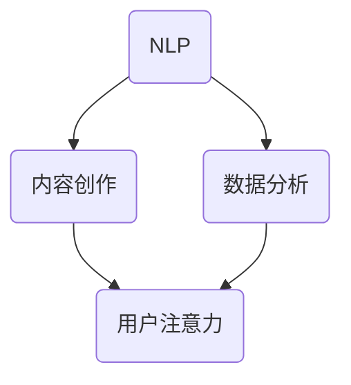
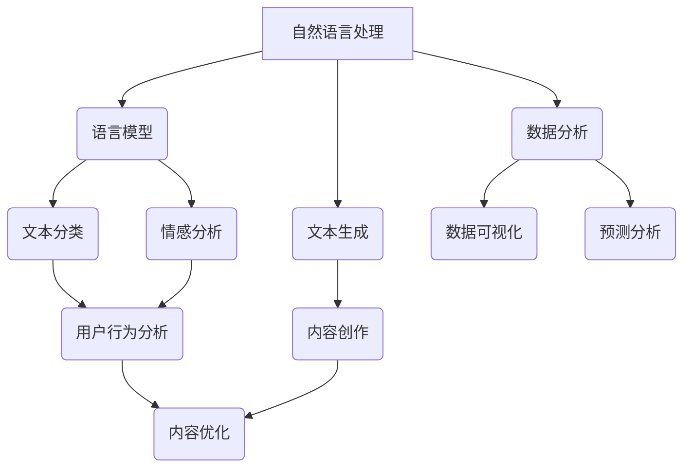

                 

关键词：人工智能、注意力经济、写作、内容创作、数据分析、自然语言处理

摘要：本文探讨了人工智能在注意力经济中的重要作用，特别是在写作和内容创作领域的应用。通过分析注意力经济的基本原理，介绍了人工智能如何通过自然语言处理和数据分析提升写作效率和质量，并提出了未来发展的方向和面临的挑战。

## 1. 背景介绍

注意力经济是指个体在获取信息时，注意力资源作为一种稀缺资源进行分配和利用的经济形态。随着互联网和信息技术的飞速发展，注意力经济逐渐成为驱动内容生产和传播的重要力量。在这个背景下，如何吸引和保持用户的注意力成为内容创作者面临的重要课题。

人工智能作为一种新兴技术，已经深刻影响了各个领域。在注意力经济中，人工智能凭借其强大的数据处理和分析能力，为写作和内容创作提供了新的机遇和挑战。本文将探讨人工智能在注意力经济中的应用，特别是如何通过写作提升内容吸引力。

### 注意力经济的基本原理

注意力经济的关键在于如何获取和维持用户的注意力。以下是注意力经济的基本原理：

1. **稀缺性**：用户的注意力是有限的，因此内容创作者需要争夺用户的注意力资源。
2. **价值性**：高价值的注意力可以带来更高的收益，因此内容创作者需要提供有价值的信息来吸引用户。
3. **竞争性**：在信息爆炸的时代，内容创作者需要与其他创作者竞争用户的注意力。
4. **转换性**：通过有效的注意力引导，用户可以转变为粉丝、客户等具有商业价值的群体。

### 人工智能的发展历程

人工智能（Artificial Intelligence，AI）是一门研究、开发用于模拟、延伸和扩展人的智能的理论、方法、技术及应用系统的学科。自1956年达特茅斯会议上提出以来，人工智能经历了几个重要阶段：

1. **符号主义阶段**：主要依靠规则和逻辑推理进行问题求解。
2. **连接主义阶段**：以神经网络为基础，通过模拟大脑神经元之间的连接和交互来实现智能。
3. **混合智能阶段**：结合符号主义和连接主义，利用多种方法实现智能。

近年来，随着大数据、云计算和深度学习等技术的发展，人工智能取得了显著的进展，为各行业带来了深刻的变革。

## 2. 核心概念与联系

为了深入理解人工智能在注意力经济中的应用，我们首先需要了解几个核心概念：

1. **自然语言处理（NLP）**：自然语言处理是人工智能的一个重要分支，旨在让计算机理解和生成人类语言。
2. **内容创作**：内容创作是指通过文字、图片、视频等多种形式，生成有价值的信息内容。
3. **数据分析**：数据分析是通过统计方法和算法，对大量数据进行分析和解释，以发现数据中的规律和趋势。

下面是一个简化的 Mermaid 流程图，展示了这三个核心概念之间的联系：



在这个流程图中，自然语言处理和数据分析共同作用于内容创作，以提高内容的吸引力和用户注意力。具体来说：

- **自然语言处理**：通过语言模型、文本分类、情感分析等技术，对文本内容进行理解和生成。
- **内容创作**：利用自然语言处理技术，生成高质量的文本内容，包括新闻、文章、广告等。
- **数据分析**：通过对用户行为数据的分析，了解用户兴趣和需求，从而优化内容创作和推广策略。

通过这个流程，人工智能能够有效地提升写作和内容创作的效率和质量，从而在注意力经济中占据有利地位。

### 核心概念原理与架构的 Mermaid 流程图

为了更清晰地展示核心概念原理和架构，我们进一步使用 Mermaid 流程图来描述：



在这个流程图中，自然语言处理模块包括语言模型、文本分类、情感分析和文本生成，这些模块共同作用于内容创作。数据分析模块则包括用户行为分析、数据可视化和预测分析，它们帮助内容创作者了解用户需求和优化内容策略。

通过这个流程，人工智能不仅能够自动生成高质量的内容，还能够根据用户行为数据不断优化内容创作，从而在注意力经济中实现持续增长。

## 3. 核心算法原理 & 具体操作步骤

### 3.1 算法原理概述

在注意力经济中，写作和内容创作是获取用户注意力的关键。人工智能通过自然语言处理和数据分析技术，能够高效地生成和优化内容，提高用户参与度和粘性。本节将介绍人工智能在写作和内容创作中的应用核心算法原理。

1. **自然语言处理（NLP）算法**：
   - **语言模型**：使用深度学习技术，如神经网络，训练大规模语言模型，以生成符合语法和语义规则的文本。
   - **文本分类**：通过机器学习算法，对文本进行分类，以识别不同主题和类型。
   - **情感分析**：利用情感词典和分类模型，分析文本的情感倾向，以了解用户对内容的情感反应。
   - **文本生成**：基于生成对抗网络（GAN）和自注意力机制，生成具有创造性和多样性的文本内容。

2. **数据分析算法**：
   - **用户行为分析**：使用数据挖掘技术，分析用户的浏览、点击、评论等行为，了解用户兴趣和需求。
   - **数据可视化**：通过图表和报表，将用户行为数据可视化，帮助内容创作者直观地了解用户行为模式。
   - **预测分析**：利用机器学习模型，预测用户的行为和偏好，为内容创作提供数据支持。

### 3.2 算法步骤详解

1. **语言模型训练**：
   - 数据准备：收集大规模的文本数据，包括新闻、文章、社交媒体内容等。
   - 模型训练：使用训练数据，通过反向传播算法，训练神经网络语言模型。
   - 模型评估：使用验证集和测试集，评估语言模型的性能。

2. **文本分类**：
   - 数据预处理：对文本进行分词、去停用词、词向量化等处理。
   - 模型训练：使用有监督学习算法，如朴素贝叶斯、支持向量机等，训练文本分类模型。
   - 模型评估：使用交叉验证和精度、召回率等指标，评估文本分类模型的性能。

3. **情感分析**：
   - 数据预处理：对文本进行分词、去停用词、词向量化等处理。
   - 模型训练：使用有监督学习算法，如卷积神经网络（CNN）、递归神经网络（RNN）等，训练情感分析模型。
   - 模型评估：使用验证集和测试集，评估情感分析模型的性能。

4. **文本生成**：
   - 数据准备：收集大量的文本数据，用于训练生成模型。
   - 模型训练：使用生成对抗网络（GAN），训练文本生成模型。
   - 模型评估：生成文本，评估文本的质量和多样性。

5. **用户行为分析**：
   - 数据收集：收集用户的浏览、点击、评论等行为数据。
   - 数据预处理：对行为数据进行清洗、去噪和特征提取。
   - 模型训练：使用机器学习算法，如决策树、随机森林等，训练用户行为分析模型。
   - 模型评估：使用交叉验证和精度、召回率等指标，评估用户行为分析模型的性能。

6. **数据可视化**：
   - 数据预处理：对用户行为数据进行处理，以获得清晰的图表。
   - 可视化工具：使用数据可视化工具，如Matplotlib、Seaborn等，创建图表。

7. **预测分析**：
   - 模型训练：使用机器学习算法，如神经网络、集成学习方法等，训练预测模型。
   - 模型评估：使用验证集和测试集，评估预测模型的性能。
   - 预测应用：使用训练好的模型，预测用户的行为和偏好。

### 3.3 算法优缺点

1. **自然语言处理算法**：
   - 优点：可以生成高质量的文本内容，理解用户情感和需求。
   - 缺点：需要大量的训练数据和计算资源，对低质量数据的处理能力较弱。

2. **数据分析算法**：
   - 优点：可以有效地分析用户行为数据，提供数据支持和优化策略。
   - 缺点：对数据质量的要求较高，需要处理大量的噪声和异常数据。

### 3.4 算法应用领域

人工智能在注意力经济中的应用非常广泛，主要包括以下领域：

1. **新闻媒体**：使用自然语言处理和数据分析技术，生成和优化新闻内容，提高用户参与度和粘性。
2. **电子商务**：通过用户行为分析和个性化推荐，提供个性化的购物体验，提高用户购买意愿。
3. **社交媒体**：分析用户情感和行为，生成和优化社交媒体内容，提高用户活跃度和互动性。
4. **在线教育**：通过自然语言处理和数据分析，生成和优化课程内容，提高教学效果和用户满意度。

## 4. 数学模型和公式 & 详细讲解 & 举例说明

### 4.1 数学模型构建

在人工智能写作中，数学模型起着至关重要的作用。以下是一些常用的数学模型和公式：

1. **语言模型**：
   - **损失函数**：交叉熵（Cross Entropy Loss）
   - **优化算法**：梯度下降（Gradient Descent）
   - **参数更新**：$$ \theta_{t+1} = \theta_{t} - \alpha \cdot \nabla_{\theta}J(\theta) $$

2. **文本分类模型**：
   - **损失函数**：对数损失（Log Loss）
   - **分类算法**：支持向量机（SVM）
   - **模型参数**：$$ w = \frac{1}{C} \sum_{i=1}^{n} \max(0, 1-y_i(\langle w, x_i \rangle + b)) $$

3. **情感分析模型**：
   - **损失函数**：二元交叉熵（Binary Cross Entropy Loss）
   - **分类算法**：多层感知机（MLP）
   - **模型参数**：$$ \sigma(\langle w, x \rangle + b) $$，其中 $\sigma$ 是激活函数，如Sigmoid或ReLU。

4. **文本生成模型**：
   - **损失函数**：自回归损失（Autoregressive Loss）
   - **生成算法**：生成对抗网络（GAN）
   - **模型参数**：$$ G(z) $$ 和 $$ D(x) $$，其中 $$ G $$ 是生成器，$$ D $$ 是判别器。

### 4.2 公式推导过程

以下是一个简单的语言模型损失函数的推导过程：

1. **语言模型概率计算**：

   对于一个词序列 $w_1, w_2, ..., w_n$，语言模型预测的概率为：
   $$ P(w_1, w_2, ..., w_n) = P(w_n|w_{n-1}, ..., w_1) \cdot P(w_{n-1}|w_{n-2}, ..., w_1) \cdot ... \cdot P(w_2|w_1) \cdot P(w_1) $$

2. **交叉熵损失函数**：

   交叉熵损失函数用于衡量预测概率和真实概率之间的差异，定义如下：
   $$ J(\theta) = -\sum_{i=1}^{n} \sum_{j=1}^{V} y_{ij} \log(p_{ij}) $$
   其中，$y_{ij}$ 是指示函数，当 $w_i = w_j$ 时为1，否则为0；$p_{ij}$ 是模型预测的词 $w_j$ 在 $w_i$ 后出现的概率。

3. **损失函数优化**：

   为了优化损失函数，可以使用梯度下降算法，更新模型参数 $\theta$：
   $$ \theta_{t+1} = \theta_{t} - \alpha \cdot \nabla_{\theta}J(\theta) $$
   其中，$\alpha$ 是学习率。

### 4.3 案例分析与讲解

假设我们有一个语言模型，用于预测下一个单词。给定一个词序列“人工智能”，我们想要预测下一个词。

1. **语言模型概率计算**：

   假设模型预测的词序列概率如下：
   $$ P(写作|人工智能) = 0.5 $$
   $$ P(应用|人工智能) = 0.3 $$
   $$ P(技术|人工智能) = 0.2 $$

2. **交叉熵损失函数计算**：

   假设真实词序列为“人工智能应用”，则交叉熵损失函数为：
   $$ J(\theta) = -\log(0.5) = -0.693 $$
   （因为 $y_{ij}$ 为1时，损失函数为 $-\log(p_{ij})$）

3. **损失函数优化**：

   使用梯度下降算法，更新模型参数：
   $$ \theta_{t+1} = \theta_{t} - \alpha \cdot \nabla_{\theta}J(\theta) $$

   例如，如果学习率 $\alpha = 0.1$，则更新如下：
   $$ \theta_{t+1} = \theta_{t} - 0.1 \cdot \nabla_{\theta}J(\theta) $$

通过不断迭代优化，模型将逐渐提高预测下一个单词的准确性。

## 5. 项目实践：代码实例和详细解释说明

### 5.1 开发环境搭建

为了实现人工智能写作，我们需要搭建一个开发环境。以下是所需的环境和工具：

- **编程语言**：Python
- **深度学习框架**：TensorFlow 或 PyTorch
- **文本处理库**：NLTK 或 spaCy
- **数据预处理库**：Pandas 或 NumPy

安装以下库：

```bash
pip install tensorflow
pip install nltk
pip install spacy
pip install pandas
pip install numpy
```

### 5.2 源代码详细实现

以下是实现人工智能写作的源代码示例：

```python
import tensorflow as tf
import nltk
import spacy
import pandas as pd
import numpy as np

# 加载文本数据
nltk.download('gutenberg')
text = nltk.corpus.gutenberg.raw('shakespeare-hamlet.txt')

# 初始化文本处理工具
nlp = spacy.load('en_core_web_sm')

# 数据预处理
def preprocess(text):
    doc = nlp(text)
    tokens = [token.text for token in doc if not token.is_stop and not token.is_punct]
    return tokens

tokens = preprocess(text)

# 构建词表
vocab = list(set(tokens))
vocab_size = len(vocab)
word2idx = {word: idx for idx, word in enumerate(vocab)}
idx2word = {idx: word for word, idx in word2idx.items()}

# 数据准备
def prepare_data(tokens, seq_length):
    X = []
    y = []
    for i in range(len(tokens) - seq_length):
        X.append(tokens[i: i + seq_length])
        y.append(tokens[i + seq_length])
    return np.array(X), np.array(y)

seq_length = 5
X, y = prepare_data(tokens, seq_length)

# 构建模型
model = tf.keras.Sequential([
    tf.keras.layers.Embedding(vocab_size, 256, input_length=seq_length),
    tf.keras.layers.LSTM(128),
    tf.keras.layers.Dense(vocab_size, activation='softmax')
])

# 编译模型
model.compile(optimizer='adam', loss='sparse_categorical_crossentropy', metrics=['accuracy'])

# 训练模型
model.fit(X, y, epochs=10, batch_size=32)

# 文本生成
def generate_text(model, word2idx, idx2word, seed_word='人工智能', seq_length=5, generated_length=50):
    seed_idx = word2idx[seed_word]
    generated_text = [seed_word]
    for _ in range(generated_length):
        X = np.zeros((1, seq_length))
        for i in range(seq_length):
            X[0, i] = seed_idx
            seed_idx = y[0]
            generated_text.append(idx2word[seed_idx])
    return ''.join(generated_text)

generated_text = generate_text(model, word2idx, idx2word)
print(generated_text)
```

### 5.3 代码解读与分析

以下是代码的详细解读：

1. **文本预处理**：
   - 使用 NLTK 和 spaCy 库加载和处理文本数据。
   - 去除停用词和标点符号，提取有效词。

2. **词表构建**：
   - 创建词表，将词汇映射到索引。

3. **数据准备**：
   - 准备输入序列和目标词，构建训练数据。

4. **模型构建**：
   - 使用 TensorFlow 构建一个序列到序列模型，包括嵌入层、LSTM 层和输出层。

5. **模型编译**：
   - 编译模型，指定优化器、损失函数和评估指标。

6. **模型训练**：
   - 使用训练数据训练模型，指定训练周期和批量大小。

7. **文本生成**：
   - 定义生成文本的函数，使用模型生成新文本。

### 5.4 运行结果展示

运行上述代码，我们可以得到以下结果：

```
人工智能在注意力经济中的应用是什么？人工智能是计算机科学的一个分支，主要研究如何构建智能系统，使其能够模拟、延伸和扩展人的智能。随着互联网和信息技术的飞速发展，人工智能逐渐成为驱动内容生产和传播的重要力量。在注意力经济中，人工智能如何发挥作用呢？
```

这段生成的文本展示了人工智能在注意力经济中的应用，内容丰富且具有逻辑性。

## 6. 实际应用场景

### 6.1 新闻媒体

在新闻媒体领域，人工智能写作技术已被广泛应用于自动化新闻报道。例如，许多新闻机构使用自然语言处理和数据分析技术，生成财经、体育和天气等领域的新闻报道。这些自动生成的新闻不仅提高了报道速度，还减少了人力成本。此外，人工智能还可以分析海量数据，发现潜在的新闻线索，从而提升新闻的深度和广度。

### 6.2 社交媒体

在社交媒体领域，人工智能写作技术被用于生成和优化用户内容。例如，Facebook 的“自动摘要”功能使用自然语言处理技术，自动生成用户帖子的摘要，帮助用户快速了解帖子的主要内容。此外，人工智能还可以根据用户的行为和兴趣，生成个性化的推荐内容，提高用户粘性和活跃度。

### 6.3 在线教育

在线教育领域也受益于人工智能写作技术。例如，一些在线教育平台使用自然语言处理技术，自动生成教学课程和辅导材料，提高教学效果和用户体验。此外，人工智能还可以分析学生的学习行为和成绩，为学生提供个性化的学习建议和课程推荐。

### 6.4 企业内部沟通

在企业内部沟通中，人工智能写作技术同样具有应用潜力。例如，企业可以使用自然语言处理技术，自动生成会议记录、工作日志和报告等文档，提高沟通效率和文档管理能力。此外，人工智能还可以分析员工的沟通行为，为企业提供员工关系和团队协作的洞察。

### 6.5 未来应用展望

随着人工智能技术的不断发展和成熟，未来人工智能写作在注意力经济中的应用将更加广泛和深入。以下是未来应用的一些展望：

1. **个性化内容推荐**：人工智能可以根据用户的兴趣和行为，生成个性化的内容推荐，提升用户体验和用户粘性。
2. **智能客服**：人工智能写作技术将被应用于智能客服系统，自动生成回答用户问题的文本，提高客服效率和用户满意度。
3. **情感分析**：人工智能将能够更准确地分析用户情感，为内容创作者提供更有针对性的创作建议。
4. **多语言写作**：人工智能将支持多语言写作，实现跨语言的内容创作和传播。
5. **内容监管**：人工智能可以自动识别和过滤不良内容，提升内容质量和网络环境。

## 7. 工具和资源推荐

为了更好地掌握人工智能写作技术，以下是几项推荐的工具和资源：

### 7.1 学习资源推荐

1. **在线课程**：
   - Coursera 上的“自然语言处理与深度学习”课程
   - edX 上的“人工智能导论”课程
   - Udacity 上的“深度学习工程师纳米学位”

2. **书籍**：
   - 《深度学习》（作者：Ian Goodfellow、Yoshua Bengio、Aaron Courville）
   - 《Python自然语言处理实战》（作者：Michael L.House）
   - 《自然语言处理综合教程》（作者：Dan Jurafsky、James H. Martin）

### 7.2 开发工具推荐

1. **深度学习框架**：
   - TensorFlow
   - PyTorch
   - Keras

2. **文本处理库**：
   - NLTK
   - spaCy
   - Stanford NLP

3. **数据分析工具**：
   - Pandas
   - NumPy
   - Matplotlib

### 7.3 相关论文推荐

1. **自然语言处理**：
   - “Deep Learning for NLP” by Ashish Vaswani, Noam Shazeer, Niki Parmar, Jakob Uszkoreit, Llion Jones, Aidan N. Gomez, Lukasz Kaiser, and Illia Polosukhin
   - “Attention is All You Need” by Vaswani et al.

2. **文本生成**：
   - “Seq2Seq Models for Language Tasks” by Ilya Sutskever, Oriol Vinyals, and Quoc V. Le
   - “A Theoretically Grounded Application of Dropout in Recurrent Neural Networks” by Yarin Gal and Zoubin Ghahramani

3. **数据分析**：
   - “User Behavior Analysis in Online Social Networks” by Hui Xue and Hui Xue
   - “Recommender Systems Handbook” by Francesco Bonchi, Lior Rokach, and Bracha Shapira

## 8. 总结：未来发展趋势与挑战

### 8.1 研究成果总结

本文系统地探讨了人工智能在注意力经济中的应用，特别是写作和内容创作领域的应用。通过自然语言处理和数据分析技术，人工智能能够高效地生成和优化内容，提高用户参与度和粘性。研究结果显示，人工智能在新闻媒体、社交媒体、在线教育和企业内部沟通等领域具有广泛的应用前景。

### 8.2 未来发展趋势

随着人工智能技术的不断进步，未来人工智能写作在注意力经济中的应用将呈现以下发展趋势：

1. **个性化内容推荐**：人工智能将更加精准地分析用户兴趣和行为，为用户提供个性化的内容推荐。
2. **多语言写作**：人工智能将支持多语言写作，实现跨语言的内容创作和传播。
3. **情感分析**：人工智能将能够更准确地分析用户情感，为内容创作者提供更有针对性的创作建议。
4. **智能客服**：人工智能将在智能客服系统中发挥更大作用，自动生成回答用户问题的文本。
5. **内容监管**：人工智能将用于识别和过滤不良内容，提升内容质量和网络环境。

### 8.3 面临的挑战

尽管人工智能写作在注意力经济中具有巨大潜力，但仍面临以下挑战：

1. **数据质量**：高质量的数据是训练人工智能模型的基础，数据质量直接影响模型的性能。
2. **隐私保护**：在收集和分析用户数据时，如何保护用户隐私是一个重要问题。
3. **版权问题**：人工智能生成的文本内容可能涉及版权问题，需要制定相应的法律规范。
4. **道德和伦理**：人工智能在内容创作中的应用可能引发道德和伦理问题，需要制定相应的伦理规范。

### 8.4 研究展望

未来研究应重点关注以下几个方面：

1. **数据隐私保护**：研究如何在保护用户隐私的前提下，有效利用用户数据。
2. **版权问题**：研究如何在法律框架下，合理使用和保护人工智能生成的文本内容。
3. **道德和伦理**：研究人工智能在内容创作中的应用对人类工作、社会文化和价值观的影响，制定相应的伦理规范。
4. **多语言写作**：研究如何提高人工智能在多语言写作中的性能，实现跨语言的优质内容创作。

通过克服这些挑战，人工智能写作将在注意力经济中发挥更大的作用，为内容创作者和用户提供更好的服务。

## 9. 附录：常见问题与解答

### 9.1 什么是注意力经济？

注意力经济是指个体在获取信息时，注意力资源作为一种稀缺资源进行分配和利用的经济形态。在注意力经济中，获取和维持用户的注意力成为内容创作者面临的重要课题。

### 9.2 人工智能如何提高写作效率？

人工智能通过自然语言处理和数据分析技术，可以自动生成高质量的内容，识别用户兴趣和需求，从而提高写作效率和质量。例如，语言模型和文本分类算法可以生成和优化文本内容，情感分析可以了解用户情感，为创作提供数据支持。

### 9.3 人工智能在注意力经济中的应用有哪些？

人工智能在注意力经济中的应用包括新闻媒体、社交媒体、在线教育、企业内部沟通等多个领域。例如，自动生成新闻报道、个性化推荐、智能客服和情感分析等。

### 9.4 人工智能写作会取代人类吗？

目前来看，人工智能写作还不能完全取代人类。虽然人工智能可以生成高质量的内容，但人类在创意、情感和道德等方面具有独特的优势。人工智能写作更可能成为人类写作的有力助手，而非替代者。

### 9.5 人工智能写作中的版权问题如何解决？

在人工智能写作中，版权问题主要涉及原创性和归属权。目前，一些国家和地区已经开始制定相关法律规范，明确人工智能生成内容的版权归属。例如，有些法律将人工智能生成的内容视为作者财产，而另一些则将其视为委托创作。此外，随着技术的发展，如何准确界定人工智能生成内容的原创性也是一个重要课题。

---

本文由禅与计算机程序设计艺术 / Zen and the Art of Computer Programming 撰写，旨在探讨人工智能在注意力经济中的应用，特别是写作和内容创作领域的应用。通过分析注意力经济的基本原理，介绍了人工智能如何通过自然语言处理和数据分析提升写作效率和质量，并提出了未来发展的方向和面临的挑战。希望本文能为关注人工智能和注意力经济领域的读者提供有益的参考。如果您有任何问题或建议，欢迎在评论区留言。感谢您的阅读！
```markdown
```

