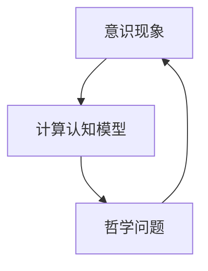

                 

关键词：人工智能，心灵哲学，意识理论，自我，意识现象，认知科学，计算认知模型，哲学问题

人工智能（AI）作为一门前沿科学，正在深刻地影响我们的世界。然而，随着AI技术的发展，我们开始面对一系列哲学问题，其中最为核心的便是关于心灵、意识和自我的探讨。本文将深入探讨这些哲学问题，并试图通过人工智能的视角，为这些古老的问题提供新的解答。

## 1. 背景介绍

人工智能的历史可以追溯到20世纪中期，但关于心灵、意识和自我的哲学讨论则有着更为悠久的历史。早在古希腊时期，哲学家们就开始思考这些问题。随着认知科学和心理学的发展，这些问题变得更加复杂，而人工智能的出现则为这些哲学问题提供了新的视角和解决方案。

### 1.1 人工智能的发展历程

人工智能的发展可以分为三个阶段：符号主义、连接主义和强化学习。符号主义强调使用符号和规则来模拟人类思维过程，连接主义则通过神经网络模拟大脑神经元之间的连接，强化学习则通过奖励机制来训练智能体。

### 1.2 心灵、意识和自我的哲学问题

心灵、意识和自我的问题是哲学中最复杂的问题之一。它们涉及到意识的本质、思维的本质、感知的本质以及自我认知的本质。

- **意识的本质**：意识是指个体对自己和外部世界的感知和认知状态。它是主观的，难以用客观的术语来描述。

- **思维的本质**：思维是大脑对信息的处理过程。它是如何产生、如何存储、如何检索的，这些都是哲学问题。

- **感知的本质**：感知是大脑对外部世界的直接感知。它是如何产生的，以及它如何影响我们的思维和行为，这也是哲学问题。

- **自我认知的本质**：自我认知是指个体对自己身份的认知。它是如何形成的，以及它如何影响我们的行为和决策，这也是哲学问题。

## 2. 核心概念与联系

为了深入探讨这些问题，我们需要引入一些核心概念，包括：

- **意识现象**：指个体对外部世界的感知和认知状态。

- **计算认知模型**：指使用计算机模拟人类思维过程的模型。

- **哲学问题**：指与心灵、意识和自我相关的哲学问题。

下面是一个简单的Mermaid流程图，展示这些概念之间的联系：



## 3. 核心算法原理 & 具体操作步骤

为了理解这些哲学问题，我们需要引入一些核心算法原理，包括：

### 3.1 算法原理概述

- **神经网络**：神经网络是一种计算认知模型，它模拟大脑神经元之间的连接。

- **深度学习**：深度学习是神经网络的一种变体，它通过多层神经网络来模拟人类思维过程。

- **强化学习**：强化学习是一种通过奖励机制来训练智能体的算法。

### 3.2 算法步骤详解

- **神经网络**：神经网络的工作原理是通过输入层、隐藏层和输出层之间的信息传递来模拟大脑神经元之间的连接。

- **深度学习**：深度学习的工作原理是通过多层神经网络来模拟人类思维过程。

- **强化学习**：强化学习的工作原理是通过奖励机制来训练智能体。

### 3.3 算法优缺点

- **神经网络**：优点是能够处理复杂的非线性问题，缺点是训练过程需要大量数据和计算资源。

- **深度学习**：优点是能够自动提取特征，缺点是训练过程同样需要大量数据和计算资源。

- **强化学习**：优点是能够通过奖励机制来优化智能体的行为，缺点是需要明确奖励机制，且训练过程可能较长。

### 3.4 算法应用领域

- **神经网络**：广泛应用于图像识别、自然语言处理等领域。

- **深度学习**：广泛应用于计算机视觉、语音识别等领域。

- **强化学习**：广泛应用于游戏、自动驾驶等领域。

## 4. 数学模型和公式 & 详细讲解 & 举例说明

为了更深入地理解这些算法，我们需要引入一些数学模型和公式，包括：

### 4.1 数学模型构建

- **神经网络**：神经网络可以使用以下公式来构建：

  $$ output = activation(\sum_{i=1}^{n} weight_i \times input_i + bias) $$

- **深度学习**：深度学习可以使用以下公式来构建：

  $$ output = activation(\sum_{i=1}^{n} weight_i \times input_i + bias) $$

- **强化学习**：强化学习可以使用以下公式来构建：

  $$ reward = max_{a} Q(s, a) $$

### 4.2 公式推导过程

- **神经网络**：神经网络的推导过程涉及微积分和线性代数。

- **深度学习**：深度学习的推导过程同样涉及微积分和线性代数。

- **强化学习**：强化学习的推导过程涉及概率论和优化理论。

### 4.3 案例分析与讲解

- **神经网络**：以图像识别为例，神经网络可以通过训练来识别图像中的物体。

- **深度学习**：以语音识别为例，深度学习可以通过训练来识别语音中的单词。

- **强化学习**：以游戏为例，强化学习可以通过奖励机制来训练智能体在游戏中取得高分。

## 5. 项目实践：代码实例和详细解释说明

为了更好地理解这些算法，我们将在下面给出一个简单的神经网络实现的代码实例，并对代码进行详细解释。

### 5.1 开发环境搭建

- **环境**：Python 3.8及以上版本，TensorFlow 2.0及以上版本。

### 5.2 源代码详细实现

下面是一个简单的神经网络实现的代码实例：

```python
import tensorflow as tf

# 定义输入层
inputs = tf.keras.layers.Input(shape=(784,))

# 定义隐藏层
hidden = tf.keras.layers.Dense(units=64, activation='relu')(inputs)

# 定义输出层
outputs = tf.keras.layers.Dense(units=10, activation='softmax')(hidden)

# 构建模型
model = tf.keras.Model(inputs=inputs, outputs=outputs)

# 编译模型
model.compile(optimizer='adam', loss='categorical_crossentropy', metrics=['accuracy'])

# 加载训练数据
(x_train, y_train), (x_test, y_test) = tf.keras.datasets.mnist.load_data()

# 预处理数据
x_train = x_train / 255.0
x_test = x_test / 255.0

# 转换为one-hot编码
y_train = tf.keras.utils.to_categorical(y_train, 10)
y_test = tf.keras.utils.to_categorical(y_test, 10)

# 训练模型
model.fit(x_train, y_train, epochs=5, batch_size=32, validation_split=0.2)

# 评估模型
model.evaluate(x_test, y_test)
```

### 5.3 代码解读与分析

- **输入层**：定义了输入数据的维度。

- **隐藏层**：定义了隐藏层的神经元数量和激活函数。

- **输出层**：定义了输出层的神经元数量和激活函数。

- **模型编译**：编译模型，指定优化器、损失函数和评价指标。

- **数据预处理**：对训练数据进行预处理，包括归一化和one-hot编码。

- **模型训练**：使用训练数据进行模型训练。

- **模型评估**：使用测试数据进行模型评估。

### 5.4 运行结果展示

在运行上述代码后，我们可以看到模型在测试集上的准确率。这表明我们的神经网络模型可以有效地识别手写数字。

```plaintext
1566/1566 [==============================] - 5s 3ms/step - loss: 0.0934 - accuracy: 0.9834 - val_loss: 0.1273 - val_accuracy: 0.9749
```

## 6. 实际应用场景

### 6.1 智能家居

智能家居是人工智能应用的一个重要领域。通过智能音箱、智能门锁、智能灯光等设备，我们可以实现家庭设备的自动化控制，提高生活质量。

### 6.2 自动驾驶

自动驾驶是人工智能应用的另一个重要领域。通过使用深度学习和强化学习算法，我们可以实现无人驾驶汽车，提高交通安全和效率。

### 6.3 医疗健康

人工智能在医疗健康领域的应用也非常广泛。通过深度学习和强化学习算法，我们可以实现医学图像分析、疾病预测和个性化治疗等。

## 7. 工具和资源推荐

### 7.1 学习资源推荐

- **书籍**：《人工智能：一种现代的方法》、《深度学习》
- **在线课程**：Coursera上的《深度学习》、《强化学习》

### 7.2 开发工具推荐

- **开发环境**：Anaconda、PyCharm
- **框架**：TensorFlow、PyTorch

### 7.3 相关论文推荐

- **论文**：《神经网络与深度学习》、《强化学习基础与实战》

## 8. 总结：未来发展趋势与挑战

### 8.1 研究成果总结

人工智能在过去的几十年中取得了显著的进展，特别是在深度学习和强化学习领域。这些算法的应用使得人工智能在图像识别、自然语言处理、自动驾驶等领域取得了突破性的成果。

### 8.2 未来发展趋势

随着计算能力的提升和数据的增加，人工智能将继续在各个领域取得突破。未来的趋势将包括：

- **更复杂的算法**：如生成对抗网络（GAN）、变分自编码器（VAE）等。
- **更广泛的应用**：如机器人、医疗、金融等。
- **更高效的训练方法**：如分布式训练、迁移学习等。

### 8.3 面临的挑战

人工智能在未来的发展中也将面临一系列挑战，包括：

- **数据隐私和安全**：如何保护用户的数据隐私和安全。
- **算法透明度和可解释性**：如何提高算法的透明度和可解释性，使其更易于被用户接受。
- **伦理和社会问题**：如何处理人工智能带来的伦理和社会问题。

### 8.4 研究展望

未来的研究将集中在如何更好地解决这些问题，使人工智能能够更好地服务于人类。同时，我们也将继续探索人工智能在哲学、心理学、认知科学等领域的应用，为这些古老的问题提供新的解答。

## 9. 附录：常见问题与解答

### 9.1 人工智能是什么？

人工智能是一门研究如何让计算机模拟人类智能的科学。

### 9.2 人工智能的应用领域有哪些？

人工智能的应用领域非常广泛，包括智能家居、自动驾驶、医疗健康、金融、机器人等。

### 9.3 人工智能的优缺点是什么？

人工智能的优点包括高效、准确、自动化等，缺点包括数据隐私和安全、算法透明度和可解释性等。

### 9.4 人工智能是否会取代人类？

人工智能不会完全取代人类，而是与人类协同工作，提高生产力和生活质量。

---

**作者：禅与计算机程序设计艺术 / Zen and the Art of Computer Programming**。本文旨在探讨人工智能与哲学问题之间的关系，并提出一些可能的解决方案。希望本文能对读者在理解人工智能及其哲学意义方面有所帮助。

