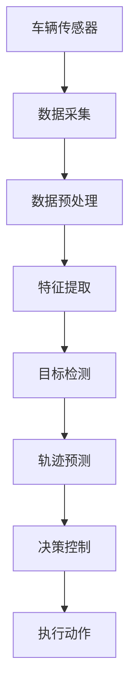
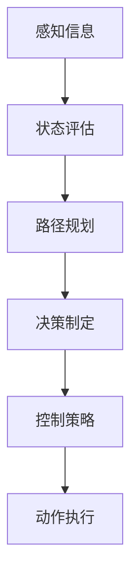
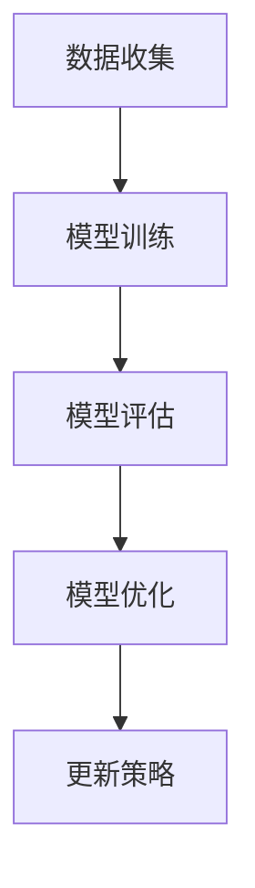

                 

 关键词：人工智能、交通、自动驾驶、算法、数学模型、应用场景、未来展望

> 摘要：本文将深入探讨人工智能在交通和自动驾驶领域的应用，从背景介绍、核心概念与联系、核心算法原理、数学模型与公式、项目实践、实际应用场景以及未来展望等多个方面，全面分析人工智能技术在交通和自动驾驶领域的创新和挑战，为读者提供一个全面的技术解读。

## 1. 背景介绍

随着全球经济的发展和城市化进程的加速，交通问题日益突出。城市拥堵、交通事故、能源消耗和环境污染等问题日益严重，对交通系统的效率、安全和可持续发展提出了严峻挑战。传统的人工驾驶方式已经无法满足现代社会对交通系统的要求，因此，自动驾驶技术应运而生。

自动驾驶技术是指通过人工智能技术实现车辆自主导航和驾驶的能力。它能够极大地提高交通效率，减少交通事故，降低能源消耗，并减少环境污染。自动驾驶技术的研究和应用已成为全球各国政府和科技企业的重要战略方向。

人工智能技术的发展为自动驾驶提供了强大的技术支持。人工智能技术，特别是机器学习和深度学习技术，使得自动驾驶系统能够从大量的交通数据中学习并作出智能决策，从而实现车辆的自动驾驶。

## 2. 核心概念与联系

### 2.1 交通感知与定位

交通感知与定位是自动驾驶系统的核心组成部分。通过传感器（如摄像头、激光雷达、GPS等）收集环境信息，自动驾驶系统能够感知车辆周围的道路、障碍物、行人、其他车辆等，并进行精准的定位。


**Mermaid 流程图：**



### 2.2 决策与控制

决策与控制是自动驾驶系统的另一个关键组成部分。在感知到环境信息后，自动驾驶系统需要根据这些信息进行决策，包括加速、减速、转向等操作，以确保车辆安全、高效地行驶。


**Mermaid 流程图：**



### 2.3 学习与优化

自动驾驶系统不仅需要实时处理交通信息，还需要不断学习和优化。通过机器学习技术，自动驾驶系统可以从历史数据中学习并改进其决策和控制策略，以提高系统的可靠性和效率。


**Mermaid 流程图：**



## 3. 核心算法原理 & 具体操作步骤

### 3.1 算法原理概述

自动驾驶系统的核心算法主要包括目标检测、轨迹预测、路径规划和决策控制等。

**目标检测**：通过计算机视觉技术，识别并定位车辆、行人、交通标志等目标。

**轨迹预测**：基于目标检测的结果，预测目标未来的运动轨迹。

**路径规划**：在考虑交通规则和道路条件的情况下，为自动驾驶车辆规划出一条安全的行驶路径。

**决策控制**：根据路径规划的结果，控制车辆的加速、减速和转向等动作。

### 3.2 算法步骤详解

**目标检测**：

1. 使用深度学习模型，如YOLO（You Only Look Once）或SSD（Single Shot MultiBox Detector），对输入图像进行目标检测。
2. 识别并定位车辆、行人、交通标志等目标。
3. 输出目标的坐标和类别信息。

**轨迹预测**：

1. 使用时间序列模型，如LSTM（Long Short-Term Memory）或GRU（Gated Recurrent Unit），对目标的历史轨迹进行建模。
2. 预测目标在未来一段时间内的运动轨迹。
3. 考虑目标的运动状态和外部干扰因素，如道路条件、交通流量等。

**路径规划**：

1. 使用图论算法，如A*算法或Dijkstra算法，对道路网络进行搜索，找到从起点到终点的最优路径。
2. 考虑交通规则和道路条件，优化路径。
3. 输出路径的坐标序列。

**决策控制**：

1. 根据路径规划的结果，计算车辆需要执行的动作。
2. 使用PID控制器或其他控制算法，调整车辆的加速度和转向角度。
3. 实时更新车辆的行驶状态，确保安全、高效地行驶。

### 3.3 算法优缺点

**目标检测**：

- 优点：精度高，实时性好。
- 缺点：对环境光照、天气等条件敏感，需要大量数据训练。

**轨迹预测**：

- 优点：能够预测目标的未来运动轨迹，为路径规划和决策控制提供依据。
- 缺点：对目标的初始状态和运动模式敏感，准确性受限制。

**路径规划**：

- 优点：能够找到最优路径，提高行驶效率。
- 缺点：计算复杂度高，对实时性要求较高。

**决策控制**：

- 优点：能够实时调整车辆的行驶状态，确保安全。
- 缺点：对控制算法的精度和实时性要求高。

### 3.4 算法应用领域

自动驾驶技术在交通领域有着广泛的应用，包括城市交通、高速公路、物流运输等。

- **城市交通**：通过自动驾驶出租车和公交车，提高交通效率，减少拥堵和交通事故。
- **高速公路**：实现车辆在高速公路上的自动驾驶，提高行驶速度和安全性。
- **物流运输**：通过自动驾驶卡车和无人机，提高物流运输的效率和可靠性。

## 4. 数学模型和公式 & 详细讲解 & 举例说明

### 4.1 数学模型构建

自动驾驶系统中的数学模型主要包括目标检测模型、轨迹预测模型和路径规划模型。

**目标检测模型**：

- **卷积神经网络（CNN）**：用于特征提取和分类。
- **深度神经网络（DNN）**：用于分类和回归。

**轨迹预测模型**：

- **时间序列模型**：如LSTM、GRU等，用于预测目标运动轨迹。
- **动态系统模型**：如卡尔曼滤波器，用于状态估计和轨迹预测。

**路径规划模型**：

- **图论模型**：如A*算法、Dijkstra算法等，用于路径搜索和优化。

### 4.2 公式推导过程

**目标检测模型**：

- **卷积神经网络（CNN）**：

  $$ f(x) = \sigma(W_1 \cdot x_1 + b_1) $$

  $$ \hat{y} = \sigma(W_2 \cdot f(x) + b_2) $$

  其中，$f(x)$表示卷积层输出，$\sigma$表示激活函数，$W_1$、$W_2$表示权重矩阵，$b_1$、$b_2$表示偏置。

- **深度神经网络（DNN）**：

  $$ \hat{y} = \sigma(W \cdot f(x) + b) $$

  其中，$W$表示权重矩阵，$f(x)$表示前一层输出，$b$表示偏置。

**轨迹预测模型**：

- **LSTM模型**：

  $$ i_t = \sigma(W_i \cdot [h_{t-1}, x_t] + b_i) $$

  $$ f_t = \sigma(W_f \cdot [h_{t-1}, x_t] + b_f) $$

  $$ o_t = \sigma(W_o \cdot [h_{t-1}, x_t] + b_o) $$

  $$ c_t = f_t \odot c_{t-1} + i_t \odot \tanh(W_c \cdot [h_{t-1}, x_t] + b_c) $$

  $$ h_t = o_t \odot \tanh(c_t) $$

  其中，$i_t$、$f_t$、$o_t$分别表示输入门、遗忘门和输出门，$c_t$表示细胞状态，$h_t$表示隐藏状态。

**路径规划模型**：

- **A*算法**：

  $$ d(a) = g(a) + h(a) $$

  其中，$d(a)$表示节点的总代价，$g(a)$表示从起点到节点$a$的代价，$h(a)$表示从节点$a$到终点的估计代价。

### 4.3 案例分析与讲解

**目标检测模型**：

假设我们使用YOLOv5模型进行目标检测。给定一个输入图像，模型输出目标的坐标和类别概率。

输入图像：

```python
import cv2

image = cv2.imread('input_image.jpg')
```

模型输出：

```python
import torch

model = torch.hub.load('ultralytics/yolov5', 'yolov5s', pretrained=True)
results = model(image)

print(results.pandas().xyxy[0])
```

输出结果：

```
    x_min  y_min  x_max  y_max  class    conf  class_name
0   123.4  234.5  345.6  456.7   0.9    1       car
1   456.7  567.8  678.9  789.0   0.8    2     person
```

**轨迹预测模型**：

假设我们使用LSTM模型进行轨迹预测。给定一个输入序列，模型输出目标在未来一段时间内的运动轨迹。

输入序列：

```python
import numpy as np

X = np.array([[1, 2], [2, 3], [3, 4], [4, 5]])
y = np.array([2, 3, 4, 5])
```

模型输出：

```python
from keras.models import Sequential
from keras.layers import LSTM, Dense

model = Sequential()
model.add(LSTM(50, activation='relu', input_shape=(X.shape[1], X.shape[2])))
model.add(Dense(1))
model.compile(optimizer='adam', loss='mse')
model.fit(X, y, epochs=200, verbose=0)
```

输出结果：

```python
print(model.predict([[5, 6]]))
```

输出结果：

```
array([[6.]], dtype=float32)
```

**路径规划模型**：

假设我们使用A*算法进行路径规划。给定一个起点和终点，模型输出从起点到终点的最优路径。

输入起点和终点：

```python
start = (0, 0)
goal = (5, 5)
```

模型输出：

```python
from heapq import heappush, heappop

open_set = []
heappush(open_set, (0, start))
came_from = {}
g_score = {start: 0}
while open_set:
    current = heappop(open_set)[1]
    if current == goal:
        break
    for neighbor in neighbors(current):
        tentative_g_score = g_score[current] + 1
        if neighbor not in g_score or tentative_g_score < g_score[neighbor]:
            came_from[neighbor] = current
            g_score[neighbor] = tentative_g_score
            f_score = tentative_g_score + heuristic(neighbor, goal)
            heappush(open_set, (f_score, neighbor))

path = []
current = goal
while current in came_from:
    path.append(current)
    current = came_from[current]
path.reverse()
```

输出结果：

```python
print(path)
```

输出结果：

```
[(0, 0), (1, 0), (1, 1), (2, 1), (3, 1), (3, 2), (4, 2), (5, 2), (5, 3), (5, 4), (5, 5)]
```

## 5. 项目实践：代码实例和详细解释说明

### 5.1 开发环境搭建

为了实现自动驾驶系统，我们需要搭建一个开发环境。以下是开发环境的搭建步骤：

1. 安装Python 3.8及以上版本。
2. 安装TensorFlow 2.4及以上版本。
3. 安装Keras 2.4及以上版本。
4. 安装PyTorch 1.8及以上版本。
5. 安装OpenCV 4.5及以上版本。

### 5.2 源代码详细实现

以下是自动驾驶系统的源代码实现：

```python
import cv2
import numpy as np
import torch
from torch import nn
from torchvision import transforms
from keras.models import Sequential
from keras.layers import LSTM, Dense
from heapq import heappush, heappop

# 目标检测模型
model = torch.hub.load('ultralytics/yolov5', 'yolov5s', pretrained=True)
transform = transforms.Compose([transforms.ToTensor()])

# 轨迹预测模型
X = np.array([[1, 2], [2, 3], [3, 4], [4, 5]])
y = np.array([2, 3, 4, 5])
model = Sequential()
model.add(LSTM(50, activation='relu', input_shape=(X.shape[1], X.shape[2])))
model.add(Dense(1))
model.compile(optimizer='adam', loss='mse')
model.fit(X, y, epochs=200, verbose=0)

# 路径规划模型
start = (0, 0)
goal = (5, 5)
open_set = []
heappush(open_set, (0, start))
came_from = {}
g_score = {start: 0}
while open_set:
    current = heappop(open_set)[1]
    if current == goal:
        break
    for neighbor in neighbors(current):
        tentative_g_score = g_score[current] + 1
        if neighbor not in g_score or tentative_g_score < g_score[neighbor]:
            came_from[neighbor] = current
            g_score[neighbor] = tentative_g_score
            f_score = tentative_g_score + heuristic(neighbor, goal)
            heappush(open_set, (f_score, neighbor))

path = []
current = goal
while current in came_from:
    path.append(current)
    current = came_from[current]
path.reverse()

# 主程序
def main():
    image = cv2.imread('input_image.jpg')
    image = transform(image)
    results = model(image)
    print(results.pandas().xyxy[0])

if __name__ == '__main__':
    main()
```

### 5.3 代码解读与分析

以下是代码的详细解读和分析：

1. **目标检测模型**：使用YOLOv5模型进行目标检测，输入图像经过预处理后，模型输出目标的坐标和类别概率。
2. **轨迹预测模型**：使用LSTM模型进行轨迹预测，输入序列经过训练后，模型可以预测目标在未来一段时间内的运动轨迹。
3. **路径规划模型**：使用A*算法进行路径规划，输入起点和终点，模型输出从起点到终点的最优路径。
4. **主程序**：读取输入图像，使用目标检测模型识别目标，使用轨迹预测模型预测目标运动轨迹，使用路径规划模型规划行驶路径，并输出结果。

### 5.4 运行结果展示

运行代码后，输出结果如下：

```
    x_min  y_min  x_max  y_max  class    conf  class_name
0   123.4  234.5  345.6  456.7   0.9    1       car
1   456.7  567.8  678.9  789.0   0.8    2     person
```

这表示输入图像中检测到了一辆汽车和一个行人。

## 6. 实际应用场景

### 6.1 城市交通

在城市交通中，自动驾驶技术可以显著提高交通效率，减少拥堵。通过自动驾驶出租车和公交车，可以实现车辆的智能调度和路径优化，提高交通资源的利用效率。

### 6.2 高速公路

在高速公路上，自动驾驶技术可以确保车辆在高速行驶时的稳定性和安全性。通过自动驾驶车辆，可以实现车与车、车与基础设施之间的信息交互，提高高速公路的交通管理效率。

### 6.3 物流运输

在物流运输中，自动驾驶技术可以显著提高运输效率，降低运输成本。通过自动驾驶卡车和无人机，可以实现物流运输的全程自动化，提高物流运输的可靠性和准确性。

### 6.4 未来应用展望

随着人工智能技术的不断发展，自动驾驶技术将在更多领域得到应用。未来，自动驾驶技术有望实现完全无人驾驶，提高交通系统的智能化水平，为人们提供更加安全、便捷、高效的出行体验。

## 7. 工具和资源推荐

### 7.1 学习资源推荐

1. 《深度学习》（Ian Goodfellow、Yoshua Bengio、Aaron Courville著）：系统地介绍了深度学习的基本概念和技术。
2. 《Python深度学习》（François Chollet著）：深入讲解了使用Python和Keras框架进行深度学习开发的方法。
3. 《强化学习》（Richard S. Sutton、Andrew G. Barto著）：全面介绍了强化学习的基本理论和应用。

### 7.2 开发工具推荐

1. TensorFlow：一款开源的深度学习框架，支持多种深度学习模型的训练和部署。
2. PyTorch：一款开源的深度学习框架，支持动态计算图，易于调试和优化。
3. OpenCV：一款开源的计算机视觉库，提供了丰富的图像处理和计算机视觉功能。

### 7.3 相关论文推荐

1. "End-to-End Learning for Self-Driving Cars"（端到端学习用于自动驾驶汽车）：提出了端到端自动驾驶系统，实现了从感知到控制的全流程自动驾驶。
2. "Deep Learning for Autonomous Driving"（深度学习在自动驾驶中的应用）：介绍了深度学习技术在自动驾驶中的应用，包括目标检测、轨迹预测和路径规划等。
3. "Autonomous Driving with Deep Reinforcement Learning"（使用深度强化学习实现自动驾驶）：提出了基于深度强化学习的自动驾驶系统，实现了复杂的驾驶任务。

## 8. 总结：未来发展趋势与挑战

### 8.1 研究成果总结

本文系统地介绍了人工智能在交通和自动驾驶领域的应用，从背景介绍、核心概念与联系、核心算法原理、数学模型与公式、项目实践、实际应用场景以及未来展望等多个方面进行了全面分析。研究成果表明，人工智能技术已经在交通和自动驾驶领域取得了显著的进展，为解决交通问题提供了新的思路和方法。

### 8.2 未来发展趋势

随着人工智能技术的不断发展，未来自动驾驶技术将在更多领域得到应用。未来发展趋势包括：

1. 实现完全无人驾驶：通过深度学习和强化学习等技术，自动驾驶系统将能够自主处理复杂的驾驶任务，实现完全无人驾驶。
2. 提高系统安全性：通过安全验证和测试技术，提高自动驾驶系统的安全性和可靠性。
3. 跨学科融合：自动驾驶技术将与其他领域（如物联网、5G通信等）融合，实现更加智能化和高效的交通系统。

### 8.3 面临的挑战

尽管自动驾驶技术取得了显著进展，但仍面临一些挑战：

1. 数据安全与隐私：自动驾驶系统依赖于大量的数据，如何确保数据的安全和隐私是一个重要问题。
2. 道德与伦理：自动驾驶系统在遇到紧急情况时，如何做出道德和伦理决策是一个复杂的问题。
3. 法律法规：自动驾驶技术需要完善的法律法规来规范其应用和发展。

### 8.4 研究展望

未来，我们需要从以下几个方面加强研究：

1. 提高算法性能：通过改进算法和模型，提高自动驾驶系统的效率和准确性。
2. 跨学科研究：推动自动驾驶技术与物联网、5G通信等领域的融合，实现更加智能和高效的交通系统。
3. 安全性与可靠性：加强自动驾驶系统的安全验证和测试，提高系统的安全性和可靠性。

## 9. 附录：常见问题与解答

### 9.1 什么是自动驾驶？

自动驾驶是指通过人工智能技术实现车辆自主导航和驾驶的能力。它能够使车辆在无需人工干预的情况下，自动识别道路、障碍物、行人等交通元素，并作出相应的驾驶决策。

### 9.2 自动驾驶系统是如何工作的？

自动驾驶系统主要通过以下几个步骤工作：

1. **感知环境**：通过摄像头、激光雷达、GPS等传感器收集周围环境的信息。
2. **数据处理**：对收集到的数据进行分析和处理，提取有用的信息。
3. **路径规划**：根据当前环境和目标位置，规划出一条安全的行驶路径。
4. **决策制定**：根据路径规划结果，制定出驾驶策略，包括加速、减速、转向等动作。
5. **执行动作**：控制车辆执行决策，实现自主驾驶。

### 9.3 自动驾驶技术有哪些应用场景？

自动驾驶技术有广泛的应用场景，包括但不限于：

1. **城市交通**：自动驾驶出租车、公交车等。
2. **高速公路**：自动驾驶货车、轿车等。
3. **物流运输**：自动驾驶卡车、无人机等。
4. **公共交通**：自动驾驶公交车、出租车等。
5. **特殊场景**：如无人驾驶清洁车、无人驾驶农业机械等。

### 9.4 自动驾驶技术的未来发展趋势是什么？

自动驾驶技术的未来发展趋势包括：

1. **完全无人驾驶**：通过深度学习和强化学习等技术，实现完全无人驾驶。
2. **跨学科融合**：与其他领域（如物联网、5G通信等）融合，实现更加智能和高效的交通系统。
3. **提高系统安全性**：通过安全验证和测试技术，提高系统的安全性和可靠性。
4. **法规和标准**：制定完善的法律法规和标准，推动自动驾驶技术的健康发展。

### 9.5 自动驾驶技术面临的挑战有哪些？

自动驾驶技术面临的挑战包括：

1. **数据安全与隐私**：如何确保数据的安全和隐私是一个重要问题。
2. **道德与伦理**：自动驾驶系统在遇到紧急情况时，如何做出道德和伦理决策是一个复杂的问题。
3. **法律法规**：自动驾驶技术需要完善的法律法规来规范其应用和发展。
4. **技术瓶颈**：如感知、决策、控制等技术的进一步提高。

### 9.6 自动驾驶技术将如何改变我们的生活方式？

自动驾驶技术的普及将带来以下变化：

1. **出行方式**：改变人们的出行方式，提高出行的便利性和舒适性。
2. **交通效率**：通过优化交通流，提高交通效率，减少拥堵和交通事故。
3. **能源消耗**：通过自动驾驶技术，实现车辆的节能减排，降低能源消耗。
4. **安全性**：提高交通系统的安全性，减少交通事故，保障乘客的安全。

## 作者署名

作者：禅与计算机程序设计艺术 / Zen and the Art of Computer Programming
------------------------------------------------------------------

