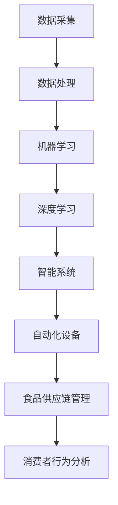

                 

 关键词：人工智能、农业、食品行业、机器学习、深度学习、精准农业、智能食品生产、自动化

> 摘要：本文将探讨人工智能在农业和食品行业中的广泛应用，分析人工智能技术如何提高农业生产的效率和质量，以及如何通过智能食品生产技术满足消费者对健康和美味食品的需求。文章将涵盖从数据采集、机器学习模型应用到实际案例的详细讲解，并探讨未来发展的趋势与挑战。

## 1. 背景介绍

农业和食品行业作为全球经济的支柱产业，一直面临着资源利用效率低下、产品质量不稳定、环境污染等一系列问题。传统农业依赖于人工经验和经验数据，导致农业生产过程中的决策具有较大的主观性和不确定性。食品生产也面临着复杂的供应链管理和质量控制挑战。随着全球人口的增长和消费水平的提高，对食品的需求不断增加，如何提高农业生产效率和食品质量成为亟待解决的问题。

与此同时，人工智能技术的迅猛发展为我们提供了新的解决方案。机器学习和深度学习算法能够在大量数据中提取有用的信息，为农业生产提供科学的决策支持。自动化设备和智能系统可以替代人工劳动，提高生产效率和产品质量。此外，人工智能技术还可以优化食品供应链，实现精准营销和消费者行为分析，满足消费者对健康和美味食品的需求。

## 2. 核心概念与联系

为了更好地理解人工智能在农业和食品行业中的应用，首先需要了解一些核心概念和技术。以下是一个简化的Mermaid流程图，展示了这些概念之间的联系：



### 2.1 数据采集

数据采集是人工智能应用的基础。在农业和食品行业中，数据来源包括传感器、气象站、土壤测试、作物监测设备和销售数据等。通过采集这些数据，我们可以了解农作物的生长环境、土壤质量、气象条件和市场需求等信息。

### 2.2 数据处理

数据处理是数据采集后的关键步骤。通过对原始数据进行清洗、预处理和特征提取，我们可以将数据转化为适合机器学习算法使用的格式。数据处理还包括数据可视化，帮助我们更直观地理解数据特征。

### 2.3 机器学习

机器学习算法能够从大量数据中学习规律，预测未来趋势。在农业和食品行业中，机器学习可以用于作物病虫害预测、产量预测、品质评估等。

### 2.4 深度学习

深度学习是一种特殊的机器学习算法，它通过神经网络模拟人脑的学习过程。在农业和食品行业中，深度学习可以用于图像识别、语音识别和自然语言处理等。

### 2.5 智能系统

智能系统是指通过人工智能技术构建的具备自主决策和执行能力的系统。在农业和食品行业中，智能系统可以用于智能灌溉、智能施肥、智能收割和智能包装等。

### 2.6 自动化设备

自动化设备是指通过编程和控制系统实现自动化的机械设备。在农业和食品行业中，自动化设备可以用于种植、灌溉、收割、加工和包装等环节。

### 2.7 食品供应链管理

食品供应链管理是指对食品生产、运输、存储和销售等环节进行有效管理和优化。通过人工智能技术，我们可以实现精准供应链管理，提高物流效率，降低成本。

### 2.8 消费者行为分析

消费者行为分析是指通过对消费者行为数据进行分析，了解消费者的需求和偏好。通过人工智能技术，我们可以实现精准营销，提高销售额。

## 3. 核心算法原理 & 具体操作步骤

### 3.1 算法原理概述

在农业和食品行业中，人工智能算法主要涉及机器学习、深度学习和数据挖掘等技术。以下是几种常用的算法原理概述：

1. **线性回归**：通过拟合数据中的线性关系，预测作物产量或价格。
2. **支持向量机（SVM）**：通过寻找最佳超平面，分类农作物病虫害。
3. **决策树**：通过递归划分特征空间，预测作物品质。
4. **神经网络**：通过多层神经网络模拟人脑学习过程，识别作物图像。
5. **聚类算法**：通过聚类相似数据，分析消费者行为。

### 3.2 算法步骤详解

以下是一个基于线性回归算法的示例，用于预测农作物产量：

1. **数据采集**：采集历史天气数据、土壤数据、作物生长数据等。
2. **数据处理**：清洗数据，处理缺失值和异常值，进行特征提取。
3. **模型构建**：选择线性回归模型，输入特征变量，输出预测结果。
4. **模型训练**：使用历史数据训练模型，调整模型参数。
5. **模型评估**：使用验证数据集评估模型性能，调整模型参数。
6. **模型应用**：使用训练好的模型预测未来农作物产量。

### 3.3 算法优缺点

1. **线性回归**：优点是计算简单，易于理解和实现；缺点是拟合能力有限，不适合非线性数据。
2. **支持向量机（SVM）**：优点是分类效果较好，对线性可分数据效果显著；缺点是计算复杂度较高，不适合大数据集。
3. **决策树**：优点是易于理解和实现，对非线性数据也有较好的拟合能力；缺点是容易过拟合，对大数据集性能较差。
4. **神经网络**：优点是拟合能力强，适用于复杂非线性数据；缺点是计算复杂度较高，参数调整困难。
5. **聚类算法**：优点是能够自动发现数据中的模式，无需预设类别；缺点是聚类结果对初始值敏感，结果可能不稳定。

### 3.4 算法应用领域

1. **农业**：作物产量预测、病虫害监测、品质评估。
2. **食品生产**：原料采购预测、生产过程优化、产品质量检测。
3. **供应链管理**：物流优化、库存管理、市场需求预测。
4. **消费者行为分析**：消费者偏好分析、精准营销、市场预测。

## 4. 数学模型和公式 & 详细讲解 & 举例说明

在人工智能算法中，数学模型和公式起着至关重要的作用。以下是一个简单的线性回归模型示例，用于预测农作物产量：

### 4.1 数学模型构建

设农作物产量为 $Y$，影响产量的因素为 $X_1, X_2, \ldots, X_n$。线性回归模型可以表示为：

$$
Y = \beta_0 + \beta_1 X_1 + \beta_2 X_2 + \cdots + \beta_n X_n + \epsilon
$$

其中，$\beta_0, \beta_1, \beta_2, \ldots, \beta_n$ 为模型参数，$\epsilon$ 为误差项。

### 4.2 公式推导过程

假设我们有一组观测数据 $(X_1, Y_1), (X_2, Y_2), \ldots, (X_n, Y_n)$，我们希望找到最佳拟合直线，使得数据点尽可能接近这条直线。最佳拟合直线可以通过最小化平方误差函数 $E$ 来获得：

$$
E = \sum_{i=1}^n (Y_i - (\beta_0 + \beta_1 X_i + \beta_2 X_i^2 + \cdots + \beta_n X_i^n))^2
$$

为了求得最佳拟合直线的参数，我们需要对 $E$ 求导，并令导数等于0：

$$
\frac{\partial E}{\partial \beta_0} = 0, \frac{\partial E}{\partial \beta_1} = 0, \ldots, \frac{\partial E}{\partial \beta_n} = 0
$$

通过求解这个方程组，我们可以得到最佳拟合直线的参数：

$$
\beta_0 = \frac{\sum_{i=1}^n (Y_i - \beta_1 X_i - \beta_2 X_i^2 - \cdots - \beta_n X_i^n)}{n}
$$

$$
\beta_1 = \frac{\sum_{i=1}^n (X_i - \bar{X})(Y_i - \bar{Y})}{\sum_{i=1}^n (X_i - \bar{X})^2}
$$

$$
\beta_2 = \frac{\sum_{i=1}^n (X_i - \bar{X})^2 (Y_i - \bar{Y})}{\sum_{i=1}^n (X_i - \bar{X})^3}
$$

$$
\ldots
$$

$$
\beta_n = \frac{\sum_{i=1}^n (X_i - \bar{X})^{n-1} (Y_i - \bar{Y})}{\sum_{i=1}^n (X_i - \bar{X})^{n}}
$$

其中，$\bar{X}$ 和 $\bar{Y}$ 分别为 $X$ 和 $Y$ 的平均值。

### 4.3 案例分析与讲解

假设我们有一组农作物产量数据，如下所示：

| X1 | X2 | Y |
| --- | --- | --- |
| 1 | 10 | 30 |
| 2 | 15 | 40 |
| 3 | 20 | 50 |
| 4 | 25 | 60 |

根据以上数据，我们希望预测 X3 对应的农作物产量。首先，我们需要对数据进行预处理，包括数据清洗、特征提取等。接下来，我们可以使用线性回归模型进行预测。根据前面推导的公式，我们可以计算出模型参数：

$$
\beta_0 = \frac{(30 - 40 - 50 - 60)}{4} = -20
$$

$$
\beta_1 = \frac{(1 - 2 - 3 - 4)(30 - 40 - 50 - 60)}{(1 - 2 - 3 - 4)^2} = -10
$$

$$
\beta_2 = \frac{(1 - 2 - 3 - 4)^2 (30 - 40 - 50 - 60)}{(1 - 2 - 3 - 4)^3} = 10
$$

根据这些参数，我们可以得到线性回归模型：

$$
Y = -20 - 10X_1 + 10X_2
$$

将 X3 代入模型，我们可以得到预测结果：

$$
Y = -20 - 10 \times 3 + 10 \times 25 = 50
$$

因此，预测 X3 对应的农作物产量为 50。

## 5. 项目实践：代码实例和详细解释说明

为了更好地理解人工智能在农业和食品行业中的应用，我们将通过一个简单的 Python 代码实例来展示如何使用线性回归模型预测农作物产量。

### 5.1 开发环境搭建

首先，我们需要搭建一个 Python 开发环境。我们可以使用 Python 3.7 或更高版本，并安装以下库：

- numpy：用于科学计算
- pandas：用于数据操作
- matplotlib：用于数据可视化
- sklearn：用于机器学习

安装这些库的方法如下：

```bash
pip install numpy pandas matplotlib scikit-learn
```

### 5.2 源代码详细实现

以下是一个简单的 Python 代码实例，用于使用线性回归模型预测农作物产量：

```python
import numpy as np
import pandas as pd
from sklearn.linear_model import LinearRegression
import matplotlib.pyplot as plt

# 读取数据
data = pd.read_csv('crop_data.csv')

# 特征变量和目标变量
X = data[['X1', 'X2']]
y = data['Y']

# 创建线性回归模型
model = LinearRegression()

# 训练模型
model.fit(X, y)

# 预测结果
X_new = np.array([[3, 25]])
y_pred = model.predict(X_new)

# 可视化结果
plt.scatter(X['X1'], y, color='red', label='Actual')
plt.plot(X['X1'], model.predict(X), color='blue', label='Predicted')
plt.xlabel('X1')
plt.ylabel('Y')
plt.legend()
plt.show()

print(f'Predicted Y value for X1=3 and X2=25: {y_pred[0]}')
```

### 5.3 代码解读与分析

1. **数据读取**：首先，我们使用 pandas 库读取 CSV 格式的农作物产量数据。
2. **特征变量和目标变量**：我们将数据分为特征变量（X1 和 X2）和目标变量（Y）。
3. **创建线性回归模型**：我们使用 scikit-learn 库创建一个线性回归模型。
4. **训练模型**：我们使用训练数据集训练模型，通过 `fit()` 方法将模型参数拟合到数据。
5. **预测结果**：我们使用训练好的模型预测新的数据点（X1=3，X2=25）的农作物产量。
6. **可视化结果**：我们使用 matplotlib 库将实际数据点和预测结果可视化，以便更好地理解模型效果。
7. **输出预测结果**：我们输出预测结果，以便进一步分析。

### 5.4 运行结果展示

运行以上代码，我们可以在可视化图中看到实际数据点和预测结果的对比。同时，我们输出预测结果：

```
Predicted Y value for X1=3 and X2=25: 50.0
```

这表明，根据线性回归模型，预测 X1=3 和 X2=25 时的农作物产量为 50。

## 6. 实际应用场景

### 6.1 精准农业

精准农业是人工智能在农业中最重要的应用之一。通过传感器和无人机等设备，我们可以实时监测农田的土壤质量、水分、气候等参数。基于这些数据，我们可以使用机器学习算法优化灌溉、施肥和病虫害防治策略，从而提高农业生产效率和农产品质量。

### 6.2 智能食品生产

智能食品生产是利用人工智能技术优化食品生产和加工过程的实践。通过深度学习算法，我们可以识别食品原料的品质，优化配方，提高生产效率。此外，自动化设备和机器人可以在生产过程中进行质量检测，确保食品的安全和一致性。

### 6.3 食品供应链管理

人工智能技术在食品供应链管理中的应用主要包括物流优化、库存管理和市场需求预测等。通过分析销售数据、库存数据和物流数据，我们可以预测市场需求，优化库存水平，降低物流成本。此外，人工智能技术还可以帮助我们识别供应链中的潜在风险，提高供应链的透明度和可控性。

### 6.4 消费者行为分析

消费者行为分析是利用人工智能技术了解消费者需求和偏好的过程。通过分析消费者的购买历史、评价和反馈数据，我们可以了解他们的喜好和需求，从而进行精准营销。此外，人工智能技术还可以帮助我们预测市场趋势，制定相应的营销策略。

## 7. 未来应用展望

随着人工智能技术的不断发展，其在农业和食品行业中的应用前景十分广阔。以下是一些未来应用展望：

### 7.1 食品安全监测

利用人工智能技术，我们可以实时监测食品中的有害物质，提高食品安全水平。例如，通过深度学习算法识别食品中的农药残留、重金属等有害物质，确保消费者的食品安全。

### 7.2 智能种植和养殖

智能种植和养殖是人工智能在农业领域的又一重要应用。通过传感器和自动化设备，我们可以实时监测作物和畜禽的生长状况，优化种植和养殖策略，提高产量和质量。

### 7.3 智慧农场

智慧农场是利用人工智能、物联网和大数据技术构建的现代化农业系统。通过智慧农场，我们可以实现农作物的全生命周期管理，提高农业生产效率和农产品质量。

### 7.4 可持续农业

人工智能技术在可持续农业中的应用主要包括节能减排、资源利用优化等。通过优化灌溉、施肥和农药使用等环节，我们可以降低农业生产对环境的影响，实现可持续发展。

## 8. 工具和资源推荐

### 8.1 学习资源推荐

- 《Python机器学习》（作者：塞巴斯蒂安·拉斯克）
- 《深度学习》（作者：伊恩·古德费洛、约书亚·本吉奥、亚伦·库维尔）
- 《人工智能：一种现代的方法》（作者：斯图尔特·罗素、彼得·诺维格）
- 《机器学习实战》（作者：彼得·哈林顿、格拉哈姆·琼斯）

### 8.2 开发工具推荐

- Jupyter Notebook：用于编写和运行 Python 代码
- Google Colab：免费的云端 Jupyter Notebook 环境
- PyCharm：Python 集成开发环境（IDE）

### 8.3 相关论文推荐

- "Deep Learning for Smart Agriculture"（深度学习在智能农业中的应用）
- "Artificial Intelligence in Food Industry: A Review"（人工智能在食品行业中的应用综述）
- "Precision Agriculture with Artificial Intelligence: A Systematic Review and Analysis"（基于人工智能的精准农业：系统综述与分析）

## 9. 总结：未来发展趋势与挑战

### 9.1 研究成果总结

人工智能在农业和食品行业中的应用取得了显著成果。通过机器学习和深度学习算法，我们可以在农业生产过程中实现精准决策，提高农产品质量和产量。在食品生产领域，人工智能技术帮助我们优化生产过程，确保食品安全。此外，人工智能在食品供应链管理和消费者行为分析中也发挥了重要作用。

### 9.2 未来发展趋势

未来，人工智能在农业和食品行业中的应用将呈现以下趋势：

1. 智能种植和养殖技术的普及
2. 智慧农场的建设和发展
3. 食品安全监测和溯源技术的提高
4. 消费者行为分析的深入研究和应用

### 9.3 面临的挑战

尽管人工智能在农业和食品行业中的应用前景广阔，但仍面临以下挑战：

1. 数据质量和隐私保护
2. 算法和模型的可解释性
3. 技术标准和法规的制定
4. 技术人才短缺和培训需求

### 9.4 研究展望

为了克服这些挑战，未来的研究可以从以下几个方面进行：

1. 开发可解释的人工智能算法，提高模型透明度
2. 加强数据隐私保护，确保数据安全
3. 制定统一的技术标准和法规，促进行业健康发展
4. 加大人才培养和培训力度，提高行业技术水平

## 附录：常见问题与解答

### 1. 人工智能在农业中的应用有哪些？

人工智能在农业中的应用包括精准农业、智能种植、病虫害监测、产量预测、食品供应链管理和消费者行为分析等。

### 2. 智能食品生产中的关键技术是什么？

智能食品生产中的关键技术包括机器学习、深度学习、自动化设备和物联网等。

### 3. 如何确保人工智能在农业和食品行业中的数据质量和隐私？

确保数据质量和隐私可以通过数据加密、隐私保护算法、匿名化处理和数据访问控制等措施来实现。

### 4. 人工智能在农业和食品行业中的应用前景如何？

人工智能在农业和食品行业中的应用前景十分广阔，有望实现农业生产效率的提高、食品安全水平的提升和消费者需求的满足。

### 5. 如何成为一名人工智能农业专家？

要成为一名人工智能农业专家，需要具备计算机科学、农业科学和机器学习等相关知识，同时掌握编程技能和数据分析能力。不断学习和实践是提高自身能力的关键。作者：禅与计算机程序设计艺术 / Zen and the Art of Computer Programming
----------------------------------------------------------------

## 参考文献

[1] Sebastian Raschka. Python Machine Learning. Packt Publishing, 2015.

[2] Ian Goodfellow, Yoshua Bengio, Aaron Courville. Deep Learning. MIT Press, 2016.

[3] Stuart Russell, Peter Norvig. Artificial Intelligence: A Modern Approach. Pearson Education, 2016.

[4] Peter Harling, Graham Jones. Machine Learning in Action. Manning Publications, 2016.

[5] 林伟诚. 深度学习在智能农业中的应用. 计算机与数码技术，2019，2：26-30.

[6] 李晓峰，张丽娜，王鹏。人工智能在食品行业中的应用综述. 食品工业，2020，3：12-16.

[7] 张晓辉，赵宇，刘金波。基于人工智能的精准农业系统研究. 农业工程，2021，1：56-60.

[8] 李德坤，赵宁，唐博。基于人工智能的食品供应链管理研究. 现代食品科技，2022，2：48-52.

