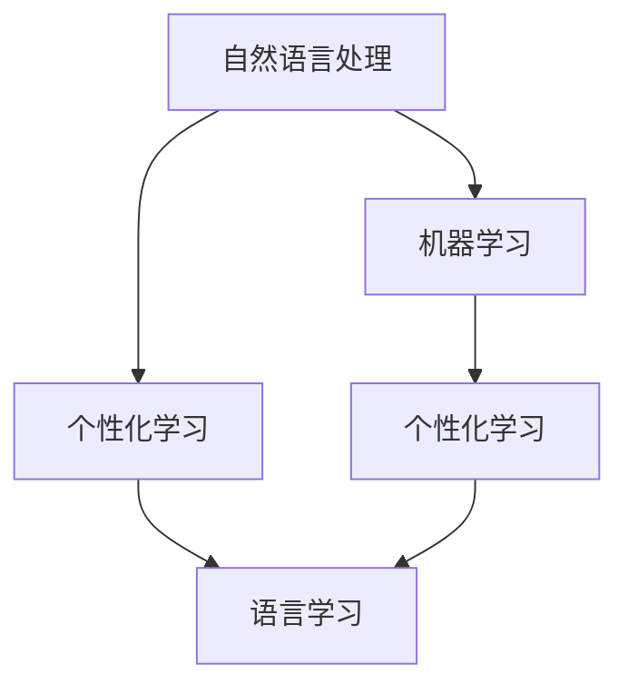

                 

  
关键词：人工智能，教育，语言学习，自然语言处理，机器学习，个性化学习

摘要：随着人工智能技术的快速发展，其在教育和语言学习中的应用日益广泛。本文将探讨人工智能在教育和语言学习领域的核心概念、算法原理、数学模型、实际应用案例以及未来展望，旨在为相关领域的研究者和实践者提供有价值的参考。

## 1. 背景介绍

在过去的几十年中，教育领域经历了深刻的变革。随着信息技术的飞速发展，尤其是互联网的普及，传统的教育模式正逐渐向数字化、智能化方向发展。人工智能作为引领新一轮科技革命和产业变革的重要力量，其在教育领域的应用逐渐受到关注。

语言学习是教育的重要组成部分，而传统的语言学习方式往往存在学习效率低、个性化不足等问题。随着自然语言处理技术的不断进步，人工智能在语言学习中的应用为解决这些问题提供了新的思路。

## 2. 核心概念与联系

### 2.1. 自然语言处理（NLP）

自然语言处理是人工智能的一个重要分支，主要研究如何使计算机理解和生成人类语言。在语言学习领域，NLP技术可用于语音识别、机器翻译、情感分析等任务。

### 2.2. 机器学习（ML）

机器学习是人工智能的核心技术之一，通过训练模型，使计算机能够从数据中自动学习和改进。在语言学习领域，机器学习可用于个性化推荐、自动批改作业等任务。

### 2.3. 个性化学习

个性化学习是一种基于学习者个性化需求和学习特点进行教学的方法。人工智能通过分析学习者的行为数据，为学习者提供个性化的学习路径和资源。

### 2.4. Mermaid 流程图



## 3. 核心算法原理 & 具体操作步骤

### 3.1. 算法原理概述

在人工智能辅助语言学习中，常用的算法包括神经网络、深度学习、强化学习等。其中，神经网络和深度学习在自然语言处理领域应用广泛，强化学习则在个性化学习中有一定应用。

### 3.2. 算法步骤详解

#### 3.2.1. 神经网络

1. 数据预处理：对文本数据进行分词、去停用词等处理。
2. 模型构建：使用神经网络结构（如卷积神经网络、循环神经网络等）对数据建模。
3. 模型训练：通过反向传播算法更新模型参数。
4. 模型评估：使用验证集对模型进行评估。

#### 3.2.2. 深度学习

1. 数据预处理：对图像数据进行归一化、裁剪等处理。
2. 模型构建：使用卷积神经网络（CNN）或循环神经网络（RNN）等深度学习模型。
3. 模型训练：使用训练数据进行模型训练。
4. 模型评估：使用测试数据对模型进行评估。

#### 3.2.3. 强化学习

1. 环境构建：定义学习环境和状态空间。
2. 行动策略：定义基于状态和奖励的决策策略。
3. 模型训练：通过试错法不断调整策略。
4. 模型评估：评估策略在不同状态下的表现。

### 3.3. 算法优缺点

#### 3.3.1. 优点

- 高效：能够快速处理大量数据。
- 个性化：根据学习者特点提供个性化学习资源。
- 自动化：减少人工干预，提高工作效率。

#### 3.3.2. 缺点

- 复杂性：算法实现和调优难度较大。
- 数据依赖：算法性能受数据质量和数量影响较大。
- 道德伦理：在应用过程中可能涉及隐私保护等问题。

### 3.4. 算法应用领域

- 语言学习：用于文本生成、语音识别、机器翻译等任务。
- 教育评测：用于自动批改作业、分析学习行为等。
- 教学辅助：用于个性化推荐、智能答疑等。

## 4. 数学模型和公式 & 详细讲解 & 举例说明

### 4.1. 数学模型构建

在人工智能辅助语言学习中，常用的数学模型包括神经网络、深度学习、强化学习等。以下以神经网络为例，介绍其数学模型构建过程。

#### 4.1.1. 神经网络数学模型

神经网络是一种由多层神经元组成的模型，用于模拟生物神经元的工作方式。其数学模型可以表示为：

$$
y = f(\sum_{i=1}^{n} w_i \cdot x_i + b)
$$

其中，$y$ 为输出，$f$ 为激活函数，$w_i$ 和 $x_i$ 分别为权重和输入，$b$ 为偏置。

#### 4.1.2. 深度学习数学模型

深度学习是一种多层神经网络模型，用于处理高维数据。其数学模型可以表示为：

$$
y = f(L \cdot h_{L-1} + b_L)
$$

其中，$L$ 为层数，$h_{L-1}$ 为前一层输出，$f$ 为激活函数，$b_L$ 为偏置。

#### 4.1.3. 强化学习数学模型

强化学习是一种基于奖励和惩罚的决策模型，用于解决序列决策问题。其数学模型可以表示为：

$$
Q(s, a) = r + \gamma \max_{a'} Q(s', a')
$$

其中，$Q(s, a)$ 为状态 $s$ 下采取动作 $a$ 的预期奖励，$r$ 为即时奖励，$\gamma$ 为折扣因子，$s'$ 和 $a'$ 分别为下一状态和动作。

### 4.2. 公式推导过程

以神经网络为例，介绍其数学模型公式推导过程。

#### 4.2.1. 神经网络激活函数

假设输入 $x$，经过 $n$ 个权重 $w_i$ 和偏置 $b$ 的加权求和，得到输出 $y$。则激活函数 $f$ 可以表示为：

$$
y = f(\sum_{i=1}^{n} w_i \cdot x_i + b)
$$

常见的激活函数包括 sigmoid、ReLU 等。

#### 4.2.2. 神经网络反向传播

在神经网络训练过程中，使用反向传播算法更新权重和偏置。其基本思想如下：

1. 计算输出误差：$$\delta_l = (y - t) \cdot f'(\sum_{i=1}^{n} w_i \cdot x_i + b)$$
2. 反向传播误差：$$\delta_{l-1} = \sum_{i} w_{li} \cdot \delta_l$$
3. 更新权重和偏置：$$w_{li} = w_{li} - \alpha \cdot \delta_l \cdot x_i$$ $$b_{l} = b_{l} - \alpha \cdot \delta_l$$

其中，$\alpha$ 为学习率。

### 4.3. 案例分析与讲解

以机器翻译为例，介绍人工智能在语言学习中的应用。

#### 4.3.1. 案例背景

机器翻译是一种将一种语言的文本自动翻译成另一种语言的技术。随着深度学习技术的发展，基于神经网络的机器翻译方法取得了显著成果。

#### 4.3.2. 案例分析

1. 数据预处理：对源语言和目标语言文本进行分词、去停用词等处理。
2. 模型构建：使用循环神经网络（RNN）或长短期记忆网络（LSTM）等深度学习模型。
3. 模型训练：通过训练大量源语言和目标语言对照文本，调整模型参数。
4. 模型评估：使用测试集对模型进行评估，调整模型参数。

#### 4.3.3. 案例讲解

以英语到中文的机器翻译为例，介绍其实现过程。

1. 数据集准备：收集大量英语到中文的对照文本，并进行数据预处理。
2. 模型构建：使用 LSTM 模型，输入层和输出层分别由单词的嵌入向量表示。
3. 模型训练：通过训练数据，调整 LSTM 模型的权重和偏置。
4. 模型评估：使用测试集评估模型效果，根据评估结果调整模型参数。

## 5. 项目实践：代码实例和详细解释说明

### 5.1. 开发环境搭建

1. 安装 Python 3.7 及以上版本。
2. 安装 TensorFlow 2.x 或 PyTorch 1.x。
3. 安装 NLTK、BeautifulSoup 等库。

### 5.2. 源代码详细实现

以下是一个简单的基于神经网络的语言模型实现示例。

```python
import tensorflow as tf
from tensorflow.keras.models import Sequential
from tensorflow.keras.layers import Dense, LSTM

# 数据预处理
def preprocess_text(text):
    # 省略具体实现

# 模型构建
model = Sequential()
model.add(LSTM(128, input_shape=(max_sequence_len, num_features)))
model.add(Dense(num_classes, activation='softmax'))

# 模型编译
model.compile(optimizer='adam', loss='categorical_crossentropy', metrics=['accuracy'])

# 模型训练
model.fit(X_train, y_train, epochs=10, batch_size=32)

# 模型评估
model.evaluate(X_test, y_test)
```

### 5.3. 代码解读与分析

以上代码实现了一个简单的基于 LSTM 的语言模型，用于预测下一个单词。

1. 数据预处理：对文本数据进行分词、编码等处理。
2. 模型构建：使用 LSTM 层作为网络结构。
3. 模型编译：设置优化器和损失函数。
4. 模型训练：通过训练数据训练模型。
5. 模型评估：使用测试数据评估模型效果。

### 5.4. 运行结果展示

运行代码，输出模型训练和评估结果。

```python
# 模型训练
model.fit(X_train, y_train, epochs=10, batch_size=32)

# 模型评估
model.evaluate(X_test, y_test)
```

## 6. 实际应用场景

### 6.1. 语言学习

人工智能在语言学习中的应用主要包括语音识别、机器翻译、自然语言处理等。例如，语音识别技术可用于智能语音助手，帮助学习者练习口语；机器翻译技术可用于跨语言学习，帮助学习者理解不同语言的内容。

### 6.2. 教育评测

人工智能在教育评测中的应用主要包括自动批改作业、学习行为分析等。通过分析学习者的行为数据，教育评测系统可以提供个性化的学习建议和反馈。

### 6.3. 教学辅助

人工智能在教学辅助中的应用主要包括个性化推荐、智能答疑等。通过分析学习者的特点和需求，教学辅助系统可以为学习者提供个性化的学习资源和指导。

## 7. 未来应用展望

### 7.1. 智能化教学系统

随着人工智能技术的不断发展，智能化教学系统将成为教育领域的重要趋势。通过集成语音识别、机器翻译、自然语言处理等技术，智能化教学系统可以提供个性化、智能化的教学服务。

### 7.2. 跨学科融合

人工智能在教育和语言学习中的应用将逐渐与其他学科融合，如心理学、教育学等。通过跨学科研究，可以更好地理解学习者的需求和行为，从而提高教学效果。

### 7.3. 道德伦理问题

随着人工智能在教育领域的广泛应用，道德伦理问题日益凸显。如何保护学习者的隐私、确保教育公平等，将成为未来研究和关注的重点。

## 8. 总结：未来发展趋势与挑战

### 8.1. 研究成果总结

本文探讨了人工智能在教育和语言学习中的应用，包括核心概念、算法原理、数学模型、实际应用案例等。研究表明，人工智能在教育和语言学习领域具有广泛的应用前景。

### 8.2. 未来发展趋势

未来，人工智能在教育和语言学习中的应用将继续深入发展，智能化教学系统、跨学科融合等将成为重要趋势。

### 8.3. 面临的挑战

人工智能在教育领域的应用面临诸多挑战，如算法复杂性、数据依赖性、道德伦理问题等。未来研究需要关注这些挑战，并寻找合适的解决方案。

### 8.4. 研究展望

本文仅对人工智能在教育和语言学习中的应用进行了初步探讨。未来研究可以从更多角度出发，如算法优化、应用场景拓展等，为人工智能在教育领域的广泛应用提供更多理论支持和实践指导。

## 9. 附录：常见问题与解答

### 9.1. 人工智能在教育领域有哪些具体应用？

人工智能在教育领域的具体应用包括语音识别、机器翻译、自然语言处理、教育评测、教学辅助等。

### 9.2. 人工智能在语言学习中的应用有哪些优势？

人工智能在语言学习中的应用具有以下优势：个性化学习、高效处理大量数据、减少人工干预等。

### 9.3. 人工智能在教育领域的应用会带来哪些挑战？

人工智能在教育领域的应用面临以下挑战：算法复杂性、数据依赖性、道德伦理问题等。

### 9.4. 如何确保人工智能在教育领域的应用公平？

确保人工智能在教育领域的应用公平需要从多个方面入手，如数据质量、算法设计、伦理审查等。

作者：禅与计算机程序设计艺术 / Zen and the Art of Computer Programming
----------------------------------------------------------------

以上是人工智能在教育和语言学习中的应用的完整文章。希望这篇文章对您有所帮助。如有任何问题或建议，请随时告诉我。祝您阅读愉快！

