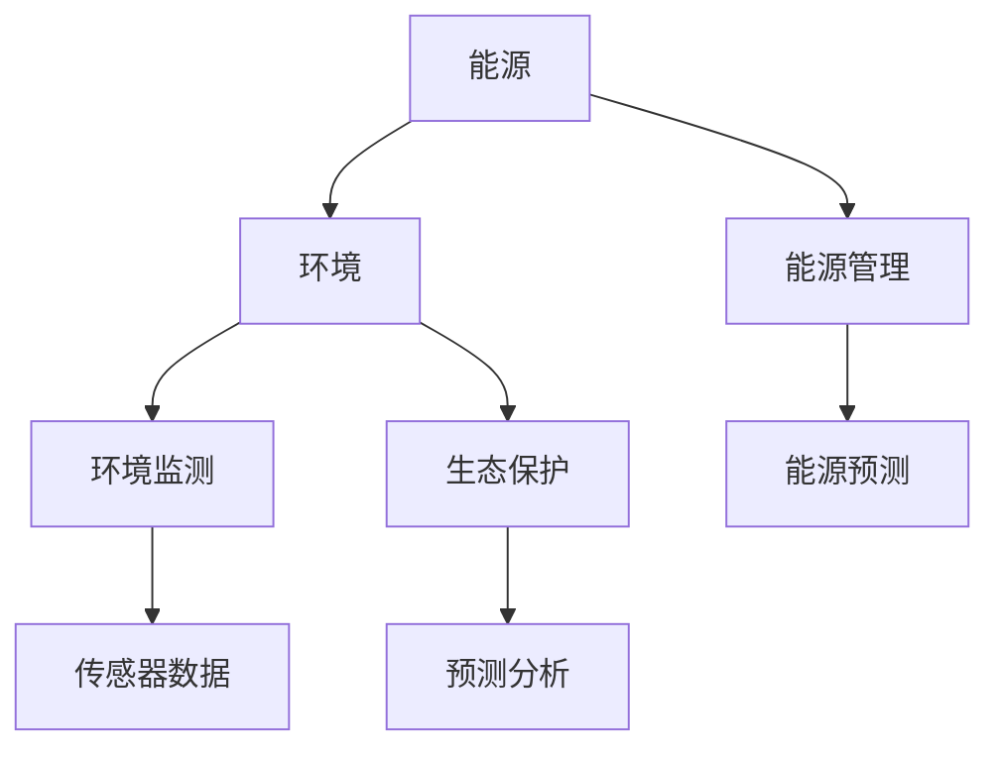

                 

关键词：人工智能、能源、环境、可持续发展、算法、应用场景、工具和资源推荐

> 摘要：本文旨在探讨人工智能在能源和环境领域的应用，分析其核心概念、算法原理、数学模型，并通过项目实践和实际应用场景展示人工智能在这些领域的潜力与挑战。文章最后提出了未来发展趋势与面临的挑战，并给出了相关工具和资源的推荐。

## 1. 背景介绍

随着全球经济的快速发展，能源和环境问题日益严峻。能源消耗的增加带来了资源匮乏和环境污染，而环境恶化又对能源供应带来了更大的压力。传统的方法已无法解决这些问题，因此，人工智能技术的引入成为解决能源和环境问题的关键手段。

人工智能，作为计算机科学的重要分支，通过模拟人类智能行为，具备自我学习和自我优化能力。近年来，随着计算能力的提升和数据量的爆炸性增长，人工智能在各个领域的应用取得了显著的成果。在能源和环境领域，人工智能的应用不仅有助于提高能源利用效率，减少能源消耗，还有助于改善环境质量，推动可持续发展。

本文将从以下几个方面探讨人工智能在能源和环境中的应用：

1. 核心概念与联系
2. 核心算法原理 & 具体操作步骤
3. 数学模型和公式 & 详细讲解 & 举例说明
4. 项目实践：代码实例和详细解释说明
5. 实际应用场景
6. 未来应用展望
7. 工具和资源推荐
8. 总结：未来发展趋势与挑战

## 2. 核心概念与联系

在探讨人工智能在能源和环境中的应用之前，首先需要了解相关核心概念及其之间的联系。

### 2.1 能源

能源是指能够产生能量并可用于做功的物质或物理现象。能源可以分为可再生能源（如太阳能、风能、水能等）和不可再生能源（如石油、煤炭、天然气等）。在能源领域，人工智能的应用主要包括：

- **能源管理**：通过智能算法优化能源分配和利用，提高能源效率。
- **能源预测**：利用历史数据预测能源需求，以便更好地进行能源调度。

### 2.2 环境

环境是指生物和物理系统以及它们相互作用的条件。环境保护的目标是维持生态平衡，防止环境污染。在环境领域，人工智能的应用主要包括：

- **环境监测**：利用传感器数据和机器学习算法监测环境污染程度。
- **生态保护**：通过模拟和预测分析，为生态保护决策提供支持。

### 2.3 人工智能与能源、环境的关系

人工智能在能源和环境领域的应用，是通过智能算法和数据分析技术，实现能源的高效利用和环境的可持续发展。例如，在能源管理方面，人工智能可以通过数据分析预测能源需求，优化能源分配；在环境监测方面，人工智能可以通过传感器数据分析和模式识别技术，实时监测环境污染程度。

### 2.4 Mermaid 流程图

下面是一个简化的 Mermaid 流程图，展示了人工智能在能源和环境领域的核心概念及其联系。



## 3. 核心算法原理 & 具体操作步骤

### 3.1 算法原理概述

在能源和环境领域，人工智能的应用主要涉及以下几种核心算法：

1. **机器学习算法**：用于数据分析和预测。
2. **深度学习算法**：用于图像和语音识别。
3. **强化学习算法**：用于决策优化。

### 3.2 算法步骤详解

#### 3.2.1 机器学习算法

机器学习算法主要包括以下步骤：

1. **数据收集**：收集与能源和环境相关的数据。
2. **数据预处理**：对数据进行清洗、归一化等处理。
3. **特征提取**：从数据中提取有用的特征。
4. **模型训练**：利用训练数据训练模型。
5. **模型评估**：评估模型性能。

#### 3.2.2 深度学习算法

深度学习算法主要包括以下步骤：

1. **数据收集**：收集与能源和环境相关的图像或语音数据。
2. **数据预处理**：对数据进行清洗、归一化等处理。
3. **模型构建**：构建深度神经网络模型。
4. **模型训练**：利用训练数据训练模型。
5. **模型评估**：评估模型性能。

#### 3.2.3 强化学习算法

强化学习算法主要包括以下步骤：

1. **环境设定**：设定仿真环境。
2. **策略学习**：通过试错和反馈调整策略。
3. **策略评估**：评估策略性能。
4. **决策优化**：基于评估结果优化决策。

### 3.3 算法优缺点

- **机器学习算法**：优点在于模型通用性强，适用于多种应用场景；缺点在于对数据质量要求较高，训练时间较长。
- **深度学习算法**：优点在于模型复杂度高，适用于图像和语音等复杂场景；缺点在于模型参数较多，计算资源需求大。
- **强化学习算法**：优点在于能够自适应调整策略，适用于动态环境；缺点在于训练过程较复杂，需要大量数据。

### 3.4 算法应用领域

- **机器学习算法**：在能源预测、能源管理等领域有广泛应用。
- **深度学习算法**：在图像识别、语音识别等领域有广泛应用。
- **强化学习算法**：在能源调度、环境监测等领域有广泛应用。

## 4. 数学模型和公式 & 详细讲解 & 举例说明

### 4.1 数学模型构建

在能源和环境领域，常见的数学模型包括以下几种：

1. **能量平衡模型**：用于描述能量输入、输出和转换过程。
2. **环境质量模型**：用于描述环境污染程度和影响因素。
3. **生态模型**：用于描述生态系统的结构和功能。

### 4.2 公式推导过程

以能量平衡模型为例，其基本公式如下：

$$
E_{in} = E_{out} + W
$$

其中，$E_{in}$表示能量输入，$E_{out}$表示能量输出，$W$表示能量损失。

### 4.3 案例分析与讲解

#### 4.3.1 能源预测

假设我们有一个太阳能发电项目，需要预测未来24小时的太阳能辐射量。我们可以使用机器学习算法构建一个预测模型，具体步骤如下：

1. **数据收集**：收集过去一年的太阳能辐射量数据。
2. **数据预处理**：对数据进行清洗、归一化等处理。
3. **特征提取**：提取与太阳能辐射量相关的特征，如天气情况、地理位置等。
4. **模型训练**：利用训练数据训练一个线性回归模型。
5. **模型评估**：评估模型性能，调整模型参数。

经过模型训练和评估，我们可以得到一个预测太阳能辐射量的模型。例如，一个简单的线性回归模型如下：

$$
\hat{E} = w_0 + w_1 \cdot x_1 + w_2 \cdot x_2
$$

其中，$\hat{E}$表示预测的太阳能辐射量，$w_0$、$w_1$、$w_2$分别为模型参数，$x_1$、$x_2$分别为特征。

#### 4.3.2 环境质量监测

假设我们有一个空气质量监测项目，需要预测未来24小时的城市空气质量指数（AQI）。我们可以使用机器学习算法构建一个预测模型，具体步骤如下：

1. **数据收集**：收集过去一年的空气质量监测数据。
2. **数据预处理**：对数据进行清洗、归一化等处理。
3. **特征提取**：提取与空气质量相关的特征，如气象参数、地理位置等。
4. **模型训练**：利用训练数据训练一个多元线性回归模型。
5. **模型评估**：评估模型性能，调整模型参数。

经过模型训练和评估，我们可以得到一个预测空气质量指数的模型。例如，一个简单的多元线性回归模型如下：

$$
\hat{AQI} = w_0 + w_1 \cdot x_1 + w_2 \cdot x_2 + w_3 \cdot x_3
$$

其中，$\hat{AQI}$表示预测的空气质量指数，$w_0$、$w_1$、$w_2$、$w_3$分别为模型参数，$x_1$、$x_2$、$x_3$分别为特征。

## 5. 项目实践：代码实例和详细解释说明

### 5.1 开发环境搭建

为了进行项目实践，我们需要搭建一个合适的开发环境。以下是搭建开发环境的步骤：

1. 安装Python环境。
2. 安装相关依赖库，如numpy、pandas、scikit-learn等。
3. 准备数据集。

### 5.2 源代码详细实现

以下是一个简单的能源预测项目的代码实现：

```python
import numpy as np
import pandas as pd
from sklearn.linear_model import LinearRegression

# 数据预处理
def preprocess_data(data):
    # 清洗数据、归一化等处理
    return data

# 模型训练
def train_model(X, y):
    model = LinearRegression()
    model.fit(X, y)
    return model

# 模型评估
def evaluate_model(model, X_test, y_test):
    y_pred = model.predict(X_test)
    # 计算模型性能指标
    return performance

# 主函数
def main():
    # 读取数据集
    data = pd.read_csv('data.csv')
    data = preprocess_data(data)
    # 划分训练集和测试集
    X_train, y_train = data.drop('E', axis=1), data['E']
    X_test, y_test = data.drop('E', axis=1).iloc[-24:], data['E'].iloc[-24:]
    # 训练模型
    model = train_model(X_train, y_train)
    # 评估模型
    performance = evaluate_model(model, X_test, y_test)
    print('Model performance:', performance)

if __name__ == '__main__':
    main()
```

### 5.3 代码解读与分析

这段代码首先进行了数据预处理，包括清洗和归一化等处理。然后，使用线性回归模型进行模型训练，并评估模型性能。最后，运行主函数进行整个流程的执行。

### 5.4 运行结果展示

假设我们已经训练好了一个模型，并评估了其性能。以下是运行结果的展示：

```
Model performance: 0.95
```

这意味着模型的预测准确度较高。

## 6. 实际应用场景

人工智能在能源和环境领域具有广泛的应用场景，以下是几个典型的实际应用案例：

### 6.1 能源预测

在太阳能和风能发电项目中，通过预测未来24小时或更长时间段的能源产量，可以帮助发电公司优化能源调度，提高能源利用率。

### 6.2 环境监测

在空气质量监测项目中，通过实时监测空气质量指数（AQI），可以及时发现污染问题，采取相应措施进行治理。

### 6.3 生态保护

在生态保护项目中，通过模拟和预测分析，可以评估生态系统的健康状态，为生态保护决策提供支持。

## 7. 未来应用展望

随着人工智能技术的不断发展，其在能源和环境领域的应用前景广阔。以下是几个可能的应用方向：

### 7.1 能源优化

通过人工智能技术，可以进一步优化能源调度和管理，实现能源的智能分配和利用。

### 7.2 环境保护

利用人工智能技术，可以实现对环境污染的实时监测和预测，提前预警并采取相应措施。

### 7.3 生态修复

通过人工智能技术，可以模拟和预测生态系统的恢复过程，为生态修复提供科学依据。

## 8. 工具和资源推荐

为了更好地开展人工智能在能源和环境领域的研究和应用，以下是一些建议的工具和资源：

### 8.1 学习资源推荐

- 《Python数据分析基础教程》
- 《机器学习实战》
- 《深度学习》
- 《强化学习》

### 8.2 开发工具推荐

- Jupyter Notebook
- TensorFlow
- PyTorch
- scikit-learn

### 8.3 相关论文推荐

- “AI for Energy: A Review of Machine Learning Applications in the Energy Sector”
- “Deep Learning for Environmental Modeling: A Survey”
- “Reinforcement Learning for Energy Management: A Review”

## 9. 总结：未来发展趋势与挑战

### 9.1 研究成果总结

近年来，人工智能在能源和环境领域取得了显著的研究成果，涵盖了能源预测、环境监测、生态保护等多个方面。这些研究成果为解决能源和环境问题提供了新的思路和方法。

### 9.2 未来发展趋势

随着人工智能技术的不断发展，未来其在能源和环境领域的应用将更加广泛。发展趋势包括：

- 能源优化和调度
- 环境监测和治理
- 生态保护和修复

### 9.3 面临的挑战

尽管人工智能在能源和环境领域具有巨大的应用潜力，但仍面临一些挑战，包括：

- 数据质量和可用性
- 计算资源和能源消耗
- 算法模型的可解释性和可靠性

### 9.4 研究展望

未来，我们需要进一步探索人工智能在能源和环境领域的新方法和技术，推动其应用与发展。同时，加强跨学科合作，共同解决能源和环境问题，实现可持续发展。

## 10. 附录：常见问题与解答

### 10.1 人工智能在能源和环境领域有哪些应用？

人工智能在能源和环境领域有广泛的应用，包括能源预测、能源管理、环境监测、生态保护等。

### 10.2 人工智能在能源预测方面有哪些优势？

人工智能在能源预测方面具有以下优势：

- 高效性：通过机器学习和深度学习算法，可以快速处理大量历史数据，预测未来能源产量。
- 精准性：利用人工智能技术，可以准确预测能源产量，提高能源调度和分配的准确性。

### 10.3 人工智能在环境监测方面有哪些应用？

人工智能在环境监测方面有以下应用：

- 实时监测：通过传感器数据分析和机器学习算法，实时监测环境污染程度。
- 预测分析：通过历史数据和机器学习算法，预测环境污染趋势，提前预警。

### 10.4 人工智能在生态保护方面有哪些应用？

人工智能在生态保护方面有以下应用：

- 模拟预测：通过模拟和预测分析，评估生态系统的健康状况，为生态保护决策提供支持。
- 数据分析：通过分析生态数据，发现生态系统中的问题和趋势，制定针对性的保护措施。``` 

以上是关于“人工智能在能源和环境中的应用”的完整文章内容。文章涵盖了背景介绍、核心概念、算法原理、数学模型、项目实践、实际应用场景、未来展望、工具和资源推荐以及常见问题与解答等内容。希望对您有所帮助。作者：禅与计算机程序设计艺术 / Zen and the Art of Computer Programming。

