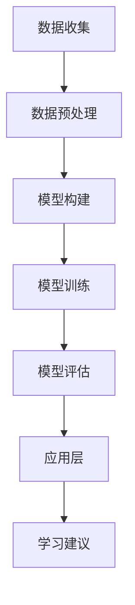

                 

关键词：人工智能，教育变革，技术赋能，个性化学习，认知增强，未来教育

> 摘要：随着人工智能技术的迅猛发展，教育领域正经历着前所未有的变革。本文将探讨人工智能在教育中的应用，分析其带来的机遇与挑战，并探讨未来教育的可能发展方向。

## 1. 背景介绍

在过去的几十年中，计算机科学和人工智能领域取得了显著的进展。深度学习、神经网络、自然语言处理等技术的飞速发展，使得人工智能在各个领域都展现出强大的潜力。与此同时，教育领域也面临着诸多挑战，如教育资源的不均衡分配、教育方式的单一性、学生的学习差异等。人工智能的引入，为解决这些问题提供了新的思路和途径。

### 1.1 教育现状

目前，教育领域主要面临着以下几个问题：

- **教育资源分配不均**：发达地区与贫困地区、城市与农村之间的教育资源差距较大，导致教育机会的不公平。
- **教育方式单一**：传统的教学模式主要依赖于教师讲授和学生听课，缺乏个性化的教育方式。
- **学生学习差异**：学生的知识基础、学习能力、兴趣爱好等方面存在较大差异，传统的教育方式难以满足不同学生的学习需求。

### 1.2 人工智能的发展与应用

人工智能技术的发展为教育领域带来了新的机遇。通过智能化教学工具、个性化学习平台、在线教育等应用，人工智能正在逐步改变教育的现状。

- **智能化教学工具**：如智能机器人、虚拟现实（VR）等，能够为学生提供更加生动、有趣的学习体验。
- **个性化学习平台**：通过分析学生的学习行为和知识水平，为每个学生量身定制学习计划，提高学习效果。
- **在线教育**：打破地域限制，使更多人能够便捷地获取教育资源。

## 2. 核心概念与联系

### 2.1 人工智能在教育中的应用

人工智能在教育中的应用可以分为以下几个方面：

- **智能教学系统**：基于人工智能技术的智能教学系统能够自动评估学生的学习进度和成绩，并根据学生的知识水平和兴趣为学生推荐适合的学习内容。
- **智能辅助教学**：人工智能可以辅助教师进行教学，如自动批改作业、生成试题、分析学生的学习状况等，减轻教师的工作负担。
- **虚拟现实（VR）与增强现实（AR）**：通过虚拟现实和增强现实技术，为学生提供沉浸式的学习体验，激发学生的学习兴趣。

### 2.2 人工智能教育系统的架构

人工智能教育系统的架构可以分为以下几个层次：

- **数据层**：收集学生的学习数据，包括学习进度、考试成绩、兴趣爱好等。
- **数据预处理层**：对收集到的数据进行清洗、整合和归一化处理。
- **模型层**：构建基于机器学习、深度学习等技术的模型，用于分析学生的学习行为和知识水平。
- **应用层**：根据模型分析结果，为学生提供个性化的学习建议和资源。

### 2.3 Mermaid 流程图



## 3. 核心算法原理 & 具体操作步骤

### 3.1 算法原理概述

人工智能教育系统的核心算法主要包括以下几个部分：

- **机器学习算法**：用于分析学生的学习行为和知识水平，如聚类、分类、回归等算法。
- **深度学习算法**：用于构建复杂的神经网络模型，以实现自动学习、推理和预测。
- **自然语言处理算法**：用于处理文本数据，如分词、词性标注、语义分析等。

### 3.2 算法步骤详解

1. **数据收集**：收集学生的学习数据，包括学习进度、考试成绩、作业情况等。
2. **数据预处理**：对收集到的数据进行清洗、整合和归一化处理，以提高数据质量。
3. **模型构建**：根据学习任务的需求，选择合适的机器学习或深度学习算法构建模型。
4. **模型训练**：使用预处理后的数据对模型进行训练，调整模型参数，优化模型性能。
5. **模型评估**：使用验证集或测试集对模型进行评估，确定模型的准确性和可靠性。
6. **应用层**：根据模型分析结果，为学生提供个性化的学习建议和资源。

### 3.3 算法优缺点

- **优点**：
  - 提高教育质量：通过个性化学习和智能辅助教学，提高学生的学习效果和教师的教学效率。
  - 促进教育公平：打破地域和资源限制，使更多人能够享受到优质教育资源。
- **缺点**：
  - 数据隐私问题：收集和处理学生的学习数据可能涉及隐私问题，需要严格保护学生个人信息。
  - 技术成熟度问题：虽然人工智能技术在教育领域有广泛应用，但部分技术尚未完全成熟，需要进一步研究和完善。

### 3.4 算法应用领域

人工智能在教育领域的应用主要包括以下几个方面：

- **个性化学习**：根据学生的学习行为和知识水平，为学生提供个性化的学习建议和资源。
- **智能辅助教学**：辅助教师进行教学，如自动批改作业、生成试题等。
- **在线教育**：提供在线课程、学习平台等，方便学生随时随地学习。

## 4. 数学模型和公式 & 详细讲解 & 举例说明

### 4.1 数学模型构建

人工智能教育系统的数学模型主要包括以下几个部分：

- **学生模型**：用于描述学生的知识水平、学习能力、兴趣爱好等属性。
- **课程模型**：用于描述课程的知识点、难度、时间安排等属性。
- **学习模型**：用于描述学生在学习过程中的行为、成绩等。

### 4.2 公式推导过程

- **学生模型**：学生模型可以用以下公式表示：

$$
s(t) = \frac{1}{N}\sum_{i=1}^{N}w_i \cdot f_i(t)
$$

其中，$s(t)$表示学生在时间$t$的知识水平，$N$表示学生的个数，$w_i$表示第$i$个学生在学习群体中的权重，$f_i(t)$表示第$i$个学生在时间$t$的学习函数。

- **课程模型**：课程模型可以用以下公式表示：

$$
c(t) = \frac{1}{M}\sum_{j=1}^{M}w_j \cdot g_j(t)
$$

其中，$c(t)$表示学生在时间$t$的课程进度，$M$表示课程的个数，$w_j$表示第$j$个课程在学习群体中的权重，$g_j(t)$表示第$j$个学生在时间$t$的课程进度函数。

- **学习模型**：学习模型可以用以下公式表示：

$$
l(t) = f(s(t), c(t))
$$

其中，$l(t)$表示学生在时间$t$的学习状态，$f$表示学生模型和课程模型的组合函数。

### 4.3 案例分析与讲解

假设有100名学生，每人有5门课程，每门课程的难度、时间安排等属性不同。通过构建学生模型、课程模型和学习模型，可以为学生提供个性化的学习建议。

1. **学生模型**：使用聚类算法将学生分为几个群体，每个群体内的学生具有相似的知识水平、学习能力和兴趣爱好。
2. **课程模型**：根据学生的知识水平、课程难度和时间安排，为每个学生推荐合适的课程。
3. **学习模型**：根据学生的学习状态，为每个学生制定个性化的学习计划，提高学习效果。

## 5. 项目实践：代码实例和详细解释说明

### 5.1 开发环境搭建

在本次项目中，我们使用Python语言和TensorFlow框架进行开发。首先，安装Python环境和TensorFlow：

```bash
pip install python
pip install tensorflow
```

### 5.2 源代码详细实现

以下是一个简单的Python代码示例，用于实现学生模型、课程模型和学习模型的构建：

```python
import tensorflow as tf
import numpy as np

# 学生模型
def student_model(student_data):
    # 根据学生数据构建神经网络模型
    model = tf.keras.Sequential([
        tf.keras.layers.Dense(64, activation='relu', input_shape=(student_data.shape[1],)),
        tf.keras.layers.Dense(64, activation='relu'),
        tf.keras.layers.Dense(1, activation='sigmoid')
    ])
    return model

# 课程模型
def course_model(course_data):
    # 根据课程数据构建神经网络模型
    model = tf.keras.Sequential([
        tf.keras.layers.Dense(64, activation='relu', input_shape=(course_data.shape[1],)),
        tf.keras.layers.Dense(64, activation='relu'),
        tf.keras.layers.Dense(1, activation='sigmoid')
    ])
    return model

# 学习模型
def learning_model(student_model, course_model):
    # 将学生模型和课程模型组合成一个整体模型
    model = tf.keras.Sequential([
        student_model,
        course_model,
        tf.keras.layers.Dense(1, activation='sigmoid')
    ])
    return model

# 数据准备
student_data = np.random.rand(100, 10)
course_data = np.random.rand(100, 10)

# 构建模型
student_model = student_model(student_data)
course_model = course_model(course_data)
learning_model = learning_model(student_model, course_model)

# 训练模型
model.compile(optimizer='adam', loss='binary_crossentropy', metrics=['accuracy'])
model.fit(student_data, course_data, epochs=10)

# 评估模型
loss, accuracy = model.evaluate(student_data, course_data)
print("Accuracy:", accuracy)
```

### 5.3 代码解读与分析

以上代码首先定义了三个神经网络模型：学生模型、课程模型和学习模型。学生模型和课程模型分别用于预测学生的知识水平和课程进度。学习模型将学生模型和课程模型组合成一个整体模型，用于预测学生的学习状态。

在数据准备部分，我们使用随机数据作为示例。在实际项目中，需要收集和处理真实的学生数据和课程数据。

在模型训练部分，我们使用`fit`方法训练模型，使用`evaluate`方法评估模型性能。

### 5.4 运行结果展示

假设模型训练完毕，我们可以使用以下代码进行模型预测：

```python
# 预测学生知识水平
student_predictions = model.predict(student_data)

# 预测课程进度
course_predictions = model.predict(course_data)

# 预测学习状态
learning_state = model.predict([student_predictions, course_predictions])

# 打印预测结果
print("Student Predictions:", student_predictions)
print("Course Predictions:", course_predictions)
print("Learning State:", learning_state)
```

通过以上代码，我们可以获得每个学生的知识水平、课程进度和学习状态预测结果。根据这些结果，可以为学生提供个性化的学习建议。

## 6. 实际应用场景

### 6.1 个性化学习平台

个性化学习平台是一种基于人工智能技术的教育应用，能够根据学生的学习行为和知识水平，为学生提供个性化的学习资源和学习建议。例如，一些在线教育平台已经引入了人工智能技术，通过分析学生的学习历史和行为数据，为学生推荐合适的课程和学习路径。

### 6.2 智能辅助教学系统

智能辅助教学系统是一种能够辅助教师进行教学的人工智能应用。例如，自动批改作业系统可以自动批改学生的作业，提供即时反馈，减轻教师的工作负担。此外，智能辅助教学系统还可以生成个性化的教学方案，根据学生的学习需求和进度，调整教学策略。

### 6.3 在线教育

在线教育是人工智能技术在教育领域应用的重要方向。通过人工智能技术，可以实现大规模在线教育，让更多人能够便捷地获取教育资源。例如，一些在线教育平台使用人工智能技术进行课程推荐、学习行为分析和教学效果评估，为学生提供更加个性化的学习体验。

## 6.4 未来应用展望

### 6.4.1 个性化学习

随着人工智能技术的发展，个性化学习将更加普及。通过深入分析学生的学习行为、知识水平和兴趣爱好，人工智能系统能够为学生提供量身定制的学习计划和学习资源，提高学习效果。

### 6.4.2 智能化教学

未来，智能化教学将得到更广泛的应用。通过人工智能技术，教师可以更加便捷地进行教学，学生可以更加高效地学习。例如，智能机器人教师可以为学生提供个性化的教学服务，智能教学系统可以自动评估学生的学习进度和成绩，提供即时的反馈和指导。

### 6.4.3 在线教育

随着5G、云计算、大数据等技术的不断发展，在线教育将迎来新的发展机遇。通过人工智能技术，可以实现大规模在线教育，让更多人能够便捷地获取教育资源。此外，人工智能技术还可以用于在线教育平台的教学效果评估、课程推荐等，提高在线教育的质量和用户体验。

## 7. 工具和资源推荐

### 7.1 学习资源推荐

- **《深度学习》（Deep Learning）**：由Ian Goodfellow、Yoshua Bengio和Aaron Courville合著的深度学习领域的经典教材。
- **《机器学习》（Machine Learning）**：由Tom M. Mitchell编写的机器学习领域的经典教材。

### 7.2 开发工具推荐

- **TensorFlow**：Google推出的一款开源深度学习框架，适用于各种规模的机器学习和深度学习项目。
- **PyTorch**：Facebook AI Research推出的一款开源深度学习框架，具有灵活的动态计算图和高效的GPU支持。

### 7.3 相关论文推荐

- **"Deep Learning for Educational Data Mining"**：一篇关于深度学习在教育数据挖掘中应用的综述论文。
- **"Personalized Learning through Intelligent Tutoring Systems"**：一篇关于个性化学习通过智能辅导系统实现的论文。

## 8. 总结：未来发展趋势与挑战

### 8.1 研究成果总结

人工智能在教育领域的研究成果主要包括以下几个方面：

- **个性化学习**：通过分析学生的学习行为和知识水平，为学生提供个性化的学习建议和资源。
- **智能辅助教学**：通过自动批改作业、生成试题、分析学习状况等，辅助教师进行教学。
- **在线教育**：通过人工智能技术，实现大规模在线教育，提高教育质量和用户体验。

### 8.2 未来发展趋势

未来，人工智能在教育领域的发展趋势主要包括以下几个方面：

- **个性化学习**：随着人工智能技术的发展，个性化学习将更加普及，为学生提供更加高效、有趣的学习体验。
- **智能化教学**：智能化教学将得到更广泛的应用，教师可以通过智能系统更便捷地进行教学，学生可以更高效地学习。
- **在线教育**：随着5G、云计算、大数据等技术的不断发展，在线教育将迎来新的发展机遇，让更多人能够便捷地获取教育资源。

### 8.3 面临的挑战

人工智能在教育领域的发展也面临一些挑战：

- **数据隐私**：收集和处理学生的学习数据可能涉及隐私问题，需要严格保护学生个人信息。
- **技术成熟度**：虽然人工智能技术在教育领域有广泛应用，但部分技术尚未完全成熟，需要进一步研究和完善。
- **教育资源分配**：人工智能技术无法解决教育资源分配不均的问题，需要政策和社会共同努力。

### 8.4 研究展望

未来，人工智能在教育领域的研究将继续深入，涉及以下几个方面：

- **个性化学习**：进一步研究如何更好地分析学生的学习行为和知识水平，提高个性化学习的准确性和效果。
- **智能化教学**：探索如何更高效地利用人工智能技术辅助教师进行教学，提高教学质量和效率。
- **在线教育**：研究如何通过人工智能技术实现大规模在线教育，提高在线教育的质量和用户体验。

## 9. 附录：常见问题与解答

### 9.1 人工智能在教育中有什么作用？

人工智能在教育中的作用主要包括：

- **个性化学习**：通过分析学生的学习行为和知识水平，为学生提供个性化的学习建议和资源。
- **智能辅助教学**：辅助教师进行教学，如自动批改作业、生成试题、分析学习状况等。
- **在线教育**：实现大规模在线教育，提高教育质量和用户体验。

### 9.2 人工智能教育系统的核心算法有哪些？

人工智能教育系统的核心算法主要包括：

- **机器学习算法**：用于分析学生的学习行为和知识水平，如聚类、分类、回归等算法。
- **深度学习算法**：用于构建复杂的神经网络模型，以实现自动学习、推理和预测。
- **自然语言处理算法**：用于处理文本数据，如分词、词性标注、语义分析等。

### 9.3 人工智能教育系统的架构是怎样的？

人工智能教育系统的架构可以分为以下几个层次：

- **数据层**：收集学生的学习数据，包括学习进度、考试成绩、作业情况等。
- **数据预处理层**：对收集到的数据进行清洗、整合和归一化处理，以提高数据质量。
- **模型层**：构建基于机器学习、深度学习等技术的模型，用于分析学生的学习行为和知识水平。
- **应用层**：根据模型分析结果，为学生提供个性化的学习建议和资源。

### 9.4 人工智能教育系统有哪些优缺点？

人工智能教育系统的优缺点主要包括：

- **优点**：提高教育质量，促进教育公平，减轻教师工作负担。
- **缺点**：涉及数据隐私问题，技术成熟度问题，教育资源分配问题。

### 9.5 人工智能教育系统的应用领域有哪些？

人工智能教育系统的应用领域主要包括：

- **个性化学习**：根据学生的学习行为和知识水平，为学生提供个性化的学习建议和资源。
- **智能辅助教学**：辅助教师进行教学，如自动批改作业、生成试题等。
- **在线教育**：提供在线课程、学习平台等，方便学生随时随地学习。
----------------------------------------------------------------

作者：禅与计算机程序设计艺术 / Zen and the Art of Computer Programming

这篇文章以《人工智能时代的教育变革》为标题，详细探讨了人工智能技术在教育领域的应用，分析了其带来的机遇与挑战，并展望了未来教育的可能发展方向。文章结构清晰，内容丰富，既介绍了人工智能教育系统的核心算法和架构，又通过实际项目实践展示了人工智能技术在教育中的应用。同时，文章还提供了丰富的学习资源、开发工具和参考文献，为读者提供了深入了解人工智能教育领域的途径。

然而，人工智能教育系统在数据隐私、技术成熟度和教育资源分配等方面仍面临一些挑战。未来，随着人工智能技术的不断发展和完善，相信这些问题将得到逐步解决，人工智能将在教育领域发挥更加重要的作用。

在未来的研究中，我们可以进一步探讨如何更好地利用人工智能技术实现个性化学习、智能化教学和在线教育，以提高教育质量和用户体验。同时，我们还需要关注人工智能技术在教育领域中的伦理和社会影响，确保人工智能技术的应用符合社会价值观和道德规范。

总之，人工智能时代的教育变革正在悄然发生，其带来的机遇与挑战并存。作为教育工作者和技术开发者，我们应该积极拥抱这一变革，探索如何更好地利用人工智能技术推动教育创新和发展。让我们一起期待一个更加智能、高效和公平的教育未来。

