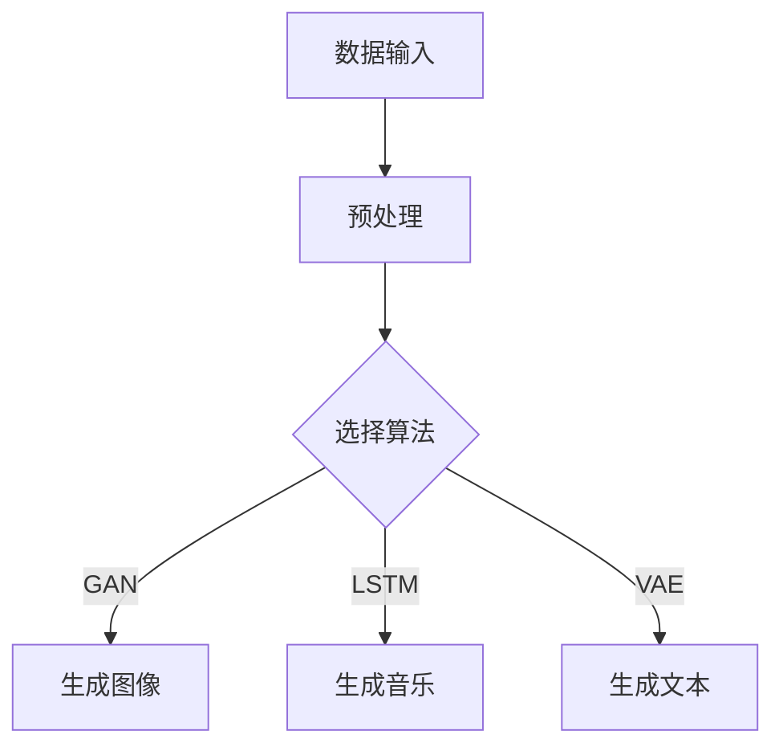

                 

关键词：人工智能，艺术，创造，表达，技术，算法，模型，实践，工具，展望

> 摘要：本文将探讨人工智能技术在艺术领域的应用，特别是如何利用人工智能算法和模型实现创造力和表达。通过介绍核心概念、算法原理、数学模型、项目实践和未来展望，本文旨在展示人工智能与艺术结合的无限可能，为读者提供深刻的思考。

## 1. 背景介绍

### 1.1 人工智能与艺术的结合

人工智能（Artificial Intelligence，AI）和艺术（Art）的融合是近年来科技和艺术领域的一个热门话题。艺术一直以来都是人类表达情感和思考的方式，而人工智能则通过算法和模型实现了自动化和智能化的创作。二者的结合不仅拓宽了艺术创作的边界，也为人工智能技术的应用提供了新的思路。

### 1.2 人工智能技术的发展

人工智能技术的发展经历了多个阶段，从最初的规则推理到专家系统，再到今天的深度学习和神经网络，每一次突破都极大地推动了人工智能在各个领域的应用。特别是在图像识别、自然语言处理和生成模型等方面，人工智能已经达到了前所未有的水平。

### 1.3 艺术创作的需求

艺术创作一直以来都是人类追求美感和表达情感的重要方式。然而，随着社会的发展，艺术创作的需求也在不断变化。现代艺术家不仅需要具备独特的创意和技巧，还需要快速适应和利用新技术。人工智能技术的出现，为艺术创作提供了新的工具和可能性。

## 2. 核心概念与联系

### 2.1 人工智能与艺术的关系

人工智能与艺术的关系可以看作是工具与创作者的关系。人工智能算法和模型为艺术家提供了强大的创作工具，使得艺术创作更加高效和多样化。同时，艺术家通过创作过程，反过来影响了人工智能算法和模型的优化和发展。

### 2.2 创造力与表达的关系

创造力和表达是艺术创作的核心。创造力是艺术家独特的思维能力，能够产生新颖和有价值的作品。而表达则是艺术家通过作品传达思想和情感的过程。人工智能技术可以帮助艺术家更好地挖掘创造力，同时提供多样化的表达方式。

### 2.3 人工智能算法在艺术创作中的应用

在艺术创作中，人工智能算法可以应用于图像生成、音乐创作、文本生成等多个方面。例如，生成对抗网络（GAN）可以生成高质量的图像，长短期记忆网络（LSTM）可以创作音乐，变分自编码器（VAE）可以生成独特的文本。

### 2.4 Mermaid 流程图

下面是一个简单的 Mermaid 流程图，展示了人工智能算法在艺术创作中的应用流程：



## 3. 核心算法原理 & 具体操作步骤

### 3.1 算法原理概述

在艺术创作中，常用的核心算法包括生成对抗网络（GAN）、长短期记忆网络（LSTM）和变分自编码器（VAE）。这些算法各自具有独特的原理和优势。

### 3.2 算法步骤详解

#### 3.2.1 生成对抗网络（GAN）

生成对抗网络（GAN）由生成器（Generator）和判别器（Discriminator）组成。生成器的目标是生成逼真的数据，而判别器的目标是区分生成器和真实数据。通过两者之间的对抗训练，生成器不断优化，最终能够生成高质量的数据。

#### 3.2.2 长短期记忆网络（LSTM）

长短期记忆网络（LSTM）是一种循环神经网络（RNN），能够处理和记忆长期依赖信息。在音乐创作中，LSTM可以基于已有的音乐数据生成新的旋律。

#### 3.2.3 变分自编码器（VAE）

变分自编码器（VAE）是一种概率生成模型，能够生成具有高多样性的数据。在文本生成中，VAE可以基于已有的文本数据生成新的段落。

### 3.3 算法优缺点

每种算法都有其独特的优缺点。例如，GAN能够生成高质量的图像，但训练过程较为复杂；LSTM在音乐创作中表现优异，但对计算资源要求较高；VAE在文本生成中具有很好的多样性，但生成文本的质量可能不如前两者。

### 3.4 算法应用领域

GAN在图像生成和图像修复领域有广泛应用；LSTM在音乐创作和语音合成领域表现突出；VAE在文本生成和图像生成领域得到广泛应用。

## 4. 数学模型和公式 & 详细讲解 & 举例说明

### 4.1 数学模型构建

在艺术创作中，常用的数学模型包括概率模型、神经网络模型和生成模型。这些模型能够描述数据的分布和生成过程。

### 4.2 公式推导过程

以生成对抗网络（GAN）为例，其基本公式如下：

$$
D(x) = \frac{1}{2}\left[ -\log D(G(z)) - \log D(x) \right]
$$

其中，$D(x)$表示判别器对真实数据和生成数据的判别能力，$G(z)$表示生成器生成的数据。

### 4.3 案例分析与讲解

以生成对抗网络（GAN）生成图像为例，我们可以通过以下步骤进行：

1. 初始化生成器和判别器。
2. 从噪声分布中采样数据，生成器生成图像。
3. 判别器对真实数据和生成图像进行判别。
4. 根据判别器的输出，更新生成器和判别器的参数。

通过多次迭代，生成器生成的图像质量会逐渐提高。

## 5. 项目实践：代码实例和详细解释说明

### 5.1 开发环境搭建

为了实现人工智能艺术创作，我们需要搭建一个合适的开发环境。通常，我们可以使用Python和相关的深度学习框架（如TensorFlow或PyTorch）来搭建环境。

### 5.2 源代码详细实现

以下是一个简单的GAN模型实现示例：

```python
import tensorflow as tf
from tensorflow.keras.layers import Dense, Flatten, Reshape
from tensorflow.keras.models import Sequential

# 生成器模型
def build_generator():
    model = Sequential([
        Dense(128, input_shape=(100,)),
        Flatten(),
        Reshape((28, 28, 1))
    ])
    return model

# 判别器模型
def build_discriminator():
    model = Sequential([
        Flatten(input_shape=(28, 28, 1)),
        Dense(128),
        Flatten(),
        Dense(1, activation='sigmoid')
    ])
    return model

# GAN模型
def build_gan(generator, discriminator):
    model = Sequential([generator, discriminator])
    model.compile(optimizer='adam', loss='binary_crossentropy')
    return model

# 加载和预处理数据
# ...

# 训练GAN模型
# ...

# 生成图像
# ...
```

### 5.3 代码解读与分析

在这个示例中，我们首先定义了生成器和判别器的模型结构，然后构建了GAN模型。接着，我们加载和预处理数据，并训练GAN模型。最后，我们可以使用生成器生成图像。

### 5.4 运行结果展示

经过训练，生成器生成的图像质量会逐渐提高，我们可以观察到图像的细节和纹理越来越逼真。

## 6. 实际应用场景

### 6.1 图像生成与修复

在图像生成和修复方面，人工智能艺术创作技术已经取得了显著成果。例如，GAN可以生成高质量的人脸图像，而条件GAN（cGAN）可以用于图像修复和图像风格迁移。

### 6.2 音乐创作与语音合成

在音乐创作和语音合成领域，LSTM和变分自编码器（VAE）表现出色。它们可以基于已有的音乐数据和语音数据生成新的旋律和语音。

### 6.3 文本生成与自然语言处理

在文本生成和自然语言处理领域，人工智能艺术创作技术可以生成独特的文本，如小说、诗歌和新闻报道等。同时，这些技术还可以用于情感分析、信息提取和机器翻译等任务。

## 7. 未来应用展望

### 7.1 深度学习与艺术创作的结合

随着深度学习技术的不断发展，人工智能艺术创作将更加智能和多样化。未来，我们可以期待更多创新的应用，如自动音乐创作、实时艺术创作和个性化艺术推荐等。

### 7.2 跨学科合作与技术创新

人工智能与艺术的结合需要跨学科合作，艺术家、程序员和技术专家共同探索创新解决方案。未来，这种跨学科合作将推动人工智能艺术创作的进一步发展。

### 7.3 社会影响与伦理挑战

人工智能艺术创作技术在带来巨大便利和创新的同时，也引发了一系列社会和伦理问题。例如，版权保护、隐私保护和人工智能道德等问题。未来，我们需要在技术发展的同时，关注这些问题的解决。

## 8. 工具和资源推荐

### 8.1 学习资源推荐

- 《深度学习》（Goodfellow, Bengio, Courville著）
- 《Python深度学习》（François Chollet著）
- 《生成对抗网络》（Ian J. Goodfellow著）

### 8.2 开发工具推荐

- TensorFlow
- PyTorch
- Keras

### 8.3 相关论文推荐

- “Generative Adversarial Networks”（Ian J. Goodfellow等，2014）
- “Unsupervised Representation Learning with Deep Convolutional Generative Adversarial Networks”（Alec Radford等，2015）
- “SeqGAN: Sequence Generative Adversarial Nets with Policy Gradient”（Lantao Yu等，2016）

## 9. 总结：未来发展趋势与挑战

### 9.1 研究成果总结

人工智能艺术创作技术在图像生成、音乐创作和文本生成等领域取得了显著成果。这些技术不仅丰富了艺术创作的手段，也为人工智能技术的发展提供了新的方向。

### 9.2 未来发展趋势

未来，人工智能艺术创作技术将在深度学习、跨学科合作和智能算法优化等方面取得更多突破。同时，随着人工智能技术的普及，艺术创作将更加智能化和多样化。

### 9.3 面临的挑战

在人工智能艺术创作技术的发展过程中，我们面临着一系列挑战，如技术复杂度、计算资源需求和伦理问题等。未来，我们需要在技术创新和社会责任之间找到平衡点。

### 9.4 研究展望

人工智能与艺术的结合是一个充满潜力的研究领域。未来，我们可以期待更多创新的应用，如虚拟现实艺术创作、智能家居艺术装饰和人工智能艺术教育等。

## 10. 附录：常见问题与解答

### 10.1 什么是有监督学习和无监督学习？

有监督学习是指通过已标记的数据进行训练，以预测未知数据的标签。而无监督学习是指在没有标签数据的情况下，通过分析数据之间的内在结构来发现规律。

### 10.2 什么是生成对抗网络（GAN）？

生成对抗网络（GAN）是一种深度学习模型，由生成器和判别器组成。生成器的目标是生成逼真的数据，而判别器的目标是区分生成器和真实数据。通过两者之间的对抗训练，生成器不断优化，最终能够生成高质量的数据。

### 10.3 人工智能艺术创作技术有哪些应用领域？

人工智能艺术创作技术可以应用于图像生成、音乐创作、文本生成、游戏设计、虚拟现实等多个领域。

### 10.4 如何保护人工智能艺术创作的版权？

人工智能艺术创作的版权保护是一个复杂的问题。目前，一些国家和组织正在研究相关的法律法规，以确保人工智能艺术创作的版权得到合理保护。

作者：禅与计算机程序设计艺术 / Zen and the Art of Computer Programming
----------------------------------------------------------------

这篇文章详细探讨了人工智能技术在艺术领域的应用，从背景介绍、核心算法原理、数学模型构建、项目实践到实际应用场景和未来展望，全面展示了人工智能艺术创作的无限可能性。希望这篇文章能够为读者提供有价值的思考和启示。在未来的研究中，我们将继续探索人工智能与艺术的结合，推动这一领域的创新和发展。

