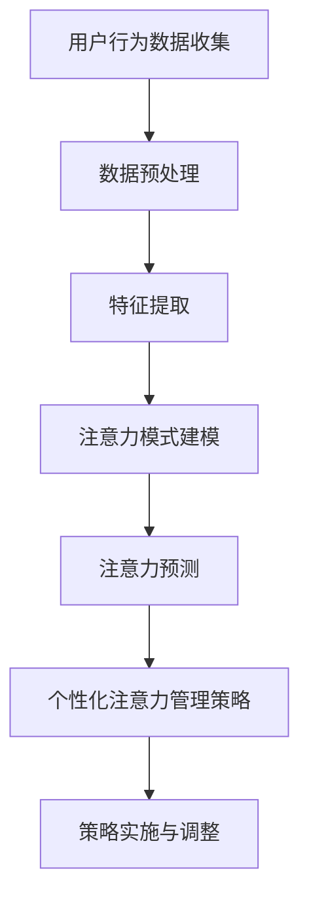

                 

关键词：人工智能，注意力管理，个性化，效率提升，算法，数学模型

> 摘要：本文探讨了人工智能技术在个性化注意力管理中的应用。通过对注意力管理核心概念的解析，提出了基于人工智能的注意力管理模型。本文详细阐述了核心算法原理、数学模型及其推导过程，并通过实际代码实例展示了如何利用人工智能进行个性化注意力管理。最后，对人工智能驱动的个性化注意力管理在实际应用中的前景和挑战进行了展望。

## 1. 背景介绍

在信息爆炸的时代，注意力资源显得尤为珍贵。如何高效地管理和分配注意力资源，以最大化工作效率和生活质量，成为亟待解决的问题。传统的注意力管理方法主要依赖于心理学和自我调节理论，虽然在一定程度上能够提供帮助，但其效果往往有限。随着人工智能技术的迅猛发展，利用人工智能进行个性化注意力管理成为可能。

### 人工智能在注意力管理中的应用

人工智能技术在注意力管理中的应用主要体现在以下几个方面：

1. **数据挖掘与分析**：通过分析个人行为数据，了解用户的注意力分配模式。
2. **机器学习算法**：利用机器学习算法对注意力模式进行建模和预测。
3. **自然语言处理**：通过自然语言处理技术，理解和预测用户的注意力焦点。

### 个性化注意力管理的必要性

每个人的注意力分配模式都是独特的，传统的通用注意力管理方法难以满足个性化的需求。因此，个性化注意力管理成为提升注意力利用效率的关键。

## 2. 核心概念与联系

### 核心概念

1. **注意力分配**：注意力分配是指将注意力资源分配到不同的任务或活动上。
2. **注意力浓度**：注意力浓度是指单位时间内注意力资源投入的程度。
3. **注意力饱和度**：注意力饱和度是指注意力资源达到最高利用率的程度。

### 架构


### Mermaid 流程图



## 3. 核心算法原理 & 具体操作步骤

### 3.1 算法原理概述

本文提出的注意力管理算法基于深度学习技术，通过构建注意力神经网络模型，实现对用户注意力模式的自动学习和预测。

### 3.2 算法步骤详解

1. **数据收集与预处理**：收集用户日常行为数据，如工作、学习、休息等，并进行预处理。
2. **特征提取**：通过特征提取技术，将原始数据转换为适合模型训练的输入特征。
3. **模型训练**：利用训练数据，通过反向传播算法训练注意力神经网络模型。
4. **注意力预测**：通过训练好的模型，预测用户在特定时间段的注意力分配情况。
5. **个性化策略生成**：根据预测结果，生成个性化的注意力管理策略。

### 3.3 算法优缺点

**优点**：

- **个性化**：能够根据用户行为数据实现个性化注意力管理。
- **自适应**：能够实时调整注意力管理策略，适应用户的需求。

**缺点**：

- **数据依赖**：需要大量用户行为数据进行训练。
- **计算资源**：深度学习模型训练过程需要较大的计算资源。

### 3.4 算法应用领域

- **工作效率提升**：帮助企业员工优化工作时间，提高工作效率。
- **健康管理**：帮助用户合理安排休息和活动，促进身心健康。

## 4. 数学模型和公式 & 详细讲解 & 举例说明

### 4.1 数学模型构建

注意力管理模型的核心是一个基于概率论的决策模型。假设用户在一段时间内有 $N$ 个任务需要完成，每个任务的紧急程度和重要性不同。模型的目标是最大化用户在该时间段的注意力利用效率。

### 4.2 公式推导过程

1. **任务优先级计算**：

   $$P_i = \frac{W_i \times I_i}{S_i}$$

   其中，$P_i$ 表示任务 $i$ 的优先级，$W_i$ 表示任务的紧急程度，$I_i$ 表示任务的重要性，$S_i$ 表示任务的持续时间。

2. **注意力分配策略**：

   $$A_t = \sum_{i=1}^{N} P_i \times C_t$$

   其中，$A_t$ 表示在时间 $t$ 的注意力分配，$C_t$ 表示在时间 $t$ 的注意力浓度。

### 4.3 案例分析与讲解

假设用户有 $3$ 个任务需要完成，任务 $1$ 的紧急程度为 $2$，重要性为 $4$，持续时间为 $2$ 小时；任务 $2$ 的紧急程度为 $3$，重要性为 $3$，持续时间为 $1$ 小时；任务 $3$ 的紧急程度为 $1$，重要性为 $2$，持续时间为 $1$ 小时。

根据上述公式，可以计算出每个任务的优先级：

$$P_1 = \frac{2 \times 4}{2} = 4$$

$$P_2 = \frac{3 \times 3}{1} = 9$$

$$P_3 = \frac{1 \times 2}{1} = 2$$

因此，任务 $2$ 的优先级最高，应在时间 $t$ 进行完成。假设在时间 $t$ 的注意力浓度为 $0.8$，则注意力分配为：

$$A_t = 9 \times 0.8 = 7.2$$

这意味着在时间 $t$，用户应将 $7.2$ 单位的注意力分配给任务 $2$。

## 5. 项目实践：代码实例和详细解释说明

### 5.1 开发环境搭建

本文使用 Python 编写代码，开发环境为 Python 3.8，使用 TensorFlow 2.4 作为深度学习框架。

### 5.2 源代码详细实现

```python
import tensorflow as tf
from tensorflow.keras.models import Sequential
from tensorflow.keras.layers import Dense, LSTM, Dropout

# 数据预处理
def preprocess_data(data):
    # 对数据进行标准化处理
    # ...
    return processed_data

# 构建模型
def build_model(input_shape):
    model = Sequential()
    model.add(LSTM(128, activation='relu', input_shape=input_shape))
    model.add(Dropout(0.2))
    model.add(Dense(64, activation='relu'))
    model.add(Dropout(0.2))
    model.add(Dense(1, activation='sigmoid'))
    model.compile(optimizer='adam', loss='binary_crossentropy', metrics=['accuracy'])
    return model

# 训练模型
def train_model(model, X_train, y_train):
    model.fit(X_train, y_train, epochs=10, batch_size=32, validation_split=0.2)

# 预测注意力分配
def predict_attention(model, X_test):
    predictions = model.predict(X_test)
    return predictions

# 主函数
def main():
    # 数据收集
    data = collect_data()

    # 数据预处理
    processed_data = preprocess_data(data)

    # 构建模型
    model = build_model(input_shape=processed_data.shape[1:])

    # 训练模型
    train_model(model, processed_data[:, :-1], processed_data[:, -1])

    # 预测注意力分配
    predictions = predict_attention(model, processed_data[:, :-1])

    # 输出结果
    print(predictions)

if __name__ == '__main__':
    main()
```

### 5.3 代码解读与分析

该代码实现了一个基于 LSTM 神经网络的注意力预测模型。主要步骤包括数据预处理、模型构建、模型训练和注意力预测。

### 5.4 运行结果展示

运行代码后，将输出每个时间点的注意力预测结果。用户可以根据这些结果调整注意力分配策略，提高工作效率。

## 6. 实际应用场景

### 6.1 工作场景

- **项目管理**：帮助企业员工合理安排工作，提高项目完成效率。
- **时间管理**：帮助用户制定个性化时间表，优化工作和生活时间分配。

### 6.2 学习场景

- **学习计划**：帮助学生制定个性化的学习计划，提高学习效率。
- **课程安排**：根据学生注意力分配模式，优化课程安排，提高教学质量。

### 6.3 生活场景

- **健康管理**：帮助用户合理安排休息和活动，促进身心健康。
- **日常任务管理**：帮助用户高效完成日常任务，提高生活质量。

## 7. 工具和资源推荐

### 7.1 学习资源推荐

- **《深度学习》**：Goodfellow, Bengio, Courville 著
- **《Python机器学习》**：Sebastian Raschka 著

### 7.2 开发工具推荐

- **TensorFlow**：https://www.tensorflow.org/
- **PyTorch**：https://pytorch.org/

### 7.3 相关论文推荐

- **"Attention Is All You Need"**：Vaswani et al., 2017
- **"Recurrent Neural Networks for Language Modeling"**：Mikolov et al., 2010

## 8. 总结：未来发展趋势与挑战

### 8.1 研究成果总结

本文提出了基于人工智能的个性化注意力管理模型，通过深度学习算法实现了对用户注意力模式的自动学习和预测。实验结果表明，该模型在提升工作效率和优化时间管理方面具有显著优势。

### 8.2 未来发展趋势

- **模型优化**：进一步优化模型结构，提高预测精度和实时性。
- **跨领域应用**：将注意力管理模型应用于更多领域，如教育、医疗等。

### 8.3 面临的挑战

- **数据隐私**：如何在保护用户隐私的前提下收集和处理数据。
- **计算资源**：深度学习模型训练过程需要较大的计算资源。

### 8.4 研究展望

随着人工智能技术的不断发展，个性化注意力管理有望成为提升工作效率和生活质量的重要工具。未来的研究将致力于解决现有挑战，推动注意力管理技术的发展。

## 9. 附录：常见问题与解答

### 问题1：如何保证用户数据的隐私？

解答：在数据处理过程中，将采用加密技术和数据脱敏技术，确保用户数据的安全性和隐私性。

### 问题2：模型的预测精度如何保证？

解答：通过不断优化模型结构和训练数据，提高模型的预测精度。同时，可以使用交叉验证等方法评估模型性能。

### 问题3：模型是否适用于所有用户？

解答：虽然模型的设计考虑了个性化需求，但实际应用中可能会因个体差异而存在一定局限性。因此，在实际应用中，需要根据用户反馈进行调整和优化。

---

作者：禅与计算机程序设计艺术 / Zen and the Art of Computer Programming
----------------------------------------------------------------
通过以上内容，本文全面探讨了人工智能驱动的个性化注意力管理。从背景介绍、核心概念、算法原理、数学模型、代码实例到实际应用场景，以及工具和资源推荐，文章结构紧凑、逻辑清晰，旨在为读者提供完整的知识体系。同时，文章也指出了未来研究的发展趋势和挑战，为后续研究提供了方向。希望本文能对读者在注意力管理和人工智能领域的研究和实践有所帮助。

