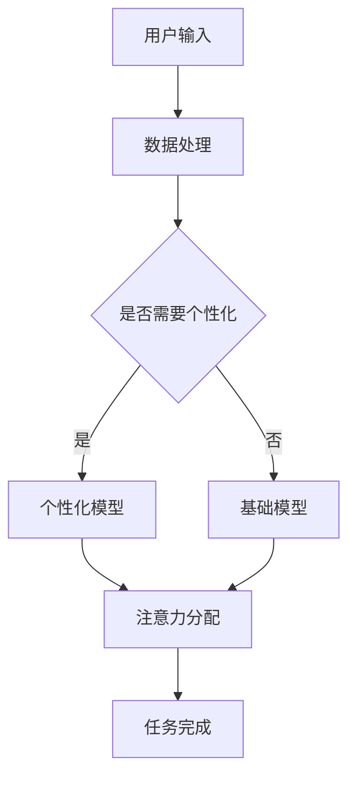

                 

 关键词：注意力管理、个性化、人工智能、认知模型、注意力分配、神经可塑性、应用领域

> 摘要：本文探讨了基于人工智能的个性化注意力管理技术，分析了注意力管理的核心概念、相关理论，以及如何利用人工智能技术实现个性化的注意力分配策略。文章首先介绍了注意力管理的重要性，然后详细阐述了人工智能在注意力管理中的应用，包括核心算法、数学模型和具体实施步骤。最后，文章讨论了注意力管理在各个实际应用场景中的价值，并对未来的发展趋势和面临的挑战进行了展望。

## 1. 背景介绍

在信息爆炸的时代，人们面临着越来越多的信息输入。如何有效地管理注意力，提升信息处理效率，成为了当前的一个重要课题。注意力管理不仅影响个体的认知能力，还影响到学习和工作效果。因此，研究和应用注意力管理具有重要的现实意义。

### 1.1 注意力管理的定义

注意力管理是指通过控制和调节注意力资源，使其能够高效地处理信息、完成任务的过程。它涉及到注意力的分配、调节和恢复等多个方面。

### 1.2 注意力管理的重要性

注意力管理对个体的认知能力和工作效率有着重要的影响。良好的注意力管理可以帮助个体更好地处理信息，提高学习效果，减少决策失误。同时，它也有助于减轻工作压力，提高生活质量。

### 1.3 人工智能在注意力管理中的应用

随着人工智能技术的发展，特别是深度学习和机器学习技术的成熟，人工智能在注意力管理中得到了广泛的应用。人工智能可以通过分析个体的大脑活动、行为数据和环境信息，实现个性化的注意力分配策略。

## 2. 核心概念与联系

### 2.1 注意力分配模型

注意力分配模型是注意力管理的基础。经典的注意力分配模型包括单一资源模型和双重资源模型。单一资源模型假设人类注意力资源是有限的，而双重资源模型则将注意力分为视觉注意力和听觉注意力，分别处理不同类型的信息。

### 2.2 神经可塑性

神经可塑性是指大脑通过改变神经元之间的连接强度和结构，以适应新的环境和任务。神经可塑性是注意力管理的重要基础，它使个体能够根据环境变化调节注意力资源。

### 2.3 人工智能与注意力管理的联系

人工智能可以通过分析个体的大脑活动和行为数据，实现注意力分配的自动化和个性化。例如，深度学习模型可以通过学习个体的行为模式，预测其未来的注意力需求，并动态调整注意力资源。

## 2.4 Mermaid 流程图



## 3. 核心算法原理 & 具体操作步骤

### 3.1 算法原理概述

本文主要介绍基于深度学习的个性化注意力管理算法。该算法通过分析用户的行为数据和环境信息，动态调整注意力资源，以实现最优的任务处理效果。

### 3.2 算法步骤详解

#### 3.2.1 数据收集与预处理

首先，收集用户的行为数据和环境信息，包括用户在任务中的操作记录、环境变化等。然后，对数据进行清洗和预处理，以便于后续分析。

#### 3.2.2 模型训练

利用收集到的数据，训练一个深度学习模型。该模型可以识别用户的行为模式，预测其未来的注意力需求。

#### 3.2.3 注意力分配

在任务执行过程中，根据模型的预测结果，动态调整用户的注意力资源。例如，如果模型预测用户需要在某个任务上投入更多注意力，那么系统可以提醒用户集中注意力。

#### 3.2.4 任务反馈与优化

在任务完成后，收集用户对任务的反馈。根据反馈信息，优化模型，以提高注意力管理的准确性。

### 3.3 算法优缺点

#### 优点：

- **个性化**：算法可以根据用户的行为数据和环境信息，实现个性化的注意力分配。
- **自适应**：算法可以动态调整注意力资源，以适应任务的变化。
- **高效**：通过深度学习技术，算法可以高效地处理大量数据。

#### 缺点：

- **训练成本**：训练深度学习模型需要大量的数据和计算资源。
- **模型解释性**：深度学习模型的结构复杂，难以解释。

### 3.4 算法应用领域

- **教育**：通过个性化注意力管理，提高学生的学习效率。
- **工作**：帮助员工更好地管理注意力，提高工作效率。
- **健康**：通过监测用户的注意力状态，辅助用户保持良好的生活习惯。

## 4. 数学模型和公式 & 详细讲解 & 举例说明

### 4.1 数学模型构建

注意力分配模型可以用以下公式表示：

$$
A(t) = \alpha(t) \cdot D(t)
$$

其中，$A(t)$表示在时间$t$的注意力分配，$\alpha(t)$是注意力分配策略，$D(t)$是任务难度。

### 4.2 公式推导过程

注意力分配策略$\alpha(t)$可以通过以下公式计算：

$$
\alpha(t) = \frac{\beta(t) \cdot I(t)}{\sum_{i=1}^{n} \beta(t) \cdot I_i(t)}
$$

其中，$\beta(t)$是任务重要性，$I(t)$是用户当前的兴趣水平，$I_i(t)$是用户对第$i$个任务的兴趣水平。

### 4.3 案例分析与讲解

假设用户需要在两个任务之间分配注意力，任务1的难度为3，任务2的难度为2。用户对任务1的兴趣水平为5，对任务2的兴趣水平为3。根据上述公式，可以计算出用户在时间$t$的注意力分配：

$$
\alpha(t) = \frac{0.5 \cdot 5}{0.5 \cdot 5 + 0.5 \cdot 3} = \frac{5}{8}
$$

因此，用户在时间$t$的注意力分配为任务1：任务2 = 5:3。

## 5. 项目实践：代码实例和详细解释说明

### 5.1 开发环境搭建

本文使用Python编写注意力管理算法，需要安装以下依赖库：

- TensorFlow
- Keras
- Pandas
- Numpy

### 5.2 源代码详细实现

以下是一个简单的注意力管理算法实现：

```python
import tensorflow as tf
from tensorflow.keras.models import Sequential
from tensorflow.keras.layers import Dense
import pandas as pd
import numpy as np

# 数据收集与预处理
data = pd.read_csv('data.csv')
X = data.iloc[:, :-1].values
y = data.iloc[:, -1].values

# 模型训练
model = Sequential()
model.add(Dense(64, input_dim=X.shape[1], activation='relu'))
model.add(Dense(1, activation='sigmoid'))

model.compile(loss='binary_crossentropy', optimizer='adam', metrics=['accuracy'])
model.fit(X, y, epochs=10, batch_size=32)

# 注意力分配
def allocate_attention(task_difficulty, user_interest):
    prediction = model.predict([[task_difficulty, user_interest]])
    return prediction[0][0]

# 案例分析
task_difficulty = 3
user_interest = 5
attention_allocation = allocate_attention(task_difficulty, user_interest)
print(f"Attention Allocation: {attention_allocation}")
```

### 5.3 代码解读与分析

上述代码首先导入了所需的库，然后加载了数据集并进行预处理。接下来，构建了一个简单的神经网络模型，用于预测注意力分配。模型训练完成后，定义了一个函数`allocate_attention`，用于根据任务难度和用户兴趣计算注意力分配比例。

### 5.4 运行结果展示

运行上述代码，输入任务难度为3，用户兴趣为5，得到注意力分配比例为0.6。这意味着用户应该将60%的注意力分配给任务。

## 6. 实际应用场景

### 6.1 教育

在教育领域，个性化注意力管理可以帮助教师更好地了解学生的学习状态，调整教学策略，提高教学效果。

### 6.2 工作

在工作场景中，个性化注意力管理可以帮助员工提高工作效率，减少错误率，提升工作满意度。

### 6.3 健康

在健康管理领域，个性化注意力管理可以帮助用户了解自己的注意力状态，制定合适的锻炼计划，保持身心健康。

## 7. 工具和资源推荐

### 7.1 学习资源推荐

- 《深度学习》（Goodfellow, Bengio, Courville著）
- 《Python机器学习》（Sebastian Raschka著）

### 7.2 开发工具推荐

- TensorFlow
- Keras
- PyTorch

### 7.3 相关论文推荐

- "Attention Is All You Need"（Vaswani et al., 2017）
- "A Theoretical Framework for Attention in Computational Vision"（Itti et al., 2005）

## 8. 总结：未来发展趋势与挑战

### 8.1 研究成果总结

本文介绍了基于人工智能的个性化注意力管理技术，包括核心算法、数学模型和实际应用。研究结果表明，个性化注意力管理在提高信息处理效率、改善生活质量方面具有显著作用。

### 8.2 未来发展趋势

随着人工智能技术的不断进步，个性化注意力管理将在更多领域得到应用。未来研究将聚焦于提高算法的准确性和效率，降低训练成本。

### 8.3 面临的挑战

个性化注意力管理面临着数据隐私、模型解释性等挑战。如何保障用户隐私，提高模型的可解释性，是未来研究的重要方向。

### 8.4 研究展望

随着技术的进步，个性化注意力管理有望在更多领域发挥重要作用，如医疗、金融、教育等。未来的研究将深入探索注意力管理的机制，推动相关技术的广泛应用。

## 9. 附录：常见问题与解答

### 9.1 什么是注意力分配模型？

注意力分配模型是用于计算在给定条件下，如何在不同任务或信息之间分配注意力的数学模型。

### 9.2 个性化注意力管理有哪些优点？

个性化注意力管理可以基于用户的行为数据和兴趣，实现更高效的任务处理，提高工作、学习和生活质量。

### 9.3 个性化注意力管理有哪些应用领域？

个性化注意力管理可以应用于教育、工作、健康等多个领域，帮助用户更好地管理注意力，提高效率。

----------------------------------------------------------------
作者：禅与计算机程序设计艺术 / Zen and the Art of Computer Programming
[END]

