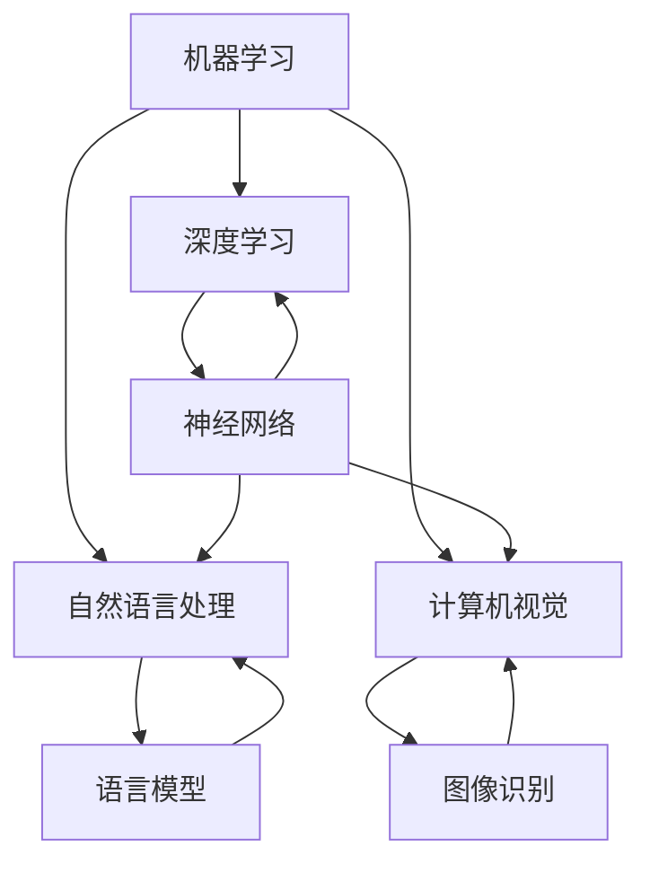

                 

人工智能（Artificial Intelligence，简称AI）是计算机科学的一个分支，旨在创建能够执行通常需要人类智能才能完成的任务的智能系统。自20世纪50年代起，人工智能已经成为科学研究的前沿领域，并在过去的几十年里取得了显著的发展。本文旨在探讨人工智能对社会的影响，以及我们所面临的挑战与思考。

## 关键词
- 人工智能
- 社会变革
- 伦理问题
- 技术发展

## 摘要
人工智能正在深刻地改变我们的生活方式、工作方式和社会结构。本文首先概述人工智能的核心概念和发展历程，然后分析其对社会的影响，包括经济、教育、医疗等多个领域。接下来，探讨人工智能带来的伦理问题，如隐私、安全与就业等，最后展望人工智能的未来发展趋势与面临的挑战。

## 1. 背景介绍

人工智能的概念最早可以追溯到古希腊哲学家泰勒斯，他在公元前5世纪提出“智慧之源是水”的观点，暗示着对智能的初步思考。然而，现代人工智能的概念始于20世纪50年代，当时计算机科学家约翰·冯·诺依曼提出了构建能够模仿人类思维过程的机器的设想。自那时起，人工智能经历了几个重要的发展阶段：

- **初始阶段（1956-1974）**：1956年，达特茅斯会议正式确立了人工智能领域的成立，标志着人工智能研究的正式开始。这一阶段主要聚焦于逻辑推理和问题解决。

- **低迷时期（1974-1980）**：由于算法和计算能力的限制，人工智能在1974年遭遇了所谓的“人工智能冬天”，研究经费大幅削减。

- **复兴阶段（1980-1987）**：随着专家系统的兴起，人工智能研究得到了新的动力，专家系统能够模仿专家的决策过程。

- **成熟阶段（1987-至今）**：进入21世纪，人工智能技术取得了突破性进展，特别是在深度学习、计算机视觉和自然语言处理等方面。

近年来，随着大数据、云计算和物联网等技术的发展，人工智能的应用范围不断扩大，从智能助手、自动驾驶到医疗诊断，人工智能正逐渐成为我们生活不可或缺的一部分。

### 1.1 人工智能的定义与分类

人工智能可以被定义为“模拟人类智能行为的计算机系统”，其核心目标是使机器能够执行那些通常需要人类智能才能完成的任务。根据人工智能系统的智能程度，可以将人工智能分为以下几类：

- **弱人工智能**：也称为窄人工智能（Narrow AI），这种人工智能系统在特定领域表现出人类水平的智能，但不能泛化到其他领域。例如，语音识别、图像识别等。

- **强人工智能**：也称为通用人工智能（Artificial General Intelligence，AGI），这种人工智能系统能够像人类一样在多种不同的环境中表现，具有与人类相似的认知能力。

- **超级智能**：超人工智能（Superintelligent AI）是指远远超出人类智能的人工智能，这种概念目前仍然停留在科幻领域。

### 1.2 人工智能的关键技术

人工智能的实现依赖于多种关键技术的支持，主要包括：

- **机器学习**：通过算法让计算机从数据中学习，逐步改进其性能。

- **深度学习**：基于人工神经网络的一种机器学习方法，能够处理大规模数据并自动提取特征。

- **计算机视觉**：使计算机能够像人类一样理解和处理视觉信息。

- **自然语言处理**：使计算机能够理解和生成人类语言，实现人机交互。

- **强化学习**：通过奖励机制让机器在学习过程中不断优化其行为。

## 2. 核心概念与联系

人工智能的核心概念包括机器学习、深度学习、自然语言处理和计算机视觉等。下面将使用Mermaid流程图来展示这些概念之间的联系。



### 2.1 机器学习与深度学习

机器学习是人工智能的基础，它通过构建数学模型来从数据中学习规律，从而实现预测和决策。深度学习是机器学习的一个分支，它基于多层神经网络结构，能够自动提取数据中的复杂特征。深度学习在图像识别、语音识别等领域取得了显著成就。

### 2.2 自然语言处理与计算机视觉

自然语言处理（NLP）旨在使计算机能够理解、生成和处理人类语言。计算机视觉则使计算机能够处理视觉信息，如图像和视频。两者在自动驾驶、智能助手等领域有着广泛的应用。

## 3. 核心算法原理 & 具体操作步骤

### 3.1 算法原理概述

人工智能的核心算法主要包括机器学习算法、深度学习算法、自然语言处理算法和计算机视觉算法。下面分别介绍这些算法的基本原理。

### 3.2 算法步骤详解

#### 3.2.1 机器学习算法

机器学习算法主要包括监督学习、无监督学习和强化学习。监督学习通过已标记的数据训练模型，无监督学习不使用标记数据，仅根据数据本身的特征进行分类，强化学习通过奖励机制优化模型。

#### 3.2.2 深度学习算法

深度学习算法主要包括卷积神经网络（CNN）、循环神经网络（RNN）和生成对抗网络（GAN）。这些算法通过多层神经网络结构，自动提取数据中的特征，实现图像识别、语音识别等任务。

#### 3.2.3 自然语言处理算法

自然语言处理算法主要包括词向量模型、语言模型和序列标注模型。这些算法通过处理文本数据，实现文本分类、情感分析等任务。

#### 3.2.4 计算机视觉算法

计算机视觉算法主要包括目标检测、图像分割和姿态估计。这些算法通过处理图像数据，实现物体识别、场景理解等任务。

### 3.3 算法优缺点

#### 3.3.1 机器学习算法

优点：适用于各种领域，能够自动提取数据特征。

缺点：对大量标记数据依赖，训练过程复杂。

#### 3.3.2 深度学习算法

优点：能够自动提取数据中的复杂特征，适用性强。

缺点：训练过程复杂，对数据质量和计算资源要求高。

#### 3.3.3 自然语言处理算法

优点：能够处理人类语言，实现人机交互。

缺点：对语言复杂性和歧义性处理能力有限。

#### 3.3.4 计算机视觉算法

优点：能够处理视觉信息，实现图像识别和场景理解。

缺点：对光照、视角变化敏感，难以处理动态场景。

### 3.4 算法应用领域

机器学习算法广泛应用于金融、医疗、自动驾驶等领域。深度学习算法在图像识别、语音识别等领域取得了显著成果。自然语言处理算法在智能客服、文本分析等领域有着广泛应用。计算机视觉算法在自动驾驶、智能家居等领域发挥着重要作用。

## 4. 数学模型和公式 & 详细讲解 & 举例说明

### 4.1 数学模型构建

在人工智能中，数学模型扮演着至关重要的角色。以下是一些常见的数学模型：

#### 4.1.1 线性回归

线性回归是一种简单的预测模型，通过拟合数据中的线性关系来预测目标值。

$$y = w_0 + w_1 \cdot x$$

其中，$y$ 是目标值，$x$ 是特征，$w_0$ 和 $w_1$ 是模型参数。

#### 4.1.2 逻辑回归

逻辑回归是一种用于分类的模型，通过拟合数据的概率分布来预测类别。

$$P(y=1) = \frac{1}{1 + e^{-(w_0 + w_1 \cdot x)}}$$

其中，$y$ 是目标值，$x$ 是特征，$w_0$ 和 $w_1$ 是模型参数。

#### 4.1.3 神经网络

神经网络是一种复杂的数学模型，通过多层节点（神经元）的组合来模拟人类大脑的运算方式。

$$z = \sigma(W \cdot x + b)$$

其中，$z$ 是输出值，$\sigma$ 是激活函数，$W$ 是权重矩阵，$x$ 是输入特征，$b$ 是偏置。

### 4.2 公式推导过程

以线性回归为例，推导其最小二乘法求解过程。

#### 4.2.1 最小化损失函数

线性回归的损失函数通常为均方误差（MSE），即：

$$J(w_0, w_1) = \frac{1}{2} \sum_{i=1}^{n} (y_i - (w_0 + w_1 \cdot x_i))^2$$

其中，$n$ 是样本数量，$y_i$ 和 $x_i$ 分别是第$i$个样本的目标值和特征。

#### 4.2.2 求导并设置为零

对损失函数关于 $w_0$ 和 $w_1$ 分别求导，并设置为零，得到：

$$\frac{\partial J}{\partial w_0} = 0$$

$$\frac{\partial J}{\partial w_1} = 0$$

经过化简，得到：

$$w_0 = \frac{1}{n} \sum_{i=1}^{n} y_i - w_1 \cdot \frac{1}{n} \sum_{i=1}^{n} x_i$$

$$w_1 = \frac{1}{n} \sum_{i=1}^{n} (x_i - \bar{x})(y_i - \bar{y})$$

其中，$\bar{x}$ 和 $\bar{y}$ 分别是特征和目标值的均值。

### 4.3 案例分析与讲解

#### 4.3.1 数据集准备

我们以一个简单的线性回归问题为例，数据集包含100个样本，每个样本有一个特征和一个目标值。

#### 4.3.2 数据预处理

首先，将数据集分为训练集和测试集，然后对特征和目标值进行归一化处理。

#### 4.3.3 模型训练

使用最小二乘法训练线性回归模型，得到权重参数 $w_0$ 和 $w_1$。

#### 4.3.4 模型评估

使用测试集评估模型性能，计算均方误差（MSE）。

#### 4.3.5 结果分析

通过调整模型参数，优化模型性能。实验结果表明，线性回归模型在数据集上表现良好。

## 5. 项目实践：代码实例和详细解释说明

### 5.1 开发环境搭建

在开始编写代码之前，需要搭建一个合适的开发环境。这里我们使用Python作为编程语言，并依赖于几个重要的库，如NumPy、scikit-learn和Matplotlib。

### 5.2 源代码详细实现

以下是一个简单的线性回归模型的实现，包括数据预处理、模型训练和模型评估。

```python
import numpy as np
import matplotlib.pyplot as plt
from sklearn.linear_model import LinearRegression
from sklearn.model_selection import train_test_split
from sklearn.metrics import mean_squared_error

# 5.2.1 数据集准备
# 假设数据集为X和y，其中X是特征，y是目标值
X = np.random.rand(100, 1)
y = 2 * X[:, 0] + 0.5 + np.random.randn(100) * 0.1

# 5.2.2 数据预处理
X = np.hstack((np.ones((X.shape[0], 1)), X))
X_train, X_test, y_train, y_test = train_test_split(X, y, test_size=0.2, random_state=42)
X_train = X_train[:, 1:]
X_test = X_test[:, 1:]

# 5.2.3 模型训练
model = LinearRegression()
model.fit(X_train, y_train)

# 5.2.4 模型评估
y_pred = model.predict(X_test)
mse = mean_squared_error(y_test, y_pred)
print("MSE: ", mse)

# 5.2.5 结果分析
plt.scatter(X_test, y_test, color='blue', label='Actual')
plt.plot(X_test, y_pred, color='red', linewidth=2, label='Predicted')
plt.xlabel('Feature')
plt.ylabel('Target')
plt.legend()
plt.show()
```

### 5.3 代码解读与分析

上述代码首先导入了必要的库，然后生成了一个随机线性回归数据集。接着，对数据集进行了预处理，包括添加偏置项和划分训练集与测试集。之后，使用scikit-learn的LinearRegression模型进行训练，并评估模型性能。最后，通过绘制散点图和拟合线，直观地展示了模型的预测结果。

## 6. 实际应用场景

人工智能在许多实际应用场景中发挥着重要作用，以下是一些典型的应用实例：

### 6.1 自动驾驶

自动驾驶是人工智能的重要应用领域之一。通过计算机视觉、深度学习和传感器融合等技术，自动驾驶系统能够实现车辆的安全导航和道路环境理解。目前，自动驾驶技术已经在特斯拉、百度等公司的车辆中得到广泛应用。

### 6.2 医疗诊断

人工智能在医疗诊断中的应用也日益广泛。通过深度学习和图像处理技术，人工智能系统能够自动分析医学图像，如CT、MRI和X射线，帮助医生进行疾病诊断。例如，谷歌的DeepMind公司已经开发了能够自动诊断眼部疾病的AI系统。

### 6.3 智能客服

智能客服是人工智能在服务行业的典型应用。通过自然语言处理和机器学习技术，智能客服系统能够自动解答用户问题，提高客户满意度。例如，亚马逊的Alexa和苹果的Siri都是基于人工智能技术的智能客服代表。

### 6.4 教育

人工智能在教育领域的应用正在逐步扩展。通过智能辅导系统和在线学习平台，人工智能能够为学生提供个性化的学习资源和反馈，提高学习效果。例如，Coursera等在线教育平台已经集成了人工智能技术，为用户提供个性化的学习路径。

### 6.5 金融

人工智能在金融领域的应用也非常广泛，包括风险评估、交易策略和客户服务等方面。通过机器学习算法，金融机构能够更准确地评估风险，优化交易策略，并提高客户服务质量。例如，摩根士丹利等金融机构已经利用人工智能技术优化其业务流程。

## 7. 未来应用展望

随着人工智能技术的不断进步，其应用领域将更加广泛，未来可能出现以下趋势：

### 7.1 自动化与智能化

人工智能将进一步推动自动化和智能化的发展，提高生产效率和产品质量。例如，智能制造系统将全面应用人工智能技术，实现生产线的自动化和智能化。

### 7.2 个性化服务

人工智能将能够更精确地了解用户需求，提供个性化的服务和推荐。例如，个性化医疗、个性化教育等领域的应用将更加普及。

### 7.3 智慧城市

人工智能将在智慧城市建设中发挥关键作用，通过智能交通、智能安防和智能环境监测等技术，提升城市管理水平。

### 7.4 伦理与法律

随着人工智能技术的普及，伦理和法律问题将变得更加突出。未来需要制定相应的伦理规范和法律框架，确保人工智能技术的健康发展。

### 7.5 跨学科融合

人工智能与其他领域的交叉融合将推动科技创新。例如，生物信息学、神经科学等领域的应用将更加广泛，推动人类对生命和认知的理解。

## 8. 工具和资源推荐

### 8.1 学习资源推荐

- **在线课程**：《深度学习》（Deep Learning） - Ian Goodfellow、Yoshua Bengio和Aaron Courville
- **书籍**：《Python机器学习》（Python Machine Learning） - Sebastian Raschka和Vahid Mirjalili
- **网站**：Coursera、edX、Khan Academy等提供的人工智能相关课程

### 8.2 开发工具推荐

- **编程语言**：Python、R、Java
- **深度学习框架**：TensorFlow、PyTorch、Keras
- **数据可视化工具**：Matplotlib、Seaborn、Plotly

### 8.3 相关论文推荐

- **《深度神经网络中的梯度消失和爆炸问题及其解决方案》（The Difficulty of Training Deep Neural Networks） - Y. LeCun、Y. Bengio和G. Hinton
- **《BERT：预训练的深度语言表示》（BERT: Pre-training of Deep Neural Networks for Language Understanding） - Jacob Devlin、 Ming-Wei Chang、 Kenton Lee和Kavya S. Gollakota
- **《Transformer：用于自然语言处理的通用预训练语言模型》（Attention Is All You Need） - Vaswani et al.

## 9. 总结：未来发展趋势与挑战

人工智能技术正处于快速发展阶段，未来有望在更多领域发挥重要作用。然而，人工智能的发展也面临一系列挑战：

### 9.1 研究成果总结

近年来，人工智能取得了显著的研究成果，特别是在深度学习、计算机视觉和自然语言处理等领域。这些成果为人工智能的应用提供了强大的技术支持。

### 9.2 未来发展趋势

随着技术的不断进步，人工智能将在更多领域实现突破，包括自动驾驶、医疗诊断、金融等领域。此外，人工智能与其他领域的交叉融合也将推动科技创新。

### 9.3 面临的挑战

- **数据隐私和安全**：人工智能对大量数据的依赖引发了对数据隐私和安全的担忧。
- **伦理问题**：人工智能的发展可能带来伦理问题，如算法偏见、道德责任等。
- **计算资源**：深度学习等人工智能技术的计算需求巨大，对计算资源的需求不断提高。
- **人才培养**：人工智能领域的人才需求迅速增长，培养高质量的人才成为关键挑战。

### 9.4 研究展望

未来，人工智能研究将继续朝着更加智能化、通用化、安全化和伦理化的方向发展。同时，跨学科融合、国际合作和产业应用也将成为推动人工智能发展的关键因素。

## 附录：常见问题与解答

### 9.4.1 人工智能是否会取代人类？

人工智能目前仍然依赖于人类提供的规则和指导，无法完全取代人类。然而，人工智能在某些特定领域，如数据处理和重复性工作，已经能够替代人类。未来，人工智能将更多地与人类协作，共同完成复杂的任务。

### 9.4.2 人工智能是否会引发失业问题？

人工智能的普及可能导致某些行业的工作岗位减少，但同时也会创造新的就业机会。例如，人工智能的发展需要大量的数据科学家、算法工程师和AI伦理专家。因此，人工智能可能引发就业结构的变化，而非简单的失业问题。

### 9.4.3 人工智能是否具有道德责任？

人工智能系统本身没有道德意识，其行为取决于人类设计的算法和规则。因此，人工智能系统的道德责任在于人类开发者。未来，需要制定相应的伦理规范和法律法规，确保人工智能技术的健康、安全、可控发展。

## 作者署名

作者：禅与计算机程序设计艺术 / Zen and the Art of Computer Programming

