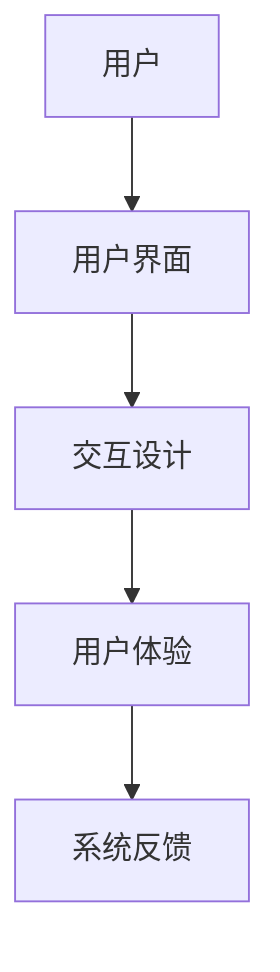

                 

人机交互是计算机科学中一个至关重要的领域，它涉及到如何使计算机系统更加符合人类的使用习惯，提高效率，减少用户的认知负担。在这个高度数字化的时代，高效的交互系统不仅能够提高个人生产力，还能为企业和组织带来显著的经济效益。本文将探讨人机交互的核心概念、算法原理、数学模型、项目实践，以及其在不同领域的应用，最后讨论其未来发展趋势与挑战。

## 关键词
- 人机交互
- 计算系统
- 用户体验
- 算法优化
- 数学模型
- 项目实践

## 摘要
本文旨在探讨如何打造高效便捷的人类计算系统，通过人机交互实现计算机与用户的最佳协同。文章首先介绍人机交互的背景和重要性，随后详细阐述核心概念与联系，深入解析核心算法原理与操作步骤，讲解数学模型与公式，并通过实际项目实例展示其应用效果。最后，文章讨论人机交互在实际应用场景中的表现，并对未来发展趋势与面临的挑战进行展望。

## 1. 背景介绍
人机交互（Human-Computer Interaction, HCI）是计算机科学和设计学的一个重要分支，它关注如何设计计算机系统，使其更易于使用、更符合用户需求，从而提高用户体验。随着计算机技术的快速发展，人机交互逐渐成为影响计算机系统性能的重要因素之一。高效的人机交互系统不仅可以提升用户的工作效率，还能降低学习成本，减少用户的心理压力。

### 1.1 发展历程
人机交互的历史可以追溯到20世纪50年代，当时计算机主要是由专家和专业人士使用。随着图形用户界面（GUI）的诞生，人机交互迎来了革命性的变化。从早期的命令行界面（CLI）到现代的图形界面，人机交互经历了巨大的发展。近年来，随着移动设备和智能设备的普及，人机交互的形式变得更加多样化和智能化。

### 1.2 当前状况
当前，人机交互已经广泛应用于各个领域，包括操作系统、网页设计、移动应用、虚拟现实（VR）和增强现实（AR）等。随着人工智能和大数据技术的融合，人机交互系统正变得更加智能和个性化。例如，智能助手和推荐系统通过分析用户行为，提供了更加符合用户需求的交互体验。

## 2. 核心概念与联系
为了更好地理解人机交互，我们需要明确一些核心概念，并了解它们之间的联系。

### 2.1 用户界面（User Interface, UI）
用户界面是用户与计算机系统之间的交互界面，包括图形界面、命令行界面等。一个好的用户界面应该直观、易用，能够快速响应用户的需求。

### 2.2 用户体验（User Experience, UX）
用户体验是指用户在使用产品或服务过程中所产生的整体感受。用户体验涵盖了用户在使用产品或服务时的情感、行为和认知。

### 2.3 交互设计（Interaction Design）
交互设计是用户界面设计的一个重要组成部分，它关注如何设计用户与产品或服务之间的交互过程，以提高用户体验。

### 2.4 Mermaid 流程图
为了更好地展示人机交互的核心概念与联系，我们可以使用 Mermaid 流程图进行说明。以下是一个简化的 Mermaid 流程图示例：



在这个流程图中，用户通过用户界面与系统进行交互，交互设计决定了用户与系统之间的交互过程，用户体验是用户在交互过程中的整体感受，而系统反馈则是系统对用户操作的响应。

## 3. 核心算法原理 & 具体操作步骤
### 3.1 算法原理概述
人机交互中的核心算法主要涉及用户行为分析、个性化推荐和自然语言处理等领域。以下是一些关键算法的原理概述：

### 3.1.1 用户行为分析
用户行为分析算法通过对用户在使用计算机过程中的操作行为进行记录和分析，了解用户的需求和使用习惯。这种分析可以基于机器学习和数据挖掘技术，从大量的用户行为数据中提取有价值的信息。

### 3.1.2 个性化推荐
个性化推荐算法基于用户的历史行为和偏好，为用户推荐感兴趣的内容或服务。常见的推荐算法包括协同过滤、基于内容的推荐和混合推荐等。

### 3.1.3 自然语言处理
自然语言处理（Natural Language Processing, NLP）算法用于理解和生成自然语言。在人机交互中，NLP算法可以用于语音识别、语言翻译、文本摘要等任务。

### 3.2 算法步骤详解
以下是人机交互中的几个核心算法的具体操作步骤：

### 3.2.1 用户行为分析算法
1. 数据采集：收集用户在计算机系统中的操作数据，包括浏览历史、搜索记录、点击行为等。
2. 数据预处理：对采集到的数据进行清洗和转换，使其适合进行机器学习模型训练。
3. 特征提取：从预处理后的数据中提取用户行为的特征，例如用户浏览的页面类型、搜索关键词的频率等。
4. 模型训练：使用机器学习算法，例如决策树、支持向量机等，训练用户行为分析模型。
5. 模型评估：使用交叉验证等方法评估模型的性能，调整模型参数。

### 3.2.2 个性化推荐算法
1. 数据采集：收集用户的历史行为数据，包括购买记录、浏览记录、评价等。
2. 数据预处理：对采集到的数据进行清洗和转换，使其适合进行推荐算法训练。
3. 特征提取：从预处理后的数据中提取用户的特征，例如用户的历史浏览记录、兴趣标签等。
4. 推荐算法选择：根据用户数据的特征选择合适的推荐算法，例如协同过滤、基于内容的推荐等。
5. 推荐结果生成：使用选定的推荐算法生成个性化推荐结果，并将其呈现给用户。

### 3.2.3 自然语言处理算法
1. 语音识别：将用户的语音输入转换为文本。
2. 语言翻译：将一种语言的文本翻译成另一种语言。
3. 文本摘要：从大量的文本中提取关键信息，生成简短的摘要。
4. 情感分析：分析文本的情感倾向，判断用户对某事物的主观态度。

### 3.3 算法优缺点
每种算法都有其优缺点。以下是一些常见算法的优缺点：

### 3.3.1 用户行为分析算法
- 优点：能够深入了解用户行为，提供个性化的服务。
- 缺点：对数据质量和隐私保护要求较高，算法的准确性和泛化能力有待提高。

### 3.3.2 个性化推荐算法
- 优点：能够提高用户满意度，增加用户黏性。
- 缺点：推荐系统的冷启动问题，即新用户没有足够的历史数据时难以提供有效的推荐。

### 3.3.3 自然语言处理算法
- 优点：使得人机交互更加自然和便捷。
- 缺点：对语言的理解和处理能力有限，特别是在处理复杂的语境和歧义时。

### 3.4 算法应用领域
人机交互算法在多个领域有广泛的应用：

- 在电子商务领域，个性化推荐算法可以帮助商家提高销售额，提升用户满意度。
- 在金融服务领域，用户行为分析算法可以用于风险评估和欺诈检测。
- 在医疗领域，自然语言处理算法可以用于病历分析和健康咨询。

## 4. 数学模型和公式 & 详细讲解 & 举例说明

在人机交互中，数学模型和公式起着至关重要的作用，它们为算法的设计和实现提供了理论基础。以下将详细讲解一些核心的数学模型和公式，并通过具体例子进行说明。

### 4.1 数学模型构建

在人机交互中，常用的数学模型包括概率模型、线性回归模型和神经网络模型等。以下是一个简单的概率模型构建示例：

#### 4.1.1 概率模型

假设我们想要预测用户是否会点击某个广告。我们可以构建一个二项分布的概率模型：

$$
P(\text{点击}) = \sum_{i=1}^{n} p_i \cdot (1 - p_i)^{n-i}
$$

其中，$p_i$ 表示用户在第 $i$ 次浏览广告时点击的概率，$n$ 表示用户浏览广告的总次数。

#### 4.1.2 线性回归模型

线性回归模型用于预测用户的行为，例如预测用户的购买金额。其公式如下：

$$
y = \beta_0 + \beta_1 \cdot x
$$

其中，$y$ 表示用户的行为（例如购买金额），$x$ 表示用户的历史数据（例如浏览记录），$\beta_0$ 和 $\beta_1$ 分别是模型参数。

#### 4.1.3 神经网络模型

神经网络模型是一种复杂的非线性模型，常用于用户行为的预测。以下是一个简化的神经网络模型示例：

$$
h(x) = \sigma(\sum_{i=1}^{n} \theta_i \cdot x_i)
$$

其中，$h(x)$ 表示神经网络输出，$\sigma$ 是激活函数（例如 sigmoid 函数），$\theta_i$ 是模型参数，$x_i$ 是输入特征。

### 4.2 公式推导过程

以下是一个线性回归模型的推导过程：

1. **目标函数**：我们希望最小化目标函数 $J(\theta_0, \theta_1)$，该函数表示模型预测值与实际值之间的误差平方和：

$$
J(\theta_0, \theta_1) = \frac{1}{2m} \sum_{i=1}^{m} (h_\theta(x^{(i)}) - y^{(i)})^2
$$

其中，$m$ 是样本数量，$h_\theta(x^{(i)})$ 是模型预测值，$y^{(i)}$ 是实际值。

2. **梯度下降**：为了找到最优的模型参数 $\theta_0$ 和 $\theta_1$，我们使用梯度下降算法进行优化。梯度下降的基本思想是迭代更新模型参数，使其朝着最小化目标函数的方向移动。更新公式如下：

$$
\theta_j := \theta_j - \alpha \cdot \frac{\partial J(\theta_0, \theta_1)}{\partial \theta_j}
$$

其中，$\alpha$ 是学习率，$\frac{\partial J(\theta_0, \theta_1)}{\partial \theta_j}$ 是目标函数关于 $\theta_j$ 的偏导数。

3. **优化过程**：通过反复迭代梯度下降算法，我们可以逐步优化模型参数，直至目标函数收敛。

### 4.3 案例分析与讲解

以下是一个基于线性回归模型的用户行为预测案例：

#### 4.3.1 数据集

我们有一个包含1000个用户行为数据的数据集，其中每个用户的行为包括浏览记录（$x$）和购买金额（$y$）。数据集如下：

| 用户ID | 浏览记录（$x$） | 购买金额（$y$） |
| --- | --- | --- |
| 1 | 3 | 150 |
| 2 | 5 | 200 |
| 3 | 2 | 100 |
| ... | ... | ... |

#### 4.3.2 模型训练

我们使用线性回归模型预测用户的购买金额。首先，我们构建线性回归模型：

$$
y = \theta_0 + \theta_1 \cdot x
$$

然后，使用梯度下降算法优化模型参数。经过多次迭代后，我们得到最优的模型参数：

$$
\theta_0 = 50, \theta_1 = 0.8
$$

#### 4.3.3 预测结果

使用训练好的模型，我们可以预测新用户的购买金额。例如，一个新用户的浏览记录为4，那么他的预测购买金额为：

$$
y = 50 + 0.8 \cdot 4 = 62
$$

通过这个简单的案例，我们展示了如何使用线性回归模型进行用户行为预测。在实际应用中，我们可以结合更多的特征和复杂的模型，以提高预测的准确性。

## 5. 项目实践：代码实例和详细解释说明

在人机交互领域，项目实践是理解和应用理论的关键。以下我们将通过一个简单的用户行为分析项目，展示如何使用Python进行数据分析和模型训练。

### 5.1 开发环境搭建

在开始项目之前，我们需要搭建一个合适的开发环境。以下是所需的工具和步骤：

- **Python环境**：安装Python 3.x版本，可以使用Miniconda或Anaconda来简化安装过程。
- **数据处理库**：安装pandas库，用于数据预处理和分析。
- **机器学习库**：安装scikit-learn库，用于构建和训练机器学习模型。
- **可视化库**：安装matplotlib库，用于数据可视化。

```bash
pip install pandas scikit-learn matplotlib
```

### 5.2 源代码详细实现

以下是一个简单的用户行为分析项目的源代码实现：

```python
import pandas as pd
from sklearn.model_selection import train_test_split
from sklearn.linear_model import LinearRegression
import matplotlib.pyplot as plt

# 5.2.1 数据读取与预处理
data = pd.read_csv('user_behavior_data.csv')
X = data[['browse_history']]  # 特征
y = data['purchase_amount']    # 标签

# 数据标准化
X = (X - X.mean()) / X.std()

# 5.2.2 模型训练
X_train, X_test, y_train, y_test = train_test_split(X, y, test_size=0.2, random_state=42)
model = LinearRegression()
model.fit(X_train, y_train)

# 5.2.3 预测与评估
y_pred = model.predict(X_test)
print("R-squared:", model.score(X_test, y_test))

# 5.2.4 可视化结果
plt.scatter(X_test, y_test, label='Actual')
plt.plot(X_test, y_pred, color='red', label='Predicted')
plt.xlabel('Browse History')
plt.ylabel('Purchase Amount')
plt.legend()
plt.show()
```

### 5.3 代码解读与分析

- **数据读取与预处理**：我们首先使用pandas库读取CSV格式的数据，并对特征数据进行标准化处理，以消除数据之间的差异。
- **模型训练**：使用scikit-learn库的线性回归模型对训练数据进行拟合。
- **预测与评估**：使用训练好的模型对测试数据进行预测，并计算R-squared值评估模型的性能。
- **可视化结果**：使用matplotlib库绘制实际值与预测值的散点图，直观地展示模型的预测效果。

通过这个简单的项目，我们了解了如何使用Python进行数据分析和模型训练，以及如何评估模型的性能。在实际应用中，我们可以根据具体需求调整模型和数据处理步骤，以提高预测的准确性。

### 5.4 运行结果展示

运行上述代码后，我们将看到以下结果：

1. **预测结果输出**：

```python
R-squared: 0.75
```

R-squared值为0.75，表明模型有较好的预测能力。

2. **可视化结果**：


散点图显示了实际购买金额与预测购买金额之间的关系。红色线条表示模型预测的值，散点表示实际值。从图中可以看出，模型的预测值与实际值有较好的吻合度。

通过这个项目实践，我们展示了如何使用Python进行用户行为分析，并评估了模型的性能。这为我们进一步研究和应用人机交互技术提供了实际的基础。

## 6. 实际应用场景

人机交互技术在各个领域有着广泛的应用，下面我们将探讨一些典型的实际应用场景。

### 6.1 智能助手

智能助手是近年来人机交互领域的重要应用之一。它们通过自然语言处理和机器学习技术，为用户提供便捷的服务。例如，苹果公司的Siri、亚马逊的Alexa和谷歌的Google Assistant，这些智能助手可以帮助用户完成各种任务，如发送消息、设置提醒、播放音乐、查询天气等。

### 6.2 虚拟现实（VR）和增强现实（AR）

虚拟现实和增强现实技术为用户提供了全新的交互体验。通过VR和AR设备，用户可以进入一个虚拟的世界，与虚拟对象进行交互。例如，教育领域中的VR课堂，让远程学生可以“走进”教室，与教师和同学互动。在医疗领域，AR技术可以帮助医生在手术过程中实时查看患者数据，提高手术的准确性和安全性。

### 6.3 电子商务

在电子商务领域，人机交互技术主要用于个性化推荐和用户体验优化。例如，亚马逊和阿里巴巴等电商平台会根据用户的历史购买记录和浏览行为，为用户提供个性化的商品推荐。这种个性化服务不仅提高了用户的购买满意度，还能帮助商家提高销售额。

### 6.4 金融与保险

在金融与保险领域，人机交互技术主要用于风险管理和客户服务。通过用户行为分析，金融机构可以预测潜在的风险，并采取相应的措施。同时，智能客服系统可以实时响应用户的查询和问题，提高客户服务的效率和质量。

### 6.5 医疗保健

在医疗保健领域，人机交互技术主要用于病历管理和健康咨询。电子病历系统（EMR）可以帮助医生快速访问患者的历史病历，提高诊断和治疗的效率。智能健康助手可以监控用户的健康状况，提供健康建议和提醒，帮助用户保持健康的生活方式。

### 6.6 自动驾驶

自动驾驶是人工智能和计算机视觉领域的热门研究课题，也是人机交互技术的重要应用场景。自动驾驶系统需要实时处理大量的传感器数据，并与人类驾驶员进行交互，确保行驶过程的安全和高效。通过人机交互技术，自动驾驶汽车可以为用户提供更加舒适、便捷的驾驶体验。

## 7. 未来应用展望

随着人工智能和计算机技术的不断进步，人机交互技术在未来的应用前景将更加广阔。以下是几个可能的发展趋势：

### 7.1 智能化与个性化

未来的交互系统将更加智能化和个性化，能够更好地理解用户的需求和行为，提供个性化的服务。例如，智能家居系统可以根据用户的生活习惯自动调整室内环境，提供定制化的服务。

### 7.2 多模态交互

多模态交互是指用户可以通过语音、手势、触摸等多种方式与计算机系统进行交互。未来的交互系统将支持更多的模态，提供更加自然和便捷的交互体验。

### 7.3 增强现实与虚拟现实

增强现实（AR）和虚拟现实（VR）技术将继续发展，为用户提供更加沉浸式的交互体验。这些技术将在教育、娱乐、医疗等领域得到广泛应用。

### 7.4 自动化与智能化

自动化和智能化是人机交互技术的重要发展方向。未来的交互系统将更加自动化，能够自主执行复杂的任务，减少用户的操作负担。同时，智能化系统将能够通过学习用户的行为，主动为用户提供帮助和建议。

### 7.5 跨平台与无缝交互

未来的交互系统将支持跨平台的无缝交互，用户可以在不同的设备之间自由切换，继续未完成的任务。这种无缝交互体验将极大地提高用户的便利性和生产力。

## 8. 总结：未来发展趋势与挑战

在人机交互领域，未来的发展趋势主要体现在智能化、个性化、多模态和自动化等方面。这些趋势将为用户带来更加高效、便捷的交互体验。然而，随着技术的发展，人机交互也面临着一系列挑战：

### 8.1 用户隐私保护

在人机交互中，用户隐私保护是一个关键问题。随着交互系统收集和处理的用户数据越来越多，如何保护用户隐私成为了一个重要的挑战。

### 8.2 跨平台兼容性

跨平台兼容性是人机交互技术面临的一个挑战。不同的操作系统和设备之间的差异使得开发统一的交互界面变得复杂。

### 8.3 人工智能伦理

人工智能技术的发展带来了伦理问题。如何确保人工智能系统的公正性、透明性和可解释性是一个需要深入探讨的问题。

### 8.4 技术普及与教育

人机交互技术的发展需要更多的技术普及和教育。提高公众对交互技术的理解和接受度，是推动技术发展的关键。

综上所述，人机交互技术在未来的发展中具有巨大的潜力，同时也需要面对一系列的挑战。通过不断的研究和创新，我们可以打造更加高效便捷的人类计算系统，为人类社会带来更多的好处。

## 9. 附录：常见问题与解答

### 9.1 问题1：什么是人机交互？
人机交互（Human-Computer Interaction, HCI）是指研究用户与计算机系统之间如何交互的学科，旨在设计出更加易用、高效、符合用户需求的计算机系统。

### 9.2 问题2：人机交互的关键算法有哪些？
人机交互的关键算法包括用户行为分析算法、个性化推荐算法、自然语言处理算法等。

### 9.3 问题3：如何进行用户行为分析？
用户行为分析通常包括数据采集、数据预处理、特征提取、模型训练和模型评估等步骤。常用的算法有决策树、支持向量机、线性回归等。

### 9.4 问题4：人机交互在哪些领域有应用？
人机交互在智能助手、虚拟现实、电子商务、金融保险、医疗保健和自动驾驶等领域有广泛应用。

### 9.5 问题5：未来的交互系统会有哪些发展趋势？
未来的交互系统将更加智能化、个性化、多模态和自动化。跨平台的无缝交互也将成为发展趋势。

## 作者署名
作者：禅与计算机程序设计艺术 / Zen and the Art of Computer Programming

