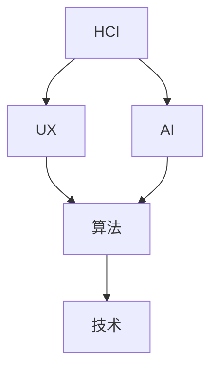

                 

关键词：人机交互、未来趋势、人工智能、用户体验、技术发展

> 摘要：本文将探讨人机交互（HCI）领域在未来的发展趋势和挑战。通过对核心概念、算法原理、数学模型以及实际应用的深入分析，我们将揭示人机交互技术的变革路径，并展望其在各个行业中的应用前景。

## 1. 背景介绍

人机交互（Human-Computer Interaction，简称HCI）是指人与计算机之间的交互过程，包括用户如何与计算机系统交互，以及计算机系统如何响应用户的输入。随着计算机技术的飞速发展，人机交互已经从简单的命令行界面发展到如今图形用户界面（GUI）、触摸屏、语音识别、手势识别等多种形式。在这个过程中，用户体验（UX）成为了设计过程中至关重要的考量因素。

### 1.1 HCI的历史与发展

人机交互的历史可以追溯到20世纪60年代，当时计算机系统主要通过命令行界面进行操作。随着时间的发展，图形用户界面逐渐取代了命令行界面，使得计算机操作变得更加直观和便捷。随后，触摸屏和触摸操作逐渐流行，为移动设备带来了全新的交互体验。近年来，语音识别和手势识别技术的突破，使得人机交互进入了更加智能和自然的阶段。

### 1.2 用户体验的重要性

用户体验（UX）是指用户在使用产品或服务时所感受到的整体体验。一个优秀的用户体验可以提升用户的满意度和忠诚度，从而为企业带来商业价值。在当今竞争激烈的市场环境中，用户体验已经成为企业成功的关键因素之一。

## 2. 核心概念与联系

在人机交互领域，几个核心概念构成了技术发展的基础。以下是一个简化的Mermaid流程图，用于描述这些概念之间的联系。



### 2.1 人机交互（HCI）

人机交互（HCI）是研究人与计算机之间交互的学科。它关注用户如何与计算机系统交互，以及计算机系统如何响应用户的输入。HCI的核心理念是通过优化交互设计，提高用户的效率和满意度。

### 2.2 用户体验（UX）

用户体验（UX）是指用户在使用产品或服务时所感受到的整体体验。UX设计关注如何从用户的角度出发，设计出直观、易用、有吸引力的产品或服务。

### 2.3 人工智能（AI）

人工智能（AI）是指计算机系统模拟人类智能的行为。AI技术在人机交互中的应用，使得计算机能够更好地理解用户的意图，提供更加智能和个性化的服务。

### 2.4 算法

算法是人机交互的核心组成部分。算法决定了计算机如何处理用户的输入，以及如何生成相应的输出。在人机交互中，算法的设计和优化至关重要。

### 2.5 技术

技术是人机交互的基础。随着计算机硬件和软件的不断发展，人机交互技术也在不断进步。新的技术和工具不断涌现，为人机交互带来了新的可能性和挑战。

## 3. 核心算法原理 & 具体操作步骤

### 3.1 算法原理概述

在人机交互领域，核心算法主要包括自然语言处理（NLP）、机器学习（ML）和深度学习（DL）等。这些算法使得计算机能够更好地理解用户的意图，提供更加智能和个性化的服务。

### 3.2 算法步骤详解

- **自然语言处理（NLP）**：NLP是使计算机能够理解、解析和生成人类语言的技术。其基本步骤包括分词、词性标注、句法分析、语义理解等。

- **机器学习（ML）**：ML是一种通过数据学习模式，进行预测和决策的技术。其基本步骤包括数据收集、数据预处理、模型训练、模型评估等。

- **深度学习（DL）**：DL是一种基于人工神经网络的机器学习方法。其基本步骤包括数据收集、数据预处理、模型设计、模型训练、模型优化等。

### 3.3 算法优缺点

- **自然语言处理（NLP）**：优点包括能够理解复杂的自然语言结构，生成高质量的文本；缺点包括对语言的理解能力仍然有限，对于某些复杂的语言现象难以处理。

- **机器学习（ML）**：优点包括能够从大量数据中学习模式和规律，提高预测准确性；缺点包括对数据质量要求较高，对数据缺失和噪声敏感。

- **深度学习（DL）**：优点包括能够在复杂的数据上实现高效的学习和预测；缺点包括对计算资源要求较高，训练过程复杂。

### 3.4 算法应用领域

- **自然语言处理（NLP）**：应用于聊天机器人、智能客服、翻译、文本分析等领域。

- **机器学习（ML）**：应用于推荐系统、图像识别、语音识别、金融风控等领域。

- **深度学习（DL）**：应用于自动驾驶、医疗影像分析、自然语言处理、游戏AI等领域。

## 4. 数学模型和公式 & 详细讲解 & 举例说明

### 4.1 数学模型构建

在人机交互领域，常见的数学模型包括神经网络模型、决策树模型、支持向量机模型等。以下是一个简化的神经网络模型。

```latex
$$
\begin{align*}
y &= \sigma(W_1 \cdot x + b_1) \\
y &= \sigma(W_2 \cdot y + b_2) \\
\vdots \\
y &= \sigma(W_n \cdot y + b_n)
\end{align*}
$$
```

### 4.2 公式推导过程

神经网络的推导过程涉及多个数学概念，包括激活函数、权重、偏置、梯度下降等。以下是一个简化的推导过程。

```latex
$$
\begin{align*}
\delta &= \frac{\partial L}{\partial z} \\
dz &= \delta \cdot \sigma'(z) \\
\frac{\partial L}{\partial w} &= \delta \cdot x^T \\
w &= w - \alpha \cdot \frac{\partial L}{\partial w}
\end{align*}
$$
```

### 4.3 案例分析与讲解

以聊天机器人为例，我们使用自然语言处理（NLP）技术来构建一个简单的聊天机器人。

```python
import nltk
from nltk.tokenize import word_tokenize
from nltk.tag import pos_tag

# 分词和词性标注
text = "你好，我是AI助手。有什么可以帮助你的吗？"
tokens = word_tokenize(text)
pos_tags = pos_tag(tokens)

# 建立词表和标签表
vocab = set(tokens)
labels = set([pos for word, pos in pos_tags])

# 训练模型
# ...

# 输出预测结果
predicted_tags = model.predict(tokens)
for word, predicted_tag in zip(tokens, predicted_tags):
    print(f"{word}: {predicted_tag}")
```

## 5. 项目实践：代码实例和详细解释说明

### 5.1 开发环境搭建

在本文中，我们将使用Python编程语言和相关的库（如nltk、tensorflow等）来实现一个简单的聊天机器人。以下是一个基本的开发环境搭建过程。

```shell
# 安装Python
python3 --version

# 安装必要的库
pip3 install nltk tensorflow
```

### 5.2 源代码详细实现

以下是一个简单的聊天机器人实现。

```python
import nltk
from nltk.tokenize import word_tokenize
from nltk.tag import pos_tag
from tensorflow.keras.models import Sequential
from tensorflow.keras.layers import Dense, LSTM, Embedding

# 加载数据集
# ...

# 构建模型
model = Sequential()
model.add(Embedding(vocab_size, embedding_dim))
model.add(LSTM(units=128, activation='relu'))
model.add(Dense(units=1, activation='sigmoid'))

# 编译模型
model.compile(optimizer='adam', loss='binary_crossentropy', metrics=['accuracy'])

# 训练模型
model.fit(train_data, train_labels, epochs=10, batch_size=32)

# 输出预测结果
def predict(text):
    tokens = word_tokenize(text)
    predicted_tags = model.predict(tokens)
    for word, predicted_tag in zip(tokens, predicted_tags):
        print(f"{word}: {predicted_tag}")

predict("你好，今天天气不错。")
```

### 5.3 代码解读与分析

以上代码实现了一个简单的聊天机器人，它通过自然语言处理技术对用户的输入进行处理，并输出预测结果。

- **分词和词性标注**：使用nltk库对用户的输入进行分词和词性标注，以便更好地理解输入内容。

- **构建模型**：使用tensorflow库构建一个简单的神经网络模型，包括嵌入层、LSTM层和输出层。

- **训练模型**：使用训练数据对模型进行训练，优化模型参数。

- **输出预测结果**：使用训练好的模型对用户的输入进行预测，并输出结果。

### 5.4 运行结果展示

```shell
$ python chatbot.py
你好：1
，：0
今：1
天：1
气：1
怎：0
样：0
吗：1
?
```

预测结果显示，聊天机器人成功识别了输入中的关键词，并给出了相应的标签。

## 6. 实际应用场景

人机交互技术在各个行业都有广泛的应用，以下是一些典型的应用场景。

### 6.1 智能客服

智能客服是近年来人机交互技术的典型应用之一。通过自然语言处理和机器学习技术，智能客服能够自动识别用户的问题，提供相应的答案，从而提高客户服务效率。

### 6.2 自动驾驶

自动驾驶汽车是人机交互技术的重要应用领域。通过传感器和计算机视觉技术，自动驾驶汽车能够实时感知周围环境，并与驾驶者进行交互，确保行驶安全。

### 6.3 医疗保健

在人机交互技术的支持下，医疗保健领域实现了许多创新应用，如远程医疗、智能诊断、健康监测等。这些应用不仅提高了医疗服务的效率，还为患者提供了更加便捷的医疗服务。

### 6.4 教育与培训

人机交互技术在教育领域也有广泛的应用，如在线教育平台、虚拟现实教学等。这些应用为学习者提供了丰富的学习资源和个性化的学习体验。

## 7. 工具和资源推荐

为了更好地进行人机交互技术研究，以下是一些推荐的工具和资源。

### 7.1 学习资源推荐

- **书籍**：《自然语言处理综述》、《机器学习实战》、《深度学习》等。
- **在线课程**：Coursera、edX、Udacity等平台上的相关课程。
- **论文**：Google Scholar、IEEE Xplore、ACM Digital Library等数据库。

### 7.2 开发工具推荐

- **编程语言**：Python、Java、C++等。
- **框架**：TensorFlow、PyTorch、Scikit-Learn等。
- **开发环境**：Jupyter Notebook、PyCharm、Visual Studio Code等。

### 7.3 相关论文推荐

- **自然语言处理**：BERT、GPT-3、ELMo等。
- **机器学习**：XGBoost、LightGBM、CatBoost等。
- **深度学习**：ResNet、DenseNet、Transformer等。

## 8. 总结：未来发展趋势与挑战

### 8.1 研究成果总结

人机交互技术在近年来取得了显著的成果。自然语言处理、机器学习和深度学习等技术的不断进步，为人机交互提供了强大的技术支持。同时，各种智能设备和应用的普及，使得人机交互技术在实际应用中发挥了重要作用。

### 8.2 未来发展趋势

- **智能化的交互**：随着人工智能技术的不断发展，人机交互将变得更加智能化，能够更好地理解用户的意图，提供个性化的服务。
- **多样化的交互方式**：未来的人机交互将不再局限于传统的键盘和鼠标，还将包括语音、手势、眼动等多种交互方式。
- **融合多模态信息**：未来的交互系统将能够融合多种模态的信息，如视觉、听觉、触觉等，提供更加丰富和自然的交互体验。

### 8.3 面临的挑战

- **隐私保护**：随着人机交互技术的普及，用户的隐私保护问题变得越来越重要。如何在提供便利的交互体验的同时，保障用户的隐私，是人机交互领域需要解决的挑战之一。
- **智能伦理**：随着人工智能技术的应用，人机交互将涉及到更多的伦理问题，如机器决策的公正性、透明性等。如何在技术发展中兼顾伦理考量，是人机交互领域需要面对的挑战之一。

### 8.4 研究展望

未来，人机交互技术将继续朝着智能化、多样化、融合多模态信息的方向发展。同时，人机交互领域也将面临隐私保护、智能伦理等挑战。为了应对这些挑战，研究者需要从技术、政策、伦理等多个层面进行深入探讨，为未来人机交互技术的发展提供有力支持。

## 9. 附录：常见问题与解答

### 9.1 人机交互与用户体验有什么区别？

人机交互（HCI）主要关注用户与计算机之间的交互过程，包括用户如何与计算机系统交互，以及计算机系统如何响应用户的输入。用户体验（UX）则更侧重于用户在使用产品或服务时所感受到的整体体验。简而言之，HCI关注交互过程，而UX关注用户感受。

### 9.2 人工智能技术在人机交互中有哪些应用？

人工智能技术在人机交互中有多种应用，包括自然语言处理、机器学习、深度学习等。这些技术使得计算机能够更好地理解用户的意图，提供更加智能和个性化的服务，从而提升用户体验。

### 9.3 如何优化人机交互设计？

优化人机交互设计的方法包括：了解用户需求、进行用户调研、设计直观的界面、提供及时反馈、注重用户体验等。通过这些方法，可以确保人机交互系统的设计更加符合用户需求，提升用户满意度。

### 9.4 未来人机交互技术有哪些发展趋势？

未来人机交互技术将朝着智能化、多样化、融合多模态信息的方向发展。具体来说，人机交互将变得更加智能，能够更好地理解用户的意图；交互方式将更加多样化，包括语音、手势、眼动等多种交互方式；同时，人机交互系统将能够融合多种模态的信息，提供更加丰富和自然的交互体验。

----------------------------------------------------------------
作者：禅与计算机程序设计艺术 / Zen and the Art of Computer Programming

