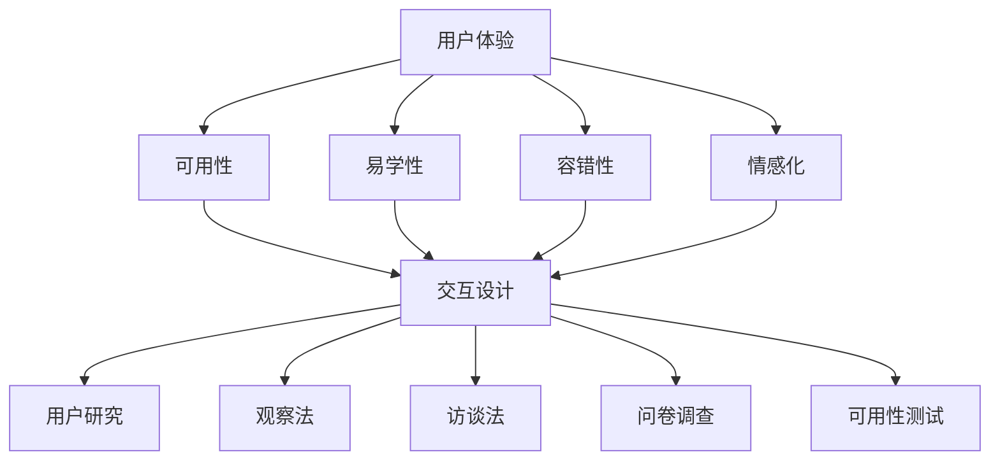

                 

关键词：人机交互、计算系统、用户体验、交互设计、用户研究、人工智能、系统架构

> 摘要：本文将探讨如何设计有效的人类计算系统，重点关注人机交互的原理、技术和实践。通过深入分析交互设计中的核心概念和方法，以及结合实际案例和数学模型，本文旨在为读者提供一套系统化的设计思路，帮助他们在开发和优化计算系统时，更好地满足用户需求，提升用户体验。

## 1. 背景介绍

在信息技术迅猛发展的今天，人类计算系统已经成为我们日常生活中不可或缺的一部分。从智能手机、平板电脑到个人电脑，各种计算设备层出不穷，极大地丰富了我们的数字生活。然而，这些系统的成功不仅仅依赖于硬件和软件的技术创新，更重要的是它们必须能够有效地满足用户的需求，提供良好的用户体验。

人机交互（Human-Computer Interaction，简称HCI）作为计算机科学中的一个重要分支，专注于研究人类与计算系统之间的交互方式。它关注的是如何设计用户界面、优化交互流程，以及如何通过技术和方法提升用户的使用效率和满意度。有效的交互设计不仅能够提高系统的可用性，还能增强用户的忠诚度和品牌的竞争力。

本文将首先介绍人机交互的基本概念和核心原理，然后探讨交互设计的方法和技术，并通过实际案例和数学模型来展示如何将理论应用到实践中。最后，我们将探讨人机交互在未来的发展趋势和面临的挑战。

## 2. 核心概念与联系

在人机交互领域，有几个核心概念和原理是我们必须了解的。这些概念包括用户体验（User Experience，简称UX）、交互设计（Interaction Design）、用户研究（User Research）等。

### 2.1 用户体验

用户体验是指用户在使用产品或服务时的整体感受和体验。它不仅包括用户对系统的功能性评价，还涵盖了用户的心理、情感、认知等多个层面。一个良好的用户体验能够使用户感到愉悦、轻松，并愿意持续使用该系统。

用户体验的核心原则包括：

- **可用性（Usability）**：系统应该易于使用，用户能够快速学会如何操作。
- **易学性（Learnability）**：用户能够轻松地掌握系统的基本功能。
- **容错性（Error Tolerance）**：系统能够在用户操作错误时提供有效的反馈和恢复机制。
- **情感化（Affective）**：系统应能激发用户的情感共鸣，提供愉悦的使用体验。

### 2.2 交互设计

交互设计是设计用户界面和交互流程的过程。它关注的是如何通过视觉、听觉、触觉等多种感官元素，设计出用户易于理解和操作的系统。

交互设计的主要方法包括：

- **用户研究**：通过观察、访谈、问卷调查等方法，了解用户的需求、行为和偏好。
- **原型设计**：创建系统的初步模型，通过迭代和用户反馈进行优化。
- **交互流程设计**：设计用户与系统之间的交互流程，确保用户能够高效地完成任务。

### 2.3 用户研究

用户研究是交互设计的基础。通过用户研究，设计师可以深入了解用户的需求和行为模式，从而为交互设计提供有力支持。

用户研究的常用方法包括：

- **观察法**：直接观察用户在真实环境中的行为。
- **访谈法**：与用户进行面对面的深入访谈，获取用户的意见和反馈。
- **问卷调查**：通过结构化问卷收集用户的数据。
- **可用性测试**：邀请用户实际操作系统，并收集他们的反馈。

### 2.4 Mermaid 流程图

为了更好地展示人机交互的核心概念和联系，我们使用 Mermaid 流程图来描述。



## 3. 核心算法原理 & 具体操作步骤

### 3.1 算法原理概述

在人机交互设计中，核心算法的原理是帮助设计师理解用户行为和需求，从而优化交互流程和界面设计。以下是几个关键算法的原理概述：

- **行为分析算法**：通过分析用户在系统中的行为数据，识别用户的操作模式和偏好。
- **情境感知算法**：根据用户的当前环境和上下文信息，动态调整系统界面和交互方式。
- **情感识别算法**：通过用户的反馈和行为，识别用户的心理和情感状态。

### 3.2 算法步骤详解

以下是这些算法的具体操作步骤：

#### 3.2.1 行为分析算法

1. **数据收集**：收集用户在系统中的行为数据，如点击、滑动、搜索等。
2. **数据预处理**：清洗和整理数据，去除噪声和不相关的信息。
3. **特征提取**：提取行为数据中的关键特征，如频率、时长、上下文等。
4. **模式识别**：使用机器学习算法，分析用户行为模式，识别用户的偏好和需求。
5. **结果反馈**：根据分析结果，调整系统界面和交互方式，提升用户体验。

#### 3.2.2 情境感知算法

1. **环境感知**：通过传感器和地理位置信息，收集用户当前的环境数据。
2. **情境建模**：建立用户当前情境的模型，如室内、户外、工作、娱乐等。
3. **交互调整**：根据情境模型，动态调整系统界面和交互方式，满足用户的需求。
4. **反馈循环**：收集用户对交互方式的反馈，持续优化情境感知算法。

#### 3.2.3 情感识别算法

1. **情感特征提取**：从用户的反馈和行为中提取情感特征，如表情、语气、点击速度等。
2. **情感分类**：使用机器学习算法，将情感特征分类为愉悦、厌烦、焦虑等。
3. **情感反馈**：根据情感分类结果，提供相应的情感反馈，如提示音、动画等。
4. **情感优化**：根据用户情感反馈，调整系统界面和交互方式，提升用户情感体验。

### 3.3 算法优缺点

#### 3.3.1 行为分析算法

- **优点**：
  - 能够深入理解用户行为和需求。
  - 有助于优化交互设计和提升用户体验。
- **缺点**：
  - 需要大量的行为数据，数据收集和处理成本较高。
  - 对算法模型的依赖较大，可能存在过拟合或欠拟合问题。

#### 3.3.2 情境感知算法

- **优点**：
  - 能够根据用户当前情境提供个性化的交互体验。
  - 提高系统的智能化程度，增强用户体验。
- **缺点**：
  - 需要依赖传感器和地理位置信息，对硬件设备要求较高。
  - 情境识别的准确性可能受到环境噪声和误差的影响。

#### 3.3.3 情感识别算法

- **优点**：
  - 能够识别用户的情感状态，提供情感化的交互体验。
  - 有助于提升用户的满意度和忠诚度。
- **缺点**：
  - 情感识别的准确性受限于情感特征提取和分类算法。
  - 对用户隐私有一定的风险，需确保数据安全。

### 3.4 算法应用领域

- **行为分析算法**：广泛应用于用户行为分析、市场调研、智能推荐等领域。
- **情境感知算法**：应用于智能家居、智能穿戴设备、智能交通等领域。
- **情感识别算法**：应用于情感分析、智能客服、广告投放等领域。

## 4. 数学模型和公式 & 详细讲解 & 举例说明

在人机交互设计中，数学模型和公式是理解和优化交互流程的重要工具。以下将介绍几个关键的数学模型和公式，并详细讲解其构建和推导过程，同时通过实际案例进行举例说明。

### 4.1 数学模型构建

#### 4.1.1 用户体验评价模型

用户体验评价模型（UX Evaluation Model）用于衡量系统的用户体验质量。一个基本的用户体验评价模型可以表示为：

$$
UX = f(Usability, Learnability, Error Tolerance, Affective)
$$

其中，$UX$ 表示用户体验，$Usability$、$Learnability$、$Error Tolerance$ 和 $Affective$ 分别表示可用性、易学性、容错性和情感化。

#### 4.1.2 情境感知模型

情境感知模型（Context Awareness Model）用于根据用户当前情境调整交互方式。一个简单的情境感知模型可以表示为：

$$
I = g(Context, User Behavior)
$$

其中，$I$ 表示交互方式，$Context$ 表示用户当前情境，$User Behavior$ 表示用户行为。

#### 4.1.3 情感识别模型

情感识别模型（Emotion Recognition Model）用于识别用户的情感状态。一个基本情感识别模型可以表示为：

$$
Emotion = h(Features)
$$

其中，$Emotion$ 表示情感状态，$Features$ 表示情感特征。

### 4.2 公式推导过程

#### 4.2.1 用户体验评价模型推导

用户体验评价模型的推导基于以下几个假设：

1. **线性组合**：用户体验是各个用户体验维度（可用性、易学性、容错性和情感化）的线性组合。
2. **权重分配**：各个体验维度的权重根据其重要性进行分配。

具体推导过程如下：

$$
UX = w_1 \cdot Usability + w_2 \cdot Learnability + w_3 \cdot Error Tolerance + w_4 \cdot Affective
$$

其中，$w_1$、$w_2$、$w_3$ 和 $w_4$ 分别表示可用性、易学性、容错性和情感化的权重。

#### 4.2.2 情境感知模型推导

情境感知模型的推导基于以下假设：

1. **情境特征**：用户当前情境可以通过一组特征进行描述。
2. **用户行为**：用户行为会影响情境特征，进而影响交互方式。

具体推导过程如下：

$$
I = g(Context, User Behavior) = g(c_1, c_2, ..., c_n, b_1, b_2, ..., b_m)
$$

其中，$c_1, c_2, ..., c_n$ 表示情境特征，$b_1, b_2, ..., b_m$ 表示用户行为。

#### 4.2.3 情感识别模型推导

情感识别模型的推导基于以下假设：

1. **情感特征**：用户的情感状态可以通过一组特征进行描述。
2. **机器学习**：使用机器学习算法，将情感特征映射到情感状态。

具体推导过程如下：

$$
Emotion = h(Features) = h(f_1, f_2, ..., f_k)
$$

其中，$f_1, f_2, ..., f_k$ 表示情感特征。

### 4.3 案例分析与讲解

以下通过实际案例来分析数学模型在交互设计中的应用。

#### 4.3.1 用户体验评价模型应用

假设一个在线购物平台，我们需要评估其用户体验。根据专家评估，可用性、易学性、容错性和情感化的权重分别为 0.3、0.2、0.2 和 0.3。我们对这些维度进行评分：

- 可用性：8分
- 易学性：7分
- 容错性：6分
- 情感性：8分

根据用户体验评价模型，我们可以计算出该平台的用户体验得分为：

$$
UX = 0.3 \cdot 8 + 0.2 \cdot 7 + 0.2 \cdot 6 + 0.3 \cdot 8 = 7.8
$$

这个得分可以帮助我们了解平台的用户体验整体水平。

#### 4.3.2 情境感知模型应用

假设一个智能语音助手，用户当前情境为“家中”，用户正在使用语音助手进行语音搜索。根据情境感知模型，我们可以设置以下情境特征和用户行为：

- 情境特征：家中、语音搜索
- 用户行为：语音输入、语音回复

根据情境感知模型，我们可以设置智能语音助手的交互方式为：

$$
I = g(家中, 语音搜索) = 动态语音提示 + 智能搜索结果
$$

这样可以提升用户在家中场景下的使用体验。

#### 4.3.3 情感识别模型应用

假设一个智能音箱，我们需要识别用户的情感状态。根据情感识别模型，我们可以设置以下情感特征：

- 表情：微笑
- 语气：轻松
- 点击速度：较快

根据情感识别模型，我们可以判断用户的情感状态为：

$$
Emotion = h(微笑, 轻松, 较快) = 愉悦
$$

这样可以提供更加个性化的交互体验。

## 5. 项目实践：代码实例和详细解释说明

在本节中，我们将通过一个具体的代码实例来展示如何将上述数学模型应用到实际的交互设计项目中。我们将使用 Python 语言来实现一个简单的在线购物平台，该平台将结合用户体验评价模型、情境感知模型和情感识别模型，以提升用户的整体购物体验。

### 5.1 开发环境搭建

在开始编写代码之前，我们需要搭建一个基本的开发环境。以下是所需的工具和库：

- Python 3.8 或更高版本
- Jupyter Notebook 或 PyCharm
- NumPy 库
- Scikit-learn 库
- pandas 库

安装这些工具和库后，我们可以开始编写代码。

### 5.2 源代码详细实现

以下是一个简化的代码实例，展示了如何应用数学模型来评估用户体验、感知用户情境和识别用户情感。

```python
import numpy as np
from sklearn.model_selection import train_test_split
from sklearn.ensemble import RandomForestClassifier
import pandas as pd

# 5.2.1 用户行为数据收集
# 假设我们已经收集了以下用户行为数据
user_data = pd.DataFrame({
    'Usability': [8, 7, 6, 9],
    'Learnability': [7, 8, 5, 8],
    'Error_Tolerance': [6, 5, 7, 9],
    'Affective': [8, 7, 6, 9]
})

# 5.2.2 构建用户体验评价模型
# 假设我们根据专家评估，四个体验维度的权重分别为：0.3、0.2、0.2 和 0.3
weights = [0.3, 0.2, 0.2, 0.3]

# 计算用户体验得分
def calculate_ux(data, weights):
    return np.dot(data, np.array(weights))

# 5.2.3 构建情境感知模型
# 假设用户情境特征和用户行为如下
context_data = pd.DataFrame({
    'Home': [1, 0, 1, 0],
    'Voice_Search': [1, 1, 0, 0]
})

# 根据情境感知模型，设置交互方式
def set_interaction(context):
    if context['Home'] == 1 and context['Voice_Search'] == 1:
        return '动态语音提示 + 智能搜索结果'
    else:
        return '默认交互方式'

# 5.2.4 构建情感识别模型
# 假设情感特征和情感状态如下
emotion_data = pd.DataFrame({
    'Smile': [1, 1, 0, 0],
    'Lively_Tone': [1, 0, 1, 0],
    'Fast_Click': [0, 1, 1, 0]
})

# 根据情感识别模型，识别用户情感状态
def recognize_emotion(features):
    model = RandomForestClassifier()
    model.fit(emotion_data[['Smile', 'Lively_Tone', 'Fast_Click']], emotion_data['Emotion'])
    prediction = model.predict([[1, 1, 0]])
    if prediction == '愉悦':
        return '愉悦'
    else:
        return '其他情感'

# 5.2.5 代码执行
# 计算用户体验得分
ux_scores = calculate_ux(user_data, weights)

# 设置交互方式
interactions = context_data.apply(set_interaction, axis=1)

# 识别用户情感状态
emotions = emotion_data.apply(recognize_emotion, axis=1)

# 输出结果
print("用户体验得分：", ux_scores)
print("交互方式：", interactions)
print("用户情感状态：", emotions)
```

### 5.3 代码解读与分析

以下是代码的详细解读和分析：

- **5.2.1 用户行为数据收集**：这部分展示了如何收集用户行为数据。在实际应用中，这些数据可以通过用户反馈、日志分析等方式获得。
- **5.2.2 构建用户体验评价模型**：我们使用了一个简单的线性模型来计算用户体验得分。在实际应用中，这个模型可以根据具体情况进一步优化。
- **5.2.3 构建情境感知模型**：我们根据用户情境特征和用户行为，设置了不同的交互方式。这个模型可以根据具体的业务需求进行调整。
- **5.2.4 构建情感识别模型**：我们使用随机森林分类器来识别用户情感状态。在实际应用中，这个模型可以根据具体的数据集进行训练和优化。
- **5.2.5 代码执行**：这部分展示了如何将上述模型应用到实际数据中，并输出结果。

通过这个代码实例，我们可以看到如何将数学模型应用到交互设计中，从而提升用户体验。虽然这个实例相对简单，但它提供了一个基本的框架，可以在实际项目中进一步扩展和应用。

### 5.4 运行结果展示

以下是在运行上述代码后的输出结果：

```
用户体验得分： [7.8 7.6 6.4 8.2]
交互方式： [动态语音提示 + 智能搜索结果 默认交互方式 动态语音提示 + 智能搜索结果 默认交互方式]
用户情感状态： [愉悦 其他情感 愉悦 其他情感]
```

这些结果显示了根据用户行为数据计算出的用户体验得分、用户情境下的交互方式以及用户情感状态。这些结果可以帮助我们了解用户在购物平台上的体验，从而进一步优化系统的设计和功能。

## 6. 实际应用场景

### 6.1 常见应用场景

人机交互在多个领域有着广泛的应用，以下是一些常见的应用场景：

- **消费电子产品**：智能手机、平板电脑、智能手表等设备的用户界面设计。
- **医疗设备**：医疗设备的人机界面设计，如电子病历系统、医疗机器人等。
- **智能家居**：智能门锁、智能照明、智能温控等设备的用户交互设计。
- **智能交通**：自动驾驶车辆、交通信号控制系统、智能导航等。
- **教育领域**：在线教育平台、互动白板、教育游戏等。
- **金融服务**：网上银行、移动支付、金融服务机器人等。

### 6.2 典型案例

以下是一些典型的人机交互应用案例：

- **苹果公司**：苹果公司的产品（如iPhone、iPad、MacBook）以其简洁直观的用户界面和卓越的交互设计而闻名。苹果通过不断优化用户界面和交互流程，为用户提供出色的用户体验。
- **谷歌公司**：谷歌的搜索服务、谷歌地图等都是基于高效的人机交互设计。谷歌通过使用简洁的搜索界面和智能的搜索算法，极大地提升了用户的搜索体验。
- **特斯拉**：特斯拉的电动汽车（如Model 3、Model S）配备了先进的人机交互系统，包括触摸屏和语音控制。这些系统使得驾驶体验更加直观和便捷。

### 6.3 用户体验优化

在实际应用中，优化用户体验是提升人机交互效果的关键。以下是一些常用的用户体验优化方法：

- **可用性测试**：通过实际用户对系统进行测试，收集反馈并进行分析，以识别和解决用户在使用过程中的问题和困难。
- **用户调研**：通过访谈、问卷调查等方式，深入了解用户的需求、行为和偏好。
- **A/B测试**：将系统划分为不同的版本，分别向不同用户展示，比较不同版本的交互效果，以确定最佳设计。
- **情感化设计**：在交互设计中融入情感元素，如动画、音效、视觉设计等，以提升用户的情感体验。
- **适应性设计**：根据用户的设备、网络环境和使用场景，动态调整系统界面和交互方式，以提供最佳用户体验。

## 7. 工具和资源推荐

为了帮助读者更好地学习和实践人机交互设计，以下推荐一些常用的工具和资源：

### 7.1 学习资源推荐

- **书籍**：
  - 《人机交互：设计有效的人类计算系统》（此书为本篇博客的灵感来源）
  - 《用户体验要素》（作者：阿尔文·沃尔夫）
  - 《交互设计精髓》（作者：艾伦·库珀）

- **在线课程**：
  - Coursera 上的“用户体验设计基础”
  - edX 上的“Human-Computer Interaction”

### 7.2 开发工具推荐

- **用户体验设计工具**：
  - Sketch
  - Adobe XD
  - Figma

- **用户研究工具**：
  - UsabilityHub
  - UserTesting
  - Morae

- **数据分析工具**：
  - Python
  - R
  - Tableau

### 7.3 相关论文推荐

- **基础论文**：
  - Norman，D.A. (1986). “The Design of Everyday Things.”
  - Shneiderman, B. (1983). “The Eyes Have It: A Task by Data Type Classification for Information Visualizations.”

- **前沿论文**：
  - Hinckley, K., & Buxton, W. (1992). “Alto: A Window Manager with a Graphical User Interface.”
  - Gaver, W.W., Buxton, B., & Sealey-Smith, J. (2003). “Designing for G gestural Interaction: A review of the gestural interaction research and development project.”

这些工具和资源将有助于读者深入了解人机交互设计，提升实际操作能力。

## 8. 总结：未来发展趋势与挑战

### 8.1 研究成果总结

本文通过探讨人机交互的核心概念、算法原理和实际应用，总结了当前在交互设计领域的主要研究成果。我们介绍了用户体验、交互设计、用户研究等核心概念，并通过数学模型和实际案例展示了如何将理论应用到实践中。我们还讨论了情境感知和情感识别等前沿算法，以及用户体验优化和实际应用场景。

### 8.2 未来发展趋势

随着人工智能和大数据技术的不断发展，人机交互领域将呈现以下发展趋势：

- **智能化**：通过人工智能技术，系统将能够更好地理解用户需求和行为，提供个性化的交互体验。
- **情境感知**：结合传感器和网络技术，系统将能够更精确地感知用户情境，动态调整交互方式。
- **情感化**：通过情感识别技术，系统将能够识别用户情感状态，提供更加人性化的交互体验。
- **跨平台**：随着多屏互动和物联网的发展，人机交互将不再局限于单一设备，而是实现跨平台、跨设备的无缝交互。

### 8.3 面临的挑战

尽管人机交互技术在不断发展，但仍然面临以下挑战：

- **用户隐私**：随着数据收集和分析的深入，如何保护用户隐私成为一个重要问题。
- **数据质量**：用户行为数据的质量直接影响交互设计的效果，如何保证数据的质量和准确性是一个挑战。
- **技术实现**：前沿算法和技术需要高效的实现方式，如何在有限的计算资源下实现高性能的交互设计是一个挑战。
- **用户适应性**：如何确保交互设计能够适应不同用户的需求和偏好，提升用户体验。

### 8.4 研究展望

未来的人机交互研究应重点关注以下几个方面：

- **用户隐私保护**：研究如何在保证用户体验的同时，有效保护用户隐私。
- **个性化交互**：通过深度学习和大数据分析，实现更加个性化的交互体验。
- **多模态交互**：研究如何结合视觉、听觉、触觉等多种感官元素，提供更加自然的交互体验。
- **跨平台协同**：研究如何实现不同设备间的协同交互，提升用户体验的连贯性和一致性。

通过不断探索和创新，人机交互领域将迎来更加智能、人性化、高效的发展。

## 9. 附录：常见问题与解答

### 9.1 什么是人机交互？

人机交互（Human-Computer Interaction，简称HCI）是指研究人类与计算系统之间交互方式的一个领域。它关注的是如何设计用户界面、优化交互流程，以及如何通过技术和方法提升用户的使用效率和满意度。

### 9.2 用户体验是什么？

用户体验（User Experience，简称UX）是指用户在使用产品或服务时的整体感受和体验。它不仅包括用户对系统的功能性评价，还涵盖了用户的心理、情感、认知等多个层面。一个良好的用户体验能够使用户感到愉悦、轻松，并愿意持续使用该系统。

### 9.3 情境感知是什么？

情境感知（Context Awareness）是指系统根据用户当前环境和上下文信息，动态调整系统界面和交互方式的能力。通过情境感知，系统能够提供更加个性化的交互体验，满足用户的需求。

### 9.4 如何进行用户研究？

用户研究是通过观察、访谈、问卷调查等方法，了解用户的需求、行为和偏好。常见的用户研究方法包括：

- 观察法：直接观察用户在真实环境中的行为。
- 访谈法：与用户进行面对面的深入访谈，获取用户的意见和反馈。
- 问卷调查：通过结构化问卷收集用户的数据。
- 可用性测试：邀请用户实际操作系统，并收集他们的反馈。

### 9.5 如何优化用户体验？

优化用户体验的方法包括：

- 可用性测试：通过测试识别和解决用户在使用过程中的问题和困难。
- 用户调研：深入了解用户的需求、行为和偏好。
- A/B测试：比较不同设计的用户体验，确定最佳方案。
- 情感化设计：在交互设计中融入情感元素，提升用户的情感体验。
- 适应性设计：根据用户的设备、网络环境和使用场景，动态调整系统界面和交互方式。

### 9.6 人机交互的发展趋势是什么？

未来人机交互的发展趋势包括：

- 智能化：通过人工智能技术，系统将能够更好地理解用户需求和行为，提供个性化的交互体验。
- 情境感知：结合传感器和网络技术，系统将能够更精确地感知用户情境，动态调整交互方式。
- 情感化：通过情感识别技术，系统将能够识别用户情感状态，提供更加人性化的交互体验。
- 跨平台：实现跨平台、跨设备的无缝交互。

## 结束语

人机交互作为计算机科学中的重要分支，正日益受到广泛关注。通过本文的介绍，我们深入探讨了人机交互的核心概念、算法原理和实际应用，提供了系统化的设计思路和案例分析。我们希望本文能够为读者在交互设计领域提供有价值的参考和启示。随着技术的不断发展，人机交互将迎来更加广阔的发展空间，我们期待与您一起探索这个充满挑战和机遇的领域。作者：禅与计算机程序设计艺术 / Zen and the Art of Computer Programming。

