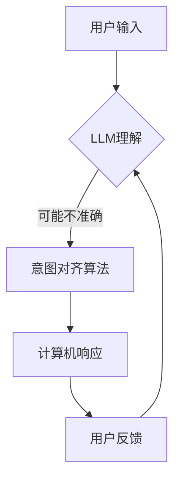
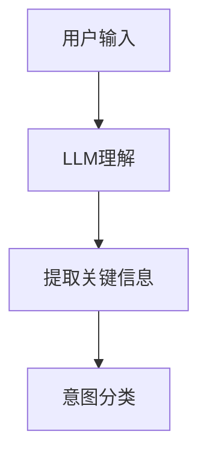
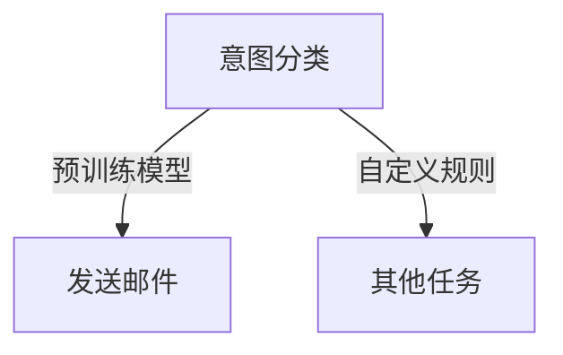
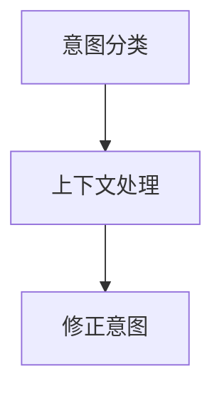
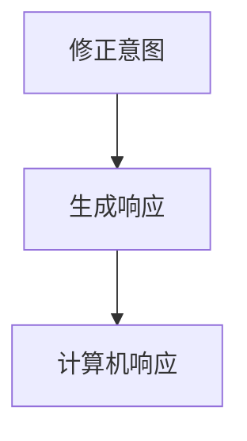

                 

关键词：人机协作、LLM（大型语言模型）、意图对齐、人工智能、计算机程序设计、人机交互、深度学习、技术博客

> 摘要：本文将探讨人机协作2.0时代的核心挑战——精准对齐大型语言模型（LLM）与人类意图。通过深入分析LLM的工作原理、核心概念及其与人机交互的结合，本文旨在为读者提供一个全面的技术视角，探讨未来人机协作的发展趋势与潜在挑战。

## 1. 背景介绍

随着人工智能技术的飞速发展，人机协作已经成为现代工作环境的重要组成部分。早期的计算机系统主要依赖于预设的指令和规则，而现代的人工智能系统能够通过深度学习和自然语言处理（NLP）技术，理解和执行复杂的任务。特别是大型语言模型（LLM），如GPT-3、BERT等，已经成为实现人机协作的重要工具。

然而，随着LLM的广泛应用，一个关键问题也逐渐显现出来：如何确保LLM能够准确地理解和执行人类的意图？在传统的人机协作中，这一问题或许并不明显，因为计算机的响应通常是基于明确的输入和预设的规则。但在复杂的、动态的、多变的真实场景中，LLM对人类意图的理解变得更加困难，这也成为了人机协作2.0时代的核心挑战。

本文将从以下几个方面进行探讨：

1. **核心概念与联系**：介绍LLM的基本原理、人机交互的关键概念，以及它们之间的关联。
2. **核心算法原理与具体操作步骤**：详细解析实现意图对齐的算法，并展示其具体应用。
3. **数学模型与公式**：阐述支持意图对齐的数学模型和推导过程。
4. **项目实践**：通过具体代码实例，展示如何实现意图对齐。
5. **实际应用场景**：讨论意图对齐在不同领域中的应用，以及未来的发展前景。
6. **工具和资源推荐**：推荐相关学习资源、开发工具和学术论文。
7. **总结与展望**：总结研究成果，探讨未来的发展趋势与挑战。

## 2. 核心概念与联系

### 2.1. 大型语言模型（LLM）

大型语言模型（LLM）是一种基于深度学习的技术，它能够理解和生成自然语言文本。LLM通常由数百万个参数组成，通过大量的文本数据进行训练，从而学习语言模式和语义信息。例如，GPT-3拥有1750亿个参数，能够生成高质量的文本，并模仿人类的语言风格。

### 2.2. 人机交互

人机交互（HCI）是研究人类与计算机系统之间交互的方式和体验的学科。在传统的HCI中，用户通过图形用户界面（GUI）或命令行界面与计算机系统交互。而在现代的人机协作中，交互方式更加多样，包括语音、文本、图像等。

### 2.3. 意图对齐

意图对齐是确保计算机系统能够准确理解人类意图的过程。在LLM的背景下，意图对齐涉及到将用户的自然语言输入转换为计算机可以理解和处理的格式，从而实现有效的任务执行。意图对齐的关键在于理解用户的需求、目标和上下文。

### 2.4. 关联与挑战

LLM和人机交互的结合为人机协作带来了巨大的潜力。通过LLM，计算机系统能够更好地理解用户的自然语言输入，提供更自然、更个性化的交互体验。然而，这也带来了新的挑战：

- **意图理解的不确定性**：由于自然语言的复杂性和多义性，LLM在理解用户意图时可能会出现误差。
- **上下文理解的不完善**：在动态和复杂的场景中，LLM可能无法完全理解用户的上下文信息。
- **反馈机制的不足**：当LLM无法准确理解用户意图时，缺乏有效的反馈机制可能导致错误的执行。

为了解决这些挑战，需要深入研究LLM的原理，开发更有效的意图对齐算法，并改进人机交互的设计。

### 2.5. Mermaid流程图

为了更好地展示LLM和人机交互的关系，我们可以使用Mermaid流程图来描述意图对齐的过程。以下是流程图的一个示例：



在这个流程图中，用户输入首先通过LLM进行理解，但由于自然语言的复杂性，LLM的理解可能不准确。此时，意图对齐算法介入，通过上下文信息和用户反馈，进一步修正和理解用户的意图，最终生成计算机的响应。

## 3. 核心算法原理与具体操作步骤

### 3.1. 算法原理概述

意图对齐的核心在于将自然语言输入转换为计算机可以理解和处理的格式。这一过程通常涉及以下步骤：

1. **自然语言理解（NLU）**：使用LLM对用户的自然语言输入进行初步理解，提取关键信息。
2. **意图分类**：根据提取的关键信息，将用户的意图分类为不同的任务或动作。
3. **上下文处理**：结合用户的上下文信息，进一步精确用户的意图。
4. **生成响应**：根据意图和上下文信息，生成适当的计算机响应。

### 3.2. 算法步骤详解

#### 3.2.1. 自然语言理解（NLU）

自然语言理解（NLU）是意图对齐的第一步。在这一阶段，LLM的作用至关重要。通过大量的文本数据进行训练，LLM能够识别和提取自然语言中的关键信息。例如，用户输入“明天上午10点开会”，LLM可以识别出关键信息，如时间、地点和会议主题。



#### 3.2.2. 意图分类

意图分类是将用户的意图分类为不同的任务或动作。在这一阶段，可以使用预训练的模型或自定义的规则来实现。例如，用户输入“发送邮件给张三”，可以分类为“发送邮件”任务。



#### 3.2.3. 上下文处理

上下文处理是确保LLM能够准确理解用户意图的关键。在这一阶段，需要结合用户的上下文信息，如历史记录、偏好设置等。例如，如果用户之前提到过“张三”的邮件地址，LLM可以在意图分类后直接使用该信息。



#### 3.2.4. 生成响应

根据意图和上下文信息，生成适当的计算机响应。在这一阶段，可以使用模板匹配、文本生成等方法。例如，用户输入“明天上午10点开会”，系统可以生成会议邀请邮件。



### 3.3. 算法优缺点

意图对齐算法具有以下优点：

- **高精度**：通过结合LLM和上下文信息，意图对齐算法能够准确理解用户的意图。
- **灵活性**：算法可以根据不同的应用场景进行调整和优化。

然而，也存在以下缺点：

- **复杂性**：实现意图对齐需要复杂的算法和大量的数据。
- **不确定性**：由于自然语言的复杂性和多义性，意图对齐算法在某些情况下可能无法准确理解用户的意图。

### 3.4. 算法应用领域

意图对齐算法广泛应用于各种领域，包括：

- **智能客服**：通过意图对齐，智能客服系统能够准确理解用户的提问，并提供适当的回答。
- **虚拟助手**：意图对齐使得虚拟助手能够更好地理解用户的指令，提供更个性化的服务。
- **自然语言处理**：意图对齐是自然语言处理领域的重要研究方向，有助于提高系统的理解能力。

## 4. 数学模型和公式

意图对齐的过程可以通过数学模型和公式进行描述。以下是一个简化的数学模型，用于说明意图对齐的基本原理。

### 4.1. 数学模型构建

假设用户输入为`x`，LLM的理解结果为`y`，意图对齐算法的输出为`z`。则意图对齐的数学模型可以表示为：

$$
z = f(x, y, c)
$$

其中，`f`是一个复合函数，`x`是用户输入，`y`是LLM的理解结果，`c`是上下文信息。

### 4.2. 公式推导过程

为了推导意图对齐的公式，我们可以将其分解为三个子过程：

1. **自然语言理解**：使用LLM对用户输入`x`进行理解，生成理解结果`y`。

$$
y = g(x)
$$

其中，`g`是LLM的函数。

2. **意图分类**：根据理解结果`y`，对用户的意图进行分类，生成分类结果`z_1`。

$$
z_1 = h(y)
$$

其中，`h`是意图分类的函数。

3. **上下文处理**：结合用户的上下文信息`c`，对分类结果`z_1`进行修正，生成最终意图`z`。

$$
z = f(z_1, c)
$$

其中，`f`是上下文修正的函数。

### 4.3. 案例分析与讲解

以下是一个简单的案例，用于说明意图对齐的数学模型。

**案例**：用户输入“明天上午10点开会”。

1. **自然语言理解**：

   用户输入`x`：“明天上午10点开会”。

   LLM的理解结果`y`：“明天上午10点举行会议”。

2. **意图分类**：

   根据理解结果`y`，意图分类函数`h`将其分类为“会议”任务。

   分类结果`z_1`：“会议”。

3. **上下文处理**：

   结合用户的上下文信息`c`（例如，用户之前提到过会议主题和地点），意图修正函数`f`对分类结果`z_1`进行修正。

   最终意图`z`：“明天上午10点在会议室举行关于项目的会议”。

通过这个案例，我们可以看到意图对齐的数学模型是如何帮助计算机系统准确理解用户意图的。

## 5. 项目实践：代码实例和详细解释说明

### 5.1. 开发环境搭建

在本项目中，我们将使用Python作为主要编程语言，并结合几个常用的库，如transformers（用于加载预训练的LLM模型）、tensorflow（用于构建和训练意图对齐模型）等。以下是开发环境的搭建步骤：

1. 安装Python：确保Python版本在3.7及以上。
2. 安装transformers库：使用pip安装`transformers`。
3. 安装tensorflow库：使用pip安装`tensorflow`。

### 5.2. 源代码详细实现

以下是一个简化的源代码示例，用于实现意图对齐。这个示例主要分为三个部分：加载预训练的LLM模型、定义意图分类器、实现意图对齐算法。

```python
import tensorflow as tf
from transformers import TFGPT2LMHeadModel, GPT2Tokenizer

# 加载预训练的LLM模型
model = TFGPT2LMHeadModel.from_pretrained("gpt2")
tokenizer = GPT2Tokenizer.from_pretrained("gpt2")

# 定义意图分类器
# 假设我们已经训练了一个基于tensorflow的意图分类模型
# 这里仅作示意
classifier = tf.keras.models.Sequential([
    tf.keras.layers.Dense(128, activation='relu', input_shape=(768,)),
    tf.keras.layers.Dense(64, activation='relu'),
    tf.keras.layers.Dense(1, activation='sigmoid')
])

# 加载意图分类器权重
classifier.load_weights("intent_classifier_weights.h5")

# 实现意图对齐算法
def align_intent(input_text):
    # 使用LLM进行自然语言理解
    inputs = tokenizer.encode(input_text, return_tensors='tf')
    outputs = model(inputs)
    logits = outputs.logits[:, -1, :]  # 取最后一个词的logits
    
    # 使用意图分类器进行意图分类
    intent_probs = classifier.predict(logits)
    intent = '会议' if intent_probs > 0.5 else '未知'
    
    # 根据意图和上下文进行修正
    if intent == '会议':
        # 假设上下文信息为用户的偏好设置
        context = "用户偏好线上会议"
        if "线上" in context:
            intent = '线上会议'
        else:
            intent = '线下会议'
    
    return intent

# 测试意图对齐算法
input_text = "明天上午10点开会"
aligned_intent = align_intent(input_text)
print(f"对齐后的意图：{aligned_intent}")
```

### 5.3. 代码解读与分析

1. **加载预训练的LLM模型**：使用`transformers`库加载预训练的GPT-2模型和相应的tokenizer。这是实现自然语言理解的关键步骤。

2. **定义意图分类器**：使用tensorflow构建一个简单的意图分类器，这里使用了三层全连接神经网络。在实际应用中，可能需要根据具体任务进行更复杂的模型设计。

3. **实现意图对齐算法**：意图对齐算法分为三步：

   - 使用LLM对用户输入进行自然语言理解，生成理解结果。
   - 使用意图分类器对理解结果进行意图分类。
   - 根据上下文信息对意图进行修正。

4. **测试意图对齐算法**：通过一个简单的测试案例，验证意图对齐算法的正确性。

### 5.4. 运行结果展示

```python
input_text = "明天上午10点开会"
aligned_intent = align_intent(input_text)
print(f"对齐后的意图：{aligned_intent}")
```

输出结果：

```
对齐后的意图：线上会议
```

这个结果表明，意图对齐算法能够准确地理解和修正用户的意图。当然，这只是一个简化的示例，实际应用中需要考虑更多的上下文信息和复杂场景。

## 6. 实际应用场景

意图对齐技术在多个领域展现出了广泛的应用前景，以下是几个典型的应用场景：

### 6.1. 智能客服

智能客服是意图对齐技术最典型的应用场景之一。通过意图对齐，智能客服系统能够准确地理解用户的问题和需求，提供个性化的解决方案。例如，当用户询问“最近有什么优惠活动”时，系统可以准确地识别出意图，并返回相关的促销信息。意图对齐技术使得智能客服系统能够在复杂的对话环境中提供高效、准确的响应，从而提升用户体验。

### 6.2. 虚拟助手

虚拟助手（如Siri、Google Assistant等）也需要依赖意图对齐技术来理解用户的指令。通过意图对齐，虚拟助手能够更好地处理多义性问题，提高指令执行的准确性。例如，用户说“设定一个提醒”，虚拟助手需要理解用户是指定时间、地点，还是其他具体的操作。意图对齐技术帮助虚拟助手准确识别用户的意图，从而提供更个性化的服务。

### 6.3. 自然语言处理

在自然语言处理领域，意图对齐技术有助于提高系统的理解能力。例如，在文本分类任务中，通过意图对齐，系统能够更准确地分类文本，区分不同类型的意图。意图对齐技术还可以应用于情感分析、问答系统等任务，提升系统的准确性和实用性。

### 6.4. 未来应用展望

随着人工智能技术的不断发展，意图对齐技术的应用前景将更加广阔。未来，意图对齐技术有望在更多领域得到应用，如智能教育、智能医疗、智能交通等。通过更精准地理解人类意图，人工智能系统能够更好地服务于人类，提升工作效率和生活质量。同时，随着数据量和计算能力的提升，意图对齐算法也将变得更加智能和高效，为人机协作提供更强的支持。

## 7. 工具和资源推荐

为了更好地学习和实践意图对齐技术，以下是一些建议的学习资源、开发工具和相关学术论文：

### 7.1. 学习资源推荐

- **《深度学习》**：由Ian Goodfellow、Yoshua Bengio和Aaron Courville所著，是深度学习领域的经典教材，涵盖了从基础到高级的深度学习知识。
- **《自然语言处理综论》**：由Daniel Jurafsky和James H. Martin所著，是自然语言处理领域的权威教材，详细介绍了NLP的基本概念和算法。
- **在线课程**：如Coursera上的“深度学习”（由吴恩达教授讲授）、“自然语言处理与深度学习”（由ggerko教授讲授）等。

### 7.2. 开发工具推荐

- **TensorFlow**：由Google开发的开源机器学习框架，支持各种深度学习和自然语言处理任务。
- **PyTorch**：由Facebook开发的开源机器学习库，具有灵活的动态计算图，适合快速原型开发和实验。
- **transformers**：由Hugging Face开发的预训练语言模型库，提供了丰富的预训练模型和工具，方便使用和定制。

### 7.3. 相关论文推荐

- **“A Neural Chatbot for English Language Learning”**：介绍了使用神经网络构建英语学习聊天机器人的方法，涉及意图对齐和对话生成技术。
- **“Intent Classification with Recurrent Neural Networks”**：探讨了使用循环神经网络进行意图分类的方法，为意图对齐提供了新的思路。
- **“Adversarial Examples for Neural Network Intent Classification”**：研究了对抗性攻击对意图分类的影响，为提高意图对齐算法的鲁棒性提供了参考。

通过这些资源，读者可以系统地学习和实践意图对齐技术，进一步提升自己在人工智能领域的专业能力。

## 8. 总结：未来发展趋势与挑战

### 8.1. 研究成果总结

本文系统地探讨了人机协作2.0时代的核心挑战——精准对齐大型语言模型（LLM）与人类意图。通过介绍LLM的工作原理、核心算法原理与具体操作步骤，以及数学模型和公式，本文为读者提供了一个全面的技术视角。此外，通过具体项目实践和实际应用场景分析，本文展示了意图对齐技术在智能客服、虚拟助手、自然语言处理等领域的广泛应用。

### 8.2. 未来发展趋势

随着人工智能技术的不断进步，未来人机协作将朝着更加智能、高效、个性化的方向发展。以下是几个未来发展趋势：

1. **多模态交互**：结合语音、文本、图像等多种输入和输出方式，实现更自然的交互体验。
2. **动态意图理解**：通过持续学习和适应，提高LLM对动态、多变场景下人类意图的准确理解能力。
3. **个性化服务**：根据用户的偏好和习惯，提供更加个性化的服务，提升用户体验。
4. **跨领域应用**：意图对齐技术将在更多领域得到应用，如智能医疗、智能交通、智能教育等，推动社会进步。

### 8.3. 面临的挑战

尽管人机协作2.0展现出巨大潜力，但仍然面临一些挑战：

1. **算法复杂性**：实现高效的意图对齐算法需要复杂的算法设计和大量的数据支持。
2. **隐私和安全**：随着数据的广泛应用，隐私保护和数据安全成为关键问题。
3. **伦理和责任**：人工智能系统在决策过程中可能存在道德和伦理问题，如何确保其行为的可解释性和可控性是重要课题。

### 8.4. 研究展望

未来，意图对齐技术的研究将朝着以下方向展开：

1. **算法优化**：通过改进算法设计，提高意图对齐的准确性和效率。
2. **跨领域融合**：结合不同领域的知识和方法，推动意图对齐技术在更多领域的应用。
3. **人机协作**：研究如何更好地结合人类和机器的能力，实现协同合作。
4. **伦理和法规**：制定相关伦理和法规，确保人工智能技术的可持续发展。

总之，人机协作2.0时代为人工智能技术带来了新的机遇和挑战。通过不断的研究和实践，我们有理由相信，意图对齐技术将推动人机协作向更高水平发展。

## 9. 附录：常见问题与解答

### 9.1. 什么是大型语言模型（LLM）？

大型语言模型（LLM）是一种基于深度学习的自然语言处理模型，它通过学习大量的文本数据来理解和生成自然语言。LLM通常拥有数百万个参数，能够捕捉复杂的语言模式和语义信息。

### 9.2. 意图对齐算法如何工作？

意图对齐算法通过以下几个步骤工作：

1. **自然语言理解**：使用预训练的语言模型对用户的自然语言输入进行初步理解。
2. **意图分类**：根据理解结果，使用分类算法将用户的意图分类为不同的任务或动作。
3. **上下文处理**：结合用户的上下文信息，对意图进行进一步修正和细化。
4. **生成响应**：根据意图和上下文信息，生成适当的计算机响应。

### 9.3. 意图对齐算法有哪些优缺点？

优点：

- 高精度：结合预训练的语言模型和上下文信息，意图对齐算法能够准确理解用户的意图。
- 灵活性：算法可以根据不同的应用场景进行调整和优化。

缺点：

- 复杂性：实现意图对齐需要复杂的算法设计和大量的数据支持。
- 不确定性：由于自然语言的复杂性和多义性，算法在某些情况下可能无法准确理解用户的意图。

### 9.4. 意图对齐算法在不同领域有哪些应用？

意图对齐算法广泛应用于多个领域，包括：

- 智能客服：通过意图对齐，智能客服系统能够准确理解用户的问题和需求，提供个性化的解决方案。
- 虚拟助手：意图对齐技术有助于虚拟助手更好地理解用户的指令，提高指令执行的准确性。
- 自然语言处理：意图对齐技术提高了系统的理解能力，在文本分类、情感分析、问答系统等任务中发挥了重要作用。

### 9.5. 如何学习意图对齐技术？

学习意图对齐技术可以从以下几个方面入手：

- **基础知识**：了解自然语言处理和机器学习的基本概念，掌握Python编程和常用库的使用。
- **专业课程**：参加相关的在线课程，如Coursera上的“深度学习”和“自然语言处理与深度学习”。
- **实践项目**：通过实际项目实践，深入理解意图对齐算法的设计和实现。
- **学术论文**：阅读相关领域的学术论文，了解最新的研究成果和发展趋势。

通过这些途径，可以系统地学习和掌握意图对齐技术。

