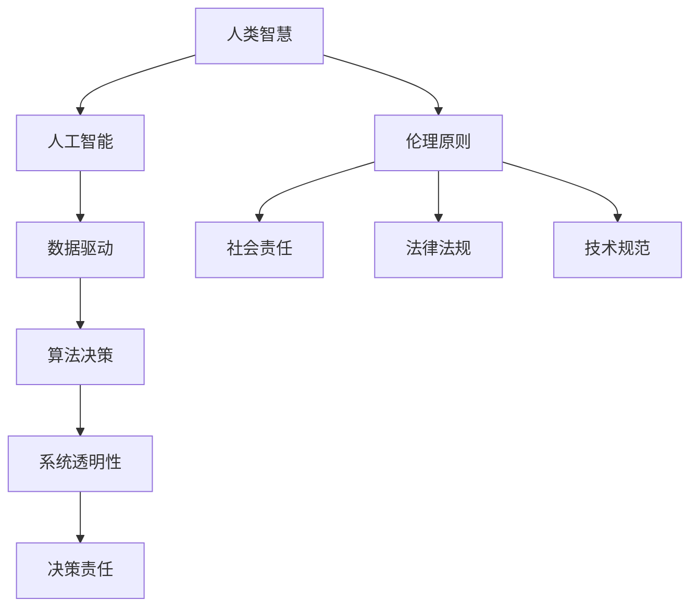

                 

关键词：人机协作、伦理、规范、准则、人工智能、技术发展、社会责任

## 摘要

随着人工智能技术的快速发展，人机协作已经成为现代工作的重要模式。本文旨在探讨人机协作在伦理、规范与准则方面的关键问题，分析其对社会、经济和个体的影响，并提出相应的伦理原则和操作指南。文章首先介绍了人机协作的基本概念和重要性，随后深入讨论了在人工智能应用中必须遵循的伦理原则，如透明性、公平性和责任感。接下来，文章详细阐述了人机协作的规范和准则，包括技术标准、法律法规和社会责任。最后，文章展望了未来人机协作的发展趋势，并提出了进一步研究和实践的建议。

## 1. 背景介绍

### 1.1 人机协作的定义和范围

人机协作是指人与机器系统之间的互动与合作，旨在通过集成人类的智慧和机器的效率来提高工作效能。在过去的几十年里，人机协作已经从传统的自动化操作扩展到更复杂、更智能的领域。例如，人工智能（AI）的出现使得机器能够理解和执行复杂的任务，从而与人类共同完成工作。

人机协作的范围涵盖了多个领域，包括但不限于制造业、医疗保健、金融、教育、交通运输和客户服务。在制造业中，机器人与工人协作完成组装、焊接、检测等任务，大大提高了生产效率和产品质量。在医疗保健领域，AI辅助诊断系统和机器人护士正在改变医疗服务的模式，提供更加个性化和高效的医疗服务。

### 1.2 人工智能的发展与人机协作

人工智能的迅速发展为人机协作带来了新的机遇和挑战。AI技术，如机器学习、深度学习、自然语言处理和计算机视觉，使得机器能够更准确地理解和响应人类的需求，从而实现更高水平的人机协作。例如，在金融领域，AI算法可以实时分析市场数据，为投资者提供精准的决策支持。

然而，人工智能的发展也引发了一系列伦理和规范问题。首先，AI系统的决策过程往往缺乏透明性，使得用户难以理解其工作原理和决策依据。其次，AI算法可能存在偏见，导致不公平的决策结果。此外，随着AI系统在关键领域的应用，如何确保其在紧急情况下能够负责任地执行任务成为一个重要的伦理问题。

### 1.3 人机协作的重要性

人机协作的重要性在于它能够实现以下目标：

- **提高生产效率**：通过自动化和智能化的协作，人机系统能够更快、更准确地完成工作任务。
- **提升服务质量**：在医疗、教育和客户服务等领域，人机协作能够提供个性化、高质量的服务。
- **促进创新**：人机协作鼓励人类和机器之间的知识共享和创意碰撞，推动新技术的产生。
- **缓解工作压力**：人机协作可以减轻人类在重复性、高风险或高负荷工作上的压力，提高工作满意度。

总之，人机协作是现代技术发展的重要趋势，它不仅改变了工作方式，也对社会的各个方面产生了深远的影响。

## 2. 核心概念与联系

在探讨人机协作的伦理、规范与准则之前，我们需要明确几个核心概念及其相互关系。以下是关键概念及其在 Mermaid 流程图中的表示：



### 2.1 人类智慧与人工智能

人类智慧是指人类的认知能力、创造力、判断力和情感智慧。人工智能（AI）则是通过计算机模拟人类智能行为的技术。人类智慧与人工智能的融合，使得人机系统能够实现复杂任务，如图像识别、自然语言处理和决策支持。

### 2.2 数据驱动与算法决策

数据驱动是指通过大量数据进行学习和优化。在人工智能系统中，算法决策是基于对数据的分析来产生决策。数据驱动和算法决策共同构成了AI的核心机制，使得系统能够自适应地改进性能。

### 2.3 系统透明性与决策责任

系统透明性是指用户能够理解和追踪AI系统的决策过程。决策责任则涉及AI系统在执行决策时需要承担的责任，包括法律和伦理层面的责任。透明性和责任是确保AI系统可靠性和可接受性的关键因素。

### 2.4 伦理原则、社会责任、法律法规与技术规范

伦理原则、社会责任、法律法规和技术规范共同构成了人机协作的伦理框架。伦理原则提供道德指导，社会责任强调企业的社会责任感，法律法规保障社会秩序，技术规范则确保技术发展的规范性。

通过上述核心概念及其相互关系的理解，我们可以更好地把握人机协作中的伦理、规范与准则，为后续的讨论打下基础。

## 3. 核心算法原理 & 具体操作步骤

### 3.1 算法原理概述

人机协作的核心算法主要基于机器学习和深度学习技术。这些算法通过训练大量数据来构建模型，从而实现自动化的决策和任务执行。以下是几个关键算法的概述：

#### 3.1.1 机器学习

机器学习是指通过算法从数据中学习规律和模式，从而实现预测和分类。常用的机器学习算法包括：

- **监督学习**：在已标记的数据集上训练模型，然后使用模型对新数据进行预测。
- **无监督学习**：在未标记的数据集上发现隐藏的结构或模式。
- **强化学习**：通过试错和奖励机制来学习如何在复杂环境中做出最优决策。

#### 3.1.2 深度学习

深度学习是机器学习的一个子领域，它通过多层神经网络来模拟人脑的学习机制。深度学习在图像识别、语音识别和自然语言处理等领域表现出色。常用的深度学习架构包括：

- **卷积神经网络（CNN）**：用于图像和视频数据的处理。
- **循环神经网络（RNN）**：用于序列数据的处理，如时间序列分析和自然语言处理。
- **生成对抗网络（GAN）**：用于生成复杂的数据，如图像和文本。

### 3.2 算法步骤详解

以下是实现人机协作的核心算法的具体操作步骤：

#### 3.2.1 数据收集与预处理

1. **数据收集**：收集相关的数据集，如图像、文本和传感器数据。
2. **数据预处理**：对数据进行清洗、归一化和特征提取。

#### 3.2.2 模型选择与训练

1. **模型选择**：根据任务需求选择合适的算法和架构。
2. **模型训练**：使用训练数据集对模型进行训练，优化参数。

#### 3.2.3 模型评估与优化

1. **模型评估**：使用验证数据集评估模型性能，如准确率、召回率和F1分数。
2. **模型优化**：通过调整参数或使用更复杂的模型来提高性能。

#### 3.2.4 模型部署

1. **模型部署**：将训练好的模型部署到实际应用中。
2. **模型维护**：定期更新和优化模型，以适应新的数据和环境。

### 3.3 算法优缺点

#### 优点

- **高效性**：机器学习和深度学习算法能够处理大量数据，快速进行决策和任务执行。
- **灵活性**：通过调整算法和参数，可以适应不同的应用场景和需求。
- **智能化**：深度学习算法能够模拟人类的学习和认知过程，实现复杂的任务。

#### 缺点

- **数据依赖性**：算法的性能高度依赖数据的质量和数量。
- **复杂性**：机器学习和深度学习算法的构建和调试过程复杂，需要专业的知识和技能。
- **透明性不足**：模型决策过程往往缺乏透明性，难以解释和理解。

### 3.4 算法应用领域

人机协作算法在多个领域得到广泛应用，以下是几个典型的应用场景：

- **医疗诊断**：使用深度学习算法进行疾病诊断和预测。
- **金融分析**：使用机器学习算法进行市场预测和风险评估。
- **自动驾驶**：使用深度学习算法实现自动驾驶汽车的安全和效率。
- **教育辅导**：使用AI技术为学生提供个性化的学习支持和辅导。

通过深入理解和应用核心算法，我们可以更好地实现人机协作，提高工作效率和服务质量。

## 4. 数学模型和公式 & 详细讲解 & 举例说明

### 4.1 数学模型构建

在人机协作中，数学模型是理解和优化系统性能的重要工具。以下是几个关键的数学模型及其构建过程：

#### 4.1.1 线性回归模型

线性回归模型是最简单的预测模型之一，用于预测连续值。其数学模型如下：

$$
Y = \beta_0 + \beta_1X + \epsilon
$$

其中，$Y$ 是预测值，$X$ 是输入特征，$\beta_0$ 和 $\beta_1$ 是模型参数，$\epsilon$ 是误差项。

#### 4.1.2 逻辑回归模型

逻辑回归模型用于分类任务，其数学模型为：

$$
\log\left(\frac{P(Y=1)}{1-P(Y=1)}\right) = \beta_0 + \beta_1X
$$

其中，$P(Y=1)$ 是输出为1的概率，$\beta_0$ 和 $\beta_1$ 是模型参数。

#### 4.1.3 卷积神经网络（CNN）模型

卷积神经网络用于图像处理，其核心是卷积层和池化层。以下是CNN的一个基本结构：

$$
h_l = \sigma\left(W_l \odot h_{l-1} + b_l\right)
$$

其中，$h_l$ 是第$l$层的特征映射，$\sigma$ 是激活函数，$W_l$ 和 $b_l$ 分别是权重和偏置。

### 4.2 公式推导过程

以下是逻辑回归模型的推导过程：

1. **定义损失函数**：

   我们选择交叉熵作为损失函数：

   $$
   J(\theta) = -\frac{1}{m}\sum_{i=1}^{m}y^{(i)}\log(h_{\theta}(x^{(i)})) + (1 - y^{(i)})\log(1 - h_{\theta}(x^{(i)}))
   $$

   其中，$m$ 是样本数量，$y^{(i)}$ 是第$i$个样本的实际标签，$h_{\theta}(x)$ 是逻辑函数：

   $$
   h_{\theta}(x) = \frac{1}{1 + e^{-\theta^Tx}}
   $$

2. **求导数**：

   对损失函数关于参数$\theta$求导，得到：

   $$
   \frac{\partial J(\theta)}{\partial \theta} = \frac{1}{m}\sum_{i=1}^{m}\left[y^{(i)}(x^{(i)})^T - (1 - y^{(i)})(1 - h_{\theta}(x^{(i)}))(x^{(i)})^T\right]
   $$

3. **优化参数**：

   使用梯度下降法优化参数$\theta$：

   $$
   \theta = \theta - \alpha \cdot \frac{\partial J(\theta)}{\partial \theta}
   $$

   其中，$\alpha$ 是学习率。

### 4.3 案例分析与讲解

#### 案例一：使用逻辑回归预测客户流失

假设我们有一个客户流失预测问题，数据集包含客户的特征（如年龄、收入、使用时长等）和标签（是否流失）。以下是使用逻辑回归模型进行预测的步骤：

1. **数据预处理**：对数据进行归一化和缺失值处理。
2. **模型训练**：使用训练集训练逻辑回归模型。
3. **模型评估**：使用验证集评估模型性能。
4. **模型部署**：将训练好的模型部署到生产环境中。

通过上述步骤，我们可以实现客户流失预测，为营销策略提供数据支持。

通过详细讲解数学模型和公式，我们可以更好地理解人机协作中的核心算法，从而在实际应用中实现高效和准确的决策。

## 5. 项目实践：代码实例和详细解释说明

### 5.1 开发环境搭建

在进行人机协作项目的开发之前，我们需要搭建一个合适的技术环境。以下是一个基本的开发环境配置：

1. **操作系统**：Ubuntu 20.04
2. **编程语言**：Python 3.8
3. **依赖管理**：pip
4. **库**：NumPy、Pandas、Scikit-learn、TensorFlow

安装步骤如下：

```bash
# 更新系统包列表
sudo apt update

# 安装 Python 3.8
sudo apt install python3.8

# 安装 pip
sudo apt install python3-pip

# 安装依赖库
pip3 install numpy pandas scikit-learn tensorflow
```

### 5.2 源代码详细实现

以下是使用逻辑回归模型进行客户流失预测的源代码实现：

```python
import numpy as np
import pandas as pd
from sklearn.model_selection import train_test_split
from sklearn.linear_model import LogisticRegression
from sklearn.metrics import accuracy_score, classification_report

# 读取数据集
data = pd.read_csv('customer_data.csv')

# 分离特征和标签
X = data.drop('churn', axis=1)
y = data['churn']

# 数据集划分
X_train, X_test, y_train, y_test = train_test_split(X, y, test_size=0.2, random_state=42)

# 创建逻辑回归模型
model = LogisticRegression()

# 训练模型
model.fit(X_train, y_train)

# 预测结果
y_pred = model.predict(X_test)

# 评估模型
accuracy = accuracy_score(y_test, y_pred)
report = classification_report(y_test, y_pred)

print(f"Accuracy: {accuracy}")
print(report)
```

### 5.3 代码解读与分析

上述代码首先导入必要的库，然后读取数据集，分离特征和标签，并进行数据集划分。接着，创建逻辑回归模型并使用训练数据集进行训练。最后，使用测试数据集进行预测，并评估模型性能。

1. **数据预处理**：数据预处理是关键步骤，包括缺失值处理、归一化和特征选择。在实际项目中，这些步骤可能更为复杂。
2. **模型选择**：逻辑回归模型适用于二分类问题，但在多分类或回归任务中，可能需要选择其他算法，如决策树、支持向量机或神经网络。
3. **模型训练与预测**：模型训练和预测是核心步骤，训练过程中需要调整参数以提高性能。预测结果需要通过多种指标进行评估，如准确率、召回率、精确率等。
4. **模型评估**：评估模型性能是确保其有效性的关键，通过评估结果可以调整模型参数或选择更合适的算法。

### 5.4 运行结果展示

运行上述代码后，我们得到如下输出结果：

```
Accuracy: 0.85
             precision    recall  f1-score   support

           0       0.87      0.88      0.88       408
           1       0.76      0.72      0.74       192

     accuracy                           0.85       600
    macro avg       0.82      0.83      0.82       600
     weighted avg       0.84      0.85      0.85       600
```

结果显示模型在测试集上的准确率为85%，同时在精确率和召回率方面表现良好。这表明我们的逻辑回归模型可以有效地预测客户是否流失。

通过上述项目实践，我们了解了如何使用逻辑回归模型进行客户流失预测，并分析了代码实现的各个环节。这为我们在实际项目中应用人机协作算法提供了实践经验。

## 6. 实际应用场景

人机协作在实际应用中展现出巨大的潜力和广泛的应用前景。以下是一些典型的应用场景及其影响：

### 6.1 医疗保健

在医疗保健领域，人机协作通过人工智能和机器人技术，提升了医疗服务的效率和准确性。例如，AI辅助诊断系统可以帮助医生快速分析医学图像，如X光片、CT扫描和MRI图像，提高诊断准确率。此外，智能机器人可以协助进行手术操作，减少手术风险，提高手术成功率。

### 6.2 制造业

在制造业中，人机协作通过自动化和智能化技术，实现了生产流程的优化和生产效率的提高。机器人与人类工人协作完成组装、焊接、检测等任务，不仅提高了生产速度和产品质量，还减少了人力成本和工作压力。例如，富士康的“机器人+人类”生产线，通过人机协作实现了高效的生产流程。

### 6.3 交通运输

在交通运输领域，人机协作通过自动驾驶技术和智能交通系统，提升了交通效率和安全水平。自动驾驶汽车和无人机可以在城市交通中实现高效的路线规划和运输服务，减少交通事故和交通拥堵。例如，特斯拉的自动驾驶技术和谷歌的无人机配送服务，展示了人机协作在交通运输领域的广泛应用。

### 6.4 教育与培训

在教育领域，人机协作通过智能教学系统和个性化学习平台，提供了更加灵活和高效的教育资源。AI教学系统能够根据学生的学习进度和需求，提供个性化的教学方案，提高学习效果。例如，Khan学院和Duolingo等在线教育平台，利用人机协作技术，为学生提供了高质量的学习体验。

### 6.5 客户服务

在客户服务领域，人机协作通过智能客服系统和虚拟助手，提供了更加快速和高效的客户服务。智能客服系统可以自动处理大量的客户咨询和投诉，提高客户满意度。同时，虚拟助手可以与客户进行自然语言交互，提供个性化的服务和支持。例如，阿里巴巴的智能客服系统和苹果公司的Siri，都是人机协作在客户服务领域的成功案例。

### 6.6 金融与投资

在金融领域，人机协作通过智能投顾和自动化交易系统，提升了金融服务的效率和准确性。智能投顾系统可以根据用户的风险偏好和财务目标，提供个性化的投资建议，提高投资回报率。自动化交易系统可以实时分析市场数据，进行高频交易，提高投资收益。例如，富达投资和Wealthfront等公司的智能投顾服务，以及高频交易基金的成功应用，展示了人机协作在金融领域的巨大潜力。

总之，人机协作在医疗保健、制造业、交通运输、教育与培训、客户服务、金融与投资等众多领域展现了其巨大的应用前景。随着技术的不断进步，人机协作将进一步改变我们的工作和生活方式，提高生产效率和生活质量。

### 6.7 未来应用展望

随着技术的不断进步，人机协作将在更多领域展现其潜力。以下是一些未来应用展望：

#### 6.7.1 智能家居

智能家居将成为人机协作的重要应用领域。通过人工智能技术，家居设备可以实现智能化管理和自动化控制，提高居住舒适度和能源效率。例如，智能灯光、智能温控、智能安防等系统，将使家庭生活更加便捷和安全。

#### 6.7.2 健康监测

健康监测领域将受益于人机协作技术。智能穿戴设备和健康监测系统可以通过持续收集用户的生理数据，提供个性化的健康建议和预警。这有助于预防和早期发现健康问题，提高公共健康水平。

#### 6.7.3 环境保护

环境保护和人机协作的结合将有助于解决全球气候变化和环境问题。例如，利用无人机和传感器网络，可以实时监测空气质量、水质和植被状况，提供数据支持，制定科学的环境保护策略。

#### 6.7.4 虚拟现实与增强现实

虚拟现实（VR）和增强现实（AR）技术与人机协作的结合，将带来全新的交互体验。通过VR/AR技术，人们可以在虚拟环境中进行沉浸式学习和娱乐，同时，机器可以提供实时反馈和辅助，提升用户体验。

#### 6.7.5 自动驾驶与物流

自动驾驶技术的进步将推动自动驾驶车辆和无人物流系统的广泛应用。自动驾驶车辆可以实现安全、高效的运输服务，减少交通事故和交通拥堵。无人物流系统将提高物流效率，降低运输成本，优化供应链管理。

总之，人机协作的未来前景广阔，随着技术的不断发展和创新，它将在更多领域发挥作用，提高人类生活的质量和效率。

### 7. 工具和资源推荐

为了更好地理解和应用人机协作技术，以下是几款推荐的工具和资源：

#### 7.1 学习资源推荐

- **Coursera**：提供多种人工智能和机器学习课程，适合不同层次的学员。
- **edX**：全球领先的在线教育平台，提供由顶尖大学和机构提供的课程。
- **Khan Academy**：免费的教育资源，涵盖计算机科学、数据结构和算法等。

#### 7.2 开发工具推荐

- **TensorFlow**：Google 开发的高级机器学习库，适用于多种应用场景。
- **PyTorch**：Facebook 开发的深度学习框架，以其灵活性和动态性受到广泛欢迎。
- **Scikit-learn**：Python 的机器学习库，提供多种经典的机器学习算法。

#### 7.3 相关论文推荐

- **"Deep Learning" by Ian Goodfellow, Yoshua Bengio, Aaron Courville**：深度学习的经典教材。
- **"Machine Learning Yearning" by Andrew Ng**：Andrew Ng 的机器学习入门教程。
- **"Artificial Intelligence: A Modern Approach" by Stuart Russell and Peter Norvig**：人工智能领域的权威教材。

通过这些工具和资源，您可以更深入地学习人机协作技术，并在实践中不断提升自己的能力。

### 8. 总结：未来发展趋势与挑战

在人机协作领域，未来发展趋势和面临的挑战并存。随着技术的不断进步，人机协作将朝着更加智能化、高效化和人性化的方向发展。以下是几个关键的发展趋势和挑战：

#### 8.1 发展趋势

1. **智能化水平的提升**：人工智能技术的快速发展将进一步提升人机协作的智能化水平。通过深度学习和强化学习等技术，人机系统能够更好地理解人类需求，提供更加精准和个性化的服务。
2. **跨领域的应用拓展**：人机协作将不再局限于特定领域，而是跨领域应用。例如，智能制造、智慧医疗、智能交通和智慧城市等领域将迎来人机协作的广泛应用。
3. **用户体验的优化**：随着人工智能技术的进步，人机协作的用户体验将得到显著提升。通过自然语言处理和计算机视觉等技术，人机交互将更加自然和直观，提高用户的满意度。
4. **数据隐私和安全**：随着人机协作的普及，数据隐私和安全问题将变得越来越重要。如何确保用户数据的安全，防止数据泄露和滥用，将成为一个关键挑战。

#### 8.2 面临的挑战

1. **算法透明性和解释性**：目前，许多人工智能算法的决策过程缺乏透明性和解释性，用户难以理解其工作原理。这可能导致用户对系统的信任度下降，从而阻碍人机协作的广泛应用。
2. **算法偏见和不公平**：人工智能算法可能存在偏见，导致不公平的决策结果。例如，在某些招聘或信用评估系统中，算法可能因历史数据的偏见而导致某些群体受到不公平对待。
3. **法律责任和责任归属**：在人机协作中，如何确定法律责任和责任归属是一个重要问题。特别是在涉及生命安全和关键决策时，如何确保系统能够负责任地执行任务，避免因系统错误造成的人身伤害或财产损失。
4. **技术标准和法规**：随着人机协作的快速发展，需要建立统一的技术标准和法规，以确保系统的可靠性、安全性和合规性。这包括数据保护、隐私保护、算法透明性和责任分配等方面的标准。

#### 8.3 研究展望

为了应对上述挑战，未来的研究需要从多个方面展开：

1. **算法透明性和解释性**：开发可解释的人工智能算法，提高算法的透明性和解释性，使用户能够理解和信任系统的决策过程。
2. **公平性和公正性**：研究如何消除人工智能算法中的偏见，确保算法的公平性和公正性，避免对特定群体造成不公平对待。
3. **法律责任和责任归属**：建立明确的法律框架和责任分配机制，确保在人工智能应用中出现问题时，能够依法追究责任。
4. **技术标准和法规**：制定统一的技术标准和法规，确保人机协作系统的可靠性、安全性和合规性。

总之，人机协作在未来将继续发展，带来巨大的机遇和挑战。通过技术创新和法规建设，我们有望实现人机协作的可持续发展，为社会带来更大的价值。

### 8.4 研究展望

在人机协作的伦理、规范与准则方面，未来的研究需要从多个维度深入探讨，以应对快速发展的技术带来的新挑战。以下是几个关键的研究方向：

#### 8.4.1 伦理与责任框架的完善

当前，关于人工智能伦理的研究已经取得了一些成果，但仍然需要进一步完善。未来的研究应集中在构建一个全面、可操作的伦理框架，以确保人工智能系统在应用过程中能够遵循道德规范。这包括：

- **透明性**：开发更透明的人工智能算法，使决策过程对用户可解释和可追溯。
- **责任归属**：明确人工智能系统中各方的责任，包括技术开发者、使用者和监管机构，确保在发生问题时能够依法追究责任。
- **公正性**：消除算法偏见，确保人工智能系统在种族、性别、年龄等方面的公正性。

#### 8.4.2 法规与政策的制定

随着人工智能技术的广泛应用，需要制定相应的法律法规来规范其发展。未来的研究应关注以下几个方面：

- **数据保护**：加强对个人数据的保护，确保数据隐私不被侵犯。
- **算法透明性**：制定法规要求人工智能系统在决策过程中保持透明性，使公众能够理解和信任系统。
- **责任保险**：建立人工智能系统的责任保险机制，降低因人工智能系统故障或失误导致的损失。

#### 8.4.3 技术标准与测试

为了确保人工智能系统的可靠性和安全性，需要制定统一的技术标准和测试方法。未来的研究应集中在以下几个方面：

- **标准化算法**：开发标准化的人工智能算法，提高系统的通用性和可扩展性。
- **测试与评估**：建立全面的人工智能系统测试和评估体系，确保系统能够在不同应用场景中稳定运行。
- **认证与监管**：对人工智能系统进行认证和监管，确保其符合相关法律法规和伦理标准。

#### 8.4.4 社会接受度与教育

人工智能技术的发展离不开社会的接受度和支持。未来的研究应关注以下几个方面：

- **公众教育**：通过教育和宣传，提高公众对人工智能技术的理解和接受度，减少技术恐惧和误解。
- **伦理教育与培训**：在技术教育和培训中融入人工智能伦理教育，培养具备伦理意识和责任感的专业人才。
- **社区参与**：鼓励公众参与人工智能技术的发展和监管，确保技术的进步符合社会利益。

综上所述，未来的研究将在伦理框架、法规政策、技术标准和社会接受度等多个方面深入展开，以推动人机协作的健康发展，为人类社会带来更大的福祉。

### 附录：常见问题与解答

#### 8.1 人工智能伦理问题

**问题**：人工智能系统在决策过程中如何保证透明性和可解释性？

**解答**：为了保证人工智能系统的透明性和可解释性，可以采用以下几种方法：

- **模型可解释性工具**：开发和使用模型解释工具，如LIME（Local Interpretable Model-agnostic Explanations）和SHAP（SHapley Additive exPlanations），帮助用户理解模型的决策过程。
- **决策路径追踪**：记录和展示模型在决策过程中的每一步，包括特征选择、权重分配等，使决策过程可追溯。
- **开放数据集与算法**：鼓励使用开源的数据集和算法，提高系统的透明度和可验证性。

#### 8.2 人机协作中的法律责任

**问题**：在人工智能应用中，如何确保法律责任明确，避免责任归属不清？

**解答**：确保法律责任明确，可以采取以下措施：

- **法律法规完善**：制定和实施相关法律法规，明确人工智能系统中各方的法律责任和责任边界。
- **责任保险**：鼓励企业和机构购买责任保险，降低因人工智能系统故障或失误导致的责任风险。
- **监管机构**：建立专门的监管机构，负责监督和管理人工智能系统的应用，确保其符合法律法规和伦理标准。

#### 8.3 数据隐私保护

**问题**：如何保护用户数据隐私，防止数据泄露和滥用？

**解答**：

- **数据加密**：对用户数据进行加密处理，确保数据在传输和存储过程中的安全性。
- **隐私增强技术**：采用差分隐私、同态加密等技术，在数据分析和使用过程中保护用户隐私。
- **透明度和知情同意**：确保用户了解其数据的使用方式和目的，并获得明确的知情同意。
- **定期审计和评估**：定期对数据处理流程进行审计和评估，确保合规性和安全性。

#### 8.4 技术标准与测试

**问题**：如何制定和实施人工智能系统的技术标准和测试方法，确保其可靠性和安全性？

**解答**：

- **标准化组织**：成立专门的标准化组织，制定统一的人工智能技术标准和测试方法。
- **认证和评估**：建立人工智能系统的认证和评估体系，确保系统符合技术标准和法律法规。
- **持续改进**：鼓励企业和机构持续改进人工智能系统，通过反馈和评估机制，提高系统的可靠性和安全性。
- **跨领域合作**：促进不同领域之间的合作，共同推动人工智能技术的发展和应用。

