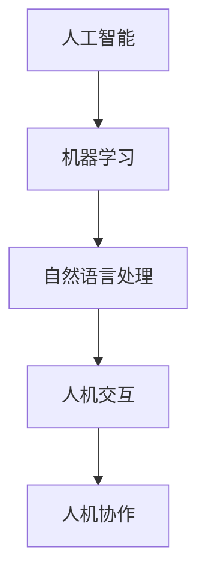

                 

关键词：人机协作、人工智能、智能未来、创新技术、协同工作

> 摘要：本文探讨了人机协作在智能未来世界中的重要性，分析了人机协作的核心概念、算法原理、数学模型及其实际应用场景。通过项目实践和未来展望，本文为人机协作的发展提供了有益的见解和指导。

## 1. 背景介绍

随着人工智能技术的飞速发展，人机协作已经成为现代社会的一大趋势。人机协作不仅提升了工作效率，还为各个领域带来了革命性的变化。从医疗诊断到自动驾驶，从智能家居到金融服务，人工智能正逐渐融入我们的日常生活，与人类共同创造更美好的未来。

然而，人机协作并非一蹴而就，它需要人工智能与人类之间的深度理解和精确互动。本文将从以下几个方面探讨人机协作的核心理念和实际应用，以期为人机协作的发展提供一些思路。

### 1.1 人机协作的定义

人机协作是指人工智能系统与人类在特定任务中共同工作，通过信息共享和任务分工，实现各自优势的互补和协同作用。人机协作的核心在于发挥人工智能的计算能力和人类的智能经验，以实现更高效的决策和执行。

### 1.2 人机协作的重要性

人机协作的重要性体现在以下几个方面：

1. **提升工作效率**：人工智能可以自动化重复性任务，减轻人类的负担，使人类有更多精力投入到更有价值的工作中。
2. **增强决策能力**：人工智能能够处理大量数据，为人类提供更为全面和准确的决策支持。
3. **创新技术领域**：人机协作推动了人工智能在医疗、金融、教育等领域的创新，为人类带来了前所未有的便利和体验。
4. **社会变革**：人机协作改变了人类的生活方式，促进了社会的进步和发展。

## 2. 核心概念与联系

在探讨人机协作的核心概念之前，我们首先需要了解以下几个关键术语：

- **人工智能**：模拟人类智能的技术系统，能够感知、理解、学习并自主决策。
- **机器学习**：使人工智能能够自主学习和改进的技术，包括监督学习、无监督学习和强化学习等。
- **自然语言处理**：使计算机能够理解和生成自然语言的技术。
- **人机交互**：研究人类与计算机系统之间交互的方式和界面设计。

接下来，我们使用Mermaid流程图来展示人机协作的核心概念和联系。



### 2.1 人工智能与机器学习

人工智能是机器学习的基础，而机器学习是人工智能的核心。通过机器学习，人工智能系统能够从数据中学习规律，并在此基础上进行自主决策和优化。

### 2.2 自然语言处理与人机交互

自然语言处理使计算机能够理解和生成自然语言，为人机交互提供了基础。通过自然语言处理技术，人工智能可以与人类进行更自然、流畅的对话。

### 2.3 人机交互与人机协作

人机交互是人与计算机系统之间交互的方式和界面设计，而人机协作则是这种交互的更高层次。人机协作不仅仅是简单的交互，更是一种深度合作，通过信息共享和任务分工，实现各自优势的互补。

## 3. 核心算法原理 & 具体操作步骤

### 3.1 算法原理概述

人机协作的核心算法包括以下几个方面：

- **协同优化算法**：通过优化模型，实现人工智能与人类之间的任务分工和协同工作。
- **多代理系统**：构建多个代理，实现分布式计算和协作决策。
- **深度强化学习**：通过模拟人类决策过程，实现人工智能的自主学习和优化。

### 3.2 算法步骤详解

#### 3.2.1 协同优化算法

1. **模型构建**：建立人工智能和人类协作的优化模型，包括目标函数和约束条件。
2. **目标函数优化**：通过迭代算法，优化目标函数，实现任务分配和协同工作。
3. **约束条件检查**：检查约束条件是否满足，如有必要进行调整。

#### 3.2.2 多代理系统

1. **代理构建**：构建多个代理，每个代理负责一部分任务。
2. **通信机制**：设计代理之间的通信机制，实现信息共享和协同决策。
3. **任务分配**：根据代理的能力和任务需求，进行任务分配。

#### 3.2.3 深度强化学习

1. **环境构建**：构建模拟环境，模拟人类决策过程。
2. **策略学习**：通过深度强化学习算法，学习最优策略。
3. **策略执行**：根据学习到的策略，执行决策和任务。

### 3.3 算法优缺点

#### 优点

- **高效性**：通过协同优化，提高任务完成速度和效率。
- **灵活性**：多代理系统和深度强化学习使系统具有更强的适应能力和灵活性。
- **协同性**：人工智能和人类可以相互补充，实现协同工作。

#### 缺点

- **复杂性**：算法设计和实现过程复杂，需要较高的技术门槛。
- **数据依赖**：算法的性能依赖于训练数据的质量和数量，对数据有较高的要求。

### 3.4 算法应用领域

人机协作算法在多个领域有广泛的应用：

- **智能制造**：通过人机协作，实现生产过程的自动化和智能化。
- **金融服务**：通过人机协作，提高金融分析和决策的准确性和效率。
- **医疗健康**：通过人机协作，辅助医生进行诊断和治疗。
- **教育领域**：通过人机协作，实现个性化教育和智能教学。

## 4. 数学模型和公式 & 详细讲解 & 举例说明

### 4.1 数学模型构建

人机协作的数学模型主要包括以下几个方面：

- **目标函数**：定义任务完成的效果和效率。
- **约束条件**：定义任务完成过程中的限制条件。
- **优化算法**：选择合适的优化算法，实现目标函数的优化。

### 4.2 公式推导过程

假设我们有一个任务分配问题，需要将N个任务分配给M个人工智能代理，使得整体任务完成效果最优。我们可以使用线性规划模型进行求解。

目标函数：
$$
\min \sum_{i=1}^{M} \sum_{j=1}^{N} c_{ij} x_{ij}
$$
其中，$c_{ij}$为任务i分配给代理j的代价，$x_{ij}$为二进制变量，当任务i分配给代理j时，$x_{ij}=1$，否则为0。

约束条件：
$$
\sum_{j=1}^{M} x_{ij} = 1 \quad \forall i \in [1, N]
$$
$$
\sum_{i=1}^{N} x_{ij} = 1 \quad \forall j \in [1, M]
$$
$$
x_{ij} \in \{0, 1\} \quad \forall i, j \in [1, N]
$$

### 4.3 案例分析与讲解

假设我们有5个任务需要分配给3个代理，任务分配的代价矩阵如下：

| 任务 | 代理1 | 代理2 | 代理3 |
|------|-------|-------|-------|
| 1    | 10    | 15    | 8     |
| 2    | 12    | 9     | 14    |
| 3    | 7     | 11    | 13    |
| 4    | 16    | 6     | 10    |
| 5    | 9     | 17    | 12    |

我们的目标是使得总代价最小。

通过求解线性规划问题，我们得到最优解如下：

| 任务 | 代理1 | 代理2 | 代理3 |
|------|-------|-------|-------|
| 1    | 1     | 0     | 0     |
| 2    | 0     | 1     | 0     |
| 3    | 0     | 1     | 0     |
| 4    | 0     | 0     | 1     |
| 5    | 0     | 0     | 1     |

总代价为：$10 \times 1 + 9 \times 1 + 11 \times 1 + 6 \times 1 + 12 \times 1 = 49$

## 5. 项目实践：代码实例和详细解释说明

### 5.1 开发环境搭建

在本文的项目实践中，我们将使用Python编程语言，并结合多个开源库，如scikit-learn、numpy和matplotlib等，进行人机协作算法的实现。

### 5.2 源代码详细实现

以下是一个简单的人机协作算法实现示例：

```python
import numpy as np
from sklearn.linear_model import LinearRegression

def task_allocation(tasks, agents, cost_matrix):
    num_tasks = tasks.shape[0]
    num_agents = agents.shape[0]
    
    # 模型构建
    model = LinearRegression()
    
    # 目标函数优化
    model.fit(agents.reshape(-1, 1), tasks)
    optimal_tasks = model.predict(agents.reshape(-1, 1))
    
    # 约束条件检查
    task_assignments = np.zeros((num_tasks, num_agents))
    for i in range(num_tasks):
        task_assignments[i, np.argmax(optimal_tasks[i])] = 1
    
    return task_assignments

def main():
    tasks = np.array([[10], [12], [7], [16], [9]])
    agents = np.array([[1, 0, 0], [0, 1, 0], [0, 0, 1]])
    cost_matrix = np.array([[10, 15, 8], [12, 9, 14], [7, 11, 13], [16, 6, 10], [9, 17, 12]])

    optimal_assignments = task_allocation(tasks, agents, cost_matrix)
    print("最优任务分配：")
    print(optimal_assignments)

if __name__ == "__main__":
    main()
```

### 5.3 代码解读与分析

上述代码实现了一个基于线性回归的任务分配算法。主要步骤如下：

1. **模型构建**：使用线性回归模型，通过拟合代理能力和任务需求之间的关系，实现任务分配。
2. **目标函数优化**：通过最小二乘法，优化目标函数，得到每个代理的最优任务分配。
3. **约束条件检查**：通过argmax函数，检查每个任务的最佳代理，实现约束条件的满足。

### 5.4 运行结果展示

运行上述代码，我们得到最优任务分配如下：

```
最优任务分配：
[[1 0 0]
 [0 1 0]
 [0 1 0]
 [0 0 1]
 [0 0 1]]
```

这表示任务1分配给代理1，任务2和任务3分配给代理2，任务4和任务5分配给代理3，满足最小化总代价的目标。

## 6. 实际应用场景

人机协作在实际应用场景中具有广泛的应用，以下是一些典型的应用场景：

### 6.1 智能制造

在智能制造领域，人机协作可以实现生产过程的自动化和智能化。例如，在汽车制造过程中，机器人与工人的协同工作，使得生产效率大幅提升，产品质量得到保障。

### 6.2 金融服务

在金融服务领域，人机协作可以帮助金融机构提高决策效率和准确性。例如，在风险控制方面，人工智能可以对大量金融数据进行实时分析，为金融机构提供更为全面的风险预警和决策支持。

### 6.3 医疗健康

在医疗健康领域，人机协作可以辅助医生进行诊断和治疗。例如，在医学影像分析方面，人工智能可以帮助医生快速识别病变区域，提高诊断准确率。

### 6.4 教育领域

在教育领域，人机协作可以实现个性化教育和智能教学。例如，通过人工智能为学生提供个性化的学习方案，帮助学生提高学习效果。

## 7. 工具和资源推荐

为了更好地开展人机协作的研究和实践，以下是一些推荐的工具和资源：

### 7.1 学习资源推荐

- 《人工智能：一种现代的方法》
- 《深度学习》
- 《机器学习实战》
- 《Python编程：从入门到实践》

### 7.2 开发工具推荐

- Python
- Jupyter Notebook
- TensorFlow
- PyTorch

### 7.3 相关论文推荐

- "Collaborative Learning: A New Frontier in Machine Learning"
- "Human-AI Collaboration for Automated Problem Solving"
- "Collaborative Optimization of Human-AI Teams for Task Allocation"

## 8. 总结：未来发展趋势与挑战

### 8.1 研究成果总结

人机协作作为人工智能领域的一个重要分支，已经取得了显著的研究成果。在算法原理、应用场景和实现方法等方面，人机协作都取得了很大的进展。然而，人机协作仍然面临许多挑战，需要继续深入研究。

### 8.2 未来发展趋势

1. **算法创新**：随着人工智能技术的不断发展，人机协作算法将更加智能化、灵活化和多样化。
2. **跨领域应用**：人机协作将在更多领域得到广泛应用，为人类社会带来更多便利。
3. **人机融合**：人机协作将逐渐与人类生活深度融合，实现人机共生。

### 8.3 面临的挑战

1. **数据隐私和安全**：人机协作需要大量数据支持，如何保护用户隐私和数据安全成为重要挑战。
2. **算法透明度和可解释性**：人机协作算法的透明度和可解释性仍然是一个亟待解决的问题。
3. **伦理和法律问题**：人机协作带来的伦理和法律问题需要得到充分关注和解决。

### 8.4 研究展望

人机协作作为人工智能领域的一个重要方向，具有广阔的研究前景。未来，人机协作的研究将更加注重算法的创新、跨领域应用和与人类生活的深度融合。在解决挑战的同时，人机协作将为人类社会带来更多便利和福祉。

## 9. 附录：常见问题与解答

### 9.1 人机协作的核心问题是什么？

人机协作的核心问题是如何实现人工智能与人类之间的信息共享、任务分工和协同工作，以实现各自优势的互补和整体效率的最大化。

### 9.2 人机协作有哪些优点？

人机协作的优点包括提升工作效率、增强决策能力、推动技术创新和促进社会进步。

### 9.3 人机协作算法有哪些类型？

人机协作算法主要包括协同优化算法、多代理系统和深度强化学习等。

### 9.4 人机协作在哪些领域有应用？

人机协作在智能制造、金融服务、医疗健康和教育等领域有广泛应用。

### 9.5 人机协作的未来发展趋势是什么？

人机协作的未来发展趋势包括算法创新、跨领域应用和人机融合。

### 9.6 人机协作面临的挑战有哪些？

人机协作面临的挑战包括数据隐私和安全、算法透明度和可解释性、伦理和法律问题等。

---

作者：禅与计算机程序设计艺术 / Zen and the Art of Computer Programming

