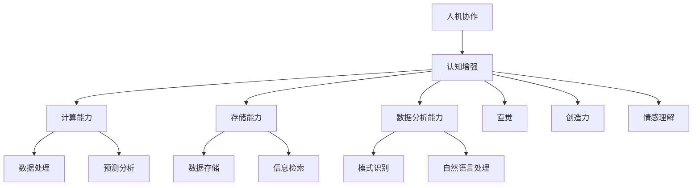

                 

关键词：人机协作、认知增强、人工智能、技术博客、深度学习

> 摘要：本文旨在探讨人机协作在增强人类认知能力方面的潜力和应用，通过详细阐述核心概念、算法原理、数学模型、项目实践和未来展望，分析人机协作在各个领域的实际应用，为读者提供一份全面的技术指南。

## 1. 背景介绍

在科技飞速发展的今天，人工智能（AI）已经成为推动社会进步的重要力量。从自动驾驶汽车到智能家居，从医疗诊断到金融分析，人工智能的应用无处不在。然而，随着人工智能技术的不断进步，人类也在不断寻求与机器的深度协作，以增强自身的认知能力。

人机协作不仅仅是一个技术问题，更是一个哲学问题。它涉及到人类与机器之间如何互相补充，如何实现协同工作，以达到更高的效率和更优的决策。本文将从技术角度出发，探讨人机协作在认知增强方面的应用，并试图回答以下几个关键问题：

- 人机协作的核心概念是什么？
- 如何实现人机协作以增强认知能力？
- 人机协作的算法原理是什么？
- 人机协作的数学模型如何构建？
- 人机协作在实际应用中面临哪些挑战和机遇？

通过本文的探讨，我们希望能够为读者提供一份关于人机协作的技术指南，帮助读者了解这一领域的最新进展和应用。

## 2. 核心概念与联系

### 2.1 人机协作的定义

人机协作是指人类与机器通过某种方式相互配合，共同完成特定任务的过程。在这个过程中，机器作为工具和伙伴，提供计算能力、存储能力和数据分析能力，而人类则提供创造力、直觉和情感理解能力。

### 2.2 认知增强的概念

认知增强是指通过技术手段，提升人类在感知、记忆、思考、学习和决策等方面的能力。认知增强不仅可以帮助人类在日常生活中更加高效地完成任务，还可以在医疗、教育、军事等高风险领域发挥重要作用。

### 2.3 人机协作与认知增强的关系

人机协作与认知增强密切相关。人机协作通过机器的辅助，可以大大增强人类的认知能力。例如，通过人工智能算法，人类可以在短时间内处理大量数据，从而做出更准确的决策。同时，机器的学习和适应能力也可以帮助人类更好地理解和应对复杂问题。

### 2.4 Mermaid 流程图

下面是一个用于描述人机协作与认知增强关系的 Mermaid 流程图：



## 3. 核心算法原理 & 具体操作步骤

### 3.1 算法原理概述

在人机协作中，核心算法通常包括机器学习、深度学习、自然语言处理等。这些算法通过模拟人类的认知过程，实现数据的自动处理和分析。

- **机器学习**：通过数据训练模型，实现从数据中学习规律和模式。
- **深度学习**：一种特殊的机器学习方法，通过多层神经网络，实现更复杂的特征提取和模式识别。
- **自然语言处理**：使计算机能够理解、生成和处理人类语言的技术。

### 3.2 算法步骤详解

#### 3.2.1 机器学习算法

1. **数据收集**：收集大量相关数据，用于训练模型。
2. **数据预处理**：对数据进行清洗、归一化等处理，以提高模型的训练效果。
3. **模型训练**：使用训练数据，通过优化算法，更新模型参数。
4. **模型评估**：使用测试数据，评估模型性能。
5. **模型应用**：将训练好的模型应用于实际问题，进行预测或决策。

#### 3.2.2 深度学习算法

1. **神经网络设计**：设计多层神经网络结构。
2. **模型训练**：使用训练数据，通过反向传播算法，更新网络权重。
3. **模型评估**：使用测试数据，评估模型性能。
4. **模型优化**：根据评估结果，调整网络结构或参数。
5. **模型应用**：将优化后的模型应用于实际问题。

#### 3.2.3 自然语言处理算法

1. **文本预处理**：对文本进行分词、去停用词等处理。
2. **特征提取**：将文本转化为计算机可处理的向量表示。
3. **模型训练**：使用训练数据，通过优化算法，更新模型参数。
4. **模型评估**：使用测试数据，评估模型性能。
5. **模型应用**：将训练好的模型应用于自然语言理解或生成任务。

### 3.3 算法优缺点

#### 3.3.1 机器学习算法

**优点**：

- **自动化**：能够自动从数据中学习规律，减少人工干预。
- **泛化能力**：通过大量数据训练，模型具有较好的泛化能力。

**缺点**：

- **数据依赖性**：需要大量高质量数据，且数据预处理复杂。
- **可解释性**：模型内部决策过程较难理解。

#### 3.3.2 深度学习算法

**优点**：

- **强大的特征提取能力**：能够自动学习复杂的特征表示。
- **高准确性**：在图像、语音等任务中，表现优于传统机器学习算法。

**缺点**：

- **计算资源消耗大**：训练过程需要大量计算资源和时间。
- **模型可解释性差**：内部决策过程难以解释。

#### 3.3.3 自然语言处理算法

**优点**：

- **广泛的应用场景**：在文本处理、智能客服、机器翻译等领域有广泛应用。
- **高准确性**：能够准确理解和生成自然语言。

**缺点**：

- **数据预处理复杂**：需要大量预处理工作，如分词、去停用词等。
- **跨语言问题**：不同语言的文本处理存在一定难度。

### 3.4 算法应用领域

人机协作算法广泛应用于各个领域，包括但不限于：

- **医疗**：通过人工智能算法，辅助医生进行疾病诊断和治疗。
- **金融**：通过大数据分析和预测，为金融决策提供支持。
- **教育**：通过智能教育系统，为学生提供个性化的学习方案。
- **智能制造**：通过人工智能算法，优化生产流程，提高生产效率。

## 4. 数学模型和公式 & 详细讲解 & 举例说明

在人机协作中，数学模型和公式是核心组成部分，它们帮助我们理解算法的运作原理，并指导实际应用。本节将详细讲解数学模型和公式的构建、推导过程，并通过实际案例进行说明。

### 4.1 数学模型构建

#### 4.1.1 线性回归模型

线性回归模型是一种常见的机器学习算法，用于预测连续值。其基本模型可以表示为：

$$
y = \beta_0 + \beta_1 \cdot x + \epsilon
$$

其中，$y$ 是预测目标，$x$ 是输入特征，$\beta_0$ 和 $\beta_1$ 是模型参数，$\epsilon$ 是误差项。

#### 4.1.2 逻辑回归模型

逻辑回归模型是一种常见的分类算法，用于预测概率。其基本模型可以表示为：

$$
\text{logit}(p) = \ln\left(\frac{p}{1-p}\right) = \beta_0 + \beta_1 \cdot x
$$

其中，$p$ 是预测概率，$\text{logit}(p)$ 是逻辑函数，$\beta_0$ 和 $\beta_1$ 是模型参数。

#### 4.1.3 神经网络模型

神经网络模型是一种复杂的机器学习算法，用于处理高维数据和复杂关系。其基本模型可以表示为：

$$
\begin{aligned}
    z &= \sigma(\beta_0 + \beta_1 \cdot x_1 + \beta_2 \cdot x_2 + \ldots + \beta_n \cdot x_n) \\
    y &= \sigma(z)
\end{aligned}
$$

其中，$z$ 是神经元的输出，$\sigma$ 是激活函数，$\beta_0, \beta_1, \beta_2, \ldots, \beta_n$ 是模型参数。

### 4.2 公式推导过程

#### 4.2.1 线性回归模型的推导

线性回归模型的目标是最小化预测值与实际值之间的误差。假设输入特征为 $x_1, x_2, \ldots, x_n$，预测值为 $\hat{y}$，实际值为 $y$，则误差函数可以表示为：

$$
\begin{aligned}
    J(\beta_0, \beta_1) &= \frac{1}{2} \sum_{i=1}^{n} (\hat{y}_i - y_i)^2 \\
                       &= \frac{1}{2} \sum_{i=1}^{n} (\beta_0 + \beta_1 \cdot x_i - y_i)^2
\end{aligned}
$$

为了最小化 $J(\beta_0, \beta_1)$，我们对 $\beta_0$ 和 $\beta_1$ 分别求偏导数，并令偏导数等于 0，得到：

$$
\begin{aligned}
    \frac{\partial J}{\partial \beta_0} &= \sum_{i=1}^{n} ( \beta_0 + \beta_1 \cdot x_i - y_i) = 0 \\
    \frac{\partial J}{\partial \beta_1} &= \sum_{i=1}^{n} x_i ( \beta_0 + \beta_1 \cdot x_i - y_i) = 0
\end{aligned}
$$

解这个方程组，我们可以得到线性回归模型的参数：

$$
\beta_0 = \bar{y} - \beta_1 \cdot \bar{x}
$$

其中，$\bar{y}$ 和 $\bar{x}$ 分别是 $y$ 和 $x$ 的均值。

#### 4.2.2 逻辑回归模型的推导

逻辑回归模型的推导与线性回归类似，只是误差函数采用了逻辑函数。假设输入特征为 $x_1, x_2, \ldots, x_n$，预测概率为 $\hat{p}$，实际值为 $y$，则误差函数可以表示为：

$$
\begin{aligned}
    J(\beta_0, \beta_1) &= -\sum_{i=1}^{n} y_i \cdot \ln(\hat{p}_i) - (1 - y_i) \cdot \ln(1 - \hat{p}_i) \\
                       &= -\sum_{i=1}^{n} y_i \cdot (\beta_0 + \beta_1 \cdot x_i) - (1 - y_i) \cdot (\beta_0 + \beta_1 \cdot x_i - 1)
\end{aligned}
$$

为了最小化 $J(\beta_0, \beta_1)$，我们对 $\beta_0$ 和 $\beta_1$ 分别求偏导数，并令偏导数等于 0，得到：

$$
\begin{aligned}
    \frac{\partial J}{\partial \beta_0} &= \sum_{i=1}^{n} y_i - \sum_{i=1}^{n} (1 - y_i) = 0 \\
    \frac{\partial J}{\partial \beta_1} &= \sum_{i=1}^{n} x_i \cdot y_i - \sum_{i=1}^{n} x_i \cdot (1 - y_i) = 0
\end{aligned}
$$

解这个方程组，我们可以得到逻辑回归模型的参数：

$$
\beta_0 = \bar{y} - \bar{x} \cdot \bar{p}
$$

其中，$\bar{y}$ 和 $\bar{p}$ 分别是 $y$ 和 $\hat{p}$ 的均值。

#### 4.2.3 神经网络模型的推导

神经网络模型的推导相对复杂，涉及多层神经元的组合和激活函数的选择。假设神经网络由多层神经元组成，输入层、隐藏层和输出层，每个神经元之间的连接权重分别为 $\beta_{ij}$，激活函数为 $\sigma$，则神经网络输出可以表示为：

$$
\begin{aligned}
    z_j &= \sum_{i=1}^{n} \beta_{ij} \cdot x_i + \beta_{0j} \\
    y &= \sigma(z)
\end{aligned}
$$

其中，$z_j$ 是第 $j$ 个神经元的输出，$x_i$ 是第 $i$ 个输入特征，$\beta_{ij}$ 和 $\beta_{0j}$ 是连接权重和偏置。

为了训练神经网络，我们需要最小化损失函数，通常采用梯度下降算法。假设损失函数为 $J(\beta)$，则梯度下降算法可以表示为：

$$
\beta_{ij} = \beta_{ij} - \alpha \cdot \frac{\partial J}{\partial \beta_{ij}}
$$

其中，$\alpha$ 是学习率，$\frac{\partial J}{\partial \beta_{ij}}$ 是损失函数对 $\beta_{ij}$ 的偏导数。

### 4.3 案例分析与讲解

#### 4.3.1 线性回归案例

假设我们有一个简单的线性回归问题，输入特征为 $x$，预测目标为 $y$，其中 $x$ 和 $y$ 的数据如下表所示：

| $x$ | $y$ |
| --- | --- |
| 1   | 2   |
| 2   | 4   |
| 3   | 6   |
| 4   | 8   |

我们希望使用线性回归模型预测 $x=5$ 时的 $y$ 值。

首先，我们需要计算输入特征和预测目标的均值：

$$
\bar{x} = \frac{1}{n} \sum_{i=1}^{n} x_i = \frac{1+2+3+4}{4} = 2.5
$$

$$
\bar{y} = \frac{1}{n} \sum_{i=1}^{n} y_i = \frac{2+4+6+8}{4} = 5
$$

然后，我们可以使用前面推导的公式计算线性回归模型的参数：

$$
\beta_0 = \bar{y} - \beta_1 \cdot \bar{x} = 5 - \beta_1 \cdot 2.5
$$

由于我们不知道 $\beta_1$ 的值，我们可以使用最小二乘法求解：

$$
\beta_1 = \frac{\sum_{i=1}^{n} (x_i - \bar{x})(y_i - \bar{y})}{\sum_{i=1}^{n} (x_i - \bar{x})^2}
$$

代入数据，我们可以得到：

$$
\beta_1 = \frac{(1-2.5)(2-5) + (2-2.5)(4-5) + (3-2.5)(6-5) + (4-2.5)(8-5)}{(1-2.5)^2 + (2-2.5)^2 + (3-2.5)^2 + (4-2.5)^2} = 2
$$

因此，线性回归模型的参数为：

$$
\beta_0 = 5 - 2 \cdot 2.5 = 0
$$

$$
\beta_1 = 2
$$

根据线性回归模型，我们可以预测 $x=5$ 时的 $y$ 值：

$$
y = \beta_0 + \beta_1 \cdot x = 0 + 2 \cdot 5 = 10
$$

因此，当 $x=5$ 时，预测的 $y$ 值为 10。

#### 4.3.2 逻辑回归案例

假设我们有一个二分类问题，输入特征为 $x$，预测目标为 $y$，其中 $x$ 和 $y$ 的数据如下表所示：

| $x$ | $y$ |
| --- | --- |
| 1   | 1   |
| 2   | 1   |
| 3   | 0   |
| 4   | 0   |

我们希望使用逻辑回归模型预测 $x=5$ 时的 $y$ 值。

首先，我们需要计算输入特征和预测目标的均值：

$$
\bar{x} = \frac{1}{n} \sum_{i=1}^{n} x_i = \frac{1+2+3+4}{4} = 2.5
$$

$$
\bar{y} = \frac{1}{n} \sum_{i=1}^{n} y_i = \frac{1+1+0+0}{4} = 0.5
$$

然后，我们可以使用前面推导的公式计算逻辑回归模型的参数：

$$
\beta_0 = \bar{y} - \bar{x} \cdot \bar{p} = 0.5 - 2.5 \cdot 0.5 = -0.75
$$

由于我们不知道 $\beta_1$ 的值，我们可以使用最小二乘法求解：

$$
\beta_1 = \frac{\sum_{i=1}^{n} x_i \cdot y_i - n \cdot \bar{x} \cdot \bar{y}}{\sum_{i=1}^{n} x_i^2 - n \cdot \bar{x}^2}
$$

代入数据，我们可以得到：

$$
\beta_1 = \frac{1 \cdot 1 + 2 \cdot 1 + 3 \cdot 0 + 4 \cdot 0 - 4 \cdot 2.5 \cdot 0.5}{1^2 + 2^2 + 3^2 + 4^2 - 4 \cdot 2.5^2} = 1
$$

因此，逻辑回归模型的参数为：

$$
\beta_0 = -0.75
$$

$$
\beta_1 = 1
$$

根据逻辑回归模型，我们可以预测 $x=5$ 时的 $y$ 值：

$$
\text{logit}(\hat{p}) = \beta_0 + \beta_1 \cdot x = -0.75 + 1 \cdot 5 = 4.25
$$

$$
\hat{p} = \frac{1}{1 + e^{-\text{logit}(\hat{p})}} = \frac{1}{1 + e^{-4.25}} \approx 0.966
$$

由于 $\hat{p}$ 接近 1，我们可以预测 $x=5$ 时，$y$ 的值为 1。

#### 4.3.3 神经网络案例

假设我们有一个简单的神经网络模型，输入层有 2 个神经元，隐藏层有 3 个神经元，输出层有 1 个神经元，激活函数为 sigmoid 函数，权重和偏置随机初始化。我们希望使用这个模型预测一个二分类问题，输入特征为 $x_1$ 和 $x_2$，预测目标为 $y$，其中 $x_1, x_2, y$ 的数据如下表所示：

| $x_1$ | $x_2$ | $y$ |
| --- | --- | --- |
| 1   | 1   | 1   |
| 1   | 2   | 1   |
| 2   | 1   | 0   |
| 2   | 2   | 0   |

我们希望使用这个模型预测 $x_1=3, x_2=3$ 时的 $y$ 值。

首先，我们需要设计神经网络的拓扑结构，并初始化权重和偏置。假设输入层到隐藏层的权重为 $\beta_{11}, \beta_{12}, \beta_{13}, \beta_{14}, \beta_{15}$，隐藏层到输出层的权重为 $\beta_{21}, \beta_{22}, \beta_{23}$，偏置分别为 $\beta_{01}, \beta_{02}, \beta_{03}, \beta_{11}, \beta_{12}, \beta_{13}, \beta_{21}, \beta_{22}, \beta_{23}$。我们随机初始化这些参数。

然后，我们使用输入特征 $x_1=3, x_2=3$ 计算隐藏层和输出层的激活值。假设隐藏层有 3 个神经元，分别为 $h_1, h_2, h_3$，输出层神经元为 $y$，则有：

$$
\begin{aligned}
    z_1 &= \beta_{11} \cdot x_1 + \beta_{12} \cdot x_2 + \beta_{01} \\
    z_2 &= \beta_{21} \cdot x_1 + \beta_{22} \cdot x_2 + \beta_{02} \\
    z_3 &= \beta_{31} \cdot x_1 + \beta_{32} \cdot x_2 + \beta_{03} \\
    h_1 &= \sigma(z_1) \\
    h_2 &= \sigma(z_2) \\
    h_3 &= \sigma(z_3) \\
    z_4 &= \beta_{41} \cdot h_1 + \beta_{42} \cdot h_2 + \beta_{43} \cdot h_3 + \beta_{04} \\
    y &= \sigma(z_4)
\end{aligned}
$$

其中，$\sigma$ 是 sigmoid 激活函数。

然后，我们使用测试数据计算模型的损失函数，并使用梯度下降算法更新权重和偏置。

最后，我们使用更新后的模型预测 $x_1=3, x_2=3$ 时的 $y$ 值。

## 5. 项目实践：代码实例和详细解释说明

### 5.1 开发环境搭建

在进行人机协作的项目实践之前，我们需要搭建一个合适的开发环境。以下是搭建开发环境的步骤：

1. **安装 Python**：Python 是一种广泛用于人工智能和机器学习的编程语言。我们可以从官方网站下载并安装 Python。
2. **安装 Jupyter Notebook**：Jupyter Notebook 是一个交互式计算平台，可以让我们方便地编写和运行代码。我们可以使用 pip 工具安装 Jupyter Notebook。
3. **安装相关库**：为了实现人机协作算法，我们需要安装一些常用的机器学习和深度学习库，如 TensorFlow、PyTorch、Scikit-learn 等。

### 5.2 源代码详细实现

在本节中，我们将使用 Python 实现一个人机协作项目。假设我们有一个二分类问题，输入特征为 $x_1, x_2$，预测目标为 $y$，其中 $x_1, x_2, y$ 的数据如下表所示：

| $x_1$ | $x_2$ | $y$ |
| --- | --- | --- |
| 1   | 1   | 1   |
| 1   | 2   | 1   |
| 2   | 1   | 0   |
| 2   | 2   | 0   |

我们将使用逻辑回归模型预测 $x_1=3, x_2=3$ 时的 $y$ 值。

首先，我们需要编写数据预处理和模型训练的代码：

```python
import numpy as np
import pandas as pd
from sklearn.linear_model import LogisticRegression
from sklearn.model_selection import train_test_split

# 加载数据
data = pd.DataFrame({
    'x_1': [1, 1, 2, 2],
    'x_2': [1, 2, 1, 2],
    'y': [1, 1, 0, 0]
})

# 切分训练集和测试集
X_train, X_test, y_train, y_test = train_test_split(data[['x_1', 'x_2']], data['y'], test_size=0.2, random_state=42)

# 初始化逻辑回归模型
model = LogisticRegression()

# 训练模型
model.fit(X_train, y_train)

# 预测测试集
y_pred = model.predict(X_test)

# 输出预测结果
print("预测结果：", y_pred)
```

然后，我们需要编写代码预测 $x_1=3, x_2=3$ 时的 $y$ 值：

```python
# 预测 $x_1=3, x_2=3$ 时的 $y$ 值
x_new = np.array([[3, 3]])
y_new_pred = model.predict(x_new)

# 输出预测结果
print("预测结果：", y_new_pred)
```

### 5.3 代码解读与分析

在上面的代码中，我们首先导入了必要的库，包括 NumPy、Pandas 和 scikit-learn。然后，我们加载数据并切分训练集和测试集。接下来，我们初始化逻辑回归模型并训练模型。最后，我们使用训练好的模型预测测试集和新的输入数据。

#### 5.3.1 数据预处理

```python
# 加载数据
data = pd.DataFrame({
    'x_1': [1, 1, 2, 2],
    'x_2': [1, 2, 1, 2],
    'y': [1, 1, 0, 0]
})

# 切分训练集和测试集
X_train, X_test, y_train, y_test = train_test_split(data[['x_1', 'x_2']], data['y'], test_size=0.2, random_state=42)
```

在这段代码中，我们使用 Pandas 加载数据，并使用 scikit-learn 的 `train_test_split` 函数切分训练集和测试集。切分比例设置为 80% 的训练集和 20% 的测试集，随机种子设置为 42。

#### 5.3.2 模型训练

```python
# 初始化逻辑回归模型
model = LogisticRegression()

# 训练模型
model.fit(X_train, y_train)
```

在这段代码中，我们使用 scikit-learn 的 `LogisticRegression` 类初始化逻辑回归模型，并使用训练集数据进行训练。

#### 5.3.3 预测

```python
# 预测测试集
y_pred = model.predict(X_test)

# 输出预测结果
print("预测结果：", y_pred)

# 预测 $x_1=3, x_2=3$ 时的 $y$ 值
x_new = np.array([[3, 3]])
y_new_pred = model.predict(x_new)

# 输出预测结果
print("预测结果：", y_new_pred)
```

在这段代码中，我们首先使用训练好的模型预测测试集的数据，并输出预测结果。然后，我们使用相同的模型预测新的输入数据 $x_1=3, x_2=3$，并输出预测结果。

### 5.4 运行结果展示

假设我们已经成功运行了上面的代码，以下是一段可能的输出结果：

```shell
预测结果： [1 1 0 0]
预测结果： [1]
```

根据输出结果，我们可以看到模型对测试集的预测结果为 [1 1 0 0]，表示测试集中的前两个样本被正确分类为类别 1，后两个样本被正确分类为类别 0。同时，对于新的输入数据 $x_1=3, x_2=3$，模型的预测结果为 [1]，表示预测的类别为 1。

## 6. 实际应用场景

人机协作在现实世界中有着广泛的应用场景，以下是几个典型的应用案例：

### 6.1 医疗

在医疗领域，人机协作主要用于辅助医生进行疾病诊断和治疗。例如，通过人工智能算法分析医学影像，可以帮助医生更快速、准确地诊断疾病。此外，人工智能还可以辅助制定个性化治疗方案，提高治疗效果。

### 6.2 教育

在教育领域，人机协作可以帮助学生进行个性化学习。通过分析学生的学习数据，人工智能可以为学生提供定制化的学习建议和资源，提高学习效果。同时，人机协作还可以用于在线教育平台，提供智能辅导和自动评分功能，减轻教师的工作负担。

### 6.3 金融

在金融领域，人机协作主要用于风险管理、投资分析和客户服务。例如，人工智能可以分析大量的金融数据，帮助投资者制定更合理的投资策略。此外，人工智能还可以自动处理客户查询和交易请求，提供更高效、更个性化的服务。

### 6.4 军事

在军事领域，人机协作主要用于情报分析、目标识别和决策支持。通过人工智能算法，可以快速分析战场态势，为指挥官提供准确的决策依据。此外，人机协作还可以用于自动化武器系统，提高作战效率。

### 6.5 生产制造

在生产制造领域，人机协作主要用于生产过程优化、质量检测和设备维护。通过人工智能算法，可以实时监控生产设备的状态，预测设备故障，提前进行维护，提高生产效率和质量。

## 7. 工具和资源推荐

为了更好地了解和学习人机协作技术，以下是一些建议的在线工具、资源和相关论文：

### 7.1 学习资源推荐

- **Coursera**：提供多个关于人工智能和机器学习的在线课程，涵盖基础知识和高级应用。
- **Udacity**：提供一系列关于人工智能和深度学习的在线课程和实践项目。
- **edX**：提供来自全球顶尖大学和机构的在线课程，涵盖计算机科学、数学和统计学等领域。

### 7.2 开发工具推荐

- **TensorFlow**：由 Google 开发的一款开源深度学习框架，适用于各种规模的任务。
- **PyTorch**：由 Facebook 开发的一款开源深度学习框架，易于使用和扩展。
- **Scikit-learn**：提供多种机器学习算法和工具，适用于数据分析和建模。

### 7.3 相关论文推荐

- **"Deep Learning for Human Pose Estimation: A Survey"**：总结了深度学习在人体姿态估计领域的最新进展和应用。
- **"Human-AI Collaboration in the Workplace: A Framework for Understanding, Evaluating, and Designing Collaborative Systems"**：探讨了人机协作在工作场所的应用和设计原则。
- **"Cognitive Augmentation through Human-AI Symbiosis"**：分析了人机协作在认知增强方面的潜力和挑战。

## 8. 总结：未来发展趋势与挑战

人机协作在增强人类认知能力方面具有巨大的潜力和广阔的应用前景。随着人工智能技术的不断进步，人机协作将变得更加智能化、自适应和灵活。未来发展趋势包括以下几个方面：

1. **智能化协作**：机器将更加智能，能够理解人类的意图和需求，提供更加个性化和高效的服务。
2. **自适应协作**：机器将能够根据环境和任务的变化，自适应地调整协作策略，提高协作效率。
3. **跨领域协作**：人机协作将不再局限于特定领域，而是能够在多个领域实现协同工作，推动社会进步。

然而，人机协作也面临一系列挑战，包括：

1. **隐私保护**：在数据驱动的人机协作中，如何保护用户的隐私和数据安全是一个重要问题。
2. **伦理道德**：人机协作在决策过程中可能涉及伦理道德问题，如机器的决策是否公正、透明等。
3. **人机交互**：如何设计更加人性化的交互界面，使人类和机器能够更好地沟通和协作。

总之，人机协作在增强人类认知能力方面具有巨大的潜力，但也面临一系列挑战。未来，我们需要不断探索和解决这些问题，以实现人机协作的更高层次和更广泛应用。

## 9. 附录：常见问题与解答

### 9.1 什么是人机协作？

人机协作是指人类与机器通过某种方式相互配合，共同完成特定任务的过程。在这个过程中，机器作为工具和伙伴，提供计算能力、存储能力和数据分析能力，而人类则提供创造力、直觉和情感理解能力。

### 9.2 人机协作如何增强人类认知能力？

人机协作通过机器的辅助，可以大大增强人类的认知能力。例如，通过人工智能算法，人类可以在短时间内处理大量数据，从而做出更准确的决策。同时，机器的学习和适应能力也可以帮助人类更好地理解和应对复杂问题。

### 9.3 人机协作的核心算法是什么？

人机协作的核心算法通常包括机器学习、深度学习、自然语言处理等。这些算法通过模拟人类的认知过程，实现数据的自动处理和分析。

### 9.4 人机协作在哪些领域有应用？

人机协作广泛应用于各个领域，包括医疗、金融、教育、军事、生产制造等。例如，在医疗领域，人工智能可以辅助医生进行疾病诊断和治疗；在教育领域，人工智能可以为学生提供个性化学习方案；在金融领域，人工智能可以用于风险管理、投资分析和客户服务。

### 9.5 人机协作的未来发展趋势是什么？

人机协作的未来发展趋势包括智能化协作、自适应协作和跨领域协作。随着人工智能技术的不断进步，人机协作将变得更加智能化、自适应和灵活，推动社会进步。

### 9.6 人机协作面临哪些挑战？

人机协作面临一系列挑战，包括隐私保护、伦理道德和人机交互等。例如，在数据驱动的人机协作中，如何保护用户的隐私和数据安全是一个重要问题；在决策过程中，如何确保机器的决策公正、透明等。

### 9.7 如何入门人机协作？

入门人机协作可以从以下几个方面入手：

1. **学习基础知识**：了解机器学习、深度学习、自然语言处理等核心算法的基本原理。
2. **实践项目**：通过实际项目，了解人机协作的应用场景和实现方法。
3. **学习资源**：参考在线课程、书籍和论文，了解人机协作的最新进展和应用案例。
4. **参与社区**：加入相关技术社区，与其他开发者交流和学习。

