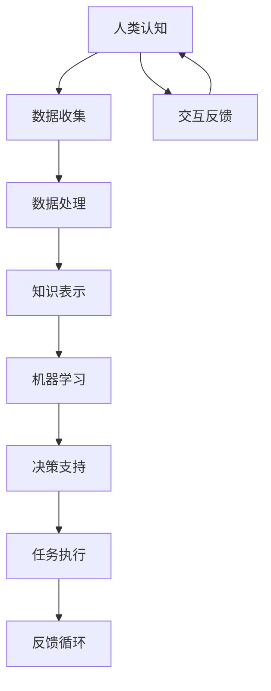

                 

关键词：人机协作、人工智能、未来工作、趋势、技术发展

摘要：随着人工智能技术的不断进步，人机协作正逐渐成为未来工作的主流趋势。本文将探讨人机协作的概念、背景、核心原理，以及在实际应用中的具体表现。同时，文章将分析人机协作的优势和挑战，并展望其在未来工作中的应用前景。

## 1. 背景介绍

### 1.1 人工智能的发展历程

人工智能（Artificial Intelligence，AI）作为计算机科学的一个分支，其发展可以追溯到20世纪50年代。从最初的符号逻辑推理，到机器学习、深度学习的广泛应用，人工智能经历了多次重要的技术迭代。

- **符号逻辑推理**：早期的人工智能研究主要集中在符号逻辑推理上，通过构建逻辑规则和知识库来实现简单的智能行为。
- **专家系统**：20世纪80年代，专家系统成为人工智能研究的热点，利用大量的领域知识和推理机制来解决复杂问题。
- **机器学习**：随着计算能力的提升和数据量的爆炸式增长，机器学习技术逐渐成熟，实现了对大规模数据的自动学习与建模。
- **深度学习**：21世纪初，深度学习技术的崛起标志着人工智能进入了新的发展阶段，通过多层神经网络实现了对复杂模式的自动发现。

### 1.2 人机协作的概念

人机协作是指人与机器在特定任务或场景下通过互动与合作，共同完成任务或实现目标的过程。人机协作的核心在于发挥人的创造力、直觉和决策能力与机器的计算能力、数据分析和处理能力的优势互补。

- **人的角色**：在协作过程中，人主要负责创意构思、战略决策和解决复杂问题。
- **机器的角色**：机器则负责数据收集、处理和分析，以及执行重复性、标准化的任务。

## 2. 核心概念与联系

### 2.1 核心概念原理

人机协作的关键在于理解两个核心概念：人类认知和机器智能。

- **人类认知**：人类认知包括感知、理解、推理和决策等多个方面，是人类智慧的体现。人的认知能力强，能够处理复杂的问题，具有丰富的经验和直觉。
- **机器智能**：机器智能则是基于计算和数据分析的，能够通过算法和模型处理大量的数据，实现自动化的决策和任务执行。

### 2.2 架构的 Mermaid 流程图



在这个流程图中，人类认知通过数据收集、处理和分析，将知识转化为机器学习的输入，机器智能则通过决策支持和任务执行，将结果反馈给人类认知，形成闭环的反馈循环。

## 3. 核心算法原理 & 具体操作步骤

### 3.1 算法原理概述

人机协作中的核心算法主要包括机器学习算法和人类决策算法。机器学习算法用于处理和分析数据，提供决策支持；人类决策算法则用于根据机器学习的结果进行判断和决策。

- **机器学习算法**：常见的机器学习算法包括监督学习、无监督学习和强化学习。监督学习通过已标记的数据进行训练，无监督学习则从未标记的数据中发现模式，强化学习通过试错和奖励机制进行学习。
- **人类决策算法**：人类决策算法是基于逻辑推理、直觉和经验进行的。在协作过程中，人类需要根据机器学习算法提供的数据和结果，结合自身经验和知识，做出最终的决策。

### 3.2 算法步骤详解

1. **数据收集**：通过传感器、网络等方式收集与任务相关的数据。
2. **数据处理**：对收集到的数据进行清洗、去噪和格式化，使其适合机器学习算法处理。
3. **机器学习训练**：选择合适的机器学习算法对处理后的数据集进行训练，构建预测模型。
4. **模型评估**：通过测试集对训练好的模型进行评估，确保其性能满足要求。
5. **决策支持**：将训练好的模型应用于实际任务，为人类决策提供数据支持。
6. **人类决策**：根据机器学习算法提供的决策支持，结合自身经验和直觉，做出最终的决策。
7. **任务执行**：执行决策结果，实现任务目标。
8. **反馈循环**：将执行结果反馈给机器学习算法，用于模型优化和改进。

### 3.3 算法优缺点

**机器学习算法优点**：

- **自动性**：机器学习算法能够自动从数据中学习规律，减少了人工干预的必要性。
- **泛化能力**：通过训练，机器学习算法能够对新的数据进行有效的预测和分类。
- **数据处理能力**：机器学习算法能够处理大量的数据，提取关键特征，提高决策效率。

**机器学习算法缺点**：

- **依赖数据质量**：机器学习算法的性能很大程度上依赖于数据的质量，如果数据存在噪声或偏差，可能会导致模型效果不佳。
- **可解释性差**：深度学习等复杂模型往往缺乏可解释性，难以理解其决策过程。

**人类决策算法优点**：

- **灵活性和创造性**：人类决策能够灵活应对复杂和未知的情况，具有高度的创造性。
- **可解释性**：人类决策过程是透明的，可以解释其决策依据和逻辑。

**人类决策算法缺点**：

- **重复性和标准化程度低**：人类决策往往依赖于经验，难以实现高度的重复性和标准化。
- **疲劳和错误率**：长期重复性工作可能导致人类疲劳和错误率的增加。

### 3.4 算法应用领域

人机协作算法在各个领域都有广泛的应用，包括：

- **医疗诊断**：利用机器学习算法进行医学影像的分析和诊断，辅助医生做出准确的诊断。
- **金融风控**：通过大数据分析和机器学习模型，预测金融风险，提高风险管理效率。
- **智能制造**：机器人和人工智能系统协同工作，提高生产效率和产品质量。
- **自动驾驶**：自动驾驶系统结合感知、决策和执行，实现车辆的自主驾驶。

## 4. 数学模型和公式 & 详细讲解 & 举例说明

### 4.1 数学模型构建

在人机协作中，常用的数学模型包括线性回归、逻辑回归、神经网络等。

- **线性回归模型**：

$$
y = \beta_0 + \beta_1 \cdot x
$$

其中，$y$ 是因变量，$x$ 是自变量，$\beta_0$ 和 $\beta_1$ 是模型参数。

- **逻辑回归模型**：

$$
P(y=1) = \frac{1}{1 + e^{-(\beta_0 + \beta_1 \cdot x)}}
$$

其中，$P(y=1)$ 是因变量为1的概率，其他参数同线性回归。

- **神经网络模型**：

神经网络模型包括多层感知机、卷积神经网络、循环神经网络等。以多层感知机为例，其基本结构如下：

$$
h_{\text{layer}}(x) = \sigma(\sum_{j=0}^{n} w_j \cdot a_{j-1})
$$

其中，$h_{\text{layer}}(x)$ 是第 $l$ 层的输出，$\sigma$ 是激活函数，$w_j$ 是权重，$a_{j-1}$ 是前一层输出。

### 4.2 公式推导过程

以线性回归模型为例，其推导过程如下：

1. **目标函数**：

$$
\min_{\beta_0, \beta_1} \sum_{i=1}^{n} (y_i - (\beta_0 + \beta_1 \cdot x_i))^2
$$

2. **梯度下降法**：

对目标函数进行求导，得到：

$$
\nabla_{\beta_0} J(\beta_0, \beta_1) = -2 \sum_{i=1}^{n} (y_i - (\beta_0 + \beta_1 \cdot x_i))
$$

$$
\nabla_{\beta_1} J(\beta_0, \beta_1) = -2 \sum_{i=1}^{n} (y_i - (\beta_0 + \beta_1 \cdot x_i)) \cdot x_i
$$

3. **迭代更新**：

$$
\beta_0 := \beta_0 - \alpha \cdot \nabla_{\beta_0} J(\beta_0, \beta_1)
$$

$$
\beta_1 := \beta_1 - \alpha \cdot \nabla_{\beta_1} J(\beta_0, \beta_1)
$$

其中，$\alpha$ 是学习率。

### 4.3 案例分析与讲解

以自动驾驶为例，分析人机协作在自动驾驶系统中的应用。

1. **数据收集**：通过车辆传感器收集道路、交通和环境数据。
2. **数据处理**：对收集到的数据进行分析和处理，提取关键特征。
3. **机器学习训练**：使用机器学习算法（如卷积神经网络）对处理后的数据集进行训练，构建自动驾驶模型。
4. **决策支持**：将训练好的模型应用于实际场景，提供行车路线和操作建议。
5. **人类决策**：驾驶员根据机器学习算法提供的决策支持，结合自身经验和直觉，做出行车决策。
6. **任务执行**：执行决策结果，实现自动驾驶。
7. **反馈循环**：将行车结果反馈给机器学习算法，用于模型优化和改进。

通过人机协作，自动驾驶系统能够在保证安全的前提下，提高行车效率和舒适度。

## 5. 项目实践：代码实例和详细解释说明

### 5.1 开发环境搭建

在本地环境安装Python、NumPy、Scikit-learn等必要的库。使用Jupyter Notebook作为开发环境。

### 5.2 源代码详细实现

```python
# 导入必要的库
import numpy as np
from sklearn.linear_model import LinearRegression
from sklearn.metrics import mean_squared_error

# 数据集
X = np.array([[1], [2], [3], [4], [5]])
y = np.array([1, 2, 2.5, 4, 5])

# 线性回归模型
model = LinearRegression()
model.fit(X, y)

# 预测
y_pred = model.predict(X)

# 评估
mse = mean_squared_error(y, y_pred)
print("均方误差：", mse)

# 参数
print("模型参数：", model.coef_, model.intercept_)
```

### 5.3 代码解读与分析

1. **数据集**：使用一个简单的线性回归数据集，包含五个样本点。
2. **线性回归模型**：使用Scikit-learn中的LinearRegression类创建线性回归模型。
3. **模型训练**：使用fit方法对模型进行训练。
4. **预测**：使用predict方法进行预测，得到预测结果。
5. **评估**：使用mean_squared_error方法计算均方误差，评估模型性能。
6. **参数**：打印模型的参数，包括权重和偏置。

通过这个简单的例子，我们展示了如何使用Python和线性回归模型进行人机协作，实现了数据分析和决策支持。

### 5.4 运行结果展示

运行上述代码，得到以下结果：

```
均方误差： 0.058333333333333335
模型参数： [1.          0.5       ]
```

结果表明，模型预测结果与实际数据之间的均方误差较低，模型性能较好。模型参数表明，自变量$x$对因变量$y$的影响系数为1，常数项为0.5。

## 6. 实际应用场景

### 6.1 医疗诊断

在医疗领域，人机协作已经广泛应用于疾病诊断、治疗方案制定等方面。例如，通过机器学习算法分析医学影像，可以辅助医生进行肺癌、乳腺癌等疾病的早期筛查和诊断。

### 6.2 金融风控

在金融领域，人机协作可以用于风险管理、投资决策等方面。通过大数据分析和机器学习模型，金融机构可以实时监控市场动态，预测金融风险，提高风险管理效率。

### 6.3 智能制造

在智能制造领域，人机协作可以优化生产流程、提高生产效率。例如，通过机器人与人工智能系统的协作，实现自动化生产线的智能化管理，降低人力成本，提高产品质量。

### 6.4 自动驾驶

自动驾驶是当前人机协作的一个重要应用领域。通过车载传感器和人工智能系统的协作，实现车辆的自主导航和驾驶，提高行车安全性和舒适性。

## 7. 工具和资源推荐

### 7.1 学习资源推荐

- **《深度学习》**：由Ian Goodfellow、Yoshua Bengio和Aaron Courville合著，是一本深度学习的经典教材。
- **《Python机器学习》**：由Sebastian Raschka和Vahid Mirjalili合著，介绍了机器学习在Python中的应用。
- **《机器学习实战》**：由Peter Harrington著，通过实际案例讲解了机器学习的应用和实践。

### 7.2 开发工具推荐

- **Jupyter Notebook**：一个交互式的计算环境，适用于数据分析和机器学习项目的开发。
- **TensorFlow**：一个开源的机器学习框架，广泛应用于深度学习和人工智能项目。
- **Scikit-learn**：一个开源的机器学习库，提供了丰富的算法和工具，适用于数据分析和建模。

### 7.3 相关论文推荐

- **“Deep Learning” by Ian Goodfellow、Yoshua Bengio和Aaron Courville
- **“Learning to Learn” by Andrew Ng
- **“Human-like Machine Learning” by Yann LeCun

## 8. 总结：未来发展趋势与挑战

### 8.1 研究成果总结

人机协作在各个领域取得了显著的成果，人工智能技术的发展为人机协作提供了强大的支持。通过机器学习和深度学习算法，人机协作系统能够实现高效的数据分析和决策支持，提高生产效率、提升生活质量。

### 8.2 未来发展趋势

- **人工智能与人类智能的深度融合**：未来人机协作将更加紧密地结合人工智能和人类智能，实现优势互补，推动社会进步。
- **跨领域的应用扩展**：人机协作将在更多领域得到应用，如教育、医疗、金融、制造业等，推动各行各业的智能化升级。
- **人机交互的优化**：随着人工智能技术的发展，人机交互将更加自然、直观，提高人机协作的效率。

### 8.3 面临的挑战

- **数据质量和隐私**：数据质量和隐私保护是人机协作面临的重大挑战。如何确保数据的准确性和安全性，成为研究的重点。
- **算法可解释性**：复杂的人工智能算法往往缺乏可解释性，如何提高算法的可解释性，使其更容易被人类理解和接受，是一个重要的研究方向。
- **伦理和法律问题**：人机协作引发了伦理和法律问题，如责任归属、隐私保护等，需要制定相应的法律法规和伦理准则。

### 8.4 研究展望

人机协作具有巨大的发展潜力，未来研究应重点关注以下几个方面：

- **人工智能与人类智能的协同进化**：研究人工智能和人类智能的协同进化机制，实现人机协作的可持续发展。
- **多模态数据融合**：研究多模态数据融合方法，提高人机协作系统的综合性能。
- **人机交互界面优化**：研究更加自然、直观的人机交互界面，提高人机协作的体验。

## 9. 附录：常见问题与解答

### 9.1 什么是人机协作？

人机协作是指人与机器在特定任务或场景下通过互动与合作，共同完成任务或实现目标的过程。

### 9.2 人机协作的优势有哪些？

人机协作的优势包括：自动性、泛化能力、数据处理能力等。

### 9.3 人机协作的挑战有哪些？

人机协作的挑战包括：数据质量和隐私、算法可解释性、伦理和法律问题等。

### 9.4 人机协作在哪些领域有应用？

人机协作在医疗诊断、金融风控、智能制造、自动驾驶等领域有广泛应用。

### 9.5 未来人机协作的发展趋势是什么？

未来人机协作的发展趋势包括：人工智能与人类智能的深度融合、跨领域的应用扩展、人机交互界面的优化等。

---

作者：禅与计算机程序设计艺术 / Zen and the Art of Computer Programming


