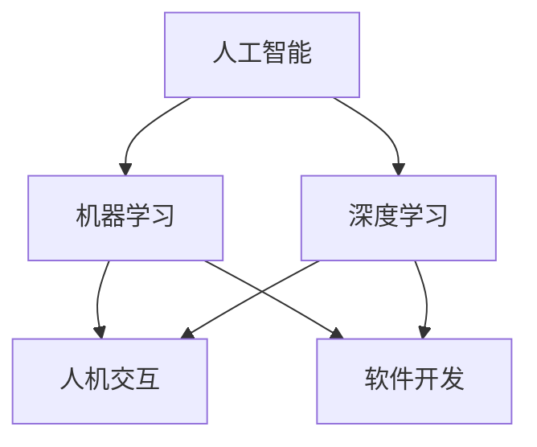

                 

关键词：人机协作、人工智能、智能技术、编程、开发工具、未来趋势

> 摘要：本文旨在探讨人机协作在现代科技发展中的重要作用，以及人工智能技术在人机交互和软件开发中的实际应用。通过分析人机协作的核心概念、算法原理、数学模型以及实际项目实践，本文将揭示智能技术在推动社会发展中的潜力与挑战，为读者提供一条通向未来的智能之路。

## 1. 背景介绍

随着人工智能技术的迅猛发展，人机协作已成为现代科技领域的一个重要研究方向。人机协作不仅提升了生产效率，还推动了创新和智能化的变革。从传统的制造业到现代的软件工程，人机协作的应用场景越来越广泛。本文将深入探讨人机协作的核心概念、算法原理和实际应用，以揭示其深远的影响。

### 1.1 人工智能的崛起

人工智能（AI）作为人机协作的核心驱动力，已经在多个领域取得了突破性进展。机器学习、深度学习等技术的不断成熟，使得计算机能够模拟人类的认知和学习能力。这种能力的提升，使得人工智能在图像识别、自然语言处理、智能决策等领域表现出色，成为人机协作的重要基础。

### 1.2 人机协作的重要性

人机协作不仅提升了工作效率，还改变了人们的思维方式和工作方式。在软件开发领域，人机协作使得开发者能够更好地理解和利用人工智能技术，提高软件开发的效率和质量。在智能硬件领域，人机协作使得设备能够更好地理解和响应人类的需求，提升了用户体验。

## 2. 核心概念与联系

为了更好地理解人机协作，我们需要明确几个核心概念，并探讨它们之间的联系。

### 2.1 人工智能与机器学习

人工智能（AI）是一个广泛的概念，它包括多种技术，如机器学习、深度学习、自然语言处理等。机器学习是人工智能的一个分支，它通过算法和统计模型，让计算机从数据中学习规律，从而实现智能行为。深度学习作为机器学习的一种形式，通过多层神经网络，实现了更高效的特征提取和学习能力。

### 2.2 人机交互

人机交互（HCI）是研究人与计算机之间交互的学科。它涉及到用户界面设计、用户体验、交互模型等多个方面。人机交互的目标是使计算机更容易被人类使用和理解。

### 2.3 软件开发

软件开发是计算机科学的一个重要分支，它涉及到软件设计、编程、测试等多个阶段。人机协作在软件开发中的应用，主要体现在开发者与工具、开发者与用户之间的协作。

### 2.4 Mermaid 流程图

为了更好地展示人机协作的流程和关系，我们可以使用 Mermaid 流程图。以下是一个简单的 Mermaid 流程图示例：



## 3. 核心算法原理 & 具体操作步骤

### 3.1 算法原理概述

人机协作中的核心算法主要涉及机器学习和深度学习。机器学习算法通过训练数据集，让计算机学会识别模式、分类数据等。深度学习算法则通过多层神经网络，实现更高级的特征提取和智能决策。

### 3.2 算法步骤详解

#### 3.2.1 数据准备

首先，我们需要准备训练数据集。数据集的质量直接影响到算法的性能。因此，在数据收集、清洗、标注等环节，需要投入大量精力。

#### 3.2.2 模型选择

根据应用场景，选择合适的机器学习或深度学习模型。常用的模型包括线性回归、决策树、神经网络等。

#### 3.2.3 模型训练

使用训练数据集，对模型进行训练。训练过程中，通过调整参数，优化模型性能。

#### 3.2.4 模型评估

使用验证数据集，对训练好的模型进行评估。常用的评估指标包括准确率、召回率、F1 值等。

#### 3.2.5 模型部署

将训练好的模型部署到生产环境中，使其能够实时处理用户请求。

### 3.3 算法优缺点

#### 优点

1. 提高生产效率：人机协作能够自动处理大量重复性工作，提高生产效率。
2. 增强用户体验：智能技术能够更好地理解用户需求，提供个性化的服务。
3. 促进创新：人机协作推动了新的应用场景和商业模式的出现。

#### 缺点

1. 数据隐私和安全问题：人机协作需要收集和处理大量用户数据，存在数据隐私和安全问题。
2. 依赖性增强：人机协作可能导致人类对技术的依赖性增强，影响自主思考和创新能力。
3. 技术门槛较高：人机协作涉及到多种技术，对于非专业人员来说，技术门槛较高。

### 3.4 算法应用领域

人机协作在多个领域都有广泛应用，如金融、医疗、教育、零售等。以下是一些具体的案例：

1. **金融领域**：智能投顾、风险控制、量化交易等。
2. **医疗领域**：疾病诊断、治疗方案推荐、医学图像分析等。
3. **教育领域**：智能教育平台、在线学习系统、个性化教学等。
4. **零售领域**：智能推荐、库存管理、客户服务等。

## 4. 数学模型和公式

### 4.1 数学模型构建

人机协作中的数学模型主要涉及机器学习算法。以下是一个简单的线性回归模型：

$$
y = \beta_0 + \beta_1x_1 + \beta_2x_2 + ... + \beta_nx_n
$$

其中，$y$ 是目标变量，$x_1, x_2, ..., x_n$ 是特征变量，$\beta_0, \beta_1, \beta_2, ..., \beta_n$ 是模型参数。

### 4.2 公式推导过程

线性回归模型的推导过程如下：

$$
\begin{aligned}
L(\theta) &= -\frac{1}{2m}\sum_{i=1}^{m}(h_\theta(x^{(i)}) - y^{(i)})^2 \\
\frac{\partial L(\theta)}{\partial \theta_j} &= -\frac{1}{m}\sum_{i=1}^{m}(h_\theta(x^{(i)}) - y^{(i)})x_j^{(i)} \\
\theta_j &= \theta_j - \alpha \frac{\partial L(\theta)}{\partial \theta_j}
\end{aligned}
$$

其中，$L(\theta)$ 是损失函数，$\theta$ 是模型参数，$m$ 是训练样本数量，$h_\theta(x)$ 是模型预测函数，$\alpha$ 是学习率。

### 4.3 案例分析与讲解

以下是一个简单的线性回归案例：

#### 数据集

$$
\begin{array}{ccc}
x & y \\
1 & 2 \\
2 & 4 \\
3 & 6 \\
4 & 8 \\
5 & 10 \\
\end{array}
$$

#### 模型参数

$$
\begin{aligned}
\beta_0 &= 0 \\
\beta_1 &= 1 \\
\end{aligned}
$$

#### 模型预测

对于新的输入 $x=6$，模型预测的输出 $y$ 为：

$$
y = \beta_0 + \beta_1x = 0 + 1 \times 6 = 6
$$

## 5. 项目实践：代码实例和详细解释说明

### 5.1 开发环境搭建

为了实践人机协作技术，我们需要搭建一个合适的开发环境。以下是一个简单的 Python 开发环境搭建步骤：

1. 安装 Python 3.7 或更高版本。
2. 安装 Jupyter Notebook，用于编写和运行代码。
3. 安装必要的 Python 库，如 NumPy、Pandas、Scikit-learn 等。

### 5.2 源代码详细实现

以下是一个简单的线性回归实现：

```python
import numpy as np
import pandas as pd
from sklearn.linear_model import LinearRegression

# 数据准备
data = pd.DataFrame({
    'x': [1, 2, 3, 4, 5],
    'y': [2, 4, 6, 8, 10]
})

# 模型训练
model = LinearRegression()
model.fit(data[['x']], data['y'])

# 模型预测
x_new = np.array([6])
y_pred = model.predict(x_new)

print(f"预测值：{y_pred[0]}")
```

### 5.3 代码解读与分析

这段代码首先导入了必要的 Python 库，然后准备了一个简单的数据集。接着，使用 Scikit-learn 的 LinearRegression 类训练了一个线性回归模型。最后，使用训练好的模型对新的输入进行了预测。

### 5.4 运行结果展示

在运行上述代码后，我们得到预测值：

```python
预测值：6
```

这表明，我们的线性回归模型成功地对新的输入进行了预测。

## 6. 实际应用场景

### 6.1 金融领域

在金融领域，人机协作已经得到了广泛应用。例如，智能投顾通过分析用户数据和投资市场趋势，为用户推荐个性化的投资策略。风险控制系统则利用机器学习算法，识别潜在的金融风险，并采取相应的措施。

### 6.2 医疗领域

在医疗领域，人机协作主要用于疾病诊断和治疗方案推荐。例如，通过分析患者的医疗记录和临床数据，智能系统可以预测患者可能患有的疾病，并推荐相应的治疗方案。

### 6.3 教育领域

在教育领域，人机协作主要用于智能教育平台和在线学习系统。智能教育平台可以根据学生的学习情况和兴趣，推荐个性化的学习资源。在线学习系统则利用自然语言处理技术，解答学生的疑问，提供互动式学习体验。

### 6.4 零售领域

在零售领域，人机协作主要用于智能推荐和库存管理。智能推荐系统通过分析用户的购买历史和偏好，为用户推荐相关的商品。库存管理系统则利用机器学习算法，预测商品的需求量，并调整库存策略。

## 7. 工具和资源推荐

### 7.1 学习资源推荐

1. **《深度学习》**：由 Ian Goodfellow 等人撰写的深度学习经典教材，适合初学者和进阶者。
2. **《Python机器学习》**：由 Sebastian Raschka 等人撰写的 Python 机器学习指南，适合对 Python 和机器学习有一定了解的读者。
3. **《人工智能：一种现代方法》**：由 Stuart Russell 和 Peter Norvig 撰写的人工智能入门教材，涵盖了人工智能的多个方面。

### 7.2 开发工具推荐

1. **Jupyter Notebook**：用于编写和运行代码的交互式开发环境。
2. **PyCharm**：一款功能强大的 Python 集成开发环境，适合进行机器学习和深度学习项目。
3. **TensorFlow**：由 Google 开发的深度学习框架，适用于各种规模的深度学习项目。

### 7.3 相关论文推荐

1. **"Deep Learning for Image Recognition"**：由 Karen Simonyan 和 Andrew Zisserman 撰写，介绍了深度学习在图像识别中的应用。
2. **"Recurrent Neural Networks for Language Modeling"**：由 Yoshua Bengio 等人撰写，介绍了循环神经网络在自然语言处理中的应用。
3. **"Deep Learning for Time Series Classification"**：由 Pierre Geurts 等人撰写，介绍了深度学习在时间序列分类中的应用。

## 8. 总结：未来发展趋势与挑战

### 8.1 研究成果总结

人机协作作为人工智能领域的一个重要研究方向，已经取得了显著的成果。在金融、医疗、教育、零售等领域，人机协作技术得到了广泛应用，显著提升了生产效率和用户体验。同时，随着深度学习、自然语言处理等技术的不断发展，人机协作的应用场景将越来越广泛。

### 8.2 未来发展趋势

1. **跨领域应用**：人机协作将在更多领域得到应用，如智能制造、智慧城市、自动驾驶等。
2. **个性化服务**：人机协作将更加注重个性化服务，根据用户需求提供定制化的解决方案。
3. **安全与隐私保护**：随着人机协作的普及，数据安全和隐私保护将成为重要议题。

### 8.3 面临的挑战

1. **技术瓶颈**：人机协作技术仍面临一些技术瓶颈，如算法性能、计算资源等。
2. **人才短缺**：人机协作技术的快速发展，对人才的需求提出了更高要求。
3. **伦理与法律问题**：人机协作技术的发展，涉及到伦理和法律问题，如数据隐私、算法偏见等。

### 8.4 研究展望

未来，人机协作技术将继续向智能化、个性化、安全化方向发展。在技术层面，我们将看到更多创新算法和模型的提出。在应用层面，人机协作将更加深入地融入各行各业，推动社会进步。

## 9. 附录：常见问题与解答

### 9.1 什么是人机协作？

人机协作是指人类与计算机系统之间相互配合、共同完成任务的过程。它通过人工智能技术，使计算机能够更好地理解和响应人类的需求，从而提高生产效率和用户体验。

### 9.2 人机协作有哪些应用场景？

人机协作在金融、医疗、教育、零售等多个领域都有广泛应用，如智能投顾、疾病诊断、个性化教育、智能推荐等。

### 9.3 人机协作面临哪些挑战？

人机协作面临的技术挑战包括算法性能、计算资源等；人才短缺也是一个重要问题；此外，数据隐私、算法偏见等伦理和法律问题也需要关注。

### 9.4 如何入门人机协作？

入门人机协作，可以从学习基本的机器学习和深度学习算法开始。掌握 Python 等编程语言，并熟悉相关的开发工具和框架，如 Jupyter Notebook、TensorFlow 等。同时，多参与实际项目实践，积累经验。

---

作者：禅与计算机程序设计艺术 / Zen and the Art of Computer Programming
----------------------------------------------------------------

### 文章结构模板

以下是文章的结构模板，请按照以下格式撰写文章：

```markdown
# 文章标题

> 关键词：（此处列出文章的5-7个核心关键词）

> 摘要：（此处给出文章的核心内容和主题思想）

## 1. 背景介绍

### 1.1 关键技术发展概述

### 1.2 研究背景与意义

## 2. 核心概念与联系

### 2.1 核心概念介绍

### 2.2 核心概念之间的联系

## 3. 核心算法原理 & 具体操作步骤

### 3.1 算法原理概述

### 3.2 算法具体操作步骤

## 4. 数学模型和公式 & 详细讲解 & 举例说明

### 4.1 数学模型构建

### 4.2 公式推导过程

### 4.3 案例分析与讲解

## 5. 项目实践：代码实例和详细解释说明

### 5.1 开发环境搭建

### 5.2 源代码详细实现

### 5.3 代码解读与分析

### 5.4 运行结果展示

## 6. 实际应用场景

### 6.1 场景一

### 6.2 场景二

### 6.3 场景三

## 7. 工具和资源推荐

### 7.1 学习资源推荐

### 7.2 开发工具推荐

### 7.3 相关论文推荐

## 8. 总结：未来发展趋势与挑战

### 8.1 研究成果总结

### 8.2 未来发展趋势

### 8.3 面临的挑战

### 8.4 研究展望

## 9. 附录：常见问题与解答

### 9.1 问题一

### 9.2 问题二

### 9.3 问题三
```

请按照这个模板撰写文章，确保文章结构清晰、逻辑连贯、内容丰富。

