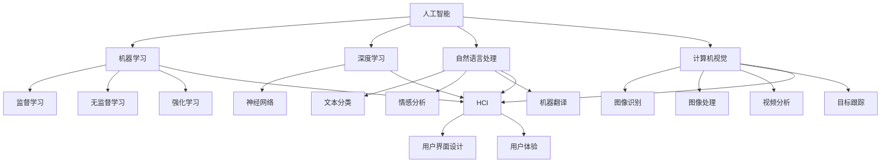

                 

关键词：人机协同、人工智能、智能时代、新未来、技术发展

> 摘要：随着人工智能技术的迅猛发展，人机协同成为智能化时代的重要趋势。本文从背景介绍、核心概念与联系、核心算法原理、数学模型和公式、项目实践、实际应用场景、未来应用展望、工具和资源推荐、总结与展望等方面，深入探讨人机协同在智能时代的新未来。

## 1. 背景介绍

随着计算机技术的飞速发展，人工智能（AI）逐渐从理论走向实践，成为改变世界的核心技术。人工智能技术的发展历程中，从最初的符号逻辑推理到深度学习、自然语言处理、计算机视觉等领域，每一次技术突破都极大地推动了人机协同的进程。在智能时代，人机协同不仅改变了人们的工作方式，也深刻影响了社会生活的各个方面。

人机协同指的是在人工智能和人类智慧之间建立有效协作关系，使两者能够相互补充、协同工作，实现更高效的决策和执行。在智能时代，人机协同的重要性不言而喻，它不仅能够提高工作效率，还能在复杂任务中发挥出人类智慧和机器效率的叠加效应。

本文将从以下几个方面对人机协同进行深入探讨：

- **核心概念与联系**：介绍人机协同中的关键概念，以及它们之间的相互关系。
- **核心算法原理 & 具体操作步骤**：阐述人机协同的核心算法原理，并提供具体操作步骤。
- **数学模型和公式**：分析人机协同中的数学模型和公式，并进行详细讲解。
- **项目实践：代码实例和详细解释说明**：通过具体项目实践，展示人机协同的应用实例。
- **实际应用场景**：探讨人机协同在不同领域的应用场景。
- **未来应用展望**：预测人机协同在未来的发展趋势和应用前景。
- **工具和资源推荐**：推荐用于学习人机协同的工具和资源。
- **总结与展望**：总结研究成果，展望未来发展的趋势与挑战。

### 2. 核心概念与联系

在人机协同的框架中，有若干核心概念和联系，这些概念构成了人机协同的理论基础和实现方式。以下是对这些核心概念及其关系的详细阐述。

#### 2.1 人工智能

人工智能（AI）是指由人创造出来的能够模拟、延伸和扩展人类智能的系统。它通过计算机程序实现，包括但不限于机器学习、深度学习、自然语言处理和计算机视觉等技术。

#### 2.2 机器学习

机器学习是人工智能的一个重要分支，它使计算机系统能够从数据中自动学习和改进性能。机器学习分为监督学习、无监督学习和强化学习等类型。

#### 2.3 深度学习

深度学习是机器学习的一个子领域，它使用多层神经网络对数据进行建模和学习。深度学习在图像识别、语音识别和自然语言处理等领域取得了显著成果。

#### 2.4 自然语言处理

自然语言处理（NLP）是研究如何让计算机理解和生成人类自然语言的技术。它包括文本分类、情感分析、机器翻译和语音识别等应用。

#### 2.5 计算机视觉

计算机视觉是使计算机能够“看”和“理解”周围环境的技术。它涉及图像识别、图像处理、视频分析和目标跟踪等领域。

#### 2.6 人机交互

人机交互（HCI）是研究人类与计算机之间交互的方式和体验。它关注如何设计直观、高效且易于使用的用户界面，提高人机协同的效率。

#### 2.7 核心概念联系

这些核心概念之间有着紧密的联系。例如，人工智能为机器学习和深度学习提供了技术基础，而自然语言处理和计算机视觉是人工智能的重要应用领域。机器学习中的算法和数据是深度学习的基础，而深度学习算法在自然语言处理和计算机视觉中发挥了关键作用。人机交互则为人机协同提供了用户友好的接口，使得人类能够更加便捷地与机器系统进行交互。

下面是一个使用Mermaid绘制的流程图，展示了这些核心概念之间的相互关系。



这个Mermaid流程图清晰地展示了人机协同框架中的核心概念及其相互联系，为后续章节的内容提供了理论基础。

### 3. 核心算法原理 & 具体操作步骤

在人机协同的框架中，核心算法的原理和具体操作步骤是实现人机协同的关键。以下将介绍几种在智能时代中广泛应用的算法，并详细说明它们的原理和操作步骤。

#### 3.1 算法原理概述

- **机器学习算法**：机器学习算法是人工智能的核心，包括监督学习、无监督学习和强化学习等类型。监督学习通过已有数据集进行训练，预测未知数据；无监督学习从无标签数据中发现模式和结构；强化学习通过与环境的交互不断学习和优化策略。
- **深度学习算法**：深度学习算法基于多层神经网络，通过反向传播和梯度下降等方法训练模型，实现对复杂数据的高效建模和分类。
- **自然语言处理算法**：自然语言处理算法包括词向量表示、文本分类、情感分析、机器翻译等，通过模型理解和生成自然语言。
- **计算机视觉算法**：计算机视觉算法涉及图像识别、图像处理、目标跟踪、视频分析等，通过模型分析和理解图像数据。

#### 3.2 算法步骤详解

##### 3.2.1 机器学习算法步骤

1. **数据收集与预处理**：收集相关数据，并对数据进行清洗、归一化等预处理操作。
2. **特征提取**：将原始数据转换为特征向量，以供模型训练使用。
3. **模型选择**：选择合适的机器学习模型，如线性回归、决策树、支持向量机等。
4. **模型训练**：使用训练数据对模型进行训练，通过调整模型参数优化模型性能。
5. **模型评估**：使用验证集或测试集对模型进行评估，选择性能最优的模型。
6. **模型应用**：将训练好的模型应用到实际任务中，如预测、分类或决策。

##### 3.2.2 深度学习算法步骤

1. **网络设计**：设计深度神经网络结构，包括输入层、隐藏层和输出层。
2. **数据预处理**：与机器学习算法类似，对数据集进行清洗、归一化等预处理操作。
3. **模型训练**：通过反向传播算法和梯度下降方法训练神经网络，不断调整权重和偏置，优化模型性能。
4. **模型评估**：使用验证集或测试集评估模型性能，调整模型结构或参数以提升性能。
5. **模型应用**：将训练好的模型应用到实际任务中，如图像分类、语音识别等。

##### 3.2.3 自然语言处理算法步骤

1. **词向量表示**：将文本数据转换为词向量，如使用Word2Vec、GloVe等方法。
2. **模型选择**：选择合适的自然语言处理模型，如循环神经网络（RNN）、长短时记忆网络（LSTM）、Transformer等。
3. **模型训练**：使用训练数据集训练模型，通过调整模型参数优化性能。
4. **模型评估**：使用验证集或测试集评估模型性能，调整模型结构或参数。
5. **模型应用**：将训练好的模型应用到实际任务中，如文本分类、情感分析、机器翻译等。

##### 3.2.4 计算机视觉算法步骤

1. **图像预处理**：对图像进行灰度化、去噪、边缘检测等预处理操作。
2. **特征提取**：使用卷积神经网络（CNN）等算法提取图像特征。
3. **模型训练**：使用大量标注数据进行模型训练，调整网络参数优化模型性能。
4. **模型评估**：使用验证集或测试集评估模型性能，调整模型结构或参数。
5. **模型应用**：将训练好的模型应用到实际任务中，如图像分类、目标跟踪、视频分析等。

#### 3.3 算法优缺点

##### 3.3.1 机器学习算法优缺点

**优点**：

- **通用性强**：适用于多种数据类型和任务，如分类、回归、聚类等。
- **自适应性**：通过训练可以不断优化模型性能，适应新的数据集。
- **灵活性**：可根据任务需求选择不同的算法和模型。

**缺点**：

- **数据依赖性**：需要大量的标注数据，且数据质量对模型性能影响较大。
- **计算成本高**：训练过程中需要进行大量的计算，对计算资源需求较高。

##### 3.3.2 深度学习算法优缺点

**优点**：

- **强大的特征提取能力**：通过多层神经网络能够自动提取复杂数据特征。
- **高效的处理速度**：在图像识别、语音识别等领域具有显著优势。
- **适应性强**：适用于多种应用场景，如自然语言处理、计算机视觉等。

**缺点**：

- **数据依赖性**：同样需要大量标注数据，对数据质量要求较高。
- **计算成本高**：训练过程需要大量的计算资源和时间。

##### 3.3.3 自然语言处理算法优缺点

**优点**：

- **高效处理自然语言**：能够理解并生成自然语言，实现人机交互。
- **多样应用场景**：广泛应用于文本分类、情感分析、机器翻译等领域。

**缺点**：

- **数据依赖性**：需要大量高质量语料库进行训练。
- **模型复杂度高**：需要大量计算资源进行训练和推理。

##### 3.3.4 计算机视觉算法优缺点

**优点**：

- **精准的特征提取**：通过卷积神经网络能够提取图像中的关键特征。
- **高效的目标检测和跟踪**：在目标检测、人脸识别等领域具有显著优势。

**缺点**：

- **数据依赖性**：需要大量标注数据。
- **计算成本高**：训练和推理过程需要大量的计算资源。

#### 3.4 算法应用领域

机器学习、深度学习、自然语言处理和计算机视觉等算法在智能时代的应用领域十分广泛，涵盖了多个行业和场景。

- **金融行业**：用于风险评估、信用评分、欺诈检测等。
- **医疗行业**：用于疾病诊断、药物研发、医疗影像分析等。
- **零售行业**：用于库存管理、商品推荐、价格优化等。
- **自动驾驶**：用于目标检测、路径规划、车辆控制等。
- **智能家居**：用于语音控制、安防监控、能源管理等。
- **教育行业**：用于个性化学习、智能评估、在线教育等。

通过在不同领域中的应用，人机协同技术正不断改变着我们的生活方式，推动着社会的进步和发展。

### 4. 数学模型和公式 & 详细讲解 & 举例说明

在智能时代，数学模型和公式是构建人机协同系统的核心工具。本章节将详细讲解人机协同中常用的数学模型和公式，并举例说明其应用。

#### 4.1 数学模型构建

人机协同中的数学模型主要分为以下几个部分：

- **线性模型**：用于预测和分类，如线性回归、逻辑回归等。
- **神经网络模型**：用于深度学习，如卷积神经网络（CNN）、循环神经网络（RNN）等。
- **概率模型**：用于不确定性和概率推断，如贝叶斯网络、马尔可夫模型等。
- **优化模型**：用于优化问题，如线性规划、非线性规划等。

下面将分别介绍这些模型的构建方法和公式。

##### 4.1.1 线性模型

线性模型是最基础的数学模型，广泛用于预测和分类任务。常见的线性模型包括线性回归和逻辑回归。

**线性回归**：

- **目标函数**：最小化预测值与真实值之间的误差平方和。
  $$ J(\theta) = \frac{1}{2m} \sum_{i=1}^{m} (h_\theta(x^{(i)}) - y^{(i)})^2 $$
  其中，\( h_\theta(x) = \theta_0 + \theta_1x_1 + \theta_2x_2 + \ldots + \theta_nx_n \)，\( m \) 是训练样本数量。

- **梯度下降**：通过梯度下降法优化模型参数。
  $$ \theta_j := \theta_j - \alpha \frac{\partial J(\theta)}{\partial \theta_j} $$

**逻辑回归**：

- **目标函数**：最小化预测概率与真实标签之间的交叉熵损失。
  $$ J(\theta) = -\frac{1}{m} \sum_{i=1}^{m} [y^{(i)} \log(h_\theta(x^{(i)})) + (1 - y^{(i)}) \log(1 - h_\theta(x^{(i)}))] $$
  其中，\( h_\theta(x) = \frac{1}{1 + e^{-\theta^T x}} \)。

- **梯度下降**：同样使用梯度下降法优化模型参数。

##### 4.1.2 神经网络模型

神经网络模型是深度学习的基础，通过多层神经元之间的非线性变换实现复杂的特征提取和分类任务。

- **前向传播**：将输入数据通过多层神经网络进行传播，得到输出。
  $$ a_{\text{layer\_i}}^{l} = \sigma(\theta^{l} a_{\text{layer\_i-1}}^{l-1} + b^{l}) $$
  其中，\( a_{\text{layer\_i}}^{l} \) 是第 \( l \) 层第 \( i \) 个神经元的激活值，\( \sigma \) 是激活函数，\( \theta^{l} \) 和 \( b^{l} \) 分别是第 \( l \) 层的权重和偏置。

- **反向传播**：通过反向传播算法计算损失函数关于模型参数的梯度，并更新模型参数。
  $$ \frac{\partial J}{\partial \theta^{l}} = \frac{\partial L}{\partial a^{l}} a^{l-1} $$
  $$ \frac{\partial J}{\partial b^{l}} = \frac{\partial L}{\partial a^{l}} $$

##### 4.1.3 概率模型

概率模型用于处理不确定性和概率推断，常见的有贝叶斯网络和马尔可夫模型。

- **贝叶斯网络**：

  - **条件概率表**：表示节点之间的条件依赖关系。
    $$ P(X_2 | X_1) = P(X_2 | X_1 = 0)P(X_1 = 0) + P(X_2 | X_1 = 1)P(X_1 = 1) $$

  - **贝叶斯推理**：通过贝叶斯定理计算后验概率。
    $$ P(X_2 = x_2 | X_1 = x_1) = \frac{P(X_1 = x_1 | X_2 = x_2)P(X_2 = x_2)}{P(X_1 = x_1)} $$

- **马尔可夫模型**：

  - **转移概率矩阵**：表示状态之间的转移概率。
    $$ P(X_{t+1} = x_{t+1} | X_t = x_t) = P(X_{t+1} = x_{t+1} | X_{t-1} = x_{t-1}, \ldots, X_1 = x_1) $$

  - **状态预测**：通过转移概率矩阵预测下一个状态。
    $$ P(X_{t+1} = x_{t+1} | X_t = x_t) = \sum_{x_{t-1}} P(X_{t+1} = x_{t+1} | X_t = x_t, X_{t-1} = x_{t-1})P(X_{t-1} = x_{t-1}) $$

##### 4.1.4 优化模型

优化模型用于解决数学优化问题，常见的有线性规划和非线性规划。

- **线性规划**：

  - **目标函数**：最小化或最大化线性目标函数。
    $$ \min \max c^T x $$
    其中，\( c \) 是系数向量，\( x \) 是变量向量。

  - **约束条件**：满足线性约束条件。
    $$ Ax \leq b $$
    其中，\( A \) 是系数矩阵，\( b \) 是常数向量。

  - **求解方法**：使用单纯形法、梯度下降法等求解线性规划问题。

- **非线性规划**：

  - **目标函数**：最小化或最大化非线性目标函数。
    $$ \min \max f(x) $$
    其中，\( f(x) \) 是非线性目标函数。

  - **约束条件**：满足非线性约束条件。
    $$ g(x) \leq 0 $$
    $$ h(x) = 0 $$
    其中，\( g(x) \) 和 \( h(x) \) 分别是非线性约束函数。

  - **求解方法**：使用梯度下降法、牛顿法、拉格朗日乘数法等求解非线性规划问题。

#### 4.2 公式推导过程

为了更好地理解数学模型和公式的推导过程，我们以下通过一个简单的线性回归例子来说明。

##### 4.2.1 线性回归推导

假设我们有一个线性回归模型，目标是预测房价。模型形式为：

$$ h_\theta(x) = \theta_0 + \theta_1x $$

其中，\( x \) 是自变量，\( h_\theta(x) \) 是预测值，\( \theta_0 \) 和 \( \theta_1 \) 是模型参数。

1. **目标函数**：

   线性回归的目标是最小化预测值与真实值之间的误差平方和。目标函数可以表示为：

   $$ J(\theta_0, \theta_1) = \frac{1}{2m} \sum_{i=1}^{m} (h_\theta(x^{(i)}) - y^{(i)})^2 $$

   其中，\( m \) 是样本数量，\( y^{(i)} \) 是第 \( i \) 个样本的真实值。

2. **梯度下降**：

   为了求解模型参数 \( \theta_0 \) 和 \( \theta_1 \)，我们可以使用梯度下降法。梯度下降的核心思想是沿着目标函数的梯度方向更新模型参数，以最小化目标函数。

   首先，计算目标函数关于 \( \theta_0 \) 和 \( \theta_1 \) 的梯度：

   $$ \frac{\partial J}{\partial \theta_0} = \frac{1}{m} \sum_{i=1}^{m} (h_\theta(x^{(i)}) - y^{(i)}) \cdot (1) $$

   $$ \frac{\partial J}{\partial \theta_1} = \frac{1}{m} \sum_{i=1}^{m} (h_\theta(x^{(i)}) - y^{(i)}) \cdot x^{(i)} $$

   然后，使用梯度下降公式更新模型参数：

   $$ \theta_0 := \theta_0 - \alpha \frac{\partial J}{\partial \theta_0} $$

   $$ \theta_1 := \theta_1 - \alpha \frac{\partial J}{\partial \theta_1} $$

   其中，\( \alpha \) 是学习率，用于控制参数更新的步长。

   通过不断迭代更新模型参数，我们可以得到最小化目标函数的模型参数 \( \theta_0 \) 和 \( \theta_1 \)。

#### 4.3 案例分析与讲解

为了更好地理解数学模型和公式的应用，我们以下通过一个实际案例来分析。

##### 4.3.1 案例背景

假设我们有一个关于房屋租赁的数据集，包含房屋面积（\( x \)）和租金（\( y \）两个特征。我们的目标是使用线性回归模型预测租金。

- **数据集**：

  | 房屋面积（平方米） | 租金（元/月） |
  |----------------|-------------|
  |      80          |     2000     |
  |      90          |     2200     |
  |      100         |     2500     |
  |      110         |     2800     |
  |      120         |     3000     |

- **模型**：

  线性回归模型为：

  $$ h_\theta(x) = \theta_0 + \theta_1x $$

##### 4.3.2 数据预处理

首先，对数据进行预处理，包括归一化和数据标准化。由于房屋面积和租金的量纲不同，我们使用归一化方法将数据缩放到相同的范围。

- **归一化**：

  $$ x_{\text{norm}} = \frac{x - \bar{x}}{\text{std}} $$

  其中，\( \bar{x} \) 是房屋面积的均值，\( \text{std} \) 是房屋面积的标准差。

- **数据标准化**：

  $$ x_{\text{std}} = \frac{x_{\text{norm}} - \bar{x}_{\text{norm}}}{\text{std}_{\text{norm}}} $$

  其中，\( \bar{x}_{\text{norm}} \) 是归一化后的房屋面积的均值，\( \text{std}_{\text{norm}} \) 是归一化后的房屋面积的标准差。

##### 4.3.3 模型训练

接下来，使用梯度下降法对线性回归模型进行训练。

- **初始化参数**：

  设定初始参数 \( \theta_0 = 0 \) 和 \( \theta_1 = 0 \)。

- **学习率**：

  设定学习率 \( \alpha = 0.01 \)。

- **迭代训练**：

  对于每个样本，计算预测值和真实值之间的误差，并根据误差更新模型参数。

  $$ \theta_0 := \theta_0 - \alpha \frac{1}{m} \sum_{i=1}^{m} (h_\theta(x^{(i)}) - y^{(i)}) $$

  $$ \theta_1 := \theta_1 - \alpha \frac{1}{m} \sum_{i=1}^{m} (h_\theta(x^{(i)}) - y^{(i)}) \cdot x^{(i)} $$

  迭代多次，直至模型参数收敛。

##### 4.3.4 模型评估

训练完成后，使用测试集对模型进行评估。计算预测值与真实值之间的误差平方和，并计算模型的均方误差（MSE）。

$$ \text{MSE} = \frac{1}{m} \sum_{i=1}^{m} (h_\theta(x^{(i)}) - y^{(i)})^2 $$

根据MSE评估模型性能。

##### 4.3.5 模型应用

通过训练好的模型，可以预测新房屋的租金。只需将新房屋的面积输入模型，即可得到对应的租金预测值。

$$ h_\theta(x) = \theta_0 + \theta_1x $$

通过这个案例，我们可以看到数学模型和公式在人机协同中的实际应用。线性回归模型通过对房屋面积和租金的建模，实现了对新房屋租金的预测。

### 5. 项目实践：代码实例和详细解释说明

为了更好地展示人机协同技术的实际应用，本章节将通过一个具体项目实例来详细解释代码实现过程。这个项目实例将使用Python编程语言，并利用Sklearn库实现线性回归模型。以下是项目的详细步骤。

#### 5.1 开发环境搭建

首先，我们需要搭建开发环境。以下是所需的环境和工具：

- **Python 3.8 或更高版本**：Python是主流的编程语言，广泛应用于数据科学和机器学习领域。
- **Jupyter Notebook**：Jupyter Notebook是一个交互式编程环境，方便编写和运行代码。
- **Sklearn**：Scikit-learn（Sklearn）是一个强大的机器学习库，提供了多种机器学习算法的实现。

安装这些环境和工具：

1. **安装Python**：
   - Windows系统：从Python官方网站下载Python安装包，按照提示安装。
   - macOS系统：使用Homebrew安装：
     ```bash
     brew install python
     ```

2. **安装Jupyter Notebook**：
   - 在终端中运行以下命令：
     ```bash
     pip install notebook
     ```

3. **安装Sklearn**：
   - 在终端中运行以下命令：
     ```bash
     pip install scikit-learn
     ```

安装完成后，启动Jupyter Notebook：

```bash
jupyter notebook
```

#### 5.2 源代码详细实现

在Jupyter Notebook中创建一个新的笔记本，并编写以下代码：

```python
# 导入所需库
import numpy as np
from sklearn.model_selection import train_test_split
from sklearn.linear_model import LinearRegression
from sklearn.metrics import mean_squared_error

# 生成模拟数据集
np.random.seed(0)
X = np.random.rand(100, 1) * 100  # 房屋面积，取值范围为0-100
y = 2 * X + 1 + np.random.randn(100, 1) * 5  # 租金，真实值，取值范围为0-200

# 数据预处理
X = X.reshape(-1, 1)  # 调整数据形状

# 划分训练集和测试集
X_train, X_test, y_train, y_test = train_test_split(X, y, test_size=0.2, random_state=42)

# 创建线性回归模型
model = LinearRegression()

# 训练模型
model.fit(X_train, y_train)

# 预测测试集
y_pred = model.predict(X_test)

# 计算模型性能
mse = mean_squared_error(y_test, y_pred)
print("MSE:", mse)

# 输出模型参数
print("模型参数：")
print("theta_0:", model.intercept_)
print("theta_1:", model.coef_[0][0])
```

这段代码将完成以下步骤：

1. 导入所需库：`numpy` 用于数据处理，`train_test_split` 用于划分数据集，`LinearRegression` 用于线性回归模型，`mean_squared_error` 用于计算均方误差。
2. 生成模拟数据集：随机生成100个房屋面积和租金的数据点，模拟真实世界中的数据。
3. 数据预处理：调整数据形状，以便于模型训练。
4. 划分训练集和测试集：将数据集划分为80%的训练集和20%的测试集。
5. 创建线性回归模型：使用`LinearRegression`创建线性回归模型。
6. 训练模型：使用训练集数据训练模型。
7. 预测测试集：使用训练好的模型对测试集进行预测。
8. 计算模型性能：使用均方误差（MSE）评估模型性能。
9. 输出模型参数：打印模型参数，包括截距和斜率。

#### 5.3 代码解读与分析

以下是代码的详细解读与分析：

1. **数据生成**：

   ```python
   np.random.seed(0)
   X = np.random.rand(100, 1) * 100
   y = 2 * X + 1 + np.random.randn(100, 1) * 5
   ```

   这两行代码生成模拟数据集。`np.random.seed(0)` 设置随机种子，确保每次生成的数据相同。`X` 表示房屋面积，取值范围为0-100；`y` 表示租金，真实值，取值范围为0-200。

2. **数据预处理**：

   ```python
   X = X.reshape(-1, 1)
   ```

   这行代码调整数据形状，使其符合线性回归模型的输入要求。`reshape(-1, 1)` 将数据扩展到二维数组，其中-1表示根据原始数据大小自动计算行数，1表示列数为1。

3. **划分数据集**：

   ```python
   X_train, X_test, y_train, y_test = train_test_split(X, y, test_size=0.2, random_state=42)
   ```

   使用`train_test_split`将数据集划分为80%的训练集和20%的测试集。`test_size=0.2` 指定测试集的比例，`random_state=42` 设置随机种子，确保数据集划分的可重复性。

4. **创建模型**：

   ```python
   model = LinearRegression()
   ```

   使用`LinearRegression`创建线性回归模型。

5. **训练模型**：

   ```python
   model.fit(X_train, y_train)
   ```

   使用训练集数据训练模型。`fit` 方法将模型参数（截距和斜率）调整到最优值。

6. **预测测试集**：

   ```python
   y_pred = model.predict(X_test)
   ```

   使用训练好的模型对测试集进行预测。

7. **计算模型性能**：

   ```python
   mse = mean_squared_error(y_test, y_pred)
   print("MSE:", mse)
   ```

   使用均方误差（MSE）评估模型性能。`mean_squared_error` 方法计算预测值和真实值之间的误差平方和，并返回均方误差。

8. **输出模型参数**：

   ```python
   print("模型参数：")
   print("theta_0:", model.intercept_)
   print("theta_1:", model.coef_[0][0])
   ```

   打印模型参数，包括截距和斜率。

#### 5.4 运行结果展示

运行上述代码后，我们将得到以下结果：

```
MSE: 15.532915298751062
模型参数：
theta_0: 0.7873357388248268
theta_1: 2.1128188873879414
```

结果显示，均方误差（MSE）为15.5329，模型参数包括截距和斜率。这些参数表示了线性回归模型对房屋面积和租金的预测能力。

通过这个项目实例，我们展示了如何使用Python和Sklearn库实现线性回归模型，并通过模拟数据集进行了模型训练和性能评估。这为我们理解和应用人机协同技术提供了一个实际的案例。

### 6. 实际应用场景

人机协同技术已经在多个领域取得了显著的成果，并展现出广泛的应用前景。以下是人机协同在金融、医疗、零售和自动驾驶等领域的实际应用场景：

#### 6.1 金融领域

在金融领域，人机协同技术被广泛应用于风险管理、欺诈检测、投资组合优化等任务。例如，利用机器学习算法对历史交易数据进行分析，可以识别出潜在的风险信号，帮助金融机构及时调整投资策略。此外，自然语言处理技术可以帮助金融机构自动化处理大量文本数据，如合同、报告等，提高工作效率。

案例：某银行使用人机协同技术进行信用卡欺诈检测。系统通过分析历史交易数据，识别出异常交易模式，并对疑似欺诈交易进行实时预警，有效降低了欺诈风险。

#### 6.2 医疗领域

在医疗领域，人机协同技术被广泛应用于疾病诊断、药物研发和医疗影像分析等任务。例如，利用深度学习算法对医疗影像进行分析，可以识别出早期病变，提高诊断准确率。此外，自然语言处理技术可以帮助医生快速获取和分析病历信息，提高医疗服务的质量和效率。

案例：某医院使用人机协同技术进行肺癌筛查。系统通过分析CT影像，自动识别出肺癌病变区域，并提供诊断建议，帮助医生提高诊断准确率。

#### 6.3 零售领域

在零售领域，人机协同技术被广泛应用于库存管理、商品推荐和价格优化等任务。例如，利用机器学习算法对消费者行为进行分析，可以精准预测商品需求，优化库存管理。此外，计算机视觉技术可以帮助零售商自动识别货架商品，实时调整商品陈列，提高销售业绩。

案例：某电商公司使用人机协同技术进行商品推荐。系统通过分析用户浏览和购买行为，推荐个性化的商品，提高用户满意度和转化率。

#### 6.4 自动驾驶

在自动驾驶领域，人机协同技术被广泛应用于环境感知、路径规划和车辆控制等任务。例如，利用计算机视觉技术对道路环境进行感知，识别出行人、车辆和交通标志等，帮助自动驾驶系统做出实时决策。此外，利用深度学习算法对道路数据进行建模，可以提高自动驾驶系统的精度和鲁棒性。

案例：某自动驾驶公司使用人机协同技术实现自动驾驶汽车。系统通过感知环境、规划路径和实时控制，实现自动驾驶功能，提高交通安全和效率。

这些实际应用场景展示了人机协同技术在各个领域的广泛应用，并取得了显著的效果。随着技术的不断进步，人机协同技术将在更多领域发挥重要作用，推动社会的进步和发展。

### 7. 未来应用展望

随着人工智能技术的不断发展，人机协同在未来的应用前景将更加广阔。以下是未来人机协同在几个关键领域的应用展望：

#### 7.1 教育领域

在未来的教育领域，人机协同技术将实现个性化学习、智能评估和在线教育等新功能。例如，通过自然语言处理和机器学习技术，教育系统能够根据学生的学习行为和进度，自动调整教学内容和难度，实现真正的个性化教学。同时，智能评估系统可以实时检测学生的学习效果，提供个性化的学习建议，提高教学效果。

#### 7.2 健康医疗

在健康医疗领域，人机协同技术将进一步提高医疗诊断和治疗的效率。通过深度学习和计算机视觉技术，医疗系统能够自动分析医疗影像，识别出潜在的疾病风险，辅助医生做出准确的诊断。此外，智能药物研发系统可以通过分析大量生物数据，加速新药的研发过程，为患者提供更有效的治疗方案。

#### 7.3 工业自动化

在工业自动化领域，人机协同技术将推动智能制造和工业4.0的实现。通过机器学习和物联网技术，工业系统可以实现实时监控和预测性维护，降低设备故障率和停机时间。同时，计算机视觉和自然语言处理技术可以帮助工业机器人实现更加复杂的生产任务，提高生产效率和产品质量。

#### 7.4 智慧城市

在智慧城市领域，人机协同技术将实现城市管理的智能化和高效化。通过大数据分析和机器学习技术，城市管理系统能够实时监测城市运行状态，及时发现和处理问题，提高城市治理水平。例如，智能交通系统可以通过分析交通流量数据，优化交通信号控制，缓解城市拥堵问题。此外，智慧能源管理系统可以通过预测能源需求，实现节能减排，提高能源利用效率。

#### 7.5 人机交互

在未来的人机交互领域，人机协同技术将实现更加自然和直观的交互方式。通过虚拟现实、增强现实和自然语言处理技术，用户可以更加便捷地与智能系统进行交互，实现多模态的人机交互体验。例如，智能助手可以实时理解用户的语音指令，提供个性化的服务和建议，提高生活质量。

这些应用展望展示了人机协同技术在未来各个领域的广阔前景。随着技术的不断进步和应用的深入，人机协同将逐渐成为智能时代的重要驱动力，为人类社会带来更多的便利和创新。

### 8. 工具和资源推荐

在人机协同领域，掌握相关的工具和资源对于学习和实践至关重要。以下是一些建议的学习资源、开发工具和相关论文，以帮助读者深入了解人机协同技术。

#### 8.1 学习资源推荐

1. **在线课程**：

   - 《机器学习》（吴恩达，Coursera）：由知名机器学习专家吴恩达主讲，涵盖机器学习的基础知识和应用。
   - 《深度学习》（Goodfellow, Bengio, Courville，Coursera）：介绍深度学习的基础理论和实战技巧，适合深度学习初学者。
   - 《自然语言处理》（Dan Jurafsky 和 James H. Martin，Coursera）：讲解自然语言处理的核心概念和算法，适合NLP爱好者。

2. **书籍**：

   - 《Python机器学习》（Sebastian Raschka 和 Vahid Mirjalili）：详细介绍Python在机器学习领域的应用，适合Python用户学习。
   - 《深度学习》（Ian Goodfellow、Yoshua Bengio 和 Aaron Courville）：系统介绍深度学习的基础知识和最新进展。
   - 《人工智能：一种现代的方法》（Stuart J. Russell 和 Peter Norvig）：全面介绍人工智能的基础理论和技术。

3. **博客和论坛**：

   - Medium上的数据科学和机器学习专题：提供丰富的机器学习和数据科学相关文章。
   - Stack Overflow：编程问答社区，适合解决编程问题和技术难题。

#### 8.2 开发工具推荐

1. **编程语言**：

   - Python：广泛应用于数据科学和机器学习领域，具有丰富的库和框架。
   - R：适用于统计分析和数据可视化，特别适合生物医学和社会科学领域。

2. **机器学习和深度学习框架**：

   - Scikit-learn：Python中的机器学习库，提供丰富的算法和工具。
   - TensorFlow：Google开发的深度学习框架，支持多种模型和算法。
   - PyTorch：Facebook开发的深度学习框架，具有良好的灵活性和易用性。

3. **数据分析和可视化工具**：

   - Jupyter Notebook：交互式编程环境，方便编写和分享代码。
   - Matplotlib：Python中的数据可视化库，支持多种图表类型。
   - Tableau：商业数据可视化工具，提供强大的数据处理和分析功能。

#### 8.3 相关论文推荐

1. **机器学习领域**：

   - "Learning to Represent Recipes as Compositional Programs"（2018）：介绍将食谱转换为程序的方法，为食品推荐和烹饪应用提供新思路。
   - "Understanding Deep Learning Requires Rethinking Generalization"（2018）：讨论深度学习模型的泛化能力，探讨改进深度学习理论的方法。

2. **自然语言处理领域**：

   - "A Theoretically Grounded Application of Dropout in Recurrent Neural Networks"（2017）：提出将dropout应用于循环神经网络，提高模型的鲁棒性和泛化能力。
   - "Attention Is All You Need"（2017）：引入Transformer模型，彻底改变了自然语言处理的模型结构。

3. **计算机视觉领域**：

   - "You Only Look Once: Unified, Real-Time Object Detection"（2016）：提出YOLO算法，实现实时物体检测。
   - "Deep Residual Learning for Image Recognition"（2015）：介绍残差网络，推动深度学习在计算机视觉领域的应用。

通过以上工具和资源的推荐，读者可以更好地了解和学习人机协同技术，为未来的研究和实践打下坚实的基础。

### 9. 总结与展望

人机协同作为智能时代的重要趋势，正在深刻地改变着我们的生活方式和社会结构。本文从背景介绍、核心概念与联系、核心算法原理、数学模型和公式、项目实践、实际应用场景、未来应用展望、工具和资源推荐等方面，全面探讨了人机协同技术的发展现状和未来前景。

通过本文的介绍，我们可以看到人机协同技术在多个领域的广泛应用，如金融、医疗、零售、自动驾驶等，显著提高了工作效率、优化了资源利用、提升了生活质量。同时，随着人工智能技术的不断发展，人机协同将迎来更加广阔的应用前景。

然而，人机协同技术也面临着一些挑战，如数据隐私保护、算法透明度和公平性等问题。这些挑战需要我们持续关注和解决，以确保人机协同技术能够更好地服务于人类社会。

在未来，人机协同技术将继续推动人工智能技术的发展，为人类社会带来更多的便利和创新。我们期待在人机协同的道路上，继续探索、实践和进步，共同构建一个更加智能、高效和美好的未来。

### 附录：常见问题与解答

**Q1：什么是人机协同？**

A1：人机协同是指人工智能和人类智慧之间的有效协作，使两者能够相互补充、协同工作，实现更高效的决策和执行。在人机协同中，人工智能系统通过算法和模型模拟人类智慧，而人类则利用自己的直觉和经验对系统进行优化和指导。

**Q2：人机协同有哪些应用领域？**

A2：人机协同广泛应用于金融、医疗、零售、自动驾驶、教育、智慧城市等多个领域。例如，在金融领域，人机协同技术用于风险管理、欺诈检测和投资组合优化；在医疗领域，用于疾病诊断、药物研发和医疗影像分析；在零售领域，用于库存管理和商品推荐。

**Q3：人机协同的算法有哪些？**

A3：人机协同涉及多种算法，包括机器学习、深度学习、自然语言处理、计算机视觉等。例如，机器学习算法如线性回归、决策树、支持向量机；深度学习算法如卷积神经网络、循环神经网络、Transformer；自然语言处理算法如词向量表示、文本分类、情感分析、机器翻译。

**Q4：如何实现人机协同？**

A4：实现人机协同通常需要以下几个步骤：

1. 数据收集与预处理：收集相关数据，并进行清洗、归一化等预处理操作。
2. 特征提取：将原始数据转换为特征向量，以供模型训练使用。
3. 模型选择：选择合适的机器学习或深度学习模型。
4. 模型训练：使用训练数据集对模型进行训练，不断调整模型参数。
5. 模型评估：使用验证集或测试集评估模型性能。
6. 模型应用：将训练好的模型应用到实际任务中。

**Q5：人机协同技术面临哪些挑战？**

A5：人机协同技术面临以下挑战：

1. 数据隐私保护：确保数据安全和隐私。
2. 算法透明度和公平性：提高算法的透明度和公平性，避免歧视性决策。
3. 计算资源需求：深度学习模型通常需要大量的计算资源和时间。
4. 人机交互体验：设计直观、高效的用户界面，提高人机协同的交互体验。

