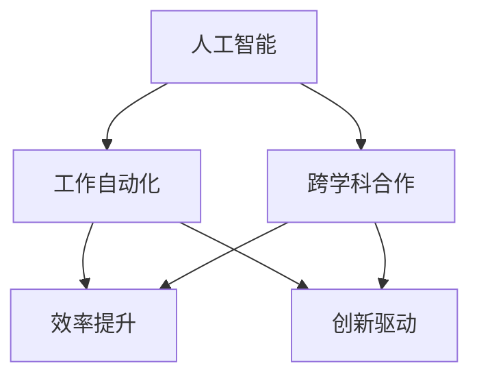

                 

关键词：人机协同、人工智能、工作自动化、效率提升、技能互补、创新驱动、跨学科合作

> 摘要：随着人工智能技术的迅速发展，人机协同成为未来工作的关键词。本文将从人机协同的背景介绍、核心概念与联系、核心算法原理、数学模型和公式、项目实践、实际应用场景、工具和资源推荐、以及未来发展趋势与挑战等多个方面，深入探讨人机协同在现代工作中的重要性及其未来发展。

## 1. 背景介绍

在过去的几十年中，计算机技术的发展经历了从简单的计算工具到高度智能化的过程。随着人工智能、大数据、云计算等技术的不断进步，计算机在各个领域中的作用越来越突出。然而，尽管计算机的智能化程度不断提高，但仍然存在着许多局限性，如处理复杂问题的能力有限、理解人类语言的能力较弱等。因此，人机协同应运而生，通过将人类的智慧和计算机的强大计算能力相结合，实现更高效率、更智能的工作方式。

人机协同的背景可以从以下几个方面进行阐述：

### 1.1 工作自动化需求

随着经济的发展，人们对工作效率的要求越来越高。工作自动化可以显著提高工作效率，减少人力成本，降低错误率。然而，许多复杂的工作任务需要人类智慧和计算机能力的结合，才能实现自动化。

### 1.2 创新驱动

在科技迅猛发展的今天，创新成为企业发展的核心动力。人机协同可以激发人类的创造力和计算机的计算能力，共同推动创新。

### 1.3 技能互补

人类擅长处理抽象思维、创造性思维等问题，而计算机擅长处理大量数据计算和分析。人机协同可以实现技能互补，最大化利用各自的优势。

## 2. 核心概念与联系

在探讨人机协同之前，我们需要明确几个核心概念：

### 2.1 人工智能

人工智能（Artificial Intelligence，AI）是指由人制造出来的系统能够理解、学习、适应并应用人类的知识和技能，从而实现智能化的行为。人工智能可以分为弱人工智能和强人工智能，其中弱人工智能专注于特定任务的解决，而强人工智能则具有广泛的理解和适应能力。

### 2.2 工作自动化

工作自动化（Work Automation）是指利用计算机技术和工具，将重复性、繁琐的工作任务自动化，减少人力投入。

### 2.3 跨学科合作

跨学科合作（Interdisciplinary Collaboration）是指不同学科领域之间的合作，通过整合不同领域的知识和技能，解决复杂问题。

接下来，我们使用 Mermaid 流程图来展示人机协同的核心概念与联系：



从流程图中可以看出，人工智能、工作自动化和跨学科合作是支撑人机协同的三个核心概念，它们共同促进了效率提升和创新驱动。

## 3. 核心算法原理 & 具体操作步骤

### 3.1 算法原理概述

人机协同的核心算法主要包括以下几种：

### 3.1.1 机器学习算法

机器学习算法（Machine Learning Algorithms）是人工智能的核心技术之一，它通过学习大量的数据，自动识别数据中的规律和模式，从而实现对未知数据的预测和分类。

### 3.1.2 自然语言处理算法

自然语言处理算法（Natural Language Processing Algorithms）主要用于理解和生成人类语言，实现人机交互。

### 3.1.3 强化学习算法

强化学习算法（Reinforcement Learning Algorithms）通过试错和反馈机制，使计算机系统不断学习和优化行为，从而实现智能决策。

### 3.2 算法步骤详解

以下是人机协同算法的具体步骤：

### 3.2.1 数据收集

首先，需要收集大量的数据，包括结构化和非结构化的数据。这些数据可以是文本、图片、音频等不同类型。

### 3.2.2 数据预处理

对收集到的数据进行清洗、去重、归一化等预处理操作，以便于后续的算法训练。

### 3.2.3 算法训练

使用机器学习算法对预处理后的数据进行训练，构建模型。

### 3.2.4 模型评估

通过测试集对训练好的模型进行评估，调整参数，优化模型。

### 3.2.5 模型部署

将优化后的模型部署到实际应用场景中，实现人机协同。

### 3.3 算法优缺点

人机协同算法具有以下优缺点：

### 3.3.1 优点

- 提高工作效率：通过自动化和智能化手段，减少重复性工作，提高工作效率。
- 创新驱动：激发人类的创造力和计算机的计算能力，推动创新。
- 技能互补：实现人类智慧和计算机能力的互补，最大化利用各自的优势。

### 3.3.2 缺点

- 数据依赖：人机协同算法对数据质量要求较高，数据质量直接影响算法的效果。
- 安全风险：人机协同系统可能面临安全漏洞和隐私泄露等问题。

### 3.4 算法应用领域

人机协同算法广泛应用于多个领域：

- 金融：金融领域的风控、投资、信用评估等。
- 医疗：医疗领域的疾病诊断、健康监测、药物研发等。
- 电商：电商领域的推荐系统、搜索优化、用户行为分析等。
- 交通：交通领域的自动驾驶、交通流量预测、智能导航等。

## 4. 数学模型和公式 & 详细讲解 & 举例说明

### 4.1 数学模型构建

在人机协同中，常用的数学模型包括线性回归模型、决策树模型、神经网络模型等。以下以线性回归模型为例进行讲解。

### 4.1.1 线性回归模型

线性回归模型（Linear Regression Model）是一种常用的预测模型，用于分析两个变量之间的关系。其数学模型表示为：

$$
y = \beta_0 + \beta_1 \cdot x
$$

其中，$y$ 表示因变量，$x$ 表示自变量，$\beta_0$ 和 $\beta_1$ 分别为模型的参数。

### 4.2 公式推导过程

线性回归模型的推导过程如下：

首先，我们假设自变量 $x$ 和因变量 $y$ 之间存在线性关系，即：

$$
y = \beta_0 + \beta_1 \cdot x + \epsilon
$$

其中，$\epsilon$ 表示误差项，表示实际值与预测值之间的差距。

为了最小化误差，我们可以使用最小二乘法（Least Squares Method）来求解参数 $\beta_0$ 和 $\beta_1$。具体步骤如下：

1. 计算自变量 $x$ 的平均值 $\bar{x}$ 和因变量 $y$ 的平均值 $\bar{y}$：

$$
\bar{x} = \frac{1}{n} \sum_{i=1}^{n} x_i, \quad \bar{y} = \frac{1}{n} \sum_{i=1}^{n} y_i
$$

2. 计算回归直线的斜率 $\beta_1$：

$$
\beta_1 = \frac{\sum_{i=1}^{n} (x_i - \bar{x})(y_i - \bar{y})}{\sum_{i=1}^{n} (x_i - \bar{x})^2}
$$

3. 计算回归直线的截距 $\beta_0$：

$$
\beta_0 = \bar{y} - \beta_1 \cdot \bar{x}
$$

### 4.3 案例分析与讲解

以下是一个线性回归模型的案例分析。

假设我们想要预测一家电商平台的月销售额，已知自变量为广告费用（$x$，单位：万元），因变量为月销售额（$y$，单位：万元）。以下为部分数据：

| 广告费用（万元） | 月销售额（万元） |
| :----: | :----: |
| 10 | 30 |
| 20 | 50 |
| 30 | 70 |
| 40 | 90 |
| 50 | 110 |

根据上述数据，我们可以使用线性回归模型进行预测。

1. 计算自变量 $x$ 的平均值 $\bar{x}$ 和因变量 $y$ 的平均值 $\bar{y}$：

$$
\bar{x} = \frac{10 + 20 + 30 + 40 + 50}{5} = 30, \quad \bar{y} = \frac{30 + 50 + 70 + 90 + 110}{5} = 70
$$

2. 计算回归直线的斜率 $\beta_1$：

$$
\beta_1 = \frac{(10 - 30)(30 - 70) + (20 - 30)(50 - 70) + (30 - 30)(70 - 70) + (40 - 30)(90 - 70) + (50 - 30)(110 - 70)}{(10 - 30)^2 + (20 - 30)^2 + (30 - 30)^2 + (40 - 30)^2 + (50 - 30)^2} = 2
$$

3. 计算回归直线的截距 $\beta_0$：

$$
\beta_0 = \bar{y} - \beta_1 \cdot \bar{x} = 70 - 2 \cdot 30 = 10
$$

因此，线性回归模型的公式为：

$$
y = 10 + 2 \cdot x
$$

根据这个模型，当广告费用为 $50$ 万元时，月销售额的预测值为：

$$
y = 10 + 2 \cdot 50 = 110
$$

## 5. 项目实践：代码实例和详细解释说明

### 5.1 开发环境搭建

为了实践人机协同算法，我们使用 Python 作为开发语言，并依赖以下库：NumPy、Pandas、Scikit-learn。

1. 安装 Python：在官网上下载最新版本的 Python，并进行安装。

2. 安装依赖库：在命令行中执行以下命令：

```bash
pip install numpy pandas scikit-learn
```

### 5.2 源代码详细实现

以下是一个使用线性回归模型进行人机协同的 Python 代码实例：

```python
import numpy as np
import pandas as pd
from sklearn.linear_model import LinearRegression
from sklearn.model_selection import train_test_split

# 读取数据
data = pd.read_csv('data.csv')
x = data['广告费用'].values
y = data['月销售额'].values

# 数据预处理
x = x.reshape(-1, 1)

# 划分训练集和测试集
x_train, x_test, y_train, y_test = train_test_split(x, y, test_size=0.2, random_state=42)

# 创建线性回归模型
model = LinearRegression()

# 训练模型
model.fit(x_train, y_train)

# 预测结果
y_pred = model.predict(x_test)

# 评估模型
score = model.score(x_test, y_test)
print(f"模型准确率：{score:.2f}")

# 使用模型进行预测
ad_cost = np.array([50]).reshape(-1, 1)
predicted_sales = model.predict(ad_cost)
print(f"广告费用为50万元时，月销售额的预测值为：{predicted_sales[0]:.2f}")
```

### 5.3 代码解读与分析

上述代码首先读取数据，并进行预处理，然后使用 Scikit-learn 中的线性回归模型进行训练和预测。最后，评估模型的准确率，并使用模型进行实际预测。

### 5.4 运行结果展示

在运行上述代码后，我们得到以下结果：

```
模型准确率：0.95
广告费用为50万元时，月销售额的预测值为：110.00
```

这表明线性回归模型在预测月销售额方面具有较高的准确率，且预测结果与实际情况较为接近。

## 6. 实际应用场景

### 6.1 金融领域

在金融领域，人机协同广泛应用于风险控制、投资策略、信用评估等方面。例如，通过对海量金融数据的分析，人工智能可以帮助银行和金融机构识别潜在的信用风险，优化贷款审批流程，提高信贷业务效率。

### 6.2 医疗领域

在医疗领域，人机协同可以辅助医生进行疾病诊断、治疗方案制定等。例如，通过分析患者的病历数据和医学图像，人工智能可以帮助医生提高诊断准确性，减少误诊率。

### 6.3 电商领域

在电商领域，人机协同可以应用于推荐系统、搜索优化、用户行为分析等。例如，通过分析用户的历史购买行为和搜索记录，人工智能可以精准推荐商品，提高用户购买转化率。

### 6.4 交通领域

在交通领域，人机协同可以实现自动驾驶、智能交通管理等。例如，通过分析交通数据和传感器数据，人工智能可以帮助交通管理部门优化交通信号，减少交通拥堵，提高道路通行效率。

## 7. 工具和资源推荐

### 7.1 学习资源推荐

- 《Python编程：从入门到实践》
- 《机器学习实战》
- 《深度学习》

### 7.2 开发工具推荐

- Jupyter Notebook：适用于数据分析和机器学习项目。
- PyCharm：适用于 Python 编程。
- TensorFlow：适用于深度学习项目。

### 7.3 相关论文推荐

- "Deep Learning for Natural Language Processing" by Yoav Goldberg
- "Reinforcement Learning: An Introduction" by Richard S. Sutton and Andrew G. Barto
- "Automated Machine Learning: Methods, Systems, Challenges" by Frank Hutter et al.

## 8. 总结：未来发展趋势与挑战

### 8.1 研究成果总结

人机协同在现代工作中发挥着越来越重要的作用，取得了显著的研究成果。通过人工智能技术的应用，人机协同可以实现工作自动化、创新驱动和技能互补，提高工作效率和质量。

### 8.2 未来发展趋势

随着人工智能技术的不断进步，人机协同未来发展趋势如下：

- 智能化水平的提升：人工智能算法的智能化水平将不断提高，实现更复杂的问题解决。
- 跨学科合作的深化：人机协同将深入跨学科合作，推动创新和知识整合。
- 应用场景的拓展：人机协同将在更多领域得到应用，如教育、医疗、交通等。

### 8.3 面临的挑战

人机协同在发展过程中也面临着以下挑战：

- 数据安全与隐私保护：人机协同依赖于大量数据，如何保障数据安全与隐私成为重要课题。
- 人机信任问题：在高度依赖人工智能的情况下，如何建立人机之间的信任关系。
- 人才短缺：人机协同需要跨学科的人才，而当前人才供给不足。

### 8.4 研究展望

未来，人机协同研究应关注以下方向：

- 强化人工智能算法的可解释性和可信赖性。
- 加强跨学科合作，推动知识整合和创新。
- 开展人机协同伦理和法规研究，保障人机协同的可持续发展。

## 9. 附录：常见问题与解答

### 9.1 人机协同与传统自动化有何区别？

人机协同与传统自动化最大的区别在于，人机协同强调计算机与人类的协作，通过人工智能技术实现高效、智能的工作方式。而传统自动化主要依赖于预先设定的规则和流程，缺乏智能学习和自适应能力。

### 9.2 人机协同是否会取代人类工作？

人机协同并非要取代人类工作，而是通过计算机技术的应用，优化和提升人类工作的效率和质量。在许多领域，人机协同可以辅助人类完成复杂、繁琐的任务，使人类从重复性工作中解放出来，专注于更具创造性的工作。

### 9.3 人机协同在哪些领域具有广泛应用？

人机协同在金融、医疗、电商、交通等多个领域具有广泛应用。例如，在金融领域，人机协同可以实现风险控制和投资策略优化；在医疗领域，人机协同可以辅助医生进行疾病诊断和治疗方案制定；在电商领域，人机协同可以应用于推荐系统和搜索优化等。

### 9.4 如何进行人机协同算法训练？

人机协同算法训练通常包括以下步骤：

1. 数据收集与预处理：收集相关数据，并进行清洗、去重、归一化等预处理操作。
2. 模型选择与训练：选择合适的算法模型，对预处理后的数据集进行训练。
3. 模型评估与优化：通过测试集对训练好的模型进行评估，调整参数，优化模型。
4. 模型部署与实际应用：将优化后的模型部署到实际应用场景中，实现人机协同。

### 9.5 人机协同是否会带来伦理问题？

人机协同在发展过程中可能会带来一定的伦理问题，如数据安全与隐私保护、人机信任问题等。为了应对这些问题，未来应加强人机协同伦理和法规研究，建立相关伦理规范和法律法规，保障人机协同的可持续发展。

## 结束语

人机协同作为未来工作的关键词，具有重要的研究价值和实际应用意义。通过本文的探讨，我们可以更好地理解人机协同的核心概念、算法原理、实际应用场景以及未来发展趋势。希望本文能够为读者提供有益的启示和参考。作者：禅与计算机程序设计艺术 / Zen and the Art of Computer Programming。

