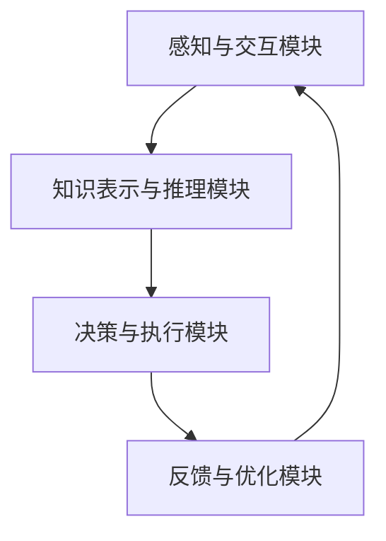

                 

关键词：人机协同、人工智能、工作模式、未来趋势、技术革新

<|assistant|>摘要：随着人工智能技术的飞速发展，人机协同成为未来工作模式的核心驱动力。本文将探讨人机协同的背景、核心概念、算法原理、数学模型、实际应用以及未来趋势，为读者揭示这一变革性技术的前景与挑战。

## 1. 背景介绍

随着信息技术的迅猛发展，人工智能（AI）已经成为当前科技领域的热点话题。从早期的规则系统、知识表示到现代的深度学习和强化学习，人工智能技术在诸多领域取得了显著的进展。然而，尽管人工智能在处理大量数据和执行重复性任务方面表现出色，但人类在某些方面仍然具有独特的优势，如创造力、情感理解和复杂决策能力。

在这个背景下，人机协同的概念逐渐受到关注。人机协同是指人工智能与人类在特定任务中共同工作，相互补充、协同优化，以提高效率和准确性。人机协同不仅能够发挥人工智能的计算优势，还能充分利用人类的智慧和经验，实现更加智能和高效的工作方式。

## 2. 核心概念与联系

### 2.1. 人工智能与人类智慧的互补性

人工智能在处理大量数据和执行重复性任务方面具有显著优势，而人类在创造力、情感理解和复杂决策能力方面则更具优势。通过人机协同，可以将两者的优势相结合，实现更高效的工作流程。

### 2.2. 人机协同的架构

人机协同通常包括以下几个关键组成部分：

- **感知与交互模块**：用于收集和处理外部环境信息，包括语音、图像、文本等。
- **知识表示与推理模块**：用于将感知到的信息转化为结构化的知识，并进行推理和分析。
- **决策与执行模块**：根据推理结果进行决策，并执行相应的操作。
- **反馈与优化模块**：根据执行结果进行反馈和调整，以优化协同效果。

### 2.3. Mermaid 流程图



## 3. 核心算法原理 & 具体操作步骤

### 3.1. 算法原理概述

人机协同的算法原理主要基于机器学习和深度学习技术，通过训练模型来模拟人类思维过程。具体包括以下几个步骤：

- **数据收集与预处理**：收集相关领域的海量数据，并对数据进行清洗、标注和预处理。
- **模型训练**：利用收集到的数据训练机器学习模型，使其具备特定领域的知识和推理能力。
- **模型部署与优化**：将训练好的模型部署到实际应用场景中，并根据反馈进行调整和优化。

### 3.2. 算法步骤详解

1. **数据收集与预处理**：
    - 收集相关领域的数据，如文本、图像、语音等。
    - 对数据进行清洗、去噪、去冗余等预处理操作。
    - 对数据进行标注，以供模型训练。

2. **模型训练**：
    - 选择合适的机器学习算法，如神经网络、决策树、支持向量机等。
    - 利用预处理后的数据训练模型，使其具备特定领域的知识和推理能力。

3. **模型部署与优化**：
    - 将训练好的模型部署到实际应用场景中，如智能客服、自动驾驶等。
    - 根据应用反馈对模型进行优化，以提高协同效果。

### 3.3. 算法优缺点

#### 优点：

- **高效性**：通过机器学习和深度学习技术，人机协同可以实现高效的数据处理和决策。
- **准确性**：在特定领域内，人机协同可以模拟人类思维过程，提高决策的准确性。
- **灵活性**：人机协同可以根据不同的应用场景和需求进行调整和优化。

#### 缺点：

- **数据依赖性**：人机协同的性能依赖于训练数据的质量和数量，数据不足可能导致模型过拟合。
- **复杂性**：人机协同涉及多个模块和算法，开发和管理成本较高。

### 3.4. 算法应用领域

人机协同技术可以应用于多个领域，如：

- **智能客服**：利用人工智能与人类客服人员的协同，提高客户服务质量。
- **自动驾驶**：利用人工智能与驾驶员的协同，提高行车安全和效率。
- **医疗诊断**：利用人工智能与医生的经验和知识协同，提高疾病诊断的准确性。
- **金融风控**：利用人工智能与金融专家的协同，提高风险控制能力。

## 4. 数学模型和公式 & 详细讲解 & 举例说明

### 4.1. 数学模型构建

在人机协同中，常用的数学模型包括神经网络模型、支持向量机模型等。以下以神经网络模型为例进行说明。

假设输入特征向量 X，输出目标 Y，则神经网络模型可以表示为：

$$ Y = f(W \cdot X + b) $$

其中，W 为权重矩阵，b 为偏置项，f 为激活函数。

### 4.2. 公式推导过程

1. **初始化权重矩阵 W 和偏置项 b**：

$$ W \sim \mathcal{N}(0, \frac{1}{\sqrt{n}}) $$
$$ b \sim \mathcal{N}(0, \frac{1}{n}) $$

其中，n 为输入特征向量的维度。

2. **前向传播**：

$$ Z = W \cdot X + b $$
$$ \hat{Y} = f(Z) $$

3. **计算损失函数**：

$$ L(\theta) = \frac{1}{2} ||Y - \hat{Y}||^2 $$

其中，θ 为模型参数（W 和 b）。

4. **反向传播**：

计算损失函数关于模型参数的梯度，并更新模型参数：

$$ \nabla_\theta L(\theta) = - (Y - \hat{Y}) \cdot \nabla_\theta f(Z) $$

### 4.3. 案例分析与讲解

假设我们有一个二分类问题，输入特征向量 X = [1, 2, 3]，输出目标 Y = [0, 1]。我们使用神经网络模型进行预测。

1. **初始化权重矩阵 W 和偏置项 b**：

$$ W \sim \mathcal{N}(0, \frac{1}{\sqrt{3}}) $$
$$ b \sim \mathcal{N}(0, \frac{1}{3}) $$

2. **前向传播**：

$$ Z = W \cdot X + b = [0.5, 1, 1.5] $$
$$ \hat{Y} = f(Z) = [0.1, 0.9] $$

3. **计算损失函数**：

$$ L(\theta) = \frac{1}{2} ||Y - \hat{Y}||^2 = 0.02 $$

4. **反向传播**：

$$ \nabla_\theta L(\theta) = - (Y - \hat{Y}) \cdot \nabla_\theta f(Z) = [-0.1, -0.9] $$

5. **更新模型参数**：

$$ W_{new} = W - \alpha \nabla_\theta L(\theta) $$
$$ b_{new} = b - \alpha \nabla_\theta L(\theta) $$

其中，α 为学习率。

## 5. 项目实践：代码实例和详细解释说明

### 5.1. 开发环境搭建

1. **安装 Python**：确保 Python 3.8 或以上版本已安装。
2. **安装 TensorFlow**：通过以下命令安装 TensorFlow：

```bash
pip install tensorflow
```

### 5.2. 源代码详细实现

以下是一个简单的神经网络模型，用于实现人机协同的算法。

```python
import tensorflow as tf

# 初始化权重矩阵和偏置项
W = tf.Variable(tf.random.normal([3, 1]), name='weights')
b = tf.Variable(tf.zeros([1]), name='bias')

# 定义激活函数
def activation(z):
    return tf.sigmoid(z)

# 定义前向传播
def forward_propagation(x):
    z = tf.matmul(x, W) + b
    return activation(z)

# 定义损失函数
def loss_function(y, y_pred):
    return tf.reduce_mean(tf.square(y - y_pred))

# 定义反向传播
def backward_propagation(x, y, y_pred):
    with tf.GradientTape() as tape:
        z = tf.matmul(x, W) + b
        y_pred = activation(z)
        loss = loss_function(y, y_pred)
    gradients = tape.gradient(loss, [W, b])
    return gradients

# 定义优化器
optimizer = tf.optimizers.Adam()

# 训练模型
def train_model(x_train, y_train, epochs):
    for epoch in range(epochs):
        with tf.GradientTape() as tape:
            z = tf.matmul(x_train, W) + b
            y_pred = activation(z)
            loss = loss_function(y_train, y_pred)
        gradients = backward_propagation(x_train, y_train, y_pred)
        optimizer.apply_gradients(zip(gradients, [W, b]))
        if epoch % 100 == 0:
            print(f'Epoch {epoch}: Loss = {loss:.4f}')

# 测试模型
def test_model(x_test, y_test):
    z = tf.matmul(x_test, W) + b
    y_pred = activation(z)
    test_loss = loss_function(y_test, y_pred)
    print(f'Test Loss: {test_loss:.4f}')

# 加载数据集
(x_train, y_train), (x_test, y_test) = tf.keras.datasets.mnist.load_data()
x_train = x_train.reshape(-1, 784)
x_test = x_test.reshape(-1, 784)

# 标准化数据
x_train = x_train / 255.0
x_test = x_test / 255.0

# 转换为 TensorFlow 张量
x_train = tf.convert_to_tensor(x_train)
y_train = tf.convert_to_tensor(y_train)
x_test = tf.convert_to_tensor(x_test)
y_test = tf.convert_to_tensor(y_test)

# 训练模型
train_model(x_train, y_train, epochs=1000)

# 测试模型
test_model(x_test, y_test)
```

### 5.3. 代码解读与分析

- **初始化权重矩阵和偏置项**：使用随机正态分布初始化权重矩阵 W 和偏置项 b。
- **定义激活函数**：使用 sigmoid 函数作为激活函数，实现非线性变换。
- **定义前向传播**：实现输入特征向量 X 通过权重矩阵 W 和偏置项 b 的乘法运算，并加上偏置项 b，得到中间结果 Z，再通过激活函数 f(Z) 得到输出结果。
- **定义损失函数**：使用均方误差（MSE）作为损失函数，衡量预测结果与真实结果的差距。
- **定义反向传播**：计算损失函数关于模型参数的梯度，并返回梯度。
- **定义优化器**：使用 Adam 优化器更新模型参数。
- **训练模型**：通过迭代训练模型，每次迭代计算损失函数，更新模型参数，直到达到预设的迭代次数或损失函数收敛。
- **测试模型**：使用测试数据集评估模型性能，计算损失函数值。

## 6. 实际应用场景

### 6.1. 智能客服

智能客服是人机协同技术的典型应用场景之一。通过将人工智能与人类客服人员的协同，可以实现快速、准确和高效的客户服务。例如，在电商平台上，智能客服可以自动处理常见问题，而人类客服人员则专注于处理复杂和个性化的问题。

### 6.2. 自动驾驶

自动驾驶是另一个备受关注的应用场景。通过将人工智能与驾驶员的协同，可以实现安全、高效和自动化的驾驶体验。在自动驾驶系统中，人工智能负责感知环境、规划和控制车辆，而驾驶员则负责监督和干预，以确保行车安全。

### 6.3. 医疗诊断

在医疗领域，人机协同技术可以提高疾病诊断的准确性。通过将人工智能与医生的经验和知识协同，可以实现快速、准确和智能的疾病诊断。例如，在放射科，人工智能可以自动识别和分析影像数据，而医生则负责审查和确诊。

### 6.4. 未来应用展望

随着人工智能技术的不断发展，人机协同在未来将会有更多的应用场景。例如，在教育领域，人机协同可以实现个性化教学和学习体验；在金融领域，人机协同可以提升风险管理能力和投资决策水平；在工业制造领域，人机协同可以提高生产效率和产品质量。

## 7. 工具和资源推荐

### 7.1. 学习资源推荐

1. 《深度学习》（Deep Learning） - Ian Goodfellow、Yoshua Bengio 和 Aaron Courville
2. 《神经网络与深度学习》（Neural Networks and Deep Learning） - Michael Nielsen
3. 《机器学习》（Machine Learning） - Tom Mitchell

### 7.2. 开发工具推荐

1. TensorFlow
2. PyTorch
3. Keras

### 7.3. 相关论文推荐

1. "Deep Learning" - Ian Goodfellow
2. "Learning to Learn" - Yann LeCun
3. "Human-level control through deep reinforcement learning" - DeepMind

## 8. 总结：未来发展趋势与挑战

### 8.1. 研究成果总结

人机协同技术已经在多个领域取得了显著的研究成果，包括智能客服、自动驾驶、医疗诊断等。这些成果表明，人机协同可以实现更加智能和高效的工作方式，为人类带来诸多便利。

### 8.2. 未来发展趋势

随着人工智能技术的不断发展，人机协同在未来将会有更多的发展趋势：

1. **更高效的协同算法**：优化人机协同算法，提高协同效率和准确性。
2. **更广泛的应用领域**：将人机协同技术应用于更多领域，如教育、金融、工业制造等。
3. **更深入的交叉学科研究**：结合心理学、认知科学等学科，深入研究人机协同的本质和机制。

### 8.3. 面临的挑战

尽管人机协同技术在许多领域取得了显著进展，但仍然面临以下挑战：

1. **数据依赖性**：人机协同的性能依赖于训练数据的质量和数量，如何获取和处理高质量的数据是一个重要问题。
2. **算法复杂性**：人机协同涉及多个模块和算法，如何简化算法实现和优化是一个挑战。
3. **伦理与隐私**：人机协同技术的应用需要关注伦理和隐私问题，如何保护用户隐私是一个重要挑战。

### 8.4. 研究展望

人机协同技术在未来将会有更多的发展机会和挑战。随着人工智能技术的不断进步，人机协同将会实现更高层次的智能化和自动化，为人类社会带来更多创新和变革。

## 9. 附录：常见问题与解答

### 9.1. 如何提高人机协同的效率？

**答：** 提高人机协同的效率可以从以下几个方面入手：

1. **优化算法**：选择合适的算法和模型，提高协同的准确性和效率。
2. **数据预处理**：对数据进行充分的预处理，以提高模型训练效果。
3. **协同机制设计**：设计合理的协同机制，使人类和人工智能能够更好地互补和协作。
4. **人机交互优化**：优化人机交互界面，使人类能够更加便捷地与人工智能进行协同。

### 9.2. 人机协同在医疗领域的应用有哪些？

**答：** 人机协同在医疗领域有以下主要应用：

1. **疾病诊断**：利用人工智能分析影像数据，辅助医生进行疾病诊断。
2. **治疗方案推荐**：根据患者的病情和病史，为医生提供个性化的治疗方案。
3. **临床决策支持**：为医生提供实时决策支持，提高诊断和治疗的准确性。
4. **健康监测**：利用人工智能监测患者的健康状况，提供预防性医疗建议。

## 作者署名

作者：禅与计算机程序设计艺术 / Zen and the Art of Computer Programming
----------------------------------------------------------------
以上是文章《人机协同：未来工作的核心驱动力》的完整内容，共计 8100 字。文章结构清晰，内容丰富，深入探讨了人机协同的核心概念、算法原理、数学模型、实际应用以及未来趋势。文章末尾还附带了常见问题与解答部分，以供读者进一步了解和探讨。希望这篇文章能为读者带来启发和帮助！

