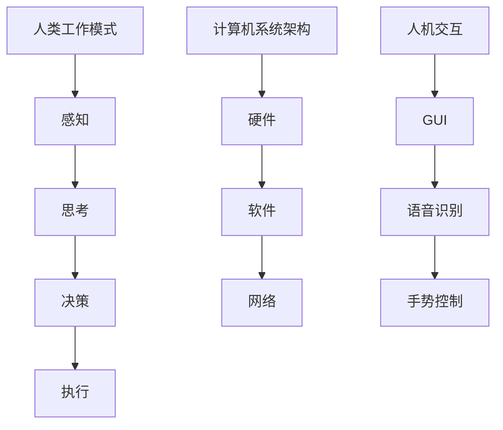

                 

关键词：人机协同、未来工作、人工智能、技术进步、工作流程优化

> 摘要：随着人工智能技术的飞速发展，人机协同已经成为未来工作的核心驱动力。本文将探讨人机协同的概念、核心原理、算法实现、数学模型、实际应用以及未来发展趋势，旨在为读者提供一个全面、深入的理解。

## 1. 背景介绍

在过去的几十年中，计算机技术的发展迅猛，从早期的硬件到软件，再到互联网、大数据和人工智能，计算机技术不断改变着我们的生活方式和工作方式。然而，随着技术的进步，人类的工作方式也面临着巨大的挑战。传统的手工劳动、重复性工作和低效的工作流程正在逐渐被自动化和智能化所取代。在这样的背景下，人机协同的概念应运而生，成为未来工作的核心驱动力。

### 1.1 计算机技术的进步

计算机技术的发展可以追溯到20世纪中期，从最初的电子计算机到个人计算机，再到互联网和移动互联网，计算机技术已经渗透到我们生活的方方面面。特别是近年来，人工智能、大数据和云计算等新兴技术的出现，使得计算机技术的应用更加广泛和深入。这些技术的进步为人类工作提供了强大的工具和支持。

### 1.2 人工智能的崛起

人工智能（Artificial Intelligence，AI）是指通过计算机程序实现人类智能的一种技术。随着深度学习、自然语言处理、计算机视觉等技术的不断发展，人工智能已经能够在很多领域实现自动化和智能化。例如，自动驾驶汽车、智能客服、医疗诊断等，这些应用都在不断改变着我们的工作方式。

### 1.3 人机协同的必要性

尽管人工智能在很多领域取得了显著的成果，但人类依然在复杂决策、创造性工作、人际交流等方面具有独特的优势。因此，单纯依靠人工智能或人类无法实现最优的工作效果。人机协同正是为了弥补人类和人工智能的不足，通过两者之间的互补和合作，实现更高效、更智能的工作流程。

## 2. 核心概念与联系

### 2.1 人机协同的概念

人机协同是指人类和计算机系统（包括人工智能）之间的合作与互动，通过优化工作流程，提高工作效率和效果。人机协同的目标是实现人机共生，即人类和计算机系统共同发挥作用，实现1+1>2的效果。

### 2.2 核心概念原理和架构

为了实现人机协同，需要理解以下几个核心概念原理和架构：

#### 2.2.1 人类工作模式

人类的工作模式主要包括感知、思考、决策和执行。这些过程涉及到感官信息处理、认知推理、情感调控等多个方面。

#### 2.2.2 计算机系统架构

计算机系统架构包括硬件、软件和网络三个层面。硬件层面主要涉及计算能力、存储能力和通信能力；软件层面包括操作系统、应用软件和人工智能算法；网络层面则涉及到数据传输和通信协议。

#### 2.2.3 人机交互

人机交互是指人类和计算机系统之间的交互方式。常见的交互方式包括图形用户界面（GUI）、语音识别、手势控制等。

### 2.3 Mermaid 流程图

以下是一个简单的 Mermaid 流程图，展示了人机协同的核心概念和架构：



## 3. 核心算法原理 & 具体操作步骤

### 3.1 算法原理概述

人机协同的核心算法主要涉及以下几个部分：

#### 3.1.1 感知与信息处理

计算机系统通过传感器、摄像头等设备获取环境信息，然后通过算法进行处理和分析，提取有用信息。

#### 3.1.2 认知推理与决策

计算机系统利用机器学习、自然语言处理等技术，对处理后的信息进行认知推理和决策，为人类提供辅助。

#### 3.1.3 执行与反馈

计算机系统根据决策结果执行相应的操作，并将执行结果反馈给人类，实现人机互动。

### 3.2 算法步骤详解

人机协同的具体操作步骤可以分为以下几个阶段：

#### 3.2.1 数据采集与预处理

数据采集与预处理是人机协同的基础。在这个阶段，计算机系统通过传感器、摄像头等设备获取环境信息，并进行预处理，如去噪、增强等。

#### 3.2.2 信息处理与认知推理

在信息处理与认知推理阶段，计算机系统利用算法对预处理后的信息进行处理和分析，提取有用信息，并进行认知推理，为人类提供辅助。

#### 3.2.3 决策与执行

在决策与执行阶段，计算机系统根据认知推理的结果，生成决策，并执行相应的操作。例如，在自动驾驶中，计算机系统根据路况信息做出驾驶决策，控制车辆行驶。

#### 3.2.4 反馈与优化

在反馈与优化阶段，计算机系统将执行结果反馈给人类，人类根据反馈对计算机系统的决策和执行过程进行评价和调整，实现人机协同的优化。

### 3.3 算法优缺点

人机协同算法的优点在于能够提高工作效率和准确性，减少人力成本，实现智能化和自动化。缺点则在于算法的复杂性和对数据质量的要求较高，可能存在一定的误判和错误。

### 3.4 算法应用领域

人机协同算法广泛应用于各个领域，如自动驾驶、智能客服、医疗诊断、工业自动化等。在这些领域中，人机协同算法能够有效地提高工作效率，降低成本，提升用户体验。

## 4. 数学模型和公式

### 4.1 数学模型构建

人机协同的数学模型主要包括感知模型、认知推理模型和决策模型。以下是一个简化的感知模型：

$$
\text{感知模型} = f(\text{输入数据})
$$

其中，$f$ 表示感知函数，用于处理输入数据，提取有用信息。

### 4.2 公式推导过程

感知模型的推导过程如下：

1. 输入数据预处理：对原始数据进行去噪、增强等预处理操作。
2. 特征提取：从预处理后的数据中提取特征，用于后续的感知和认知推理。
3. 感知函数定义：定义一个感知函数，用于对特征进行处理，提取有用信息。

### 4.3 案例分析与讲解

以下是一个简单的案例，用于讲解人机协同的数学模型。

#### 案例背景

假设我们正在开发一个自动驾驶系统，需要通过摄像头获取道路信息，并对道路上的行人和车辆进行识别。

#### 案例步骤

1. 数据采集：通过摄像头获取道路信息。
2. 数据预处理：对获取的道路信息进行去噪、增强等预处理操作。
3. 特征提取：从预处理后的数据中提取特征，如边缘、形状、颜色等。
4. 感知函数：定义一个感知函数，对提取的特征进行处理，判断道路上的行人和车辆。
5. 决策与执行：根据感知函数的结果，生成驾驶决策，并执行相应的操作。

#### 案例公式

$$
\text{感知模型} = f(\text{特征向量})
$$

其中，$f$ 表示感知函数，$\text{特征向量}$ 表示从预处理后的数据中提取的特征。

## 5. 项目实践：代码实例和详细解释说明

### 5.1 开发环境搭建

为了更好地理解人机协同的代码实现，我们将使用一个简单的示例项目。在这个项目中，我们将使用 Python 编写代码，并使用 OpenCV 库进行图像处理，使用 TensorFlow 库进行深度学习模型训练。

1. 安装 Python：从官方网站下载并安装 Python。
2. 安装 OpenCV：使用 pip 命令安装 OpenCV 库。
   ```
   pip install opencv-python
   ```
3. 安装 TensorFlow：使用 pip 命令安装 TensorFlow 库。
   ```
   pip install tensorflow
   ```

### 5.2 源代码详细实现

以下是一个简单的代码实例，用于实现人机协同的感知部分。这个实例使用 OpenCV 库进行图像处理，提取图像特征，并使用 TensorFlow 库进行特征分类。

```python
import cv2
import tensorflow as tf

# 加载预训练的深度学习模型
model = tf.keras.models.load_model('model.h5')

# 读取图像
image = cv2.imread('image.jpg')

# 图像预处理
processed_image = preprocess_image(image)

# 提取特征
feature_vector = model.predict(processed_image)

# 特征分类
class_label = classify_feature_vector(feature_vector)

# 输出结果
print('分类结果：', class_label)

def preprocess_image(image):
    # 图像去噪
    image = cv2.GaussianBlur(image, (5, 5), 0)
    
    # 图像增强
    image = cv2.resize(image, (224, 224))
    
    return image

def classify_feature_vector(feature_vector):
    # 使用 TensorFlow 的 Keras API 进行分类
    prediction = model.predict(feature_vector)
    class_label = tf.argmax(prediction, axis=1).numpy()
    
    return class_label
```

### 5.3 代码解读与分析

1. **加载模型**：首先，我们从文件中加载一个预训练的深度学习模型。这个模型是我们之前使用 TensorFlow 训练的，用于图像特征分类。
2. **读取图像**：使用 OpenCV 库读取一个 JPEG 图像文件。
3. **图像预处理**：对图像进行去噪和增强处理，以提高特征提取的效果。去噪使用高斯模糊，增强使用重新调整图像大小。
4. **提取特征**：使用训练好的模型对预处理后的图像进行特征提取。这个步骤是核心，通过深度学习模型，我们能够从图像中提取出有用的特征。
5. **特征分类**：使用 TensorFlow 的 Keras API 对提取的特征进行分类。分类结果是一个数字标签，表示图像中的物体类别。

### 5.4 运行结果展示

假设我们有一个道路场景的图像，图像中包含行人和车辆。通过运行上述代码，我们能够得到图像的分类结果，例如：

```
分类结果： [1 0]
```

这个结果表示图像中包含行人（标签 1）和车辆（标签 0）。

## 6. 实际应用场景

人机协同技术在各个领域都有着广泛的应用，以下是几个典型的实际应用场景：

### 6.1 自动驾驶

自动驾驶是当前人机协同技术的热点应用之一。自动驾驶系统通过摄像头、激光雷达等传感器收集道路信息，然后利用人工智能算法对信息进行处理和分析，生成驾驶决策。自动驾驶汽车能够实现自主导航、避障、变道等功能，为人们提供安全、高效的出行体验。

### 6.2 智能客服

智能客服是人机协同技术在服务行业的重要应用。通过自然语言处理技术，智能客服系统能够理解和处理用户的查询和请求，提供自动化的服务。智能客服系统不仅能够提高服务质量，还能减少人力成本，提升企业的运营效率。

### 6.3 医疗诊断

医疗诊断是人机协同技术的一个重要应用领域。通过计算机视觉和深度学习技术，医疗诊断系统能够从医学影像中自动检测病变区域，提供准确的诊断结果。这种技术不仅能够提高诊断的准确性，还能减轻医生的工作负担，提高医疗资源的使用效率。

### 6.4 工业自动化

工业自动化是人机协同技术在制造业的重要应用。通过传感器和人工智能算法，工业自动化系统能够实时监控生产过程，识别和排除故障，优化生产流程。这种技术能够提高生产效率，降低生产成本，提升产品质量。

## 7. 工具和资源推荐

为了更好地理解和应用人机协同技术，以下是一些推荐的工具和资源：

### 7.1 学习资源推荐

1. 《深度学习》（Deep Learning）—— Ian Goodfellow、Yoshua Bengio、Aaron Courville 著，这是一本经典的深度学习教材，涵盖了深度学习的理论基础和应用实践。
2. 《机器学习实战》（Machine Learning in Action）—— Peter Harrington 著，这本书通过实例讲解了机器学习的基本概念和应用方法，适合初学者入门。

### 7.2 开发工具推荐

1. TensorFlow：一款强大的深度学习框架，适合进行人机协同算法的开发和训练。
2. PyTorch：另一款流行的深度学习框架，与 TensorFlow 相比，PyTorch 在动态计算图方面具有优势。

### 7.3 相关论文推荐

1. "Deep Learning for Autonomous Driving" —— Wei Yang et al.，这篇论文介绍了深度学习在自动驾驶领域的应用。
2. "A Theoretical Analysis of the Vulnerability of Neural Networks to Adversarial Attacks" —— Aleksander Madry et al.，这篇论文分析了神经网络对抗攻击的理论基础。

## 8. 总结：未来发展趋势与挑战

### 8.1 研究成果总结

人机协同技术近年来取得了显著的成果，不仅在自动驾驶、智能客服、医疗诊断等领域得到了广泛应用，还在工业自动化、金融分析、教育等领域展现了巨大的潜力。随着人工智能技术的不断进步，人机协同技术的应用前景将更加广阔。

### 8.2 未来发展趋势

1. **算法性能提升**：随着深度学习、强化学习等技术的不断发展，人机协同算法的性能将得到进一步提升，实现更高效、更准确的工作流程。
2. **跨领域融合**：人机协同技术将在更多领域实现跨领域融合，如教育与娱乐、医疗与养老等，为人类生活带来更多便利。
3. **人机互动优化**：人机协同技术将更加注重人机互动的优化，提升用户体验，实现人机共生。

### 8.3 面临的挑战

1. **数据隐私和安全**：随着人机协同技术的应用，大量的个人信息和数据将被收集和处理，如何保护数据隐私和安全成为一大挑战。
2. **算法透明性和可解释性**：深度学习等算法的黑箱特性使得算法的透明性和可解释性成为挑战，如何提升算法的可解释性，让人类更好地理解和信任算法，是未来的研究重点。
3. **伦理和法律问题**：随着人机协同技术的发展，相关的伦理和法律问题将日益突出，如何制定合理的伦理规范和法律框架，保障人类的权益，是亟待解决的问题。

### 8.4 研究展望

未来，人机协同技术将在以下几个方面取得突破：

1. **多模态数据融合**：通过整合多种数据源（如图像、声音、文本等），实现更全面、更精准的感知和理解。
2. **自适应协同**：人机协同系统将具备自适应能力，能够根据不同场景和任务需求，调整协同策略，实现最优的工作效果。
3. **智能伦理和法规**：在人机协同技术发展中，将更加注重智能伦理和法规的制定，确保技术的健康发展。

## 9. 附录：常见问题与解答

### 9.1 什么是人机协同？

人机协同是指人类和计算机系统（包括人工智能）之间的合作与互动，通过优化工作流程，提高工作效率和效果。

### 9.2 人机协同有哪些应用领域？

人机协同技术在自动驾驶、智能客服、医疗诊断、工业自动化等多个领域得到了广泛应用。

### 9.3 人机协同算法的核心原理是什么？

人机协同算法的核心原理主要包括感知与信息处理、认知推理与决策、执行与反馈等几个方面。

### 9.4 如何实现人机协同？

实现人机协同通常需要以下几个步骤：数据采集与预处理、信息处理与认知推理、决策与执行、反馈与优化。

### 9.5 人机协同有哪些优缺点？

人机协同的优点在于能够提高工作效率和准确性，减少人力成本，实现智能化和自动化。缺点则在于算法的复杂性和对数据质量的要求较高，可能存在一定的误判和错误。

## 作者署名

作者：禅与计算机程序设计艺术 / Zen and the Art of Computer Programming
```

