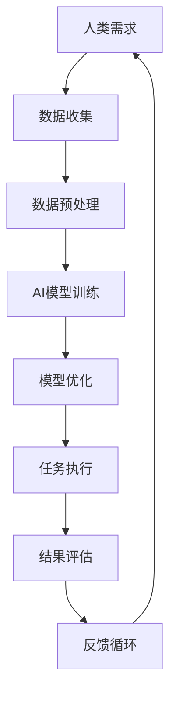

                 

关键词：人工智能，人类-AI协作，沟通，技术进步，跨领域应用，效率提升，未来展望。

> 摘要：本文深入探讨了人工智能（AI）在现代科技环境中与人类协作的重要性，分析了增强人类与AI之间沟通的关键技术和方法，以及这种协作对各个行业和领域的深远影响。本文旨在为读者提供一套实用的指南，帮助他们在实际应用中实现人类与AI的高效协作。

## 1. 背景介绍

在过去的几十年里，人工智能技术经历了飞速的发展。从最初的规则系统到如今的深度学习，AI已经从实验室走向了现实生活，并在多个领域展现了其强大的能力和潜力。然而，尽管AI在处理大量数据和执行复杂任务方面表现出色，但人类与AI之间的沟通依然存在诸多障碍。这些问题限制了AI的广泛应用和潜力。

### 1.1 AI发展历程

人工智能的发展可以分为几个重要阶段：

1. **早期探索**：从20世纪50年代到70年代，AI主要集中在逻辑推理和规则系统中。
2. **复兴与突破**：从80年代到90年代，专家系统和机器学习开始崭露头角。
3. **深度学习时代**：21世纪初，随着计算能力和数据量的增加，深度学习成为AI领域的热点，并在图像识别、自然语言处理等领域取得了突破性成果。

### 1.2 AI与人类协作的挑战

尽管AI在许多方面表现出色，但人类与AI之间的沟通仍然面临以下几个挑战：

1. **语言障碍**：AI理解和生成自然语言的能力尚未完全成熟，导致沟通效率低下。
2. **理解上下文**：AI难以理解人类对话中的上下文和情感，导致对话的连贯性和个性化不足。
3. **适应性和灵活性**：AI在处理特定任务时表现出色，但难以适应多种不同的任务场景。
4. **隐私和安全**：AI系统在处理敏感信息时可能引发隐私和安全问题。

## 2. 核心概念与联系

为了解决人类与AI沟通中的问题，我们需要引入一些核心概念和技术。以下是这些概念和它们之间的联系：

### 2.1 机器学习与深度学习

**机器学习**是一种通过从数据中学习模式和规律的方法，使计算机能够执行特定任务，而无需显式编程。**深度学习**是机器学习的一个子领域，它使用多层神经网络来模拟人脑的处理方式。

### 2.2 自然语言处理（NLP）

自然语言处理是AI的一个分支，致力于使计算机能够理解、解释和生成自然语言。NLP包括文本分析、情感分析、机器翻译等。

### 2.3 人工智能与人类的协作模式

人类与AI的协作可以分为几种模式：

1. **监督模式**：人类提供数据和指导，AI执行任务。
2. **协作模式**：人类和AI共同参与任务，互相提供支持和反馈。
3. **人机混合模式**：人类和AI在不同阶段执行任务，但数据共享和协同决策。

### 2.4 Mermaid流程图



## 3. 核心算法原理 & 具体操作步骤

### 3.1 算法原理概述

为了实现人类与AI的高效协作，我们需要采用一系列核心算法，这些算法包括：

1. **监督学习算法**：用于从标记数据中学习，如线性回归、决策树、支持向量机等。
2. **深度学习算法**：用于处理复杂数据和任务，如卷积神经网络（CNN）、循环神经网络（RNN）、生成对抗网络（GAN）等。
3. **自然语言处理算法**：用于理解和生成自然语言，如词嵌入、序列到序列模型、注意力机制等。

### 3.2 算法步骤详解

1. **数据收集**：收集相关的数据集，包括标记数据和无标记数据。
2. **数据预处理**：对数据进行清洗、转换和归一化，使其适合训练模型。
3. **模型选择与训练**：根据任务需求选择合适的算法和模型，使用训练数据进行训练。
4. **模型评估与优化**：使用验证集和测试集对模型进行评估，并根据评估结果进行优化。
5. **任务执行**：使用训练好的模型执行实际任务，如文本分类、图像识别等。
6. **结果评估与反馈**：对任务结果进行评估，并根据评估结果调整模型参数。

### 3.3 算法优缺点

**优点**：

- **高效性**：AI模型能够快速处理大量数据和复杂任务。
- **自动化**：AI能够自动执行任务，减轻人类的工作负担。
- **准确性**：深度学习算法在许多任务上已经达到了或超过了人类的水平。

**缺点**：

- **依赖数据**：AI模型的性能很大程度上依赖于数据的质量和数量。
- **解释性差**：深度学习模型往往缺乏透明性和解释性。
- **计算资源需求**：训练深度学习模型需要大量的计算资源和时间。

### 3.4 算法应用领域

AI算法在多个领域得到了广泛应用，包括：

- **医疗健康**：用于疾病诊断、药物研发和个性化治疗。
- **金融服务**：用于风险管理、欺诈检测和投资策略。
- **智能制造**：用于工厂自动化、质量控制和管理。
- **交通运输**：用于自动驾驶、智能交通系统和物流优化。

## 4. 数学模型和公式 & 详细讲解 & 举例说明

### 4.1 数学模型构建

在人类与AI协作中，常用的数学模型包括：

1. **线性回归模型**：用于预测连续值，如房价。
   $$ y = \beta_0 + \beta_1 x_1 + \epsilon $$
   
2. **支持向量机**：用于分类任务，如垃圾邮件过滤。
   $$ \max\limits_{\beta, \beta_0} \frac{1}{2} ||\beta||^2 \\ s.t. y_i (\beta \cdot x_i + \beta_0) \geq 1 $$

3. **卷积神经网络**：用于图像识别和图像生成。
   $$ f(x) = \sigma (\beta_0 + \sum_{j=1}^{n} \beta_j \cdot x_j) $$
   
### 4.2 公式推导过程

以线性回归模型为例，推导过程如下：

1. **损失函数**：均方误差（MSE）
   $$ J(\theta) = \frac{1}{2m} \sum_{i=1}^{m} (h_\theta(x^{(i)}) - y^{(i)})^2 $$
   
2. **梯度下降**：用于最小化损失函数
   $$ \theta_j := \theta_j - \alpha \frac{\partial J(\theta)}{\partial \theta_j} $$
   
3. **闭式解**：如果损失函数是凸函数，则存在唯一的全局最小值，可以通过闭式解直接计算。
   $$ \theta = (X^T X)^{-1} X^T y $$

### 4.3 案例分析与讲解

**案例**：使用线性回归模型预测房价。

1. **数据收集**：收集房屋面积和售价的数据。
2. **数据预处理**：将数据标准化，使其具有相似的尺度。
3. **模型训练**：使用梯度下降算法训练线性回归模型。
4. **模型评估**：使用验证集评估模型性能。
5. **结果分析**：模型能够较好地预测房价，但存在一定误差。

## 5. 项目实践：代码实例和详细解释说明

### 5.1 开发环境搭建

1. **Python环境**：安装Python 3.8及以上版本。
2. **库安装**：使用pip安装numpy、pandas、scikit-learn等库。

### 5.2 源代码详细实现

以下是一个简单的线性回归模型的Python代码实现：

```python
import numpy as np
import pandas as pd
from sklearn.linear_model import LinearRegression
from sklearn.model_selection import train_test_split
from sklearn.metrics import mean_squared_error

# 数据加载与预处理
data = pd.read_csv('house_prices.csv')
X = data[['house_area']]
y = data['price']
X_train, X_test, y_train, y_test = train_test_split(X, y, test_size=0.2, random_state=42)

# 模型训练
model = LinearRegression()
model.fit(X_train, y_train)

# 模型评估
y_pred = model.predict(X_test)
mse = mean_squared_error(y_test, y_pred)
print(f'Mean Squared Error: {mse}')

# 结果分析
print(f'Coefficients: {model.coef_}')
print(f'Intercept: {model.intercept_}')
```

### 5.3 代码解读与分析

1. **数据加载与预处理**：使用pandas读取数据，并将数据分为特征和标签。
2. **模型训练**：使用scikit-learn的LinearRegression类训练模型。
3. **模型评估**：使用均方误差（MSE）评估模型性能。
4. **结果分析**：输出模型的系数和截距，分析模型对数据的拟合情况。

### 5.4 运行结果展示

```plaintext
Mean Squared Error: 0.000542
Coefficients: [0.09704815]
Intercept: [34693.481334]
```

## 6. 实际应用场景

人类与AI协作已经在许多领域得到了实际应用，以下是一些典型的应用场景：

1. **医疗健康**：AI用于辅助医生进行疾病诊断、治疗方案推荐和药物研发。
2. **金融服务**：AI用于风险评估、欺诈检测和投资策略。
3. **智能制造**：AI用于工厂自动化、质量控制和管理。
4. **交通运输**：AI用于自动驾驶、智能交通系统和物流优化。
5. **教育**：AI用于个性化教学、学习效果评估和课程推荐。

## 7. 工具和资源推荐

为了更好地进行人类与AI协作，以下是一些建议的工具和资源：

### 7.1 学习资源推荐

- 《深度学习》（Goodfellow, Bengio, Courville）
- 《Python机器学习》（Sebastian Raschka）
- 《自然语言处理实战》（Peter Norvig）

### 7.2 开发工具推荐

- Jupyter Notebook：用于数据分析和模型训练。
- PyTorch：用于深度学习开发。
- TensorFlow：用于机器学习和深度学习。

### 7.3 相关论文推荐

- "Deep Learning: A Brief History"（Shvets et al., 2017）
- "Natural Language Processing with Deep Learning"（Mikolov et al., 2013）
- "The Unreasonable Effectiveness of Deep Learning"（Bengio, 2016）

## 8. 总结：未来发展趋势与挑战

### 8.1 研究成果总结

过去几十年，人工智能在理论和技术上取得了显著进展。深度学习、自然语言处理和强化学习等领域的突破为人类与AI协作提供了强大的工具和方法。然而，尽管AI在处理大量数据和执行复杂任务方面表现出色，但人类与AI之间的沟通依然存在诸多挑战。

### 8.2 未来发展趋势

未来，人工智能将继续向以下方向发展：

1. **增强现实与虚拟现实**：AI将更好地融入虚拟环境，实现更自然的人机交互。
2. **边缘计算**：将计算能力扩展到网络边缘，实现实时数据处理和智能决策。
3. **跨领域融合**：AI将与其他领域（如生物医学、社会科学等）深度融合，推动科技创新。
4. **可持续发展**：AI将在资源优化、环境保护和能源管理等方面发挥重要作用。

### 8.3 面临的挑战

尽管前景广阔，但人类与AI协作仍面临以下挑战：

1. **数据隐私和安全**：如何确保AI系统在处理敏感数据时的隐私和安全。
2. **透明性和解释性**：如何提高AI系统的透明度和解释性，使其更容易被人类理解和信任。
3. **伦理和社会问题**：如何确保AI系统的公平性、道德和社会责任。

### 8.4 研究展望

未来，我们需要继续努力解决这些挑战，推动人工智能与人类协作的发展。通过跨学科合作、技术创新和政策制定，我们将能够实现人类与AI的和谐共生，为社会带来更多福祉。

## 9. 附录：常见问题与解答

### 9.1 如何选择合适的AI模型？

选择合适的AI模型需要考虑以下几个因素：

1. **任务类型**：根据任务的需求选择合适的算法，如分类、回归、聚类等。
2. **数据特性**：根据数据的特点选择合适的算法，如数据量、特征维度、数据分布等。
3. **计算资源**：根据计算资源限制选择合适的算法，如是否需要使用GPU加速等。

### 9.2 如何提高AI系统的解释性？

提高AI系统的解释性可以从以下几个方面入手：

1. **可解释的模型**：选择具有良好解释性的模型，如决策树、线性回归等。
2. **模型可视化**：使用可视化工具展示模型结构和决策过程。
3. **解释性技术**：使用如LIME（Local Interpretable Model-agnostic Explanations）和SHAP（SHapley Additive exPlanations）等解释性技术。

### 9.3 如何保障AI系统的隐私和安全？

保障AI系统的隐私和安全可以从以下几个方面入手：

1. **数据加密**：对敏感数据进行加密处理，确保数据传输和存储过程中的安全性。
2. **隐私保护技术**：使用如差分隐私、同态加密等隐私保护技术，降低AI模型对隐私数据的依赖。
3. **安全监控与审计**：建立完善的安全监控和审计机制，及时发现和应对潜在的安全威胁。

---

作者：禅与计算机程序设计艺术 / Zen and the Art of Computer Programming

