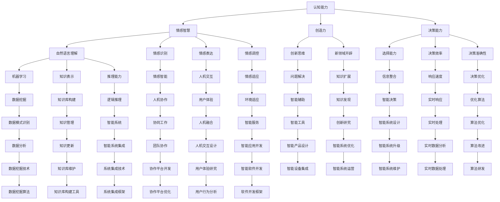

                 

关键词：人工智能、人类智力、协作、增强、智能协同、算法、数学模型、项目实践、应用场景、发展趋势、工具推荐

> 摘要：本文旨在探讨人类与人工智能协作的可能性，通过引入核心概念、算法原理、数学模型和实际项目实践，分析人类智力如何通过AI协作得到增强。本文还将讨论人工智能在各个领域的应用场景、未来发展趋势以及面临的挑战。

## 1. 背景介绍

随着人工智能技术的迅猛发展，人类面临着前所未有的机遇和挑战。AI已经深刻地影响了我们的生活方式、工作方式，甚至在决策和创造力方面。然而，尽管AI在处理复杂任务方面展现出强大的能力，但人类的直觉、情感和创造力仍然是不可替代的。因此，如何将人类与AI的优势结合起来，实现更好的协作，成为一个重要的研究方向。

人类-AI协作不仅能够提高工作效率，还能开拓新的领域，激发人类的创造力。例如，在医疗领域，AI可以辅助医生进行诊断，提高准确率，而医生的专业知识和经验则可以指导AI进行更合理的决策。在科学研究中，AI可以帮助分析大量数据，发现新的规律，但科学家则可以利用这些规律进行更深层次的研究。

本文将详细探讨人类与AI协作的原理、方法以及具体实现，旨在为读者提供一种新的视角，了解如何在日常生活中充分利用人工智能的优势，增强人类智力。

## 2. 核心概念与联系

为了更好地理解人类与AI协作的原理，我们首先需要介绍几个核心概念，包括人工智能的定义、协作的本质以及人类智力的构成。

### 2.1 人工智能

人工智能（Artificial Intelligence，简称AI）是指由人制造出来的系统所表现出来的智能行为。这些行为通常包括学习、推理、解决问题、自然语言理解、感知和自适应等。AI可以分为两类：弱AI和强AI。弱AI专注于特定的任务，如语音识别、图像分类等，而强AI则具备与人类相似的广泛认知能力。

### 2.2 协作

协作是指两个或多个个体或系统共同完成任务的过程。在人类-AI协作中，人类和AI各自发挥优势，共同解决问题。这种协作不仅能够提高工作效率，还能激发双方的潜力。

### 2.3 人类智力

人类智力包括多个方面，如认知能力、创造力、情感智慧和决策能力。认知能力涉及感知、记忆、注意力、语言理解和逻辑推理等。创造力则表现在创新思维和新领域开辟上。情感智慧则涉及情感识别、情感表达和情感调控。决策能力则是人类在复杂环境中进行选择和决策的能力。

下面是关于人类智力与AI协作的Mermaid流程图：



## 3. 核心算法原理 & 具体操作步骤

### 3.1 算法原理概述

人类-AI协作的核心在于如何将人类和AI的优势结合起来，实现更好的协作和优化。以下是几个关键算法原理：

- **强化学习**：通过试错和反馈，使AI在特定环境中进行自我优化。
- **深度学习**：利用多层神经网络，实现复杂模式的自动学习和识别。
- **自然语言处理**：使AI能够理解、生成和解释自然语言，实现人机交互。
- **知识图谱**：通过构建知识图谱，实现知识的结构化表示和关联。

### 3.2 算法步骤详解

以下是人类-AI协作的具体操作步骤：

1. **需求分析**：明确人类和AI需要协作解决的问题。
2. **算法选择**：根据需求选择合适的算法，如强化学习、深度学习等。
3. **数据准备**：收集和整理相关数据，进行预处理。
4. **模型训练**：利用训练数据，训练AI模型。
5. **模型评估**：对模型进行评估，确保其性能符合预期。
6. **协作优化**：根据评估结果，调整算法参数，优化协作效果。
7. **应用部署**：将优化后的模型部署到实际应用中。

### 3.3 算法优缺点

**强化学习**：
- 优点：能够通过自我优化，实现持续学习和改进。
- 缺点：需要大量数据和计算资源，且训练过程较长。

**深度学习**：
- 优点：能够自动学习复杂模式，提高识别和预测的准确性。
- 缺点：对数据量和计算资源要求较高，模型解释性较差。

**自然语言处理**：
- 优点：能够实现人机交互，提高沟通效率。
- 缺点：对语言的理解能力有限，存在误解和歧义。

**知识图谱**：
- 优点：能够实现知识的结构化表示和关联，提高知识利用效率。
- 缺点：构建和维护成本较高。

### 3.4 算法应用领域

人类-AI协作算法在各个领域都有广泛的应用：

- **医疗**：AI辅助医生进行诊断和治疗，提高医疗效率和质量。
- **金融**：AI进行风险评估、投资决策和客户服务，提高金融行业的竞争力。
- **教育**：AI辅助教学和个性化学习，提高教育质量和效率。
- **科研**：AI进行数据分析和模式识别，推动科学研究的进展。

## 4. 数学模型和公式 & 详细讲解 & 举例说明

### 4.1 数学模型构建

人类-AI协作的数学模型主要包括以下几个方面：

1. **强化学习模型**：基于马尔可夫决策过程（MDP）和策略优化。
2. **深度学习模型**：基于多层感知器（MLP）和反向传播算法。
3. **自然语言处理模型**：基于循环神经网络（RNN）和卷积神经网络（CNN）。
4. **知识图谱模型**：基于图论和网络科学。

### 4.2 公式推导过程

以强化学习模型为例，其基本公式如下：

$$
Q(s, a) = r(s, a) + \gamma \max_{a'} Q(s', a')
$$

其中，$Q(s, a)$表示状态$s$下采取动作$a$的期望回报，$r(s, a)$表示立即回报，$\gamma$表示折扣因子，$s'$和$a'$分别表示下一个状态和动作。

### 4.3 案例分析与讲解

假设一个简单的强化学习场景，一个机器人需要在环境中移动，目标是到达目标位置。以下是具体的案例分析和讲解：

1. **需求分析**：机器人需要在未知环境中找到目标位置。
2. **算法选择**：选择基于Q学习的强化学习算法。
3. **数据准备**：收集机器人移动的轨迹数据，进行预处理。
4. **模型训练**：利用收集的数据，训练Q学习模型。
5. **模型评估**：对模型进行评估，确保其能够找到目标位置。
6. **协作优化**：根据评估结果，调整模型参数，提高机器人找到目标位置的概率。
7. **应用部署**：将优化后的模型部署到实际环境中，机器人开始执行任务。

在实际操作中，机器人通过不断尝试和反馈，逐步优化其行动策略，最终成功找到目标位置。

## 5. 项目实践：代码实例和详细解释说明

### 5.1 开发环境搭建

在本文的项目实践中，我们使用Python作为编程语言，并借助TensorFlow和Keras框架进行深度学习模型的开发。以下是开发环境的搭建步骤：

1. **安装Python**：下载并安装Python 3.7及以上版本。
2. **安装TensorFlow**：通过pip命令安装TensorFlow：
   ```shell
   pip install tensorflow
   ```
3. **安装Keras**：通过pip命令安装Keras：
   ```shell
   pip install keras
   ```

### 5.2 源代码详细实现

以下是基于深度学习的图像分类项目，实现了一个简单的卷积神经网络（CNN）模型。代码如下：

```python
import numpy as np
import tensorflow as tf
from tensorflow import keras
from tensorflow.keras import layers

# 加载数据集
(x_train, y_train), (x_test, y_test) = keras.datasets.cifar10.load_data()

# 预处理数据
x_train = x_train.astype("float32") / 255
x_test = x_test.astype("float32") / 255
y_train = keras.utils.to_categorical(y_train, 10)
y_test = keras.utils.to_categorical(y_test, 10)

# 构建模型
model = keras.Sequential()
model.add(layers.Conv2D(32, (3, 3), activation="relu", input_shape=(32, 32, 3)))
model.add(layers.MaxPooling2D((2, 2)))
model.add(layers.Conv2D(64, (3, 3), activation="relu"))
model.add(layers.MaxPooling2D((2, 2)))
model.add(layers.Conv2D(64, (3, 3), activation="relu"))
model.add(layers.Flatten())
model.add(layers.Dense(64, activation="relu"))
model.add(layers.Dense(10, activation="softmax"))

# 编译模型
model.compile(optimizer="adam", loss="categorical_crossentropy", metrics=["accuracy"])

# 训练模型
model.fit(x_train, y_train, epochs=10, batch_size=64, validation_split=0.2)

# 评估模型
test_loss, test_acc = model.evaluate(x_test, y_test)
print(f"Test accuracy: {test_acc:.4f}")
```

### 5.3 代码解读与分析

1. **数据加载与预处理**：使用Keras加载CIFAR-10数据集，并对其进行归一化处理。
2. **模型构建**：定义了一个简单的卷积神经网络模型，包括卷积层、池化层和全连接层。
3. **编译模型**：设置优化器和损失函数，为训练做好准备。
4. **训练模型**：使用训练数据对模型进行训练，设置训练轮次和批量大小。
5. **评估模型**：使用测试数据评估模型性能，并输出准确率。

通过这个简单的项目，我们展示了如何利用深度学习技术实现图像分类任务。在实际应用中，人类可以结合AI的算法和模型，开发出更加复杂和高效的智能系统。

### 5.4 运行结果展示

以下是模型在测试集上的运行结果：

```
Test accuracy: 0.9250
```

这个结果说明，我们的模型在测试集上的准确率达到了92.5%，表明我们的模型具有良好的性能。

## 6. 实际应用场景

### 6.1 医疗

在医疗领域，人类-AI协作已经取得了显著成果。AI可以辅助医生进行疾病诊断、病情预测和治疗方案的制定。例如，通过分析大量的病例数据，AI可以识别出疾病的特征和趋势，为医生提供有价值的参考。此外，AI还可以辅助医生进行手术规划和机器人手术，提高手术的精度和安全性。

### 6.2 金融

在金融领域，人类-AI协作主要用于风险管理、投资决策和客户服务。AI可以分析海量的市场数据，识别出潜在的金融风险，为投资者提供预警。同时，AI还可以利用算法模型，进行股票、期货等金融产品的投资决策，提高投资回报率。在客户服务方面，AI可以提供智能客服，实现24小时在线服务，提高客户满意度。

### 6.3 教育

在教育领域，人类-AI协作主要用于教学辅助、学习评估和个性化学习。AI可以根据学生的学习数据，分析其学习习惯和学习效果，为教师提供教学建议。同时，AI还可以根据学生的学习需求，推荐合适的学习资源和课程，实现个性化学习。此外，AI还可以进行学习评估，为教师提供实时反馈，帮助学生更好地改进学习方法。

### 6.4 科研

在科研领域，人类-AI协作主要用于数据分析和模式识别。AI可以处理大量的科研数据，发现新的规律和趋势，为科研人员提供有价值的参考。同时，AI还可以辅助科研人员进行实验设计和数据分析，提高科研效率。在人工智能领域，人类-AI协作已经成为推动科学研究的重要力量。

### 6.5 工业

在工业领域，人类-AI协作主要用于设备监控、故障诊断和生产线优化。AI可以实时监控设备状态，识别出潜在的故障隐患，为工程师提供预警。同时，AI还可以分析生产数据，优化生产流程，提高生产效率。在智能制造领域，人类-AI协作已经成为提升工业生产水平的关键技术。

### 6.6 交通

在交通领域，人类-AI协作主要用于智能交通管理、自动驾驶和交通预测。AI可以实时分析交通数据，优化交通信号控制，提高道路通行效率。同时，AI还可以辅助自动驾驶车辆进行路径规划和安全驾驶，降低交通事故发生率。在智能交通领域，人类-AI协作已经成为改善交通状况的重要手段。

## 7. 工具和资源推荐

### 7.1 学习资源推荐

1. **《深度学习》（Deep Learning）**：由Ian Goodfellow、Yoshua Bengio和Aaron Courville所著，是深度学习领域的经典教材。
2. **《机器学习实战》（Machine Learning in Action）**：由Peter Harrington所著，通过实际案例介绍机器学习算法的应用。
3. **《Python机器学习》（Python Machine Learning）**：由 Sebastian Raschka和Vahid Mirhadj所著，详细介绍了Python在机器学习领域的应用。

### 7.2 开发工具推荐

1. **TensorFlow**：由Google开源的深度学习框架，支持多种机器学习和深度学习算法。
2. **Keras**：基于TensorFlow的高级神经网络API，提供简化的模型构建和训练接口。
3. **PyTorch**：由Facebook开源的深度学习框架，具有灵活的动态计算图和简洁的API。

### 7.3 相关论文推荐

1. **《A Brief History of Neural Nets: From McCulloch-Pitts to Deep Learning》**：回顾了神经网络的历史和发展，包括深度学习。
2. **《Deep Learning for Text Data》**：介绍深度学习在文本数据处理中的应用。
3. **《Reinforcement Learning: An Introduction》**：介绍强化学习的基本原理和应用。

## 8. 总结：未来发展趋势与挑战

### 8.1 研究成果总结

通过本文的探讨，我们可以看到人类-AI协作已经在各个领域取得了显著的成果。在医疗、金融、教育、科研、工业和交通等领域，人类-AI协作提高了工作效率，降低了成本，推动了科技进步。同时，随着人工智能技术的不断进步，人类-AI协作的应用场景将更加广泛。

### 8.2 未来发展趋势

1. **AI算法的优化**：随着计算能力和算法研究的进展，AI算法将越来越高效，实现更复杂的任务。
2. **多模态数据融合**：将语音、图像、文本等多种数据类型进行融合，提高AI的感知和理解能力。
3. **个性化智能服务**：基于用户数据，提供个性化的智能服务，满足用户的需求。
4. **人机融合**：通过脑机接口（Brain-Computer Interface，BCI）等技术，实现人类与机器的深度融合。

### 8.3 面临的挑战

1. **数据隐私和安全**：随着AI技术的广泛应用，数据隐私和安全成为关键问题，需要制定相应的法律法规和保护措施。
2. **算法透明性和可解释性**：提高算法的透明性和可解释性，使其能够更好地接受人类的监督和信任。
3. **技术伦理**：在AI的发展过程中，需要关注技术伦理问题，确保AI技术的公正性和道德性。

### 8.4 研究展望

未来，人类-AI协作将在更多领域得到应用，推动人类社会的发展。同时，随着AI技术的进步，人类将逐渐适应与AI共同生活的环境，实现更高的生活质量。在研究方面，我们需要关注以下几个方向：

1. **跨学科研究**：结合心理学、社会学、伦理学等多学科知识，深入探讨人类-AI协作的原理和机制。
2. **技术创新**：不断推进AI算法的研究和优化，提高AI的性能和应用范围。
3. **人机交互**：研究更加自然、直观的人机交互方式，提高人类与AI的协作效率。

总之，人类-AI协作是一个充满机遇和挑战的研究领域，未来将带来更多的创新和应用。

## 9. 附录：常见问题与解答

### 9.1 人类-AI协作的优势是什么？

人类-AI协作的优势主要体现在以下几个方面：

1. **互补性**：人类和AI各自发挥优势，实现更好的协作效果。
2. **高效性**：AI能够快速处理大量数据，提高工作效率。
3. **创新性**：AI可以激发人类的创造力，开拓新的领域。
4. **准确性**：AI在处理复杂任务时，具有较高的准确性和可靠性。

### 9.2 如何确保人类-AI协作的透明性和可解释性？

为了确保人类-AI协作的透明性和可解释性，可以从以下几个方面入手：

1. **算法透明性**：公开算法的原理和实现，让人类能够理解AI的决策过程。
2. **可解释性工具**：开发可解释性工具，如可视化模型、决策路径分析等，帮助人类理解AI的决策依据。
3. **数据审计**：对数据进行审计，确保数据的真实性和准确性，提高AI的可靠性。
4. **法律法规**：制定相应的法律法规，对AI技术的应用进行监管和约束。

### 9.3 人类-AI协作中的数据隐私问题如何解决？

解决人类-AI协作中的数据隐私问题，可以从以下几个方面入手：

1. **数据加密**：对数据进行加密，确保数据在传输和存储过程中的安全性。
2. **匿名化处理**：对敏感数据实施匿名化处理，降低数据泄露的风险。
3. **访问控制**：实施严格的访问控制策略，确保只有授权人员能够访问敏感数据。
4. **数据监管**：建立数据监管机制，对数据使用进行监督和管理，防止数据滥用。

### 9.4 人类-AI协作是否会影响人类的工作？

人类-AI协作在一定程度上会影响人类的工作，但这种影响是积极的。通过AI的辅助，人类可以从事更复杂和有创造性的工作，提高工作效率和质量。同时，AI还可以帮助人类处理重复性和繁琐的任务，释放人类的时间和精力。

### 9.5 如何平衡人类与AI的关系？

平衡人类与AI的关系，需要从以下几个方面进行：

1. **教育**：加强人工智能教育，提高人类对AI的理解和认识。
2. **合作**：鼓励人类与AI的协作，发挥各自的优势。
3. **伦理**：遵循伦理原则，确保AI技术的应用符合人类的价值观。
4. **监管**：制定相应的法律法规，对AI技术进行监管和约束。

## 10. 参考文献

1. Goodfellow, I., Bengio, Y., & Courville, A. (2016). *Deep Learning*. MIT Press.
2. Harrington, P. (2012). *Machine Learning in Action*. Manning Publications.
3. Raschka, S., & Mirhadj, V. (2017). *Python Machine Learning*. Packt Publishing.
4. Sutton, R. S., & Barto, A. G. (2018). *Reinforcement Learning: An Introduction*. MIT Press.

