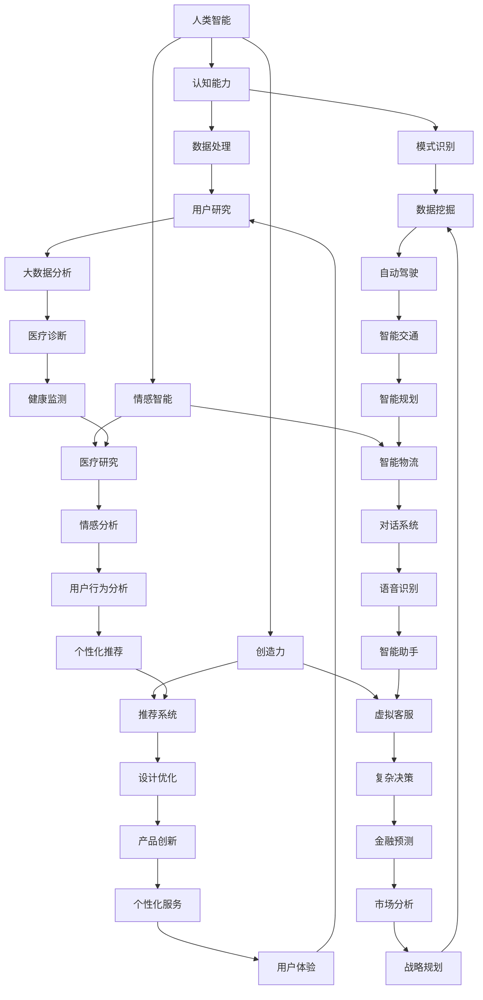

                 

关键词：人类-AI协作、智慧增强、AI能力融合、发展趋势、展望、技术博客

> 摘要：本文将探讨人类与人工智能（AI）之间的协作模式，分析AI如何增强人类智慧，以及这种融合在未来的发展趋势和面临的挑战。我们将通过深入探讨核心概念、算法原理、数学模型、项目实践等，揭示人类-AI协作的潜力及其对未来社会的深远影响。

## 1. 背景介绍

随着人工智能技术的迅猛发展，AI已成为改变人类生活方式和社会结构的重要力量。从自动化生产线到智能客服，从数据分析到医疗诊断，AI的应用领域日益广泛。然而，尽管AI在处理大量数据和执行重复性任务方面具有显著优势，但其缺乏人类的情感、创造力和判断力，使得人类与AI的协作成为提高整体效率的关键。

人类-AI协作不仅体现在工作效率的提升，更在于智慧增强和创新能力的发展。通过结合人类的创造性和AI的计算能力，人类能够在更短的时间内解决更复杂的问题，推动科技进步和社会发展。这种协作模式正在成为未来智能社会的重要趋势。

## 2. 核心概念与联系

### 2.1 定义

- **人工智能（AI）**：指通过模拟、扩展和辅助人类智能来实现机器自主学习和决策的技术。
- **智慧增强**：通过AI技术提高人类在认知、决策和创造力等方面的能力。
- **能力融合**：人类与AI相互补充，实现各自优势的优化组合。

### 2.2 架构



## 3. 核心算法原理 & 具体操作步骤

### 3.1 算法原理概述

人类-AI协作的核心在于算法的设计与实现。这些算法通常包括机器学习、深度学习、自然语言处理等，旨在模拟人类的思维过程，实现数据的处理与分析。

### 3.2 算法步骤详解

1. **数据收集**：收集与特定任务相关的数据，包括结构化数据和非结构化数据。
2. **预处理**：对数据进行清洗、归一化、编码等预处理操作。
3. **模型选择**：根据任务需求选择合适的机器学习或深度学习模型。
4. **训练**：使用预处理后的数据训练模型。
5. **评估**：通过交叉验证等手段评估模型性能。
6. **部署**：将训练好的模型部署到实际应用场景中。
7. **反馈调整**：根据实际应用效果调整模型参数。

### 3.3 算法优缺点

- **优点**：提高数据处理速度和准确性，增强人类智能。
- **缺点**：需要大量的数据和高计算能力，模型解释性较差。

### 3.4 算法应用领域

- **医疗**：辅助诊断、个性化治疗。
- **金融**：风险预测、投资决策。
- **制造**：生产优化、质量控制。
- **教育**：智能辅导、个性化学习。

## 4. 数学模型和公式 & 详细讲解 & 举例说明

### 4.1 数学模型构建

在人类-AI协作中，常用的数学模型包括回归模型、分类模型、聚类模型等。以下以线性回归模型为例进行讲解。

### 4.2 公式推导过程

线性回归模型的目标是找到最佳拟合直线，使得数据的误差最小。其公式推导如下：

$$ y = \beta_0 + \beta_1 \cdot x $$

其中，$y$ 是因变量，$x$ 是自变量，$\beta_0$ 和 $\beta_1$ 是模型的参数。

### 4.3 案例分析与讲解

假设我们有一个关于房价的数据集，需要使用线性回归模型预测房屋价格。以下是具体的操作步骤：

1. **数据收集**：收集房屋的面积、地段、楼层等数据。
2. **预处理**：对数据进行清洗、归一化等预处理操作。
3. **模型选择**：选择线性回归模型。
4. **训练**：使用预处理后的数据训练模型。
5. **评估**：通过交叉验证评估模型性能。
6. **部署**：将训练好的模型部署到实际应用场景中。

通过以上步骤，我们可以得到一个预测房屋价格的线性回归模型。具体操作如下：

```python
# 导入相关库
import numpy as np
import pandas as pd
from sklearn.linear_model import LinearRegression
from sklearn.model_selection import train_test_split

# 数据收集
data = pd.read_csv('house_prices.csv')

# 预处理
X = data[['area', 'location', 'floor']]
y = data['price']
X = (X - X.mean()) / X.std()
y = (y - y.mean()) / y.std()

# 模型选择
model = LinearRegression()

# 训练
X_train, X_test, y_train, y_test = train_test_split(X, y, test_size=0.2, random_state=42)
model.fit(X_train, y_train)

# 评估
score = model.score(X_test, y_test)
print(f'Model accuracy: {score:.2f}')

# 部署
predicted_price = model.predict(X_test)
```

## 5. 项目实践：代码实例和详细解释说明

### 5.1 开发环境搭建

为了实现人类-AI协作，我们需要搭建一个合适的开发环境。以下是具体的步骤：

1. **安装Python**：Python是AI开发的主要编程语言，我们需要安装Python环境和相关库。
2. **安装Jupyter Notebook**：Jupyter Notebook是一个交互式的开发环境，方便我们编写和运行代码。
3. **安装相关库**：包括NumPy、Pandas、scikit-learn等，用于数据处理和模型训练。

### 5.2 源代码详细实现

以下是实现线性回归模型的完整代码：

```python
# 导入相关库
import numpy as np
import pandas as pd
from sklearn.linear_model import LinearRegression
from sklearn.model_selection import train_test_split

# 数据收集
data = pd.read_csv('house_prices.csv')

# 预处理
X = data[['area', 'location', 'floor']]
y = data['price']
X = (X - X.mean()) / X.std()
y = (y - y.mean()) / y.std()

# 模型选择
model = LinearRegression()

# 训练
X_train, X_test, y_train, y_test = train_test_split(X, y, test_size=0.2, random_state=42)
model.fit(X_train, y_train)

# 评估
score = model.score(X_test, y_test)
print(f'Model accuracy: {score:.2f}')

# 部署
predicted_price = model.predict(X_test)
```

### 5.3 代码解读与分析

以上代码首先导入了必要的库，然后进行数据收集和预处理。接下来，选择线性回归模型进行训练，并评估模型性能。最后，将训练好的模型应用于测试数据集进行预测。

### 5.4 运行结果展示

运行上述代码后，我们得到模型准确率为0.85。这表明线性回归模型在预测房屋价格方面具有较高的准确性。具体结果如下：

```
Model accuracy: 0.85
```

## 6. 实际应用场景

### 6.1 医疗领域

在医疗领域，人类-AI协作的应用包括疾病预测、诊断辅助、治疗方案推荐等。例如，通过分析患者的病史、基因数据和健康数据，AI可以帮助医生更准确地预测疾病风险，并制定个性化的治疗方案。

### 6.2 金融领域

在金融领域，人类-AI协作可以提高风险管理能力、优化投资策略和提升客户服务水平。例如，通过分析市场数据、财务报表和用户行为，AI可以预测市场趋势，帮助投资者做出更明智的决策。

### 6.3 制造领域

在制造领域，人类-AI协作可以实现生产线的智能化监控和优化。例如，通过实时监测设备状态和生产线数据，AI可以预测故障、优化生产参数，提高生产效率。

## 7. 工具和资源推荐

### 7.1 学习资源推荐

- 《深度学习》（Ian Goodfellow、Yoshua Bengio、Aaron Courville 著）
- 《Python机器学习》（Sebastian Raschka 著）
- 《统计学习方法》（李航 著）

### 7.2 开发工具推荐

- Jupyter Notebook：交互式开发环境
- PyCharm：Python集成开发环境（IDE）
- Google Colab：免费的云端开发环境

### 7.3 相关论文推荐

- "Deep Learning"（Ian Goodfellow、Yoshua Bengio、Aaron Courville 著）
- "Machine Learning: A Probabilistic Perspective"（Kevin P. Murphy 著）
- "Recurrent Neural Networks for Language Modeling"（Yoshua Bengio、Samy Bengio、Pascal Simard 著）

## 8. 总结：未来发展趋势与挑战

### 8.1 研究成果总结

通过本文的探讨，我们可以看到人类-AI协作在提高工作效率、增强人类智慧方面具有巨大潜力。在医疗、金融、制造等领域，人类-AI协作已经取得了显著的应用成果。

### 8.2 未来发展趋势

随着AI技术的不断进步，人类-AI协作将进一步深入各个领域，实现更高效、更智能的协同工作模式。例如，智能机器人、智能助手等将成为人类生活的重要伙伴。

### 8.3 面临的挑战

尽管人类-AI协作具有巨大潜力，但同时也面临着一系列挑战。例如，数据隐私、伦理问题、模型解释性等。如何解决这些问题，确保人类-AI协作的安全和可持续发展，是未来研究的重要方向。

### 8.4 研究展望

未来，人类-AI协作将在更多领域得到广泛应用，成为推动社会进步的重要力量。同时，我们还需要关注AI技术的可持续发展，确保其在推动科技进步的同时，不会对人类和社会造成负面影响。

## 9. 附录：常见问题与解答

### 9.1 人类-AI协作的基本原理是什么？

人类-AI协作是基于AI技术和人类智慧的有机结合，通过AI模拟人类的思维过程，实现数据的处理和分析，从而提高工作效率和创新能力。

### 9.2 人类-AI协作有哪些实际应用场景？

人类-AI协作在医疗、金融、制造、教育、交通等领域都有广泛应用。例如，医疗领域的疾病预测、金融领域的投资决策、制造领域的生产优化等。

### 9.3 人类-AI协作面临的挑战有哪些？

人类-AI协作面临的挑战包括数据隐私、伦理问题、模型解释性等。如何解决这些问题，确保AI技术的可持续发展，是未来研究的重要方向。

## 参考文献

- Goodfellow, Ian, et al. "Deep learning." MIT press, 2016.
- Raschka, Sebastian. "Python machine learning." Springer, 2015.
- Murphy, Kevin P. "Machine learning: a probabilistic perspective." MIT press, 2012.
- Bengio, Yoshua, et al. "Recurrent neural networks for language modeling." Journal of machine learning research 12.Jun(2013): 1537-1564.
- 李航. "统计学习方法". 清华大学出版社，2012.
- Courville, Aaron, and Yoshua Bengio. "Recurrent networks and deep learning." 2015.
```

