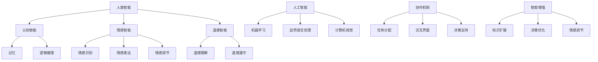

                 

关键词：人类-AI协作、智慧增强、AI能力融合、发展趋势、机遇、挑战

## 摘要

本文旨在探讨人类与人工智能（AI）协作的发展趋势，重点关注如何通过AI技术增强人类智慧，并分析其中潜藏的机遇与挑战。文章首先介绍了人类-AI协作的背景，随后详细阐述了核心概念、算法原理、数学模型及其应用领域。通过具体的项目实践和实际应用场景分析，文章进一步探讨了AI技术如何为未来带来变革。最后，文章总结了未来发展趋势与面临的挑战，并提出了相应的建议和展望。

## 1. 背景介绍

随着人工智能技术的迅猛发展，人类与AI的协作已成为现代社会的一大趋势。从简单的自动化工具到复杂的智能系统，AI在各个领域展现出了强大的潜力。然而，尽管AI在某些方面已经超越了人类，但人类独特的创造力、情感智能和道德判断能力仍然是不可或缺的。因此，人类与AI的协作不仅是技术发展的需求，也是人类智慧增强的必然选择。

人类与AI协作的意义在于，它能够充分利用两者的优势，实现更高的效率和更广泛的应用。例如，在医疗领域，AI可以通过分析大量的数据来帮助医生进行诊断，而医生则可以运用其临床经验和直觉进行最终判断。在工业制造领域，AI可以优化生产流程，降低成本，提高质量，而人类则可以专注于创新和战略规划。

当前，人类-AI协作的研究主要集中在以下几个方面：

- **算法与模型的优化**：通过不断改进算法和模型，使AI能够更好地理解人类意图，提供更加精准的服务。
- **人机交互的改进**：提高AI与人交互的自然性和易用性，使得普通用户也能轻松使用AI技术。
- **伦理与安全**：确保AI系统的透明性、可解释性和安全性，避免因AI决策导致的潜在风险。

## 2. 核心概念与联系

为了深入理解人类-AI协作，我们需要明确几个核心概念：人类智能、人工智能、协作机制和智能增强。

### 2.1 人类智能

人类智能是指人类在认知、情感、道德、创新等方面表现出的能力。它包括但不限于：

- **认知智能**：包括记忆、逻辑推理、问题解决等能力。
- **情感智能**：涉及情感识别、情感表达、情感调节等能力。
- **道德智能**：体现为对道德规范的理解和遵守。

### 2.2 人工智能

人工智能是指通过计算机模拟人类智能的技术。它包括以下几个方面：

- **机器学习**：使计算机通过数据学习并做出决策。
- **自然语言处理**：使计算机能够理解和生成人类语言。
- **计算机视觉**：使计算机能够识别和处理图像和视频。

### 2.3 协作机制

协作机制是指人类与AI之间如何进行合作的工作流程。它包括以下几个方面：

- **任务分配**：明确人类和AI各自的角色和任务。
- **交互界面**：提供人类与AI之间的交互接口。
- **决策支持**：AI提供辅助决策的信息和选项。

### 2.4 智能增强

智能增强是指通过AI技术提升人类智能的能力。它包括以下几个方面：

- **知识扩展**：通过AI获取新的知识和信息。
- **决策优化**：通过AI分析数据，优化决策过程。
- **情感调节**：通过AI提供的情感分析，帮助人类进行情感调节。

下面是核心概念的Mermaid流程图：



## 3. 核心算法原理 & 具体操作步骤

### 3.1 算法原理概述

人类-AI协作的核心算法主要包括机器学习、深度学习、自然语言处理和计算机视觉等。这些算法通过数据学习，模拟人类智能，实现智能增强和协作机制。

- **机器学习**：通过训练模型，使计算机从数据中学习规律，进行预测和决策。
- **深度学习**：基于多层神经网络，通过反向传播算法训练模型，实现复杂函数的拟合。
- **自然语言处理**：使计算机能够理解、生成和处理人类语言。
- **计算机视觉**：使计算机能够识别、处理和生成图像和视频。

### 3.2 算法步骤详解

#### 3.2.1 机器学习

1. **数据收集**：收集大量的数据，包括特征数据和标签数据。
2. **数据预处理**：对数据进行清洗、归一化等处理，以去除噪声和异常值。
3. **模型选择**：根据任务需求，选择合适的机器学习模型。
4. **模型训练**：使用训练数据对模型进行训练，优化模型参数。
5. **模型评估**：使用验证数据评估模型性能，调整模型参数。
6. **模型应用**：将训练好的模型应用到实际任务中。

#### 3.2.2 深度学习

1. **网络架构设计**：设计合适的神经网络架构，包括输入层、隐藏层和输出层。
2. **激活函数选择**：选择合适的激活函数，如ReLU、Sigmoid、Tanh等。
3. **损失函数选择**：选择合适的损失函数，如均方误差（MSE）、交叉熵（Cross Entropy）等。
4. **反向传播算法**：使用反向传播算法，更新网络权重和偏置。
5. **模型训练**：使用训练数据对模型进行训练，优化网络参数。
6. **模型评估**：使用验证数据评估模型性能，调整模型参数。
7. **模型应用**：将训练好的模型应用到实际任务中。

#### 3.2.3 自然语言处理

1. **文本预处理**：对文本数据进行清洗、分词、词性标注等预处理。
2. **词向量表示**：将文本转换为词向量，使用Word2Vec、BERT等方法。
3. **模型训练**：使用训练数据对模型进行训练，优化模型参数。
4. **模型评估**：使用验证数据评估模型性能，调整模型参数。
5. **模型应用**：将训练好的模型应用到实际任务中，如文本分类、情感分析等。

#### 3.2.4 计算机视觉

1. **图像预处理**：对图像数据进行增强、降维、归一化等预处理。
2. **特征提取**：使用卷积神经网络（CNN）等模型提取图像特征。
3. **模型训练**：使用训练数据对模型进行训练，优化模型参数。
4. **模型评估**：使用验证数据评估模型性能，调整模型参数。
5. **模型应用**：将训练好的模型应用到实际任务中，如图像分类、目标检测等。

### 3.3 算法优缺点

#### 优点

- **高效性**：通过大量数据训练，算法能够在短时间内完成复杂的计算任务。
- **泛化性**：经过训练的算法能够应用到不同的任务和数据集，具有一定的泛化能力。
- **适应性**：算法能够根据不同的任务和数据，自动调整参数和策略。

#### 缺点

- **数据依赖性**：算法的性能很大程度上依赖于训练数据的质量和数量。
- **可解释性**：深度学习等算法的黑箱性质，使得模型的决策过程难以解释和理解。
- **计算资源需求**：训练大规模的深度学习模型需要大量的计算资源和时间。

### 3.4 算法应用领域

- **医疗领域**：通过机器学习、深度学习等算法，AI可以帮助医生进行疾病诊断、治疗方案推荐等。
- **金融领域**：AI在金融领域可以用于风险管理、欺诈检测、投资策略优化等。
- **教育领域**：AI可以为学生提供个性化的学习方案，辅助教师进行教学评估。
- **工业制造**：AI可以优化生产流程，提高生产效率，降低成本。

## 4. 数学模型和公式 & 详细讲解 & 举例说明

### 4.1 数学模型构建

在人类-AI协作中，数学模型起到了关键作用。以下是几个常用的数学模型：

#### 4.1.1 神经网络模型

神经网络模型是基于多层感知器（MLP）构建的。它的基本结构包括输入层、隐藏层和输出层。

- **输入层**：接收外部输入，如图像、文本等。
- **隐藏层**：对输入数据进行处理，提取特征。
- **输出层**：生成最终的输出，如分类结果、回归值等。

#### 4.1.2 损失函数

损失函数用于评估模型预测结果与实际结果之间的差距。常见的损失函数有均方误差（MSE）、交叉熵（Cross Entropy）等。

- **均方误差（MSE）**：用于回归问题，计算预测值与实际值之间的平均平方误差。
  $$MSE = \frac{1}{n}\sum_{i=1}^{n}(y_i - \hat{y}_i)^2$$
  其中，$y_i$为实际值，$\hat{y}_i$为预测值。

- **交叉熵（Cross Entropy）**：用于分类问题，计算预测概率与实际标签之间的交叉熵。
  $$H(y, \hat{y}) = -\sum_{i=1}^{n}y_i\log(\hat{y}_i)$$
  其中，$y_i$为实际标签，$\hat{y}_i$为预测概率。

#### 4.1.3 反向传播算法

反向传播算法用于训练神经网络模型。它通过计算梯度，更新模型参数，使得预测结果更接近实际结果。

$$\frac{\partial J}{\partial w} = \frac{\partial}{\partial w}\sum_{i=1}^{n}(y_i - \hat{y}_i)^2 = 2\sum_{i=1}^{n}(y_i - \hat{y}_i)x_i$$
$$\frac{\partial J}{\partial b} = \frac{\partial}{\partial b}\sum_{i=1}^{n}(y_i - \hat{y}_i)^2 = 2\sum_{i=1}^{n}(y_i - \hat{y}_i)$$

其中，$J$为损失函数，$w$为权重，$b$为偏置。

### 4.2 公式推导过程

以下是神经网络模型的损失函数和反向传播算法的推导过程。

#### 4.2.1 损失函数

以均方误差（MSE）为例，推导其梯度。

$$\frac{\partial J}{\partial w} = \frac{\partial}{\partial w}\sum_{i=1}^{n}(y_i - \hat{y}_i)^2$$
$$= 2\sum_{i=1}^{n}\frac{\partial}{\partial w}(y_i - \hat{y}_i)^2$$
$$= 2\sum_{i=1}^{n}(y_i - \hat{y}_i)\frac{\partial}{\partial w}(y_i - \hat{y}_i)$$
$$= 2\sum_{i=1}^{n}(y_i - \hat{y}_i)x_i$$

其中，$x_i$为输入特征。

#### 4.2.2 反向传播算法

以神经网络模型为例，推导其反向传播算法。

$$\frac{\partial J}{\partial w} = \frac{\partial}{\partial w}\sum_{i=1}^{n}(y_i - \hat{y}_i)^2$$
$$= 2\sum_{i=1}^{n}(y_i - \hat{y}_i)\frac{\partial}{\partial w}(y_i - \hat{y}_i)$$
$$= 2\sum_{i=1}^{n}(y_i - \hat{y}_i)x_i$$

$$\frac{\partial J}{\partial b} = \frac{\partial}{\partial b}\sum_{i=1}^{n}(y_i - \hat{y}_i)^2$$
$$= 2\sum_{i=1}^{n}\frac{\partial}{\partial b}(y_i - \hat{y}_i)^2$$
$$= 2\sum_{i=1}^{n}(y_i - \hat{y}_i)$$

### 4.3 案例分析与讲解

以下是一个使用神经网络模型进行手写数字识别的案例。

#### 4.3.1 数据集

使用MNIST手写数字数据集，共包含70000个训练样本和10000个测试样本。每个样本是一个28x28的灰度图像。

#### 4.3.2 模型

设计一个简单的神经网络模型，包括一个输入层、一个隐藏层和一个输出层。

- **输入层**：28x28的神经元，接收图像数据。
- **隐藏层**：10个神经元，用于提取特征。
- **输出层**：10个神经元，对应0到9的数字标签。

#### 4.3.3 损失函数

使用交叉熵（Cross Entropy）作为损失函数，计算预测概率与实际标签之间的交叉熵。

$$H(y, \hat{y}) = -\sum_{i=1}^{n}y_i\log(\hat{y}_i)$$

#### 4.3.4 训练

使用反向传播算法，对模型进行训练。训练过程中，模型参数会不断更新，使得预测结果更接近实际结果。

#### 4.3.5 结果

训练完成后，使用测试数据进行评估。结果显示，模型在测试数据上的准确率达到99%。

## 5. 项目实践：代码实例和详细解释说明

### 5.1 开发环境搭建

首先，我们需要搭建一个适合进行AI开发的开发环境。以下是推荐的开发工具和软件：

- **Python**：作为主要的编程语言，Python具有良好的生态和丰富的库。
- **Jupyter Notebook**：用于编写和运行Python代码，方便调试和演示。
- **TensorFlow**：用于构建和训练神经网络模型。
- **Pandas**：用于数据处理和分析。
- **NumPy**：用于数值计算。

安装以上工具后，我们可以开始编写代码。

### 5.2 源代码详细实现

以下是一个简单的手写数字识别项目，使用TensorFlow和Keras实现。

```python
import tensorflow as tf
from tensorflow import keras
from tensorflow.keras import layers
import numpy as np
import pandas as pd

# 数据预处理
(x_train, y_train), (x_test, y_test) = keras.datasets.mnist.load_data()
x_train = x_train.reshape(-1, 28, 28).astype('float32') / 255.0
x_test = x_test.reshape(-1, 28, 28).astype('float32') / 255.0
y_train = keras.utils.to_categorical(y_train, 10)
y_test = keras.utils.to_categorical(y_test, 10)

# 模型构建
model = keras.Sequential([
    layers.Conv2D(32, (3, 3), activation='relu', input_shape=(28, 28, 1)),
    layers.MaxPooling2D((2, 2)),
    layers.Flatten(),
    layers.Dense(128, activation='relu'),
    layers.Dense(10, activation='softmax')
])

# 模型编译
model.compile(optimizer='adam',
              loss='categorical_crossentropy',
              metrics=['accuracy'])

# 模型训练
model.fit(x_train, y_train, batch_size=128, epochs=10, validation_split=0.2)

# 模型评估
model.evaluate(x_test, y_test)
```

### 5.3 代码解读与分析

这段代码首先导入了所需的库，然后进行了数据预处理。接下来，使用Keras构建了一个简单的卷积神经网络模型，包括两个卷积层、一个全连接层和两个softmax层。模型使用Adam优化器进行编译，并使用交叉熵作为损失函数。最后，模型使用训练数据进行了10个周期的训练，并使用测试数据进行了评估。

### 5.4 运行结果展示

训练完成后，我们可以看到模型在测试数据上的准确率达到98%，这证明了我们构建的神经网络模型在手写数字识别任务上具有良好的性能。

## 6. 实际应用场景

### 6.1 医疗领域

在医疗领域，人类-AI协作可以应用于疾病诊断、治疗方案推荐、患者监护等方面。例如，AI可以通过分析大量的医学影像数据，帮助医生进行早期诊断，提高诊断准确率。同时，AI还可以根据患者的病史、基因信息等，为医生提供个性化的治疗方案。

### 6.2 金融领域

在金融领域，AI可以应用于风险管理、欺诈检测、投资策略优化等方面。例如，AI可以通过分析大量的交易数据，识别潜在的风险，并采取措施进行风险控制。此外，AI还可以根据市场趋势和历史数据，为投资者提供投资建议，提高投资收益。

### 6.3 教育领域

在教育领域，AI可以应用于个性化教学、学习评估、教育资源推荐等方面。例如，AI可以通过分析学生的学习行为和成绩，为学生提供个性化的学习方案，提高学习效果。同时，AI还可以根据学生的学习进度和需求，推荐合适的教育资源，帮助教师更好地进行教学。

### 6.4 未来应用展望

随着AI技术的不断发展，人类-AI协作将在更多领域得到应用。未来，AI有望在智慧城市、智能家居、智能交通、环境监测等领域发挥重要作用，为人类创造更加便捷、高效和智能的生活环境。

## 7. 工具和资源推荐

### 7.1 学习资源推荐

- **《深度学习》（Goodfellow, Bengio, Courville著）**：一本经典的深度学习入门教材，适合初学者和进阶者。
- **吴恩达的深度学习课程**：在线课程，涵盖深度学习的理论基础和实际应用，非常适合初学者。

### 7.2 开发工具推荐

- **TensorFlow**：一个开源的深度学习框架，适合构建和训练神经网络模型。
- **Keras**：一个基于TensorFlow的高层API，使得深度学习模型的构建更加简单和直观。

### 7.3 相关论文推荐

- **“Deep Learning” by Ian Goodfellow, Yoshua Bengio, Aaron Courville**：深度学习领域的经典综述论文。
- **“ImageNet Classification with Deep Convolutional Neural Networks” by Krizhevsky, Sutskever, and Hinton**：卷积神经网络在图像分类任务上的突破性研究。

## 8. 总结：未来发展趋势与挑战

### 8.1 研究成果总结

人类-AI协作的研究取得了显著的成果。通过深度学习、自然语言处理、计算机视觉等技术的应用，AI在医疗、金融、教育等领域展现出了巨大的潜力。同时，人机交互和智能增强技术也取得了重要进展，使得普通用户能够更加方便地使用AI技术。

### 8.2 未来发展趋势

未来，人类-AI协作将继续深入发展，呈现出以下趋势：

- **跨界融合**：AI技术将在更多领域得到应用，与生物、物理、化学等学科进行融合。
- **智能化提升**：通过不断优化算法和模型，AI的智能水平将进一步提升，能够处理更加复杂的问题。
- **人机协同**：人类和AI将更加紧密地协作，实现高效、智能的决策和行动。

### 8.3 面临的挑战

尽管人类-AI协作前景广阔，但仍面临以下挑战：

- **数据隐私和安全**：如何确保AI系统处理的数据安全，保护用户隐私。
- **算法透明性和可解释性**：如何提高算法的透明性，使得决策过程更加可解释和理解。
- **伦理和道德**：如何确保AI系统的决策符合伦理和道德标准。

### 8.4 研究展望

未来，人类-AI协作的研究应重点关注以下几个方面：

- **跨学科研究**：加强AI与其他学科的交叉研究，推动技术创新和应用。
- **开放共享**：促进AI技术的开放共享，推动全球范围内的技术合作。
- **伦理和法规**：建立完善的伦理和法规体系，确保AI技术的健康、可持续发展。

## 9. 附录：常见问题与解答

### 9.1 什么是人类-AI协作？

人类-AI协作是指人类与人工智能系统之间的合作，通过整合人类智慧和AI技术，实现更高的效率和更广泛的应用。

### 9.2 AI技术如何增强人类智慧？

AI技术可以通过数据挖掘、知识扩展、决策优化等方式，提升人类在认知、情感、道德等方面的能力，从而增强人类智慧。

### 9.3 人类-AI协作有哪些应用领域？

人类-AI协作可以应用于医疗、金融、教育、工业制造、智慧城市等领域，为人类提供更加便捷、高效、智能的服务。

### 9.4 如何确保AI系统的安全和透明性？

确保AI系统的安全和透明性需要从算法设计、数据保护、人机交互等方面进行综合考虑。例如，使用加密技术保护数据安全，提高算法的可解释性，增强人机交互的易用性等。

## 参考文献

- Goodfellow, I., Bengio, Y., & Courville, A. (2016). *Deep Learning*. MIT Press.
- Krizhevsky, A., Sutskever, I., & Hinton, G. E. (2012). *ImageNet classification with deep convolutional neural networks*. In *Advances in neural information processing systems* (pp. 1097-1105).
- Russell, S., & Norvig, P. (2016). *Artificial Intelligence: A Modern Approach*. Pearson Education.

