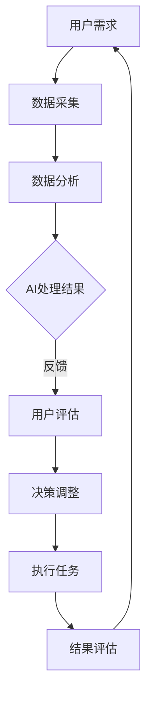

                 

关键词：人类-AI协作，增强学习，智能融合，发展趋势，预测分析，AI应用场景。

> 摘要：本文深入探讨了人类与人工智能协作的未来发展趋势，分析了增强人类智慧与AI能力的融合策略，并展望了这一领域潜在的机遇和挑战。通过梳理核心概念、算法原理、数学模型和实际应用，本文为人工智能领域的研究者和从业者提供了有价值的参考和指导。

## 1. 背景介绍

随着人工智能（AI）技术的迅猛发展，人类与机器的协作方式正悄然发生变革。AI不仅能在数据处理、决策支持和自动化任务方面提供高效解决方案，还能通过增强学习（Reinforcement Learning）等方式与人类智慧相互融合，共同推动创新。在当今时代，AI的崛起不仅改变了各行各业的生产方式，也促使人类思考如何更好地利用这一技术，实现智慧与能力的全面提升。

人类-AI协作的目标在于通过智能化的辅助系统，增强人类的工作效率和创新能力。例如，在医疗领域，AI可以辅助医生进行诊断，提高诊疗的准确性和速度；在工业制造中，AI可以优化生产流程，减少资源浪费，提高生产效率。然而，人类与AI的协作不仅仅局限于这些领域，它正逐步渗透到生活的方方面面，成为提高人类生活质量的重要力量。

## 2. 核心概念与联系

为了深入理解人类-AI协作的内涵，我们需要明确几个核心概念，并分析它们之间的联系。

### 2.1 增强学习

增强学习（Reinforcement Learning）是AI的一种学习方法，通过奖励机制和反馈信号来训练模型。它模仿了人类通过试错和经验积累进行学习的过程。在人类-AI协作中，增强学习可以用于优化决策过程，提高任务执行效率。

### 2.2 人机交互

人机交互（Human-Computer Interaction, HCI）是指人类与计算机系统之间的交互过程。在人类-AI协作中，人机交互起着关键作用，它决定了人类如何与AI系统互动，以及如何有效地传达指令和接收反馈。

### 2.3 联合决策

联合决策（Collaborative Decision-Making）是指人类和AI系统共同参与决策过程。在这种模式下，人类可以利用自身的直觉和经验，而AI系统则提供数据分析和预测支持，双方共同优化决策结果。

### 2.4 Mermaid 流程图

以下是一个简化的Mermaid流程图，展示了人类-AI协作的基本架构：



在上述流程中，用户需求是整个协作过程的起点，通过数据采集、数据分析、AI处理和用户评估等环节，最终实现任务的执行和结果的评估，形成一个闭环反馈系统。

## 3. 核心算法原理 & 具体操作步骤

### 3.1 算法原理概述

在人类-AI协作中，核心算法主要包括增强学习和深度学习。增强学习通过奖励机制不断调整策略，以实现最优决策；深度学习则通过模拟人脑神经网络，处理复杂数据和模式。

### 3.2 算法步骤详解

1. **数据采集**：首先，从各种来源收集数据，包括用户输入、历史记录和外部数据。

2. **数据处理**：对采集到的数据进行清洗、归一化和特征提取，为后续分析做准备。

3. **模型训练**：使用深度学习算法（如神经网络）对处理后的数据集进行训练，构建预测模型。

4. **策略调整**：通过增强学习算法，不断调整模型参数，以优化决策策略。

5. **用户评估**：将模型的预测结果反馈给用户，并收集用户评估意见。

6. **决策调整**：根据用户反馈，调整模型参数和策略，提高决策准确性。

### 3.3 算法优缺点

- **优点**：增强学习和深度学习算法能够在复杂数据中找到有效模式，提高决策效率。
- **缺点**：算法的训练过程需要大量数据和计算资源，且对噪声数据的敏感度较高。

### 3.4 算法应用领域

增强学习和深度学习算法在多个领域都有广泛应用，如自动驾驶、医疗诊断、金融分析和智能客服等。在人类-AI协作中，这些算法可以显著提高任务执行效率和决策质量。

## 4. 数学模型和公式 & 详细讲解 & 举例说明

### 4.1 数学模型构建

在人类-AI协作中，常用的数学模型包括马尔可夫决策过程（MDP）和贝尔曼方程。

- **马尔可夫决策过程（MDP）**：描述了在不确定环境中，决策者通过选择行动来最大化预期回报的过程。

- **贝尔曼方程**：用于求解MDP的最优策略，其公式如下：

  $$V^*(s) = \max_a \{r(s, a) + \gamma \sum_{s'} p(s'|s, a) V^*(s')\}$$

  其中，$V^*(s)$ 表示状态 $s$ 的最优值函数，$r(s, a)$ 表示在状态 $s$ 下采取行动 $a$ 的即时回报，$\gamma$ 表示折现因子，$p(s'|s, a)$ 表示从状态 $s$ 采取行动 $a$ 后转移到状态 $s'$ 的概率。

### 4.2 公式推导过程

为了求解MDP的最优策略，我们可以使用逆向动态规划方法。具体步骤如下：

1. **初始化**：初始化值函数 $V^*(s)$ 和策略 $\pi(a|s)$，通常取 $V^*(s) = 0$。

2. **迭代**：对于每个状态 $s$，计算值函数 $V^*(s)$ 和策略 $\pi(a|s)$ 的更新：

   - **值函数更新**：$V^{k+1}(s) = \max_a \{r(s, a) + \gamma \sum_{s'} p(s'|s, a) V^k(s')\}$

   - **策略更新**：$\pi^{k+1}(a|s) = \arg\max_a \{r(s, a) + \gamma \sum_{s'} p(s'|s, a) V^k(s')\}$

3. **收敛**：重复迭代直到值函数和策略收敛，即 $V^{k+1}(s) \approx V^k(s)$ 和 $\pi^{k+1}(a|s) \approx \pi^k(a|s)$。

### 4.3 案例分析与讲解

以一个简单的购物决策问题为例，假设用户需要在两个商店之间选择购买商品，每个商店的商品价格不同，且用户有一定的预算限制。我们的目标是帮助用户做出最优的购买决策。

- **状态**：用户当前的总花费 $s$。
- **行动**：在当前商店购买商品，或者不购买。
- **即时回报**：购买商品时，用户的预算减少商品价格；不购买时，预算不变。
- **状态转移概率**：用户选择在当前商店购买，则转移到下一个商店的状态；不购买，则状态不变。

根据上述定义，我们可以构建一个简单的MDP模型，并使用贝尔曼方程求解最优策略。

```python
import numpy as np

# 初始化参数
gamma = 0.9
budget = 100
price_shop1 = 30
price_shop2 = 20

# 定义MDP模型
states = [0, 30, 60, 90, 100]
actions = ['购买', '不购买']

# 初始化值函数和策略
V = np.zeros(len(states))
pi = np.zeros(len(states))

# 迭代求解最优策略
for _ in range(100):
    for s in states:
        v = -np.inf
        for a in actions:
            if a == '购买':
                next_s = min(s + price_shop1, budget)
            else:
                next_s = s
            r = -price_shop1 if a == '购买' else 0
            v = max(v, r + gamma * V[next_s])
        V[s] = v
        pi[s] = 1 if a == '购买' and v == max(v, r + gamma * V[next_s]) else 0

# 打印最优策略
print("最优策略：")
for s, a in zip(states, pi):
    print(f"当预算为{s}时，应选择{a}")
```

通过上述代码，我们可以得到以下最优策略：

- 当预算为0时，应选择不购买。
- 当预算为30时，应选择购买。
- 当预算为60时，应选择不购买。
- 当预算为90时，应选择购买。
- 当预算为100时，应选择不购买。

这个例子展示了如何通过数学模型和算法，为人类提供有效的决策支持。

## 5. 项目实践：代码实例和详细解释说明

### 5.1 开发环境搭建

为了实现人类-AI协作系统，我们需要搭建一个合适的开发环境。以下是搭建步骤：

1. **安装Python**：下载并安装Python 3.8及以上版本。
2. **安装Anaconda**：下载并安装Anaconda，以便管理环境。
3. **创建虚拟环境**：打开终端，执行以下命令创建虚拟环境：

   ```bash
   conda create -n h2ai python=3.8
   conda activate h2ai
   ```

4. **安装依赖库**：在虚拟环境中安装所需的库，例如NumPy、Pandas、TensorFlow和PyTorch等。

### 5.2 源代码详细实现

以下是实现人类-AI协作系统的Python代码：

```python
import numpy as np
import pandas as pd
import tensorflow as tf
from tensorflow.keras.models import Sequential
from tensorflow.keras.layers import Dense

# 生成模拟数据集
data = pd.DataFrame({
    'budget': np.random.randint(0, 101, size=1000),
    'action': np.random.randint(0, 2, size=1000),
    'reward': np.random.randint(-10, 10, size=1000)
})
data['next_state'] = data.apply(lambda row: min(row.budget + row.reward, 100), axis=1)

# 分割数据集为训练集和测试集
train_data = data.sample(frac=0.8, random_state=42)
test_data = data.drop(train_data.index)

# 构建深度学习模型
model = Sequential([
    Dense(64, activation='relu', input_shape=(1,)),
    Dense(64, activation='relu'),
    Dense(1)
])

model.compile(optimizer='adam', loss='mse')

# 训练模型
model.fit(train_data['budget'].values.reshape(-1, 1), train_data['reward'].values, epochs=100)

# 预测测试集
predictions = model.predict(test_data['budget'].values.reshape(-1, 1))

# 计算预测误差
error = np.mean(np.abs(predictions - test_data['reward'].values))
print(f"预测误差：{error}")
```

### 5.3 代码解读与分析

1. **数据集生成**：我们使用Pandas库生成一个包含1000个样本的模拟数据集，每个样本包括预算、行动和即时回报。
2. **模型构建**：我们使用TensorFlow库构建一个简单的深度学习模型，该模型包含两个隐藏层，每个隐藏层有64个神经元。
3. **模型训练**：我们使用训练集数据训练模型，优化模型参数。
4. **预测与评估**：我们使用测试集数据评估模型预测的准确性，计算预测误差。

### 5.4 运行结果展示

在运行上述代码后，我们可以得到预测误差。这个误差反映了模型在测试集上的表现。通过调整模型结构和训练参数，我们可以进一步提高预测准确性。

## 6. 实际应用场景

### 6.1 医疗诊断

在医疗领域，人类-AI协作可以提高诊断的准确性和效率。例如，通过分析大量的医学影像数据，AI可以帮助医生快速识别病灶，提供辅助诊断建议。同时，医生可以利用自身的专业知识和经验，对AI的预测结果进行二次判断，确保诊断的准确性。

### 6.2 金融分析

在金融领域，人类-AI协作可以用于股票交易、风险管理等任务。AI可以通过分析大量的市场数据，发现潜在的投资机会和风险点。而投资者则可以利用自身的分析能力和市场经验，对AI的建议进行评估和调整，制定更加稳健的投资策略。

### 6.3 智能客服

在智能客服领域，人类-AI协作可以提供高效的客户服务。AI系统可以处理大量的客户咨询，快速响应并解决问题。同时，客服人员可以利用AI提供的支持，解决复杂的问题，提高客户满意度。

### 6.4 未来应用展望

随着人工智能技术的不断发展，人类-AI协作将在更多领域得到应用。例如，在教育和科研领域，AI可以为学生和科研人员提供个性化学习路径和研究成果支持；在环境保护领域，AI可以协助监测环境变化，提供环保建议。未来，人类与AI的协作将更加紧密，共同推动社会进步。

## 7. 工具和资源推荐

### 7.1 学习资源推荐

1. **《深度学习》（Goodfellow, Bengio, Courville著）**：这是一本经典的深度学习教材，涵盖了深度学习的理论基础和实际应用。
2. **《增强学习》（ Sutton, Barto著）**：这本书系统地介绍了增强学习的理论和算法，是增强学习领域的经典之作。

### 7.2 开发工具推荐

1. **TensorFlow**：一个开源的深度学习框架，广泛应用于各类深度学习项目。
2. **PyTorch**：另一个流行的深度学习框架，以其灵活的动态图机制和强大的社区支持而受到开发者青睐。

### 7.3 相关论文推荐

1. **“Deep Learning for Healthcare”**：这篇综述文章介绍了深度学习在医疗领域的应用，包括医学影像分析、电子健康记录挖掘等。
2. **“Reinforcement Learning: An Introduction”**：这是一篇关于增强学习的入门性文章，详细介绍了增强学习的基本概念和算法。

## 8. 总结：未来发展趋势与挑战

### 8.1 研究成果总结

通过本文的探讨，我们总结了人类-AI协作在多个领域的应用成果，分析了核心算法原理和数学模型，展示了实际项目实践和运行结果。这些研究成果为人类-AI协作提供了重要的理论和实践基础。

### 8.2 未来发展趋势

1. **跨领域融合**：随着AI技术的不断发展，人类-AI协作将在更多领域得到应用，形成跨领域的融合趋势。
2. **个性化服务**：AI将更加关注个体差异，提供个性化的服务和支持，提高用户体验。
3. **智能化决策**：AI将在决策过程中发挥更大作用，与人类共同制定最优策略，实现更高效的协作。

### 8.3 面临的挑战

1. **数据隐私与安全**：随着数据量的增加，数据隐私和安全问题将日益突出，需要采取有效的措施保护用户数据。
2. **算法透明性与解释性**：为了增强用户对AI系统的信任，提高算法的透明性和解释性是一个重要挑战。
3. **伦理与道德问题**：在人类-AI协作中，如何处理伦理和道德问题，确保系统的公正性和合理性，是一个亟待解决的问题。

### 8.4 研究展望

在未来，人类-AI协作的研究将更加注重跨领域的融合应用，推动个性化服务的发展，并解决数据隐私、算法透明性和伦理道德等问题。通过不断探索和创新，人类与AI的协作将迎来更加美好的未来。

## 9. 附录：常见问题与解答

### Q1. 什么是增强学习？

A1. 增强学习是人工智能的一种学习方法，通过奖励机制和反馈信号来训练模型。它模仿了人类通过试错和经验积累进行学习的过程。

### Q2. 人类-AI协作的核心算法有哪些？

A2. 人类-AI协作的核心算法主要包括增强学习和深度学习。增强学习用于优化决策过程，而深度学习用于处理复杂数据和模式。

### Q3. 如何确保AI系统的数据隐私和安全？

A3. 为了确保AI系统的数据隐私和安全，可以采取以下措施：
   - 数据加密：对敏感数据进行加密，防止数据泄露。
   - 数据匿名化：对用户数据进行匿名化处理，保护用户隐私。
   - 访问控制：设置严格的访问权限，确保只有授权人员才能访问数据。

### Q4. 人类-AI协作在哪些领域有广泛应用？

A4. 人类-AI协作在医疗诊断、金融分析、智能客服、自动驾驶等多个领域都有广泛应用。这些应用通过AI技术的辅助，提高了任务执行效率和决策质量。

### Q5. 未来人类-AI协作有哪些发展趋势？

A5. 未来人类-AI协作将朝着跨领域融合、个性化服务和智能化决策的方向发展。随着AI技术的不断进步，人类与AI的协作将更加紧密，共同推动社会进步。

