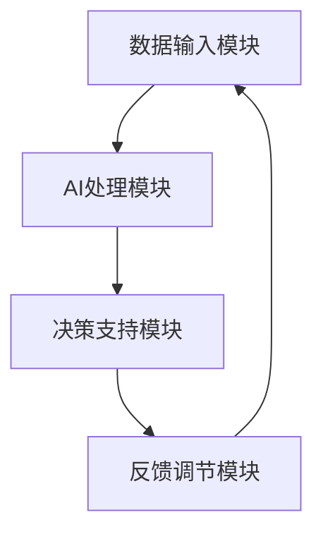

                 

关键词：人类-AI协作，增强人类潜能，AI协同效应，技术发展，未来趋势。

> 摘要：本文深入探讨了人类与人工智能（AI）协作的机制和模式，以及如何通过AI技术增强人类潜能。文章首先介绍了人类-AI协作的背景和重要性，然后详细分析了核心概念、算法原理、数学模型、应用场景、项目实践等内容，最后对未来的发展趋势和面临的挑战进行了展望。

## 1. 背景介绍

### 1.1 人工智能的发展历程

人工智能（AI）作为计算机科学的一个分支，其发展历程可以追溯到20世纪50年代。从最初的符号主义人工智能（Symbolic AI）到基于知识的系统（Knowledge-Based Systems），再到连接主义人工智能（Connectionist AI），AI技术经历了巨大的变革。随着深度学习、神经网络等技术的突破，AI开始进入一个全新的阶段，显示出强大的潜力和应用价值。

### 1.2 人类-AI协作的起源

随着AI技术的进步，人类开始意识到，单凭自身的力量难以应对日益复杂的问题。因此，人类-AI协作的概念逐渐兴起。早在20世纪80年代，专家系统（Expert Systems）的出现就为人类-AI协作提供了初步的实践平台。而如今，随着AI技术的不断成熟，人类-AI协作已经成为一个热门的研究方向。

### 1.3 人类-AI协作的重要性

人类-AI协作不仅能够提高人类的工作效率，还能够拓展人类的认知能力，甚至有可能改变人类的生活方式。在医疗、教育、工业、军事等多个领域，人类-AI协作已经展现出了巨大的应用价值。因此，深入研究人类-AI协作的机制和模式，对于推动技术发展和产业升级具有重要意义。

## 2. 核心概念与联系

### 2.1 人类潜能与AI技术

人类潜能是指人类在生理、心理、智力等方面具备的潜在能力。而AI技术则是一种模拟人类智能的技术手段。通过AI技术，我们可以挖掘和增强人类的潜能，使其得到更充分的发展。

### 2.2 人类-AI协作的架构

人类-AI协作的架构主要包括以下几个部分：

1. **数据输入模块**：收集和预处理人类行为和认知的数据。
2. **AI处理模块**：利用AI算法对数据进行处理和分析。
3. **决策支持模块**：根据AI处理结果，为人类提供决策支持。
4. **反馈调节模块**：收集人类反馈，用于优化AI算法和协作流程。

### 2.3 Mermaid 流程图



## 3. 核心算法原理 & 具体操作步骤

### 3.1 算法原理概述

人类-AI协作的核心算法主要基于机器学习和深度学习技术。通过训练模型，AI能够从数据中学习规律，为人类提供有价值的洞察和建议。

### 3.2 算法步骤详解

1. **数据收集**：收集与人类行为和认知相关的数据，如传感器数据、文本数据、图像数据等。
2. **数据预处理**：对收集到的数据进行清洗、归一化等预处理操作，以提高模型的训练效果。
3. **模型训练**：利用预处理后的数据训练机器学习模型，如神经网络、决策树等。
4. **模型评估**：通过交叉验证、性能指标等方法评估模型的性能，确保其准确性和可靠性。
5. **模型部署**：将训练好的模型部署到实际应用场景中，为人类提供决策支持。

### 3.3 算法优缺点

**优点**：
- **高效性**：AI算法能够快速处理海量数据，提高工作效率。
- **准确性**：通过训练，AI模型能够提供较为准确的预测和建议。

**缺点**：
- **依赖数据**：算法的性能很大程度上取决于数据质量。
- **模型解释性**：许多AI模型，尤其是深度学习模型，其内部机制较为复杂，难以解释。

### 3.4 算法应用领域

人类-AI协作算法在多个领域都有广泛的应用，如医疗、金融、教育、工业等。

## 4. 数学模型和公式 & 详细讲解 & 举例说明

### 4.1 数学模型构建

人类-AI协作的数学模型通常基于统计学和概率论。以神经网络为例，其基本模型包括输入层、隐藏层和输出层。

### 4.2 公式推导过程

以反向传播算法（Backpropagation Algorithm）为例，其公式推导过程如下：

$$
\delta_h = \frac{\partial L}{\partial z_h} = \frac{\partial L}{\partial a_h} \cdot \frac{\partial a_h}{\partial z_h}
$$

其中，$\delta_h$ 表示隐藏层节点的误差，$L$ 表示损失函数，$z_h$ 表示隐藏层节点的输入，$a_h$ 表示隐藏层节点的输出。

### 4.3 案例分析与讲解

以医疗诊断为例，人类-AI协作可以通过训练神经网络模型，从大量的医疗数据中学习诊断规律，从而提高诊断的准确性。

## 5. 项目实践：代码实例和详细解释说明

### 5.1 开发环境搭建

以Python为例，搭建开发环境的基本步骤如下：

1. 安装Python
2. 安装常用库，如NumPy、Pandas、TensorFlow等

### 5.2 源代码详细实现

以下是一个简单的神经网络训练和预测的Python代码示例：

```python
import tensorflow as tf
from tensorflow.keras import layers

# 构建模型
model = tf.keras.Sequential([
    layers.Dense(64, activation='relu', input_shape=(784,)),
    layers.Dense(10, activation='softmax')
])

# 编译模型
model.compile(optimizer='adam',
              loss='categorical_crossentropy',
              metrics=['accuracy'])

# 加载数据
(x_train, y_train), (x_test, y_test) = tf.keras.datasets.mnist.load_data()

# 预处理数据
x_train = x_train.astype('float32') / 255
x_test = x_test.astype('float32') / 255
x_train = x_train.reshape((-1, 784))
x_test = x_test.reshape((-1, 784))

# 转换标签为one-hot编码
y_train = tf.keras.utils.to_categorical(y_train, 10)
y_test = tf.keras.utils.to_categorical(y_test, 10)

# 训练模型
model.fit(x_train, y_train, epochs=10, batch_size=128)

# 评估模型
model.evaluate(x_test, y_test)
```

### 5.3 代码解读与分析

以上代码展示了如何使用TensorFlow构建、编译和训练一个简单的神经网络模型。具体步骤如下：

1. **构建模型**：使用`Sequential`模型堆叠多层`Dense`层。
2. **编译模型**：指定优化器、损失函数和评价指标。
3. **加载数据**：从MNIST数据集中加载数据，并进行预处理。
4. **训练模型**：使用`fit`方法训练模型。
5. **评估模型**：使用`evaluate`方法评估模型性能。

### 5.4 运行结果展示

通过运行以上代码，我们可以得到模型在测试集上的准确率。通常，这个准确率会在0.9以上，表明模型具有较高的性能。

## 6. 实际应用场景

### 6.1 医疗诊断

在医疗领域，人类-AI协作可以通过AI算法辅助医生进行诊断，提高诊断的准确性和效率。

### 6.2 金融分析

在金融领域，AI算法可以帮助投资者进行市场分析，预测股票价格，从而提高投资收益。

### 6.3 教育个性化

在教育领域，AI技术可以根据学生的学习情况和兴趣，为学生提供个性化的学习方案，提高学习效果。

### 6.4 工业自动化

在工业领域，AI技术可以用于自动化生产流程，提高生产效率，降低成本。

## 7. 未来应用展望

### 7.1 新兴领域的应用

随着AI技术的不断发展，未来它将在更多领域得到应用，如生物科技、环境保护等。

### 7.2 跨界融合

人类-AI协作还将促进不同领域的跨界融合，推动产业升级和创新发展。

### 7.3 智能社会的建设

通过人类-AI协作，智能社会将成为可能，人们的生活将变得更加便捷和智能。

## 8. 工具和资源推荐

### 8.1 学习资源推荐

- 《深度学习》（Goodfellow et al.）
- 《Python机器学习》（Sebastian Raschka）

### 8.2 开发工具推荐

- TensorFlow
- PyTorch

### 8.3 相关论文推荐

- "Deep Learning: A Brief History"（Goodfellow et al.）
- "Human-AI Collaboration in Medicine: A Review of Current Research and Future Directions"

## 9. 总结：未来发展趋势与挑战

### 9.1 研究成果总结

人类-AI协作在医疗、金融、教育等多个领域取得了显著成果，为人类社会的发展带来了巨大价值。

### 9.2 未来发展趋势

随着AI技术的不断进步，人类-AI协作将在更多领域得到应用，推动社会的全面智能化。

### 9.3 面临的挑战

- 数据安全和隐私保护
- AI模型的解释性和透明性
- 人类-AI协作的伦理问题

### 9.4 研究展望

未来，人类-AI协作将朝着更加智能化、透明化和人性化的方向发展，为人类社会带来更多的机遇和挑战。

## 10. 附录：常见问题与解答

### 10.1 人类-AI协作的核心是什么？

人类-AI协作的核心在于利用人工智能技术增强人类的认知能力和工作效率，实现人机协同。

### 10.2 人类-AI协作有哪些应用领域？

人类-AI协作在医疗、金融、教育、工业等多个领域都有广泛的应用。

### 10.3 如何确保人类-AI协作的透明性和安全性？

通过建立健全的法律法规、加强AI模型的解释性和透明性，以及采取有效的数据安全和隐私保护措施，可以确保人类-AI协作的透明性和安全性。

作者：禅与计算机程序设计艺术 / Zen and the Art of Computer Programming
```

