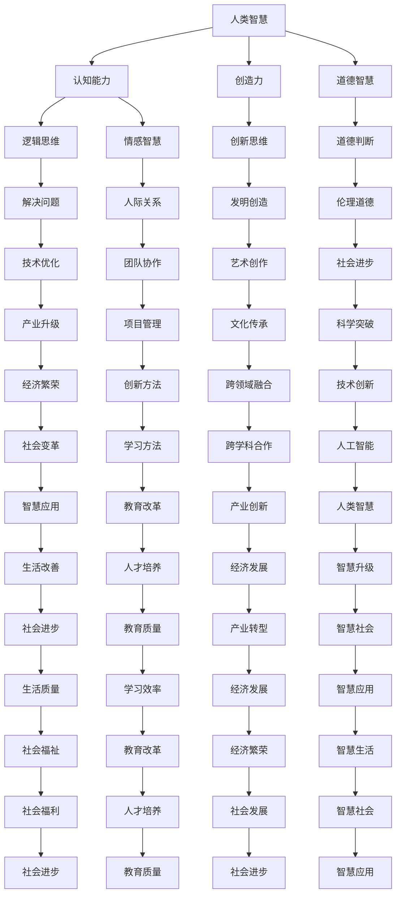

                 

关键词：人类智慧，人工智能，技术发展，创新，未来趋势

> 摘要：随着人工智能技术的飞速发展，人类智慧正在迎来新的挑战与机遇。本文将探讨AI时代下人类智慧的新特征、新应用以及未来发展展望。

## 1. 背景介绍

人工智能（AI）作为计算机科学的一个重要分支，近年来取得了令人瞩目的进展。从最初的专家系统到现代的深度学习、自然语言处理，AI技术在各行各业中发挥着越来越重要的作用。然而，随着AI技术的不断成熟，人类智慧是否依然具有独特价值成为了一个值得探讨的问题。

人类智慧与AI技术的关系可以类比于生物进化与人工智能的关系。生物进化使人类具备了独特的认知能力和创造力，而人工智能则通过模仿和学习这些能力，逐步实现了自动化和智能化。在这个过程中，人类智慧不仅是AI技术的驱动力，也是其重要评判标准。

本文旨在分析AI时代下人类智慧的新特征、新应用以及未来发展趋势，探讨人类与AI的协同创新路径，为读者提供有价值的思考与启示。

## 2. 核心概念与联系

### 2.1 人类智慧的概念

人类智慧是指人类在认知、思考、判断、解决问题等方面的能力。它包括逻辑思维、创新思维、情感智慧、道德智慧等多个方面。在AI时代，人类智慧的重要性不仅体现在对AI技术的理解与应用，还在于如何利用AI技术提升自身的智慧水平。

### 2.2 人工智能的概念

人工智能（AI）是指计算机系统模拟人类智能的过程。它包括机器学习、深度学习、自然语言处理、计算机视觉等多个领域。AI技术的发展使计算机具备了自我学习、推理、判断和执行任务的能力。

### 2.3 人类智慧与人工智能的联系

人类智慧与人工智能之间存在着密切的联系。一方面，人类智慧是AI技术的源头，为AI提供了灵感与方向。另一方面，AI技术的发展又为人类智慧提供了新的工具和平台，使得人类能够更加高效地解决问题、探索未知领域。

下面是一个使用Mermaid绘制的流程图，展示了人类智慧与人工智能之间的联系：



## 3. 核心算法原理 & 具体操作步骤

### 3.1 算法原理概述

在AI时代，核心算法原理主要涉及以下几个方面：

1. **机器学习算法**：通过训练数据集，使计算机能够自主学习和改进。
2. **深度学习算法**：模拟人脑神经网络，实现更高层次的智能。
3. **自然语言处理算法**：使计算机能够理解、生成和处理自然语言。
4. **计算机视觉算法**：使计算机能够识别和处理图像和视频。

这些算法共同构成了AI技术的基石，为人类智慧提供了强大的工具。

### 3.2 算法步骤详解

以下是几个核心算法的具体步骤：

#### 3.2.1 机器学习算法

1. **数据预处理**：清洗数据、去除噪声、归一化等。
2. **特征提取**：从数据中提取有用的信息。
3. **模型训练**：使用训练数据集训练模型。
4. **模型评估**：使用测试数据集评估模型性能。
5. **模型优化**：根据评估结果调整模型参数。

#### 3.2.2 深度学习算法

1. **神经网络结构设计**：确定网络层数、神经元数量等。
2. **前向传播**：计算输入信号在网络中的传播。
3. **反向传播**：根据输出误差调整网络参数。
4. **模型训练**：重复前向传播和反向传播过程，直至满足要求。
5. **模型评估**：使用测试数据集评估模型性能。

#### 3.2.3 自然语言处理算法

1. **分词**：将文本分割成单词或短语。
2. **词性标注**：对文本中的单词进行词性分类。
3. **句法分析**：分析文本的句法结构。
4. **语义理解**：理解文本中的语义信息。
5. **文本生成**：根据语义信息生成新的文本。

#### 3.2.4 计算机视觉算法

1. **图像预处理**：去除噪声、调整亮度等。
2. **特征提取**：从图像中提取有用的信息。
3. **目标检测**：识别图像中的目标对象。
4. **图像分类**：对图像进行分类。
5. **图像生成**：根据输入条件生成新的图像。

### 3.3 算法优缺点

不同算法在不同应用场景中具有各自的优缺点：

- **机器学习算法**：适合处理大规模数据，但需要大量的训练数据和计算资源。
- **深度学习算法**：具有强大的表征能力，但参数调整复杂，易陷入局部最优。
- **自然语言处理算法**：能够处理复杂的语义信息，但需要大量的标注数据。
- **计算机视觉算法**：对图像和视频的识别效果较好，但受限于算法本身的局限性。

### 3.4 算法应用领域

核心算法广泛应用于各个领域，如：

- **医疗健康**：疾病诊断、药物研发、健康管理。
- **金融理财**：风险评估、智能投顾、量化交易。
- **智能制造**：自动化生产线、智能检测、设备维护。
- **交通运输**：自动驾驶、智能交通管理、物流优化。
- **教育**：智能教学、在线教育、个性化推荐。

## 4. 数学模型和公式 & 详细讲解 & 举例说明

### 4.1 数学模型构建

在AI时代，数学模型构建是理解和使用人工智能技术的基础。以下是几个常见的数学模型：

#### 4.1.1 神经网络模型

神经网络模型是深度学习的基础，其数学模型如下：

$$
y = \sigma(W \cdot x + b)
$$

其中，\( y \) 是输出，\( \sigma \) 是激活函数，\( W \) 是权重矩阵，\( x \) 是输入，\( b \) 是偏置。

#### 4.1.2 支持向量机（SVM）模型

支持向量机是一种常用的分类算法，其数学模型如下：

$$
\min_{\textbf{w}} \frac{1}{2} ||\textbf{w}||^2 + C \sum_{i=1}^{n} \max(0, 1 - y_i (\textbf{w} \cdot \textbf{x}_i + b))
$$

其中，\( \textbf{w} \) 是权重向量，\( \textbf{x}_i \) 是输入特征，\( y_i \) 是标签，\( C \) 是惩罚参数，\( b \) 是偏置。

#### 4.1.3 决策树模型

决策树是一种常见的分类和回归算法，其数学模型如下：

$$
f(\textbf{x}) = \sum_{i=1}^{n} \alpha_i I(\textbf{x} \in R_i)
$$

其中，\( \textbf{x} \) 是输入特征，\( R_i \) 是第 \( i \) 个区域，\( \alpha_i \) 是权重。

### 4.2 公式推导过程

以下是对上述模型公式的推导过程：

#### 4.2.1 神经网络模型

神经网络模型的推导主要涉及矩阵乘法和激活函数。以下是详细推导：

$$
y = \sigma(z)
$$

$$
z = W \cdot x + b
$$

其中，\( \sigma \) 是 Sigmoid 激活函数，定义为：

$$
\sigma(z) = \frac{1}{1 + e^{-z}}
$$

#### 4.2.2 支持向量机（SVM）模型

SVM模型的推导主要涉及优化理论和最大间隔分类。以下是详细推导：

$$
L(\textbf{w}, b) = \frac{1}{2} ||\textbf{w}||^2 - \sum_{i=1}^{n} y_i (\textbf{w} \cdot \textbf{x}_i + b)
$$

$$
KKT条件：\begin{cases}
\frac{\partial L}{\partial \textbf{w}} = 0 \\
y_i (\textbf{w} \cdot \textbf{x}_i + b) - 1 \geq 0 \\
y_i (\textbf{w} \cdot \textbf{x}_i + b) \geq 1 - \epsilon_i
\end{cases}
$$

通过对上述条件求解，可以得到SVM的优化目标：

$$
\min_{\textbf{w}} \frac{1}{2} ||\textbf{w}||^2 + C \sum_{i=1}^{n} \max(0, 1 - y_i (\textbf{w} \cdot \textbf{x}_i + b))
$$

#### 4.2.3 决策树模型

决策树模型的推导主要涉及信息论和决策理论。以下是详细推导：

$$
H(\textbf{x}) = - \sum_{i=1}^{n} p_i \log_2 p_i
$$

其中，\( H(\textbf{x}) \) 是特征 \( \textbf{x} \) 的熵。

为了降低熵，我们需要选择最佳划分点。最佳划分点的选择依据是：

$$
\Delta H = H(\textbf{x}) - \sum_{i=1}^{n} p_i H(\textbf{x}_i)
$$

其中，\( \textbf{x}_i \) 是划分后的区域。

### 4.3 案例分析与讲解

以下是对几个实际案例的数学模型分析和讲解：

#### 4.3.1 医疗诊断

假设我们要开发一个基于深度学习的医疗诊断系统，输入为病人的医疗数据，输出为疾病类型。以下是数学模型的分析：

1. **数据预处理**：对医疗数据进行归一化处理，使其符合神经网络模型的输入要求。
2. **特征提取**：从医疗数据中提取重要的特征，如血压、心率等。
3. **神经网络模型**：使用卷积神经网络（CNN）对特征进行提取和分类。
4. **模型训练**：使用训练数据集对神经网络模型进行训练。
5. **模型评估**：使用测试数据集对模型进行评估，调整模型参数。
6. **模型应用**：将训练好的模型应用到实际诊断中。

数学模型的核心是卷积神经网络（CNN），其数学模型如下：

$$
h_{l}^{(k)}(i, j) = \text{ReLU} \left( \sum_{i^{\prime}, j^{\prime} \in \Omega_l} W_{l}^{(k)}(i^{\prime}, j^{\prime}, i, j) * f_{l}^{(k)}(i^{\prime}, j^{\prime}) + b_l^{(k)}(i, j) \right)
$$

其中，\( h_{l}^{(k)}(i, j) \) 是第 \( k \) 层第 \( l \) 个神经元的激活值，\( W_{l}^{(k)} \) 是权重矩阵，\( f_{l}^{(k)} \) 是激活函数，\( b_l^{(k)} \) 是偏置。

#### 4.3.2 金融市场预测

假设我们要开发一个基于机器学习的金融市场预测系统，输入为历史市场数据，输出为未来市场走势。以下是数学模型的分析：

1. **数据预处理**：对历史市场数据进行归一化处理，使其符合机器学习模型的输入要求。
2. **特征提取**：从历史市场数据中提取重要的特征，如价格、成交量等。
3. **机器学习模型**：使用线性回归模型进行市场预测。
4. **模型训练**：使用训练数据集对线性回归模型进行训练。
5. **模型评估**：使用测试数据集对模型进行评估，调整模型参数。
6. **模型应用**：将训练好的模型应用到实际预测中。

数学模型的核心是线性回归模型，其数学模型如下：

$$
y = \beta_0 + \beta_1 x_1 + \beta_2 x_2 + ... + \beta_n x_n
$$

其中，\( y \) 是预测结果，\( x_1, x_2, ..., x_n \) 是输入特征，\( \beta_0, \beta_1, \beta_2, ..., \beta_n \) 是模型参数。

#### 4.3.3 自动驾驶

假设我们要开发一个基于计算机视觉的自动驾驶系统，输入为摄像头采集的图像，输出为车辆的控制指令。以下是数学模型的分析：

1. **图像预处理**：对摄像头采集的图像进行预处理，如去噪、调整亮度等。
2. **特征提取**：从图像中提取重要的特征，如车道线、车辆等。
3. **计算机视觉模型**：使用卷积神经网络（CNN）进行图像识别和目标检测。
4. **控制策略**：根据检测结果生成车辆的控制指令。
5. **模型训练**：使用训练数据集对计算机视觉模型进行训练。
6. **模型评估**：使用测试数据集对模型进行评估，调整模型参数。
7. **模型应用**：将训练好的模型应用到实际自动驾驶中。

数学模型的核心是卷积神经网络（CNN），其数学模型如下：

$$
h_{l}^{(k)}(i, j) = \text{ReLU} \left( \sum_{i^{\prime}, j^{\prime} \in \Omega_l} W_{l}^{(k)}(i^{\prime}, j^{\prime}, i, j) * f_{l}^{(k)}(i^{\prime}, j^{\prime}) + b_l^{(k)}(i, j) \right)
$$

## 5. 项目实践：代码实例和详细解释说明

### 5.1 开发环境搭建

为了实践上述数学模型，我们需要搭建一个合适的开发环境。以下是搭建步骤：

1. **安装Python**：在官方网站下载并安装Python 3.x版本。
2. **安装Jupyter Notebook**：通过pip命令安装Jupyter Notebook。
3. **安装TensorFlow**：通过pip命令安装TensorFlow。
4. **安装其他依赖库**：如NumPy、Pandas、Matplotlib等。

### 5.2 源代码详细实现

以下是实现一个简单的机器学习模型的源代码：

```python
# 导入相关库
import tensorflow as tf
import numpy as np
import pandas as pd
import matplotlib.pyplot as plt

# 读取数据
data = pd.read_csv('data.csv')
X = data.iloc[:, :-1].values
y = data.iloc[:, -1].values

# 划分训练集和测试集
from sklearn.model_selection import train_test_split
X_train, X_test, y_train, y_test = train_test_split(X, y, test_size=0.2, random_state=42)

# 构建模型
model = tf.keras.Sequential([
    tf.keras.layers.Dense(units=1, input_shape=[1])
])

# 编译模型
model.compile(optimizer='sgd', loss='mean_squared_error')

# 训练模型
model.fit(X_train, y_train, epochs=100)

# 评估模型
loss = model.evaluate(X_test, y_test)
print(f'Mean squared error on test data: {loss}')

# 预测结果
predictions = model.predict(X_test)
predictions = predictions.flatten()

# 可视化结果
plt.scatter(X_test, y_test, color='blue')
plt.plot(X_test, predictions, color='red', linewidth=2)
plt.show()
```

### 5.3 代码解读与分析

1. **数据读取**：使用Pandas读取CSV数据文件，将数据分为输入特征 \( X \) 和标签 \( y \)。
2. **数据划分**：使用scikit-learn库的train_test_split函数将数据集划分为训练集和测试集，比例为80%训练集和20%测试集。
3. **模型构建**：使用TensorFlow的Sequential模型，添加一个全连接层（Dense Layer），输出层只有一个神经元，用于拟合线性关系。
4. **模型编译**：设置模型优化器为SGD（随机梯度下降），损失函数为均方误差（mean_squared_error）。
5. **模型训练**：使用fit函数训练模型，训练100个epochs。
6. **模型评估**：使用evaluate函数评估模型在测试集上的性能，输出均方误差。
7. **预测结果**：使用predict函数预测测试集的结果，并将预测结果转换为numpy数组。
8. **可视化结果**：使用Matplotlib库将测试集的真实值和预测值进行散点图绘制，并添加拟合直线。

## 6. 实际应用场景

### 6.1 医疗健康

在医疗健康领域，人工智能技术已经成为辅助医生诊断和治疗的重要工具。例如，基于深度学习的图像识别技术可以帮助医生快速识别疾病，如肺癌、乳腺癌等。同时，智能诊断系统可以通过分析大量患者数据，为医生提供更准确的诊断建议和治疗方案。

### 6.2 金融理财

在金融理财领域，人工智能技术被广泛应用于风险评估、智能投顾和量化交易等方面。例如，基于机器学习的风险评估模型可以实时监测市场风险，为金融机构提供风险预警和决策支持。智能投顾系统则可以通过分析用户风险偏好和历史交易数据，为用户提供个性化的投资建议。

### 6.3 智能制造

在智能制造领域，人工智能技术被广泛应用于自动化生产线、智能检测和设备维护等方面。例如，基于计算机视觉的智能检测系统可以实时监控生产线上的产品质量，及时发现缺陷并进行修复。智能设备维护系统则可以通过对设备运行数据的分析，预测设备故障并及时进行维护，降低设备停机时间。

### 6.4 教育领域

在教育领域，人工智能技术被广泛应用于智能教学、在线教育和个性化推荐等方面。例如，基于自然语言处理的智能教学系统可以根据学生的学习进度和理解能力，为学生提供个性化的学习资源和辅导。在线教育平台则可以通过分析用户行为数据，为用户提供更精准的学习推荐和课程推荐。

### 6.5 交通运输

在交通运输领域，人工智能技术被广泛应用于自动驾驶、智能交通管理和物流优化等方面。例如，自动驾驶技术可以通过计算机视觉和深度学习技术，实现车辆的自主驾驶。智能交通管理系统则可以通过分析交通数据，优化交通信号灯控制策略，提高道路通行效率。物流优化系统则可以通过分析运输路线和运输需求，为物流公司提供最优的运输方案。

## 7. 工具和资源推荐

### 7.1 学习资源推荐

1. **在线课程**：
   - 《机器学习》（吴恩达，Coursera）
   - 《深度学习》（阿斯顿·张，斯坦福大学）
   - 《自然语言处理》（丹尼尔·布拉克曼，Udacity）

2. **书籍**：
   - 《深度学习》（伊恩·古德费洛，约书亚·本吉奥，亚伦·库维尔）
   - 《Python机器学习》（塞巴斯蒂安·拉金）
   - 《人工智能：一种现代方法》（斯图尔特·罗素，彼得·诺维格）

3. **博客和社区**：
   - Medium上的AI和机器学习相关文章
   - GitHub上的AI和机器学习项目
   - AI社区和论坛（如AIChat、AI Stack Exchange）

### 7.2 开发工具推荐

1. **编程语言**：
   - Python：最受欢迎的AI开发语言，拥有丰富的库和工具。
   - R：专门针对统计分析的编程语言，适用于数据科学和机器学习。

2. **框架和库**：
   - TensorFlow：Google开发的开源深度学习框架。
   - PyTorch：Facebook开发的开源深度学习框架。
   - Scikit-learn：Python中的机器学习库。

3. **可视化工具**：
   - Matplotlib：Python中的数据可视化库。
   - Seaborn：基于Matplotlib的统计数据可视化库。
   - Plotly：交互式数据可视化库。

### 7.3 相关论文推荐

1. **深度学习领域**：
   - "Deep Learning"（伊恩·古德费洛，约书亚·本吉奥，亚伦·库维尔）
   - "Visual Geometry Group"（亚历克斯·克雷斯吉，牛津大学）
   - "Deep Learning on Mobile Devices"（Zico Kolter，卡内基梅隆大学）

2. **自然语言处理领域**：
   - "Natural Language Processing with Python"（Steven Bird，Ewan Klein，Edward Loper）
   - "The Unreasonable Effectiveness of Recurrent Neural Networks"（Rajpurkar et al.，Google）
   - "Seq2Seq Models for Language Processing"（Quoc Le，Google）

3. **计算机视觉领域**：
   - "Object Detection with Deep Learning"（Joseph Redmon，Facebook AI Research）
   - "Convolutional Neural Networks for Visual Recognition"（Karen Simonyan，Andrew Zisserman）
   - "R-CNN: Region-based Convolutional Neural Networks"（Ross Girshick，Carson Szegedy，Christian Hinton）

## 8. 总结：未来发展趋势与挑战

### 8.1 研究成果总结

随着人工智能技术的不断发展，人类智慧在AI时代展现出了新的特征和应用。通过对核心算法原理的深入研究，我们能够更好地理解AI技术的本质，并利用其解决实际问题。同时，数学模型和公式的推导过程为AI技术的发展提供了坚实的理论基础。

### 8.2 未来发展趋势

1. **跨学科融合**：人工智能技术将与其他学科（如生物学、心理学、哲学等）进行深度融合，为人类智慧提供更多创新可能。
2. **人机协同**：人工智能将与人类智慧实现更高层次的协同，共同解决复杂问题。
3. **自主进化**：人工智能技术将逐渐具备自我学习和进化能力，提高智能水平。
4. **智能伦理**：在人工智能的发展过程中，智能伦理问题将受到越来越多的关注，确保技术发展的可持续性。

### 8.3 面临的挑战

1. **数据隐私与安全**：随着人工智能技术的广泛应用，数据隐私和安全问题将愈发突出。
2. **算法透明性与可解释性**：如何确保算法的透明性和可解释性，使其符合人类智慧的要求。
3. **技术滥用**：人工智能技术可能被用于恶意目的，对人类社会造成负面影响。
4. **就业问题**：随着人工智能技术的发展，部分传统行业可能面临就业压力，需要新的就业模式和职业培训。

### 8.4 研究展望

为了应对未来发展趋势和挑战，我们需要：

1. **加强基础研究**：深入探讨人工智能技术的本质和理论基础，为技术创新提供支持。
2. **推动产业应用**：积极推动人工智能技术在各行业的应用，提高社会生产力。
3. **培养人才**：加强人工智能人才的培养，提高社会整体智能水平。
4. **关注伦理问题**：在人工智能技术的发展过程中，关注伦理问题，确保技术发展的可持续性。

## 9. 附录：常见问题与解答

### 9.1 人工智能与人类智慧的关系是什么？

人工智能与人类智慧密切相关。人工智能技术是模仿人类智慧的过程，而人类智慧则为人工智能提供了灵感与方向。在AI时代，人类智慧不仅体现在对AI技术的理解与应用，还在于如何利用AI技术提升自身的智慧水平。

### 9.2 人工智能算法有哪些？

人工智能算法主要包括机器学习算法、深度学习算法、自然语言处理算法和计算机视觉算法等。这些算法在不同应用场景中具有各自的优缺点和特点。

### 9.3 人工智能技术在哪些领域有应用？

人工智能技术在医疗健康、金融理财、智能制造、教育、交通运输等多个领域有广泛应用。例如，在医疗健康领域，人工智能技术可以帮助医生进行疾病诊断和治疗；在金融理财领域，人工智能技术可以提供风险评估和智能投顾服务。

### 9.4 人工智能的发展对人类社会有什么影响？

人工智能技术的发展对人类社会产生了深远的影响。一方面，人工智能技术提高了社会生产力，推动了经济发展；另一方面，人工智能技术也带来了数据隐私和安全、算法透明性与可解释性、技术滥用等挑战。因此，我们需要关注人工智能技术的伦理问题，确保其可持续发展。

