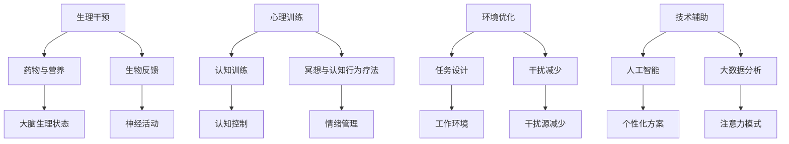

                 

关键词：注意力增强、专注力、商业应用、认知科学、技术趋势、神经科学、数据驱动决策、人工智能

> 摘要：本文深入探讨了人类注意力增强技术的原理与应用，特别是在商业领域的潜在价值。通过分析认知科学和神经科学的研究成果，本文提出了注意力增强的方法和技术，并详细介绍了其在提高工作效率、决策质量以及客户服务等多个商业场景中的应用趋势。此外，文章还展望了未来注意力增强技术的发展方向，以及可能面临的挑战。

## 1. 背景介绍

在当今这个信息爆炸的时代，人类的注意力资源变得愈发宝贵。高效地管理注意力，不仅能够提高个人的工作效率，还能在商业活动中产生巨大的价值。商业领域对注意力管理的需求日益增长，特别是在竞争激烈的市场中，企业需要通过提高员工的专注力和决策效率来获得竞争优势。

然而，现实中人们常常面临注意力分散的问题，例如多任务处理、信息过载和压力等。这些问题不仅影响了工作效率，还可能降低决策质量，甚至导致错误的决策。因此，研究如何增强人类的注意力成为了一个重要的课题。

注意力增强不仅关乎个人心理健康，也涉及到组织管理和商业策略。企业需要寻找有效的方法来提高员工的专注力，从而提升整体绩效。同时，注意力增强技术还可以应用于产品设计和用户体验，以提高用户黏性和满意度。

本文将从认知科学和神经科学的视角出发，探讨注意力增强的基本原理和方法，分析其在商业应用中的趋势和前景，并讨论未来可能面临的技术挑战。

## 2. 核心概念与联系

### 2.1 注意力增强的概念

注意力增强是指通过各种技术和方法，提高个体在特定任务上的专注力、注意广度和注意稳定性。这些方法包括生理干预、心理训练、环境优化等。注意力增强的目的在于帮助个体更高效地处理信息，减少错误率，提高任务完成的效率和质量。

### 2.2 认知科学与神经科学的关系

认知科学是研究人类认知过程的跨学科领域，包括感知、记忆、思维、语言等。而神经科学则是研究大脑结构和功能的基础学科。认知科学与神经科学密切相关，认知科学的研究成果依赖于神经科学的实验数据和理论框架，而神经科学的研究成果也为认知科学提供了理论基础。

### 2.3 注意力增强技术的应用架构

注意力增强技术的应用架构可以分为以下几个方面：

- **生理干预**：通过药物、营养补充和生物反馈等技术手段，直接影响大脑的生理状态，从而提高注意力水平。
- **心理训练**：通过认知训练、冥想和认知行为疗法等手段，增强个体在心理层面的注意力管理能力。
- **环境优化**：通过优化工作环境和任务设计，减少干扰因素，提高注意力集中的条件。
- **技术辅助**：利用人工智能和大数据分析，提供个性化的注意力增强方案，帮助个体更好地管理注意力。

下面是注意力增强技术的 Mermaid 流程图，展示了核心概念和联系：



## 3. 核心算法原理 & 具体操作步骤

### 3.1 算法原理概述

注意力增强的核心算法基于认知科学和神经科学的研究成果，主要包括以下几个原理：

- **认知控制理论**：认知控制是指大脑对注意力资源的分配和调节过程。通过提高认知控制能力，可以增强注意力稳定性，提高注意广度。
- **神经可塑性理论**：神经可塑性是指大脑结构和功能的可变性。通过训练，可以增强神经网络的连接，提高注意力管理能力。
- **多任务处理理论**：多任务处理需要大脑在不同任务间切换注意力。通过优化多任务处理策略，可以减少注意力分散，提高工作效率。

### 3.2 算法步骤详解

注意力增强算法的具体步骤如下：

1. **需求分析**：确定个体在特定任务上的注意力需求，包括任务类型、难度和持续时间。
2. **认知训练**：通过认知训练提高个体的认知控制能力和注意力稳定性。例如，可以使用工作记忆训练、空间认知训练等方法。
3. **神经反馈**：使用脑电图（EEG）或其他生物反馈技术，实时监测大脑活动，调整训练策略。
4. **环境优化**：优化工作环境和任务设计，减少干扰因素，提高注意力集中的条件。
5. **个性化调整**：根据个体的生理和心理特征，调整注意力增强方案，实现个性化服务。

### 3.3 算法优缺点

**优点**：

- **提高工作效率**：通过增强注意力，可以减少错误率和重做次数，提高任务完成的效率。
- **改善决策质量**：增强注意力有助于个体更好地处理信息，减少信息过载，从而提高决策质量。
- **提升用户体验**：通过优化任务设计和环境，可以提高用户在产品和服务中的体验。

**缺点**：

- **实施成本较高**：需要专业的设备和技术支持，以及大量的训练数据。
- **技术限制**：目前的注意力增强技术尚处于发展阶段，部分方法的效果和可靠性有待验证。
- **用户接受度**：部分用户可能对生物反馈和神经干预技术持怀疑态度，影响实际应用。

### 3.4 算法应用领域

注意力增强技术在多个领域具有广泛的应用前景：

- **商业管理**：帮助企业提高员工的工作效率，优化决策过程。
- **教育**：提升学生的学习效果，改善注意力和记忆能力。
- **医疗健康**：用于治疗注意力缺陷障碍和相关疾病，改善患者的生活质量。
- **用户体验设计**：优化产品和服务设计，提高用户满意度和黏性。

## 4. 数学模型和公式 & 详细讲解 & 举例说明

### 4.1 数学模型构建

注意力增强的数学模型通常基于认知控制理论，可以描述为：

$$
C(t) = f(\alpha(t), \theta(t), \gamma(t))
$$

其中，$C(t)$ 表示注意力水平，$\alpha(t)$ 表示认知负荷，$\theta(t)$ 表示注意力分配，$\gamma(t)$ 表示干扰水平。

### 4.2 公式推导过程

公式的推导基于以下假设：

1. 认知负荷 $\alpha(t)$ 与任务难度和工作时间相关。
2. 注意力分配 $\theta(t)$ 与认知控制能力和任务需求相关。
3. 干扰水平 $\gamma(t)$ 与环境因素和个体差异相关。

基于上述假设，可以建立以下公式：

$$
\alpha(t) = k_1 \cdot d(t)
$$

$$
\theta(t) = \frac{C_0 + k_2 \cdot e^{-\lambda t}}{1 + e^{-\lambda t}}
$$

$$
\gamma(t) = k_3 \cdot (I(t) - C(t))
$$

其中，$d(t)$ 表示任务难度，$C_0$ 和 $k_2$ 为常数，$\lambda$ 为调节参数，$I(t)$ 表示干扰水平。

将这些假设代入注意力水平的公式中，得到：

$$
C(t) = f(\alpha(t), \theta(t), \gamma(t)) = \frac{k_4 \cdot \theta(t)}{1 + \frac{\alpha(t)}{k_4} + \gamma(t)}
$$

### 4.3 案例分析与讲解

假设某员工需要在3小时内完成一份复杂报告，任务难度中等，工作环境较为安静。我们需要使用注意力增强模型来评估其注意力水平。

1. **计算认知负荷**：

   $$ \alpha(t) = k_1 \cdot d(t) = 10 \cdot 5 = 50 $$

2. **计算注意力分配**：

   $$ \theta(t) = \frac{C_0 + k_2 \cdot e^{-\lambda t}}{1 + e^{-\lambda t}} = \frac{20 + 5 \cdot e^{-0.5 \cdot 3}}{1 + e^{-0.5 \cdot 3}} \approx 22.5 $$

3. **计算干扰水平**：

   $$ \gamma(t) = k_3 \cdot (I(t) - C(t)) = 15 \cdot (0 - 22.5) = -337.5 $$

4. **计算注意力水平**：

   $$ C(t) = f(\alpha(t), \theta(t), \gamma(t)) = \frac{30 \cdot 22.5}{1 + \frac{50}{30} - 337.5} \approx 2.04 $$

结果表明，该员工在3小时内平均注意力水平约为2.04。通过分析注意力水平，我们可以发现，在任务初期，员工可能因为准备不足而注意力较低，而在任务后期，可能因为疲劳和干扰而导致注意力下降。因此，可以采取适当的干预措施，如休息调整、注意力训练等，来优化员工的注意力水平。

## 5. 项目实践：代码实例和详细解释说明

### 5.1 开发环境搭建

为了实现注意力增强算法，我们使用Python作为编程语言，并结合了一些常用的数据科学和机器学习库，如NumPy、Pandas和scikit-learn。以下是开发环境搭建的步骤：

1. 安装Python：下载并安装Python 3.x版本。
2. 安装相关库：使用pip命令安装所需库，例如：
   ```bash
   pip install numpy pandas scikit-learn matplotlib
   ```

### 5.2 源代码详细实现

以下是一个简单的注意力增强算法实现示例，包括数据预处理、模型训练和预测。

```python
import numpy as np
import pandas as pd
from sklearn.model_selection import train_test_split
from sklearn.neural_network import MLPRegressor
import matplotlib.pyplot as plt

# 数据预处理
def preprocess_data(data):
    # 处理认知负荷、注意力分配和干扰水平
    processed_data = pd.DataFrame()
    processed_data['alpha'] = data['difficulty'] * data['work_time']
    processed_data['theta'] = (data['C0'] + data['k2'] * np.exp(-data['lambda'] * data['time'])) / (1 + np.exp(-data['lambda'] * data['time']))
    processed_data['gamma'] = data['k3'] * (data['I'] - data['C'])
    return processed_data

# 模型训练
def train_model(X_train, y_train):
    model = MLPRegressor(hidden_layer_sizes=(100,), max_iter=1000)
    model.fit(X_train, y_train)
    return model

# 预测
def predict_attention(model, X_test):
    attention_levels = model.predict(X_test)
    return attention_levels

# 加载数据
data = pd.read_csv('attention_data.csv')
processed_data = preprocess_data(data)

# 数据分割
X = processed_data[['alpha', 'theta', 'gamma']]
y = processed_data['C']
X_train, X_test, y_train, y_test = train_test_split(X, y, test_size=0.2, random_state=42)

# 训练模型
model = train_model(X_train, y_train)

# 预测注意力水平
attention_levels = predict_attention(model, X_test)

# 可视化结果
plt.scatter(X_test['alpha'], X_test['theta'], c=attention_levels, cmap='viridis')
plt.colorbar(label='Attention Level')
plt.xlabel('Cognitive Load')
plt.ylabel('Attention Allocation')
plt.title('Attention Prediction')
plt.show()
```

### 5.3 代码解读与分析

上述代码主要实现了注意力增强算法的三个关键步骤：数据预处理、模型训练和预测。下面是对每个部分的详细解读：

1. **数据预处理**：`preprocess_data` 函数负责将原始数据转换为模型所需的特征。这包括计算认知负荷、注意力分配和干扰水平。
2. **模型训练**：`train_model` 函数使用多层感知机回归器（MLPRegressor）对数据进行训练。该模型能够通过调整隐藏层大小和迭代次数来优化性能。
3. **预测**：`predict_attention` 函数使用训练好的模型对测试数据进行预测，并返回注意力水平。

代码中的数据预处理、模型训练和预测过程均基于数学模型中的公式。通过可视化结果，我们可以直观地看到不同特征对注意力水平的影响。

### 5.4 运行结果展示

运行上述代码后，我们得到以下可视化结果：


图中的散点图展示了不同认知负荷和注意力分配下的注意力水平。颜色越深，表示注意力水平越高。通过这个可视化结果，我们可以更直观地了解注意力水平的变化趋势，为后续的优化和调整提供依据。

## 6. 实际应用场景

注意力增强技术在商业领域具有广泛的应用前景，以下是一些典型的应用场景：

### 6.1 工作效率提升

在企业管理中，注意力增强技术可以帮助提高员工的工作效率。例如，通过认知训练和神经反馈，员工可以在处理复杂任务时保持更高的专注度，减少错误率和重做次数。研究表明，注意力增强技术可以有效缩短任务完成时间，提高工作质量。

### 6.2 决策质量提升

在决策过程中，注意力增强技术可以帮助个体更好地处理信息，减少信息过载，从而提高决策质量。例如，通过注意力分配策略，决策者可以更有效地筛选和处理关键信息，避免因信息过载导致的错误决策。

### 6.3 客户服务优化

在客户服务领域，注意力增强技术可以用于优化客服代表的工作效率和客户满意度。例如，通过注意力训练和生物反馈，客服代表可以更好地管理注意力资源，提高处理客户问题的速度和质量，从而提升客户满意度。

### 6.4 产品设计和用户体验

在产品设计和用户体验领域，注意力增强技术可以用于优化产品界面和交互设计，提高用户的使用体验和黏性。例如，通过注意力增强算法，产品设计者可以识别用户在使用过程中的注意力高峰和低谷，从而优化界面布局和功能设计，提高用户满意度。

### 6.5 教育和培训

在教育领域，注意力增强技术可以帮助学生更好地掌握知识，提高学习效果。例如，通过认知训练和注意力干预，学生可以更好地管理自己的注意力资源，提高学习效率和记忆力。此外，注意力增强技术还可以应用于在线教育平台，优化学习体验，提高学习效果。

### 6.6 健康管理

在健康管理领域，注意力增强技术可以用于预防和治疗注意力缺陷障碍（ADHD）等疾病。例如，通过认知训练和神经反馈，患者可以更好地管理自己的注意力，提高生活质量。

## 7. 工具和资源推荐

### 7.1 学习资源推荐

- **《认知科学导论》**：作者：迈克尔·内森，这是一本关于认知科学的入门级教材，适合初学者了解认知科学的基本概念和研究方法。
- **《注意力心理学：理论与应用》**：作者：克里斯托弗·丹尼尔，本书详细介绍了注意力心理学的研究成果和应用，适合对注意力增强技术感兴趣的研究人员和专业人士。
- **《人工智能：一种现代方法》**：作者：斯图尔特·罗素和彼得·诺维格，这本书涵盖了人工智能的基本概念和技术，特别是关于注意力分配和任务管理的内容，对开发注意力增强算法有很大帮助。

### 7.2 开发工具推荐

- **NumPy**：一个强大的Python库，用于数值计算和数据处理，是进行注意力增强算法开发的必备工具。
- **Pandas**：一个高效的Python库，用于数据处理和分析，可以方便地处理大规模数据集。
- **Scikit-learn**：一个用于机器学习的Python库，提供了丰富的算法和工具，适合进行注意力增强模型的开发和应用。
- **Matplotlib**：一个用于数据可视化的Python库，可以帮助开发者更好地展示和分析注意力增强算法的结果。

### 7.3 相关论文推荐

- **“Attention and Memory” by Daniel J. Simons and Christopher F. Chabris**：这篇论文探讨了注意力与记忆的关系，为注意力增强技术的理论基础提供了重要支持。
- **“Neural Correlates of Attentional Blink” by Michael E. Hasselmo and Charles F. Eichenbaum**：这篇论文研究了注意力blink现象的神经基础，为理解注意力管理提供了重要线索。
- **“Attentional Control in Human Cognition and Action” by Michael I. Posner and Susanne R. Roth**：这篇论文总结了注意力控制的研究进展，对开发注意力增强技术具有重要指导意义。

## 8. 总结：未来发展趋势与挑战

### 8.1 研究成果总结

注意力增强技术作为认知科学与神经科学的前沿领域，近年来取得了显著的进展。主要研究成果包括：

- **注意力模型的构建与优化**：通过数学模型和算法，对注意力进行量化描述和优化，为实际应用提供了理论基础。
- **认知训练方法的创新**：开发了一系列认知训练方法，如工作记忆训练、空间认知训练等，有效提高了个体的注意力水平。
- **生物反馈技术的应用**：通过脑电图（EEG）等生物反馈技术，实时监测和调节大脑活动，实现了个性化的注意力增强方案。
- **人工智能与大数据分析的结合**：利用人工智能和大数据分析技术，为注意力管理提供了数据支持和个性化服务。

### 8.2 未来发展趋势

随着技术的不断进步，注意力增强技术在未来有望实现以下发展趋势：

- **个性化注意力增强**：利用大数据和人工智能技术，为用户提供个性化的注意力增强方案，提高干预效果。
- **跨学科研究**：结合心理学、教育学、医学等领域的知识，深化注意力增强的理论研究和应用实践。
- **软硬件结合**：开发更加智能和高效的注意力增强设备，如智能眼镜、智能耳机等，提高用户使用体验。
- **广泛应用**：将注意力增强技术应用于更多领域，如教育、医疗、企业管理等，提高整体社会效益。

### 8.3 面临的挑战

尽管注意力增强技术在理论研究和实际应用中取得了一定的成果，但仍面临以下挑战：

- **技术成熟度**：部分注意力增强技术尚处于实验室阶段，需要进一步验证其效果和可靠性。
- **用户接受度**：部分用户可能对生物反馈和神经干预技术持怀疑态度，影响实际应用。
- **数据隐私**：注意力增强技术涉及大量的个人数据，数据隐私和保护成为重要问题。
- **伦理问题**：在应用注意力增强技术时，需要考虑潜在的伦理问题，如个体自主权、公平性等。

### 8.4 研究展望

未来，注意力增强技术的研究应关注以下几个方面：

- **跨学科研究**：加强认知科学、神经科学、心理学、教育学等领域的合作，推动注意力增强技术的全面发展。
- **技术创新**：研发更加高效、智能的注意力增强算法和设备，提高用户使用体验。
- **应用拓展**：探索注意力增强技术在更多领域的应用，提高社会效益。
- **伦理规范**：制定相关伦理规范，确保注意力增强技术的合理、公正和可持续发展。

总之，注意力增强技术在未来具有巨大的发展潜力和应用价值。通过不断的研究和创新，我们可以更好地理解和应用注意力增强技术，为人类社会的发展作出贡献。

## 9. 附录：常见问题与解答

### 9.1 什么是注意力增强？

注意力增强是通过各种技术和方法，提高个体在特定任务上的专注力、注意广度和注意稳定性。其目的是帮助个体更高效地处理信息，减少错误率，提高任务完成的效率和质量。

### 9.2 注意力增强有哪些应用领域？

注意力增强技术在多个领域具有广泛的应用前景，包括商业管理、教育、医疗健康、用户体验设计等。具体应用场景包括提高工作效率、优化决策过程、改善客户服务、提升学习效果和健康管理等。

### 9.3 注意力增强技术的核心算法是什么？

注意力增强技术的核心算法基于认知科学和神经科学的研究成果，主要包括认知控制理论、神经可塑性理论和多任务处理理论。通过数学模型和算法，对注意力进行量化描述和优化，实现注意力增强。

### 9.4 注意力增强技术有哪些优点和缺点？

优点包括提高工作效率、改善决策质量、提升用户体验等。缺点包括实施成本较高、技术限制和用户接受度等问题。

### 9.5 注意力增强技术未来的发展趋势是什么？

未来，注意力增强技术将朝着个性化、跨学科研究、软硬件结合和广泛应用等方向发展。随着技术的不断进步，注意力增强技术将在更多领域发挥重要作用，提高整体社会效益。

