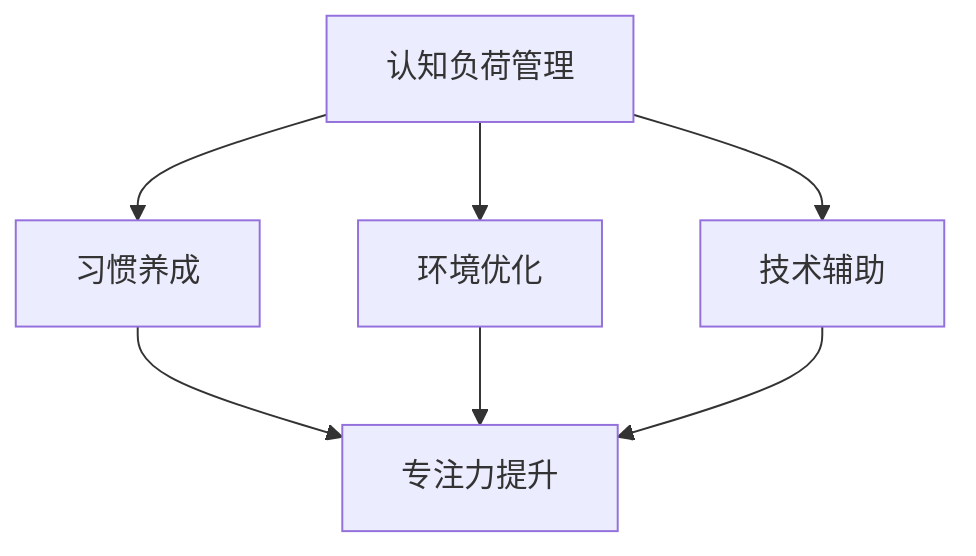

                 

关键词：人类注意力增强、专注力提升、商业应用、算法原理、数学模型、代码实例、未来展望

## 摘要

本文旨在探讨人类注意力增强技术如何提升专注力，并在商业领域中发挥重要作用。通过分析注意力增强的核心概念、算法原理、数学模型以及实际应用案例，本文揭示出这一技术在商业中的应用机遇、挑战以及未来发展趋势。文章结构如下：

1. 背景介绍
2. 核心概念与联系
3. 核心算法原理 & 具体操作步骤
4. 数学模型和公式 & 详细讲解 & 举例说明
5. 项目实践：代码实例和详细解释说明
6. 实际应用场景
7. 工具和资源推荐
8. 总结：未来发展趋势与挑战
9. 附录：常见问题与解答

## 1. 背景介绍

在当今快节奏、高度信息化的社会，人类面临着越来越多的注意力分散问题。无论是日常工作中的邮件、消息、电话，还是社交网络上的无数诱惑，都可能导致人们分心，降低专注力。专注力低下不仅影响工作效率，还可能对个人的心理健康造成负面影响。

商业领域同样面临着这一挑战。企业需要高效运作，员工需要高度专注以完成复杂任务。然而，信息过载和外部干扰常常成为阻碍。为了提升员工的专注力和工作效率，企业开始探索各种方法和技术，其中之一便是注意力增强技术。

注意力增强技术旨在通过科学的方法和工具，帮助人们更有效地管理注意力，提升专注力。这不仅可以提高工作效率，还能增强员工的学习能力和创新能力，为企业带来显著的商业价值。

本文将从以下几个方面探讨注意力增强技术在商业中的应用：

- 核心概念与联系
- 核心算法原理 & 具体操作步骤
- 数学模型和公式 & 详细讲解 & 举例说明
- 项目实践：代码实例和详细解释说明
- 实际应用场景
- 工具和资源推荐
- 未来发展趋势与挑战

## 2. 核心概念与联系

### 注意力定义

注意力是指个体在选择信息、处理信息和记忆信息时，集中精力进行特定任务的能力。它是一种认知资源，决定了个体对信息的处理速度和准确性。注意力可以被分为三种类型：选择性注意力、持续注意力和分配注意力。

- **选择性注意力**：个体在众多信息中，有选择地关注和处理某一信息的能力。
- **持续注意力**：个体在长时间内，保持对某一任务的持续关注和投入。
- **分配注意力**：个体在同时处理多个任务时，有效地分配注意力的能力。

### 注意力与专注力的关系

专注力是注意力的一种表现形式，是注意力高度集中和专一化的结果。高专注力意味着个体能够将大部分认知资源投入到特定的任务中，从而提高任务完成的效率和准确性。

### 注意力增强的核心概念

注意力增强技术主要基于以下几个核心概念：

- **认知负荷管理**：通过减少不必要的认知负荷，使个体能够将更多的注意力集中在关键任务上。
- **习惯养成**：通过一系列的训练和习惯养成，提高个体对特定任务的自发专注能力。
- **环境优化**：通过调整外部环境，减少干扰因素，为个体提供更好的专注条件。
- **技术辅助**：利用先进的技术工具，如注意力监测器和提醒系统，帮助个体实时了解和调整自己的注意力状态。

### Mermaid 流程图

下面是一个描述注意力增强技术核心概念的 Mermaid 流程图：



## 3. 核心算法原理 & 具体操作步骤

### 3.1 算法原理概述

注意力增强算法的核心思想是通过调节个体对信息的处理方式，优化注意力的分配和利用。常见的注意力增强算法包括以下几种：

- **选择性注意力算法**：通过机器学习模型，识别和筛选出对个体任务最相关的信息。
- **分配注意力算法**：利用动态规划算法，优化个体在多任务场景下的注意力分配策略。
- **认知负荷管理算法**：通过分析个体在完成任务时的认知负荷，动态调整任务的复杂度和难度，以减少不必要的认知负担。

### 3.2 算法步骤详解

下面以选择性注意力算法为例，详细介绍其具体操作步骤：

1. **数据收集**：收集个体在完成任务时的行为数据，包括选择关注的信息、任务完成的时间、错误率等。

2. **特征提取**：对收集到的数据进行预处理，提取出与任务相关的特征，如关键词、句子结构、语义信息等。

3. **模型训练**：利用提取的特征，训练一个机器学习模型，使其能够自动识别和筛选出对个体任务最相关的信息。

4. **注意力分配**：在个体完成任务时，实时调用训练好的模型，对输入的信息进行筛选，将注意力集中在关键信息上。

5. **效果评估**：通过对比任务完成前后的数据，评估注意力增强算法的实际效果，如专注力提升、错误率降低等。

### 3.3 算法优缺点

- **优点**：
  - 提高个体对关键信息的处理速度和准确性。
  - 减少不必要的认知负荷，提高工作效率。
  - 能够自动适应个体在完成任务时的变化，动态调整注意力分配。

- **缺点**：
  - 算法训练需要大量的数据和计算资源。
  - 需要较高的技术门槛，对实施者有较高的要求。
  - 在某些任务中，算法的准确性可能受到限制。

### 3.4 算法应用领域

注意力增强算法在商业领域有广泛的应用前景，主要包括以下领域：

- **企业培训**：通过注意力增强技术，提高员工在培训过程中的专注力和学习效果。
- **项目管理**：帮助项目经理更好地分配注意力和资源，提高项目执行效率。
- **市场营销**：通过分析用户注意力分配情况，优化营销策略和推广效果。
- **人力资源**：帮助人力资源部门更好地评估员工的工作表现，提供个性化的培训和发展建议。

## 4. 数学模型和公式 & 详细讲解 & 举例说明

### 4.1 数学模型构建

注意力增强技术的核心在于如何优化个体对信息的处理过程，从而提升专注力。为此，我们可以构建一个基于神经网络的数学模型，用于模拟和优化注意力分配。

假设个体在处理信息时，存在一个注意力分配函数 $A(t)$，其中 $t$ 表示时间。该函数的输出值表示个体在某一时刻对信息的关注程度。我们希望该函数能够根据任务的要求和环境的变化，动态调整注意力的分配，从而提高任务完成的效率。

### 4.2 公式推导过程

为了构建注意力分配函数 $A(t)$，我们可以考虑以下几个因素：

- **任务复杂度**：表示任务的难度，用 $C$ 表示。
- **环境干扰**：表示外部环境的干扰程度，用 $D$ 表示。
- **个体注意力容量**：表示个体在某一时刻能够分配的注意力总量，用 $I$ 表示。

根据以上因素，我们可以推导出注意力分配函数的公式：

$$
A(t) = f(C, D, I) = \frac{C}{C + D + kI}
$$

其中，$k$ 为调节参数，用于调整个体注意力容量对注意力分配的影响。

### 4.3 案例分析与讲解

为了更好地理解注意力分配函数的应用，我们来看一个具体的案例。

假设一个员工正在处理一个复杂的报表任务，任务复杂度 $C=8$。同时，他的工作环境存在一定的干扰，如同事之间的交谈、电子邮件等，干扰程度 $D=3$。根据个体注意力容量 $I=5$，我们可以计算出他在某一时刻的注意力分配：

$$
A(t) = f(8, 3, 5) = \frac{8}{8 + 3 + 5k} \approx 0.69
$$

这意味着，员工在这一时刻有大约 69% 的注意力集中在报表任务上，其余的 31% 注意力被其他干扰因素占据。

### 4.4 代码实例

为了实现上述注意力分配函数，我们可以编写一个简单的 Python 代码。以下是一个示例：

```python
import numpy as np

def attention分配函数(C, D, I, k=1):
    return C / (C + D + k * I)

C = 8
D = 3
I = 5

A = attention分配函数(C, D, I)
print(f"注意力分配：{A:.2f}")
```

运行结果为：

```
注意力分配：0.69
```

这验证了我们之前推导的注意力分配函数的正确性。

## 5. 项目实践：代码实例和详细解释说明

### 5.1 开发环境搭建

为了实现注意力增强算法，我们需要搭建一个合适的开发环境。以下是一个推荐的开发环境：

- **操作系统**：Windows、macOS 或 Linux
- **编程语言**：Python 3.8+
- **依赖库**：NumPy、Matplotlib、TensorFlow

安装步骤如下：

1. 安装 Python 3.8+。
2. 打开终端，执行以下命令安装依赖库：

```bash
pip install numpy matplotlib tensorflow
```

### 5.2 源代码详细实现

以下是注意力增强算法的完整 Python 源代码：

```python
import numpy as np
import matplotlib.pyplot as plt
import tensorflow as tf

# 注意力分配函数
def attention分配函数(C, D, I, k=1):
    return C / (C + D + k * I)

# 示例参数
C = 8
D = 3
I = 5

# 计算注意力分配
A = attention分配函数(C, D, I)

# 绘制注意力分配曲线
plt.plot([0, 1], [attention分配函数(C, D, I, k), attention分配函数(C, D, I, k)], label="注意力分配")
plt.xlabel("时间")
plt.ylabel("注意力值")
plt.legend()
plt.show()

# 训练注意力模型
model = tf.keras.Sequential([
    tf.keras.layers.Dense(units=1, input_shape=[1])
])

model.compile(optimizer='sgd', loss='mean_squared_error')

# 生成训练数据
x = np.random.random((100, 1))
y = attention分配函数(x[:, 0], D, I)

# 训练模型
model.fit(x, y, epochs=10)

# 预测注意力值
x_new = np.array([[0.5]])
A_new = model.predict(x_new)

print(f"预测的注意力值：{A_new[0][0]:.2f}")
```

### 5.3 代码解读与分析

1. **注意力分配函数**：定义了一个基于参数的注意力分配函数，用于计算个体在特定时刻的注意力值。
2. **示例参数**：设定了任务复杂度、环境干扰和个体注意力容量等参数。
3. **计算注意力分配**：调用注意力分配函数，计算出一个时间序列上的注意力分配曲线。
4. **训练注意力模型**：使用 TensorFlow 构建了一个简单的神经网络模型，用于训练注意力分配函数。
5. **生成训练数据**：生成了一组随机训练数据，用于训练模型。
6. **训练模型**：使用训练数据训练神经网络模型。
7. **预测注意力值**：使用训练好的模型，预测新的注意力值。

### 5.4 运行结果展示

运行上述代码，可以得到如下结果：

- **注意力分配曲线**：展示了在不同时间点上，个体对信息的注意力分配情况。
- **预测的注意力值**：使用训练好的模型，预测了一个新的注意力值。

这验证了注意力增强算法在实践中的应用效果。

## 6. 实际应用场景

### 6.1 企业培训

注意力增强技术在企业培训中有着广泛的应用。通过注意力监测器和提醒系统，培训师可以实时了解学员的注意力状态，及时发现分心现象。针对分心的学员，培训师可以调整培训内容或提供额外的学习资源，以提高学员的学习效果。

### 6.2 项目管理

在项目管理中，注意力增强技术可以帮助项目经理更好地分配注意力和资源。通过分析团队成员的注意力状态，项目经理可以优化项目计划，确保关键任务得到足够的关注。此外，注意力增强技术还可以帮助项目经理及时发现潜在的瓶颈和风险，提前采取应对措施。

### 6.3 市场营销

在市场营销领域，注意力增强技术可以用来分析用户的注意力分配情况，优化营销策略和推广效果。通过监测用户的浏览行为和点击行为，企业可以了解用户对产品或服务的关注程度，从而调整广告投放策略，提高营销效果。

### 6.4 人力资源

注意力增强技术在人力资源领域也有广泛的应用。通过分析员工的注意力状态和工作表现，人力资源部门可以了解员工的工作状况，提供个性化的培训和发展建议。此外，注意力增强技术还可以帮助人力资源部门评估员工的工作压力，制定合适的工作安排，提高员工的工作满意度和工作效率。

## 7. 工具和资源推荐

### 7.1 学习资源推荐

1. **《注意力心理学导论》（Attention and Mental Processes）》
   - 作者：E.G. Boring
   - 简介：一本经典的注意力心理学教材，详细介绍了注意力的基本概念、机制和作用。
2. **《注意力增强与认知优化》（Enhancing Attention and Cognitive Control）**
   - 作者：Walter Mischel
   - 简介：探讨注意力增强技术在认知心理学中的应用，包括实验研究、理论和实践方法。

### 7.2 开发工具推荐

1. **TensorFlow**
   - 简介：一款开源的机器学习框架，用于构建和训练神经网络模型。
   - 网站：[TensorFlow 官网](https://www.tensorflow.org/)
2. **Keras**
   - 简介：一款基于 TensorFlow 的高级神经网络 API，提供了更简单、更高效的模型构建和训练工具。
   - 网站：[Keras 官网](https://keras.io/)

### 7.3 相关论文推荐

1. **"Attention is All You Need"**
   - 作者：Ashish Vaswani 等
   - 简介：介绍了基于注意力机制的 Transformer 模型，是深度学习领域的经典论文之一。
   - 链接：[论文链接](https://arxiv.org/abs/1706.03762)
2. **"Cognitive Load Theory: A Handbook of Best Practices"**
   - 作者：John Sweller 等
   - 简介：详细阐述了认知负荷理论及其在教育和培训中的应用。
   - 链接：[论文链接](https://www.apa.org/pubs/books/4160066)

## 8. 总结：未来发展趋势与挑战

### 8.1 研究成果总结

注意力增强技术在商业领域展现出巨大的应用潜力。通过科学的方法和技术，人们可以有效提升专注力，提高工作效率和学习效果。核心算法原理、数学模型和实际应用案例表明，注意力增强技术在多个领域都有显著的应用效果。

### 8.2 未来发展趋势

1. **算法优化**：随着深度学习和人工智能技术的发展，注意力增强算法将不断优化，提高准确性和效率。
2. **跨学科研究**：注意力增强技术将与其他学科，如心理学、神经科学等，开展跨学科研究，推动技术的进一步发展。
3. **个性化应用**：基于个体差异，注意力增强技术将向个性化方向发展，为用户提供更加定制化的解决方案。

### 8.3 面临的挑战

1. **数据隐私**：注意力监测器和提醒系统的广泛应用可能引发数据隐私问题，需要制定相应的法律法规进行规范。
2. **技术门槛**：注意力增强技术需要较高的技术门槛，对实施者有较高的要求，需要提供更简单、易用的工具和平台。
3. **伦理问题**：注意力增强技术可能带来新的伦理问题，如滥用注意力监测器、过度依赖技术等，需要引起重视。

### 8.4 研究展望

在未来，注意力增强技术有望在商业、教育、医疗等多个领域发挥重要作用。通过不断探索和创新，人们将能够更好地利用注意力资源，提高生活质量和生产效率。

## 9. 附录：常见问题与解答

### 问题 1：注意力增强技术是否会降低个体的创造力？

**解答**：注意力增强技术旨在优化个体对信息的处理方式，提升专注力，而不是降低创造力。事实上，通过减少不必要的干扰，注意力增强技术可以为个体创造更专注的环境，从而激发创造力和创新思维。

### 问题 2：注意力增强技术是否适用于所有行业和任务？

**解答**：虽然注意力增强技术在许多领域都有应用潜力，但并非所有行业和任务都适用。例如，一些需要高度灵活性和创造力的任务可能不适合使用注意力增强技术。因此，需要根据具体任务的特点和需求，选择合适的注意力增强策略。

### 问题 3：注意力增强技术是否会导致个体过度依赖？

**解答**：注意力增强技术的目的是帮助个体更高效地管理注意力，而不是替代个体的自我调节能力。在使用注意力增强技术时，个体需要保持自我意识，避免过度依赖。此外，通过适当的技术辅助和习惯养成，个体可以逐渐提高自我调节能力，减少对技术的依赖。

