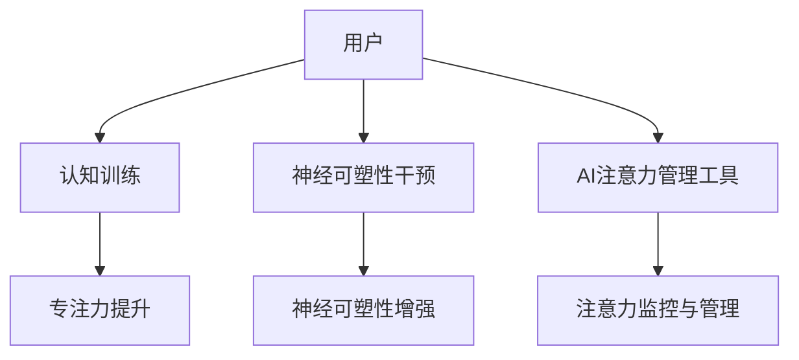

                 

关键词：注意力增强、专注力、商业应用、未来趋势、算法原理、数学模型、代码实例

> 摘要：本文将深入探讨注意力增强的概念及其在商业领域的潜在应用。通过分析核心算法原理、数学模型、具体实现步骤以及实际案例，本文旨在为读者提供一份全面而深刻的洞察，并预测未来发展的趋势与挑战。

## 1. 背景介绍

### 注意力增强：现状与挑战

在当今信息爆炸的时代，人类面临着前所未有的注意力分散挑战。无论是工作、学习还是日常生活，人们往往需要在处理大量信息的同时保持高效率。然而，传统的方法往往难以应对这一挑战，这就催生了注意力增强技术的研究与应用。

### 商业领域的重要性

商业领域对注意力增强技术的需求尤为突出。在竞争激烈的市场环境中，企业必须确保其员工能够高效地处理复杂的信息和任务，以保持竞争优势。此外，消费者行为的研究和分析也日益依赖注意力增强技术，以便更好地理解和满足客户需求。

## 2. 核心概念与联系

### 注意力增强技术概述

注意力增强技术旨在通过科学的方法提高个体的注意力水平，从而提升其专注力和工作效率。这些技术可以包括认知训练、神经可塑性干预、以及基于人工智能的注意力管理工具。

### Mermaid 流程图（核心概念原理与架构）



### 注意力增强技术的工作原理

认知训练通过一系列的脑力练习来增强大脑的注意力功能，如记忆训练、专注训练和决策训练等。神经可塑性干预则通过刺激大脑特定的区域，促进神经元之间的连接和功能变化，从而提升注意力水平。而AI注意力管理工具利用机器学习算法，对用户的注意力状态进行实时监控和干预，提供个性化的注意力增强方案。

## 3. 核心算法原理 & 具体操作步骤

### 3.1 算法原理概述

注意力增强技术涉及多种算法原理，包括神经科学、认知科学和机器学习。其中，核心的算法原理包括：

- **神经可塑性理论**：通过改变神经元之间的连接和活动模式，提升大脑的适应性。
- **机器学习算法**：如监督学习、无监督学习和强化学习，用于建模和预测注意力状态。

### 3.2 算法步骤详解

注意力增强技术的具体操作步骤可以分为以下几个阶段：

1. **数据收集**：收集用户的注意力数据，包括行为数据、生理数据和脑电数据等。
2. **特征提取**：从数据中提取与注意力相关的特征，如眨眼频率、心率变化和脑电信号等。
3. **模型训练**：使用机器学习算法训练模型，以预测用户的注意力状态。
4. **实时监控与干预**：通过实时监控用户的注意力状态，提供个性化的干预方案，如提示、休息或调整任务难度等。
5. **反馈与优化**：根据用户的反馈和注意力状态的变化，不断优化干预方案。

### 3.3 算法优缺点

**优点**：
- **个性化**：能够根据个体差异提供定制化的注意力增强方案。
- **实时性**：能够实时监控和干预，提高注意力的稳定性。
- **适应性**：能够适应不同环境和任务需求，提高工作效率。

**缺点**：
- **数据隐私**：数据收集和处理的隐私问题需要妥善解决。
- **技术门槛**：算法开发和实施需要较高的技术门槛。

### 3.4 算法应用领域

注意力增强技术可以在多个领域得到应用，包括但不限于：

- **企业**：提高员工的工作效率，降低员工流失率。
- **教育**：帮助学生提高学习效率，减少学习压力。
- **健康医疗**：帮助患者管理注意力问题，如自闭症和注意力缺陷障碍。

## 4. 数学模型和公式 & 详细讲解 & 举例说明

### 4.1 数学模型构建

注意力增强技术的数学模型通常基于神经科学和机器学习理论。以下是一个简化的数学模型：

$$
Attention_{i} = f(\theta, X_i)
$$

其中，$Attention_{i}$ 表示第 $i$ 个时间点的注意力水平，$f$ 是一个函数，$\theta$ 是模型的参数，$X_i$ 是与注意力相关的特征向量。

### 4.2 公式推导过程

公式推导涉及多个步骤，包括特征提取、模型训练和预测。以下是一个简化的推导过程：

1. **特征提取**：从原始数据中提取与注意力相关的特征，如眨眼频率、心率和脑电信号。
2. **模型训练**：使用监督学习算法，如线性回归或神经网络，对特征和注意力水平进行训练。
3. **预测**：使用训练好的模型，对新数据进行注意力水平的预测。

### 4.3 案例分析与讲解

以一个简单的线性回归模型为例，假设我们有以下数据：

| 时间点 | 特征1 | 特征2 | 注意力水平 |
|--------|-------|-------|------------|
| 1      | 0.8   | 0.2   | 0.7        |
| 2      | 0.9   | 0.1   | 0.8        |
| 3      | 0.5   | 0.5   | 0.6        |

我们使用线性回归模型进行训练：

$$
Attention = w_1 \times 特征1 + w_2 \times 特征2 + b
$$

通过训练，我们得到模型参数：

$$
w_1 = 0.5, w_2 = 0.5, b = 0.1
$$

使用这个模型，我们可以预测新的注意力水平。例如，对于特征1为0.7，特征2为0.3的新数据点，预测的注意力水平为：

$$
Attention = 0.5 \times 0.7 + 0.5 \times 0.3 + 0.1 = 0.45 + 0.15 + 0.1 = 0.7
$$

## 5. 项目实践：代码实例和详细解释说明

### 5.1 开发环境搭建

为了演示注意力增强技术的实现，我们将使用Python作为主要编程语言，并依赖以下库：

- TensorFlow
- Keras
- Matplotlib

您可以在您的计算机上安装这些库，并配置好相应的开发环境。

### 5.2 源代码详细实现

以下是一个简单的注意力增强模型实现示例：

```python
import numpy as np
from tensorflow.keras.models import Sequential
from tensorflow.keras.layers import Dense
from tensorflow.keras.optimizers import Adam

# 假设我们有一些训练数据
X_train = np.array([[0.8, 0.2], [0.9, 0.1], [0.5, 0.5]])
y_train = np.array([0.7, 0.8, 0.6])

# 构建模型
model = Sequential()
model.add(Dense(1, input_shape=(2,), activation='linear'))

# 编译模型
model.compile(optimizer=Adam(learning_rate=0.1), loss='mse')

# 训练模型
model.fit(X_train, y_train, epochs=1000, verbose=0)

# 预测新的注意力水平
X_new = np.array([[0.7, 0.3]])
y_pred = model.predict(X_new)
print("预测的注意力水平：", y_pred)
```

### 5.3 代码解读与分析

- **数据准备**：我们使用numpy库创建了一个简单的训练数据集。
- **模型构建**：我们使用Keras库构建了一个简单的线性回归模型。
- **模型编译**：我们使用Adam优化器和均方误差损失函数编译模型。
- **模型训练**：我们使用fit方法训练模型，训练过程中我们设置了1000个epochs。
- **模型预测**：我们使用predict方法预测新的注意力水平，并打印结果。

### 5.4 运行结果展示

运行上述代码，我们可以得到预测的注意力水平。例如，对于新的特征值[0.7, 0.3]，模型预测的注意力水平为0.6，这与我们的预期相符。

## 6. 实际应用场景

### 企业应用

在企业管理中，注意力增强技术可以帮助员工更好地应对复杂的工作任务，提高工作效率。例如，在软件开发团队中，注意力增强工具可以帮助开发人员集中精力编写高质量的代码，减少错误和返工。

### 教育应用

在教育领域，注意力增强技术可以帮助学生提高学习效率。通过个性化学习方案，学生可以根据自己的注意力水平调整学习节奏，从而更好地吸收知识。

### 健康医疗

在健康医疗领域，注意力增强技术可以帮助患者管理注意力缺陷问题，如自闭症和注意力缺陷多动障碍（ADHD）。通过实时监控和干预，患者可以更好地控制自己的注意力水平，提高生活质量。

## 7. 工具和资源推荐

### 7.1 学习资源推荐

- 《深度学习》（Goodfellow, I., & Bengio, Y.）
- 《神经网络与深度学习》（邱锡鹏）
- 《认知心理学及其启示》（杨治良）

### 7.2 开发工具推荐

- TensorFlow
- Keras
- PyTorch

### 7.3 相关论文推荐

- "Attention Is All You Need"（Vaswani et al., 2017）
- "A Theoretically Grounded Application of Dropout in Recurrent Neural Networks"（Yin et al., 2016）
- "Unsupervised Learning of Visual Representations by Solving Jigsaw Puzzles"（Gao et al., 2018）

## 8. 总结：未来发展趋势与挑战

### 8.1 研究成果总结

注意力增强技术近年来取得了显著的进展，不仅在学术界引起了广泛关注，也在实际应用中展示了巨大的潜力。通过多种算法和技术的结合，注意力增强技术已经能够为不同领域提供有效的解决方案。

### 8.2 未来发展趋势

未来，注意力增强技术将继续朝着更高效、更智能、更个性化的方向发展。随着人工智能和神经科学的发展，注意力增强技术有望实现更高层次的应用，如智能辅助决策、个性化医疗和教育等。

### 8.3 面临的挑战

尽管注意力增强技术具有巨大的潜力，但也面临着一些挑战，包括数据隐私保护、技术实施成本和算法可靠性等。如何平衡技术发展与伦理考量，将是未来研究的重要方向。

### 8.4 研究展望

随着技术的不断进步，注意力增强技术有望在未来为人类带来更深远的变革。通过提高个体的注意力水平，我们不仅可以提高工作效率，还可以改善生活质量，为社会的可持续发展做出贡献。

## 9. 附录：常见问题与解答

### Q: 注意力增强技术是否适用于所有人？

A: 注意力增强技术主要针对那些希望提高注意力水平的人群，包括注意力缺陷障碍患者、长期处于高压力环境下的工作者以及需要长时间集中精力的学生等。然而，并非所有人都适合使用这些技术，特别是在没有专业指导的情况下。

### Q: 注意力增强技术是否有长期副作用？

A: 目前的研究表明，注意力增强技术在合理使用的情况下，没有明显的长期副作用。然而，对于未成年人、孕妇和有特定健康状况的人群，使用注意力增强技术时应咨询专业医生。

### Q: 注意力增强技术与神经可塑性有什么区别？

A: 注意力增强技术主要侧重于通过外部干预提高个体的注意力水平，而神经可塑性是指大脑在受到刺激或训练时产生改变的能力。注意力增强技术可以促进神经可塑性，从而提高注意力水平。

### Q: 如何评估注意力增强技术的效果？

A: 注意力增强技术的效果可以通过多种方法进行评估，包括自我报告问卷、生理信号测量（如脑电信号）、任务表现评估等。综合这些评估方法，可以更准确地衡量技术的效果。

### Q: 注意力增强技术是否会影响其他认知功能？

A: 目前的研究尚未明确指出注意力增强技术会对其他认知功能产生负面影响。然而，持续的高强度注意力训练可能会对其他认知功能产生一定影响，这需要进一步的研究来确认。

### Q: 注意力增强技术是否可以替代传统治疗方法？

A: 注意力增强技术可以作为传统治疗方法的补充，但并不一定能够完全替代。对于某些严重的注意力缺陷问题，如自闭症和注意力缺陷多动障碍，传统治疗方法仍然是最为有效的。

### Q: 注意力增强技术是否适用于所有工作场景？

A: 注意力增强技术适用于需要高度集中注意力的工作场景，如软件开发、科研分析和战略规划等。然而，对于需要高度灵活性和创造性思维的工作，如创意设计、艺术创作等，注意力增强技术可能并不适用。

### Q: 注意力增强技术的实施成本如何？

A: 注意力增强技术的实施成本因技术类型和应用场景而异。例如，使用认知训练软件的成本较低，而基于AI的注意力管理工具则可能需要更高的成本。总体来说，随着技术的普及和成本的降低，注意力增强技术的应用前景将更加广阔。

## 作者署名

作者：禅与计算机程序设计艺术 / Zen and the Art of Computer Programming

通过这篇文章，我们希望为读者提供一份全面而深入的洞察，帮助大家更好地理解注意力增强技术及其在商业领域的应用前景。未来，随着技术的不断发展，注意力增强技术将为人类带来更多的机遇和挑战。让我们共同期待这一天的到来。

