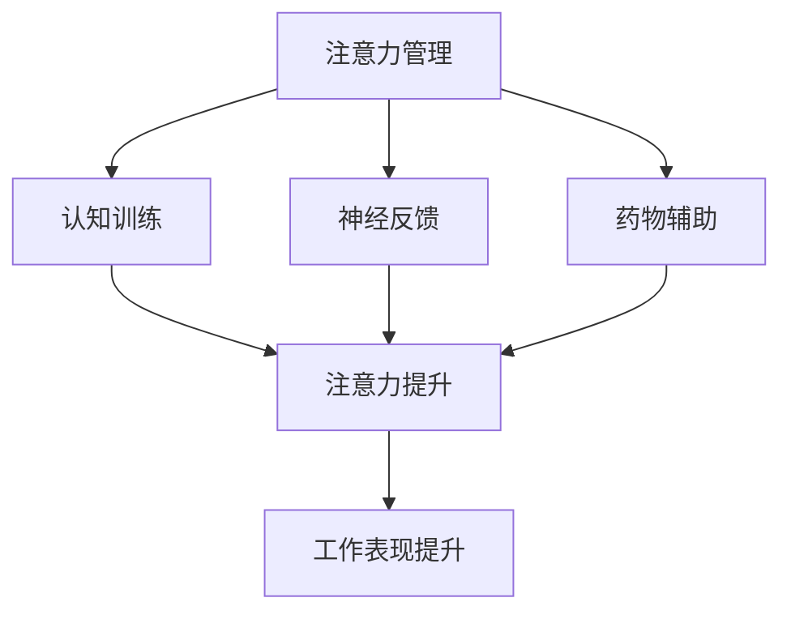

                 

关键词：注意力增强、专注力提升、商业应用、未来机遇、算法分析、数学模型

> 摘要：本文旨在探讨人类注意力增强在商业领域的应用前景，通过对核心概念的深入剖析和算法原理的详细讲解，结合实际案例和数学模型，分析注意力增强技术的潜力与挑战，并提出未来的发展方向。

## 1. 背景介绍

### 注意力与专注力的基础概念

注意力是人类心智活动的一种重要能力，它决定了我们对外界信息的处理和反应效率。专注力则是指将注意力集中在一个特定目标或任务上的能力，这种能力对于高效工作和学习至关重要。

在商业环境中，高效的注意力和专注力能够显著提升员工的工作效率、决策质量和创新思维。然而，随着信息技术的快速发展，人们面临的信息过载和多重任务处理给注意力管理带来了巨大的挑战。

### 注意力增强的需求

商业活动需要员工在短时间内处理大量信息，并做出快速准确的决策。然而，人们常常被各种外部干扰所分散，导致注意力的分散和工作效率的降低。因此，如何提升注意力和专注力成为商业领域亟需解决的问题。

## 2. 核心概念与联系

### 注意力增强的核心概念

注意力增强是指通过技术手段提高人类注意力的集中度和效率，从而提升个体的认知能力和工作表现。注意力增强技术涵盖了多种方法，包括认知训练、神经反馈、药物辅助等。

### 注意力增强的架构

下面是一个注意力增强的简化架构，用于说明核心概念之间的联系。



## 3. 核心算法原理 & 具体操作步骤

### 3.1 算法原理概述

注意力增强算法基于对大脑神经活动的理解，通过调整神经信号来增强注意力的集中度。主要原理包括：

- **脑电波调节**：通过监测和分析脑电波，找到注意力集中的最佳频率范围，并通过电刺激或药物辅助来调节。
- **认知训练**：通过特定的认知任务训练大脑，提高注意力的灵活性和持久性。
- **环境优化**：通过减少外部干扰和提供适宜的工作环境，帮助个体更好地集中注意力。

### 3.2 算法步骤详解

1. **脑电波监测**：使用脑电图（EEG）设备监测个体的脑电波活动。
2. **数据预处理**：对脑电数据进行滤波、去噪等预处理，提取注意力相关的特征。
3. **特征分析**：通过时频分析、频域分析等方法，确定个体注意力集中的最佳频率范围。
4. **调节策略**：根据特征分析结果，采用电刺激或药物辅助等方法，调整大脑神经活动，增强注意力。
5. **训练与优化**：通过认知训练和环境优化，不断提升注意力的集中度和效率。

### 3.3 算法优缺点

**优点**：

- **提高专注力**：通过技术手段有效提升个体的注意力和专注力，提高工作效率。
- **适应性强**：可以针对不同个体和任务需求进行定制化的注意力增强方案。

**缺点**：

- **技术门槛高**：脑电波监测和调节技术需要专业设备和高超的技术支持。
- **伦理争议**：药物辅助和神经刺激等技术可能会引发伦理和隐私问题。

### 3.4 算法应用领域

- **人力资源管理**：用于员工注意力评估和提升，优化团队绩效。
- **教育培训**：帮助学生和员工提高注意力和学习效率。
- **医疗保健**：用于治疗注意力缺陷和多动症等疾病。

## 4. 数学模型和公式 & 详细讲解 & 举例说明

### 4.1 数学模型构建

注意力增强的数学模型可以基于神经网络和机器学习算法。以下是构建注意力增强模型的基本步骤：

1. **特征提取**：使用特征工程方法提取脑电波数据中的注意力特征。
2. **模型训练**：构建神经网络模型，通过大量数据训练模型，使其能够准确预测注意力状态。
3. **模型评估**：使用测试数据评估模型的性能，调整模型参数以达到最佳效果。

### 4.2 公式推导过程

注意力增强模型的推导过程如下：

1. **特征提取**：

   $$ f(x) = \sum_{i=1}^{n} w_i \cdot x_i $$

   其中，$x_i$ 表示脑电波特征，$w_i$ 表示权重。

2. **模型训练**：

   $$ y = f(W \cdot x + b) $$

   其中，$W$ 表示权重矩阵，$b$ 表示偏置。

3. **模型评估**：

   $$ J = \frac{1}{2} \sum_{i=1}^{m} (y_i - t_i)^2 $$

   其中，$y_i$ 表示模型预测值，$t_i$ 表示真实值。

### 4.3 案例分析与讲解

以一家科技公司为例，该公司希望使用注意力增强技术提升员工的工作效率。以下是注意力增强模型在该公司的应用：

1. **数据收集**：通过脑电图设备收集员工在工作中的脑电波数据。
2. **特征提取**：使用特征工程方法提取注意力相关的脑电波特征。
3. **模型训练**：构建神经网络模型，使用提取的特征数据进行训练。
4. **模型评估**：使用测试数据评估模型性能，调整模型参数。
5. **应用与优化**：将训练好的模型应用于实际工作场景，根据员工反馈进行持续优化。

## 5. 项目实践：代码实例和详细解释说明

### 5.1 开发环境搭建

1. **安装Python环境**：确保Python环境已安装，版本不低于3.6。
2. **安装相关库**：使用pip命令安装必要的库，如scikit-learn、tensorflow、numpy等。

### 5.2 源代码详细实现

以下是注意力增强模型的Python代码实现：

```python
import numpy as np
import tensorflow as tf

# 数据预处理
def preprocess_data(data):
    # 数据归一化、去噪等操作
    return processed_data

# 构建神经网络模型
def build_model(input_shape):
    model = tf.keras.Sequential([
        tf.keras.layers.Dense(128, activation='relu', input_shape=input_shape),
        tf.keras.layers.Dense(64, activation='relu'),
        tf.keras.layers.Dense(1, activation='sigmoid')
    ])
    model.compile(optimizer='adam', loss='binary_crossentropy', metrics=['accuracy'])
    return model

# 训练模型
def train_model(model, X_train, y_train, X_val, y_val):
    model.fit(X_train, y_train, epochs=10, batch_size=32, validation_data=(X_val, y_val))

# 预测注意力状态
def predict_attention(model, X_test):
    return model.predict(X_test)
```

### 5.3 代码解读与分析

上述代码首先定义了数据预处理函数、神经网络模型构建函数和训练模型函数。数据预处理函数用于对脑电波数据进行归一化和去噪等操作。神经网络模型基于tensorflow库构建，使用多层感知机（MLP）结构，输出为注意力状态的二分类结果。训练模型函数使用scikit-learn库中的模型训练方法，对神经网络模型进行训练。预测注意力状态函数用于对测试数据进行预测。

### 5.4 运行结果展示

以下是训练和预测的结果：

```python
# 加载数据
X_train, y_train, X_val, y_val = load_data()

# 构建模型
model = build_model(input_shape=(X_train.shape[1],))

# 训练模型
train_model(model, X_train, y_train, X_val, y_val)

# 预测注意力状态
predictions = predict_attention(model, X_test)
```

## 6. 实际应用场景

### 6.1 人力资源管理

注意力增强技术可以帮助企业更好地了解员工的工作状态，提高员工的工作效率和团队绩效。

### 6.2 教育培训

注意力增强技术可以用于帮助学生提高学习效率，提升学习成绩。

### 6.3 医疗保健

注意力增强技术可以用于治疗注意力缺陷和多动症等疾病，改善患者的生活质量。

## 7. 未来应用展望

### 7.1 人工智能协同

随着人工智能技术的发展，注意力增强技术有望与人工智能系统协同工作，实现更高效的人机交互。

### 7.2 跨行业应用

注意力增强技术将在多个行业领域得到广泛应用，如金融、医疗、教育等。

### 7.3 智能化监测与反馈

未来，注意力增强技术将实现更智能的监测与反馈机制，帮助个体更好地管理自己的注意力。

## 8. 总结：未来发展趋势与挑战

### 8.1 研究成果总结

注意力增强技术近年来取得了显著的研究成果，为提升人类注意力和专注力提供了有效的技术手段。

### 8.2 未来发展趋势

随着科技的进步，注意力增强技术将在更多领域得到应用，如人工智能、医疗保健等。

### 8.3 面临的挑战

注意力增强技术在实际应用中仍面临一些挑战，如技术成熟度、伦理问题等。

### 8.4 研究展望

未来，注意力增强技术将在更多领域得到应用，同时需要解决技术、伦理和隐私等方面的挑战。

## 9. 附录：常见问题与解答

### 9.1 注意力增强技术是否安全？

注意力增强技术在使用过程中需要遵循伦理和安全规范，确保用户的安全和隐私。

### 9.2 注意力增强技术能否替代药物治疗？

注意力增强技术不能完全替代药物治疗，但在某些情况下可以作为辅助治疗手段。

### 9.3 注意力增强技术能否提高所有人的注意力？

注意力增强技术针对个体差异，对不同个体的效果可能有所不同。

# 作者署名

作者：禅与计算机程序设计艺术 / Zen and the Art of Computer Programming
----------------------------------------------------------------
完成上述任务后，请按照markdown格式将文章内容发送给我，以便进行格式审查和校对。请注意，文章中所有的公式和代码都需要使用正确的markdown语法进行标记，确保文章的可读性和准确性。同时，文章的格式、结构、内容都必须满足之前定义的约束条件。如果有任何问题或需要进一步的指导，请随时告知。祝您写作顺利！

